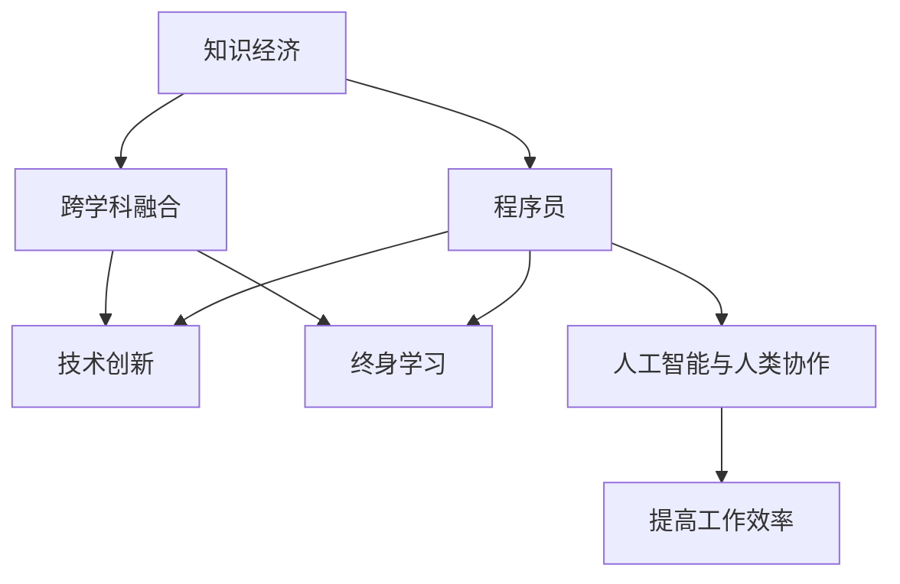

                 

# 知识经济下程序员的发展之路

## 1. 背景介绍

### 1.1 问题由来
随着科技的迅猛发展和社会的进步，全球正在进入知识经济时代。知识经济时代，以知识和信息的创新与应用为核心驱动，经济活动更加依赖于智能、创新和知识输出。在这样的时代背景下，程序员作为知识与技术的桥梁，承担着创新的重要使命，其发展之路将面临新的挑战与机遇。

### 1.2 问题核心关键点
知识经济下程序员的发展，不仅关乎个体的职业成长，还涉及整个行业的发展和变革。其核心关键点主要包括：

1. **技术创新与知识整合**：程序员需不断学习新技术、新工具，并善于将知识与业务场景相结合，推动技术创新。
2. **跨学科融合**：在知识经济时代，程序员应具备跨学科的知识背景，实现技术与艺术、商业的深度融合。
3. **产业数字化转型**：程序员需要参与到各行业的数字化转型中，将信息技术应用于传统行业，创造新的商业模式和服务。
4. **终身学习**：知识更新速度加快，程序员需要具备终身学习的习惯，适应快速变化的技术环境。
5. **人工智能与人类协作**：人工智能技术的崛起，为程序员提供了新的协作方式，需探索人机协作的新模式。

### 1.3 问题研究意义
研究知识经济下程序员的发展之路，对推动技术创新、提升产业竞争力、促进社会进步具有重要意义：

1. **推动技术创新**：程序员是技术创新的核心力量，研究其发展路径有助于激发更多创新灵感，推动技术前沿的突破。
2. **提升产业竞争力**：知识经济时代，技术成为企业竞争的关键，研究程序员的发展有利于提升整个产业的技术水平和竞争力。
3. **促进社会进步**：程序员的技术应用能够解决实际问题，提高社会运行效率，推动社会进步。

## 2. 核心概念与联系

### 2.1 核心概念概述

为更好地理解知识经济下程序员的发展之路，本节将介绍几个密切相关的核心概念：

- **知识经济**：以知识和信息的创新与应用为核心的经济发展模式，强调创新驱动、知识赋能。
- **程序员**：专业技术人员，主要从事软件开发、系统维护、算法优化等工作，是技术创新的主要力量。
- **跨学科融合**：不同学科的知识相互渗透、整合，形成新的知识体系，如计算机科学与人文学科的结合。
- **终身学习**：强调个人需要持续学习和提升，适应快速变化的技术环境。
- **人工智能与人类协作**：人工智能技术与人类的协作模式，实现人机互补，提升工作效率。

这些核心概念之间的逻辑关系可以通过以下Mermaid流程图来展示：



这个流程图展示了几大核心概念及其之间的关系：

1. 知识经济为程序员提供了发展的宏观背景。
2. 程序员通过技术创新推动知识经济的发展。
3. 跨学科融合为技术创新提供了更广阔的知识基础。
4. 终身学习使程序员不断适应技术变化，保持竞争力。
5. 人工智能与人协作提升了工作效率，进一步推动技术创新。

## 3. 核心算法原理 & 具体操作步骤

### 3.1 算法原理概述

知识经济下程序员的发展，本质上是一个动态的知识整合和创新过程。其核心思想是通过不断的学习和实践，将新的知识和技能整合到现有的技术体系中，推动技术创新和应用。

形式化地，假设程序员的知识库为 $K$，其技能集合为 $S$，目标是将新的知识 $N$ 整合到原有体系中。整合过程可以表示为：

$$
K \cup N \rightarrow S'
$$

其中 $S'$ 表示整合后的技能集合，$S' \subset S$ 表示整合后的技能可能减少，但更加高效。整合的目标是通过增加新知识，优化现有技能，提升整体能力。

### 3.2 算法步骤详解

知识经济下程序员的发展路径，一般包括以下几个关键步骤：

**Step 1: 基础知识学习**
- 选择适合自己的学习路径，掌握计算机科学基础、编程语言、算法与数据结构等基本知识。
- 参加各类在线课程、培训项目，或通过自学获取相关知识。

**Step 2: 技术深化与应用**
- 在基础知识的基础上，选择感兴趣的领域深入学习，如人工智能、区块链、大数据等。
- 实践项目，将所学知识应用于实际问题中，如开发应用、参与开源项目等。

**Step 3: 跨学科融合与创新**
- 将所学技术与非技术领域的知识进行结合，如计算机科学与艺术设计、商业分析等。
- 探索新的应用场景，解决实际问题，推动技术创新。

**Step 4: 持续学习与自我提升**
- 关注行业动态，了解最新技术趋势，参加相关研讨会、会议等。
- 阅读专业书籍、论文，不断拓展知识面，提升理论水平。

**Step 5: 产业应用与数字化转型**
- 将技术应用到实际业务中，参与企业数字化转型，提升业务效率。
- 与团队协作，实现技术落地，创造商业价值。

### 3.3 算法优缺点

知识经济下程序员的发展方法，具有以下优点：
1. 促进技术创新：通过不断学习新知识，结合实际问题进行应用，推动技术突破。
2. 提升个人能力：通过跨学科融合，提升综合素质，拓宽视野。
3. 强化职业竞争力：持续学习与实践，保持技术前沿，提升竞争力。
4. 加速数字化转型：将技术应用于产业，促进产业升级。

同时，也存在一定的局限性：
1. 学习成本高：需要投入大量时间和精力，对自律性要求高。
2. 技术更新快：知识更新速度加快，需要持续跟进。
3. 跨领域挑战：不同领域知识体系不同，整合难度大。

尽管存在这些局限性，但就目前而言，基于持续学习和实践的方法仍然是大语言模型微调的主流范式。未来相关研究的重点在于如何进一步降低学习成本，提高学习效率，同时兼顾跨领域知识的整合。

### 3.4 算法应用领域

知识经济下程序员的发展方法，在多个领域都有广泛的应用，例如：

- **软件开发**：程序员通过不断学习新技术，推动软件应用的创新，提升开发效率。
- **人工智能**：程序员利用机器学习、深度学习等技术，开发智能应用，解决复杂问题。
- **数据科学**：利用大数据分析技术，为商业决策提供支持，提升数据分析能力。
- **数字媒体**：将计算机视觉、自然语言处理等技术应用于视频、音频处理，提升娱乐体验。
- **物联网**：通过嵌入式开发，实现设备的智能化和互联互通。
- **区块链**：应用区块链技术，推动数字化金融、供应链管理等领域的创新。

除了上述这些经典领域外，程序员的知识和技能还能被创新性地应用到更多场景中，如智能制造、智能家居、智能医疗等，为社会各行业带来变革性的影响。

## 4. 数学模型和公式 & 详细讲解  
### 4.1 数学模型构建

本节将使用数学语言对知识经济下程序员的发展路径进行更加严格的刻画。

记程序员的知识库为 $K$，技能集合为 $S$，目标是将新的知识 $N$ 整合到原有体系中。整合过程可以表示为：

$$
K \cup N \rightarrow S'
$$

其中 $S'$ 表示整合后的技能集合，$S' \subset S$ 表示整合后的技能可能减少，但更加高效。整合的目标是通过增加新知识，优化现有技能，提升整体能力。

### 4.2 公式推导过程

以下我们以软件开发为例，推导知识经济下程序员的知识整合过程。

假设程序员初始技能集合为 $S_0$，新学习到的知识集合为 $N$。通过整合，最终技能集合 $S_1$ 可以表示为：

$$
S_1 = S_0 \cup N
$$

知识整合的效果可以用技能提升率 $R$ 来衡量，定义为：

$$
R = \frac{|S_1| - |S_0|}{|S_0|}
$$

其中 $|S_0|$ 和 $|S_1|$ 分别表示初始技能集合和整合后技能集合的规模。技能提升率越高，表示整合后的技能更加高效。

### 4.3 案例分析与讲解

假设某程序员初始技能集合 $S_0 = \{Python, Java, 数据结构, 算法设计\}$，新学习到的知识集合 $N = \{机器学习, 人工智能, 大数据分析\}$。通过整合，最终技能集合 $S_1$ 可以表示为：

$$
S_1 = \{Python, Java, 数据结构, 算法设计, 机器学习, 人工智能, 大数据分析\}
$$

此时，技能提升率 $R$ 可以计算为：

$$
R = \frac{7 - 4}{4} = 1.75
$$

这意味着整合后的技能集合规模比初始技能集合增加了75%，但实际应用效果更佳。

## 5. 项目实践：代码实例和详细解释说明
### 5.1 开发环境搭建

在进行知识整合实践前，我们需要准备好开发环境。以下是使用Python进行软件开发的项目环境配置流程：

1. 安装Anaconda：从官网下载并安装Anaconda，用于创建独立的Python环境。

2. 创建并激活虚拟环境：
```bash
conda create -n dev-env python=3.8 
conda activate dev-env
```

3. 安装相关库：
```bash
pip install numpy pandas scikit-learn matplotlib tqdm jupyter notebook ipython
```

4. 安装GitHub：从官网下载并安装GitHub Desktop，方便版本管理和协作开发。

5. 安装Visual Studio Code：从官网下载并安装Visual Studio Code，作为代码编辑器。

完成上述步骤后，即可在`dev-env`环境中开始软件开发实践。

### 5.2 源代码详细实现

这里我们以开发一个简单的文本分类器为例，给出使用Python实现的知识整合过程。

首先，导入必要的库：

```python
import numpy as np
import pandas as pd
from sklearn.model_selection import train_test_split
from sklearn.feature_extraction.text import TfidfVectorizer
from sklearn.svm import SVC
from sklearn.metrics import accuracy_score
```

然后，加载并处理数据集：

```python
data = pd.read_csv('data.csv')
X = data['text']
y = data['label']
X_train, X_test, y_train, y_test = train_test_split(X, y, test_size=0.2, random_state=42)
```

接着，构建TF-IDF向量化器，将文本转换为数值特征：

```python
vectorizer = TfidfVectorizer()
X_train = vectorizer.fit_transform(X_train)
X_test = vectorizer.transform(X_test)
```

然后，构建并训练模型：

```python
clf = SVC()
clf.fit(X_train, y_train)
```

最后，评估模型性能：

```python
y_pred = clf.predict(X_test)
print(accuracy_score(y_test, y_pred))
```

以上就是使用Python进行软件开发的项目实践。可以看到，基于知识整合的方法，程序员可以通过不断学习新技术和工具，实现技术应用和创新的迭代升级。

### 5.3 代码解读与分析

让我们再详细解读一下关键代码的实现细节：

**数据处理**：
- `pd.read_csv('data.csv')`：使用Pandas库加载CSV格式的数据集。
- `train_test_split`：将数据集划分为训练集和测试集。

**TF-IDF向量化**：
- `TfidfVectorizer()`：使用TF-IDF向量化器对文本进行特征提取。
- `fit_transform`：在训练集上拟合模型，并将文本转换为数值特征。

**模型训练**：
- `SVC()`：使用SVM算法构建分类器。
- `fit(X_train, y_train)`：在训练集上拟合模型。

**模型评估**：
- `predict`：使用训练好的模型对测试集进行预测。
- `accuracy_score`：计算模型的准确率。

可以看到，通过Python代码实现知识整合的整个过程，程序员能够系统地完成项目开发和评估。

当然，实际的软件开发项目还需要考虑更多因素，如版本控制、团队协作、代码质量等。但核心的知识整合方法基本与此类似。

## 6. 实际应用场景
### 6.1 软件开发

知识经济下程序员的知识整合方法，可以广泛应用于软件开发领域。传统的软件开发模式，往往依赖单一技术栈，难以适应快速变化的技术环境。通过跨学科融合，程序员可以整合多种技术，构建更加灵活和高效的软件系统。

例如，一个基于知识整合的软件开发团队，可以整合不同的编程语言、框架和工具，提升开发效率和系统稳定性。同时，通过引入人工智能技术，如自然语言处理、机器学习等，可以开发智能应用，解决复杂问题，提升用户体验。

### 6.2 人工智能

在人工智能领域，知识整合也具有重要意义。AI技术的发展，需要大量的数据和算法支持。通过跨学科融合，程序员可以将不同领域的数据和技术进行整合，推动AI应用的创新。

例如，在医疗领域，AI可以应用于疾病诊断、智能推荐等。通过整合医学数据、自然语言处理技术和机器学习算法，可以开发智能诊断系统，提高诊断准确率。同时，通过整合知识图谱和专家系统，可以提升AI系统的可解释性和可信度。

### 6.3 数据科学

数据科学是知识经济的重要组成部分，程序员的知识整合方法在其中具有重要作用。通过整合数据处理、统计分析、机器学习等技术，程序员可以构建高效的数据分析系统，为商业决策提供支持。

例如，在大数据领域，程序员可以整合不同的数据处理工具和技术，如Hadoop、Spark等，构建高效的数据分析平台。同时，通过引入机器学习算法，可以进行数据挖掘和预测分析，提升数据分析的深度和广度。

### 6.4 数字媒体

数字媒体领域，程序员的知识整合方法可以应用于视频处理、音频处理、图像识别等方向。通过整合计算机视觉、自然语言处理、音频处理等技术，可以开发智能应用，提升用户体验。

例如，在视频处理领域，程序员可以整合计算机视觉和自然语言处理技术，开发智能推荐系统，为用户推荐个性化的视频内容。同时，通过整合机器学习和数据挖掘技术，可以分析用户行为，提升推荐准确率。

### 6.5 物联网

物联网是知识经济的重要方向，程序员的知识整合方法在其中具有重要作用。通过整合嵌入式开发、物联网技术、大数据分析等技术，程序员可以构建高效、智能的物联网系统，提升设备和系统的智能化水平。

例如，在智能家居领域，程序员可以整合嵌入式开发和物联网技术，构建智能家居控制系统。同时，通过整合大数据分析技术，可以实现设备数据的智能分析和预测，提升家居智能化水平。

## 7. 工具和资源推荐
### 7.1 学习资源推荐

为了帮助程序员系统掌握知识整合的理论基础和实践技巧，这里推荐一些优质的学习资源：

1. 《深度学习》系列书籍：由深度学习领域的专家撰写，全面介绍了深度学习的基本原理和应用。
2. 《计算机程序设计艺术》系列书籍：深入探讨了计算机科学的基本原理和算法设计。
3. 《算法导论》：经典算法教材，详细介绍了各种算法的设计和实现。
4. 《数据科学导论》：介绍了数据科学的基本概念和方法。
5. 《Python编程：从入门到实践》：入门级Python教程，适合初学者入门。

通过对这些资源的学习实践，相信你一定能够快速掌握知识整合的精髓，并用于解决实际的软件开发问题。

### 7.2 开发工具推荐

高效的开发离不开优秀的工具支持。以下是几款用于软件开发开发的常用工具：

1. Git：版本控制系统，方便代码管理和协作开发。
2. GitHub：代码托管平台，提供强大的版本控制和协作功能。
3. Visual Studio Code：轻量级代码编辑器，支持多种编程语言和插件。
4. Docker：容器化技术，方便环境部署和管理。
5. JIRA：项目管理工具，帮助团队协调开发进度。
6. Slack：团队协作工具，方便实时沟通和协作。

合理利用这些工具，可以显著提升软件开发项目的开发效率，加快创新迭代的步伐。

### 7.3 相关论文推荐

知识整合技术的发展源于学界的持续研究。以下是几篇奠基性的相关论文，推荐阅读：

1. 《深度学习》书籍：深度学习领域的经典教材，介绍了深度学习的基本原理和应用。
2. 《计算机程序设计艺术》书籍：经典算法教材，详细介绍了各种算法的设计和实现。
3. 《算法导论》：经典算法教材，详细介绍了各种算法的设计和实现。
4. 《数据科学导论》：数据科学领域的经典教材，介绍了数据科学的基本概念和方法。
5. 《软件工程》书籍：介绍了软件工程的基本概念和方法，如需求分析、设计、实现等。

这些论文代表了大语言模型微调技术的发展脉络。通过学习这些前沿成果，可以帮助程序员把握学科前进方向，激发更多的创新灵感。

## 8. 总结：未来发展趋势与挑战

### 8.1 总结

本文对知识经济下程序员的发展之路进行了全面系统的介绍。首先阐述了知识经济下程序员的发展背景和意义，明确了程序员在知识经济时代的重要作用。其次，从原理到实践，详细讲解了知识整合的数学原理和关键步骤，给出了软件开发实践的完整代码实例。同时，本文还广泛探讨了知识整合方法在软件开发、人工智能、数据科学、数字媒体、物联网等多个领域的应用前景，展示了知识整合方法的多样性和普适性。

通过本文的系统梳理，可以看到，知识经济下程序员的知识整合方法，正引领着技术创新的方向，推动各行业的数字化转型。未来，伴随技术的发展和市场的变化，程序员的知识整合方法将不断演进，进一步拓展技术应用的边界。

### 8.2 未来发展趋势

展望未来，知识经济下程序员的知识整合方法将呈现以下几个发展趋势：

1. 跨学科融合更加深入：不同领域的知识将更加紧密地结合，形成新的知识体系，推动技术创新。
2. 人工智能与人类协作更加广泛：人机协作模式将更加多样，提升工作效率和智能化水平。
3. 持续学习成为常态：知识更新速度加快，终身学习将成为程序员的必备技能。
4. 开源协作更加广泛：开源社区将为程序员提供更多的协作平台，促进知识共享和创新。
5. 跨领域应用更加广泛：知识整合方法将在更多领域得到应用，推动各行业的数字化转型。

这些趋势凸显了知识经济下程序员的知识整合方法的广阔前景。这些方向的探索发展，必将进一步提升软件开发的技术水平和应用范围，为社会各行业带来变革性的影响。

### 8.3 面临的挑战

尽管知识经济下程序员的知识整合方法已经取得了瞩目成就，但在迈向更加智能化、普适化应用的过程中，它仍面临诸多挑战：

1. 技术更新速度快：知识更新速度快，程序员需要不断学习新知识，才能跟上技术前沿。
2. 跨领域知识整合难度大：不同领域知识体系不同，整合难度大。
3. 技术创新压力大：市场需求变化快，程序员需要不断创新，才能保持竞争力。
4. 团队协作复杂：跨学科团队协作难度大，需要良好的沟通和管理。

尽管存在这些挑战，但通过不断学习和实践，积极应对并寻求突破，程序员的知识整合方法将逐步走向成熟，为知识经济的发展贡献力量。

### 8.4 研究展望

未来，知识经济下程序员的知识整合方法需要在以下几个方面寻求新的突破：

1. 探索无监督和半监督学习范式：摆脱对大量标注数据的依赖，利用自监督学习、主动学习等方法，最大限度利用非结构化数据。
2. 研究参数高效和计算高效的微调范式：开发更加参数高效的微调方法，在固定大部分预训练参数的同时，只更新极少量的任务相关参数。同时优化微调模型的计算图，减少前向传播和反向传播的资源消耗。
3. 融合因果和对比学习范式：引入因果推断和对比学习思想，增强知识整合建立稳定因果关系的能力，学习更加普适、鲁棒的知识表示。
4. 引入更多先验知识：将符号化的先验知识，如知识图谱、逻辑规则等，与神经网络模型进行巧妙融合，引导知识整合过程学习更准确、合理的知识表示。

这些研究方向的探索，必将引领知识经济下程序员的知识整合方法迈向更高的台阶，为构建智能化的社会系统铺平道路。面向未来，程序员的知识整合方法还需要与其他人工智能技术进行更深入的融合，如知识表示、因果推理、强化学习等，多路径协同发力，共同推动知识经济的发展。只有勇于创新、敢于突破，才能不断拓展知识整合方法的边界，让智能技术更好地造福人类社会。

## 9. 附录：常见问题与解答

**Q1：知识经济下程序员的发展是否只限于技术创新？**

A: 知识经济下程序员的发展不仅仅局限于技术创新，还涵盖了跨学科融合、持续学习、产业应用等多个方面。技术创新只是其中的一个环节，通过跨学科融合和持续学习，程序员可以在更广阔的领域中实现自身的价值。

**Q2：知识整合过程中如何平衡学习成本和收益？**

A: 知识整合过程中，学习成本和收益的平衡是一个重要问题。可以通过以下几个策略来平衡：
1. 选择合适的学习路径，优先学习对当前项目有帮助的技能。
2. 利用在线课程、MOOC等资源，降低学习成本。
3. 应用开源工具和框架，减少重复学习和开发成本。
4. 持续跟进技术趋势，选择最有价值的技能进行深入学习。

**Q3：知识整合过程中如何应对技术更新的挑战？**

A: 应对技术更新挑战的关键在于持续学习和实践。可以通过以下几个策略：
1. 关注行业动态，及时跟进技术更新。
2. 参与技术社区和论坛，获取最新技术资讯。
3. 定期进行技能盘点，更新知识体系。
4. 参加培训和研讨会，提升技术水平。

**Q4：知识经济下程序员如何实现跨学科融合？**

A: 实现跨学科融合的关键在于打破学科壁垒，建立跨学科的知识体系。可以通过以下几个策略：
1. 学习不同领域的核心知识，如数学、物理、文学等。
2. 参与跨学科项目，实现不同领域的知识整合。
3. 与跨学科专家合作，交流学习经验和思路。
4. 应用跨学科工具和技术，提升知识整合的效果。

**Q5：知识经济下程序员如何应对产业应用中的挑战？**

A: 应对产业应用中的挑战，需要从多个方面入手：
1. 了解行业背景和需求，提升技术应用针对性。
2. 进行实地调研和用户体验测试，验证技术效果。
3. 建立跨学科团队，融合不同领域的知识和技能。
4. 引入外部专家和顾问，提供专业的指导和支持。

总之，知识经济下程序员的发展需要不断学习新知识，提升跨学科融合能力，推动技术创新，实现技术应用，为知识经济的发展贡献力量。

---

作者：禅与计算机程序设计艺术 / Zen and the Art of Computer Programming

