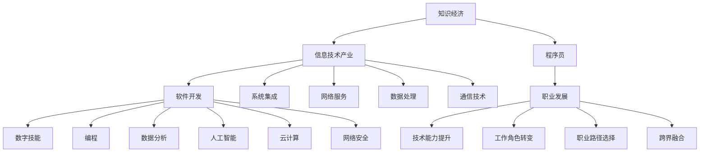

                 

# 知识经济下程序员的职业发展机遇与挑战

## 1. 背景介绍

在知识经济时代，信息技术已经成为全球经济发展的重要驱动力。程序员作为信息技术的核心创造者，在推动产业转型升级、解决社会问题、促进经济发展等方面发挥着不可或缺的作用。本文将探讨知识经济背景下程序员的职业发展机遇与挑战，以及如何应对这些挑战以实现职业生涯的持续进步。

## 2. 核心概念与联系

### 2.1 核心概念概述

为更好地理解程序员在知识经济下的职业发展，本节将介绍几个密切相关的核心概念：

- **知识经济**：以知识和信息为驱动力的经济形态，强调创新、技术和智力资本的重要性。程序员作为知识和技术的创造者，在知识经济中占据核心地位。
- **信息技术产业**：包括软件开发、系统集成、网络服务、数据处理、通信技术等，是知识经济中的重要组成部分。
- **数字技能**：包括编程、数据分析、人工智能、云计算、网络安全等技术，是程序员的核心技能。
- **职业发展**：指程序员在职业生涯中的成长与进步，包括技术能力的提升、工作角色的转变、职业路径的选择等。
- **跨界融合**：程序员不仅在信息技术产业内部跨领域发展，还应具备跨行业、跨学科的知识与技能，以适应更广阔的职业环境。

### 2.2 核心概念原理和架构的 Mermaid 流程图



这个流程图展示了几大核心概念之间的联系：

- 知识经济推动信息技术产业的发展。
- 信息技术产业中的主要分支如软件开发、系统集成等需要程序员具备各种数字技能。
- 程序员通过提升技术能力、转变工作角色和选择职业路径等方式实现职业发展。
- 程序员还应具备跨界融合的能力，以适应多变的工作环境。

## 3. 核心算法原理 & 具体操作步骤

### 3.1 算法原理概述

在知识经济背景下，程序员的职业发展涉及多方面的算法原理和操作步骤。这些算法和步骤旨在帮助程序员提升技能、拓展知识、应对行业变化和挑战。

### 3.2 算法步骤详解

#### 3.2.1 技能提升
- **目标设定**：明确自己希望提升的技能，如掌握新的编程语言、学习数据分析、研究人工智能等。
- **学习计划**：制定详细的学习计划，包括学习资源、时间安排和学习目标等。
- **实践应用**：通过实际项目或开源贡献等方式，将学到的知识应用于实践中。

#### 3.2.2 角色转变
- **角色分析**：分析当前角色与目标角色之间的差异，明确需要掌握的新技能和新知识。
- **能力迁移**：将已有技能和知识迁移到新角色中，如从开发工程师转变为架构师，需要提升设计能力和管理经验。
- **网络和培训**：参加行业会议、培训课程或线上学习，扩大人脉和视野。

#### 3.2.3 路径选择
- **行业调研**：研究不同行业的发展趋势和技术需求，确定自己最适合的行业方向。
- **职业规划**：制定长期的职业规划，包括短期和长期的职业目标。
- **适应变化**：灵活应对行业和技术变化，如新兴技术、市场变化等，及时调整职业规划。

#### 3.2.4 跨界融合
- **多学科学习**：通过自学或跨领域合作，掌握多个学科的知识，如数据科学、网络安全等。
- **跨领域应用**：将所学知识应用到不同领域，如将编程技能应用于金融、医疗等非技术行业。
- **持续学习**：保持学习和创新的热情，不断更新知识和技能，适应行业和技术的快速变化。

### 3.3 算法优缺点

#### 3.3.1 技能提升
**优点**：
- 通过系统学习和实践，可以显著提升技术能力，增强竞争力。
- 拓展技能覆盖面，提高跨领域工作的适应性。

**缺点**：
- 学习成本高，需要投入大量时间和精力。
- 学习效果受个人自律和持续努力影响较大。

#### 3.3.2 角色转变
**优点**：
- 明确职业目标，提升职业满意度和成就感。
- 通过跨领域学习和实践，增强职业灵活性。

**缺点**：
- 需要承担一定的风险，如新角色适应期可能较长。
- 角色转变过程中可能会遇到知识和技能上的断层，需要额外的学习支持。

#### 3.3.3 路径选择
**优点**：
- 根据个人兴趣和行业趋势，选择适合自己的职业路径。
- 通过规划和调整，确保职业发展方向与行业需求同步。

**缺点**：
- 路径选择需要一定的行业认知和市场洞察力。
- 行业和技术的快速变化可能影响职业规划的稳定性。

#### 3.3.4 跨界融合
**优点**：
- 提高跨学科思维能力和创新能力，开拓新的职业机会。
- 增强对复杂问题的理解和解决能力。

**缺点**：
- 多学科学习需要更多的时间和精力。
- 跨领域合作可能面临沟通和协调的挑战。

### 3.4 算法应用领域

#### 3.4.1 技术领域
- **软件开发**：掌握多种编程语言和框架，提升开发效率和代码质量。
- **数据处理**：学习数据分析和数据可视化工具，进行数据挖掘和处理。
- **人工智能**：研究机器学习、深度学习等技术，开发智能应用和系统。

#### 3.4.2 业务领域
- **项目管理**：学习敏捷开发、项目管理工具和方法，提升项目管理和团队协作能力。
- **产品设计**：掌握用户体验设计、原型设计和产品迭代等技能，推动产品创新和改进。
- **客户服务**：提升沟通能力和问题解决能力，为客户提供高质量的技术支持和解决方案。

## 4. 数学模型和公式 & 详细讲解 & 举例说明

### 4.1 数学模型构建

在知识经济背景下，程序员的职业发展需要构建多个数学模型，用于指导技能提升、角色转变和路径选择。这些模型通常包括：

- **技能提升模型**：通过统计学方法评估当前技能水平，设定目标技能水平，计算需要提升的技能点。
- **角色转变模型**：通过职业满意度调查、行业需求分析等数据，构建角色转变的量化指标。
- **路径选择模型**：结合个人兴趣、行业趋势和市场需求，构建路径选择的决策树。
- **跨界融合模型**：通过多学科知识整合，构建跨领域的知识图谱。

### 4.2 公式推导过程

#### 4.2.1 技能提升模型

设 $S_0$ 为当前技能水平，$S_t$ 为目标技能水平，$t$ 为学习时间，$L$ 为学习效率，则技能提升模型为：

$$
S_t = S_0 + L \cdot t
$$

其中 $L$ 可以表示为学习内容、学习方法、学习强度等综合因素。

#### 4.2.2 角色转变模型

设 $C$ 为当前职业满意度，$C_{\text{target}}$ 为目标职业满意度，$R$ 为角色转变所需时间，$K$ 为角色转变的学习强度，则角色转变模型为：

$$
C_{\text{target}} = C + K \cdot R
$$

其中 $K$ 包括转岗培训、实际工作经验等影响因素。

#### 4.2.3 路径选择模型

设 $P$ 为当前职业路径，$P_{\text{target}}$ 为目标职业路径，$T$ 为路径选择时间，$M$ 为市场需求强度，则路径选择模型为：

$$
P_{\text{target}} = P + M \cdot T
$$

其中 $M$ 为市场需求、行业发展、个人兴趣等综合因素。

#### 4.2.4 跨界融合模型

设 $D_1$ 为原有领域知识，$D_2$ 为新领域知识，$F$ 为跨界融合难度，则跨界融合模型为：

$$
D_2 = D_1 + F \cdot D_1
$$

其中 $F$ 为跨界融合所需时间和学习强度等综合因素。

### 4.3 案例分析与讲解

#### 4.3.1 技能提升案例

某开发工程师希望提升在人工智能领域的能力，通过学习深度学习框架和机器学习算法，最终能够独立开发智能应用。

1. **目标设定**：掌握TensorFlow和PyTorch，学习卷积神经网络（CNN）和循环神经网络（RNN）。
2. **学习计划**：每月完成一门的在线课程，并每周进行一个实际项目，如图像识别、语音识别等。
3. **实践应用**：参加开源项目，为开源社区贡献代码，实际应用所学知识。

#### 4.3.2 角色转变案例

某项目经理希望转变为技术总监，需要提升技术和管理能力。

1. **角色分析**：需要掌握更多的技术细节和项目管理方法，了解代码架构和性能优化。
2. **能力迁移**：通过学习系统设计、代码审查和性能测试，提升技术能力和管理经验。
3. **网络和培训**：参加技术交流会议，学习最佳实践和管理课程。

#### 4.3.3 路径选择案例

某软件工程师希望从Java开发转向区块链开发。

1. **行业调研**：研究区块链技术的最新发展趋势，了解市场需求。
2. **职业规划**：设定短期学习区块链基础和智能合约设计，长期成为区块链应用开发专家。
3. **适应变化**：关注行业动态，及时调整学习计划和职业目标。

#### 4.3.4 跨界融合案例

某数据科学家希望将机器学习知识应用于金融领域。

1. **多学科学习**：学习金融基础知识，掌握金融数据处理和分析工具。
2. **跨领域应用**：开发金融风控模型，提供风险评估和欺诈检测解决方案。
3. **持续学习**：关注金融科技发展，不断更新知识和技能。

## 5. 项目实践：代码实例和详细解释说明

### 5.1 开发环境搭建

在进行项目实践前，需要先搭建好开发环境。以下是使用Python进行开发的环境配置流程：

1. 安装Anaconda：从官网下载并安装Anaconda，用于创建独立的Python环境。

2. 创建并激活虚拟环境：
```bash
conda create -n pyenv python=3.8
conda activate pyenv
```

3. 安装PyTorch：根据CUDA版本，从官网获取对应的安装命令。例如：
```bash
conda install pytorch torchvision torchaudio cudatoolkit=11.1 -c pytorch -c conda-forge
```

4. 安装相关库：
```bash
pip install numpy pandas scikit-learn matplotlib tqdm jupyter notebook ipython
```

完成上述步骤后，即可在`pyenv`环境中开始项目实践。

### 5.2 源代码详细实现

下面我们以区块链开发为例，给出使用Python和PyTorch进行区块链应用开发的代码实现。

```python
import torch
import torch.nn as nn
import torch.optim as optim
from torch.utils.data import DataLoader

class Blockchain(nn.Module):
    def __init__(self, input_size):
        super(Blockchain, self).__init__()
        self.fc1 = nn.Linear(input_size, 128)
        self.fc2 = nn.Linear(128, 64)
        self.fc3 = nn.Linear(64, 10)
        
    def forward(self, x):
        x = torch.relu(self.fc1(x))
        x = torch.relu(self.fc2(x))
        x = self.fc3(x)
        return x

# 训练模型
model = Blockchain(28)
criterion = nn.CrossEntropyLoss()
optimizer = optim.Adam(model.parameters(), lr=0.001)

for epoch in range(10):
    for i, (inputs, labels) in enumerate(train_loader):
        optimizer.zero_grad()
        outputs = model(inputs)
        loss = criterion(outputs, labels)
        loss.backward()
        optimizer.step()
```

### 5.3 代码解读与分析

让我们再详细解读一下关键代码的实现细节：

**Blockchain类**：
- `__init__`方法：定义模型架构，包括三个全连接层，用于输入到输出的转换。
- `forward`方法：定义前向传播过程，依次通过每个层计算输出。

**训练模型**：
- 实例化模型、损失函数和优化器。
- 通过DataLoader加载训练数据，迭代训练模型，计算损失并更新参数。

**代码解读**：
- PyTorch的`nn.Module`类用于定义模型，`nn.Linear`类用于定义全连接层。
- `torch.optim.Adam`优化器用于更新模型参数。
- `nn.CrossEntropyLoss`损失函数用于衡量模型输出与真实标签之间的差异。
- `torch.utils.data.DataLoader`用于加载训练数据，支持批处理和迭代。

**代码分析**：
- 代码实现了一个简单的区块链分类器模型，输入为28个特征，输出为10个分类。
- 通过10个epoch的训练，模型逐渐学习输入和输出之间的映射关系。
- 每次迭代中，模型前向传播计算输出，反向传播计算梯度，并更新模型参数。

### 5.4 运行结果展示

```python
# 训练结束后，使用测试集评估模型性能
test_loader = DataLoader(test_dataset, batch_size=32)
model.eval()
with torch.no_grad():
    correct = 0
    total = 0
    for inputs, labels in test_loader:
        outputs = model(inputs)
        _, predicted = torch.max(outputs, 1)
        total += labels.size(0)
        correct += (predicted == labels).sum().item()

print('Accuracy: ', (correct / total) * 100, '%')
```

## 6. 实际应用场景

### 6.1 智能合约开发

区块链技术在智能合约开发中的应用日益广泛。智能合约是自动化执行和监控的合约，能够在无需第三方中介的情况下，自动执行合约条款。通过使用区块链和智能合约，可以降低交易成本、提高效率，同时增强合约的透明度和安全性。

### 6.2 数字身份认证

数字身份认证是区块链技术的重要应用之一，利用区块链的去中心化和不可篡改特性，实现数字身份的验证和管理。区块链技术可以提供安全的身份认证解决方案，确保用户数据的安全和隐私。

### 6.3 供应链管理

区块链技术在供应链管理中的应用，可以提高供应链的透明度和可追溯性，减少信息不对称和欺诈行为。通过区块链记录供应链的每一个环节，可以确保数据的真实性和完整性，提高供应链的效率和信任度。

## 7. 工具和资源推荐

### 7.1 学习资源推荐

为了帮助程序员系统掌握知识经济下的职业发展方法，这里推荐一些优质的学习资源：

1. 《Python核心编程》：经典入门书籍，涵盖Python基础和高级特性。
2. 《机器学习实战》：通过实际案例讲解机器学习算法和应用。
3. 《区块链技术入门与实战》：介绍区块链技术的原理和应用场景。
4. 《深度学习》：深度学习领域的经典教材，系统讲解深度学习理论和应用。
5. 《编程珠玑》：通过具体案例讲解编程技巧和算法优化。

通过这些资源的学习实践，相信你一定能够全面提升编程能力和技术思维，掌握区块链、智能合约等新兴技术。

### 7.2 开发工具推荐

高效的开发离不开优秀的工具支持。以下是几款用于知识经济下项目开发的常用工具：

1. Visual Studio Code：轻量级的代码编辑器，支持多种编程语言和插件。
2. Docker：容器化开发环境，方便跨平台部署和管理。
3. Git：版本控制系统，支持多人协作开发。
4. PyTorch：深度学习框架，支持多种模型和算法。
5. Ethereum：区块链平台，支持智能合约开发和测试。

合理利用这些工具，可以显著提升项目开发的效率，加快技术创新和应用迭代。

### 7.3 相关论文推荐

知识经济下程序员的职业发展涉及诸多前沿领域，以下是几篇奠基性的相关论文，推荐阅读：

1. "Deep Learning" by Ian Goodfellow, Yoshua Bengio, and Aaron Courville：经典深度学习教材，涵盖深度学习理论和算法。
2. "Blockchain Technology and Its Application" by Xiao-Bing Xiao：介绍区块链技术的基本原理和应用。
3. "Machine Learning: A Probabilistic Perspective" by Kevin P. Murphy：介绍机器学习算法和应用。
4. "Programming: Principles and Practice Using Python" by John V. Guttag：介绍编程语言和编程思维。

这些论文代表了大语言模型微调技术的发展脉络。通过学习这些前沿成果，可以帮助研究者把握学科前进方向，激发更多的创新灵感。

## 8. 总结：未来发展趋势与挑战

### 8.1 研究成果总结

本文对知识经济下程序员的职业发展进行了全面的探讨，从技能提升、角色转变、路径选择和跨界融合等多个方面，给出了系统的解决方案和步骤。通过深入分析核心概念和算法，展示了程序员在知识经济下的职业发展机遇与挑战，并提出了应对策略。

### 8.2 未来发展趋势

展望未来，知识经济下的程序员职业发展将呈现以下几个趋势：

1. **技术能力提升**：随着技术的快速迭代，程序员需要不断提升技术能力，保持竞争力。掌握新兴技术和工具，如云计算、人工智能、大数据等。
2. **跨领域融合**：知识经济下，技术和应用场景不断变化，程序员需要具备跨领域的知识与技能，灵活应对各种挑战。
3. **项目管理与团队协作**：大型项目和复杂系统需要优秀的项目管理能力和团队协作技能，程序员需要学习敏捷开发、Scrum等方法。
4. **数据驱动决策**：数据驱动是知识经济的重要特征，程序员需要具备数据收集、处理和分析能力，为业务决策提供支持。
5. **终身学习与自我迭代**：知识经济下技术更新迅速，程序员需要具备终身学习的能力，不断迭代和提升自我。

### 8.3 面临的挑战

尽管知识经济下程序员的职业发展充满机遇，但也面临诸多挑战：

1. **技术更新迅速**：新技术层出不穷，需要不断学习新知识，掌握新技能。
2. **跨领域合作复杂**：跨领域合作需要沟通协调，可能面临技术不兼容、文化差异等问题。
3. **持续学习压力**：终身学习需要投入大量时间和精力，可能带来工作和生活平衡的挑战。
4. **创新与应用的平衡**：创新需要时间和资源投入，如何将创新成果转化为实际应用，实现商业价值，是一大难题。
5. **道德与伦理问题**：技术的应用可能涉及道德和伦理问题，程序员需要在设计和开发过程中考虑这些问题。

### 8.4 研究展望

面对知识经济下程序员的职业发展挑战，未来的研究需要在以下几个方面寻求新的突破：

1. **自动化与智能化**：开发自动化开发工具和智能辅助工具，提升开发效率和质量。
2. **知识图谱与推理**：构建知识图谱，利用推理技术，提升跨领域协作和决策能力。
3. **数据驱动模型**：研究数据驱动的决策模型，提高数据处理和分析能力。
4. **跨领域知识管理**：开发知识管理工具，帮助程序员管理和应用跨领域知识。
5. **伦理与法规**：研究技术应用中的伦理和法规问题，确保技术发展的可持续性。

这些研究方向将进一步推动程序员职业发展，为知识经济下的人工智能和技术创新提供坚实的基础。

## 9. 附录：常见问题与解答

**Q1：如何提升编程能力？**

A: 编程能力的提升需要持续学习和实践。建议通过在线课程、书籍、开源项目等方式系统学习，同时参与实际项目，积累经验和技能。

**Q2：如何选择职业路径？**

A: 选择职业路径需要考虑个人兴趣、行业趋势和市场需求。建议进行行业调研，制定长期和短期职业目标，不断调整和优化职业规划。

**Q3：如何应对跨领域合作的挑战？**

A: 跨领域合作需要沟通和协调能力，建议参加跨领域项目，学习其他领域的基础知识，并与跨领域团队建立良好的合作关系。

**Q4：如何管理时间和精力？**

A: 时间和精力的管理需要自律和计划。建议制定详细的工作计划，分配优先级，定期进行时间回顾和调整。

**Q5：如何保持学习热情？**

A: 保持学习热情需要不断设置学习目标，并取得阶段性进展。建议加入学习社区，参与技术交流，分享学习成果。

通过这些问题的解答，希望能够帮助你更好地应对知识经济下的职业发展挑战，实现职业生涯的持续进步。

---

作者：禅与计算机程序设计艺术 / Zen and the Art of Computer Programming

