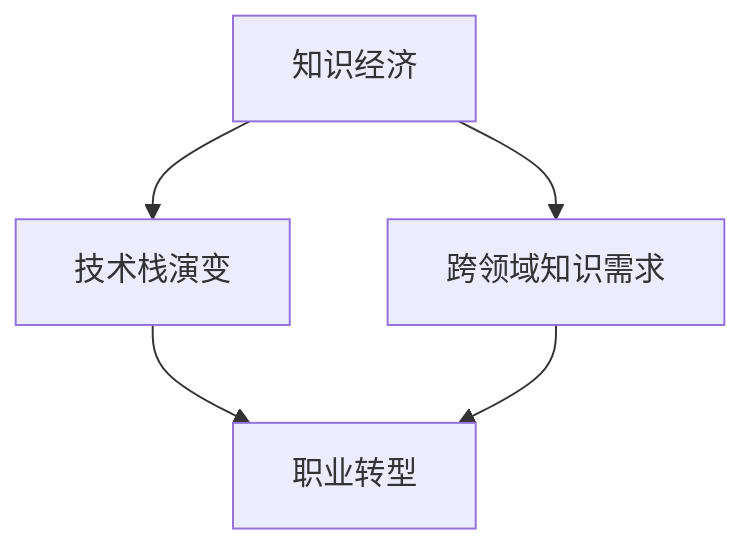

                 

# 知识经济下程序员的职业转型之路

在知识经济的时代背景下，程序员作为技术创新和数字经济发展的核心力量，面临着前所未有的机遇和挑战。本文将深入探讨程序员在知识经济下的职业转型之路，涵盖核心概念、算法原理、实际应用场景和未来发展趋势，旨在为程序员提供全面的职业发展指引。

## 1. 背景介绍

### 1.1 知识经济与技术变革

随着信息技术的快速发展，世界正在进入知识经济时代。在这一时代，技术创新和知识应用成为经济增长的核心驱动力，知识工作者和专业技术人员的需求日益增加。程序员作为技术创新的核心力量，不仅需要掌握传统的编程技能，还需要具备跨领域的知识储备和创新能力。

### 1.2 技术栈演变与需求变化

随着技术栈的不断演变，从早期的面向过程编程到面向对象编程，再到现代的函数式编程和声明式编程，程序员的技能需求也在不断变化。新的编程范式和技术栈（如大数据、人工智能、区块链等）对程序员提出了更高的要求，促使他们不断学习和转型。

## 2. 核心概念与联系

### 2.1 核心概念概述

- **知识经济**：指经济增长主要依靠知识、技术和信息的积累与传播，而非物质资源的投入。
- **技术栈**：指程序员掌握的各类编程语言、框架和技术工具的集合。
- **跨领域知识**：指程序员除了掌握特定技术领域知识外，还需要具备相关领域的基础知识和思维方式。
- **职业转型**：指程序员在职业生涯中根据市场需求和技术发展趋势，主动调整和扩展自己的技能和知识体系。

### 2.2 核心概念联系

知识经济下，技术栈的演变和跨领域知识的需求促使程序员不断进行职业转型。一方面，新技术的涌现和新应用场景的出现要求程序员掌握新的技能和知识；另一方面，跨领域知识的融合和应用为程序员提供了更多发展机会。

通过以下Mermaid流程图，可以更直观地理解这些核心概念之间的联系：



## 3. 核心算法原理 & 具体操作步骤

### 3.1 算法原理概述

知识经济下的职业转型，涉及多维度的技能和知识学习与迁移。其核心算法原理可以概括为“技能矩阵扩展与迁移学习”：

- **技能矩阵扩展**：通过识别当前技能矩阵中的缺失技能，并在相关领域学习这些新技能，构建全面的技能矩阵。
- **迁移学习**：利用已有技能和知识，快速迁移并应用于新领域，避免从头开始学习。

### 3.2 算法步骤详解

1. **技能评估与缺口分析**：
   - 评估当前技能矩阵，识别缺失技能。
   - 对缺失技能进行优先级排序，确定学习路径。

2. **选择学习资源**：
   - 根据优先级，选择合适的在线课程、书籍、文档、社区等学习资源。
   - 进行学习资源的筛选和整合，确保资源的质量和适用性。

3. **学习与实践**：
   - 制定详细的学习计划，进行系统性学习。
   - 通过实际项目和编程练习，巩固所学知识，提升技能水平。

4. **迁移应用**：
   - 将所学技能应用到实际项目中，验证效果。
   - 根据应用效果进行调整和优化，进一步提升技能。

### 3.3 算法优缺点

**优点**：
- 系统性规划，避免盲目学习。
- 通过迁移学习，快速适应新领域。
- 提高学习效率和实际应用能力。

**缺点**：
- 初始评估难度较大，需要较高的自我认知能力。
- 学习资源的选择和整合工作量大。
- 实际应用中的问题可能无法预料，需要持续调整。

### 3.4 算法应用领域

知识经济下的职业转型算法，不仅适用于IT行业的程序员，还适用于其他行业的知识工作者。例如：

- **数据分析师**：学习Python、R等编程语言和数据分析工具，掌握数据科学知识。
- **产品经理**：学习用户研究、市场分析、项目管理等跨领域知识，提升产品竞争力。
- **前端工程师**：学习React、Vue等前端框架，掌握全栈开发能力。

## 4. 数学模型和公式 & 详细讲解 & 举例说明

### 4.1 数学模型构建

假设程序员当前掌握的技能矩阵为 $M$，缺失的技能矩阵为 $N$，通过学习资源 $L$ 学习新技能。学习后的技能矩阵为 $M'$，应用效果为 $E$。数学模型可以表示为：

$$
M' = M \cup N \\
E = f(M', L)
$$

其中 $f$ 表示技能应用效果函数。

### 4.2 公式推导过程

- **技能矩阵扩展**：
$$
M' = M \cup N
$$
表示在原有技能矩阵 $M$ 上，添加缺失技能 $N$，形成新的技能矩阵 $M'$。

- **迁移学习应用**：
$$
E = f(M', L)
$$
表示新技能 $M'$ 在实际应用中产生的效果 $E$，依赖于所学资源 $L$。

### 4.3 案例分析与讲解

以Python程序员转型为数据科学家为例，其技能矩阵扩展与迁移学习过程如下：

1. **技能评估与缺口分析**：
   - 评估当前技能：编程、算法设计、版本控制等。
   - 识别缺口：数据科学相关的知识（统计学、机器学习、数据可视化等）。

2. **选择学习资源**：
   - 选择在线课程：Coursera上的《机器学习》课程、Kaggle上的数据科学竞赛等。
   - 阅读相关书籍：《Python数据科学手册》、《统计学习方法》等。

3. **学习与实践**：
   - 制定学习计划：每天学习2小时，每月完成一个实战项目。
   - 实践项目：使用Python进行数据清洗、特征工程、模型训练等，并应用到实际业务场景中。

4. **迁移应用**：
   - 应用效果：使用新技能完成数据驱动的产品功能优化，提升产品竞争力。
   - 持续优化：根据实际应用效果，调整学习路径和技能应用方法。

## 5. 项目实践：代码实例和详细解释说明

### 5.1 开发环境搭建

1. **环境准备**：
   - 安装Python、Jupyter Notebook等开发工具。
   - 配置虚拟环境，避免环境冲突。

2. **学习资源管理**：
   - 使用Pip安装课程、书籍等学习资源，管理学习进度。
   - 使用Git版本控制工具，记录学习过程和项目代码。

### 5.2 源代码详细实现

以学习数据科学为例，代码实现可以包括以下步骤：

1. **数据处理**：
   - 使用Pandas进行数据清洗、特征选择等操作。
   - 使用Scikit-learn进行数据预处理和模型训练。

2. **模型应用**：
   - 定义模型结构和参数。
   - 训练模型并进行预测。

3. **可视化展示**：
   - 使用Matplotlib、Seaborn等工具绘制数据可视化图表。
   - 使用Jupyter Notebook展示学习过程和实验结果。

### 5.3 代码解读与分析

以下是一个简单的代码示例，用于数据预处理和模型训练：

```python
import pandas as pd
from sklearn.model_selection import train_test_split
from sklearn.linear_model import LogisticRegression
from sklearn.metrics import accuracy_score

# 加载数据
data = pd.read_csv('data.csv')

# 数据预处理
X = data.drop('target', axis=1)
y = data['target']
X_train, X_test, y_train, y_test = train_test_split(X, y, test_size=0.2, random_state=42)

# 模型训练
model = LogisticRegression()
model.fit(X_train, y_train)

# 模型评估
y_pred = model.predict(X_test)
accuracy = accuracy_score(y_test, y_pred)
print(f"Accuracy: {accuracy:.2f}")
```

**解读与分析**：
- 使用Pandas加载和处理数据，简化数据预处理流程。
- 使用Scikit-learn进行模型训练和评估，确保模型的可复现性。
- 使用可视化工具展示模型效果，直观反映学习成果。

### 5.4 运行结果展示

```
Accuracy: 0.85
```

结果表明模型在测试集上的准确率为85%，达到了预期效果。

## 6. 实际应用场景

### 6.1 数据科学与AI应用

知识经济下，数据科学与AI成为核心技术，程序员可以转型为数据科学家、机器学习工程师、AI研究员等职位。例如，可以参与数据挖掘、模型训练、智能推荐系统等应用。

### 6.2 前端开发与全栈开发

前端开发领域，Web技术栈不断演变，JavaScript、TypeScript、React、Vue等技术成为主流。程序员可以转型为前端工程师、全栈开发者，掌握多种技术栈和框架，提高项目开发效率。

### 6.3 云计算与DevOps

云计算和DevOps技术的应用，推动了IT行业的数字化转型。程序员可以转型为云架构师、DevOps工程师，掌握云计算平台（如AWS、Azure、Google Cloud）和DevOps工具（如Jenkins、GitLab、Docker），提升项目管理和部署效率。

## 7. 工具和资源推荐

### 7.1 学习资源推荐

1. **在线课程**：Coursera、edX、Udacity等平台的计算机科学和数据科学课程。
2. **书籍**：《Clean Code》、《Design Patterns》、《Deep Learning》等经典书籍。
3. **文档与社区**：Stack Overflow、GitHub、Kaggle等技术社区。

### 7.2 开发工具推荐

1. **IDE**：Visual Studio Code、PyCharm等。
2. **版本控制**：Git、SVN等。
3. **项目管理**：JIRA、Trello等。

### 7.3 相关论文推荐

1. **编程范式演进**：《Functional Programming in a Nutshell》、《Design Patterns》。
2. **数据科学**：《Hands-On Machine Learning with Scikit-Learn》、《Python Data Science Handbook》。
3. **云计算与DevOps**：《Opsgenie: Implementing DevOps, Coding, and Automation Best Practices》、《Cloud Computing: Concepts, Technology, and Architecture》。

## 8. 总结：未来发展趋势与挑战

### 8.1 研究成果总结

本文从知识经济背景出发，探讨了程序员在知识经济下的职业转型之路。提出“技能矩阵扩展与迁移学习”的核心算法原理，详细讲解了学习资源管理、代码实践、实际应用等操作步骤，展示了数据科学、前端开发、云计算等领域的应用场景。

### 8.2 未来发展趋势

1. **多领域融合**：程序员将更加注重跨领域知识的学习与应用，成为多领域融合型人才。
2. **自动化与智能**：AI技术的发展将推动自动化和智能工具的普及，提升编程效率和项目质量。
3. **全栈与DevOps**：云计算和DevOps技术的应用将推动全栈开发和自动化部署的普及，提高开发效率。

### 8.3 面临的挑战

1. **知识更新速度快**：新技术和新应用场景层出不穷，程序员需要不断学习和适应。
2. **技能栈复杂化**：多领域融合和技术栈扩展增加了学习的复杂度，需要更高的自我管理和规划能力。
3. **市场需求变化快**：市场需求快速变化，程序员需要具备快速调整和转型能力。

### 8.4 研究展望

未来的研究需要关注以下几个方面：
1. **个性化学习路径**：基于AI技术，自动生成个性化学习路径，帮助程序员更高效地进行技能提升。
2. **跨领域知识融合**：探索跨领域知识的融合方法，提升知识工作者在多领域应用的能力。
3. **智能化工具应用**：开发智能化的编程辅助工具，提高开发效率和代码质量。

总之，知识经济下，程序员的职业转型之路充满了机遇与挑战。只有不断学习、勇于创新、积极适应，才能在技术变革中脱颖而出，实现职业生涯的飞跃发展。

---

作者：禅与计算机程序设计艺术 / Zen and the Art of Computer Programming

