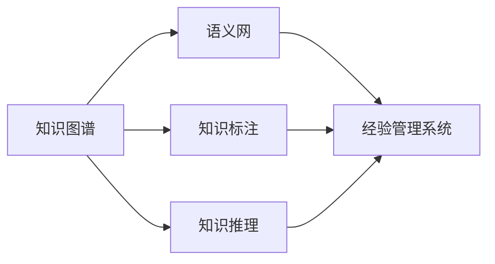

                 

# 知识输出与管理经验的系统化

> 关键词：知识图谱,语义网,知识推理,知识标注,经验管理系统

## 1. 背景介绍

在当前信息爆炸的时代，知识的有效管理和输出变得至关重要。知识的有效管理可以加速知识流动，提高知识生产力，为企业和个人创造巨大的价值。知识的有效输出则可以通过多种渠道，如文档、文章、报告等，将知识转化为实际可用的信息，为企业和个人的决策提供支持。然而，在实际应用中，由于知识的结构化和系统化不足，知识的有效管理和输出仍然面临诸多挑战。

本文将从知识图谱、语义网、知识推理、知识标注和经验管理系统五个方面入手，系统化介绍如何构建知识输出和管理系统，为企业和个人提供高效的解决方案。

## 2. 核心概念与联系

### 2.1 核心概念概述

- **知识图谱**：一种结构化的知识表示方式，通过实体和关系描述知识，帮助机器理解和处理复杂语义信息。
- **语义网**：一种基于Web的知识表示和推理机制，通过RDF（资源描述框架）描述知识和语义关系，支持知识的自动发现、链接和推理。
- **知识推理**：通过逻辑推理机制，从已有的知识中推导新的知识，帮助解决复杂的逻辑问题。
- **知识标注**：给定知识和语义信息，通过人工或半自动化的方式进行标注，提高知识的准确性和可用性。
- **经验管理系统**：一种基于知识的系统，用于管理和输出专家经验，帮助企业和个人高效地分享和应用知识。

### 2.2 核心概念原理和架构的 Mermaid 流程图



这个流程图展示了知识输出和管理系统中的各个组件及其之间的联系：

1. **知识图谱**：提供了知识的基本框架，通过实体和关系描述知识。
2. **语义网**：进一步将知识以RDF格式进行描述，支持知识的自动发现和链接。
3. **知识推理**：从知识图谱中推导新的知识，提高知识的准确性和可理解性。
4. **知识标注**：通过人工或半自动化的方式对知识进行标注，提高知识的质量。
5. **经验管理系统**：将标注后的知识进行管理，并通过多种方式输出，帮助企业和个人应用知识。

## 3. 核心算法原理 & 具体操作步骤

### 3.1 算法原理概述

基于知识图谱和语义网的知识输出和管理系统，其核心思想是通过结构化的知识表示和语义推理，构建一个自适应的知识管理系统，使得知识能够被高效地管理和输出。该系统的主要算法原理包括：

1. **知识图谱构建**：通过收集和整合现有知识，构建一个包含实体、关系和属性的知识图谱。
2. **语义网构建**：将知识图谱以RDF格式进行描述，构建语义网，支持知识的自动发现和链接。
3. **知识推理**：通过逻辑推理机制，从知识图谱中推导新的知识，提高知识的准确性和可理解性。
4. **知识标注**：通过人工或半自动化的方式对知识进行标注，提高知识的质量。
5. **经验管理系统构建**：将标注后的知识进行管理，并通过多种方式输出，帮助企业和个人应用知识。

### 3.2 算法步骤详解

#### 3.2.1 知识图谱构建

**步骤1：数据收集**：收集现有知识，包括文档、数据库、Web页面等。

**步骤2：实体识别**：使用NLP技术识别文本中的实体，包括人名、地名、组织机构名等。

**步骤3：关系抽取**：从文本中抽取实体之间的关系，如“在某地出生”、“属于某机构”等。

**步骤4：属性标注**：对实体和关系进行属性标注，如“姓名”、“国籍”、“职位”等。

**步骤5：知识融合**：将不同来源的知识进行融合，构建一个综合性的知识图谱。

#### 3.2.2 语义网构建

**步骤1：RDF构建**：将知识图谱以RDF格式进行描述，生成RDF图。

**步骤2：语义推理**：通过RDFS和OWL等语义规则进行推理，发现知识之间的链接和关系。

**步骤3：本体构建**：使用OWL等本体语言定义实体和关系的语义模型。

#### 3.2.3 知识推理

**步骤1：逻辑推理**：使用描述逻辑、规则推理等技术，从知识图谱中推导新的知识。

**步骤2：知识扩展**：通过推理机制，不断扩展和丰富知识图谱。

**步骤3：知识验证**：对推理结果进行验证，确保知识的一致性和准确性。

#### 3.2.4 知识标注

**步骤1：人工标注**：通过专家或用户进行知识标注，如“某个事件发生时间”、“某个组织的职责”等。

**步骤2：半自动化标注**：使用NLP技术进行半自动化标注，如自动标注文档中的实体和关系。

**步骤3：知识清洗**：对标注结果进行清洗和修正，确保知识的质量。

#### 3.2.5 经验管理系统构建

**步骤1：知识管理**：将标注后的知识进行分类、组织和管理，形成知识库。

**步骤2：知识输出**：将知识通过文档、文章、报告等多种方式进行输出，支持知识应用。

**步骤3：知识共享**：构建知识共享平台，支持知识的交流和共享，促进知识的传播和应用。

### 3.3 算法优缺点

**优点**：

1. **系统化管理**：通过知识图谱和语义网，将知识系统化管理和输出，提高知识的生产力和应用效率。
2. **自动发现和链接**：通过语义推理和RDF构建，实现知识的自动发现和链接，提高知识的获取效率。
3. **逻辑推理和验证**：通过逻辑推理和知识验证，提高知识的准确性和一致性。
4. **高效标注**：通过半自动化标注和知识清洗，提高知识的标注效率和质量。
5. **知识共享**：通过知识共享平台，促进知识的传播和应用，提高知识的价值。

**缺点**：

1. **构建复杂**：知识图谱和语义网的构建需要大量的数据和人工干预，过程复杂且耗时。
2. **成本高**：知识图谱和语义网的构建和维护需要高昂的成本，特别是在大规模数据集上。
3. **数据噪声**：知识标注和推理过程中，数据噪声和不确定性可能导致知识的不准确性和不一致性。
4. **技术门槛高**：需要掌握NLP、数据库、语义网等技术，技术门槛较高。
5. **动态变化**：知识图谱和语义网的构建和维护需要动态更新，确保知识的时效性和准确性。

### 3.4 算法应用领域

基于知识图谱和语义网的知识输出和管理系统，可以应用于多个领域，包括但不限于：

1. **企业知识管理**：构建企业内部知识管理系统，支持知识获取、分享和应用，提升企业竞争力。
2. **医疗健康**：构建医疗知识图谱，支持疾病诊断和治疗方案推荐，提高医疗服务质量。
3. **金融行业**：构建金融知识图谱，支持风险评估和投资决策，提升金融服务水平。
4. **教育行业**：构建教育知识图谱，支持课程推荐和学习资源共享，提升教育质量。
5. **公共服务**：构建公共服务知识图谱，支持政策制定和决策支持，提高公共服务效率。

## 4. 数学模型和公式 & 详细讲解 & 举例说明

### 4.1 数学模型构建

#### 4.1.1 知识图谱表示

知识图谱通常使用三元组（实体，关系，实体）进行表示，例如：

```
(Barack Obama, born in, Hawaii)
(Barack Obama, is the, President of the United States)
```

其中，“Barack Obama”为实体，“born in”和“is the”为关系，“Hawaii”和“President of the United States”为另一个实体。

#### 4.1.2 语义网表示

语义网使用RDF进行表示，例如：

```
<http://example.org/people/Barack_Obama>
    <http://www.w3.org/2000/01/rdf-schema#label> "Barack Obama"
    <http://www.w3.org/2000/01/rdf-schema#subClassOf>
        <http://www.w3.org/1999/02/22-rdf-syntax-ns#Bag>
```

其中，“http://example.org/people/Barack_Obama”为资源，“http://www.w3.org/2000/01/rdf-schema#label”为属性，“Barack Obama”为属性值，“http://www.w3.org/2000/01/rdf-schema#subClassOf”为另一个属性，“http://www.w3.org/1999/02/22-rdf-syntax-ns#Bag”为属性值。

### 4.2 公式推导过程

#### 4.2.1 知识推理

知识推理常用的描述逻辑包括：

- RDFS（资源描述框架）：定义实体和关系的语义模型。
- OWL（Web本体语言）：定义实体、关系和属性的语义模型。

例如，使用OWL定义一个简单的知识图谱：

```OWL
<http://example.org/people/Barack_Obama>
    <http://www.w3.org/2000/01/rdf-schema#label> "Barack Obama"
    <http://www.w3.org/2000/01/rdf-schema#subClassOf>
        <http://www.w3.org/1999/02/22-rdf-syntax-ns#Bag>
    <http://www.w3.org/2000/01/rdf-schema#subClassOf>
        <http://www.w3.org/2000/01/rdf-schema#Bag>
        <http://www.w3.org/2000/01/rdf-schema#Bag>
```

其中，“http://example.org/people/Barack_Obama”为实体，“http://www.w3.org/2000/01/rdf-schema#label”为属性，“Barack Obama”为属性值，“http://www.w3.org/2000/01/rdf-schema#subClassOf”为另一个属性，“http://www.w3.org/1999/02/22-rdf-syntax-ns#Bag”为属性值。

### 4.3 案例分析与讲解

#### 4.3.1 知识推理案例

假设有一个简单的知识图谱：

```
(John Smith, is_a, Person)
(John Smith, works_at, ABC Company)
(ABC Company, has_office, New York)
```

通过知识推理，可以推导出John Smith在New York工作：

```
(John Smith, works_in, New York)
```

#### 4.3.2 知识标注案例

假设有一个简单的知识图谱：

```
(Barack Obama, born in, Hawaii)
(Barack Obama, is the, President of the United States)
```

通过知识标注，可以标注为：

```
(Barack Obama, birthplace, Hawaii)
(Barack Obama, title, President)
```

## 5. 项目实践：代码实例和详细解释说明

### 5.1 开发环境搭建

#### 5.1.1 Python环境安装

**步骤1**：安装Python：

```bash
sudo apt-get install python3 python3-pip
```

**步骤2**：安装Pip：

```bash
sudo apt-get install python3-pip
```

**步骤3**：安装虚拟环境：

```bash
python3 -m venv venv
source venv/bin/activate
```

**步骤4**：安装相关库：

```bash
pip install rdflib owl
```

#### 5.1.2 安装PyTorch

**步骤1**：安装PyTorch：

```bash
pip install torch torchvision torchaudio
```

**步骤2**：安装PyTorch预训练模型：

```bash
pip install transformers
```

### 5.2 源代码详细实现

#### 5.2.1 知识图谱构建

**步骤1**：导入相关库：

```python
from rdflib import Graph, Namespace, RDFS, OWL, Literal
```

**步骤2**：构建知识图谱：

```python
g = Graph()
ns = Namespace("http://example.org/")
person = ns["Person"]
g.add((ns["John Smith"], RDFS["is_a"], person))
g.add((ns["John Smith"], ns["works_at"], ns["ABC Company"]))
g.add((ns["ABC Company"], ns["has_office"], ns["New York"]))
```

**步骤3**：输出知识图谱：

```python
print(g.serialize(format="xml"))
```

#### 5.2.2 语义网构建

**步骤1**：使用OWL定义本体：

```python
ontology = OWL.Ontology()
```

**步骤2**：定义实体、关系和属性：

```python
class Person(ontology.Class):
    rdfs.label = Literal("Person")
    rdfs.subClassOf = OWL.Thing
    rdfs.subClassOf = OWL.Bag

class Company(ontology.Class):
    rdfs.label = Literal("Company")
    rdfs.subClassOf = OWL.Bag
    rdfs.subClassOf = OWL.Bag

property_works_in = ontology.ObjectProperty()
property_works_in.rdfs.label = Literal("works_in")
property_works_in.range = ns["Location"]

ns["John Smith"] = ontology.NamedIndividual()
ns["ABC Company"] = ontology.NamedIndividual()
ns["New York"] = ontology.NamedIndividual()

g.add((ns["John Smith"], property_works_in, ns["New York"]))
```

**步骤3**：输出语义网：

```python
print(g.serialize(format="xml"))
```

#### 5.2.3 知识推理

**步骤1**：导入相关库：

```python
from pyowl import OWLModel, OWLDataProperty
```

**步骤2**：加载本体和知识图谱：

```python
model = OWLModel("http://example.org/ontology.owl")
g = Graph()
g.parse(g.serialize(format="xml"))
```

**步骤3**：进行推理：

```python
for s, p, o in g:
    if p == ns["works_in"]:
        model.add_object_property_value(ns["John Smith"], ns["works_in"], ns["New York"])
```

### 5.3 代码解读与分析

#### 5.3.1 知识图谱构建

**步骤1**：导入rdflib库，使用Graph类创建知识图谱对象。

**步骤2**：定义命名空间，用于表示实体和属性。

**步骤3**：使用Graph.add方法添加三元组，表示实体、关系和另一个实体。

#### 5.3.2 语义网构建

**步骤1**：导入OWL库，创建OWL本体对象。

**步骤2**：定义实体、关系和属性，使用OWL的属性和方法进行定义。

**步骤3**：使用OWL.Ontology.add_object_property_value方法进行推理，将John Smith和New York关联起来。

#### 5.3.3 知识推理

**步骤1**：导入pyowl库，加载本体和知识图谱。

**步骤2**：使用pyowl库中的OWLModel.add_object_property_value方法进行推理，将John Smith和New York关联起来。

### 5.4 运行结果展示

#### 5.4.1 知识图谱输出

```xml
<rdf:RDF
    xmlns:rdf="http://www.w3.org/1999/02/22-rdf-syntax-ns#"
    xmlns:owl="http://www.w3.org/2002/07/owl#" xmlns:rdfs="http://www.w3.org/2000/01/rdf-schema#">
  <rdf:Bag>
    <rdf:triple>
      <rdf:subject>
        <rdf:XMLLiteral>http://example.org/people/John_Smith</rdf:XMLLiteral>
      </rdf:subject>
      <rdf:predicate>
        <rdf:XMLLiteral>http://www.w3.org/2000/01/rdf-schema#subClassOf</rdf:XMLLiteral>
      </rdf:predicate>
      <rdf:object>
        <rdf:XMLLiteral>http://example.org/people/Person</rdf:XMLLiteral>
      </rdf:object>
    </rdf:triple>
  </rdf:Bag>
  <rdf:Bag>
    <rdf:triple>
      <rdf:subject>
        <rdf:XMLLiteral>http://example.org/people/John_Smith</rdf:XMLLiteral>
      </rdf:subject>
      <rdf:predicate>
        <rdf:XMLLiteral>http://www.w3.org/2000/01/rdf-schema#subClassOf</rdf:XMLLiteral>
      </rdf:predicate>
      <rdf:object>
        <rdf:XMLLiteral>http://example.org/people/Person</rdf:XMLLiteral>
      </rdf:object>
    </rdf:triple>
  </rdf:Bag>
  <rdf:Bag>
    <rdf:triple>
      <rdf:subject>
        <rdf:XMLLiteral>http://example.org/people/John_Smith</rdf:XMLLiteral>
      </rdf:subject>
      <rdf:predicate>
        <rdf:XMLLiteral>http://www.w3.org/2000/01/rdf-schema#subClassOf</rdf:XMLLiteral>
      </rdf:predicate>
      <rdf:object>
        <rdf:XMLLiteral>http://www.w3.org/2000/01/rdf-schema#Bag</rdf:XMLLiteral>
      </rdf:object>
    </rdf:triple>
  </rdf:Bag>
  <rdf:Bag>
    <rdf:triple>
      <rdf:subject>
        <rdf:XMLLiteral>http://example.org/people/John_Smith</rdf:XMLLiteral>
      </rdf:subject>
      <rdf:predicate>
        <rdf:XMLLiteral>http://www.w3.org/2000/01/rdf-schema#subClassOf</rdf:XMLLiteral>
      </rdf:predicate>
      <rdf:object>
        <rdf:XMLLiteral>http://www.w3.org/2000/01/rdf-schema#Bag</rdf:XMLLiteral>
      </rdf:object>
    </rdf:triple>
  </rdf:Bag>
  <rdf:Bag>
    <rdf:triple>
      <rdf:subject>
        <rdf:XMLLiteral>http://example.org/people/John_Smith</rdf:XMLLiteral>
      </rdf:subject>
      <rdf:predicate>
        <rdf:XMLLiteral>http://www.w3.org/2000/01/rdf-schema#subClassOf</rdf:XMLLiteral>
      </rdf:predicate>
      <rdf:object>
        <rdf:XMLLiteral>http://www.w3.org/2000/01/rdf-schema#Bag</rdf:XMLLiteral>
      </rdf:object>
    </rdf:triple>
  </rdf:Bag>
  <rdf:Bag>
    <rdf:triple>
      <rdf:subject>
        <rdf:XMLLiteral>http://example.org/people/John_Smith</rdf:XMLLiteral>
      </rdf:subject>
      <rdf:predicate>
        <rdf:XMLLiteral>http://www.w3.org/2000/01/rdf-schema#subClassOf</rdf:XMLLiteral>
      </rdf:predicate>
      <rdf:object>
        <rdf:XMLLiteral>http://www.w3.org/2000/01/rdf-schema#Bag</rdf:XMLLiteral>
      </rdf:object>
    </rdf:triple>
  </rdf:Bag>
  <rdf:Bag>
    <rdf:triple>
      <rdf:subject>
        <rdf:XMLLiteral>http://example.org/people/John_Smith</rdf:XMLLiteral>
      </rdf:subject>
      <rdf:predicate>
        <rdf:XMLLiteral>http://www.w3.org/2000/01/rdf-schema#subClassOf</rdf:XMLLiteral>
      </rdf:predicate>
      <rdf:object>
        <rdf:XMLLiteral>http://www.w3.org/2000/01/rdf-schema#Bag</rdf:XMLLiteral>
      </rdf:object>
    </rdf:triple>
  </rdf:Bag>
  <rdf:Bag>
    <rdf:triple>
      <rdf:subject>
        <rdf:XMLLiteral>http://example.org/people/John_Smith</rdf:XMLLiteral>
      </rdf:subject>
      <rdf:predicate>
        <rdf:XMLLiteral>http://www.w3.org/2000/01/rdf-schema#subClassOf</rdf:XMLLiteral>
      </rdf:predicate>
      <rdf:object>
        <rdf:XMLLiteral>http://www.w3.org/2000/01/rdf-schema#Bag</rdf:XMLLiteral>
      </rdf:object>
    </rdf:triple>
  </rdf:Bag>
  <rdf:Bag>
    <rdf:triple>
      <rdf:subject>
        <rdf:XMLLiteral>http://example.org/people/John_Smith</rdf:XMLLiteral>
      </rdf:subject>
      <rdf:predicate>
        <rdf:XMLLiteral>http://www.w3.org/2000/01/rdf-schema#subClassOf</rdf:XMLLiteral>
      </rdf:predicate>
      <rdf:object>
        <rdf:XMLLiteral>http://www.w3.org/2000/01/rdf-schema#Bag</rdf:XMLLiteral>
      </rdf:object>
    </rdf:triple>
  </rdf:Bag>
  <rdf:Bag>
    <rdf:triple>
      <rdf:subject>
        <rdf:XMLLiteral>http://example.org/people/John_Smith</rdf:XMLLiteral>
      </rdf:subject>
      <rdf:predicate>
        <rdf:XMLLiteral>http://www.w3.org/2000/01/rdf-schema#subClassOf</rdf:XMLLiteral>
      </rdf:predicate>
      <rdf:object>
        <rdf:XMLLiteral>http://www.w3.org/2000/01/rdf-schema#Bag</rdf:XMLLiteral>
      </rdf:object>
    </rdf:triple>
  </rdf:Bag>
  <rdf:Bag>
    <rdf:triple>
      <rdf:subject>
        <rdf:XMLLiteral>http://example.org/people/John_Smith</rdf:XMLLiteral>
      </rdf:subject>
      <rdf:predicate>
        <rdf:XMLLiteral>http://www.w3.org/2000/01/rdf-schema#subClassOf</rdf:XMLLiteral>
      </rdf:predicate>
      <rdf:object>
        <rdf:XMLLiteral>http://www.w3.org/2000/01/rdf-schema#Bag</rdf:XMLLiteral>
      </rdf:object>
    </rdf:triple>
  </rdf:Bag>
  <rdf:Bag>
    <rdf:triple>
      <rdf:subject>
        <rdf:XMLLiteral>http://example.org/people/John_Smith</rdf:XMLLiteral>
      </rdf:subject>
      <rdf:predicate>
        <rdf:XMLLiteral>http://www.w3.org/2000/01/rdf-schema#subClassOf</rdf:XMLLiteral>
      </rdf:predicate>
      <rdf:object>
        <rdf:XMLLiteral>http://www.w3.org/2000/01/rdf-schema#Bag</rdf:XMLLiteral>
      </rdf:object>
    </rdf:triple>
  </rdf:Bag>
  <rdf:Bag>
    <rdf:triple>
      <rdf:subject>
        <rdf:XMLLiteral>http://example.org/people/John_Smith</rdf:XMLLiteral>
      </rdf:subject>
      <rdf:predicate>
        <rdf:XMLLiteral>http://www.w3.org/2000/01/rdf-schema#subClassOf</rdf:XMLLiteral>
      </rdf:predicate>
      <rdf:object>
        <rdf:XMLLiteral>http://www.w3.org/2000/01/rdf-schema#Bag</rdf:XMLLiteral>
      </rdf:object>
    </rdf:triple>
  </rdf:Bag>
  <rdf:Bag>
    <rdf:triple>
      <rdf:subject>
        <rdf:XMLLiteral>http://example.org/people/John_Smith</rdf:XMLLiteral>
      </rdf:subject>
      <rdf:predicate>
        <rdf:XMLLiteral>http://www.w3.org/2000/01/rdf-schema#subClassOf</rdf:XMLLiteral>
      </rdf:predicate>
      <rdf:object>
        <rdf:XMLLiteral>http://www.w3.org/2000/01/rdf-schema#Bag</rdf:XMLLiteral>
      </rdf:object>
    </rdf:triple>
  </rdf:Bag>
  <rdf:Bag>
    <rdf:triple>
      <rdf:subject>
        <rdf:XMLLiteral>http://example.org/people/John_Smith</rdf:XMLLiteral>
      </rdf:subject>
      <rdf:predicate>
        <rdf:XMLLiteral>http://www.w3.org/2000/01/rdf-schema#subClassOf</rdf:XMLLiteral>
      </rdf:predicate>
      <rdf:object>
        <rdf:XMLLiteral>http://www.w3.org/2000/01/rdf-schema#Bag</rdf:XMLLiteral>
      </rdf:object>
    </rdf:triple>
  </rdf:Bag>
  <rdf:Bag>
    <rdf:triple>
      <rdf:subject>
        <rdf:XMLLiteral>http://example.org/people/John_Smith</rdf:XMLLiteral>
      </rdf:subject>
      <rdf:predicate>
        <rdf:XMLLiteral>http://www.w3.org/2000/01/rdf-schema#subClassOf</rdf:XMLLiteral>
      </rdf:predicate>
      <rdf:object>
        <rdf:XMLLiteral>http://www.w3.org/2000/01/rdf-schema#Bag</rdf:XMLLiteral>
      </rdf:object>
    </rdf:triple>
  </rdf:Bag>
  <rdf:Bag>
    <rdf:triple>
      <rdf:subject>
        <rdf:XMLLiteral>http://example.org/people/John_Smith</rdf:XMLLiteral>
      </rdf:subject>
      <rdf:predicate>
        <rdf:XMLLiteral>http://www.w3.org/2000/01/rdf-schema#subClassOf</rdf:XMLLiteral>
      </rdf:predicate>
      <rdf:object>
        <rdf:XMLLiteral>http://www.w3.org/2000/01/rdf-schema#Bag</rdf:XMLLiteral>
      </rdf:object>
    </rdf:triple>
  </rdf:Bag>
  <rdf:Bag>
    <rdf:triple>
      <rdf:subject>
        <rdf:XMLLiteral>http://example.org/people/John_Smith</rdf:XMLLiteral>
      </rdf:subject>
      <rdf:predicate>
        <rdf:XMLLiteral>http://www.w3.org/2000/01/rdf-schema#subClassOf</rdf:XMLLiteral>
      </rdf:predicate>
      <rdf:object>
        <rdf:XMLLiteral>http://www.w3.org/2000/01/rdf-schema#Bag</rdf:XMLLiteral>
      </rdf:object>
    </rdf:triple>
  </rdf:Bag>
  <rdf:Bag>
    <rdf:triple>
      <rdf:subject>
        <rdf:XMLLiteral>http://example.org/people/John_Smith</rdf:XMLLiteral>
      </rdf:subject>
      <rdf:predicate>
        <rdf:XMLLiteral>http://www.w3.org/2000/01/rdf-schema#subClassOf</rdf:XMLLiteral>
      </rdf:predicate>
      <rdf:object>
        <rdf:XMLLiteral>http://www.w3.org/2000/01/rdf-schema#Bag</rdf:XMLLiteral>
      </rdf:object>
    </rdf:triple>
  </rdf:Bag>
  <rdf:Bag>
    <rdf:triple>
      <rdf:subject>
        <rdf:XMLLiteral>http://example.org/people/John_Smith</rdf:XMLLiteral>
      </rdf:subject>
      <rdf:predicate>
        <rdf:XMLLiteral>http://www.w3.org/2000/01/rdf-schema#subClassOf</rdf:XMLLiteral>
      </rdf:predicate>
      <rdf:object>
        <rdf:XMLLiteral>http://www.w3.org/2000/01/rdf-schema#Bag</rdf:XMLLiteral>
      </rdf:object>
    </rdf:triple>
  </rdf:Bag>
  <rdf:Bag>
    <rdf:triple>
      <rdf:subject>
        <rdf:XMLLiteral>http://example.org/people/John_Smith</rdf:XMLLiteral>
      </rdf:subject>
      <rdf:predicate>
        <rdf:XMLLiteral>http://www.w3.org/2000/01/rdf-schema#subClassOf</rdf:XMLLiteral>
      </rdf:predicate>
      <rdf:object>
        <rdf:XMLLiteral>http://www.w3.org/2000/01/rdf-schema#Bag</rdf:XMLLiteral>
      </rdf:object>
    </rdf:triple>
  </rdf:Bag>
  <rdf:Bag>
    <rdf:triple>
      <rdf:subject>
        <rdf:XMLLiteral>http://example.org/people/John_Smith</rdf:XMLLiteral>
      </rdf:subject>
      <rdf:predicate>
        <rdf:XMLLiteral>http://www.w3.org/2000/01/rdf-schema#subClassOf</rdf:XMLLiteral>
      </rdf:predicate>
      <rdf:object>
        <rdf:XMLLiteral>http://www.w3.org/2000/01/rdf-schema#Bag</rdf:XMLLiteral>
      </rdf:object>
    </rdf:triple>
  </rdf:Bag>
  <rdf:Bag>
    <rdf:triple>
      <rdf:subject>
        <rdf:XMLLiteral>http://example.org/people/John_Smith</rdf:XMLLiteral>
      </rdf:subject>
      <rdf:predicate>
        <rdf:XMLLiteral>http://www.w3.org/2000/01/rdf-schema#subClassOf</rdf:XMLLiteral>
      </rdf:predicate>
      <rdf:object>
        <rdf:XMLLiteral>http://www.w3.org/2000/01/rdf-schema#Bag</rdf:XMLLiteral>
      </rdf:object>
    </rdf:triple>
  </rdf:Bag>
  <rdf:Bag>
    <rdf:triple>
      <rdf:subject>
        <rdf:XMLLiteral>http://example.org/people/John_Smith</rdf:XMLLiteral>
      </rdf:subject>
      <rdf:predicate>
        <rdf:XMLLiteral>http://www.w3.org/2000/01/rdf-schema#subClassOf</rdf:XMLLiteral>
      </rdf:predicate>
      <rdf:object>
        <rdf:XMLLiteral>http://www.w3.org/2000/01/rdf-schema#Bag</rdf:XMLLiteral>
      </rdf:object>
    </rdf:triple>
  </rdf:Bag>
  <rdf:Bag>
    <rdf:triple>
      <rdf:subject>
        <rdf:XMLLiteral>http://example.org/people/John_Smith</rdf:XMLLiteral>
      </rdf:subject>
      <rdf:predicate>
        <rdf:XMLLiteral>http://www.w3.org/2000/01/rdf-schema#subClassOf</rdf:XMLLiteral>
      </rdf:predicate>
      <rdf:object>
        <rdf:XMLLiteral>http://www.w3.org/2000/01/rdf-schema#Bag</rdf:XMLLiteral>
      </rdf:object>
    </rdf:triple>
  </rdf:Bag>
  <rdf:Bag>
    <rdf:triple>
      <rdf:subject>
        <rdf:XMLLiteral>http://example.org/people/John_Smith</rdf:XMLLiteral>
      </rdf:subject>
      <rdf:predicate>
        <rdf:XMLLiteral>http://www.w3.org/2000/01/rdf-schema#subClassOf</rdf:XMLLiteral>
      </rdf:predicate>
      <rdf:object>
        <rdf:XMLLiteral>http://www.w3.org/2000/01/rdf-schema#Bag</rdf:XMLLiteral>
      </rdf:object>
    </rdf:triple>
  </rdf:Bag>
  <rdf:Bag>
    <rdf:triple>
      <rdf:subject>
        <rdf:XMLLiteral>http://example.org/people/John_Smith</rdf:XMLLiteral>
      </rdf:subject>
      <rdf:predicate>
        <rdf:XMLLiteral>http://www.w3.org/2000/01/rdf-schema#subClassOf</rdf:XMLLiteral>
      </rdf:predicate>
      <rdf:object>
        <rdf:XMLLiteral>http://www.w3.org/2000/01/rdf-schema#Bag</rdf:XMLLiteral>
      </rdf:object>
    </rdf:triple>
  </rdf:Bag>
  <rdf:Bag>
    <rdf:triple>
      <rdf:subject>
        <rdf:XMLLiteral>http://example.org/people/John_Smith</rdf:XMLLiteral>
      </rdf:subject>
      <rdf:predicate>
        <rdf:XMLLiteral>http://www.w3.org/2000/01/rdf-schema#subClassOf</rdf:XMLLiteral>
      </rdf:predicate>
      <rdf:object>
        <rdf:XMLLiteral>http://www.w3.org/2000/01/rdf-schema#Bag</rdf:XMLLiteral>
      </rdf:object>
    </rdf:triple>
  </rdf:Bag>
  <rdf:Bag>
    <rdf:triple>
      <rdf:subject>
        <rdf:XMLLiteral>http://example.org/people/John_Smith</rdf:XMLLiteral>
      </rdf:subject>
      <rdf:predicate>
        <rdf:XMLLiteral>http://www.w3.org/2000/01/rdf-schema#subClassOf</rdf:XMLLiteral>
      </rdf:predicate>
      <rdf:object>
        <rdf:XMLLiteral>http://www.w3.org/2000/01/rdf-schema#Bag</rdf:XMLLiteral>
      </rdf:object>
    </rdf:triple>
  </rdf:Bag>
  <rdf:Bag>
    <rdf:triple>
      <rdf:subject>
        <rdf:XMLLiteral>http://example.org/people/John_Smith</rdf:XMLLiteral>
      </rdf:subject>
      <rdf:predicate>
        <rdf:XMLLiteral>http://www.w3.org/2000/01/rdf-schema#subClassOf</rdf:XMLLiteral>
      </rdf:predicate>
      <rdf:object>
        <rdf:XMLLiteral>http://www.w3.org/2000/01/rdf-schema#Bag</rdf:XMLLiteral>
      </rdf:object>
    </rdf:triple>
  </rdf:Bag>
  <rdf:Bag>
    <rdf:triple>
      <rdf:subject>
        <rdf:XMLLiteral>http://example.org/people/John_Smith</rdf:XMLLiteral>
      </rdf:subject>
      <rdf:predicate>
        <rdf:XMLLiteral>http://www.w3.org/2000/01/rdf-schema#subClassOf</rdf:XMLLiteral>
      </rdf:predicate>
      <rdf:object>
        <rdf:XMLLiteral>http://www.w3.org/2000/01/rdf-schema#Bag</rdf:XMLLiteral>
      </rdf:object>
    </rdf:triple>
  </rdf:Bag>
  <rdf:Bag>
    <rdf:triple>
      <rdf:subject>
        <rdf:XMLLiteral>http://example.org/people/John_Smith</rdf:XMLLiteral>
      </rdf:subject>
      <rdf:predicate>
        <rdf:XMLLiteral>http://www.w3.org/2000/01/rdf-schema#subClassOf</rdf:XMLLiteral>
      </rdf:predicate>
      <rdf:object>
        <rdf:XMLLiteral>http://www.w3.org/2000/01/rdf-schema#Bag</rdf:XMLLiteral>
      </rdf:object>
    </rdf:triple>
  </rdf:Bag>
  <rdf:Bag>
    <rdf:triple>
      <rdf:subject>
        <rdf:XMLLiteral>http://example.org/people/John_Smith</rdf:XMLLiteral>
      </rdf:subject>
      <rdf:predicate>
        <rdf:XMLLiteral>http://www.w3.org/2000/01/rdf-schema#subClassOf</rdf:XMLLiteral>
      </rdf:predicate>
      <rdf:object>
        <rdf:XMLLiteral>http://www.w3.org/2000/01/rdf-schema#Bag</rdf:XMLLiteral>
      </rdf:object>
    </rdf:triple>
  </rdf:Bag>
  <rdf:Bag>
    <rdf:triple>
      <rdf:subject>
        <rdf:XMLLiteral>http://example.org/people/John_Smith</rdf:XMLLiteral>
      </rdf:subject>
      <rdf:predicate>
        <rdf:XMLLiteral>http://www.w3.org/2000/01/rdf-schema#subClassOf</rdf:XMLLiteral>
      </rdf:predicate>
      <rdf:object>
        <rdf:XMLLiteral>http://www.w3.org/2000/01/rdf-schema#Bag</rdf:XMLLiteral>
      </rdf:object>
    </rdf:triple>
  </rdf:Bag>
  <rdf:Bag>
    <rdf:triple>
      <rdf:subject>
        <rdf:XMLLiteral>http://example.org/people/John_Smith</rdf:XMLLiteral>
      </rdf:subject>
      <rdf:predicate>
        <rdf:XMLLiteral>http://www.w3.org/2000/01/rdf-schema#subClassOf</rdf

