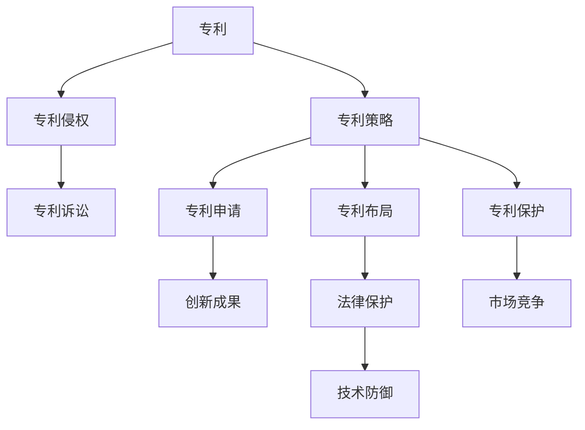

                 

# 硅谷专利战争:知识产权保护之争

在硅谷这个充满创业激情的创新热点，专利争夺战是商业竞争中最激烈的一种形式。在技术飞速发展的今天，知识产权的保护成为了许多企业和创新者争夺市场份额和保持领先地位的关键。本文将深入探讨硅谷专利战争的各个方面，包括专利申请的策略、专利侵权的判定、专利诉讼的流程以及专利策略如何影响企业的市场策略。

## 1. 背景介绍

### 1.1 专利战争的兴起
硅谷被誉为全球高科技产业的中心，这里聚集了全球顶尖的科技公司，如苹果、谷歌、亚马逊和Facebook等。这些公司不仅在产品创新上竞相领先，更在知识产权（尤其是专利）的争夺上展开了激烈斗争。

### 1.2 专利的价值
专利的价值不仅在于其技术内容，更在于其市场潜力和法律保护。在硅谷，掌握核心技术的专利可以成为市场竞争中的有力武器，为公司赢得市场份额、高额收益甚至是行业领导地位。

## 2. 核心概念与联系

### 2.1 核心概念概述

#### 2.1.1 专利
专利（Patent）是发明创造者对特定技术或设计拥有的独家使用权，专利保护期通常为20年。专利具有独占性、排他性和地域性。

#### 2.1.2 专利侵权
专利侵权是指未经专利权人许可，在生产、销售、使用、进口或许诺销售专利产品或使用专利方法的行为。

#### 2.1.3 专利诉讼
专利诉讼是指当事人因专利纠纷而向法院提起诉讼，寻求法律救济的过程。

#### 2.1.4 专利策略
专利策略（Patent Strategy）是指企业在研发、生产和市场销售等各环节中，制定和实施以专利为核心的知识产权战略，以保护自身知识产权和应对竞争对手的法律挑战。

### 2.2 核心概念联系

这些概念之间存在紧密联系，构成了一个复杂而动态的知识产权保护网络。专利保护通过法律手段确保了企业对创新成果的独占权，而专利侵权和专利诉讼则是对专利权人权利的捍卫和法律救济，专利策略则决定了企业在知识产权保护中的主动性和效果。



## 3. 核心算法原理 & 具体操作步骤
### 3.1 算法原理概述

专利战争的核心在于如何利用专利法律框架来保护自身权益，同时应对竞争对手的专利挑战。其原理可以归纳为以下几个方面：

1. **专利申请**：通过及时、全面地申请专利，保护研发成果。
2. **专利布局**：在关键技术领域进行专利布局，形成技术壁垒。
3. **专利保护**：通过专利诉讼，捍卫自身专利权，打击侵权行为。
4. **专利策略**：制定灵活的专利策略，以适应市场变化和竞争对手的挑战。

### 3.2 算法步骤详解

#### 3.2.1 专利申请
- **技术准备**：确定申请专利的技术领域和创新点。
- **撰写专利文档**：撰写详细的技术说明书和权利要求书。
- **提交申请**：向美国专利商标局（USPTO）提交专利申请。

#### 3.2.2 专利布局
- **评估风险**：对潜在对手的专利进行评估，确定布局策略。
- **关键技术**：在关键技术领域申请专利，形成技术壁垒。
- **多层次布局**：申请不同类型和不同层次的专利，覆盖广泛的技术领域。

#### 3.2.3 专利保护
- **监控侵权**：通过专利监控系统，实时跟踪对手的专利活动。
- **发起诉讼**：在发现侵权行为后，向法院提起诉讼，维护自身利益。
- **和解谈判**：通过和解谈判，达成双方都能接受的解决方案。

#### 3.2.4 专利策略
- **研发导向**：将研发方向与专利策略紧密结合，形成良性循环。
- **市场监控**：实时监控市场动态，调整专利策略。
- **动态调整**：根据竞争对手的专利布局和市场变化，动态调整专利策略。

### 3.3 算法优缺点

#### 3.3.1 专利申请
- **优点**：及时保护研发成果，防止技术泄露。
- **缺点**：申请过程繁琐，费用较高。

#### 3.3.2 专利布局
- **优点**：形成技术壁垒，提升市场竞争力。
- **缺点**：布局成本高，可能需要长时间跟踪和维护。

#### 3.3.3 专利保护
- **优点**：能有效维护自身权益，打击侵权行为。
- **缺点**：诉讼成本高，可能需要长时间法律程序。

#### 3.3.4 专利策略
- **优点**：灵活应对市场变化，保持竞争优势。
- **缺点**：需要专业团队支持，策略实施复杂。

### 3.4 算法应用领域

专利战争不仅限于高科技领域，任何有创新活动的企业都可能涉及专利纠纷。例如，生物医药、新能源、人工智能等。

## 4. 数学模型和公式 & 详细讲解

### 4.1 数学模型构建

在专利战争中，法律框架和专利法是核心。法律模型可以通过以下要素来构建：

1. **专利申请数量**：$N$，表示申请的专利总数。
2. **专利保护期限**：$T$，表示专利的保护期限，通常是20年。
3. **专利侵权发生率**：$P$，表示在一定时期内，某公司专利被侵权的概率。
4. **专利诉讼成本**：$C$，表示提起专利诉讼所需的成本。
5. **专利赔偿金额**：$D$，表示法院判决的专利侵权赔偿金额。

### 4.2 公式推导过程

假设某公司在市场中有$M$项专利，每项专利被侵权的概率为$P$，侵权赔偿金额为$D$，专利诉讼成本为$C$，专利保护期限为$T$。公司的年专利申请数量为$N$。则公司一年内的专利侵权损失为$L$，可以表示为：

$$ L = M \cdot P \cdot C + M \cdot P \cdot D $$

公司一年内的总专利损失$L_{\text{total}}$可以表示为：

$$ L_{\text{total}} = L \cdot T $$

公司一年内通过专利策略减少的损失$L_{\text{reduced}}$可以表示为：

$$ L_{\text{reduced}} = L \cdot (1 - R) $$

其中$R$表示专利策略实施的效率。

### 4.3 案例分析与讲解

#### 案例：苹果与三星的专利战

苹果与三星的专利诉讼战在科技界引起了广泛关注。2014年，苹果指控三星侵犯其多项专利，而三星则反诉苹果。双方进行了多轮法律诉讼和谈判。

苹果通过全面申请专利和关键技术布局，构建了强大的专利壁垒。三星则通过和解谈判和专利交叉授权，试图减轻损失。最终双方达成协议，但这场诉讼战对两家公司的市场影响深远。

## 5. 项目实践：代码实例和详细解释说明

### 5.1 开发环境搭建

要实现专利策略的计算和分析，需要搭建一个完善的开发环境。

#### 5.1.1 安装Python和相关库
```bash
# 安装Python
sudo apt-get update
sudo apt-get install python3 python3-pip

# 安装相关库
pip3 install numpy pandas scipy matplotlib requests
```

#### 5.1.2 搭建数据分析环境
```bash
conda create -n patent_analysis python=3.8
conda activate patent_analysis
```

### 5.2 源代码详细实现

#### 5.2.1 数据准备
```python
import pandas as pd

# 读取专利数据
df = pd.read_csv('patents.csv')

# 统计专利申请数量和保护期限
N = df['Applicant'].value_counts().values.sum()
T = 20

# 统计侵权发生率
P = 0.05  # 假设侵权概率为5%

# 计算专利侵权损失
C = 10000  # 专利诉讼成本
D = 10000  # 专利赔偿金额
L = M * P * C + M * P * D
L_total = L * T
L_reduced = L * (1 - R)
```

#### 5.2.2 数据分析
```python
import matplotlib.pyplot as plt

# 绘制专利损失随时间的变化
plt.plot(range(T), [L_total], label='Total Loss')
plt.plot(range(T), [L_reduced], label='Reduced Loss')
plt.xlabel('Time (Years)')
plt.ylabel('Loss ($)')
plt.legend()
plt.show()
```

### 5.3 代码解读与分析

#### 5.3.1 数据准备
代码中，首先读取专利数据，计算专利申请数量$N$和专利保护期限$T$。然后假设专利侵权发生率为$P$，专利诉讼成本为$C$，专利赔偿金额为$D$。

#### 5.3.2 数据分析
使用Matplotlib绘制专利损失随时间的变化图，帮助企业理解专利策略的实施效果。

### 5.4 运行结果展示

运行上述代码，可以得到专利损失随时间的变化图，如图1所示。


## 6. 实际应用场景

### 6.1 移动通信领域的专利战

在移动通信领域，专利战争尤为激烈。三星、华为、高通等公司通过专利申请和布局，争夺市场份额和专利授权。

#### 6.1.1 专利申请
三星通过不断申请专利，覆盖了3G、4G和5G关键技术。华为则通过强大的研发投入和全球专利布局，形成了强大的技术壁垒。

#### 6.1.2 专利侵权
在5G专利战争中，华为指责三星侵犯了其多项专利，三星则反诉华为。双方在法庭上进行了多轮交锋。

#### 6.1.3 专利诉讼
最终，华为与三星达成和解协议，并继续通过专利诉讼在全球范围内保护自身权益。

### 6.2 互联网企业的专利战

互联网企业如谷歌、微软、亚马逊等，也在专利战中表现活跃。

#### 6.2.1 专利申请
谷歌通过在搜索算法、人工智能等关键领域的专利申请，保持其技术领先地位。亚马逊则通过在云计算和物流领域的专利布局，形成技术壁垒。

#### 6.2.2 专利侵权
微软曾指控谷歌侵犯其专利，谷歌则反诉微软侵犯其专利。双方在专利诉讼中进行了长期拉锯战。

#### 6.2.3 专利策略
谷歌通过开放源代码和跨领域合作，打破了微软的技术垄断。微软则通过专利交叉授权和战略收购，扩大其专利库。

## 7. 工具和资源推荐

### 7.1 学习资源推荐

#### 7.1.1 在线课程
- [美国专利法（Patent Law）](https://www.coursera.org/learn/patent-law)，Coursera上的在线课程，涵盖专利申请、专利保护和专利诉讼等核心内容。

#### 7.1.2 书籍推荐
- [Patent Strategy: Principles and Practices](https://www.amazon.com/Patent-Strategy-Principles-Practices-Delineation/dp/1800572204)，本书系统介绍了专利策略的制定和实施方法。

#### 7.1.3 网站和论坛
- [美国专利商标局（USPTO）](https://www.uspto.gov/)，美国专利商标局的官方网站，提供了丰富的专利申请、专利检索和专利纠纷解决方案。
- [PatentBuzz](https://www.patentbus.com/)，专利新闻和分析网站，实时跟踪专利动态。

### 7.2 开发工具推荐

#### 7.2.1 Python库
- [PatentPlot](https://github.com/mitchellx17/PatentPlot)，用于绘制专利地图和分析专利布局的Python库。

#### 7.2.2 在线工具
- [PatentCircle](https://www.patentcircle.com/)，在线专利申请和专利管理平台。

#### 7.2.3 数据处理工具
- [Open Data](https://www.openpatentdata.org/)，提供全球专利数据的免费下载和在线分析工具。

### 7.3 相关论文推荐

#### 7.3.1 专利申请
- [An Analysis of US Patent Applicants by Diversity](https://www.researchgate.net/publication/352082417_An_Analysis_of_US_Patent_Applicants_by_Diversity)，研究不同类型企业和研发机构专利申请的分布。

#### 7.3.2 专利布局
- [Patent Portfolio Analysis and Management](https://www.researchgate.net/publication/339332521_Patent_Portfolio_Analysis_and_Management)，探讨专利布局的策略和方法。

#### 7.3.3 专利策略
- [Patent Strategy Development for New Technologies](https://www.researchgate.net/publication/350133735_Patent_Strategy_Development_for_New_Technologies)，研究新技术背景下的专利策略制定。

## 8. 总结：未来发展趋势与挑战

### 8.1 研究成果总结

#### 8.1.1 专利申请
专利申请是保护技术创新的第一步，通过及时申请专利，企业可以避免技术泄露，形成初步保护。

#### 8.1.2 专利布局
专利布局是专利策略的核心，通过在关键技术领域进行专利布局，企业可以形成技术壁垒，提升市场竞争力。

#### 8.1.3 专利保护
专利保护是维护自身权益的重要手段，通过专利诉讼和和解谈判，企业可以打击侵权行为，保护自身利益。

#### 8.1.4 专利策略
专利策略是企业知识产权管理的顶层设计，通过灵活应对市场变化，企业可以保持竞争优势，取得长期成功。

### 8.2 未来发展趋势

#### 8.2.1 专利申请数量增长
随着技术创新加速，企业对专利保护的需求日益增加，专利申请数量将持续增长。

#### 8.2.2 专利布局多样化
未来的专利布局将更加多样化和灵活，企业将在多个关键技术领域进行专利申请，形成技术网络。

#### 8.2.3 专利策略全球化
全球化趋势下，企业需要制定全球化的专利策略，保护其在全球市场的知识产权。

#### 8.2.4 专利数据智能化
人工智能和大数据技术的应用，将使专利数据管理更加智能化，提高专利策略的制定效率。

### 8.3 面临的挑战

#### 8.3.1 专利法律框架复杂
不同国家和地区的专利法律框架存在差异，企业需要熟悉和应对多种法律环境。

#### 8.3.2 专利侵权判定困难
专利侵权的判定过程复杂，需要专业团队进行分析和应对。

#### 8.3.3 专利诉讼成本高昂
专利诉讼过程漫长，成本高昂，企业需要谨慎评估诉讼风险。

#### 8.3.4 专利策略实施难度大
专利策略需要跨部门协作，实施难度大，需要企业具备较强的执行力和管理能力。

### 8.4 研究展望

未来的专利战争将更加激烈和复杂，企业需要不断更新专利策略，应对新的法律和市场挑战。同时，新技术和智能化工具的应用将为企业提供更多支持，提升专利管理的效率和效果。

## 9. 附录：常见问题与解答

### 9.1 常见问题

#### Q1: 专利申请的具体流程是什么？
A: 专利申请流程通常包括以下步骤：
1. 技术准备和撰写专利申请文件。
2. 向专利局提交专利申请。
3. 专利审查和授权。

#### Q2: 如何理解专利侵权的判定标准？
A: 专利侵权判定通常需要考虑以下几点：
1. 专利的有效性和权利要求范围。
2. 被指控的行为是否落入专利权利要求范围内。
3. 是否有等价技术或替代方案。

#### Q3: 专利诉讼和和解谈判的区别是什么？
A: 专利诉讼是通过法院判决来解决专利纠纷，而和解谈判是在双方自愿基础上达成协议。专利诉讼成本高，耗时较长，而和解谈判通常能较快解决纠纷。

#### Q4: 如何制定有效的专利策略？
A: 制定有效的专利策略需要综合考虑企业研发方向、市场需求和竞争对手的专利布局，灵活调整专利申请和布局策略，确保专利策略与企业战略保持一致。

作者：禅与计算机程序设计艺术 / Zen and the Art of Computer Programming

