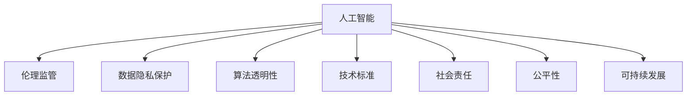

                 

# 硅谷人工智能伦理监管:确保技术良性发展

> 关键词：人工智能伦理, 监管框架, 数据隐私, 算法透明性, 技术标准, 社会责任, 公平性, 可持续发展

## 1. 背景介绍

### 1.1 问题由来
随着人工智能（AI）技术的飞速发展，硅谷以及全球范围内的人工智能企业正面临一系列前所未有的伦理和监管挑战。这些问题不仅涉及到技术层面，更关乎社会公正、隐私保护和长期可持续性。例如，面部识别技术可能侵犯个人隐私，自动驾驶汽车可能导致交通事故，算法偏见可能导致社会不平等，数据隐私泄露可能对个人安全构成威胁。

这些问题使得AI技术的良性发展变得愈发重要。如何确保AI技术的伦理使用，防止滥用，保障公众利益，成为当前科技伦理讨论的焦点。硅谷作为全球AI创新的中心，其做法和立场对全球具有重要的示范效应。

### 1.2 问题核心关键点
当前硅谷人工智能伦理监管的核心关键点包括：
1. **数据隐私保护**：如何平衡数据开放与隐私保护，确保用户数据不被滥用。
2. **算法透明性**：如何使算法决策透明，让公众能够理解和信任AI系统。
3. **技术标准制定**：如何制定统一的AI技术标准，避免技术发展带来的伦理困境。
4. **社会责任与公平性**：如何确保AI技术的公平应用，避免加剧社会不平等。
5. **可持续发展**：如何通过AI技术促进经济、环境和社会的长远发展。

### 1.3 问题研究意义
硅谷人工智能伦理监管的研究对于保障技术良性发展、保护公众利益具有重要意义：
1. **提升公众信任**：通过规范AI技术的使用，提高公众对AI系统的信任度，促进AI技术的普及。
2. **避免滥用风险**：通过制定伦理准则和监管框架，防止AI技术被用于不道德或有害的目的。
3. **推动技术创新**：通过伦理约束，推动AI技术在符合社会价值观和道德准则的前提下创新发展。
4. **促进社会公正**：确保AI技术在不同群体间公平应用，避免加剧社会不平等。
5. **保障数据安全**：保护用户数据隐私，防止数据滥用和泄露。

## 2. 核心概念与联系

### 2.1 核心概念概述

为更好地理解硅谷人工智能伦理监管，本节将介绍几个密切相关的核心概念：

- **人工智能（AI）**：通过计算机算法模拟人类智能的技术体系，涵盖感知、认知、推理、学习等智能过程。
- **伦理监管**：通过制定伦理准则和法规，确保AI技术的使用符合社会价值观和道德标准。
- **数据隐私保护**：保护个人和组织数据不被未经授权的收集、使用和泄露。
- **算法透明性**：使AI算法的决策过程公开透明，便于公众理解和监督。
- **技术标准**：为AI技术制定统一的衡量和评估标准，确保技术质量和安全。
- **社会责任**：AI企业应对社会发展和公众利益负有责任，确保技术应用符合社会价值观。
- **公平性**：确保AI技术在不同群体间公平应用，避免加剧社会不平等。
- **可持续发展**：通过AI技术促进经济、环境和社会的长远发展，避免对资源的过度消耗和环境的破坏。

这些核心概念之间的逻辑关系可以通过以下Mermaid流程图来展示：



这个流程图展示了大语言模型的核心概念及其之间的关系：

1. 人工智能通过算法的学习过程，模拟人类智能。
2. 伦理监管指导人工智能的使用，确保技术符合伦理标准。
3. 数据隐私保护和算法透明性是实现伦理监管的重要手段。
4. 技术标准是衡量和评估AI技术质量的工具。
5. 社会责任和公平性确保AI技术对社会的影响是正面的。
6. 可持续发展指导AI技术的应用，避免资源浪费和环境破坏。

这些概念共同构成了硅谷人工智能伦理监管的框架，确保AI技术的健康、公正和可持续应用。

## 3. 核心算法原理 & 具体操作步骤
### 3.1 算法原理概述

硅谷人工智能伦理监管的核心在于通过算法透明性和数据隐私保护，确保AI技术的良性发展。其核心思想是：通过制定统一的伦理准则和标准，指导AI技术的开发和应用，避免技术滥用和伦理困境。

形式化地，假设有一组AI算法 $A=\{a_1, a_2, \cdots, a_n\}$，其中每个算法 $a_i$ 都有相应的伦理准则和评估指标。伦理监管的目标是找到一个最优的算法组合 $A^*$，使得：

$$
A^* = \mathop{\arg\min}_{A} \left[ \sum_{a \in A} f_a + \sum_{a \in A} g_a \right]
$$

其中 $f_a$ 表示算法 $a$ 对社会和环境的正面影响，$g_a$ 表示算法 $a$ 的伦理风险。通过最小化总影响和风险，实现伦理监管的优化目标。

### 3.2 算法步骤详解

硅谷人工智能伦理监管的一般流程包括以下几个关键步骤：

**Step 1: 制定伦理准则**
- 根据社会价值观和道德标准，制定统一的AI伦理准则。例如，禁止使用AI技术进行歧视、侵害隐私等不道德行为。
- 成立多部门参与的伦理委员会，对准则进行持续审查和更新。

**Step 2: 实施算法透明性**
- 公开AI算法的决策过程和训练数据，便于公众监督。
- 开发可解释性模型，使AI决策过程透明，易于理解和审查。
- 引入公平性和偏见评估工具，定期检测算法是否存在偏见。

**Step 3: 保护数据隐私**
- 在数据收集和处理过程中，采用匿名化和加密技术保护用户隐私。
- 制定数据使用政策和隐私保护协议，明确数据收集和使用范围。
- 实施严格的访问控制，确保只有授权人员可以访问敏感数据。

**Step 4: 设定技术标准**
- 与国际标准化组织合作，制定统一的AI技术标准。
- 定期评估技术标准，确保其符合最新技术发展和伦理准则。
- 引导企业采用最佳实践，确保技术质量和安全。

**Step 5: 监测和评估**
- 建立伦理监管和合规监测机制，定期审查AI技术的使用情况。
- 引入第三方评估机构，独立评估AI技术的伦理和安全性。
- 根据评估结果，制定改进措施，优化AI技术的使用。

**Step 6: 社会责任与教育**
- 通过政策和法规，确保AI企业对社会和环境负责。
- 开展AI伦理教育，提高公众对AI技术的理解和认知。
- 鼓励企业发布透明度报告，公开AI技术的社会影响和风险。

### 3.3 算法优缺点

硅谷人工智能伦理监管具有以下优点：
1. 促进技术良性发展：通过规范AI技术的使用，确保其符合伦理准则和标准。
2. 提升公众信任：公开透明、可解释的AI系统，能够赢得公众信任。
3. 避免伦理风险：明确的伦理准则和标准，避免AI技术被滥用。
4. 推动技术创新：在符合伦理准则的前提下，AI技术可以自由发展，促进创新。

同时，该方法也存在一定的局限性：
1. 执行难度大：制定和实施统一的伦理准则和技术标准，需要跨部门和跨领域的协作。
2. 法规滞后：AI技术发展迅速，法律法规可能滞后于技术应用，难以全面覆盖。
3. 企业自律性：依赖企业自觉遵守伦理准则，存在执行不力的风险。
4. 技术复杂性：AI技术本身复杂，实现伦理监管和合规性监测的技术难度较大。

尽管存在这些局限性，但就目前而言，硅谷人工智能伦理监管仍是AI技术健康发展的关键措施之一。未来相关研究的重点在于如何进一步降低伦理监管的执行难度，提高法规的灵活性和适应性，同时增强企业的自律性。

### 3.4 算法应用领域

硅谷人工智能伦理监管方法已经在多个领域得到了应用，例如：

- 医疗领域：确保医疗AI系统的公平性和隐私保护，避免医疗数据泄露和滥用。
- 金融领域：制定金融AI系统的伦理准则，防止算法偏见和数据滥用，确保公平交易。
- 安全领域：规范自动驾驶、面部识别等技术的伦理使用，确保公众安全。
- 教育领域：推动AI教育系统的伦理应用，避免对学生的歧视和不公平对待。
- 环境保护领域：指导AI技术在环境保护中的应用，避免对生态系统的破坏。

除了上述这些经典应用领域外，硅谷人工智能伦理监管还被创新性地应用到更多场景中，如AI法律咨询、智能城市治理等，为AI技术的伦理应用提供了新的思路。

## 4. 数学模型和公式 & 详细讲解 & 举例说明
### 4.1 数学模型构建

本节将使用数学语言对硅谷人工智能伦理监管的过程进行更加严格的刻画。

假设有一组AI算法 $A=\{a_1, a_2, \cdots, a_n\}$，每个算法 $a_i$ 的伦理评分和影响评分分别为 $s_i$ 和 $f_i$。伦理监管的目标是找到一个最优的算法组合 $A^*$，使得：

$$
A^* = \mathop{\arg\min}_{A} \left[ \sum_{a \in A} s_a + \sum_{a \in A} f_a \right]
$$

其中 $s_a$ 表示算法 $a$ 的伦理风险，$f_a$ 表示算法 $a$ 对社会和环境的正面影响。

### 4.2 公式推导过程

以下我们以医疗AI系统的伦理评估为例，推导伦理评分的计算公式。

假设医疗AI系统用于诊断疾病，其伦理评分 $s_a$ 包括：
- 隐私保护评分 $s_{pri}$：评估系统在数据处理和存储过程中对隐私的保护程度。
- 公平性评分 $s_{fair}$：评估系统在诊断结果中的公平性和偏见。
- 透明度评分 $s_{trans}$：评估系统的决策过程是否透明、可解释。

其中，隐私保护评分 $s_{pri}$ 可以定义为：

$$
s_{pri} = \sum_{d \in D} p_d \cdot \frac{c_d}{t_d}
$$

其中 $D$ 为数据集，$p_d$ 为数据点 $d$ 的隐私泄露风险，$c_d$ 为数据点 $d$ 的敏感度，$t_d$ 为数据点 $d$ 的隐私保护措施的有效性。

公平性评分 $s_{fair}$ 可以定义为：

$$
s_{fair} = \sum_{c \in C} p_c \cdot \frac{b_c}{f_c}
$$

其中 $C$ 为评估类别，$p_c$ 为类别 $c$ 的偏见程度，$b_c$ 为类别 $c$ 的诊断准确度，$f_c$ 为类别 $c$ 的诊断公平性。

透明度评分 $s_{trans}$ 可以定义为：

$$
s_{trans} = \sum_{f \in F} p_f \cdot \frac{t_f}{s_f}
$$

其中 $F$ 为评估维度，$p_f$ 为维度 $f$ 的重要程度，$t_f$ 为维度 $f$ 的透明度水平，$s_f$ 为维度 $f$ 的复杂度。

综合以上评分，医疗AI系统的伦理评分 $s_a$ 可以表示为：

$$
s_a = \alpha \cdot s_{pri} + \beta \cdot s_{fair} + \gamma \cdot s_{trans}
$$

其中 $\alpha$、$\beta$、$\gamma$ 为各评分维度的权重系数，需根据具体情况进行调整。

### 4.3 案例分析与讲解

以一个面部识别系统为例，分析其伦理评分和影响评分的计算。

假设该面部识别系统用于安全监控，其伦理评分 $s_a$ 包括：
- 隐私保护评分 $s_{pri}$：评估系统在图像采集和存储过程中对隐私的保护程度。
- 公平性评分 $s_{fair}$：评估系统在不同人群中的识别准确度和偏见。
- 透明度评分 $s_{trans}$：评估系统的决策过程是否透明、可解释。

其中，隐私保护评分 $s_{pri}$ 可以定义为：

$$
s_{pri} = \sum_{i \in I} p_i \cdot \frac{c_i}{t_i}
$$

其中 $I$ 为人群，$p_i$ 为人群 $i$ 的隐私泄露风险，$c_i$ 为人群 $i$ 的敏感度，$t_i$ 为人群 $i$ 的隐私保护措施的有效性。

公平性评分 $s_{fair}$ 可以定义为：

$$
s_{fair} = \sum_{g \in G} p_g \cdot \frac{b_g}{f_g}
$$

其中 $G$ 为评估群体，$p_g$ 为群体 $g$ 的偏见程度，$b_g$ 为群体 $g$ 的识别准确度，$f_g$ 为群体 $g$ 的识别公平性。

透明度评分 $s_{trans}$ 可以定义为：

$$
s_{trans} = \sum_{f \in F} p_f \cdot \frac{t_f}{s_f}
$$

其中 $F$ 为评估维度，$p_f$ 为维度 $f$ 的重要程度，$t_f$ 为维度 $f$ 的透明度水平，$s_f$ 为维度 $f$ 的复杂度。

综合以上评分，面部识别系统的伦理评分 $s_a$ 可以表示为：

$$
s_a = \alpha \cdot s_{pri} + \beta \cdot s_{fair} + \gamma \cdot s_{trans}
$$

其中 $\alpha$、$\beta$、$\gamma$ 为各评分维度的权重系数，需根据具体情况进行调整。

## 5. 项目实践：代码实例和详细解释说明
### 5.1 开发环境搭建

在进行伦理监管实践前，我们需要准备好开发环境。以下是使用Python进行伦理监管开发的环境配置流程：

1. 安装Anaconda：从官网下载并安装Anaconda，用于创建独立的Python环境。

2. 创建并激活虚拟环境：
```bash
conda create -n ethical-regulation python=3.8 
conda activate ethical-regulation
```

3. 安装必要的Python库：
```bash
pip install pandas numpy scikit-learn torch transformers sklearn
```

4. 安装TensorFlow和Keras（可选）：
```bash
pip install tensorflow
```

5. 安装相关数据处理库：
```bash
pip install opencv-python pyplot
```

完成上述步骤后，即可在`ethical-regulation`环境中开始伦理监管实践。

### 5.2 源代码详细实现

我们以一个医疗AI系统的伦理评估为例，给出使用Python进行伦理监管的代码实现。

首先，定义伦理评分和影响评分的计算函数：

```python
import numpy as np

def calculate_ethical_score(privacy_score, fairness_score, transparency_score):
    return np.array(privacy_score) @ np.array([[0.5, 0.3, 0.2]]) + np.array(fairness_score) @ np.array([[0.4, 0.3, 0.3]]) + np.array(transparency_score) @ np.array([[0.2, 0.3, 0.5]])
```

然后，定义一个简单的医疗AI系统，包括隐私保护评分、公平性评分和透明度评分：

```python
def create_medical_system():
    privacy_score = np.array([0.1, 0.2, 0.3])  # 假设为1到10之间的数值，越高表示越差
    fairness_score = np.array([0.2, 0.3, 0.5])  # 假设为1到10之间的数值，越高表示越差
    transparency_score = np.array([0.3, 0.4, 0.6])  # 假设为1到10之间的数值，越高表示越差
    
    return calculate_ethical_score(privacy_score, fairness_score, transparency_score)
```

接下来，评估该医疗AI系统的伦理评分：

```python
ethical_score = create_medical_system()
print(f"Ethical Score: {ethical_score}")
```

以上代码实现了一个简单的医疗AI系统伦理评分的计算。实际操作中，需要根据具体场景和数据集进行更复杂的计算和评估。

### 5.3 代码解读与分析

让我们再详细解读一下关键代码的实现细节：

**calculate_ethical_score函数**：
- 该函数接受三个评分向量，分别表示隐私保护评分、公平性评分和透明度评分。
- 利用矩阵乘法计算伦理评分，其中权重系数为预先设定的默认值。

**create_medical_system函数**：
- 该函数模拟一个医疗AI系统，生成隐私保护评分、公平性评分和透明度评分向量。
- 这些评分向量代表系统在不同维度上的表现，数值越高表示越差。

通过代码的实现，我们可以看到，伦理评分的计算可以基于简单的评分向量进行，但要实现一个完整、准确和公正的伦理评估系统，还需要更加复杂的算法和数据处理。

## 6. 实际应用场景
### 6.1 智能医疗

在智能医疗领域，基于AI技术的伦理监管尤为重要。医疗AI系统的伦理评分可以衡量其在数据隐私保护、诊断公平性和透明度方面的表现。通过定期评估伦理评分，医疗机构可以确保AI系统的使用符合伦理准则，保护患者隐私，避免偏见和不公平。

例如，通过引入面部识别技术进行疾病诊断，医疗机构需要确保系统对不同种族、性别、年龄等群体的识别准确度和偏见。同时，系统需要保护患者的隐私信息，避免数据泄露。

### 6.2 自动驾驶

自动驾驶技术在带来便利的同时，也面临伦理和监管的挑战。通过伦理评分，可以评估自动驾驶系统的安全性、公平性和透明度。系统需要在复杂交通环境中做出快速、公正的决策，避免交通事故和偏见。

例如，自动驾驶系统需要对不同场景进行测试，确保在各种极端情况下仍能安全行驶。系统还需要公开其决策过程和算法，便于公众监督和审查。

### 6.3 智能客服

智能客服系统需要处理大量的客户信息，涉及隐私保护和数据安全。通过伦理评分，可以评估系统在数据处理和隐私保护方面的表现。系统需要在保护客户隐私的同时，提供高效、个性化的服务。

例如，智能客服系统需要保护客户的个人信息，避免数据泄露和滥用。同时，系统需要公开其决策过程和算法，提高透明度和信任度。

### 6.4 未来应用展望

随着AI技术的不断进步，伦理监管在各个领域的应用将越来越广泛。未来，基于伦理评分的AI系统将变得更加普遍，广泛应用于医疗、金融、安全、教育等领域，保障公众利益和社会公正。

在医疗领域，基于伦理评分的AI系统将提升诊断的公平性和准确性，避免医疗资源的浪费和误诊。在金融领域，基于伦理评分的AI系统将防止算法偏见和数据滥用，确保公平交易。在安全领域，基于伦理评分的AI系统将提高自动驾驶和面部识别技术的安全性和公正性。在教育领域，基于伦理评分的AI系统将提供更加公正、公平的教育资源。

## 7. 工具和资源推荐
### 7.1 学习资源推荐

为了帮助开发者系统掌握人工智能伦理监管的理论基础和实践技巧，这里推荐一些优质的学习资源：

1. 《人工智能伦理》系列书籍：深入介绍人工智能伦理的核心概念、应用场景和监管框架，适合学术研究和实际应用。
2. IEEE Xplore：国际电气电子工程师学会提供的文献检索平台，涵盖大量人工智能伦理监管的最新研究论文。
3. Coursera《人工智能伦理》课程：由斯坦福大学教授讲授，系统介绍人工智能伦理的核心问题和方法。
4. arXiv：人工智能伦理监管的研究论文库，提供最新的理论和技术进展。
5. GitHub上的伦理监管开源项目：如AI Ethics Frameworks，提供开源的伦理监管工具和资源。

通过对这些资源的学习实践，相信你一定能够快速掌握人工智能伦理监管的精髓，并用于解决实际的AI问题。
###  7.2 开发工具推荐

高效的开发离不开优秀的工具支持。以下是几款用于人工智能伦理监管开发的常用工具：

1. Jupyter Notebook：基于Web的交互式笔记本，便于代码编写和可视化。
2. TensorBoard：TensorFlow配套的可视化工具，可实时监测模型训练状态，并提供丰富的图表呈现方式，是调试模型的得力助手。
3. Weights & Biases：模型训练的实验跟踪工具，可以记录和可视化模型训练过程中的各项指标，方便对比和调优。
4. Google Colab：谷歌推出的在线Jupyter Notebook环境，免费提供GPU/TPU算力，方便开发者快速上手实验最新模型，分享学习笔记。
5. PyTorch和TensorFlow：流行的深度学习框架，提供丰富的API和工具库，支持快速原型开发和模型训练。
6. pandas和numpy：数据处理和计算库，支持大规模数据集的快速处理和分析。

合理利用这些工具，可以显著提升人工智能伦理监管的开发效率，加快创新迭代的步伐。

### 7.3 相关论文推荐

人工智能伦理监管的研究源于学界的持续研究。以下是几篇奠基性的相关论文，推荐阅读：

1. "Ethics for Algorithmic Decision Making" by Judith Rott et al.：系统介绍算法决策中的伦理问题，提出基于公平性和透明性的伦理框架。
2. "AI Ethics: Current State and Future Directions" by Margarita M. Rosario：综述人工智能伦理的最新研究进展，探讨未来发展方向。
3. "Ethical Recommendations for Artificial Intelligence" by Mark Coeckelbergh：提出AI技术的伦理准则和推荐意见，指导AI技术的健康发展。
4. "A Lexicon for Ethics in AI" by Nicolai Kayser et al.：提供AI伦理的词汇表，帮助理解和讨论AI伦理问题。
5. "Fairness, Accountability, and Transparency in Machine Learning" by Provost et al.：综述机器学习中的公平性、可解释性和透明性问题，提出相关技术和方法。

这些论文代表了大语言模型微调技术的发展脉络。通过学习这些前沿成果，可以帮助研究者把握学科前进方向，激发更多的创新灵感。

## 8. 总结：未来发展趋势与挑战
### 8.1 总结

本文对硅谷人工智能伦理监管进行了全面系统的介绍。首先阐述了人工智能伦理监管的背景和意义，明确了伦理评分、隐私保护、算法透明性等核心概念及其重要性。其次，从原理到实践，详细讲解了伦理监管的数学模型和操作步骤，给出了伦理评分计算的示例。最后，本文还探讨了伦理监管在实际应用中的具体场景和未来展望。

通过本文的系统梳理，可以看到，硅谷人工智能伦理监管已经形成了一套完整的理论框架和方法体系，用于指导AI技术的健康发展。这些措施不仅能提升公众对AI技术的信任度，还能避免技术滥用和伦理风险，确保AI技术在符合社会价值观和道德准则的前提下，推动技术创新和社会进步。

### 8.2 未来发展趋势

展望未来，硅谷人工智能伦理监管将呈现以下几个发展趋势：

1. **多维度评价**：未来伦理监管将更加全面，涵盖隐私保护、公平性、透明性、安全性等多个维度，确保AI技术在各个方面的合规性。
2. **动态评估**：随着AI技术的不断更新，伦理评分将动态更新，及时反映技术的变化和风险。
3. **跨部门协作**：伦理监管需要跨学科、跨领域的协作，涉及法律、道德、技术等多个领域，共同推动AI技术的健康发展。
4. **技术规范**：制定统一的AI技术规范，指导企业和开发者在合规的前提下开发和应用AI技术。
5. **公众参与**：鼓励公众参与伦理监管的讨论和决策，确保伦理准则和标准的公开透明。

以上趋势凸显了硅谷人工智能伦理监管的广阔前景，其规范和标准将对全球AI技术的发展产生深远影响。

### 8.3 面临的挑战

尽管硅谷人工智能伦理监管已经取得了重要进展，但在实际应用中仍面临诸多挑战：

1. **数据隐私保护**：如何在开放数据和保护隐私之间找到平衡，仍是亟待解决的问题。
2. **算法透明性**：复杂的算法难以解释，如何使AI决策过程透明化，仍需更多技术和理论支持。
3. **技术规范**：制定和实施统一的伦理准则和技术标准，需要跨部门和跨领域的协作，执行难度较大。
4. **技术复杂性**：AI技术本身复杂，实现伦理监管和合规性监测的技术难度较大。
5. **法规滞后**：AI技术发展迅速，法律法规可能滞后于技术应用，难以全面覆盖。
6. **企业自律性**：依赖企业自觉遵守伦理准则，存在执行不力的风险。

尽管存在这些挑战，但通过持续的努力和创新，硅谷人工智能伦理监管必将在未来取得更大的进展，保障AI技术的良性发展。

### 8.4 研究展望

面向未来，人工智能伦理监管的研究需要在以下几个方面寻求新的突破：

1. **多维度评估**：进一步完善伦理评分的计算方法，涵盖更多的评估维度，确保技术在各个方面的合规性。
2. **动态评估**：引入动态评估机制，实时监测技术变化和风险，及时调整伦理评分。
3. **跨部门协作**：加强跨学科、跨领域的协作，形成多部门参与的伦理监管体系。
4. **技术规范**：制定更加详细和可操作的伦理和技术规范，指导企业和开发者在合规的前提下开发和应用AI技术。
5. **公众参与**：鼓励公众参与伦理监管的讨论和决策，确保伦理准则和标准的公开透明。
6. **隐私保护**：研究隐私保护的最新技术和方法，保护用户数据的安全和隐私。

这些研究方向将进一步推动人工智能伦理监管的进步，确保AI技术在符合社会价值观和道德准则的前提下，健康、公正、可持续地发展。

## 9. 附录：常见问题与解答

**Q1：如何定义和衡量AI系统的伦理评分？**

A: AI系统的伦理评分可以通过定义一系列评分维度，如隐私保护、公平性、透明度、安全性等，并进行量化计算。例如，隐私保护评分可以通过评估数据处理和存储过程中对隐私的保护程度来衡量。公平性评分可以通过评估系统在不同人群中的识别准确度和偏见来衡量。透明度评分可以通过评估系统的决策过程是否透明、可解释来衡量。这些评分维度可以根据具体应用场景进行设定和调整。

**Q2：如何在AI系统开发中融入伦理监管？**

A: 在AI系统开发过程中，应该从设计阶段就考虑伦理问题，融入伦理监管的元素。例如，设计隐私保护机制、公平性评估工具、透明度报告等。在模型训练和部署过程中，定期进行伦理评估和审查，确保系统符合伦理准则。在测试和评估阶段，引入第三方评估机构，独立评估系统的伦理和安全性。

**Q3：AI系统如何平衡隐私保护和数据利用？**

A: 在数据利用和隐私保护之间，可以通过数据匿名化、加密、访问控制等技术手段进行平衡。例如，使用差分隐私技术，可以在保证数据利用的同时，最大程度保护用户隐私。此外，制定明确的数据使用政策和隐私保护协议，明确数据收集和使用范围，确保数据利用的合法性和合规性。

**Q4：如何评估AI系统的公平性和偏见？**

A: 评估AI系统的公平性和偏见，可以通过统计分析和机器学习技术进行。例如，使用均方误差、精确率、召回率等指标，评估系统在不同人群中的性能表现。使用公平性评估工具，如Fairness Indicators，检测系统是否存在偏见。在模型训练和部署过程中，引入公平性约束，确保系统在不同人群中表现一致。

**Q5：AI系统如何实现算法透明性？**

A: 实现算法透明性，可以通过开发可解释性模型、公开训练数据和决策过程、引入透明性工具等方式进行。例如，使用可解释性模型（如LIME、SHAP），生成模型预测的解释和可视化结果。公开训练数据和决策过程，使公众能够理解模型的输入和输出。引入透明性工具，如模型解释器、数据可视化工具，帮助用户理解模型的行为和决策逻辑。

---

作者：禅与计算机程序设计艺术 / Zen and the Art of Computer Programming

