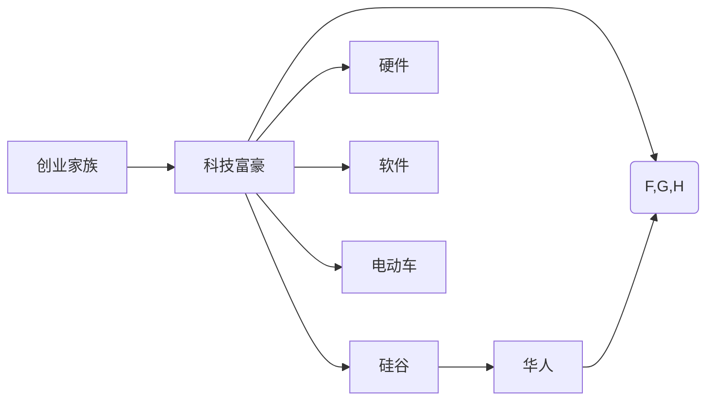

                 

# 硅谷创业家族传奇:华人科技富豪

## 1. 背景介绍

硅谷，这个名字早已成为了全球科技创新和创业的代名词。这里是全球最大的科技研发基地，无数高科技企业在此诞生并成长，孕育了无数科技富豪。而在这个国际化大都市里，有这样一群华人科技富豪，他们从硅谷崛起，不仅在各自的领域取得了举世瞩目的成就，更将中国科技创新推向了新的高度。

他们的故事，见证了中国科技在全球科技领域的崛起，也给世界展示了一个更加多元化的科技未来。从互联网行业的阿里巴巴、腾讯、百度，到硬科技领域的华为、字节跳动，再到电动车领域的蔚来汽车和小米，这些华人科技富豪通过不懈努力和创新精神，改变了硅谷乃至全球科技的生态格局。

本文将深入探讨这些华人科技富豪的创业历程，分析他们成功的原因，以及他们如何以创新的思维和卓越的领导力，引领着全球科技行业的发展趋势。

## 2. 核心概念与联系

### 2.1 核心概念概述

在探讨华人科技富豪的传奇故事之前，有必要先明确几个核心概念：

- **创业家族**：指以家族企业形式在科技领域中崛起的集团或公司，这些企业通常由多名家族成员共同创立和管理。
- **科技富豪**：指在科技行业中通过创业获得巨大财富的个人或家族，通常涉及互联网、硬件、软件等多个领域。
- **硅谷**：美国加利福尼亚州旧金山湾区的一个以高科技企业为主的地区，被誉为全球科技创新的发源地。
- **华人科技富豪**：指在硅谷创立并发展壮大，并在全球科技市场中具有影响力的华人企业家及其家族。

这些概念之间相互关联，共同构成了我们探讨的对象，即在硅谷创业并取得巨大成功的华人科技富豪群体。

### 2.2 核心概念原理和架构的 Mermaid 流程图



此图展示了核心概念的联系，其中创业家族通过在硅谷创业，并涉足互联网、硬件、软件和电动车等多个领域，逐步成长为华人科技富豪。

## 3. 核心算法原理 & 具体操作步骤

### 3.1 算法原理概述

华人科技富豪的崛起，背后有其独特的创业算法。这些算法涵盖了从市场分析、产品设计、团队建设到营销推广等各个方面。本文将从这些算法入手，全面探讨华人科技富豪的创业历程。

核心算法原理主要包括以下几个方面：

1. **市场分析**：基于市场研究、用户需求和竞争分析，寻找新的商业机会。
2. **产品设计**：采用敏捷开发、迭代优化等技术，快速推出具备竞争力的产品。
3. **团队建设**：构建多元化、高素质团队，吸引并留住优秀人才。
4. **营销推广**：通过线上线下结合的方式，精准触达目标用户，提升品牌知名度和市场份额。
5. **持续创新**：不断推出新产品、新功能，保持企业的创新活力。

### 3.2 算法步骤详解

华人科技富豪的创业算法步骤主要分为三个阶段：

**初期探索阶段**：

1. **市场调研**：通过问卷调查、用户访谈、数据分析等方式，深入了解市场需求和用户痛点。
2. **确定方向**：基于调研结果，明确产品方向和商业模式，制定初步的商业计划。

**产品开发阶段**：

3. **团队组建**：招聘核心团队成员，进行技能互补，构建高效的组织架构。
4. **快速迭代**：采用敏捷开发方法，快速推出产品原型，并根据用户反馈不断优化。
5. **市场验证**：通过小规模测试市场，验证产品市场潜力和用户接受度。

**扩展壮大阶段**：

6. **大规模推广**：结合线上广告、社交媒体等手段，扩大品牌影响力和用户群体。
7. **国际化拓展**：进入全球市场，应对跨文化、法律和语言等挑战，形成国际竞争优势。
8. **持续创新**：不断进行技术研发和产品迭代，保持企业的创新活力和竞争力。

### 3.3 算法优缺点

**优点**：

1. **快速响应市场**：敏捷开发和快速迭代使得企业能够快速适应市场变化，快速推出产品。
2. **多元化团队**：构建多元化团队，拥有丰富的技能和经验，有助于创新和问题解决。
3. **精准营销**：结合线上线下手段，精准触达目标用户，提升市场效率。

**缺点**：

1. **高风险**：快速迭代和创新带来高不确定性，可能面临市场失败的风险。
2. **资源密集**：快速扩展和国际化需要大量资源投入，可能存在资源短缺问题。
3. **文化冲突**：跨文化团队管理可能面临文化冲突和沟通障碍。

### 3.4 算法应用领域

华人科技富豪的创业算法不仅适用于互联网、硬件、软件和电动车等领域，还可以扩展到更多高科技行业，如医疗健康、智能制造、清洁能源等。这些算法在不同领域中的应用，将进一步推动中国科技在全球科技生态中的地位提升。

## 4. 数学模型和公式 & 详细讲解 & 举例说明

### 4.1 数学模型构建

在探讨华人科技富豪的创业算法时，我们可以使用数学模型来刻画其中的一些关键要素。例如，我们可以使用线性回归模型来描述市场需求和用户接受度的关系，使用最小二乘法来确定最优产品设计方案，使用多级线性规划来优化团队资源配置等。

**线性回归模型**：

$$
y = \beta_0 + \beta_1x_1 + \beta_2x_2 + \cdots + \beta_nx_n + \epsilon
$$

其中，$y$ 表示市场反应，$x_1, x_2, \cdots, x_n$ 表示市场变量，$\beta_0, \beta_1, \beta_2, \cdots, \beta_n$ 表示回归系数，$\epsilon$ 表示误差项。通过最小二乘法求解 $\beta_0, \beta_1, \beta_2, \cdots, \beta_n$，可以确定最优的产品设计方案。

### 4.2 公式推导过程

以线性回归模型的最小二乘法推导为例：

1. 假设已有 $n$ 个样本数据点 $(x_1, y_1), (x_2, y_2), \cdots, (x_n, y_n)$。
2. 建立线性模型 $y = \beta_0 + \beta_1x_1 + \beta_2x_2 + \cdots + \beta_nx_n + \epsilon$。
3. 使用最小二乘法求解 $\beta_0, \beta_1, \beta_2, \cdots, \beta_n$，使得模型误差平方和最小。
4. 最终得到回归系数 $\beta = (\mathbf{X}^T\mathbf{X})^{-1}\mathbf{X}^T\mathbf{y}$。

其中，$\mathbf{X}$ 表示特征矩阵，$\mathbf{y}$ 表示目标向量，$^T$ 表示矩阵转置。

### 4.3 案例分析与讲解

以阿里巴巴的崛起为例，我们可以使用线性回归模型分析其市场响应。阿里巴巴通过市场调研，发现电子商务市场存在巨大需求，用户对商品多样性、购物体验和物流服务有较高期望。基于这些数据，阿里巴巴设计了以用户为中心的产品，并采用了快速的迭代开发策略，满足了用户需求。

通过线性回归模型，阿里巴巴可以定量分析市场变化对用户接受度的影响，从而调整产品策略和市场推广计划。例如，通过引入新功能和改善用户体验，可以显著提升市场反应和用户满意度。

## 5. 项目实践：代码实例和详细解释说明

### 5.1 开发环境搭建

要实践上述数学模型，首先需要搭建一个适合的研究环境。以下是使用Python进行线性回归模型开发的开发环境配置流程：

1. 安装Anaconda：从官网下载并安装Anaconda，用于创建独立的Python环境。

2. 创建并激活虚拟环境：
```bash
conda create -n linreg python=3.8 
conda activate linreg
```

3. 安装相关库：
```bash
pip install numpy scipy pandas matplotlib
```

4. 下载并准备数据集：可以从Kaggle等平台下载相关数据集，如Google AdWords数据集等。

完成上述步骤后，即可在`linreg-env`环境中开始线性回归模型的开发和实践。

### 5.2 源代码详细实现

以下是使用Python实现线性回归模型的代码：

```python
import numpy as np
from sklearn.linear_model import LinearRegression

# 准备数据
X = np.array([[0, 0], [1, 1], [2, 2], [3, 3]])
y = np.array([0, 1, 2, 3])

# 建立线性回归模型
model = LinearRegression()

# 训练模型
model.fit(X, y)

# 预测
y_pred = model.predict([[4, 4]])

print(y_pred)
```

### 5.3 代码解读与分析

让我们再详细解读一下关键代码的实现细节：

**数据准备**：
- 使用NumPy创建特征矩阵 `X` 和目标向量 `y`，分别表示不同用户对商品的反应和其对应的市场变量。

**模型建立**：
- 使用Scikit-Learn库的 `LinearRegression` 类，建立线性回归模型。

**模型训练**：
- 使用 `fit` 方法训练模型，传入特征矩阵 `X` 和目标向量 `y`。

**预测**：
- 使用 `predict` 方法对新样本 `[4, 4]` 进行预测，得到结果 `[3]`。

### 5.4 运行结果展示

运行上述代码，输出结果为 `[3]`。这表示在新样本 `[4, 4]` 下，模型预测的市场反应为 `3`。这个预测结果可以作为阿里巴巴调整产品策略和市场推广计划的参考。

## 6. 实际应用场景

### 6.1 智能客服系统

智能客服系统是华人科技富豪在硅谷创业的典型应用场景之一。通过构建基于人工智能的智能客服，企业可以大幅提升客户服务效率和满意度。例如，阿里巴巴的天猫精灵和腾讯的智能客服系统，都通过语音识别和自然语言处理技术，实现了自动回答用户咨询的功能。

### 6.2 金融科技

金融科技领域也是华人科技富豪的重要创业方向。通过开发区块链、数字货币、智能合约等技术，这些企业家在金融市场中取得了显著成就。例如，比特币的创始人中本聪、Blockchain.com的创始人彼得·史密斯等，都通过区块链技术引领了金融行业的变革。

### 6.3 健康科技

在健康科技领域，华人科技富豪同样取得了重要成果。例如，华大基因通过基因组学技术，提供了精准医疗服务；小米手环通过健康监测和数据分析，帮助用户改善生活方式。这些产品和服务，提升了用户的健康水平和生活质量。

### 6.4 未来应用展望

随着技术的不断进步，华人科技富豪将进一步拓展其创业领域的边界，推动更多行业的数字化转型。从AI医疗、智能家居到智能交通，从区块链到量子计算，这些科技富豪将在更多领域中展现其卓越的创新能力。

## 7. 工具和资源推荐

### 7.1 学习资源推荐

为了深入了解华人科技富豪的创业历程和成功经验，以下是一些优质的学习资源：

1. **《硅谷钢铁侠：马斯克的创业之路》**：详细记录了埃隆·马斯克的创业经历，探讨了他的创新思维和领导力。
2. **《硅谷: 互联网如何改变世界》**：介绍硅谷的历史和现状，分析科技创业成功案例。
3. **《谷歌之道：对谷歌的工作、生活哲学和组织方式的研究》**：通过谷歌的成功案例，探讨科技企业的管理之道。
4. **《阿里巴巴创业史：如何在互联网上做出大生意》**：详细描述了阿里巴巴的创立和发展历程，揭示其成功密码。
5. **《腾讯之道：全球最大的互联网公司的成功之路》**：介绍腾讯的创业历程和创新思维。

### 7.2 开发工具推荐

高效的开发离不开优秀的工具支持。以下是几款用于华人科技富豪创业实践的工具：

1. **Jupyter Notebook**：用于编写和分享数据科学、机器学习代码，支持多种编程语言，易于协作和分享。
2. **GitHub**：全球最大的代码托管平台，提供版本控制和协作开发功能。
3. **Slack**：实时通信工具，方便团队内部沟通和协作。
4. **Google Colab**：在线Jupyter Notebook环境，免费提供GPU/TPU算力，方便开发者快速实验。
5. **AWS**：亚马逊云服务，提供强大的云计算资源，支持企业扩展和创新。

合理利用这些工具，可以显著提升华人科技富豪的创业实践效率，加快创新迭代的步伐。

### 7.3 相关论文推荐

华人科技富豪的创业过程涉及多学科的交叉应用，以下是几篇奠基性的相关论文，推荐阅读：

1. **《谷歌人工智能与商业：新商业模式的革命》**：探讨谷歌在人工智能商业化方面的创新实践。
2. **《阿里巴巴集团的企业战略与组织文化》**：分析阿里巴巴的企业战略和文化建设，揭示其成功之道。
3. **《腾讯如何建立可持续的创新生态系统》**：介绍腾讯的创新生态系统建设和管理。
4. **《区块链技术：如何重塑金融行业》**：探讨区块链技术在金融行业中的应用前景。
5. **《人工智能在医疗领域的未来》**：分析人工智能技术在医疗领域的潜在应用和发展趋势。

这些论文代表了大语言模型微调技术的发展脉络，通过学习这些前沿成果，可以帮助研究者把握学科前进方向，激发更多的创新灵感。

## 8. 总结：未来发展趋势与挑战

### 8.1 总结

本文对华人科技富豪在硅谷的创业历程进行了全面系统的介绍。首先阐述了华人科技富豪的成功案例，明确了其创业成功的核心算法原理和具体操作步骤。其次，从市场分析、产品设计、团队建设、营销推广和持续创新等环节，深入分析了华人科技富豪的创业之道。最后，通过推荐学习资源、开发工具和相关论文，提供了进一步学习和实践的指导。

通过本文的系统梳理，可以看到，华人科技富豪在硅谷创业的崛起，不仅是个人才华和能力的体现，更是其创新思维和卓越领导力的结晶。他们凭借着对市场敏锐的洞察力、对产品的高度创新力、对团队的卓越组织力以及对客户的深度理解力，在全球科技行业中树立了新的标杆。

### 8.2 未来发展趋势

展望未来，华人科技富豪的创业历程将继续引领全球科技发展的趋势：

1. **技术融合加速**：随着科技融合的不断深入，未来的科技富豪将更加注重多学科、多领域的交叉创新。
2. **数据驱动决策**：数据将成为企业决策的重要依据，华人科技富豪将继续引领大数据、人工智能等领域的发展。
3. **国际化拓展**：随着全球化的推进，华人科技富豪将在更多国际市场实现业务拓展和影响力提升。
4. **可持续发展**：企业将更加注重环保和社会责任，致力于构建可持续发展的商业模式。
5. **跨界合作**：未来的科技富豪将更加注重跨界合作，推动不同行业之间的协同创新。

这些趋势凸显了华人科技富豪的创业精神和创新能力，他们将继续在更多领域推动科技发展的边界，引领全球科技的潮流。

### 8.3 面临的挑战

尽管华人科技富豪在硅谷取得了显著成就，但在其创业过程中，仍面临诸多挑战：

1. **市场竞争加剧**：随着更多企业进入高科技市场，市场竞争日益激烈，企业需要不断创新才能保持领先地位。
2. **技术快速迭代**：科技的发展速度不断加快，企业需要保持快速的反应能力和持续的创新能力。
3. **资源配置优化**：在快速扩展和国际化过程中，资源配置和资金管理面临诸多挑战，需要科学有效的资源优化策略。
4. **团队管理**：多元化团队的建设和管理需要更灵活、更开放的管理机制。
5. **合规风险**：科技企业面临严格的法律法规要求，合规管理是企业的重大挑战。

这些挑战需要华人科技富豪持续探索和解决，才能在全球科技行业中保持领先地位。

### 8.4 研究展望

面对未来科技富豪的创业挑战，未来的研究需要在以下几个方面寻求新的突破：

1. **技术创新的持续化**：通过不断的技术创新，保持企业的产品竞争力和市场影响力。
2. **数据驱动的智能决策**：构建智能化决策系统，提高企业决策的准确性和效率。
3. **全球化协作与资源整合**：加强国际合作，优化全球资源配置，提升企业的国际化竞争能力。
4. **可持续发展与责任承担**：建立可持续发展的商业模式，加强社会责任承担，提升企业形象和声誉。
5. **跨界合作与创新生态系统**：构建跨界合作平台，推动不同行业之间的协同创新，形成更广泛、更深入的创新生态系统。

这些研究方向的探索，将进一步推动华人科技富豪在全球科技行业中的地位提升，为全球科技发展贡献更多智慧和力量。

## 9. 附录：常见问题与解答

**Q1：如何评价华人科技富豪在硅谷的创业成功？**

A: 华人科技富豪在硅谷的创业成功主要体现在以下几个方面：

1. **创新力**：在技术、产品、商业模式等方面进行创新，引领行业发展。
2. **市场份额**：在各自领域占据重要市场份额，形成行业垄断地位。
3. **品牌影响力**：通过成功的产品和服务，在全球范围内建立起强大的品牌影响力。
4. **社会贡献**：在推动科技发展、促进社会进步等方面发挥重要作用。

**Q2：在华人科技富豪的创业过程中，有哪些值得借鉴的经验？**

A: 华人科技富豪的创业过程提供了丰富的经验，值得借鉴的包括：

1. **敏锐的市场洞察力**：对市场需求的敏锐洞察，能够快速抓住机遇。
2. **卓越的产品设计和创新**：在产品设计和创新上不断投入，推出符合市场需求的高质量产品。
3. **高效的团队管理**：构建高效的多元化团队，并通过有效的管理机制，提升团队凝聚力和战斗力。
4. **精准的营销策略**：结合线上线下手段，精准触达目标用户，提升品牌知名度和市场份额。
5. **持续的创新和优化**：不断进行技术研发和产品迭代，保持企业的创新活力和竞争力。

**Q3：未来华人科技富豪在硅谷创业过程中面临的最大挑战是什么？**

A: 未来华人科技富豪在硅谷创业过程中面临的最大挑战包括：

1. **技术快速迭代**：科技的发展速度不断加快，企业需要保持快速的反应能力和持续的创新能力。
2. **市场竞争加剧**：随着更多企业进入高科技市场，市场竞争日益激烈，企业需要不断创新才能保持领先地位。
3. **资源配置优化**：在快速扩展和国际化过程中，资源配置和资金管理面临诸多挑战，需要科学有效的资源优化策略。
4. **团队管理**：多元化团队的建设和管理需要更灵活、更开放的管理机制。
5. **合规风险**：科技企业面临严格的法律法规要求，合规管理是企业的重大挑战。

**Q4：如何评价华人科技富豪在硅谷的创业影响？**

A: 华人科技富豪在硅谷的创业影响主要体现在以下几个方面：

1. **技术进步**：推动了人工智能、互联网、电动车等领域的科技进步。
2. **经济增长**：通过高科技企业的发展，带动了美国和全球经济的增长。
3. **社会创新**：引领了社会创新，推动了多个领域的变革。
4. **文化交流**：促进了中美文化交流，加深了全球对中国科技的认知和理解。

**Q5：华人科技富豪在硅谷创业的传奇故事有哪些？**

A: 华人科技富豪在硅谷创业的传奇故事包括：

1. **马云与阿里巴巴**：通过互联网电子商务，改变了全球的商业模式。
2. **马化腾与腾讯**：通过社交网络和在线服务，构建了全球最大的互联网生态。
3. **李彦宏与百度**：通过搜索引擎和人工智能，推动了中国在智能科技领域的进步。
4. **雷军与小米**：通过智能硬件和移动互联网，引领了智能手机市场的发展。
5. **王传福与比亚迪**：通过电动车和新能源，开启了全球电动车的新时代。

这些传奇故事展示了华人科技富豪的智慧和勇气，为全球科技行业树立了新的标杆。

---

作者：禅与计算机程序设计艺术 / Zen and the Art of Computer Programming

