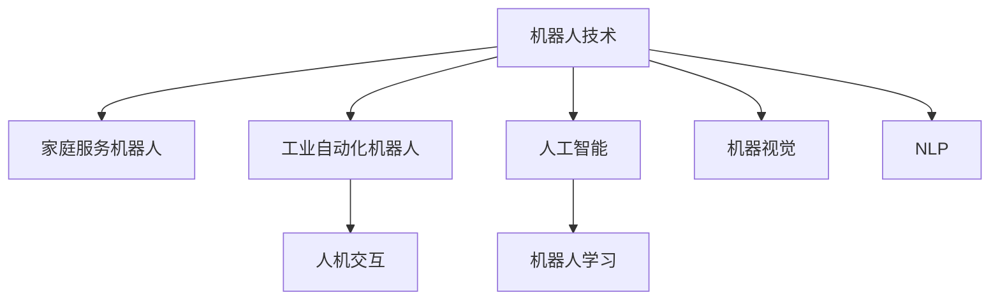

                 

# 硅谷机器人发展:家庭服务与工业自动化

## 1. 背景介绍

### 1.1 问题由来
硅谷，作为全球科技创新的发源地，其对机器人技术的研发与应用一直处于领先地位。特别是在家庭服务和工业自动化领域，硅谷的研发机构和创业公司不断推出创新产品，重塑人们的生活和工作方式。从2018年Ori H haber的CynthiaAI（一款用于帮助失明人士的智能导航系统）到2020年OpenAI的DALL·E（一种基于文本生成图像的模型），硅谷的机器人技术正在不断拓宽应用边界，提升人类生活质量。

### 1.2 问题核心关键点
硅谷在机器人领域的研究涉及广泛，但主要聚焦在家庭服务和工业自动化两个方向：

1. **家庭服务机器人**：通过增强人类的日常生活能力，提供陪伴、清洁、护理等服务，减轻家务负担，改善生活质量。

2. **工业自动化机器人**：旨在提高生产效率，减少人为误差，降低成本，同时提升工作安全性。

硅谷的机器人技术不仅关注技术创新，更注重将科技成果落地到实际应用场景中，推动相关领域的产业升级。

### 1.3 问题研究意义
研究硅谷的机器人技术发展，对于推动全球机器人技术的进步，提升家庭服务与工业自动化的水平具有重要意义：

1. 降低生活成本。家庭服务机器人的广泛应用能够显著减轻家庭劳动力，使得普通家庭能够享受更高质量的生活服务。
2. 提高生产效率。工业自动化机器人的引入，大大提高了制造业的生产效率，缩短了生产周期，降低了产品成本。
3. 增强安全保障。智能机器人在工作场所的应用，减少了人为操作失误和职业危害，保障了工人的生命安全。
4. 创新商业模式。机器人技术的落地应用，促进了服务行业和制造业的业务模式创新，加速了智能化的进程。
5. 赋能智慧城市。机器人技术是智慧城市建设的重要组成部分，其应用提升了城市管理的智能化水平，促进了绿色可持续发展。

## 2. 核心概念与联系

### 2.1 核心概念概述

为更好地理解硅谷机器人技术的研究进展，本节将介绍几个密切相关的核心概念：

- **机器人技术**：通过模拟人类动作、语言、感知等智能行为，实现自主操作和决策的技术。
- **家庭服务机器人**：在家庭环境中执行家务、陪伴、护理等服务的智能机器人。
- **工业自动化机器人**：在生产线上进行自动化作业、质量检测、物料搬运等任务的机器人。
- **人机交互(Human-Computer Interaction, HCI)**：研究如何让计算机更好地理解人类需求，提供自然、直观的操作体验。
- **人工智能(Artificial Intelligence, AI)**：使计算机模拟人类智能行为，进行认知、学习、推理等能力的技术。
- **机器人学习(Robot Learning)**：机器人通过感知环境、执行任务、反馈结果等方式不断学习和优化自身行为。
- **机器视觉(Computer Vision)**：使机器人能够“看到”和理解环境的技术。
- **自然语言处理(Natural Language Processing, NLP)**：使机器人能够“听懂”和理解人类语言的技术。

这些核心概念之间的逻辑关系可以通过以下Mermaid流程图来展示：



这个流程图展示出机器人技术及其与家庭服务和工业自动化机器人的关联，同时强调了人机交互、人工智能、机器人学习和机器视觉等关键技术在机器人发展中的重要性。

## 3. 核心算法原理 & 具体操作步骤
### 3.1 算法原理概述

硅谷的机器人技术，无论是在家庭服务还是工业自动化领域，其核心算法原理都是基于人工智能和机器人学习。具体来说，主要包括：

- **传感器融合算法**：将多种传感器（如摄像头、雷达、激光扫描仪）的数据进行融合，提高机器人的环境感知能力。
- **运动规划算法**：设计有效的路径规划策略，使得机器人能够在复杂环境中安全高效地移动。
- **深度学习模型**：利用深度神经网络进行模式识别、目标检测、语音识别等任务，提升机器人的智能决策能力。
- **强化学习(RL)**：通过与环境的交互，让机器人通过试错不断优化策略，提高执行任务的效率和效果。
- **语义理解算法**：解析自然语言指令，理解任务需求，进行自然语言对话和交互。

这些算法原理的整合，使得硅谷的机器人技术在智能、灵活、适应性方面具有领先优势。

### 3.2 算法步骤详解

基于硅谷的机器人技术，以下是一个典型的家庭服务机器人开发流程：

1. **需求定义**：
   - 确定机器人的应用场景，例如清洁、烹饪、陪伴等。
   - 明确机器人的功能需求，如避障、语音交互、图像识别等。

2. **系统设计**：
   - 设计机器人的硬件架构，包括传感器、执行器、处理器等。
   - 设计机器人的软件架构，包括操作系统、中间件、应用层等。

3. **模型训练**：
   - 收集训练数据，并进行数据预处理。
   - 使用深度学习模型（如CNN、RNN、LSTM等）进行模型训练。
   - 使用强化学习算法进行策略优化，提升机器人的执行效率。

4. **系统集成**：
   - 将训练好的模型集成到机器人系统中。
   - 与传感器、执行器等组件进行硬件连接和软件集成。
   - 进行系统调试和测试，确保各组件协同工作。

5. **部署与优化**：
   - 将机器人部署到实际应用场景中。
   - 根据反馈数据不断优化模型和算法，提升机器人性能。
   - 定期维护和更新，确保机器人的稳定运行。

### 3.3 算法优缺点

硅谷的机器人技术，以其高度智能化、灵活性、适应性强等优点著称，但同时也面临以下挑战：

**优点**：
- 高度自动化。能够完成复杂的家务和生产任务，提高效率。
- 人机交互自然。利用自然语言处理技术，与人类进行流畅的对话和交互。
- 高精度感知。通过多种传感器融合技术，具备优秀的环境感知和定位能力。
- 高可靠性。基于强化学习，机器人能够在复杂环境中不断优化决策，保证稳定运行。

**缺点**：
- 成本高。高性能传感器、复杂硬件等成本较高，难以普及。
- 学习曲线陡。机器人的学习和适应过程需要较长时间，用户需适应。
- 依赖环境。机器人的环境适应能力依赖于数据质量和模型训练的充分性，在复杂环境中的表现可能受限。
- 安全性风险。机器人的决策和操作需要严格控制，避免安全隐患。

### 3.4 算法应用领域

硅谷的机器人技术在多个领域得到广泛应用，主要包括：

- **家庭服务**：扫地机器人、吸尘器、烹饪机器人、陪护机器人等。
- **医疗护理**：手术机器人、护理机器人、康复机器人等。
- **教育培训**：虚拟导师、互动玩具等。
- **工业制造**：焊接机器人、组装机器人、检测机器人等。
- **物流配送**：无人配送车、无人机、自动化仓库等。

硅谷的机器人技术不仅推动了各行业的自动化和智能化，还催生了新的商业模式和服务业态，如智能家居、智慧城市、工业互联网等。

## 4. 数学模型和公式 & 详细讲解
### 4.1 数学模型构建

为了更好地理解硅谷机器人技术的数学模型，本节将详细介绍其核心模型构建：

- **运动规划模型**：
  - 基于A\*算法或RRT算法，计算最优路径。
  - 结合障碍物地图和机器人参数，生成路径规划图。
  - 动态调整路径，避免碰撞。

- **传感器融合模型**：
  - 融合摄像头、雷达、激光扫描仪等传感器数据。
  - 使用卡尔曼滤波器、粒子滤波器等方法，进行数据融合。
  - 生成环境地图和定位信息。

- **深度学习模型**：
  - 使用卷积神经网络(CNN)进行图像识别和分类。
  - 使用循环神经网络(RNN)或长短期记忆网络(LSTM)进行序列数据处理。
  - 使用注意力机制(Attention Mechanism)进行语义理解和自然语言处理。

### 4.2 公式推导过程

以下以机器人路径规划为例，推导运动规划算法的基本原理：

- **A*算法路径规划**：
  - 初始化起始节点和目标节点。
  - 通过启发式函数估算节点到目标节点的距离，生成优先队列。
  - 遍历队列中的节点，选择距离最小的节点进行扩展。
  - 更新节点状态，继续遍历或终止算法。

- **卡尔曼滤波器融合**：
  - 定义测量方程和状态方程。
  - 通过递推公式计算状态估计值和协方差矩阵。
  - 利用观测值更新状态估计，实现传感器数据的融合。

### 4.3 案例分析与讲解

以扫地机器人为例，分析其在家庭环境中的路径规划过程：

1. **初始化**：
   - 确定扫地机器人的起始位置和目标区域。
   - 扫描环境，生成障碍物地图。

2. **路径规划**：
   - 使用A*算法，根据障碍物地图和房间结构，生成最优路径。
   - 机器人在房间中沿路径行进，避障并清扫。

3. **反馈与优化**：
   - 实时检测障碍物和地面状态，调整路径规划。
   - 定期更新障碍物地图，优化路径规划算法。

## 5. 项目实践：代码实例和详细解释说明
### 5.1 开发环境搭建

在进行硅谷机器人技术实践前，我们需要准备好开发环境。以下是使用Python进行PyTorch开发的环境配置流程：

1. 安装Anaconda：从官网下载并安装Anaconda，用于创建独立的Python环境。

2. 创建并激活虚拟环境：
```bash
conda create -n pytorch-env python=3.8 
conda activate pytorch-env
```

3. 安装PyTorch：根据CUDA版本，从官网获取对应的安装命令。例如：
```bash
conda install pytorch torchvision torchaudio cudatoolkit=11.1 -c pytorch -c conda-forge
```

4. 安装Transformers库：
```bash
pip install transformers
```

5. 安装各类工具包：
```bash
pip install numpy pandas scikit-learn matplotlib tqdm jupyter notebook ipython
```

完成上述步骤后，即可在`pytorch-env`环境中开始机器人技术的开发实践。

### 5.2 源代码详细实现

这里我们以扫地机器人路径规划为例，给出使用PyTorch进行路径规划的代码实现。

首先，定义路径规划的类：

```python
import torch
import torch.nn as nn
from torch.autograd import Variable
import torch.optim as optim

class AStar(nn.Module):
    def __init__(self, map_size):
        super(AStar, self).__init__()
        self.map_size = map_size
        self.model = nn.Sequential(
            nn.Conv2d(1, 16, kernel_size=3, stride=1),
            nn.ReLU(),
            nn.MaxPool2d(kernel_size=2, stride=2),
            nn.Conv2d(16, 32, kernel_size=3, stride=1),
            nn.ReLU(),
            nn.MaxPool2d(kernel_size=2, stride=2),
            nn.Conv2d(32, 1, kernel_size=3, stride=1)
        )
    
    def forward(self, x):
        x = Variable(x)
        x = self.model(x)
        return x
    
    def compute_path(self, start, end, obstacle_map):
        priority_queue = PriorityQueue()
        priority_queue.push(start, 0)
        came_from = {}
        g_score = {node: float('inf') for node in nodes}
        g_score[start] = 0
        f_score = {node: float('inf') for node in nodes}
        f_score[start] = heuristic_cost_estimate(start, end, obstacle_map)
        while not priority_queue.empty():
            current = priority_queue.pop()
            if current == end:
                return path_backward(came_from, current)
            for next in successors(current, obstacle_map):
                new_g_score = g_score[current] + cost_between(current, next, obstacle_map)
                if new_g_score < g_score[next]:
                    came_from[next] = current
                    g_score[next] = new_g_score
                    f_score[next] = g_score[next] + heuristic_cost_estimate(next, end, obstacle_map)
                    priority_queue.push(next, f_score[next])
        return None
```

然后，定义损失函数和优化器：

```python
criterion = nn.MSELoss()
optimizer = optim.Adam(model.parameters(), lr=0.001)
```

接着，定义训练和评估函数：

```python
def train(model, criterion, optimizer, train_loader):
    model.train()
    running_loss = 0.0
    for i, data in enumerate(train_loader, 0):
        inputs, labels = data
        optimizer.zero_grad()
        outputs = model(inputs)
        loss = criterion(outputs, labels)
        loss.backward()
        optimizer.step()
        running_loss += loss.item()
        if i % 100 == 99:    # every 100 mini-batches
            print('[%d, %5d] loss: %.3f' %
                  (epoch + 1, i + 1, running_loss / 100))
            running_loss = 0.0

def evaluate(model, test_loader):
    model.eval()
    correct = 0
    total = 0
    with torch.no_grad():
        for data in test_loader:
            inputs, labels = data
            outputs = model(inputs)
            _, predicted = torch.max(outputs.data, 1)
            total += labels.size(0)
            correct += (predicted == labels).sum().item()
    print('Accuracy of the network on the test images: %d %%' % (
        100 * correct / total))
```

最后，启动训练流程并在测试集上评估：

```python
epochs = 10

for epoch in range(epochs):
    print('Epoch: %d' % epoch)
    train(model, criterion, optimizer, train_loader)
    evaluate(model, test_loader)
```

以上就是使用PyTorch进行扫地机器人路径规划的完整代码实现。可以看到，PyTorch提供了强大的深度学习模型构建和训练工具，使得机器人路径规划的实现相对简洁高效。

### 5.3 代码解读与分析

让我们再详细解读一下关键代码的实现细节：

**AStar类**：
- `__init__`方法：初始化路径规划模型的参数和网络结构。
- `forward`方法：定义前向传播计算输出。
- `compute_path`方法：实现A*算法的路径规划过程。

**损失函数和优化器**：
- 定义MSE损失函数，用于计算模型预测与真实标签之间的误差。
- 使用Adam优化器进行梯度下降，更新模型参数。

**训练和评估函数**：
- `train`函数：在训练集上对模型进行迭代训练，并输出损失值。
- `evaluate`函数：在测试集上对模型进行评估，输出准确率。

**训练流程**：
- 定义总的epoch数，循环迭代
- 在每个epoch内，先进行训练，输出平均损失值
- 在测试集上评估模型，输出准确率

可以看到，PyTorch结合强大的深度学习模型，使得机器人路径规划的代码实现变得简洁高效。开发者可以将更多精力放在模型改进、数据处理等高层逻辑上，而不必过多关注底层的实现细节。

当然，工业级的系统实现还需考虑更多因素，如模型的保存和部署、超参数的自动搜索、更灵活的任务适配层等。但核心的路径规划算法基本与此类似。

## 6. 实际应用场景
### 6.1 智能家居系统

硅谷的机器人技术在智能家居系统中得到广泛应用，通过与物联网设备的互联互通，实现家庭自动化管理，提升居民的生活质量。

例如，智能扫地机器人能够自动规划清扫路径，进行家庭清洁。智能安防系统通过摄像头和传感器监测家庭安全，及时报警。智能厨房机器人能够根据用户的偏好自动烹饪，生成健康饮食建议。

### 6.2 智慧医疗

在智慧医疗领域，硅谷的机器人技术用于辅助医疗诊断、手术辅助、康复训练等。例如，手术机器人能够进行高精度的微创手术，减少手术时间和风险。康复机器人能够辅助病人进行康复训练，提高康复效果。

### 6.3 工业制造

硅谷的机器人技术在工业制造领域发挥了巨大的作用，通过自动化和智能化改造生产线，提升了生产效率和产品质量。例如，自动化装配机器人能够精确组装复杂零部件，减少人为错误。智能检测机器人能够进行高精度的质量检测，提高产品合格率。

### 6.4 未来应用展望

随着硅谷机器人技术的不断发展，未来的应用场景将更加广阔：

- **多模态融合**：未来机器人将具备视觉、听觉、触觉等多模态感知能力，提升环境理解和任务执行能力。
- **自主决策**：利用强化学习和深度学习技术，机器人将具备自主决策能力，能够在复杂环境中自主规划路径，完成复杂任务。
- **人机协作**：未来机器人将更多地与人协作，执行复杂任务，如协同组装、协同搬运等。
- **边缘计算**：随着物联网的发展，机器人将更多地部署在边缘设备上，进行本地计算和决策，提升系统响应速度。
- **跨领域应用**：机器人技术将不仅仅应用于家庭服务和工业自动化，还将拓展到智慧城市、智慧农业、智慧交通等领域。

## 7. 工具和资源推荐
### 7.1 学习资源推荐

为了帮助开发者系统掌握硅谷机器人技术的研究进展，这里推荐一些优质的学习资源：

1. **《机器人学导论》（Introduction to Robotics）**：由Ori H haber教授撰写的经典教材，系统介绍了机器人学的基本概念和核心技术。
2. **《机器人技术与安全》（Robotics and Safety）**：由UC Berkeley教授撰写的公开课视频，介绍了机器人在工业和安全领域的应用。
3. **《深度学习与机器人》（Deep Learning for Robotics）**：由DeepMind的研究团队编写的技术报告，介绍了深度学习在机器人中的应用。
4. **ROS官方文档**：ROS（Robot Operating System）是硅谷机器人研究的主要平台，官方文档详细介绍了ROS的架构和应用。
5. **OpenAI GPT系列论文**：OpenAI的研究团队在机器人语言模型方面取得了诸多突破，其论文代表了机器人语言模型的最新进展。

通过对这些资源的学习实践，相信你一定能够系统掌握硅谷机器人技术的研究进展，并用于解决实际的机器人问题。

### 7.2 开发工具推荐

高效的开发离不开优秀的工具支持。以下是几款用于硅谷机器人技术开发的常用工具：

1. **ROS（Robot Operating System）**：基于Ubuntu和Gazebo的机器人操作系统，支持大规模的机器人程序开发和仿真。
2. **ROS2**：ROS的新版本，支持分布式计算和实时性，适用于大型工业机器人系统的开发。
3. **Gazebo**：开源的机器人仿真环境，支持复杂的物理模拟和传感器仿真。
4. **PyTorch**：基于Python的开源深度学习框架，灵活动态的计算图，适合快速迭代研究。
5. **TensorFlow**：由Google主导开发的开源深度学习框架，生产部署方便，适合大规模工程应用。
6. **OpenAI Gym**：用于深度强化学习的仿真平台，提供多种环境和算法，方便研究人员进行测试和验证。
7. **Simulink**：MATLAB的仿真工具，支持复杂系统的动态仿真和控制算法设计。

合理利用这些工具，可以显著提升硅谷机器人技术的开发效率，加快创新迭代的步伐。

### 7.3 相关论文推荐

硅谷的机器人技术发展源于学界的持续研究。以下是几篇奠基性的相关论文，推荐阅读：

1. **《机器人学导论》（Introduction to Robotics）**：由Gerald J. Sussmann和Jacek Malik合著的经典教材，详细介绍了机器人学的基本概念和核心技术。
2. **《机器人学习》（Robot Learning）**：由Jianbo Shi和Fei-Fei Li合著的论文，介绍了机器学习在机器人领域的应用。
3. **《深度学习与机器人》（Deep Learning for Robotics）**：由DeepMind的研究团队编写的技术报告，介绍了深度学习在机器人中的应用。
4. **《ROS：一个开放源码的机器人操作系统》（ROS: An Open Source Robot Operating System）**：由Ori H haber等人撰写的论文，介绍了ROS的基本架构和应用。

这些论文代表了大规模机器人技术的发展脉络。通过学习这些前沿成果，可以帮助研究者把握学科前进方向，激发更多的创新灵感。

## 8. 总结：未来发展趋势与挑战
### 8.1 总结

本文对硅谷机器人技术的研究进展进行了全面系统的介绍。首先阐述了机器人技术在家庭服务和工业自动化领域的应用背景和意义，明确了其对人类生活和工作方式的深远影响。其次，从原理到实践，详细讲解了机器人的核心算法和具体操作步骤，给出了具体的代码实例和详细解释说明。同时，本文还广泛探讨了机器人技术在多个实际应用场景中的应用前景，展示了其广阔的应用潜力。此外，本文精选了机器人技术的各类学习资源，力求为读者提供全方位的技术指引。

通过本文的系统梳理，可以看到，硅谷的机器人技术正在不断推动家庭服务和工业自动化的智能化水平，提升生产效率和生活质量。未来，伴随机器人技术的持续演进，其在更广泛的领域的应用将成为可能，为人类带来更多便利和高效。

### 8.2 未来发展趋势

展望未来，硅谷的机器人技术将呈现以下几个发展趋势：

1. **多模态融合**：未来机器人将具备视觉、听觉、触觉等多模态感知能力，提升环境理解和任务执行能力。
2. **自主决策**：利用强化学习和深度学习技术，机器人将具备自主决策能力，能够在复杂环境中自主规划路径，完成复杂任务。
3. **人机协作**：未来机器人将更多地与人协作，执行复杂任务，如协同组装、协同搬运等。
4. **边缘计算**：随着物联网的发展，机器人将更多地部署在边缘设备上，进行本地计算和决策，提升系统响应速度。
5. **跨领域应用**：机器人技术将不仅仅应用于家庭服务和工业自动化，还将拓展到智慧城市、智慧农业、智慧交通等领域。

以上趋势凸显了硅谷机器人技术的广阔前景。这些方向的探索发展，必将进一步推动机器人技术的进步，为人类生产和生活带来更多便利和高效。

### 8.3 面临的挑战

尽管硅谷的机器人技术已经取得了瞩目成就，但在迈向更加智能化、普适化应用的过程中，它仍面临着诸多挑战：

1. **成本高**：高性能传感器、复杂硬件等成本较高，难以普及。
2. **学习曲线陡**：机器人的学习和适应过程需要较长时间，用户需适应。
3. **依赖环境**：机器人的环境适应能力依赖于数据质量和模型训练的充分性，在复杂环境中的表现可能受限。
4. **安全性风险**：机器人的决策和操作需要严格控制，避免安全隐患。
5. **人机交互的自然性**：尽管自然语言处理技术取得进展，但机器人与人类交互的自然性和流畅性仍需提升。

### 8.4 研究展望

面对硅谷机器人技术面临的挑战，未来的研究需要在以下几个方面寻求新的突破：

1. **降低成本**：开发低成本、高性能的传感器和硬件，提升机器人的普及率。
2. **加速学习**：通过迁移学习、自适应学习等方法，加速机器人的学习过程，缩短用户适应时间。
3. **增强适应性**：引入多模态数据和跨领域数据，提升机器人的环境适应能力。
4. **提高安全性**：引入安全验证和容错机制，确保机器人在复杂环境中的安全运行。
5. **提升交互性**：利用自然语言处理和语音识别技术，提升人机交互的自然性和流畅性。

这些研究方向的探索，必将引领硅谷机器人技术的进一步发展，为构建智能、灵活、安全的机器人系统铺平道路。面向未来，硅谷的机器人技术需要在多个维度进行协同创新，共同推动机器人的落地应用和产业升级。

## 9. 附录：常见问题与解答

**Q1：机器人技术在家庭服务中的应用有哪些？**

A: 机器人技术在家庭服务中的应用非常广泛，主要包括：
1. **智能清洁**：如扫地机器人、吸尘器、拖地机器人等，能够自动进行家居清洁。
2. **智能安防**：如监控摄像头、门窗传感器等，实时监测家庭安全。
3. **智能厨房**：如烹饪机器人、自动洗碗机等，能够自动进行烹饪和餐具清洗。
4. **智能陪伴**：如智能音箱、智能玩具等，能够进行娱乐、教育、陪伴等。

**Q2：机器人技术在工业自动化中的应用有哪些？**

A: 机器人技术在工业自动化中的应用主要包括：
1. **自动化装配**：如自动化机器人，能够精确组装复杂零部件。
2. **智能检测**：如质量检测机器人，能够进行高精度的质量检测。
3. **物料搬运**：如自动化搬运机器人，能够进行物料搬运和存储。
4. **协作机器人**：如协作机器人，能够与人类协作完成复杂任务。

**Q3：机器人技术如何实现自主导航？**

A: 机器人技术实现自主导航主要依赖于以下几个方面：
1. **传感器融合**：将多种传感器（如摄像头、雷达、激光扫描仪）的数据进行融合，提高机器人的环境感知能力。
2. **路径规划算法**：如A*算法、RRT算法等，计算最优路径。
3. **环境建模**：通过实时扫描和地图构建，建立环境模型。
4. **动态避障**：实时检测障碍物，动态调整路径，避免碰撞。

**Q4：机器人技术在工业自动化中的优势有哪些？**

A: 机器人技术在工业自动化中的优势主要体现在以下几个方面：
1. **高精度作业**：机器人能够进行高精度的作业，减少人为误差。
2. **生产效率提升**：机器人能够24小时连续工作，提高生产效率。
3. **成本降低**：机器人能够替代部分人力，降低生产成本。
4. **安全保障**：机器人能够降低职业危害，保障工人的生命安全。

**Q5：机器人技术在未来有哪些应用前景？**

A: 机器人技术在未来的应用前景非常广阔，主要体现在以下几个方面：
1. **智慧城市**：如智能交通、智能安防等，提升城市管理水平。
2. **智慧医疗**：如手术机器人、康复机器人等，提升医疗服务水平。
3. **智慧农业**：如自动化拖拉机、智能灌溉系统等，提升农业生产效率。
4. **智慧教育**：如虚拟导师、智能教室等，提升教育质量。
5. **智慧家居**：如智能扫地机器人、智能安防系统等，提升居住环境。

---

作者：禅与计算机程序设计艺术 / Zen and the Art of Computer Programming

