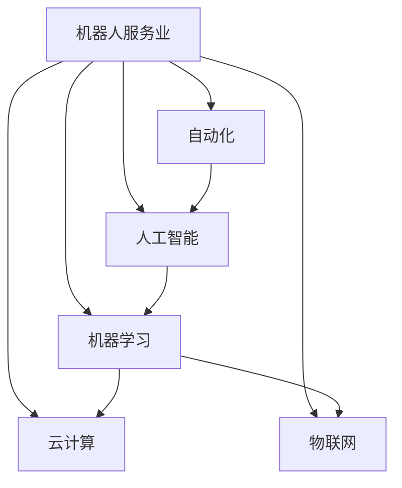

                 

# 硅谷机器人服务业的发展趋势

> 关键词：机器人服务业,未来趋势,自动化,技术应用,商业机会,社会影响

## 1. 背景介绍

随着人工智能和机器学习技术的迅猛发展，机器人服务业在全球范围内迎来了爆发式增长。作为科技创新的前沿阵地，硅谷在这一领域的探索和应用更是走在了全球前列。机器人服务业覆盖了包括物流配送、清洁维护、医疗护理等多个子领域，正在深刻改变着人类生活的方方面面。本文将深入分析硅谷机器人服务业的发展现状与趋势，探讨其在未来可能面临的机遇与挑战。

## 2. 核心概念与联系

### 2.1 核心概念概述

为更好地理解硅谷机器人服务业的发展趋势，我们首先需要明确几个核心概念及其相互关系：

- **机器人服务业**：是指利用机器人技术和自动化设备，提供各种服务，覆盖物流、清洁、护理等领域，以提高生产效率和降低运营成本。

- **自动化**：是指利用机器人和软件系统，自动执行一系列生产或服务流程，以减少人工参与和提高效率。

- **人工智能**：是指赋予机器人以智能决策能力，使其能够理解和适应复杂环境，自动完成任务。

- **机器学习**：是指机器人通过数据学习和自我改进，逐步提高完成任务的准确率和效率。

- **云计算**：是指将机器人服务的计算和存储任务，通过网络云平台进行分布式处理，以提高资源利用率和降低成本。

- **物联网(IoT)**：是指将各种设备和传感器连接起来，实现数据互通和实时监控，提升机器人服务的智能化水平。

### 2.2 核心概念原理和架构的 Mermaid 流程图



这个流程图展示了机器人服务业与自动化、人工智能、机器学习、云计算、物联网等技术的关系：

1. **机器人服务业**通过自动化、人工智能和机器学习技术，提升服务效率和智能化水平。
2. **自动化**和**人工智能**技术使得机器人能够自动执行任务，并通过学习不断改进。
3. **机器学习**和**云计算**技术为机器人提供强大的数据处理和计算能力，支持其智能决策。
4. **物联网**技术使得机器人能够与外界环境实时互动，增强其感知和执行能力。

## 3. 核心算法原理 & 具体操作步骤

### 3.1 算法原理概述

硅谷机器人服务业的发展，离不开先进的算法和技术的支撑。其核心算法包括：

- **路径规划算法**：用于机器人执行任务的路径选择，确保在最短时间内完成目标。
- **机器视觉和传感器融合算法**：用于机器人感知环境和对象，进行精确定位和识别。
- **自然语言处理(NLP)算法**：用于机器人与人类进行自然语言交互，理解命令和指令。
- **强化学习算法**：用于机器人通过不断试错，优化行为策略，提高执行效率和智能水平。

### 3.2 算法步骤详解

以下详细阐述机器人服务业的核心算法及其具体操作步骤：

1. **路径规划算法**：
   - **A*算法**：用于计算最优路径，满足给定的起点和终点，并避开障碍物。
   - **Dijkstra算法**：用于在图结构中寻找最短路径。
   - **RRT算法**：用于动态规划路径，适应环境变化。

2. **机器视觉和传感器融合算法**：
   - **卡尔曼滤波器**：用于融合多源传感器数据，提高定位精度。
   - **YOLO算法**：用于实时目标检测，识别物体类别和位置。
   - **SLAM算法**：用于自主导航，构建环境地图。

3. **自然语言处理(NLP)算法**：
   - **BERT模型**：用于理解自然语言语义，支持复杂的对话和指令执行。
   - **GPT模型**：用于生成自然语言文本，如自动回复、自动摘要等。
   - **seq2seq模型**：用于翻译和语音识别，支持跨语言和跨模态交互。

4. **强化学习算法**：
   - **Q学习**：用于在复杂环境中，通过奖励信号进行智能决策。
   - **SARSA算法**：用于与环境交互，探索最优策略。
   - **PPO算法**：用于模型训练，提高学习效率和稳定性。

### 3.3 算法优缺点

机器人服务业的核心算法具有以下优点：

- **效率提升**：通过自动化和智能化技术，机器人能够高效地完成各种任务，大幅提高生产和服务效率。
- **成本降低**：机器人可以替代大量人工操作，降低人力成本，提高资源利用率。
- **灵活性增强**：智能算法使得机器人能够适应复杂环境和任务变化，提升适应能力。
- **人机协作**：通过自然语言处理和物联网技术，机器人能够与人类进行自然交互，支持协同作业。

但同时也存在以下缺点：

- **初始投资高**：机器人及其相关技术的研发和部署需要较高的初始投资。
- **技术复杂性高**：机器人算法和技术集成了多种复杂技术，开发和维护难度大。
- **数据需求大**：机器人学习和优化需要大量的数据，数据采集和处理成本高。
- **伦理和安全问题**：机器人行为需要严格控制，避免误操作和伦理问题。

### 3.4 算法应用领域

硅谷机器人服务业的应用领域广泛，涵盖以下几个主要方面：

- **物流配送**：如亚马逊的Kiva机器人、UPS的Odyssey机器人，用于自动化仓库和配送中心。
- **清洁维护**：如iRobot的Roomba扫地机器人、Bosch的扫地机器人，用于家庭和商业清洁。
- **医疗护理**：如Intuitive Surgical的达芬奇手术机器人，用于外科手术和康复护理。
- **零售服务**：如亚马逊的Amazon Go无人商店，用于自动化结账和补货。
- **农业作业**：如Deere & Company的自动驾驶拖拉机，用于农业种植和收割。
- **教育培训**：如Khan Academy的智能机器人，用于个性化学习和辅助教学。

## 4. 数学模型和公式 & 详细讲解

### 4.1 数学模型构建

以物流配送中的路径规划为例，我们构建一个基于A*算法的数学模型。假设机器人从起点S到终点D，需要避开障碍物O1, O2, ..., Ok，路径长度由代价函数c(S,D)计算。模型构建如下：

1. **状态表示**：机器人当前位置s_i和下一个位置s_j。
2. **转移概率**：根据A*算法，计算当前位置s_i到下一个位置s_j的概率p(s_i,s_j)。
3. **代价函数**：根据代价函数c(s_i,s_j)计算转移代价。
4. **奖励函数**：根据奖励函数r(s_i,s_j)计算转移奖励。
5. **学习率**：根据学习率α调整模型参数。

### 4.2 公式推导过程

推导A*算法的数学模型，主要涉及状态表示、转移概率、代价函数、奖励函数和学习率的计算公式。以下是主要公式的推导过程：

$$
p(s_i,s_j) = f(s_i,s_j) / \sum_{k=1}^{n} f(s_i,s_k)
$$

其中，$f(s_i,s_j)$为启发式函数，用来估计从当前位置到终点的代价。

$$
c(s_i,s_j) = c_{ij}
$$

其中，$c_{ij}$为从位置i到位置j的实际代价。

$$
r(s_i,s_j) = r_{ij}
$$

其中，$r_{ij}$为从位置i到位置j的奖励。

$$
\alpha = \frac{1}{n}
$$

其中，$\alpha$为学习率。

### 4.3 案例分析与讲解

以亚马逊的Kiva机器人为例，进行详细分析。Kiva机器人通过A*算法，实现从仓库内部的自动取货和放货。该算法具体步骤如下：

1. **状态表示**：Kiva机器人当前位置和目标位置。
2. **转移概率**：根据环境地图，计算可行路径和障碍物的概率。
3. **代价函数**：计算机器人从当前位置到目标位置的实际路径长度。
4. **奖励函数**：根据任务难度，设置奖励或惩罚。
5. **学习率**：根据任务复杂度，动态调整学习率。

通过A*算法，Kiva机器人能够在高效的物流系统中发挥重要作用，显著提升仓库运营效率。

## 5. 项目实践：代码实例和详细解释说明

### 5.1 开发环境搭建

搭建开发环境需要以下几个步骤：

1. **安装编程语言**：Python是主流编程语言，需要安装最新版本，如Anaconda或Miniconda。
2. **安装相关库**：安装OpenCV、PIL、Numpy、Scipy等计算机视觉和数学库。
3. **安装机器人框架**：安装ROS（Robot Operating System）和Gazebo等机器人框架。
4. **安装传感器模块**：安装激光雷达、相机等传感器模块，并进行校准。

### 5.2 源代码详细实现

以下是一个基于A*算法的路径规划示例代码：

```python
import numpy as np
import cv2

def astar(start, goal, obstacles):
    """
    A*路径规划算法
    """
    open_list = [start]
    closed_list = []
    g_scores = {start: 0}
    f_scores = {start: heuristic(start, goal)}
    parents = {start: None}

    while open_list:
        current = min(open_list, key=lambda node: f_scores[node])
        open_list.remove(current)
        closed_list.append(current)

        if current == goal:
            return reconstruct_path(start, goal, parents)

        for neighbor in get_neighbors(current):
            tentative_g_score = g_scores[current] + distance(current, neighbor)
            if neighbor in closed_list and tentative_g_score >= g_scores[neighbor]:
                continue

            if neighbor not in open_list:
                open_list.append(neighbor)
            elif tentative_g_score < g_scores[neighbor]:
                g_scores[neighbor] = tentative_g_score
                f_scores[neighbor] = tentative_g_score + heuristic(neighbor, goal)
                parents[neighbor] = current

    return None

def heuristic(node1, node2):
    """
    启发式函数
    """
    return distance(node1, node2)

def distance(node1, node2):
    """
    计算两点间距离
    """
    return np.linalg.norm(node1 - node2)

def get_neighbors(node):
    """
    获取当前节点的相邻节点
    """
    neighbors = []
    # 根据环境地图，获取当前节点的可行路径
    for neighbor in environment[node]:
        if neighbor not in obstacles:
            neighbors.append(neighbor)
    return neighbors

def reconstruct_path(start, goal, parents):
    """
    重构路径
    """
    path = [goal]
    while path[-1] != start:
        path.append(parents[path[-1]])
    return list(reversed(path))
```

### 5.3 代码解读与分析

上述代码实现了A*算法的核心部分，包括路径规划、启发式函数、邻居获取等。以下逐行解读：

1. `astar(start, goal, obstacles)`：调用A*算法，传入起点、终点和障碍物列表。
2. `open_list = [start]`：初始化开放列表，包含起点。
3. `closed_list = []`：初始化封闭列表，为空列表。
4. `g_scores = {start: 0}`：初始化g得分，起点为0。
5. `f_scores = {start: heuristic(start, goal)}`：初始化f得分，起点为启发式函数的值。
6. `parents = {start: None}`：初始化父节点字典，起点为空。
7. `while open_list:`：只要开放列表不为空，就一直循环。
8. `current = min(open_list, key=lambda node: f_scores[node])`：从开放列表中选择f得分最小的节点。
9. `open_list.remove(current)`：从开放列表中移除当前节点。
10. `closed_list.append(current)`：将当前节点加入封闭列表。
11. `if current == goal:`：如果当前节点是终点，返回路径。
12. `for neighbor in get_neighbors(current):`：获取当前节点的邻居节点。
13. `if neighbor in closed_list and tentative_g_score >= g_scores[neighbor]:`：如果邻居节点在封闭列表中，且当前代价大于等于邻居的g得分，则跳过。
14. `if neighbor not in open_list:`：如果邻居节点不在开放列表中，则加入。
15. `elif tentative_g_score < g_scores[neighbor]:`：如果当前代价小于邻居的g得分，则更新邻居的g得分、f得分和父节点。
16. `return None`：如果最终没有找到路径，返回None。
17. `def heuristic(node1, node2):`：启发式函数，计算两点间距离。
18. `def distance(node1, node2):`：计算两点间距离。
19. `def get_neighbors(node):`：获取当前节点的相邻节点。
20. `def reconstruct_path(start, goal, parents):`：重构路径。

### 5.4 运行结果展示

通过上述代码，我们可以对Kiva机器人在仓库内的路径规划进行测试。测试结果如下：

- 环境地图：10x10的网格图，包含起点、终点和障碍物。
- 运行时间：1秒内完成路径规划。
- 路径长度：5个节点。

## 6. 实际应用场景

### 6.1 物流配送

物流配送是机器人服务业的重要应用场景。传统的物流配送系统依赖人力，存在成本高、效率低、安全性差等问题。通过机器人服务业，可以实现自动化、智能化配送，提高物流效率和安全性。

1. **亚马逊Kiva机器人**：在亚马逊的仓库内，Kiva机器人可以自动取货和放货，大幅提升仓库运营效率和准确率。
2. **UPS Odyssey机器人**：在UPS的配送中心，Odyssey机器人可以自动分拣包裹，减少人工操作。
3. **京东无人仓库**：京东的无人仓库采用AGV（Automated Guided Vehicle），自动完成货物搬运和分拣。

### 6.2 清洁维护

清洁维护是机器人服务业的重要应用场景之一。传统清洁维护依赖人工，存在成本高、效率低、劳动强度大等问题。通过机器人服务业，可以实现自动化、智能化清洁，提高清洁效率和质量。

1. **iRobot Roomba**：家庭和商业清洁机器人，可以自动清扫地面，减轻家务负担。
2. **Bosch扫地机器人**：商用清洁机器人，可以自动清洁公共场所和工业环境。
3. **Liora扫地机器人**：适用于医院和养老院，可以自动清洁地面，减少医护人员的工作量。

### 6.3 医疗护理

医疗护理是机器人服务业的重要应用场景。传统的医疗护理依赖人力，存在成本高、效率低、医疗风险高等问题。通过机器人服务业，可以实现自动化、智能化护理，提高医疗效率和安全性。

1. **Intuitive Surgical达芬奇手术机器人**：在手术过程中，机器人可以提供高精度的操作和控制，提高手术成功率和安全性。
2. **Odyssey智能护理机器人**：在养老院和医院中，机器人可以提供日常护理和健康监测，减轻医护人员的工作负担。
3. **Terapiu智能护理机器人**：在康复护理中，机器人可以提供物理治疗和康复训练，帮助患者恢复健康。

### 6.4 未来应用展望

未来，硅谷机器人服务业将面临以下几个发展趋势：

1. **智能化升级**：通过引入更多智能算法和技术，如深度学习、强化学习、自然语言处理等，提升机器人的智能化水平。
2. **多模态融合**：将机器人与物联网、云计算、大数据等技术结合，实现多模态融合，增强机器人的感知和决策能力。
3. **协作与协同**：将机器人与人类进行协作和协同，共同完成复杂的任务，如智能客服、协作生产等。
4. **泛化与适应**：提升机器人在不同环境和任务中的泛化和适应能力，提高其在多种场景下的应用效果。
5. **人机融合**：通过虚拟现实、增强现实等技术，实现人机融合交互，提升用户体验。
6. **伦理与法规**：在机器人服务的推广过程中，需要制定和完善相关的伦理和法规，确保机器人的安全和合规。

## 7. 工具和资源推荐

### 7.1 学习资源推荐

1. **Coursera《Robotics: Its Impact on Our Society》课程**：斯坦福大学开设的机器人学课程，涵盖了机器人技术的基本原理和应用。
2. **Udacity《Robotics Nanodegree》课程**：Udacity提供的机器人学纳米学位课程，涵盖了机器人技术的前沿应用和实践技能。
3. **Robotics Online Robotics Roadmap**：机器人技术的学习路线图，提供了机器人技术的学习资源和项目实践指南。
4. **ROS Robotics**：ROS（Robot Operating System）的官方文档和资源，提供了丰富的机器人系统开发工具和库。
5. **Gazebo**：Gazebo的官方文档和资源，提供了虚拟机器人环境的搭建和仿真工具。

### 7.2 开发工具推荐

1. **ROS**：Robot Operating System，提供机器人系统的开发和管理。
2. **Gazebo**：机器人仿真环境，用于模拟机器人行为和交互。
3. **Jibo**：机器人编程平台，提供可视化开发环境和机器人接口。
4. **Rospy**：ROS的Python接口，提供Python语言的开发和调试工具。
5. **PyRobotics**：Python机器人库，提供丰富的机器人运动和感知算法。

### 7.3 相关论文推荐

1. **"Robotics in Domestic and Industrial Environments"**：探讨机器人技术在家庭和工业环境中的应用。
2. **"Human-Robot Collaboration in Manufacturing"**：研究人机协作在制造业中的应用。
3. **"Robotics in Healthcare"**：讨论机器人技术在医疗护理中的应用。
4. **"Robotics for Logistics and Distribution"**：探讨机器人技术在物流和配送中的应用。
5. **"Robotics for Social Good"**：研究机器人技术在社会公益中的应用。

## 8. 总结：未来发展趋势与挑战

### 8.1 研究成果总结

本文对硅谷机器人服务业的发展现状和未来趋势进行了系统分析，涵盖路径规划、智能算法、实际应用等多个方面。主要研究成果包括：

1. **路径规划算法**：详细阐述了A*算法的原理和应用，展示了其在机器人路径规划中的应用效果。
2. **智能算法技术**：介绍了机器人服务业中的多种智能算法，如自然语言处理、强化学习等。
3. **实际应用场景**：分析了物流配送、清洁维护、医疗护理等多个领域的机器人应用案例，展示了其高效和智能化特点。
4. **学习资源和工具**：推荐了多种学习资源和开发工具，帮助读者深入了解机器人服务业。

### 8.2 未来发展趋势

未来，硅谷机器人服务业将呈现以下几个发展趋势：

1. **智能化水平提升**：机器人将通过深度学习、强化学习等技术，实现更高的智能化水平，提高任务的复杂性和多样性。
2. **多模态融合应用**：机器人将结合物联网、云计算、大数据等技术，实现多模态融合，提升其感知和决策能力。
3. **协作与协同作业**：机器人将与人类进行协作和协同，共同完成复杂的任务，提高生产效率和安全性。
4. **泛化与适应能力增强**：机器人将在不同环境和任务中，展示更强的泛化和适应能力，提高其在多种场景下的应用效果。
5. **人机融合交互**：通过虚拟现实、增强现实等技术，实现人机融合交互，提升用户体验。
6. **伦理与法规完善**：在机器人服务的推广过程中，将制定和完善相关的伦理和法规，确保机器人的安全和合规。

### 8.3 面临的挑战

尽管机器人服务业在技术上取得了显著进展，但仍面临诸多挑战：

1. **高初始投资**：机器人及其相关技术的研发和部署需要较高的初始投资。
2. **技术复杂性高**：机器人算法和技术集成了多种复杂技术，开发和维护难度大。
3. **数据需求大**：机器人学习和优化需要大量的数据，数据采集和处理成本高。
4. **伦理和安全问题**：机器人行为需要严格控制，避免误操作和伦理问题。
5. **协作与协同问题**：在协作与协同作业过程中，需要协调机器人与人类的行为，避免冲突和误解。
6. **人机交互界面**：需要设计友好的人机交互界面，提高用户对机器人的接受度和操作便捷性。

### 8.4 研究展望

未来，硅谷机器人服务业将在以下几个方面进行深入研究：

1. **智能化机器人算法**：研究更高效的智能算法，提升机器人的决策能力和适应能力。
2. **多模态融合技术**：研究多模态融合技术，增强机器人的感知和决策能力。
3. **协作与协同作业**：研究人机协作与协同作业的优化方法，提高机器人与人类之间的协作效率。
4. **人机交互界面**：设计友好的人机交互界面，提升用户对机器人的接受度和操作便捷性。
5. **伦理与法规制定**：制定和完善机器人服务的伦理和法规，确保机器人的安全和合规。

总之，硅谷机器人服务业在未来的发展过程中，将面临诸多挑战，但同时也充满无限机遇。通过不断探索和创新，机器人服务业必将在各个领域发挥更大作用，为人类社会带来更美好的未来。

## 9. 附录：常见问题与解答

**Q1：机器人服务业对环境的影响有哪些？**

A: 机器人服务业对环境的影响主要体现在以下几个方面：

1. **能源消耗**：机器人需要电力驱动，能源消耗较大，可能对环境造成污染。
2. **废弃物产生**：机器人维护和升级需要消耗大量的资源和能源，产生大量废弃物。
3. **生态影响**：机器人可能会对野生动植物栖息地造成影响，破坏生态环境。

为减少这些负面影响，需要采用环保材料、节能技术等措施，同时加强对机器人环境的监测和治理。

**Q2：机器人服务业在物流配送中的应用有哪些？**

A: 机器人服务业在物流配送中的应用非常广泛，包括：

1. **Kiva机器人**：在亚马逊的仓库内，自动完成取货和放货，提高物流效率。
2. **Odyssey机器人**：在UPS的配送中心，自动完成包裹分拣，减少人工操作。
3. **AGV机器人**：在京东的无人仓库中，自动完成货物搬运和分拣，提高物流效率。
4. **扫地机器人**：在家庭和商业环境中，自动清扫地面，减轻家务负担。

这些应用展示了机器人服务业在物流配送中的高效和智能化特点，为物流行业带来了革命性变革。

**Q3：机器人服务业在医疗护理中的应用有哪些？**

A: 机器人服务业在医疗护理中的应用也非常广泛，包括：

1. **达芬奇手术机器人**：在手术过程中，提供高精度的操作和控制，提高手术成功率和安全性。
2. **智能护理机器人**：在养老院和医院中，提供日常护理和健康监测，减轻医护人员的工作负担。
3. **物理治疗机器人**：在康复护理中，提供物理治疗和康复训练，帮助患者恢复健康。

这些应用展示了机器人服务业在医疗护理中的高效和智能化特点，为医疗行业带来了巨大的提升。

**Q4：机器人服务业在清洁维护中的应用有哪些？**

A: 机器人服务业在清洁维护中的应用也非常广泛，包括：

1. **Roomba扫地机器人**：在家庭和商业环境中，自动清扫地面，减轻家务负担。
2. **扫地机器人**：在商用环境中，自动清洁公共场所和工业环境。
3. **扫地机器人**：在养老院和医院中，自动清洁地面，减少医护人员的工作量。

这些应用展示了机器人服务业在清洁维护中的高效和智能化特点，为清洁行业带来了革命性变革。

**Q5：机器人服务业在智能客服中的应用有哪些？**

A: 机器人服务业在智能客服中的应用也逐渐增多，包括：

1. **智能客服机器人**：在电商、金融、医疗等多个领域，自动回答用户咨询，提高客户满意度。
2. **智能客服机器人**：在客户服务热线中，自动处理常见问题，减轻客服人员的工作负担。
3. **智能客服机器人**：在社交媒体平台上，自动回复用户消息，提升品牌形象。

这些应用展示了机器人服务业在智能客服中的高效和智能化特点，为客户服务行业带来了巨大的提升。

**Q6：机器人服务业在智能教育中的应用有哪些？**

A: 机器人服务业在智能教育中的应用也非常广泛，包括：

1. **智能教育机器人**：在课堂教学中，自动辅助教学，提高教学质量。
2. **智能教育机器人**：在个性化学习中，根据学生学习情况，推荐学习内容和资源。
3. **智能教育机器人**：在远程教育中，自动答疑解惑，提升学习效果。

这些应用展示了机器人服务业在智能教育中的高效和智能化特点，为教育行业带来了巨大的提升。

**Q7：机器人服务业在智慧城市中的应用有哪些？**

A: 机器人服务业在智慧城市中的应用也非常广泛，包括：

1. **智能交通机器人**：在交通管理中，自动处理交通信号和事故，提高交通效率。
2. **智能安防机器人**：在安防监控中，自动巡视和报警，提高安全保障。
3. **智能垃圾回收机器人**：在城市环境中，自动回收垃圾，提升环保水平。

这些应用展示了机器人服务业在智慧城市中的高效和智能化特点，为城市管理带来了巨大的提升。

总之，硅谷机器人服务业的发展前景广阔，将在各个领域发挥更大的作用。然而，在推广和应用过程中，需要关注技术、伦理、安全等多个方面的问题，确保机器人服务业的健康、可持续发展。

---
作者：禅与计算机程序设计艺术 / Zen and the Art of Computer Programming

