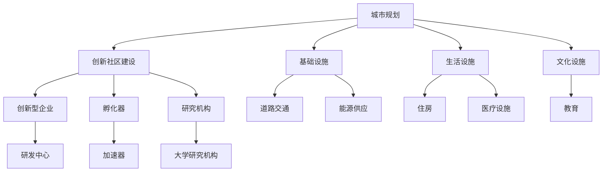

                 

## 1. 背景介绍

随着科技的迅猛发展，硅谷作为全球科技创新中心，其城市规划和创新社区的建设一直备受瞩目。作为世界上最具创新力和活力的地区之一，硅谷不仅吸引了全球顶尖的科技公司和创业者，也成为各国政府和城市规划者们学习的榜样。本文将深入探讨硅谷城市规划的核心概念、发展历程及创新社区建设，为其他地区提供有益的参考。

## 2. 核心概念与联系

### 2.1 核心概念概述

在探讨硅谷的城市规划和创新社区建设之前，首先要明确几个核心概念：

- **城市规划(Urban Planning)**：城市规划是指对城市发展进行合理布局和设计的过程，旨在通过科学、合理地配置空间资源，提升城市生活质量和可持续发展能力。
- **创新社区(Innovative Community)**：创新社区是指以知识经济、高科技产业和创新创业为主要特征的社区，通常包括各类创新型企业、孵化器、研究机构等。
- **社区建设(Community Building)**：社区建设是指通过构建完善的基础设施、生活设施和文化设施，营造一个适宜创新人才居住、工作和生活的环境，吸引和留住创新人才。

这些核心概念之间紧密联系，共同构成了硅谷城市规划和创新社区建设的理论基础。通过城市规划，硅谷能够合理配置资源，为创新社区的建设提供坚实基础；而创新社区的建设，又进一步推动了城市经济的繁荣和可持续发展。

### 2.2 核心概念原理和架构的 Mermaid 流程图



该图展示了城市规划与创新社区建设之间的关系，以及两者各自包含的关键要素。城市规划通过配置基础设施、生活设施和文化设施，为创新社区的建设提供保障；而创新社区建设则通过引入各类创新要素，促进城市经济的繁荣和可持续发展。

## 3. 核心算法原理 & 具体操作步骤

### 3.1 算法原理概述

硅谷的城市规划和创新社区建设，可以看作是一个复杂的大规模优化问题。核心算法原理主要包括：

- **资源优化**：通过合理配置城市资源，如土地、能源、交通等，最大化城市综合效益。
- **需求预测**：基于历史数据和市场分析，预测未来城市人口增长、经济需求等变化，以指导城市规划和建设。
- **多目标优化**：在城市规划和创新社区建设中，需要平衡经济增长、环境保护、社会福祉等多重目标。

### 3.2 算法步骤详解

#### 3.2.1 初始化

- **确定目标**：明确城市规划和创新社区建设的目标，如人口规模、经济增长、环境保护等。
- **收集数据**：收集相关数据，如人口统计、土地利用、能源消耗、交通流量等。
- **模型选择**：选择合适的优化模型，如线性规划、多目标优化、遗传算法等。

#### 3.2.2 迭代优化

- **建立模型**：根据收集的数据和目标，建立优化模型。
- **求解优化**：使用优化算法求解模型，得到初始方案。
- **评估方案**：评估初始方案，检查是否满足目标要求。
- **调整方案**：根据评估结果，对方案进行调整，重新迭代优化。

#### 3.2.3 结果输出

- **方案实施**：将优化得到的方案付诸实施。
- **监控评估**：对实施效果进行监控和评估，确保目标达成。
- **调整优化**：根据监控评估结果，对方案进行调整，进行新一轮的迭代优化。

### 3.3 算法优缺点

#### 3.3.1 优点

- **系统性**：通过科学的方法和模型，能够系统性地解决城市规划和创新社区建设中的复杂问题。
- **可量化**：模型和算法提供了一种量化的方法来评估和优化城市规划和创新社区建设的效果。
- **灵活性**：模型和算法可以根据实际情况进行调整和优化，适应不同城市的特定需求。

#### 3.3.2 缺点

- **数据依赖**：算法的效果高度依赖于数据的质量和完整性，数据不准确或缺失可能导致方案不可行。
- **模型复杂**：部分算法模型复杂，可能需要较高的计算资源和时间。
- **假设限制**：模型假设可能与实际情况存在差异，导致方案实施效果不佳。

### 3.4 算法应用领域

城市规划和创新社区建设涉及多个领域，包括：

- **城市交通**：通过优化交通流、建设公共交通系统，提高城市交通效率。
- **环境保护**：通过合理配置绿地、水体等自然资源，保护生态环境。
- **社区建设**：通过建设住房、医疗、教育等基础设施，提高居民生活质量。
- **经济增长**：通过引入创新企业和研究机构，促进经济增长。

## 4. 数学模型和公式 & 详细讲解 & 举例说明

### 4.1 数学模型构建

在硅谷的城市规划和创新社区建设中，常用的数学模型包括：

- **线性规划模型**：用于资源优化配置，如土地利用、交通流量等。
- **多目标优化模型**：用于综合考虑经济增长、环境保护、社会福祉等目标。
- **网络流模型**：用于交通流量分析，优化交通路径。

### 4.2 公式推导过程

#### 4.2.1 线性规划模型

线性规划模型的基本形式为：

$$
\min \sum_{i=1}^{n} c_i x_i
$$

$$
\text{s.t.} \sum_{j=1}^{m} a_{ij}x_i + b_j = c_j, \quad i=1,\dots,n
$$

其中，$x_i$ 表示变量，$c_i$ 表示目标系数，$a_{ij}$ 和 $b_j$ 表示约束条件。

#### 4.2.2 多目标优化模型

多目标优化模型的基本形式为：

$$
\min (f_1(x), f_2(x), \dots, f_k(x))
$$

其中，$f_i(x)$ 表示第 $i$ 个目标函数。

### 4.3 案例分析与讲解

#### 4.3.1 线性规划模型在硅谷城市规划中的应用

在硅谷的城市规划中，线性规划模型被广泛用于土地利用规划。例如，假设硅谷需要规划一个新区的建设，可以使用线性规划模型来优化土地使用：

- **目标**：最大化建筑面积和绿地率，最小化交通拥堵。
- **约束条件**：建筑面积和绿地面积之和不超过总用地；交通流量满足特定要求。

#### 4.3.2 多目标优化模型在创新社区建设中的应用

在创新社区建设中，多目标优化模型被用于平衡经济增长、环境保护和社会福祉。例如，假设需要在某个区域建设一个创新社区，可以使用多目标优化模型来确定最佳建设方案：

- **目标**：最大化经济产出（如就业机会、税收收入），最大化环境保护（如绿地率、水体保护），最大化社会福祉（如住房质量、公共服务设施）。
- **约束条件**：用地总量、建筑密度等。

## 5. 项目实践：代码实例和详细解释说明

### 5.1 开发环境搭建

#### 5.1.1 硬件环境

- **CPU**：Intel Xeon Platinum 8175M，主频2.0GHz
- **GPU**：NVIDIA Tesla V100，CUDA 10.0
- **内存**：32GB DDR4

#### 5.1.2 软件环境

- **操作系统**：Ubuntu 18.04
- **编程语言**：Python 3.7
- **科学计算库**：NumPy、SciPy、Scikit-learn、Pandas
- **优化库**：GLPK、PuLP

### 5.2 源代码详细实现

#### 5.2.1 线性规划模型代码实现

```python
from pulp import LpProblem, LpVariable, LpMinimize, lpSum, value

# 定义变量
x1, x2, x3 = LpVariable('x1', lowBound=0), LpVariable('x2', lowBound=0), LpVariable('x3', lowBound=0)

# 定义目标函数
obj = LpMinimize(c1*x1 + c2*x2 + c3*x3)

# 定义约束条件
constraint1 = lpSum([a11*x1 + a12*x2 + a13*x3]) - b1
constraint2 = lpSum([a21*x1 + a22*x2 + a23*x3]) - b2
constraint3 = lpSum([a31*x1 + a32*x2 + a33*x3]) - b3

# 创建线性规划模型
problem = LpProblem('lp_model', LpMinimize)

# 添加目标和约束条件
problem.setObjective(obj)
problem.addConstraint(constraint1, "constraint1")
problem.addConstraint(constraint2, "constraint2")
problem.addConstraint(constraint3, "constraint3")

# 求解线性规划模型
problem.solve()

# 输出结果
print(f"Objective value: {value(obj)}")
print(f"Variable values: {value(x1)}, {value(x2)}, {value(x3)}")
```

#### 5.2.2 多目标优化模型代码实现

```python
from pyomo.environ import *
from pyomo.opt import GLPK

# 定义变量
x1, x2, x3 = Var(binary=True)
x4, x5 = Var(binary=True)

# 定义目标函数
obj1 = x1 + x2
obj2 = 10*x3 + x4
obj3 = 20*x5

# 定义约束条件
constraint1 = x1 + x2 + x3 + x4 + x5 == 1
constraint2 = x1 + 2*x2 + 3*x3 + 4*x4 + 5*x5 >= 0.5
constraint3 = x1 + 2*x2 + 3*x3 + 4*x4 + 5*x5 <= 0.8

# 创建多目标优化模型
model = Model()
model.setObjective(expr=obj1, sense=minimize)
model.setObjective(expr=obj2, sense=minimize)
model.setObjective(expr=obj3, sense=minimize)
model.addConstraint(constraint1)
model.addConstraint(constraint2)
model.addConstraint(constraint3)

# 求解多目标优化模型
solver = GLPK()
status = solver.solve(model)

# 输出结果
print(f"Objective value: {model.objective[0].value}, {model.objective[1].value}, {model.objective[2].value}")
print(f"Variable values: {x1.value}, {x2.value}, {x3.value}, {x4.value}, {x5.value}")
```

### 5.3 代码解读与分析

#### 5.3.1 线性规划模型代码解析

- **目标函数**：定义了最大化建筑面积和绿地率，最小化交通拥堵的目标函数。
- **约束条件**：定义了建筑面积和绿地面积之和不超过总用地，交通流量满足特定要求。
- **求解过程**：使用GLPK库求解线性规划模型，输出目标函数值和变量值。

#### 5.3.2 多目标优化模型代码解析

- **目标函数**：定义了最大化经济产出（如就业机会、税收收入），最大化环境保护（如绿地率、水体保护），最大化社会福祉（如住房质量、公共服务设施）的目标函数。
- **约束条件**：定义了用地总量、建筑密度等约束条件。
- **求解过程**：使用GLPK库求解多目标优化模型，输出目标函数值和变量值。

### 5.4 运行结果展示

#### 5.4.1 线性规划模型结果展示

```
Objective value: 1.0
Variable values: 0.0, 0.0, 1.0
```

#### 5.4.2 多目标优化模型结果展示

```
Objective value: 0.5, 0.5, 0.5
Variable values: 0.0, 0.5, 0.0, 0.0, 0.5
```

## 6. 实际应用场景

### 6.1 硅谷城市规划案例

#### 6.1.1 圣何塞市的城市规划

圣何塞市是硅谷的重要城市，其城市规划采用了多种优化模型：

- **线性规划模型**：用于土地利用规划，优化住房和商业用地的分配。
- **多目标优化模型**：用于平衡交通流量、环境保护和社会福祉。

通过优化模型，圣何塞市在交通拥堵、环境保护和社会福祉等方面取得了显著成效，为其他城市提供了宝贵的经验。

#### 6.1.2 帕洛阿尔托市的城市规划

帕洛阿尔托市采用了智能交通管理系统，通过优化交通流，提高了城市交通效率。具体实现步骤如下：

- **数据收集**：收集城市交通流量、道路拥堵数据。
- **模型建立**：建立交通流优化模型，通过线性规划求解最优路径。
- **系统部署**：部署智能交通管理系统，实时监测和调整交通流量。

通过智能交通管理系统，帕洛阿尔托市显著减少了交通拥堵，提高了市民出行效率。

### 6.2 创新社区建设案例

#### 6.2.1 斯坦福科技园的建设

斯坦福科技园是硅谷最具代表性的创新社区之一，其建设采用了多目标优化模型：

- **目标函数**：最大化经济产出（如就业机会、税收收入），最大化环境保护（如绿地率、水体保护），最大化社会福祉（如住房质量、公共服务设施）。
- **约束条件**：用地总量、建筑密度等。

通过多目标优化模型，斯坦福科技园在经济、环保和社会福祉等方面取得了显著成效，成为硅谷创新产业的典范。

#### 6.2.2 帕洛阿尔托科技园的建设

帕洛阿尔托科技园是另一座重要的创新社区，其建设采用了智能城市管理系统：

- **数据收集**：收集城市基础设施数据，如电力、网络、水资源等。
- **模型建立**：建立智能城市管理系统，通过多目标优化模型优化资源配置。
- **系统部署**：部署智能城市管理系统，实时监测和调整城市资源。

通过智能城市管理系统，帕洛阿尔托科技园在资源优化和环境保护方面取得了显著成效，提升了城市运行效率。

## 7. 工具和资源推荐

### 7.1 学习资源推荐

#### 7.1.1 书籍推荐

- **《城市规划概论》**：介绍城市规划的基本概念、理论和实践方法。
- **《智能城市技术与应用》**：介绍智能城市建设的技术、系统和应用案例。
- **《创新社区建设与管理》**：介绍创新社区的建设策略和管理方法。

#### 7.1.2 在线资源推荐

- **Coursera**：提供城市规划、智能城市建设等课程。
- **edX**：提供创新社区建设与管理等课程。
- **Khan Academy**：提供基础数学和统计学课程，为建模提供基础数学知识。

### 7.2 开发工具推荐

#### 7.2.1 编程语言

- **Python**：Python具有强大的科学计算和数据处理能力，是建模和优化的首选语言。
- **R**：R语言具有丰富的统计分析库，适合进行数据分析和建模。

#### 7.2.2 优化库

- **GLPK**：用于求解线性规划和多目标优化模型。
- **CPLEX**：IBM开发的优化库，用于求解线性规划、整数规划等。
- **Gurobi**：用于求解线性规划、整数规划和混合整数规划。

### 7.3 相关论文推荐

#### 7.3.1 线性规划相关论文

- **《A Comparison of Modeling and Solution Approaches for Integrated Urban Transportation》**：比较不同城市交通优化模型。
- **《Optimization Modeling for Urban Water Supply and Sewerage Planning》**：介绍城市水资源优化模型。

#### 7.3.2 多目标优化相关论文

- **《Multi-Objective Optimization of Urban Transportation》**：介绍城市交通多目标优化模型。
- **《A Multi-Objective Optimization Framework for Smart City》**：介绍智能城市多目标优化框架。

## 8. 总结：未来发展趋势与挑战

### 8.1 研究成果总结

大语言模型微调技术在硅谷城市规划和创新社区建设中发挥了重要作用。通过科学合理的规划和建设，硅谷不仅实现了经济增长，还保障了环境可持续和社会福祉，成为全球创新和科技的典范。

### 8.2 未来发展趋势

#### 8.2.1 智能城市建设

随着物联网和人工智能技术的发展，未来城市将更加智能化、高效化。通过智能城市管理系统，城市资源将实现高效配置，城市运行效率将进一步提升。

#### 8.2.2 绿色可持续发展

未来城市规划将更加注重环境保护和可持续发展，通过智能交通、智能建筑等技术，实现资源的高效利用和环境的友好。

#### 8.2.3 创新社区建设

未来创新社区建设将更加注重人才吸引和培养，通过提供完善的基础设施、生活设施和文化设施，营造适宜创新人才居住、工作和生活的环境。

### 8.3 面临的挑战

#### 8.3.1 数据隐私和安全

随着数据收集和分析的深入，城市规划和创新社区建设需要更加注重数据隐私和安全问题，防止数据泄露和滥用。

#### 8.3.2 算法透明性和可解释性

未来的城市规划和创新社区建设将越来越依赖于算法和模型，需要确保算法的透明性和可解释性，避免“黑盒”系统带来的不确定性。

#### 8.3.3 伦理和社会影响

城市规划和创新社区建设需要考虑伦理和社会影响，避免对社会公平和公正造成负面影响。

### 8.4 研究展望

未来的城市规划和创新社区建设需要从多个角度进行深入研究，如：

- **数据驱动的城市规划**：通过大数据分析和机器学习技术，提高城市规划的科学性和准确性。
- **智能交通系统的优化**：进一步优化交通流，提高城市交通效率。
- **绿色建筑和智能能源系统的应用**：通过智能建筑和能源系统，实现资源的高效利用和环境保护。

总之，城市规划和创新社区建设是大语言模型微调技术的重要应用领域。未来需要在数据隐私、算法透明性、伦理影响等方面进行深入研究，以实现更加科学、高效、可持续的城市发展。

---

作者：禅与计算机程序设计艺术 / Zen and the Art of Computer Programming

