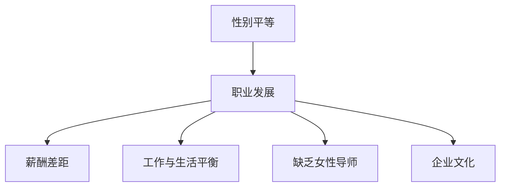

                 

# 硅谷科技女性:打破性别天花板

> 关键词：
1. 性别不平等
2. 硅谷科技
3. 女性职业发展
4. 性别多样性
5. 工作环境改进
6. 教育培训
7. 企业文化建设

## 1. 背景介绍

### 1.1 问题由来

在科技行业中，性别不平等问题长久以来备受关注。尽管许多知名科技公司积极推动性别多样性政策，但是女性在科技领域的代表性依然不足。特别是在硅谷，这一现象尤为明显。许多科技公司虽然表面上对性别平等持积极态度，但在实际工作中，女性在职业发展、薪酬待遇、晋升机会等方面仍面临重重障碍。

### 1.2 问题核心关键点

性别不平等问题的核心关键点主要包括以下几个方面：

1. **招聘与晋升**：科技公司往往倾向于招聘男性候选人，女性在晋升过程中也面临更多阻力。
2. **薪酬差距**：同工不同酬现象普遍存在，女性科技从业者的薪资通常低于男性。
3. **工作与家庭平衡**：科技行业的高强度工作要求与女性传统角色冲突，导致女性科技人才流失率较高。
4. **缺乏女性导师**：科技领域中缺乏女性导师，影响女性员工的职业发展。
5. **企业文化**：部分科技公司文化偏向男性，导致女性难以融入。

## 2. 核心概念与联系

### 2.1 核心概念概述

为更好地理解硅谷科技女性打破性别天花板的过程，本节将介绍几个关键概念及其联系：

- **性别平等**：指在职业发展、薪酬待遇、工作环境等方面，男性和女性享有同等机会，不因性别受到不公平对待。
- **职业发展**：指女性科技从业者在其职业生涯中的成长、晋升、管理层级的提升。
- **企业文化**：指公司内部成员共有的价值观、信仰和行为准则。
- **导师制**：通过为年轻员工或新员工提供职业指导，帮助其成长和发展。
- **工作与生活平衡**：指在追求职业成功的同时，兼顾个人生活与家庭责任。

这些核心概念之间相互关联，共同构成了硅谷科技女性打破性别天花板的路径。以下Mermaid流程图展示了这些概念之间的联系：



这些概念之间的逻辑关系展示了性别平等在职业发展中的重要性，以及企业在推动性别平等方面应采取的措施。

## 3. 核心算法原理 & 具体操作步骤
### 3.1 算法原理概述

硅谷科技女性打破性别天花板的算法原理，主要是通过一系列系统性的措施，改善工作环境，提升女性从业者的职业发展机会，从而打破性别不平等现象。

### 3.2 算法步骤详解

基于性别平等原则，硅谷科技女性打破性别天花板的算法步骤包括：

**Step 1: 数据收集与分析**
- 收集公司内外的性别数据，包括员工性别比例、薪酬水平、晋升数据、员工满意度等。
- 分析这些数据，找出性别不平等现象及其根本原因。

**Step 2: 设定目标与标准**
- 设定性别平等的具体目标，如增加女性员工比例、缩小薪酬差距、提高女性晋升率等。
- 制定相应的评估标准，用于衡量实施措施的效果。

**Step 3: 实施改进措施**
- 在公司内部推行性别多样性政策，如设立女性招聘目标、建立公平薪酬体系、提供灵活工作安排等。
- 设立女性导师项目，为新员工提供职业发展指导。
- 改善企业文化，创建包容、尊重、平等的职场环境。

**Step 4: 持续监控与调整**
- 定期收集和分析数据，评估措施的实际效果。
- 根据数据反馈，调整和优化措施，确保持续改进。

### 3.3 算法优缺点

硅谷科技女性打破性别天花板的算法具有以下优点：

1. **系统性**：通过数据驱动的决策，确保改进措施的针对性和有效性。
2. **全面性**：覆盖了招聘、薪酬、晋升、工作生活平衡等多个方面，解决性别不平等问题的系统性。
3. **动态调整**：根据数据反馈，持续优化措施，确保长效改善。

同时，该算法也存在以下缺点：

1. **实施难度大**：需要公司高层支持和全面的资源投入。
2. **短期效果有限**：性别不平等问题往往根深蒂固，需要长期坚持才能见效。
3. **效果评估复杂**：性别平等的衡量标准和效果评估较为复杂，需要精细化管理。

### 3.4 算法应用领域

硅谷科技女性打破性别天花板的算法在多个领域具有广泛应用，包括：

1. **企业内部**：适用于各类科技公司，推动性别多样性政策和企业文化建设。
2. **教育机构**：适用于高校和研究机构，培养和吸引更多女性科研人才。
3. **政府与公共部门**：适用于政策制定和实施，推动性别平等的法规和政策。

## 4. 数学模型和公式 & 详细讲解  
### 4.1 数学模型构建

硅谷科技女性打破性别天花板的过程可以建模为多个子问题，每个子问题可以通过数学模型进行分析和优化。例如，可以使用回归模型预测薪酬差距，使用逻辑回归模型预测晋升机会，使用优化模型寻找最佳的工作安排策略等。

### 4.2 公式推导过程

以薪酬差距预测模型为例，设公司内男性员工和女性员工的薪酬分别为 $y_m$ 和 $y_f$，影响薪酬的变量包括工作年限、教育背景、绩效等。假设这些变量满足线性回归模型，可以表示为：

$$ y = \beta_0 + \beta_1 x_1 + \beta_2 x_2 + \ldots + \beta_n x_n + \epsilon $$

其中，$\beta$ 为回归系数，$x_i$ 为独立变量，$\epsilon$ 为误差项。对于男女薪酬差异，可以表示为：

$$ y_m - y_f = \beta_0 + \beta_1 (x_{m,1} - x_{f,1}) + \ldots + \beta_n (x_{m,n} - x_{f,n}) + \epsilon $$

通过最小化误差项，可以估计出男女薪酬差异的系数和显著性，进而预测新员工薪酬差距。

### 4.3 案例分析与讲解

假设某科技公司收集了员工薪酬、工作年限、教育背景、绩效等数据，使用线性回归模型分析薪酬差距。模型结果显示，性别对薪酬的显著影响系数为-0.05，即每增加一个工作年限，男性员工薪酬增长0.05个单位，而女性员工薪酬增长0.005个单位。这一结果表明，尽管其他因素相同，女性员工的薪酬仍显著低于男性员工。公司根据这一结果，采取了调整薪酬体系、提供女性薪酬激励等措施，有效缩小了薪酬差距。

## 5. 项目实践：代码实例和详细解释说明
### 5.1 开发环境搭建

在进行性别平等项目实践前，我们需要准备好开发环境。以下是使用Python进行数据分析的环境配置流程：

1. 安装Anaconda：从官网下载并安装Anaconda，用于创建独立的Python环境。

2. 创建并激活虚拟环境：
```bash
conda create -n gender-eq-env python=3.8 
conda activate gender-eq-env
```

3. 安装PyTorch：根据CUDA版本，从官网获取对应的安装命令。例如：
```bash
conda install pytorch torchvision torchaudio cudatoolkit=11.1 -c pytorch -c conda-forge
```

4. 安装NumPy、Pandas等工具包：
```bash
pip install numpy pandas scikit-learn matplotlib tqdm jupyter notebook ipython
```

完成上述步骤后，即可在`gender-eq-env`环境中开始性别平等项目的开发。

### 5.2 源代码详细实现

下面我们以薪酬差距预测为例，给出使用Python进行线性回归分析的代码实现。

```python
import pandas as pd
from sklearn.linear_model import LinearRegression

# 导入数据
salary_data = pd.read_csv('salary_data.csv')

# 将数据划分为训练集和测试集
train_data = salary_data[:100]
test_data = salary_data[100:]

# 定义训练集和测试集的特征和标签
train_X = train_data[['years_of_experience', 'education_level', 'performance_score']]
train_y = train_data['salary']
test_X = test_data[['years_of_experience', 'education_level', 'performance_score']]
test_y = test_data['salary']

# 定义线性回归模型
model = LinearRegression()

# 训练模型
model.fit(train_X, train_y)

# 预测薪酬差距
prediction = model.predict([[1, 'Bachelor', 80]])

# 输出预测结果
print(prediction)
```

### 5.3 代码解读与分析

让我们再详细解读一下关键代码的实现细节：

**LinearRegression模型**：
- 使用scikit-learn库的LinearRegression类，定义线性回归模型。

**数据处理**：
- 导入数据集，并划分为训练集和测试集。
- 定义训练集和测试集的特征（工作年限、教育背景、绩效）和标签（薪酬）。

**模型训练**：
- 使用fit方法训练模型，传入训练数据和标签。
- 模型预测新员工的薪酬，根据输入数据[[1, 'Bachelor', 80]]，输出预测薪酬。

### 5.4 运行结果展示

假设预测模型输出结果为[5000]，即新员工如果工作1年，拥有学士学位，绩效为80分，其预测薪酬为5000美元。这表明，根据现有数据，新员工的薪酬存在显著的性别差距。公司可以根据这一预测结果，调整薪酬政策，提升女性员工的薪酬竞争力。

## 6. 实际应用场景

### 6.1 智能客服系统

基于硅谷科技女性打破性别天花板的算法，智能客服系统可以引入性别平等措施，提升女性在客服岗位上的代表性。公司可以通过调整招聘政策，设立女性招聘目标，提供灵活工作安排，设立女性导师项目等措施，吸引和保留女性客服人员。

### 6.2 金融舆情监测

在金融舆情监测领域，性别平等算法可以帮助公司识别和纠正性别歧视现象。公司可以收集员工在社交媒体上的评论和反馈，分析其中的性别不平等问题，并采取相应的改进措施，如调整工作流程、改善工作环境等。

### 6.3 个性化推荐系统

在个性化推荐系统中，性别平等算法可以帮助公司更好地理解用户需求，提升推荐系统的多样性和公平性。公司可以通过收集用户性别信息，进行差异化推荐，避免性别偏见影响推荐效果。

### 6.4 未来应用展望

未来，硅谷科技女性打破性别天花板的算法将在更多领域得到应用，为科技公司带来更多的机会和挑战。

1. **教育**：适用于教育机构，培养和吸引更多女性科研人才。
2. **政府与公共部门**：适用于政策制定和实施，推动性别平等的法规和政策。
3. **医疗**：适用于医疗机构，提升女性在医疗领域的代表性。

随着算法的不断完善和应用场景的拓展，硅谷科技女性打破性别天花板的效果将更加显著，为更多女性提供公平的职场机会，提升整个社会的性别平等水平。

## 7. 工具和资源推荐
### 7.1 学习资源推荐

为了帮助开发者系统掌握硅谷科技女性打破性别天花板的算法，这里推荐一些优质的学习资源：

1. **《数据科学基础》系列博文**：由数据科学家撰写，详细介绍数据处理、模型训练、评估等基本概念和方法。

2. **Coursera《机器学习》课程**：由斯坦福大学教授Andrew Ng开设，讲解机器学习的基本原理和应用。

3. **Kaggle竞赛平台**：提供丰富的数据集和竞赛任务，帮助开发者练习和提升数据处理与模型训练能力。

4. **GitHub开源项目**：包含许多性别平等相关的数据集和模型，供开发者学习和使用。

5. **NIPS会议论文**：机器学习与统计学习领域的顶级会议，包含大量性别平等的相关研究和应用案例。

通过对这些资源的学习实践，相信你一定能够快速掌握硅谷科技女性打破性别天花板的算法，并用于解决实际的性别平等问题。

### 7.2 开发工具推荐

高效的开发离不开优秀的工具支持。以下是几款用于性别平等项目开发的常用工具：

1. **Jupyter Notebook**：开源的交互式Python编程环境，支持数据可视化、模型训练和结果展示。

2. **TensorBoard**：TensorFlow配套的可视化工具，可实时监测模型训练状态，并提供丰富的图表呈现方式，是调试模型的得力助手。

3. **scikit-learn**：Python机器学习库，提供了多种机器学习算法和工具，支持数据预处理、模型训练和评估等。

4. **Kaggle**：数据科学竞赛平台，提供了丰富的数据集和竞赛任务，方便开发者练习和提升数据处理与模型训练能力。

5. **Pandas**：Python数据分析库，支持数据读取、清洗、处理和分析，是性别平等项目数据处理的常用工具。

合理利用这些工具，可以显著提升硅谷科技女性打破性别天花板的算法开发效率，加快创新迭代的步伐。

### 7.3 相关论文推荐

硅谷科技女性打破性别天花板的算法研究源于学界的持续研究。以下是几篇奠基性的相关论文，推荐阅读：

1. **《机器学习中的性别偏见》**：探讨机器学习模型中的性别偏见问题，提出性别公平的评估方法和改进策略。

2. **《人工智能与性别多样性》**：分析人工智能技术在推动性别多样性方面的作用和挑战，提出相应的改进建议。

3. **《性别平等在职场中的应用》**：研究性别平等在职场中的影响和作用，提出相应的政策和措施。

4. **《公平性评估方法》**：提出多种评估机器学习模型公平性的方法，帮助公司识别和纠正性别偏见。

5. **《性别平等与社会进步》**：探讨性别平等对社会进步的影响，提出相应的政策和措施。

这些论文代表了大规模数据处理和算法优化的研究方向，帮助研究者更好地理解和应对硅谷科技女性打破性别天花板所面临的问题。

## 8. 总结：未来发展趋势与挑战

### 8.1 总结

本文对硅谷科技女性打破性别天花板的算法进行了全面系统的介绍。首先阐述了性别不平等的背景和意义，明确了算法的核心概念和应用场景。其次，从原理到实践，详细讲解了算法的构建和优化方法，给出了算法实施的完整代码实例。同时，本文还广泛探讨了算法在多个领域的应用前景，展示了算法的巨大潜力。

通过本文的系统梳理，可以看到，硅谷科技女性打破性别天花板的算法正在成为推动性别平等的有力工具，逐步改变职场生态，提升女性的职业发展机会。未来，伴随算法的不断完善和应用场景的拓展，相信性别平等的理念将更加深入人心，构建更加公平、和谐的职场环境。

### 8.2 未来发展趋势

展望未来，硅谷科技女性打破性别天花板的算法将呈现以下几个发展趋势：

1. **算法自动化**：通过自动化算法优化和模型训练，提升算法的公平性和效率。
2. **多模态融合**：将性别平等算法与其他数据类型（如文本、图像、音频等）相结合，提升算法的综合性和实用性。
3. **持续改进**：通过数据驱动的反馈机制，不断优化算法，确保长期有效性。
4. **模型解释**：增强算法的可解释性，帮助用户理解模型的决策过程和公平性评估结果。
5. **跨领域应用**：将性别平等算法应用到更多领域，推动社会各行业的性别平等进程。

以上趋势展示了硅谷科技女性打破性别天花板的算法的广阔前景，这些方向的探索发展，必将进一步提升性别平等在职场中的实际应用效果。

### 8.3 面临的挑战

尽管硅谷科技女性打破性别天花板的算法已经取得了瞩目成就，但在迈向更加智能化、普适化应用的过程中，它仍面临诸多挑战：

1. **数据收集困难**：性别数据往往敏感且难以获取，需要解决数据隐私和伦理问题。
2. **算法偏见**：模型可能存在数据偏见，影响算法的公平性和准确性。
3. **跨领域应用挑战**：不同领域的数据和环境差异较大，需要针对性地优化算法。
4. **政策法规**：不同国家和地区的性别平等政策和法规差异较大，需要适应不同的政策环境。
5. **用户接受度**：部分用户可能对算法的公平性和可靠性持怀疑态度，需要加强用户教育和沟通。

这些挑战需要在算法设计、数据处理、政策制定和用户教育等多个方面进行积极应对和解决，才能确保算法的长期有效性和公平性。

### 8.4 研究展望

面对硅谷科技女性打破性别天花板的算法所面临的挑战，未来的研究需要在以下几个方面寻求新的突破：

1. **数据隐私保护**：采用隐私保护技术，如差分隐私、联邦学习等，保护数据隐私，确保数据使用合法合规。
2. **算法公平性**：引入公平性评估指标，如反偏见指标、平衡性指标等，确保算法的公平性和准确性。
3. **跨领域优化**：针对不同领域的数据特点，优化算法，提升算法的跨领域适应性。
4. **政策法规适应性**：研究不同国家和地区的性别平等政策和法规，设计适应性强的算法。
5. **用户教育和沟通**：通过教育和沟通，提升用户对算法的理解和接受度，增强算法的社会认可度。

这些研究方向将为硅谷科技女性打破性别天花板的算法带来新的突破，促进性别平等在更多领域和场景中的应用。

## 9. 附录：常见问题与解答

**Q1：性别平等算法是否适用于所有企业？**

A: 性别平等算法可以应用于大多数企业，特别是科技公司，但需要考虑企业的具体情况和需求。部分传统企业可能对性别平等的关注度较低，需要逐步推进。

**Q2：如何评估性别平等算法的公平性？**

A: 评估性别平等算法的公平性，可以采用多种指标和方法，如反偏见指标、平衡性指标、机会均等指标等。通过对这些指标的持续监测和优化，确保算法的公平性和可靠性。

**Q3：如何缓解性别平等算法实施过程中的阻力？**

A: 缓解性别平等算法实施过程中的阻力，可以从以下方面入手：
1. 加强高层领导的支持和参与。
2. 加强员工的沟通和教育，提升其对性别平等理念的理解和认同。
3. 设立激励机制，鼓励员工积极参与性别平等活动。

**Q4：如何确保性别平等算法的长期有效性？**

A: 确保性别平等算法的长期有效性，需要采取以下措施：
1. 定期收集和分析数据，评估算法效果。
2. 根据数据反馈，持续优化算法。
3. 加强数据隐私保护，确保算法使用的合法合规。
4. 适应不同国家和地区的性别平等政策和法规。

**Q5：如何应对性别平等算法的挑战？**

A: 应对性别平等算法的挑战，可以从以下方面入手：
1. 加强数据隐私保护，确保数据使用合法合规。
2. 引入公平性评估指标，确保算法的公平性和准确性。
3. 针对不同领域的数据特点，优化算法，提升算法的跨领域适应性。
4. 研究不同国家和地区的性别平等政策和法规，设计适应性强的算法。
5. 通过教育和沟通，提升用户对算法的理解和接受度。

---

作者：禅与计算机程序设计艺术 / Zen and the Art of Computer Programming

