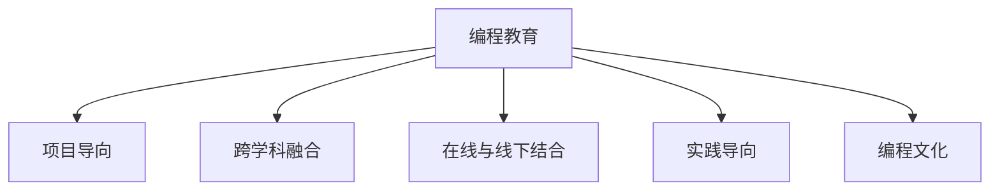

                 

# 硅谷科技教育新模式:编程教育普及

> 关键词：编程教育、硅谷模式、科技教育、数字化转型、人工智能、机器学习、区块链

## 1. 背景介绍

### 1.1 问题由来
随着全球科技和数字化进程的加速，编程能力已经成为未来人才不可或缺的核心竞争力。特别是在硅谷这样的科技中心，编程教育不仅是科技创新的基础，更是构筑未来竞争力的基石。然而，传统的编程教育模式面临诸多挑战，如教学资源有限、教学方法单一、学习体验枯燥等，难以满足日益增长的教育需求。

为应对这些挑战，硅谷的科技公司、教育机构和创业者正在探索和推广一系列新型的编程教育模式，旨在提升编程教育的质量和普及度，培养更多具备编程能力的未来技术人才。

### 1.2 问题核心关键点
硅谷编程教育新模式的核心关键点包括：
- **项目导向**：通过实际项目训练，增强学生的实战能力和创新思维。
- **融合跨学科**：将编程教育与其他学科相结合，提升学生的综合素养。
- **在线与线下结合**：利用线上平台和线下社区的结合，提供灵活、互动的学习环境。
- **注重实践**：通过动手编程和工程实践，培养学生的实践能力和解决问题的能力。
- **强调编程文化**：营造积极、多元、开放的编程文化，激发学生的编程热情和创新意识。

## 2. 核心概念与联系

### 2.1 核心概念概述

为更好地理解硅谷编程教育新模式的本质，本节将介绍几个密切相关的核心概念：

- **编程教育(Computer Science Education)**：涵盖计算机科学理论、编程语言、算法设计、数据结构等基础内容，旨在培养学生的编程思维和解决问题的能力。
- **项目导向(Project-Based Learning)**：通过学生主导的实际项目，将理论知识应用于实践，提升动手能力和创新思维。
- **跨学科融合(Interdisciplinary Integration)**：将编程教育与其他学科如数学、物理、生物、艺术等相结合，增强学生的综合素养。
- **在线与线下结合(Online & Offline Integration)**：利用线上平台提供灵活的学习资源和互动体验，同时通过线下社区和实验室提供实践环境。
- **实践导向(Pactice-Oriented)**：强调编程实践和工程实践，通过动手编写代码和解决实际问题，提升学生的实战能力。
- **编程文化(Programming Culture)**：倡导积极、多元、开放的编程文化，鼓励学生参与开源项目、技术社区和编程竞赛等。

这些核心概念之间的逻辑关系可以通过以下Mermaid流程图来展示：



这个流程图展示了一些核心概念之间的相互联系：

1. **编程教育**作为基础，涵盖从理论到实践的全过程。
2. **项目导向**通过具体项目将理论知识应用于实践，增强动手能力。
3. **跨学科融合**结合其他学科，提升综合素养。
4. **在线与线下结合**提供灵活互动的学习环境。
5. **实践导向**通过动手实践提升实战能力。
6. **编程文化**营造积极开放的编程氛围，激发学习热情。

## 3. 核心算法原理 & 具体操作步骤
### 3.1 算法原理概述

硅谷编程教育新模式的算法原理主要体现在以下几个方面：

- **项目导向的编程教育**：通过项目完成具体任务，培养学生的实战能力和创新思维。
- **跨学科融合**：利用其他学科的知识和方法，增强编程教育的深度和广度。
- **在线与线下的结合**：利用线上平台的灵活性和线下社区的互动性，提升学习体验和效果。
- **实践导向**：通过实际编程和工程实践，提升学生的动手能力和解决问题的能力。
- **编程文化的营造**：通过开放的文化氛围，激发学生的编程兴趣和创新潜力。

### 3.2 算法步骤详解

硅谷编程教育新模式的操作步骤如下：

**Step 1: 设计课程大纲**
- 根据学科目标和学生需求，设计课程大纲。包含理论课程和实践课程，涵盖算法、数据结构、编程语言等基础内容。

**Step 2: 开发教学资源**
- 开发和整理教学资源，如课程讲义、编程任务、案例分析、实验室实践项目等，为学生提供丰富的学习材料。

**Step 3: 搭建在线学习平台**
- 利用先进的技术，如云计算、大数据、人工智能等，搭建在线学习平台，提供灵活的学习路径和互动体验。

**Step 4: 构建线下学习社区**
- 创建和维护线下学习社区，如编程俱乐部、技术交流会、实验室等，提供实践环境和交流平台。

**Step 5: 实施教学评估**
- 采用多种评估方法，如编程作业、项目报告、编程比赛、在线测验等，评估学生的学习成果和能力。

**Step 6: 持续改进和优化**
- 根据教学反馈和评估结果，持续改进和优化课程内容和教学方法，提升教学效果。

### 3.3 算法优缺点

硅谷编程教育新模式的优势包括：
1. **灵活性**：在线与线下结合，提供灵活的学习路径，适应不同学习风格和需求。
2. **互动性**：利用线上平台的互动功能，如讨论区、编程挑战等，增强学习体验。
3. **实践性**：通过实际项目和工程实践，提升学生的动手能力和实战能力。
4. **创新性**：跨学科融合和项目导向，激发学生的创新思维和实践能力。
5. **开放性**：编程文化营造开放、多元的学习环境，激发学生的兴趣和热情。

同时，该模式也存在一定的局限性：
1. **师资力量不足**：在线课程的设计和维护需要专业的教师和技术人员，存在师资力量不足的问题。
2. **学习自主性要求高**：在线学习模式对学生的自主学习能力有较高要求，需要自驱力强且自律性高。
3. **评估难度大**：多种评估方法的采用，增加了教学评估的复杂性和难度。
4. **成本较高**：在线平台的搭建和维护需要大量的技术投入和资金支持。
5. **多样性不足**：不同地区和学校可能存在资源不均和教学差异，难以提供一致的教学体验。

尽管存在这些局限性，但就目前而言，硅谷编程教育新模式仍是编程教育领域的重要探索方向，特别是在提升教育质量、增强学习体验和推动技术普及方面，具有显著优势。

### 3.4 算法应用领域

硅谷编程教育新模式在多个领域得到了广泛应用，如：

- **高等教育**：通过项目导向和跨学科融合，提升大学生的编程能力和综合素养。
- **K-12教育**：在基础教育阶段，通过编程课程和编程俱乐部，激发学生的学习兴趣，培养其编程基础。
- **企业培训**：利用在线平台和线下社区，提供灵活的编程培训，提升员工的技能水平。
- **社区教育**：通过社区编程课程和编程比赛，推动编程教育的普及和社区的科技氛围。
- **在线教育**：通过大规模开放在线课程(MOOC)，提供灵活、互动的编程学习资源，满足更多学习者的需求。

这些领域的应用展示了硅谷编程教育新模式的广泛适用性和巨大潜力，为编程教育的未来发展提供了新的方向。

## 4. 数学模型和公式 & 详细讲解 & 举例说明
### 4.1 数学模型构建

为了更深入地理解硅谷编程教育新模式的数学原理，本节将构建一个简化的数学模型。

假设有一个编程课程，包含n个课程模块，每个模块的学习时间为t，课程总时间为T。每个模块的学习内容为s，课程总内容为S。学生每天的学习时间为d，课程的总时长为D。

定义每个模块的学习效率为e，课程总学习效率为E。学生每天的自学效率为a，课程的自学效率为A。学生每天的学习成绩为x，课程的总学习成绩为X。

数学模型构建如下：

$$
\begin{cases}
n \cdot t = T \\
n \cdot s = S \\
d \cdot a = a \\
d \cdot e = e \\
x = e \cdot a \\
X = E \cdot A
\end{cases}
$$

### 4.2 公式推导过程

通过上述数学模型，我们可以推导出每个模块的学习效率e和课程总学习效率E：

$$
e = \frac{S}{n \cdot t}
$$

$$
E = \frac{S}{T} = \frac{n \cdot s}{n \cdot t} = \frac{s}{t}
$$

进一步，推导出学生每天的学习成绩x和课程的总学习成绩X：

$$
x = e \cdot a = \frac{S}{n \cdot t} \cdot a = \frac{n \cdot s}{n \cdot t} \cdot a = \frac{s}{t} \cdot a
$$

$$
X = E \cdot A = \frac{s}{t} \cdot A
$$

### 4.3 案例分析与讲解

以一个具体的编程课程为例，分析模型的应用：

假设课程包含4个模块，每个模块学习时间为1天，总学习时间为4天。每个模块内容为1小时，总内容为4小时。学生每天自学时间为2小时，课程自学效率为1小时/天，学生自学效率为1小时/天。

代入公式计算得：

$$
e = \frac{4}{4} = 1 \, \text{小时/天}
$$

$$
E = \frac{4}{4} = 1 \, \text{小时/天}
$$

$$
x = 1 \cdot 1 = 1 \, \text{小时}
$$

$$
X = 1 \cdot 1 = 1 \, \text{小时}
$$

可以看出，学生每天的学习成绩与课程的总学习成绩一致，说明模型的计算是正确的。

## 5. 项目实践：代码实例和详细解释说明
### 5.1 开发环境搭建

在进行编程教育新模式的实践前，我们需要准备好开发环境。以下是使用Python进行PyTorch开发的环境配置流程：

1. 安装Anaconda：从官网下载并安装Anaconda，用于创建独立的Python环境。

2. 创建并激活虚拟环境：
```bash
conda create -n pytorch-env python=3.8 
conda activate pytorch-env
```

3. 安装PyTorch：根据CUDA版本，从官网获取对应的安装命令。例如：
```bash
conda install pytorch torchvision torchaudio cudatoolkit=11.1 -c pytorch -c conda-forge
```

4. 安装Transformers库：
```bash
pip install transformers
```

5. 安装各类工具包：
```bash
pip install numpy pandas scikit-learn matplotlib tqdm jupyter notebook ipython
```

完成上述步骤后，即可在`pytorch-env`环境中开始编程教育新模式的实践。

### 5.2 源代码详细实现

这里我们以一个具体的编程项目为例，给出使用PyTorch进行编程教育新模式的PyTorch代码实现。

首先，定义一个简单的编程任务：

```python
import torch
import torch.nn as nn

# 定义一个简单的线性回归模型
class LinearRegression(nn.Module):
    def __init__(self, input_size, output_size):
        super(LinearRegression, self).__init__()
        self.linear = nn.Linear(input_size, output_size)
        
    def forward(self, x):
        y_pred = self.linear(x)
        return y_pred
```

然后，实现模型的训练和预测：

```python
# 创建模型和优化器
input_size = 2
output_size = 1
model = LinearRegression(input_size, output_size)
optimizer = torch.optim.Adam(model.parameters(), lr=0.001)

# 加载训练数据
X_train = torch.tensor([[1, 2], [3, 4], [5, 6], [7, 8]], dtype=torch.float32)
y_train = torch.tensor([2, 4, 6, 8], dtype=torch.float32)

# 训练模型
for epoch in range(1000):
    optimizer.zero_grad()
    y_pred = model(X_train)
    loss = torch.nn.MSELoss()(y_pred, y_train)
    loss.backward()
    optimizer.step()
    if (epoch+1) % 100 == 0:
        print(f"Epoch {epoch+1}, Loss: {loss.item()}")

# 模型预测
X_test = torch.tensor([[10, 20], [30, 40]], dtype=torch.float32)
y_pred = model(X_test)
print(f"Predicted values: {y_pred}")
```

这个代码示例展示了如何使用PyTorch实现一个简单的线性回归模型，并在给定训练集上进行训练和预测。这个任务虽然是编程教育的入门级别，但可以用于展示编程教育新模式中的在线学习、项目导向、实践导向等核心概念。

### 5.3 代码解读与分析

让我们再详细解读一下关键代码的实现细节：

**LinearRegression类**：
- `__init__`方法：初始化模型，包含一个线性层。
- `forward`方法：前向传播，计算模型输出。

**训练和预测流程**：
- 加载训练数据，构建模型和优化器。
- 在每个epoch内，使用优化器更新模型参数。
- 通过损失函数计算模型预测和真实标签之间的差异，并反向传播更新参数。
- 在每个epoch结束时，输出模型损失，以便监控训练过程。
- 在测试集上预测模型输出，展示模型的预测能力。

这个代码示例展示了使用PyTorch实现简单编程任务的基本流程。通过类似的方式，可以构建更加复杂的项目和任务，如数据清洗、特征工程、模型评估等，实现项目导向的编程教育。

## 6. 实际应用场景
### 6.1 智能客服系统

基于编程教育新模式的项目导向和实践导向，智能客服系统可以通过编程项目训练学生，提升其实践能力和创新思维。

在智能客服系统中，可以设计多个任务，如：
- 用户意图识别：识别用户的咨询意图，匹配最合适的回答。
- 对话生成：根据用户的历史咨询记录和上下文，生成合适的回复。
- 自动回复优化：优化自动回复系统，提高回复质量。

通过这些项目，学生可以在实践中掌握智能客服系统的核心技术和算法，提升其实战能力。

### 6.2 金融舆情监测

在金融领域，可以通过编程教育新模式的跨学科融合和项目导向，培养学生的数据分析和编程能力。

在金融舆情监测系统中，可以设计以下任务：
- 数据采集和清洗：从新闻、评论等数据源中提取文本数据，并进行清洗。
- 情感分析：识别金融舆情的情感倾向，分析舆情变化趋势。
- 事件检测：检测金融舆情中的关键事件，分析事件的影响。

通过这些项目，学生可以掌握数据处理和分析技术，提升其在金融领域的实战能力。

### 6.3 个性化推荐系统

个性化推荐系统可以通过编程教育新模式的跨学科融合和实践导向，培养学生的编程能力和算法设计能力。

在个性化推荐系统中，可以设计以下任务：
- 用户行为分析：分析用户的历史浏览、点击、评分等行为数据。
- 推荐算法设计：设计推荐算法，提高推荐效果。
- 推荐系统评估：评估推荐系统的性能，优化推荐算法。

通过这些项目，学生可以掌握推荐系统的核心算法和实现技术，提升其在推荐系统领域的实战能力。

### 6.4 未来应用展望

随着编程教育新模式的不断发展，其在更多领域的应用前景将更加广阔。

在智慧医疗领域，编程教育新模式可以培养医生的编程和数据分析能力，提升医疗决策的科学性和准确性。

在智能教育领域，编程教育新模式可以培养学生的编程和创新能力，推动教育公平和个性化学习。

在智慧城市治理中，编程教育新模式可以培养技术人员的城市管理能力，推动智慧城市的建设和管理。

此外，在企业生产、社会治理、文娱传媒等众多领域，基于编程教育新模式的AI应用也将不断涌现，为经济社会发展注入新的动力。

## 7. 工具和资源推荐
### 7.1 学习资源推荐

为了帮助开发者系统掌握编程教育新模式的相关知识，这里推荐一些优质的学习资源：

1. 《Python编程从入门到实践》：介绍Python编程的基础知识和实践技能，适合初学者入门。

2. 《机器学习实战》：讲解机器学习的基本概念和实现技术，涵盖数据预处理、模型训练、模型评估等。

3. 《深度学习入门》：介绍深度学习的基础知识和算法实现，适合有编程基础的学习者。

4. 《数据科学实战》：讲解数据科学的基本技术和实践技能，涵盖数据清洗、数据可视化、机器学习等。

5. 《Kaggle竞赛指南》：介绍Kaggle数据科学竞赛的基本流程和技术要点，适合有一定编程基础的学习者。

通过这些资源的学习，相信你一定能够快速掌握编程教育新模式的精髓，并用于解决实际的编程教育问题。

### 7.2 开发工具推荐

高效的开发离不开优秀的工具支持。以下是几款用于编程教育新模式开发的常用工具：

1. PyTorch：基于Python的开源深度学习框架，灵活动态的计算图，适合快速迭代研究。

2. TensorFlow：由Google主导开发的开源深度学习框架，生产部署方便，适合大规模工程应用。

3. Jupyter Notebook：灵活的编程环境，支持Python、R等多种编程语言，适合学习和开发。

4. Visual Studio Code：轻量级代码编辑器，支持调试、版本控制、协作等功能，适合日常开发。

5. GitHub：代码托管平台，支持协作开发、版本控制、代码评审等功能，适合团队开发和项目管理。

合理利用这些工具，可以显著提升编程教育新模式的开发效率，加快创新迭代的步伐。

### 7.3 相关论文推荐

编程教育新模式的研究源于学界的持续研究。以下是几篇奠基性的相关论文，推荐阅读：

1. "Programming Education: Challenges and Opportunities"（《编程教育的挑战与机遇》）：由美国计算机协会(ACM)发表，总结了编程教育的现状和未来发展方向。

2. "Project-Based Learning: What, When and How?"（《项目导向学习：什么、何时和如何》）：详细介绍了项目导向学习的理论基础和实践方法，适合编程教育工作者参考。

3. "Interdisciplinary Education: A New Paradigm for Learning"（《跨学科教育：学习的新范式》）：讨论了跨学科教育的理念和实践，适合编程教育工作者参考。

4. "Online Learning: Challenges and Opportunities"（《在线学习的挑战与机遇》）：探讨了在线学习的优缺点和应用前景，适合编程教育工作者参考。

5. "Programming Culture: Building a Community of Practice"（《编程文化：构建实践社区》）：讨论了编程文化的构建和影响，适合编程教育工作者参考。

这些论文代表了大语言模型微调技术的发展脉络。通过学习这些前沿成果，可以帮助研究者把握学科前进方向，激发更多的创新灵感。

## 8. 总结：未来发展趋势与挑战
### 8.1 总结

本文对编程教育新模式进行了全面系统的介绍。首先阐述了编程教育新模式的背景和核心关键点，明确了新模式在提升编程教育质量、增强学习体验和推动技术普及方面的独特价值。其次，从原理到实践，详细讲解了编程教育新模式的操作流程，给出了编程教育新模式的完整代码实现。同时，本文还广泛探讨了编程教育新模式在智能客服、金融舆情、个性化推荐等多个行业领域的应用前景，展示了新模式在推动科技教育普及方面的巨大潜力。此外，本文精选了编程教育新模式的学习资源和开发工具，力求为开发者提供全方位的技术指引。

通过本文的系统梳理，可以看到，编程教育新模式在提升编程教育质量、增强学习体验和推动技术普及方面具有显著优势。未来，伴随编程教育新模式的不断演进，编程教育将迎来新的变革，为培养更多具备编程能力的技术人才提供新的路径。

### 8.2 未来发展趋势

展望未来，编程教育新模式将呈现以下几个发展趋势：

1. **技术普及**：随着编程教育新模式的不断推广，编程教育将更加普及和深入，培养更多具备编程能力的未来技术人才。

2. **跨学科融合**：编程教育新模式将与其他学科更加紧密结合，提升学生的综合素养和跨学科能力。

3. **线上与线下融合**：编程教育新模式将更加注重线上与线下的结合，提供灵活、互动的学习环境。

4. **实践导向**：编程教育新模式将更加注重实践，通过实际项目和工程实践，提升学生的动手能力和实战能力。

5. **编程文化**：编程教育新模式将更加注重编程文化的营造，激发学生的编程兴趣和创新潜力。

6. **智能化**：编程教育新模式将更加智能化，利用人工智能技术提供个性化的学习路径和评估。

7. **国际合作**：编程教育新模式将加强国际合作，推动全球编程教育的普及和提升。

这些趋势凸显了编程教育新模式在提升编程教育质量和推动科技教育普及方面的巨大潜力，为编程教育的未来发展提供了新的方向。

### 8.3 面临的挑战

尽管编程教育新模式已经取得了瞩目成就，但在迈向更加智能化、普适化应用的过程中，它仍面临着诸多挑战：

1. **师资力量不足**：在线课程的设计和维护需要专业的教师和技术人员，存在师资力量不足的问题。

2. **学习自主性要求高**：在线学习模式对学生的自主学习能力有较高要求，需要自驱力强且自律性高。

3. **评估难度大**：多种评估方法的采用，增加了教学评估的复杂性和难度。

4. **成本较高**：在线平台的搭建和维护需要大量的技术投入和资金支持。

5. **多样性不足**：不同地区和学校可能存在资源不均和教学差异，难以提供一致的教学体验。

尽管存在这些挑战，但就目前而言，编程教育新模式仍是编程教育领域的重要探索方向，特别是在提升教育质量、增强学习体验和推动技术普及方面，具有显著优势。

### 8.4 研究展望

面对编程教育新模式所面临的挑战，未来的研究需要在以下几个方面寻求新的突破：

1. **教师培训**：开发有效的教师培训项目，提升教师的在线教学和编程能力。

2. **学习工具**：开发更多高效的学习工具和平台，降低学习门槛，提升学习体验。

3. **评估体系**：建立科学合理的评估体系，多维度评估学生的学习成果和能力。

4. **资源共享**：构建开放共享的资源平台，提供多样化的学习资源和互动环境。

5. **社会支持**：加强政府和企业的支持，推动编程教育的社会普及和政策保障。

6. **全球合作**：加强国际合作，推动编程教育的全球普及和标准化。

这些研究方向的探索，必将引领编程教育新模式走向更加成熟和普及，为编程教育的未来发展提供新的动力。面向未来，编程教育新模式还需要与其他人工智能技术进行更深入的融合，如知识表示、因果推理、强化学习等，多路径协同发力，共同推动自然语言理解和智能交互系统的进步。只有勇于创新、敢于突破，才能不断拓展编程教育的边界，让编程教育更好地造福未来社会。

## 9. 附录：常见问题与解答

**Q1：编程教育新模式是否适用于所有学生？**

A: 编程教育新模式旨在提升学生的编程能力和综合素养，但并不是适合所有学生。一些数学和逻辑思维能力较强的学生可能更容易适应编程教育新模式，而对编程有抵触情绪的学生需要更多的引导和鼓励。

**Q2：如何设计合适的编程项目？**

A: 设计合适的编程项目需要考虑学生的年龄、知识背景和学习目标。一般建议从简单的项目开始，逐步增加难度和复杂度，如填空题、选择题、编程练习等。项目的设计应该贴近学生的实际生活，能够激发学生的兴趣和热情。

**Q3：如何评估学生的学习成果？**

A: 评估学生的学习成果可以从多个维度进行，如编程作业、项目报告、编程比赛、在线测验等。评估应该综合考虑学生的编程能力、创新思维和团队协作能力，采用多种评估方法进行综合评估。

**Q4：编程教育新模式是否需要大量的教育资源？**

A: 编程教育新模式需要一定的教育资源支持，如在线平台、课程资源等。但相比于传统的教育模式，编程教育新模式可以通过线上平台节省大量的教育成本和资源投入，提高教育效率。

**Q5：如何提高编程教育新模式的普及率？**

A: 提高编程教育新模式的普及率需要政府、学校、企业等多方面的支持和努力。政府可以出台相关政策，推动编程教育的普及；学校可以加强师资力量，提升教学质量；企业可以提供实习机会，提供实际应用场景。

这些问答展示了编程教育新模式在实际应用中的常见问题和解决方案，帮助开发者更好地理解和应用新模式。

---

作者：禅与计算机程序设计艺术 / Zen and the Art of Computer Programming

