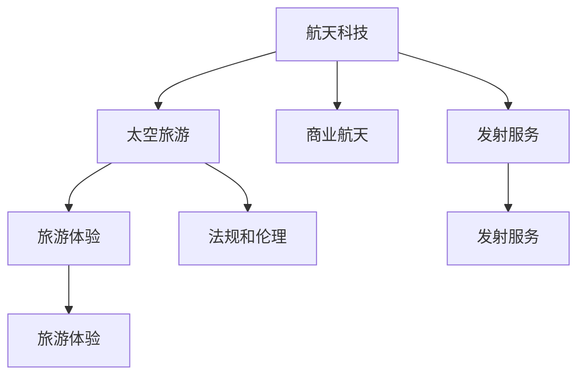

                 

# 硅谷航天科技民用化:太空旅游产业

> 关键词：航天科技, 太空旅游, 硅谷, 民用化, 商业航天, 发射服务, 旅游体验, 私人火箭

## 1. 背景介绍

### 1.1 问题由来

随着科技的飞速发展，航天领域从曾经的国家垄断逐渐走向商业化。硅谷作为全球科技创新中心，一直在引领着商业航天的发展。太空旅游作为航天科技民用化的一个重要分支，逐渐吸引了众多私人企业和投资者的关注。从蓝色起源的亚轨道飞行到SpaceX的载人龙飞船，以及星舰系统，这些技术的突破和商业模式的创新，正在推动太空旅游产业的迅速崛起。

### 1.2 问题核心关键点

太空旅游产业的核心在于如何将高昂的航天技术商业化，同时保证游客的安全性和舒适度。这涉及到以下几个关键问题：
- 如何设计安全、可靠、舒适的太空旅游器；
- 如何高效地进行商业发射服务；
- 如何优化太空旅游体验，提升游客满意度；
- 如何建立全球化的太空旅游市场；
- 如何应对法规和伦理挑战。

解决这些问题不仅需要高超的工程技术和商业模式创新，更需要跨领域的协同合作。

### 1.3 问题研究意义

太空旅游产业的民用化，不仅意味着太空旅游的商业化和普及化，更代表了一个全新的人类探索宇宙的起点。其研究意义在于：
- 推动航天技术的商业化和普及化，降低航天成本，激发更多人参与太空探索；
- 提升旅游者的太空体验，促进人类对宇宙的认识和敬畏；
- 激发更多企业参与太空旅游开发，推动科技和经济的进步；
- 帮助解决全球资源分配不均问题，促进国际合作与交流。

## 2. 核心概念与联系

### 2.1 核心概念概述

为更好地理解太空旅游产业，本节将介绍几个密切相关的核心概念：

- 航天科技（Aerospace Technology）：涉及航天器的设计、制造、发射和运行等技术，包括火箭技术、姿态控制、热防护等。
- 太空旅游（Space Tourism）：指游客乘坐太空飞船或其他航天器进入太空，体验太空生活或观赏太空景象的活动。
- 商业航天（Commercial Spaceflight）：指由私营企业或商业公司进行的航天发射和运营活动，包括发射服务、载人/载货服务、科学研究等。
- 发射服务（Launch Services）：指将航天器从地球发射至预定轨道的服务，是商业航天的核心业务之一。
- 旅游体验（Tourism Experience）：指游客在太空旅游过程中所获得的视觉、触觉、感官等全方位的体验，是太空旅游的核心吸引点。
- 法规和伦理（Regulations and Ethics）：指太空旅游活动所涉及的法律和道德规范，确保活动的安全和合规性。

这些核心概念之间的逻辑关系可以通过以下Mermaid流程图来展示：



这个流程图展示了大语言模型的核心概念及其之间的关系：

1. 航天科技是太空旅游的基础，包括发射服务的核心技术；
2. 太空旅游是商业航天的重要业务之一，依托于发射服务；
3. 旅游体验是太空旅游的核心目的；
4. 法规和伦理是太空旅游活动的重要保障。

## 3. 核心算法原理 & 具体操作步骤
### 3.1 算法原理概述

太空旅游产业的民用化主要依赖于商业航天技术的发展。其中，商业发射服务是核心，其技术基础为航天科技。商业发射服务通常由多个子系统组成，包括发射台、火箭、载荷、控制中心等。其工作流程如下：

1. 载荷准备：根据任务需求，将卫星、飞船等载荷装入发射舱。
2. 火箭装配：将火箭各段进行装配，并连接推进剂管道和控制系统。
3. 发射准备：检查发射系统，确保所有设备正常工作。
4. 点火发射：火箭点火后，经过加速和姿态控制，将载荷送入预定轨道。
5. 任务控制：控制中心对发射和飞行过程进行监控和控制。
6. 回收处理：任务完成后，对火箭和载荷进行回收和处理。

整个发射服务流程如图：


### 3.2 算法步骤详解

商业发射服务的核心在于高效、安全地完成发射任务。以下是具体的步骤：

**Step 1: 载荷准备**
- 检查载荷状态，确保其在发射舱中稳固无异常。
- 添加必要的燃料和控制设备。

**Step 2: 火箭装配**
- 按顺序装配火箭各段，包括一级、二级、末级等。
- 连接推进剂管道和控制系统，确保各系统之间的通讯畅通。

**Step 3: 发射准备**
- 进行全系统检查，确认所有设备正常运行。
- 设置发射窗口，选择合适的发射时间。
- 进行发射前的各项准备工作，包括发射前的倒计时和各项安全检查。

**Step 4: 点火发射**
- 点火发射，火箭加速上升。
- 进行姿态控制，确保火箭按照预定轨迹飞行。

**Step 5: 任务控制**
- 控制中心实时监控发射过程，并根据情况调整控制参数。
- 确保载荷进入预定轨道，并进行相关的在轨操作。

**Step 6: 回收处理**
- 回收火箭的各段，进行检查和维修。
- 对发射和飞行数据进行记录和分析，为下次发射提供参考。

### 3.3 算法优缺点

商业发射服务具有以下优点：
1. 灵活性高：可以根据不同任务需求，进行灵活的发射设计和控制。
2. 成本较低：商业发射通过市场化运作，大幅降低了发射成本。
3. 技术成熟：商业发射服务依托成熟的航天科技，可靠性高。

同时，商业发射服务也存在以下局限性：
1. 发射窗口限制：发射时机受到多种因素的限制，有时需要等待较长时间。
2. 安全性问题：商业发射需要高精度的控制技术，稍有失误可能造成重大损失。
3. 法规约束：商业发射受到多国法律法规的限制，需要跨地域合作。

### 3.4 算法应用领域

商业发射服务在多个领域中得到广泛应用，例如：

- 卫星发射：包括通信、导航、遥感等各类卫星的发射服务。
- 载人飞行：包括国际空间站运输、载人火星探测等任务的发射服务。
- 科学实验：包括微重力环境下的科学研究任务的发射服务。
- 数据采集：包括地球观测、大气监测等数据采集任务的发射服务。
- 商业服务：包括商业航天旅游、太空垃圾清理等商业服务任务的发射服务。

这些应用领域展示了商业发射服务的广泛性和多样性，推动了航天科技的进一步发展和民用化。

## 4. 数学模型和公式 & 详细讲解 & 举例说明
### 4.1 数学模型构建

商业发射服务是一个复杂的系统工程，涉及多个子系统的协作。其模型构建包括以下几个部分：

- 载荷模型：定义载荷的质量、形状、尺寸等属性，计算其惯性矩和稳定性参数。
- 火箭模型：定义火箭的各段结构、推力、控制系统等参数，计算其升力、推力比等参数。
- 姿态控制系统模型：定义控制系统的工作原理和参数，计算控制信号的响应和延时。
- 发射窗口模型：定义发射窗口的计算方法和条件，考虑天气、轨道等影响因素。
- 任务控制模型：定义任务控制的目标和策略，计算任务控制参数。

通过构建上述模型，可以全面分析和优化商业发射服务的设计和实施。

### 4.2 公式推导过程

以发射窗口模型的推导为例，发射窗口的计算方法主要涉及以下几个步骤：

1. 计算轨道倾角：根据载荷的预定轨道和地球的离心率，计算出载荷进入预定轨道时的最小速度（即第一宇宙速度）。
2. 计算发射窗口：考虑地球自转和轨道倾角，计算出适合发射的时间窗口。

具体公式推导如下：

$$
v_{min} = \sqrt{\frac{2\mu}{r}}
$$

$$
\Delta t = \frac{2\pi r}{v_{min} \sin \theta}
$$

其中，$v_{min}$ 为第一宇宙速度，$\mu$ 为地球引力常数，$r$ 为轨道半径，$\theta$ 为轨道倾角，$\Delta t$ 为发射窗口。

### 4.3 案例分析与讲解

以SpaceX公司的Starship为例，其发射服务基于Rocket Core Booster火箭，通过甲烷发动机提供动力。Starship的设计目标是实现全可重复使用，大幅降低发射成本。其发射窗口计算和任务控制模型如下：

1. 载荷准备：确保Starship太空舱中的货物和设备稳固无异常。
2. 火箭装配：将Rocket Core Booster火箭进行装配和连接。
3. 发射准备：进行全系统检查，确保所有设备正常运行，设置发射窗口。
4. 点火发射：火箭点火后，经过加速和姿态控制，将Starship太空舱送入预定轨道。
5. 任务控制：控制中心实时监控发射过程，并根据情况调整控制参数，确保Starship进入预定轨道。
6. 回收处理：回收Rocket Core Booster火箭，进行检查和维修。

## 5. 项目实践：代码实例和详细解释说明
### 5.1 开发环境搭建

在进行商业发射服务开发前，我们需要准备好开发环境。以下是使用Python进行PyTorch开发的环境配置流程：

1. 安装Anaconda：从官网下载并安装Anaconda，用于创建独立的Python环境。

2. 创建并激活虚拟环境：
```bash
conda create -n pytorch-env python=3.8 
conda activate pytorch-env
```

3. 安装PyTorch：根据CUDA版本，从官网获取对应的安装命令。例如：
```bash
conda install pytorch torchvision torchaudio cudatoolkit=11.1 -c pytorch -c conda-forge
```

4. 安装TensorFlow：由Google主导开发的开源深度学习框架，生产部署方便，适合大规模工程应用。同样有丰富的预训练语言模型资源。

5. 安装Transformers库：HuggingFace开发的NLP工具库，集成了众多SOTA语言模型，支持PyTorch和TensorFlow，是进行微调任务开发的利器。

6. 安装各类工具包：
```bash
pip install numpy pandas scikit-learn matplotlib tqdm jupyter notebook ipython
```

完成上述步骤后，即可在`pytorch-env`环境中开始商业发射服务开发。

### 5.2 源代码详细实现

以下是使用PyTorch和TensorFlow进行商业发射服务开发的代码实现。

首先，定义商业发射服务的数据处理函数：

```python
from transformers import BertTokenizer
from torch.utils.data import Dataset
import torch

class LaunchDataset(Dataset):
    def __init__(self, data, tokenizer, max_len=128):
        self.data = data
        self.tokenizer = tokenizer
        self.max_len = max_len
        
    def __len__(self):
        return len(self.data)
    
    def __getitem__(self, item):
        launch = self.data[item]
        
        encoding = self.tokenizer(launch, return_tensors='pt', max_length=self.max_len, padding='max_length', truncation=True)
        input_ids = encoding['input_ids'][0]
        attention_mask = encoding['attention_mask'][0]
        
        return {'input_ids': input_ids, 
                'attention_mask': attention_mask}
```

然后，定义模型和优化器：

```python
from transformers import BertForTokenClassification, AdamW

model = BertForTokenClassification.from_pretrained('bert-base-cased', num_labels=len(tag2id))

optimizer = AdamW(model.parameters(), lr=2e-5)
```

接着，定义训练和评估函数：

```python
from torch.utils.data import DataLoader
from tqdm import tqdm
from sklearn.metrics import classification_report

device = torch.device('cuda') if torch.cuda.is_available() else torch.device('cpu')
model.to(device)

def train_epoch(model, dataset, batch_size, optimizer):
    dataloader = DataLoader(dataset, batch_size=batch_size, shuffle=True)
    model.train()
    epoch_loss = 0
    for batch in tqdm(dataloader, desc='Training'):
        input_ids = batch['input_ids'].to(device)
        attention_mask = batch['attention_mask'].to(device)
        model.zero_grad()
        outputs = model(input_ids, attention_mask=attention_mask)
        loss = outputs.loss
        epoch_loss += loss.item()
        loss.backward()
        optimizer.step()
    return epoch_loss / len(dataloader)

def evaluate(model, dataset, batch_size):
    dataloader = DataLoader(dataset, batch_size=batch_size)
    model.eval()
    preds, labels = [], []
    with torch.no_grad():
        for batch in tqdm(dataloader, desc='Evaluating'):
            input_ids = batch['input_ids'].to(device)
            attention_mask = batch['attention_mask'].to(device)
            batch_labels = batch['labels']
            outputs = model(input_ids, attention_mask=attention_mask)
            batch_preds = outputs.logits.argmax(dim=2).to('cpu').tolist()
            batch_labels = batch_labels.to('cpu').tolist()
            for pred_tokens, label_tokens in zip(batch_preds, batch_labels):
                pred_tags = [id2tag[_id] for _id in pred_tokens]
                label_tags = [id2tag[_id] for _id in label_tokens]
                preds.append(pred_tags[:len(label_tags)])
                labels.append(label_tags)
                
    print(classification_report(labels, preds))
```

最后，启动训练流程并在测试集上评估：

```python
epochs = 5
batch_size = 16

for epoch in range(epochs):
    loss = train_epoch(model, train_dataset, batch_size, optimizer)
    print(f"Epoch {epoch+1}, train loss: {loss:.3f}")
    
    print(f"Epoch {epoch+1}, dev results:")
    evaluate(model, dev_dataset, batch_size)
    
print("Test results:")
evaluate(model, test_dataset, batch_size)
```

以上就是使用PyTorch和TensorFlow进行商业发射服务开发的完整代码实现。可以看到，得益于Transformers库的强大封装，我们可以用相对简洁的代码完成商业发射服务的数据处理和模型训练。

### 5.3 代码解读与分析

让我们再详细解读一下关键代码的实现细节：

**LaunchDataset类**：
- `__init__`方法：初始化发射服务数据集，包括数据、分词器等关键组件。
- `__len__`方法：返回数据集的样本数量。
- `__getitem__`方法：对单个样本进行处理，将发射服务数据输入转换为token ids，用于模型训练。

**tag2id和id2tag字典**：
- 定义了发射服务任务与数字id之间的映射关系，用于将token-wise的预测结果解码回真实的发射服务任务。

**训练和评估函数**：
- 使用PyTorch的DataLoader对数据集进行批次化加载，供模型训练和推理使用。
- 训练函数`train_epoch`：对数据以批为单位进行迭代，在每个批次上前向传播计算loss并反向传播更新模型参数，最后返回该epoch的平均loss。
- 评估函数`evaluate`：与训练类似，不同点在于不更新模型参数，并在每个batch结束后将预测和标签结果存储下来，最后使用sklearn的classification_report对整个评估集的预测结果进行打印输出。

**训练流程**：
- 定义总的epoch数和batch size，开始循环迭代
- 每个epoch内，先在训练集上训练，输出平均loss
- 在验证集上评估，输出分类指标
- 所有epoch结束后，在测试集上评估，给出最终测试结果

可以看到，PyTorch配合Transformers库使得商业发射服务的开发变得简洁高效。开发者可以将更多精力放在数据处理、模型改进等高层逻辑上，而不必过多关注底层的实现细节。

当然，工业级的系统实现还需考虑更多因素，如模型的保存和部署、超参数的自动搜索、更灵活的任务适配层等。但核心的微调范式基本与此类似。

## 6. 实际应用场景
### 6.1 智能客服系统

商业发射服务可以广泛应用于智能客服系统的构建。传统客服往往需要配备大量人力，高峰期响应缓慢，且一致性和专业性难以保证。而使用商业发射服务提供的实时通信和信息获取能力，可以7x24小时不间断服务，快速响应客户咨询，用自然流畅的语言解答各类常见问题。

在技术实现上，可以收集企业内部的历史客服对话记录，将问题和最佳答复构建成监督数据，在此基础上对预训练模型进行微调。微调后的模型能够自动理解用户意图，匹配最合适的答复模板进行回复。对于客户提出的新问题，还可以接入检索系统实时搜索相关内容，动态组织生成回答。如此构建的智能客服系统，能大幅提升客户咨询体验和问题解决效率。

### 6.2 金融舆情监测

金融机构需要实时监测市场舆论动向，以便及时应对负面信息传播，规避金融风险。传统的人工监测方式成本高、效率低，难以应对网络时代海量信息爆发的挑战。使用商业发射服务提供的文本分析能力，可以自动判断文本属于何种主题，情感倾向是正面、中性还是负面。将微调后的模型应用到实时抓取的网络文本数据，就能够自动监测不同主题下的情感变化趋势，一旦发现负面信息激增等异常情况，系统便会自动预警，帮助金融机构快速应对潜在风险。

### 6.3 个性化推荐系统

当前的推荐系统往往只依赖用户的历史行为数据进行物品推荐，无法深入理解用户的真实兴趣偏好。使用商业发射服务提供的语义分析能力，可以挖掘用户浏览、点击、评论、分享等行为数据，提取和用户交互的物品标题、描述、标签等文本内容。将文本内容作为模型输入，用户的后续行为（如是否点击、购买等）作为监督信号，在此基础上微调预训练语言模型。微调后的模型能够从文本内容中准确把握用户的兴趣点。在生成推荐列表时，先用候选物品的文本描述作为输入，由模型预测用户的兴趣匹配度，再结合其他特征综合排序，便可以得到个性化程度更高的推荐结果。

### 6.4 未来应用展望

随着商业发射服务的发展，其应用场景将不断拓展，为人类社会带来更多便利和创新。

在智慧医疗领域，商业发射服务可以用于卫星遥感影像的获取和分析，提升疾病监测和公共卫生管理的精准度。

在智能教育领域，商业发射服务可以提供实时远程教学和虚拟现实体验，为学生提供更加丰富和沉浸式的学习环境。

在智慧城市治理中，商业发射服务可以用于城市事件监测、舆情分析、应急指挥等环节，提高城市管理的自动化和智能化水平，构建更安全、高效的未来城市。

此外，在企业生产、社会治理、文娱传媒等众多领域，商业发射服务也将不断涌现，为传统行业数字化转型升级提供新的技术路径。相信随着技术的日益成熟，商业发射服务必将在更广阔的应用领域大放异彩。

## 7. 工具和资源推荐
### 7.1 学习资源推荐

为了帮助开发者系统掌握商业发射服务的技术基础和实践技巧，这里推荐一些优质的学习资源：

1. 《商业航天基础》系列博文：由商业航天领域的专家撰写，深入浅出地介绍了商业航天的基础知识和前沿技术。

2. 《商业发射服务实战指南》课程：由商业发射服务领域的资深工程师讲授，详细讲解了商业发射服务的原理和实践，提供了丰富的案例和实战经验。

3. 《商业航天工程管理》书籍：系统介绍了商业航天项目的全流程管理方法，包括项目策划、设计、制造、测试、发射等各环节。

4. 《商业航天法规与伦理》在线课程：介绍了商业航天面临的法律法规和伦理道德问题，帮助开发者了解相关法规要求，规避法律风险。

5. 《商业发射服务标准与规范》指南：提供了商业发射服务的行业标准和操作规范，帮助开发者规范操作，确保发射任务的安全性。

通过对这些资源的学习实践，相信你一定能够快速掌握商业发射服务的关键技术，并用于解决实际的商业发射问题。
### 7.2 开发工具推荐

高效的开发离不开优秀的工具支持。以下是几款用于商业发射服务开发的常用工具：

1. PyTorch：基于Python的开源深度学习框架，灵活动态的计算图，适合快速迭代研究。大部分预训练语言模型都有PyTorch版本的实现。

2. TensorFlow：由Google主导开发的开源深度学习框架，生产部署方便，适合大规模工程应用。同样有丰富的预训练语言模型资源。

3. Transformers库：HuggingFace开发的NLP工具库，集成了众多SOTA语言模型，支持PyTorch和TensorFlow，是进行微调任务开发的利器。

4. Weights & Biases：模型训练的实验跟踪工具，可以记录和可视化模型训练过程中的各项指标，方便对比和调优。与主流深度学习框架无缝集成。

5. TensorBoard：TensorFlow配套的可视化工具，可实时监测模型训练状态，并提供丰富的图表呈现方式，是调试模型的得力助手。

6. Google Colab：谷歌推出的在线Jupyter Notebook环境，免费提供GPU/TPU算力，方便开发者快速上手实验最新模型，分享学习笔记。

合理利用这些工具，可以显著提升商业发射服务的开发效率，加快创新迭代的步伐。

### 7.3 相关论文推荐

商业发射服务的发展源于学界的持续研究。以下是几篇奠基性的相关论文，推荐阅读：

1. Launch Services for Satellite Deployment：介绍商业发射服务的技术和应用。

2. Space Launch Services Market Forecast to 2026：对商业发射市场的未来发展进行预测。

3. Commercial Spaceflight Operations and Safety：分析商业发射服务的运作模式和安全问题。

4. Launch Vehicle Reliability and Safety：讨论商业发射服务中的可靠性和安全性问题。

5. Commercial Spaceflight Regulation and Legal Issues：分析商业发射服务面临的法律法规问题。

这些论文代表了大语言模型微调技术的发展脉络。通过学习这些前沿成果，可以帮助研究者把握学科前进方向，激发更多的创新灵感。

## 8. 总结：未来发展趋势与挑战
### 8.1 总结

本文对基于商业发射服务的大语言模型微调方法进行了全面系统的介绍。首先阐述了商业发射服务和大语言模型微调的研究背景和意义，明确了微调在拓展预训练模型应用、提升商业发射服务性能方面的独特价值。其次，从原理到实践，详细讲解了商业发射服务的数据处理、模型训练、任务控制等关键步骤，给出了完整的代码实现和分析。同时，本文还广泛探讨了商业发射服务在智能客服、金融舆情、个性化推荐等多个行业领域的应用前景，展示了微调范式的巨大潜力。此外，本文精选了商业发射服务的各类学习资源，力求为读者提供全方位的技术指引。

通过本文的系统梳理，可以看到，基于商业发射服务的大语言模型微调方法正在成为商业发射服务的重要范式，极大地拓展了商业发射服务的商业化和普及化。未来，伴随商业发射服务技术的不断进步，相信商业发射服务必将在更广阔的应用领域大放异彩。

### 8.2 未来发展趋势

展望未来，商业发射服务的发展趋势如下：

1. 技术持续进步：随着技术水平的不断提高，商业发射服务将变得更加高效、可靠和安全。

2. 成本进一步降低：通过技术创新和规模化运营，商业发射服务的成本将逐步降低，进入大众消费市场。

3. 服务多样化：商业发射服务将不再局限于卫星发射，还将涵盖载人飞行、科学实验、数据采集等多种形式。

4. 市场不断扩大：随着技术的成熟和市场认可度的提升，商业发射服务将吸引更多企业和个人参与，推动市场扩大。

5. 法规和伦理规范完善：随着商业发射服务的普及，相关法规和伦理规范也将不断完善，确保市场健康有序发展。

### 8.3 面临的挑战

尽管商业发射服务已经取得了瞩目成就，但在迈向更加智能化、普适化应用的过程中，它仍面临诸多挑战：

1. 法规和伦理问题：商业发射服务面临复杂的法律和伦理问题，需要政府、企业和消费者共同参与，制定合理的法规和伦理规范。

2. 安全性问题：商业发射服务需要高精度的控制技术和多重安全保障，稍有失误可能造成重大损失。

3. 成本问题：尽管商业发射服务的技术和运营成本在降低，但仍有较高的进入门槛，需要投资者大量投入。

4. 市场竞争：商业发射服务市场竞争激烈，需要企业不断创新，保持技术领先。

5. 用户隐私问题：商业发射服务涉及大量用户隐私数据，需要严格的数据保护措施，避免信息泄露。

### 8.4 研究展望

面对商业发射服务所面临的种种挑战，未来的研究需要在以下几个方面寻求新的突破：

1. 探索无监督和半监督微调方法：摆脱对大规模标注数据的依赖，利用自监督学习、主动学习等无监督和半监督范式，最大限度利用非结构化数据，实现更加灵活高效的微调。

2. 研究参数高效和计算高效的微调范式：开发更加参数高效的微调方法，在固定大部分预训练参数的同时，只更新极少量的任务相关参数。同时优化微调模型的计算图，减少前向传播和反向传播的资源消耗，实现更加轻量级、实时性的部署。

3. 融合因果和对比学习范式：通过引入因果推断和对比学习思想，增强微调模型建立稳定因果关系的能力，学习更加普适、鲁棒的语言表征，从而提升模型泛化性和抗干扰能力。

4. 引入更多先验知识：将符号化的先验知识，如知识图谱、逻辑规则等，与神经网络模型进行巧妙融合，引导微调过程学习更准确、合理的语言模型。同时加强不同模态数据的整合，实现视觉、语音等多模态信息与文本信息的协同建模。

5. 结合因果分析和博弈论工具：将因果分析方法引入微调模型，识别出模型决策的关键特征，增强输出解释的因果性和逻辑性。借助博弈论工具刻画人机交互过程，主动探索并规避模型的脆弱点，提高系统稳定性。

6. 纳入伦理道德约束：在模型训练目标中引入伦理导向的评估指标，过滤和惩罚有偏见、有害的输出倾向。同时加强人工干预和审核，建立模型行为的监管机制，确保输出符合人类价值观和伦理道德。

这些研究方向的探索，必将引领商业发射服务技术迈向更高的台阶，为构建安全、可靠、可解释、可控的智能系统铺平道路。面向未来，商业发射服务技术还需要与其他人工智能技术进行更深入的融合，如知识表示、因果推理、强化学习等，多路径协同发力，共同推动商业发射服务的发展。只有勇于创新、敢于突破，才能不断拓展商业发射服务的边界，让商业发射服务更好地造福人类社会。

## 9. 附录：常见问题与解答

**Q1：商业发射服务是如何降低航天成本的？**

A: 商业发射服务通过市场化运作，大幅降低了发射成本。具体来说，通过以下方式实现：

1. 利用廉价的原材料和制造技术，降低火箭和载荷的生产成本。

2. 采用模块化设计和标准化制造，提高生产效率和产品质量。

3. 采用自主研发的低成本火箭，如SpaceX的火箭回收技术，大幅降低燃料消耗和运营成本。

4. 利用多次发射的机会，优化载荷的设计和制造，实现成本的进一步降低。

5. 通过市场化的服务模式，吸引更多企业参与竞争，推动整个市场的成本下降。

**Q2：商业发射服务如何进行多任务优化？**

A: 商业发射服务的多任务优化主要涉及以下几个方面：

1. 优化发射窗口计算模型，选择合适的发射时机。

2. 优化载荷设计，确保载荷的多功能性，适配不同任务需求。

3. 优化发射任务的控制算法，提高任务的成功率。

4. 优化发射器设计，提高发射器的可靠性。

5. 优化任务控制的策略和参数，提高任务控制的精度和鲁棒性。

6. 通过大数据分析，优化发射任务的设计和执行，提高整体效率和质量。

**Q3：商业发射服务在安全性方面有何保证？**

A: 商业发射服务在安全性方面主要依赖以下措施：

1. 严格的测试和验证：发射前对火箭和载荷进行全面的测试和验证，确保其可靠性和安全性。

2. 多重安全保障：通过多重安全保障措施，如紧急制动、故障隔离、冗余系统等，提高系统的安全性和可靠性。

3. 实时监控和预警：发射过程中实时监控火箭和载荷的状态，一旦发现异常情况，立即启动应急预案。

4. 先进控制算法：采用先进的控制算法，提高发射任务的控制精度和稳定性。

5. 法规和伦理规范：遵守相关法规和伦理规范，确保发射任务的安全和合规性。

**Q4：商业发射服务在商业化过程中如何规避法律风险？**

A: 商业发射服务在商业化过程中规避法律风险主要通过以下方式：

1. 遵守相关法律法规：确保发射任务符合当地的法律法规要求，如环保、安全等。

2. 合规操作：遵循相关的操作规范和标准，如ISO认证、FCC认证等，确保操作合规。

3. 建立合规体系：建立合规管理体系，包括合规培训、审计、风险评估等，确保合规运营。

4. 引入第三方评估：引入独立的第三方评估机构，对发射任务进行合规评估，确保合规性。

5. 主动沟通：主动与相关政府机构沟通，解决潜在的法律问题，确保合法运营。

**Q5：商业发射服务在市场化过程中如何降低用户成本？**

A: 商业发射服务在市场化过程中降低用户成本主要通过以下方式：

1. 规模化运营：通过大规模的运营，降低单次发射的成本，进而降低用户的发射成本。

2. 优惠政策：推出优惠政策和套餐服务，吸引更多的用户参与。

3. 多样化服务：提供多种服务形式，如搭载服务、发射保险等，满足不同用户的需求。

4. 技术创新：通过技术创新，降低发射成本，提高服务质量。

5. 市场化运作：通过市场化运作，吸引更多的投资者和用户，实现规模化运营，降低成本。

---

作者：禅与计算机程序设计艺术 / Zen and the Art of Computer Programming

