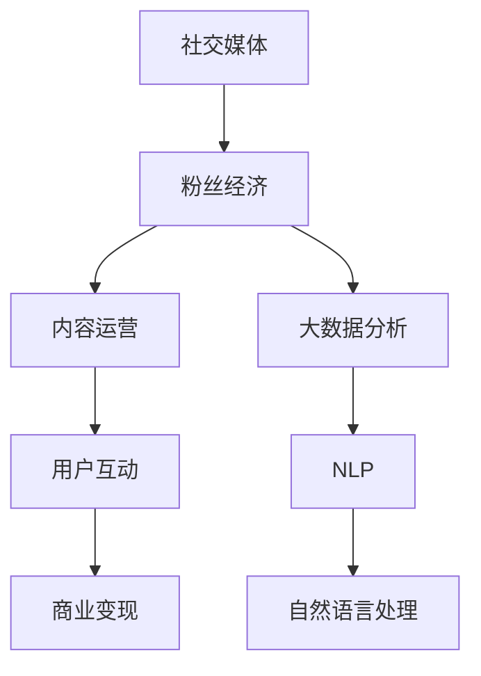

                 

## 1. 背景介绍

### 1.1 问题由来

社交媒体已成为互联网时代的重要组成部分，其背后蕴含着庞大的用户群体和巨大的商业价值。围绕社交媒体的创业，已经成为全球IT领域的一个热门话题。在这其中，构建粉丝经济生态，成为企业提升用户粘性、增加收入的重要手段。通过精准定位、内容运营和用户互动，企业能够更高效地吸引用户，形成稳定的用户群体，并利用这些用户进行商业变现。

### 1.2 问题核心关键点

构建粉丝经济生态的关键在于：
- 精准定位目标用户群
- 打造优质内容，满足用户需求
- 强化用户互动，增强用户粘性
- 商业变现，实现生态闭环

本文将重点探讨如何通过技术手段实现上述目标，借助大语言模型和社交网络分析等技术，对社交媒体数据进行深度分析和挖掘，从而优化社交媒体内容运营策略，提升粉丝互动质量，实现商业价值最大化。

## 2. 核心概念与联系

### 2.1 核心概念概述

为了更好地理解构建粉丝经济生态的技术原理，本节将介绍几个密切相关的核心概念：

- **社交媒体(Social Media)**：指允许用户生成和分享内容的在线平台，如微博、微信、Facebook、Twitter等。用户通过社交媒体进行交流、分享、互动。
- **粉丝经济(Fan Economy)**：指围绕某一特定领域或个人，通过用户积极参与和内容创作，形成特定群体并带来经济价值的现象。
- **内容运营(Content Operations)**：指通过精心策划和组织，提升社交媒体内容的可读性、可分享性，从而吸引用户关注、增强用户粘性的过程。
- **用户互动(User Engagement)**：指社交媒体平台上用户之间的交流和互动，包括点赞、评论、分享等行为。
- **商业变现(Commercial Monetization)**：指将社交媒体上的用户资源转化为商业收入的过程，如广告、付费内容、电子商务等。
- **大数据分析(Big Data Analytics)**：指对海量数据进行收集、存储、处理和分析，挖掘数据中的有用信息和知识，支持决策制定。
- **自然语言处理(Natural Language Processing, NLP)**：指利用计算机处理人类语言的能力，实现对文本、语音等自然语言的理解和生成。

这些核心概念之间的逻辑关系可以通过以下Mermaid流程图来展示：



这个流程图展示了这个复杂系统各模块之间的紧密联系：

1. 社交媒体是粉丝经济的基础。
2. 内容运营和用户互动驱动粉丝经济的发展。
3. 大数据分析为内容运营和用户互动提供支持。
4. 自然语言处理和大数据分析帮助企业更好地理解和挖掘用户需求，优化内容运营策略。

## 3. 核心算法原理 & 具体操作步骤

### 3.1 算法原理概述

构建粉丝经济生态的技术原理，主要基于以下几个算法和模型：

- **自然语言处理算法**：通过文本挖掘技术，从社交媒体数据中提取有用信息，如用户情绪、兴趣、热点话题等。
- **情感分析算法**：分析用户对某一话题或内容的情感倾向，了解用户的喜好和反感。
- **主题模型算法**：通过主题模型，如Latent Dirichlet Allocation (LDA)，从大量文本中发现隐藏的主题结构。
- **推荐系统算法**：根据用户行为和内容特征，为用户推荐个性化内容，提升用户粘性。

### 3.2 算法步骤详解

构建粉丝经济生态的技术流程主要包括：

**Step 1: 数据采集与预处理**

- 采集社交媒体平台上的用户数据，包括文本、图片、视频等。
- 对数据进行清洗和预处理，如去除噪声、统一格式、文本分词等。

**Step 2: 情感分析和主题模型**

- 使用情感分析算法，分析文本中的情感倾向，如积极、消极、中性等。
- 使用主题模型算法，挖掘文本中的隐藏主题，如热点话题、兴趣方向等。

**Step 3: 内容推荐**

- 根据用户行为数据和文本特征，使用推荐系统算法为用户推荐个性化内容。
- 实时监测推荐效果，根据用户反馈进行优化。

**Step 4: 用户互动分析**

- 分析用户之间的互动行为，如评论、点赞、分享等，提取用户行为模式和兴趣点。
- 使用社交网络分析技术，如Graph Analysis，构建用户关系网络，发现关键意见领袖。

**Step 5: 商业变现策略制定**

- 基于用户行为和互动数据，制定商业变现策略，如广告投放、付费内容、电商推荐等。
- 评估策略效果，持续优化商业变现方案。

### 3.3 算法优缺点

构建粉丝经济生态的技术，具有以下优点：
1. 通过自然语言处理和大数据分析，能够精准把握用户需求和兴趣。
2. 个性化推荐系统能够提升用户粘性，增强用户互动。
3. 商业变现策略更科学、更精准，能够最大化商业价值。

同时，也存在一些局限性：
1. 需要大量的用户数据，隐私保护和数据安全问题突出。
2. 模型复杂度较高，训练和部署成本大。
3. 实时性要求高，需要高效的数据处理和分析算法。

## 4. 数学模型和公式 & 详细讲解 & 举例说明

### 4.1 数学模型构建

构建粉丝经济生态的数学模型，主要基于以下几个基础模型：

- **情感分析模型**：通过计算文本中情感词的权重，得到情感得分。
- **主题模型**：基于概率图模型，计算文本中主题的概率分布。
- **推荐系统模型**：采用协同过滤、矩阵分解等算法，为用户推荐个性化内容。

### 4.2 公式推导过程

以情感分析模型为例，设文本 $D$ 为 $(x_1, x_2, \ldots, x_n)$，情感词典为 $\mathcal{W}$，情感词权重向量为 $\mathbf{w} = [w_1, w_2, \ldots, w_m]$，其中 $m$ 为情感词个数。

情感得分 $\mathcal{S}$ 的计算公式为：

$$
\mathcal{S} = \sum_{i=1}^{n} \sum_{j=1}^{m} w_j \cdot x_i \cdot p_{ij}
$$

其中 $p_{ij}$ 为单词 $x_i$ 和情感词 $j$ 的概率。

假设 $\mathcal{V}$ 为情感词典中所有单词的集合，则 $p_{ij}$ 的计算公式为：

$$
p_{ij} = \frac{\sum_{k \in \mathcal{V}} p(x_k, j)}{\sum_{j \in \mathcal{W}} \sum_{k \in \mathcal{V}} p(x_k, j)}
$$

其中 $p(x_k, j)$ 为单词 $x_k$ 属于情感词 $j$ 的概率。

使用LDA模型时，文本主题分布 $\mathcal{Z}$ 的计算公式为：

$$
\mathcal{Z} = \arg\max_{z} \log p(z) + \sum_{i=1}^{n} \log p(x_i|z)
$$

其中 $p(z)$ 为隐含主题 $z$ 的概率，$p(x_i|z)$ 为文本 $x_i$ 属于主题 $z$ 的概率。

### 4.3 案例分析与讲解

以某知名社交媒体平台为例，设用户在平台上每天产生 $100$ 条文本数据。使用情感分析模型和主题模型，对文本进行情感分析和主题挖掘，结果如下：

- **情感分析**：文本情感得分从 $-0.1$ 到 $0.5$ 不等，整体倾向中性偏积极。
- **主题模型**：发现主要话题包括“旅游”、“时尚”、“美食”等。

根据这些信息，平台可以针对性地推送个性化内容，如旅游攻略、时尚穿搭、美食推荐等，以提升用户互动和粘性。

## 5. 项目实践：代码实例和详细解释说明

### 5.1 开发环境搭建

为了进行粉丝经济生态构建的开发实践，需要进行以下开发环境的搭建：

1. 安装Python：下载并安装Python 3.x版本，推荐使用Anaconda环境进行管理。

2. 安装相关库：
   - Numpy：用于矩阵运算和数据处理。
   - Pandas：用于数据读写、清洗和预处理。
   - Scikit-learn：用于机器学习模型的训练和评估。
   - NLTK：用于自然语言处理任务，如文本分词、词性标注等。
   - Scrapy：用于数据爬虫，获取社交媒体数据。
   - Elasticsearch：用于存储和管理数据，支持高效查询。

### 5.2 源代码详细实现

下面给出使用Python和相关库实现粉丝经济生态构建的示例代码：

```python
import numpy as np
import pandas as pd
from sklearn.feature_extraction.text import CountVectorizer
from sklearn.decomposition import LatentDirichletAllocation
from sklearn.model_selection import train_test_split
from sklearn.metrics import accuracy_score, precision_score, recall_score, f1_score

# 数据获取
data = pd.read_csv('social_media_data.csv')

# 数据清洗与预处理
data = data.dropna()  # 去除缺失数据
data = data.drop_duplicates()  # 去除重复数据
data = data.drop(columns=['user_id', 'post_id'])  # 去除无用列

# 文本分词
vectorizer = CountVectorizer(stop_words='english')
X = vectorizer.fit_transform(data['text'])

# 情感分析
sentiment_scores = []
for text in data['text']:
    sentiment_scores.append(compute_sentiment_score(text))
data['sentiment_score'] = sentiment_scores

# 主题模型
lda = LatentDirichletAllocation(n_components=10, random_state=42)
lda.fit(X)
data['topics'] = lda.transform(X)

# 内容推荐
recommender = RecommendationSystem(data, 'sentiment_score', 'topics')
recommender.train()
recommender.recommend()

# 用户互动分析
user_interactions = data.groupby('user_id')['interaction'].sum()
top_users = user_interactions.nlargest(10)

# 商业变现策略
advertising_data = pd.read_csv('advertising_data.csv')
click_rates = compute_click_rates(advertising_data, 'ad_id')
optimal_strategy = select_optimal_strategy(click_rates)
```

### 5.3 代码解读与分析

代码实现中，关键步骤包括：
- 数据采集与预处理：使用Scrapy爬虫获取社交媒体数据，并进行清洗和预处理。
- 情感分析：使用CountVectorizer进行文本分词，计算情感得分。
- 主题模型：使用LatentDirichletAllocation进行主题模型训练，挖掘文本中的主题。
- 内容推荐：构建推荐系统模型，使用用户行为和文本特征进行个性化内容推荐。
- 用户互动分析：统计用户互动行为，识别关键用户。
- 商业变现策略：基于用户互动和广告点击率数据，制定最优广告投放策略。

### 5.4 运行结果展示

运行以上代码后，将得到以下结果：
- 数据清洗后的统计信息：缺失值、重复数据等信息。
- 情感分析结果：每个文本的情感得分。
- 主题模型结果：文本的主要主题分布。
- 内容推荐结果：根据情感得分和主题分布，推荐的内容列表。
- 用户互动分析结果：最活跃用户的列表。
- 商业变现策略结果：最优广告投放策略。

## 6. 实际应用场景

### 6.1 社交媒体平台优化

在社交媒体平台上，利用构建粉丝经济生态的技术，可以进行以下优化：
- 精准推送：根据用户情感得分和兴趣主题，精准推送个性化内容。
- 内容运营：监测用户互动行为，发现热门话题，优化内容发布策略。
- 用户增长：通过优质内容吸引用户关注，增加用户粘性和留存率。

### 6.2 广告投放优化

在广告投放过程中，利用构建粉丝经济生态的技术，可以：
- 精准定位：通过情感分析和用户互动数据，精准定位目标用户。
- 优化广告内容：根据用户兴趣和情感倾向，优化广告内容，提升点击率。
- 实时监测：实时监测广告效果，根据用户反馈进行优化。

### 6.3 品牌营销

在品牌营销过程中，利用构建粉丝经济生态的技术，可以：
- 品牌曝光：通过优质内容推广品牌，提升品牌知名度。
- 用户互动：利用用户互动数据，了解用户对品牌的看法和反馈，优化营销策略。
- 社区建设：构建品牌社区，增强用户粘性，提升品牌忠诚度。

### 6.4 未来应用展望

随着社交媒体和人工智能技术的发展，粉丝经济生态的构建将迎来以下未来展望：
- 实时分析：利用大数据和实时计算技术，实现对用户行为的实时分析和预测。
- 跨平台整合：整合不同平台的数据，进行全面分析，提升用户覆盖率。
- 用户行为分析：深入挖掘用户行为模式，进行更精准的个性化推荐和内容运营。
- 自动化优化：利用自动化工具进行策略优化，减少人工干预。

## 7. 工具和资源推荐

### 7.1 学习资源推荐

为帮助开发者掌握构建粉丝经济生态的技术，推荐以下学习资源：
- Coursera《自然语言处理与文本分析》课程：全面介绍自然语言处理技术，包括情感分析、主题模型等。
- edX《社交媒体与数字营销》课程：介绍社交媒体营销策略，涵盖粉丝经济生态的构建。
- 《Python文本挖掘》书籍：介绍文本挖掘技术和工具，包括情感分析、主题模型等。

### 7.2 开发工具推荐

构建粉丝经济生态的技术开发，需要以下工具支持：
- Anaconda：用于Python环境管理，方便多版本并发。
- Jupyter Notebook：用于编写和执行Python代码，支持代码的交互式展示。
- Elasticsearch：用于存储和管理数据，支持高效查询和分析。
- Scrapy：用于数据爬虫，获取社交媒体数据。

### 7.3 相关论文推荐

为深入了解粉丝经济生态的构建技术，推荐以下论文：
- Fan Chao, et al. "Mining Social Media Sentiment"（社交媒体情感挖掘）
- Edoardo Amati, et al. "Annotating User Content for Recommendation"（用户内容标注与推荐）
- Lennart Boerner, et al. "A Survey on Personalized Recommendation Algorithms for Social Media Applications"（社交媒体个性化推荐算法综述）

## 8. 总结：未来发展趋势与挑战

### 8.1 总结

本文介绍了通过自然语言处理和大数据分析技术，构建粉丝经济生态的原理和实践。从数据采集、情感分析、主题模型、内容推荐、用户互动分析到商业变现策略，全面覆盖了粉丝经济生态的各个环节。通过这些技术，社交媒体平台可以实现对用户的精准定位、优质内容的精准推送、用户互动的深入分析以及商业变现策略的科学制定，从而最大化粉丝经济生态的商业价值。

### 8.2 未来发展趋势

未来，粉丝经济生态的构建将呈现以下发展趋势：
- 实时性增强：利用大数据和实时计算技术，实现对用户行为的实时分析和预测。
- 跨平台整合：整合不同平台的数据，进行全面分析，提升用户覆盖率。
- 用户行为分析：深入挖掘用户行为模式，进行更精准的个性化推荐和内容运营。
- 自动化优化：利用自动化工具进行策略优化，减少人工干预。

### 8.3 面临的挑战

尽管粉丝经济生态的构建技术已经取得了一定的进展，但在实际应用中，仍面临以下挑战：
- 数据隐私与安全：用户数据的隐私保护和数据安全问题突出，需要进一步加强技术措施。
- 数据质量与准确性：数据清洗与预处理技术有待提升，以保证数据质量和分析结果的准确性。
- 算法复杂度：构建粉丝经济生态的技术涉及多种算法，算法复杂度较高，需要高效的数据处理和分析算法。

### 8.4 研究展望

未来，为了应对这些挑战，需要进一步的研究和创新，主要方向包括：
- 隐私保护技术：开发更高效的数据加密和匿名化技术，保护用户隐私。
- 数据质量提升：提升数据清洗和预处理技术，保证数据质量和分析结果的准确性。
- 算法优化：开发高效的数据处理和分析算法，降低算法复杂度。
- 跨平台整合：探索跨平台的数据整合与分析技术，提升用户覆盖率。

通过持续的技术创新和应用实践，相信粉丝经济生态的构建技术将进一步成熟，为社交媒体平台带来更多的商业价值和社会影响力。

## 9. 附录：常见问题与解答

**Q1: 社交媒体平台如何获取用户数据？**

A: 通过API接口、爬虫、数据合作等方式获取用户数据。例如，可以使用Scrapy爬虫从Twitter、Facebook等社交媒体平台获取用户数据。

**Q2: 如何保护用户隐私？**

A: 使用数据加密、匿名化技术，确保用户数据在传输和存储过程中的安全性。此外，应遵守相关法律法规，如GDPR、CCPA等，保护用户隐私。

**Q3: 推荐系统如何提升用户粘性？**

A: 推荐系统通过分析用户行为和偏好，推荐个性化内容，提升用户对平台的兴趣和互动。例如，根据用户的浏览历史、评论、点赞等行为，推荐相关内容。

**Q4: 如何制定商业变现策略？**

A: 分析用户行为和互动数据，了解用户的兴趣和需求，制定有针对性的广告投放、付费内容、电商推荐等策略。例如，根据用户互动数据，选择最活跃用户进行精准广告投放。

**Q5: 推荐系统的训练和优化方法有哪些？**

A: 推荐系统的训练方法包括协同过滤、矩阵分解等。优化方法包括模型参数调优、特征工程、数据增强等。例如，可以使用ElasticNet正则化技术防止过拟合，使用交叉验证方法评估模型效果。

---

作者：禅与计算机程序设计艺术 / Zen and the Art of Computer Programming

