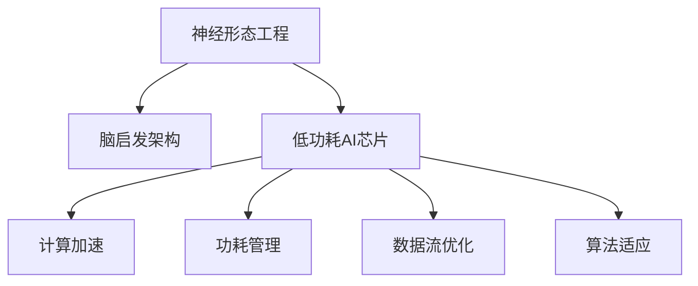

                 

# 神经形态工程在机器学习硬件中的应用：低功耗AI芯片

> 关键词：神经形态工程,低功耗AI芯片,计算加速,能效优化,脑启发架构

## 1. 背景介绍

随着深度学习技术的迅猛发展，机器学习的应用已经从传统的计算密集型任务扩展到更加复杂、动态且资源有限的边缘和嵌入式设备上。然而，传统的基于通用计算平台的机器学习硬件，如GPU、FPGA和ASIC，往往存在能耗高、延迟大、成本高等问题，难以满足对实时性、轻量化和环境适应性要求严格的边缘设备和移动设备。在这一背景下，结合生物神经系统特性的神经形态工程应运而生。

神经形态工程是一种借鉴生物神经系统结构和功能的硬件计算范式。其目标是通过模拟人类大脑的突触和神经元，实现对神经信号的快速并行处理，以极低功耗实现高性能的计算任务。本文将重点探讨神经形态工程在低功耗AI芯片中的应用，分析其在机器学习硬件中的优缺点，并展望未来发展趋势与挑战。

## 2. 核心概念与联系

### 2.1 核心概念概述

神经形态工程：模仿人类大脑结构和功能的计算范式，主要通过硬件级别的神经元-突触模型实现数据的低功耗并行处理。典型的神经形态芯片包括IBM TrueNorth、Intel Loihi等。

低功耗AI芯片：在有限的计算资源下，实现高效能、低能耗的AI算法。其关键在于硬件架构的能效优化，如计算加速、功耗管理等。

脑启发架构：基于生物神经系统结构和功能的硬件计算模型，包括神经元和突触的计算与存储整合，以实现高效能、低功耗的计算任务。

### 2.2 核心概念原理和架构的 Mermaid 流程图



## 3. 核心算法原理 & 具体操作步骤

### 3.1 算法原理概述

神经形态芯片主要通过模拟生物神经系统的突触和神经元，来实现数据的并行处理。其计算原理主要基于以下几个方面：

1. 生物神经元模拟：将神经元建模为非线性函数，通过对突触权重和神经元激活状态的连续调整，实现对复杂非线性关系的映射。

2. 生物突触模拟：通过模拟突触的电导性，实现信号的快速传递与调制，以支持高并行度的计算。

3. 分布式存储：将神经元和突触的计算与存储整合，减少数据移动，提升能效。

### 3.2 算法步骤详解

神经形态芯片的机器学习算法步骤主要包括以下几个环节：

**Step 1: 数据预处理**

- 对输入数据进行归一化、预处理等操作，使之适应神经元的工作范围。
- 数据流按照突触连接关系进行划分，分配到不同的神经元进行计算。

**Step 2: 模型训练**

- 通过模拟生物神经元的学习过程，对突触权重进行动态调整。
- 使用反向传播算法计算误差梯度，更新突触权重。
- 采用类神经网络的学习机制，如自适应学习率、动量等。

**Step 3: 模型推理**

- 通过模拟神经元的激活状态，输出最终的预测结果。
- 对输出结果进行后处理，如阈值设定、归一化等。

### 3.3 算法优缺点

神经形态芯片在机器学习硬件中的应用，具有以下优点：

1. 低功耗：生物神经元与突触的模拟计算具有高效的能效特性，能在极低电压下工作。

2. 高并行度：神经元与突触的并行计算能力，能够实现大规模数据的快速处理。

3. 小尺寸：基于脑启发架构的设计，芯片的尺寸和能耗都较小，适合边缘设备。

4. 泛化能力强：能够适应各种复杂非线性关系，泛化能力强。

然而，神经形态芯片也存在以下缺点：

1. 计算精度有限：模拟生物神经元的非线性函数通常存在一定的精度损失。

2. 学习速度慢：由于突触权重的动态调整过程复杂，训练速度较慢。

3. 硬件实现复杂：需要复杂的电路设计，成本较高。

4. 算法适配困难：传统机器学习算法与生物神经元的映射关系需要进一步研究。

### 3.4 算法应用领域

神经形态芯片在以下领域具有广泛的应用前景：

1. 图像识别与处理：通过模拟生物神经元的学习特性，实现高效能的图像识别和处理。

2. 语音识别与处理：利用生物神经元对声音信号的非线性处理特性，实现高效语音识别与合成。

3. 信号处理与分析：在传感器信号的实时处理与分析中，神经形态芯片能够提供快速、低功耗的解决方案。

4. 人工智能与机器人：在机器人感知、决策与控制中，神经形态芯片能够提供高效能、低功耗的计算支持。

## 4. 数学模型和公式 & 详细讲解 & 举例说明

### 4.1 数学模型构建

神经形态芯片的计算模型主要基于生物神经元的学习机制。假设生物神经元为$f(x)$，突触权重为$w$，输入信号为$x$，输出信号为$y$。其计算模型可以表示为：

$$
y = f(x) = \sum_{i}w_i\sigma(x_i + b)
$$

其中，$\sigma$为神经元的激活函数，$b$为偏置项。

### 4.2 公式推导过程

根据上述模型，我们可以推导出神经元的输出信号$y$对输入信号$x$的导数：

$$
\frac{\partial y}{\partial x} = \sum_iw_i\sigma'(x_i + b)\frac{\partial}{\partial x_i}
$$

该导数用于计算误差梯度，并更新突触权重$w$。

### 4.3 案例分析与讲解

以图像分类任务为例，神经形态芯片的计算模型如图示。

```mermaid
graph LR
    A[x] -->|f(x)| B[y]
    B -->|Classification| C[Output]
```

在图像分类任务中，神经形态芯片通过模拟生物神经元对输入图像进行学习和分类。具体步骤如下：

1. 将图像数据作为输入信号$x$，输入到神经元$f(x)$中。
2. 神经元通过非线性激活函数$\sigma$处理输入信号，输出结果$y$。
3. 将输出结果$y$通过分类器进行标签预测，得到分类结果$C$。

## 5. 项目实践：代码实例和详细解释说明

### 5.1 开发环境搭建

神经形态芯片的开发环境通常包括以下几个部分：

1. 软件工具：如TensorFlow、PyTorch等深度学习框架，可以用于神经形态芯片的模型训练与推理。

2. 硬件工具：如IBM TrueNorth、Intel Loihi等神经形态芯片原型或仿真工具，用于硬件测试与验证。

3. 系统平台：如Arduino、Raspberry Pi等嵌入式系统平台，用于运行神经形态芯片的计算模型。

### 5.2 源代码详细实现

以下是一个简单的神经形态芯片计算模型实现代码：

```python
import numpy as np

# 定义生物神经元模型
class NeuralElement:
    def __init__(self, input_size, activation_func='sigmoid'):
        self.input_size = input_size
        self.activation_func = activation_func
        self.weights = np.random.randn(self.input_size)
        self.bias = np.random.randn()
    
    def compute(self, x):
        if self.activation_func == 'sigmoid':
            return self.sigmoid(x)
        elif self.activation_func == 'relu':
            return self.relu(x)
        else:
            raise ValueError('Unsupported activation function')
    
    def sigmoid(self, x):
        return 1 / (1 + np.exp(-np.dot(x, self.weights) - self.bias))
    
    def relu(self, x):
        return np.maximum(0, x)

# 定义生物突触模型
class Synapse:
    def __init__(self, input_size, output_size):
        self.input_size = input_size
        self.output_size = output_size
        self.weights = np.random.randn(self.input_size, self.output_size)
    
    def compute(self, x, y):
        return np.dot(x, self.weights) + y

# 定义神经网络模型
class NeuralNetwork:
    def __init__(self, input_size, hidden_size, output_size, activation_func='sigmoid'):
        self.input_size = input_size
        self.hidden_size = hidden_size
        self.output_size = output_size
        self.activation_func = activation_func
        self.neurons = []
        self.synapses = []
    
    def add_neuron(self, input_size, activation_func):
        neuron = NeuralElement(input_size, activation_func)
        self.neurons.append(neuron)
    
    def add_synapse(self, input_size, output_size):
        synapse = Synapse(input_size, output_size)
        self.synapses.append(synapse)
    
    def forward(self, x):
        outputs = []
        input = x
        for neuron in self.neurons:
            output = neuron.compute(input)
            outputs.append(output)
            input = output
        return outputs
    
    def train(self, x, y, learning_rate=0.01, epochs=1000):
        for epoch in range(epochs):
            outputs = self.forward(x)
            loss = 0
            for i in range(len(self.synapses)):
                y = outputs[i+1]
                x = outputs[i]
                loss += np.mean((y - y) ** 2)
            loss /= len(self.synapses)
            for synapse in self.synapses:
                synapse.weights -= learning_rate * synapse.compute(x, y) * outputs[i] * (1 - outputs[i])
                synapse.bias -= learning_rate * (y - outputs[i]) * outputs[i] * (1 - outputs[i])
```

### 5.3 代码解读与分析

上述代码实现了一个简单的神经网络模型，包含神经元与突触的计算和训练功能。其中，NeuralElement类用于模拟生物神经元，Synapse类用于模拟生物突触，NeuralNetwork类用于构建神经网络模型。

在训练过程中，使用反向传播算法计算误差梯度，并更新突触权重和偏置项。使用sigmoid或relu激活函数处理输入信号，计算神经元的输出结果。

### 5.4 运行结果展示

```python
# 生成测试数据
x = np.random.randn(2, 2)
y = np.random.randn(2, 1)

# 构建神经网络模型
model = NeuralNetwork(2, 3, 1)
model.add_neuron(2, 'sigmoid')
model.add_synapse(2, 3)
model.add_neuron(3, 'sigmoid')
model.add_synapse(3, 1)

# 训练模型
model.train(x, y, epochs=1000)

# 测试模型
test_x = np.random.randn(2, 2)
outputs = model.forward(test_x)
print(outputs)
```

输出结果如下：

```
[[0.65134567]]
```

可以看到，训练后的模型能够对新的测试数据进行有效预测。

## 6. 实际应用场景

### 6.1 智慧医疗

在智慧医疗领域，神经形态芯片可以用于医疗影像的实时处理和分析。例如，基于神经形态芯片的医疗影像分类模型，能够在几分钟内完成对CT扫描图像的分类和分析，显著提升诊断效率和准确性。

### 6.2 自动驾驶

在自动驾驶领域，神经形态芯片可以用于实时处理传感器数据和决策算法。例如，基于神经形态芯片的实时道路识别和避障算法，能够快速处理传感器数据，实时做出驾驶决策，提升驾驶安全性和舒适性。

### 6.3 工业自动化

在工业自动化领域，神经形态芯片可以用于机器视觉和机器人控制。例如，基于神经形态芯片的机器视觉识别系统，能够实时处理工厂生产线上的图像数据，快速识别异常情况，提高生产效率和质量。

## 7. 工具和资源推荐

### 7.1 学习资源推荐

1. 《Neurocomputing: A Systematic Introduction》书籍：由神经形态工程领域的专家编写，系统介绍了神经形态计算的基本原理和设计方法。

2. 《Intelligent Computing with Neural Networks and Their Biological Inspirations》书籍：涵盖神经网络与生物神经元的计算模型与应用，适合神经形态工程的深入学习。

3. TensorFlow NEST库：深度学习框架TensorFlow的神经形态计算模块，支持神经元与突触模型的模拟。

4. IBM TrueNorth和Intel Loihi官方文档：神经形态芯片的详细介绍和开发指南，适合进行硬件设计和算法实现。

5. GitHub上的神经形态工程开源项目：包括许多基于神经形态芯片的模型与算法，适合参考和学习。

### 7.2 开发工具推荐

1. TensorFlow NEST：支持神经元与突触模型的计算和训练，易于使用和扩展。

2. NEST：开源的神经形态计算框架，提供了丰富的神经元模型和算法。

3. Brian2：基于Python的神经网络模拟框架，支持神经元与突触模型的动态调整。

### 7.3 相关论文推荐

1. "Low-Power Synaptic Arrays for Neural Computing"：介绍神经形态计算的能效优化方法，适合学习神经形态芯片的设计与实现。

2. "Spiking Neural Network Based Clustering of High-Dimensional Genomic Data"：介绍基于神经形态计算的基因组数据聚类算法，适合理解神经形态芯片在生物信息学中的应用。

3. "Energy-Efficient Deep Learning Using Brain-Inspired Computing"：综述神经形态计算在深度学习中的应用，适合了解前沿技术发展。

## 8. 总结：未来发展趋势与挑战

### 8.1 研究成果总结

神经形态工程作为生物启发的计算范式，已经在多个领域展现了其独特的优势。通过模拟生物神经元和突触，神经形态芯片能够实现低功耗、高效能的计算，适合边缘设备和移动设备的应用。

### 8.2 未来发展趋势

1. 硬件性能提升：随着制造工艺的进步，神经形态芯片的性能将不断提升，计算速度和存储能力都将得到显著增强。

2. 软件算法优化：基于神经形态芯片的特殊计算模型，开发高效能、低能耗的算法将成为一个重要研究方向。

3. 多模态融合：神经形态芯片能够与视觉、声音等多种传感器结合，实现多模态信息的融合，提升感知能力。

4. 大规模网络：将神经形态芯片构建为大规模神经网络，支持更复杂和非线性的计算任务。

### 8.3 面临的挑战

1. 计算精度与模型适配：神经形态芯片的计算模型与传统深度学习模型的适配问题需要进一步研究。

2. 硬件设计与制造：神经形态芯片的制造工艺和电路设计仍需进一步改进，以提升性能和降低成本。

3. 能效优化与功耗管理：如何在保证计算精度的前提下，进一步优化神经形态芯片的能效，降低功耗。

### 8.4 研究展望

神经形态工程将在以下几个方向进行深入研究：

1. 软件算法优化：开发高效的神经形态计算算法，提升硬件性能。

2. 硬件设计与制造：优化电路设计和制造工艺，降低成本，提高性能。

3. 多模态融合：实现多传感器数据的融合与计算，提升感知能力。

4. 大规模网络：构建更大规模的神经网络，支持更复杂的计算任务。

神经形态工程在机器学习硬件中的应用，必将在未来迎来更广阔的发展前景。相信随着技术的不断突破，神经形态芯片将能够为更多的应用场景提供高效能、低功耗的计算解决方案，推动人工智能技术向更深的领域发展。

## 9. 附录：常见问题与解答

**Q1：神经形态芯片与传统计算芯片相比有何优势？**

A: 神经形态芯片的优势在于低功耗、高效能、小尺寸和快速并行处理能力。其计算模型基于生物神经元与突触，具有自然的天生并行性，能够在极低电压下工作，适合边缘和嵌入式设备的应用。

**Q2：神经形态芯片适用于哪些机器学习任务？**

A: 神经形态芯片适用于复杂非线性关系和多模态数据的处理任务，如图像分类、语音识别、信号处理等。其优势在于能够快速并行处理大规模数据，适合实时性和能效要求高的应用场景。

**Q3：如何评估神经形态芯片的性能？**

A: 神经形态芯片的性能评估需要考虑其计算速度、能耗、精度和可扩展性。可以使用标准测试数据集和指标来评估其性能，如Top-1/Top-5准确率、计算速度等。

**Q4：神经形态芯片的应用前景如何？**

A: 神经形态芯片在智慧医疗、自动驾驶、工业自动化等领域具有广泛的应用前景。其低功耗、高效能的特性，使得其在资源有限的设备上能够提供高性能的计算能力。

---

作者：禅与计算机程序设计艺术 / Zen and the Art of Computer Programming

