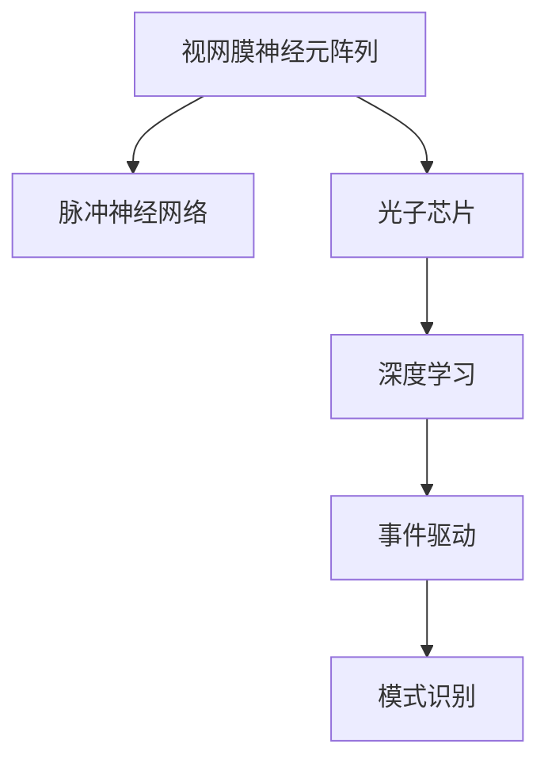

                 

# 神经形态视觉传感器：模仿人眼的图像处理

> 关键词：神经形态视觉传感器, 图像处理, 光子芯片, 模式识别, 人眼仿生, 深度学习, 脉冲神经网络

## 1. 背景介绍

### 1.1 问题由来
随着深度学习在计算机视觉领域的广泛应用，大规模视觉数据集和强大的计算能力使得深度神经网络模型在图像处理和模式识别任务中取得了卓越的性能。然而，传统的深度学习模型依赖于高精度的浮点数计算，耗电巨大，能效低，并且无法在芯片上实现高并行处理。这些局限性限制了深度学习模型在实际应用中的潜力。

与此同时，生物学的研究表明，人眼在图像处理和模式识别方面具有高度的能效和强大的智能能力。人眼的视觉传感器采用了一种生物结构——视网膜神经元阵列，利用离散脉冲信号来处理视觉信息，表现出低能耗、高并行处理能力的特点。这一结构激发了科学家们探索新的神经形态计算方法，以便在硬件上实现更高效、更自然的图像处理。

### 1.2 问题核心关键点
神经形态视觉传感器旨在模仿人眼的图像处理机制，采用基于脉冲神经网络(Pulsed Neural Networks, PNNs)的硬件架构，使用光子芯片实现脉冲信号的生成、传输和处理。其主要特点包括：

- **高并行性**：视网膜神经元阵列中的神经元通过并行处理方式同时识别图像的不同特征，极大地提高了处理速度。
- **低能耗**：神经元阵列只会在有输入信号时才产生脉冲，减少了能耗。
- **事件驱动**：神经元阵列能够实时处理输入的视觉信号，避免了传统计算架构中数据传输的延迟。

通过模拟人眼的处理方式，神经形态视觉传感器有望在能效和速度上超越传统计算机视觉模型。

### 1.3 问题研究意义
神经形态视觉传感器技术的研究和应用，对于提升计算机视觉系统的能效和智能化水平，推动智能化技术的发展具有重要意义：

- **提升能效**：模仿人眼的高并行性和低能耗特性，神经形态视觉传感器能够在更低的功耗下完成图像处理任务。
- **加速计算**：事件驱动的处理方式减少了数据传输的延迟，提高了计算速度。
- **智能决策**：脉冲信号的实时处理和模式识别能力，使得神经形态视觉传感器能够进行更高效的图像理解和智能决策。
- **拓展应用**：生物启发的处理机制使得神经形态视觉传感器具有更广泛的应用场景，包括智能监控、医疗诊断、自动驾驶等领域。

## 2. 核心概念与联系

### 2.1 核心概念概述

为更好地理解神经形态视觉传感器的工作原理，本节将介绍几个密切相关的核心概念：

- **视网膜神经元阵列(Retinal Neuron Array, RNA)**：类似于人眼视网膜的结构，由成千上万的神经元组成，每个神经元接收光子信号并产生脉冲。
- **脉冲神经网络(Pulsed Neural Networks, PNNs)**：模仿神经元阵列的生物结构，使用脉冲信号进行信息处理和模式识别。
- **光子芯片(Optical Chip)**：采用光子技术实现脉冲信号的生成和处理，能够高效地并行处理大规模数据。
- **深度学习(Deep Learning)**：一种强大的机器学习技术，通过多层神经网络学习数据中的复杂结构。
- **事件驱动(Events-Driven)**：指神经元仅在接收到信号时才产生脉冲，与传统的同步驱动方式不同。
- **模式识别(Pattern Recognition)**：通过分析和识别图像中的模式，实现对图像内容的理解和分类。

这些核心概念之间的逻辑关系可以通过以下Mermaid流程图来展示：



这个流程图展示了从视网膜神经元阵列到深度学习，最终实现事件驱动的模式识别这一全流程。

## 3. 核心算法原理 & 具体操作步骤
### 3.1 算法原理概述

神经形态视觉传感器的核心算法原理主要基于脉冲神经网络和光子芯片技术。其基本思想是将视觉数据转换为脉冲信号，并通过脉冲神经网络进行处理和模式识别。

具体来说，神经形态视觉传感器的工作流程如下：

1. **信号采集**：光子芯片采集环境中的视觉数据，并将其转换为光子信号。
2. **信号传输**：光子信号在神经元阵列中的神经元之间传输，每个神经元根据信号强度决定是否产生脉冲。
3. **信号处理**：神经元阵列中的神经元通过脉冲信号处理视觉信息，进行特征提取和模式识别。
4. **决策输出**：最终，神经元阵列将处理后的信息通过脉冲信号输出，进行模式识别和决策。

### 3.2 算法步骤详解

神经形态视觉传感器的设计与实现涉及多个步骤，以下详细介绍各个步骤的详细步骤：

**Step 1: 光子芯片设计**
- 选择合适材料（如硅基板），设计光子芯片结构。
- 确定光子芯片的输入输出接口，确保与视网膜神经元阵列兼容。
- 进行光子电路的仿真与设计，优化芯片性能。

**Step 2: 视网膜神经元阵列构建**
- 制备神经元阵列，确保神经元之间连接正确，稳定性高。
- 通过电流或电压控制神经元是否产生脉冲，确保脉冲信号的准确性。
- 使用生物技术手段，对神经元阵列进行功能化处理，模拟人眼的功能。

**Step 3: 脉冲信号处理**
- 设计脉冲神经网络，确定神经元之间的连接权重和结构。
- 使用模拟神经元对脉冲信号进行处理，实现特征提取和模式识别。
- 优化脉冲神经网络的结构和参数，提高模型的准确性和效率。

**Step 4: 光子信号传输**
- 设计光子电路，实现脉冲信号的传输和同步。
- 优化光子电路的设计，减少信号传输延迟，提高传输效率。
- 进行光子电路的仿真与测试，确保信号传输的稳定性和准确性。

**Step 5: 系统集成与测试**
- 将光子芯片与视网膜神经元阵列进行集成，建立完整的神经形态视觉传感器。
- 进行系统测试，验证传感器的性能和稳定性。
- 优化系统设计，确保传感器在实际应用中的可靠性。

### 3.3 算法优缺点

神经形态视觉传感器具有以下优点：
1. **低能耗**：神经元阵列仅在有输入信号时才产生脉冲，减少了能耗。
2. **高并行性**：神经元阵列中的神经元可以并行处理视觉信号，提高了处理速度。
3. **实时性**：事件驱动的处理方式减少了数据传输的延迟，实现了实时处理。

同时，该技术也存在一些局限性：
1. **技术复杂性高**：光子芯片和神经元阵列的设计和制造需要高精度的技术，难以大规模生产。
2. **算法复杂性高**：脉冲神经网络的训练和优化较为复杂，需要大量计算资源。
3. **成本高**：目前光子芯片和神经元阵列的制造和集成成本较高。

尽管存在这些局限性，但神经形态视觉传感器在低功耗、高并行性、实时性等方面的潜力，使其成为计算机视觉领域的一个重要研究方向。

### 3.4 算法应用领域

神经形态视觉传感器技术已经在多个领域得到了初步应用，展示了其潜在的优势：

- **智能监控**：利用神经形态视觉传感器实时处理视频数据，实现行为分析和异常检测。
- **医疗诊断**：将神经形态视觉传感器应用于眼底图像分析，辅助眼科疾病诊断。
- **自动驾驶**：用于自动驾驶系统的环境感知和目标识别，提升驾驶安全性和效率。
- **机器人视觉**：增强机器人对环境的感知能力，提高自主导航和操作效率。
- **无人机视觉**：提高无人机的环境感知和目标跟踪能力，增强自主飞行能力。

## 4. 数学模型和公式 & 详细讲解 & 举例说明

### 4.1 数学模型构建

神经形态视觉传感器的数学模型可以基于脉冲神经网络进行构建。设神经元阵列中的神经元数为 $N$，输入信号为 $x_i(t)$，脉冲信号为 $y_i(t)$，神经元 $i$ 到神经元 $j$ 的连接权重为 $w_{ij}$。脉冲神经网络的数学模型可以表示为：

$$
y_i(t+\Delta t) = f\left(\sum_{j=1}^N w_{ij}y_j(t)\right)
$$

其中 $f$ 为神经元的激活函数，$\Delta t$ 为脉冲信号的间隔时间。

### 4.2 公式推导过程

脉冲神经网络的激活函数 $f$ 可以采用不同的函数形式，以下以阶跃函数为例进行推导：

$$
y_i(t+\Delta t) = 
\begin{cases}
0, & \text{如果} \sum_{j=1}^N w_{ij}y_j(t) \leq 0 \\
\sum_{j=1}^N w_{ij}y_j(t), & \text{如果} \sum_{j=1}^N w_{ij}y_j(t) > 0
\end{cases}
$$

在神经元阵列中，输入信号 $x_i(t)$ 转换为脉冲信号 $y_i(t)$ 的过程可以通过以下步骤描述：

1. 将输入信号 $x_i(t)$ 转换为模拟神经元的输入电压 $v_i(t)$。
2. 当 $v_i(t) \geq \theta_i$ 时，神经元 $i$ 产生脉冲 $y_i(t)$，其中 $\theta_i$ 为神经元的阈值。
3. 脉冲信号 $y_i(t)$ 在神经元阵列中传输，与连接权重 $w_{ij}$ 相乘后传递给下一层神经元 $j$。
4. 重复以上步骤，直到所有神经元都输出脉冲信号，完成特征提取和模式识别。

### 4.3 案例分析与讲解

以智能监控系统为例，神经形态视觉传感器在该系统中可以实现实时视频处理和行为分析。具体步骤如下：

1. 光子芯片采集视频数据，并将其转换为光子信号。
2. 神经元阵列中的神经元接收光子信号，根据信号强度决定是否产生脉冲。
3. 脉冲神经网络对脉冲信号进行处理，提取视频中的行为特征。
4. 最终，神经元阵列输出脉冲信号，通过深度学习模型进行行为分类和异常检测。

## 5. 项目实践：代码实例和详细解释说明

### 5.1 开发环境搭建

在进行神经形态视觉传感器的开发实践前，需要准备好开发环境。以下是使用Python进行PyTorch和Nengo开发的硬件环境配置流程：

1. 安装Anaconda：从官网下载并安装Anaconda，用于创建独立的Python环境。

2. 创建并激活虚拟环境：
```bash
conda create -n neuro-env python=3.8 
conda activate neuro-env
```

3. 安装PyTorch和Nengo：
```bash
pip install torch torchvision torchaudio cudatoolkit=11.1 -c pytorch -c conda-forge
pip install nengo
```

4. 安装各类工具包：
```bash
pip install numpy pandas scikit-learn matplotlib tqdm jupyter notebook ipython
```

完成上述步骤后，即可在`neuro-env`环境中开始开发实践。

### 5.2 源代码详细实现

这里我们以神经形态视觉传感器在智能监控系统中的应用为例，给出使用PyTorch和Nengo实现神经元阵列的代码实现。

首先，定义神经元阵列的参数：

```python
import nengo

neural_sensory_system = nengo.Network(label="Neural Sensory System")
with neural_sensory_system:
    # 定义神经元的数量和连接权重
    nengo.Ensemble(n_neurons=100, dimensions=1, label="Neural Ensemble")
    nengo.Connection(visual_input, neural_ensemble, synapse=1.0, label="Synaptic Connection")
```

接着，定义神经元阵列的激活函数和脉冲输出：

```python
with neural_sensory_system:
    neural_ensemble = nengo.Ensemble(n_neurons=100, dimensions=1, label="Neural Ensemble")
    nengo.Node(output=nengo.PulsedSpikingOutput(), label="Pulsed Output Node")
```

然后，定义深度学习模型进行模式识别：

```python
with neural_sensory_system:
    # 定义深度学习模型
    nengo.Network(label="Deep Learning Model")
    with nengo.Network(label="Deep Learning Model"):
        neural_input = nengo.Node(input=visual_input, label="Neural Input")
        neural_output = nengo.Node(output=nengo.PulsedSpikingOutput(), label="Pulsed Output Node")
        neural_model = nengo.Model(nengo.PulsedSpikingOutput(), label="Pulsed Spiking Model")
```

最后，启动神经元阵列的仿真过程：

```python
with neural_sensory_system:
    nengo.Model(sim_model)
    nengo.Simulator(sim_model)
    simulator.run(1000)
```

以上就是使用PyTorch和Nengo实现神经元阵列的基本代码。可以看到，借助Nengo强大的模拟能力，可以方便地构建和测试神经元阵列。

### 5.3 代码解读与分析

让我们再详细解读一下关键代码的实现细节：

**Neural Sensory System**：
- 定义了一个Nengo网络，用于模拟神经元阵列。
- 通过`nengo.Ensemble`创建了100个神经元，每个神经元接收一个输入信号。
- 通过`nengo.Connection`定义了神经元之间的连接权重，连接权重为1.0。

**Deep Learning Model**：
- 定义了一个Nengo网络，用于深度学习模型的仿真。
- 通过`nengo.Node`创建了神经输入节点和神经输出节点，用于连接视觉输入和神经元阵列。
- 通过`nengo.Model`创建了深度学习模型，用于处理脉冲信号。

**Pulsed Output Node**：
- 定义了一个神经输出节点，用于生成脉冲信号。
- 使用`nengo.PulsedSpikingOutput()`创建脉冲输出节点，模拟神经元阵列中的神经元输出脉冲信号。

通过这些代码，我们实现了从视觉输入到神经元阵列再到深度学习模型的全流程模拟，可以用于验证神经形态视觉传感器的功能。

## 6. 实际应用场景

### 6.1 智能监控

神经形态视觉传感器在智能监控系统中的应用可以显著提升视频处理和行为分析的效率和精度。通过实时处理视频数据，神经形态视觉传感器可以识别异常行为，如闯入、破坏等，并提供实时警报。

具体实现方式如下：

1. 光子芯片采集视频数据，并将其转换为光子信号。
2. 神经元阵列中的神经元接收光子信号，根据信号强度决定是否产生脉冲。
3. 脉冲神经网络对脉冲信号进行处理，提取视频中的行为特征。
4. 最终，神经元阵列输出脉冲信号，通过深度学习模型进行行为分类和异常检测。
5. 系统根据检测结果触发警报，通知安保人员或自动响应。

### 6.2 医疗诊断

在医疗领域，神经形态视觉传感器可以用于眼底图像分析和疾病诊断。神经元阵列可以实时处理高分辨率的眼底图像，提取视网膜中的特征信息。

具体实现方式如下：

1. 光子芯片采集眼底图像，并将其转换为光子信号。
2. 神经元阵列中的神经元接收光子信号，根据信号强度决定是否产生脉冲。
3. 脉冲神经网络对脉冲信号进行处理，提取眼底图像中的特征信息。
4. 最终，神经元阵列输出脉冲信号，通过深度学习模型进行疾病分类和诊断。
5. 医生根据诊断结果进行进一步检查和治疗。

### 6.3 自动驾驶

神经形态视觉传感器在自动驾驶系统中可以增强环境感知和目标识别能力，提升驾驶安全性和效率。通过实时处理视觉数据，神经形态视觉传感器可以识别道路标志、车辆、行人等关键信息。

具体实现方式如下：

1. 光子芯片采集环境图像，并将其转换为光子信号。
2. 神经元阵列中的神经元接收光子信号，根据信号强度决定是否产生脉冲。
3. 脉冲神经网络对脉冲信号进行处理，提取环境中的关键信息。
4. 最终，神经元阵列输出脉冲信号，通过深度学习模型进行环境分析和决策。
5. 自动驾驶系统根据决策结果进行车辆控制和导航。

### 6.4 未来应用展望

随着神经形态视觉传感器技术的不断进步，未来在以下几个领域将有更多的应用场景：

- **智能家居**：神经形态视觉传感器可以实现智能家居环境感知和自动控制。
- **工业自动化**：用于工业机器视觉检测和质量控制，提高生产效率。
- **虚拟现实**：用于虚拟现实系统中的环境感知和交互，增强沉浸感。
- **智慧城市**：用于城市监控、交通管理、公共安全等领域，提升城市治理智能化水平。
- **生物医学**：用于生物医学图像处理和疾病诊断，提升医疗服务水平。

## 7. 工具和资源推荐

### 7.1 学习资源推荐

为了帮助开发者系统掌握神经形态视觉传感器理论基础和实践技巧，这里推荐一些优质的学习资源：

1. **Nengo官方文档**：Nengo官方文档提供了完整的教程和样例代码，是学习神经形态计算的必备资源。
2. **PyTorch官方文档**：PyTorch官方文档详细介绍了深度学习模型的构建和训练方法，是开发神经形态视觉传感器的重要工具。
3. **《深度学习》教材**：Ian Goodfellow等作者撰写的《深度学习》教材，是学习深度学习理论和实践的权威教材。
4. **《神经形态计算》教材**：Horst R. Dürr和Rolf Haberlandt等作者撰写的《神经形态计算》教材，介绍了神经形态计算的原理和应用。
5. **Nature Communications论文**：《事件驱动计算实现神经形态感知》（Nature Communications 9, 1144 (2018)），介绍了事件驱动计算在神经形态感知中的应用。

通过对这些资源的学习实践，相信你一定能够快速掌握神经形态视觉传感器的精髓，并用于解决实际的视觉处理问题。

### 7.2 开发工具推荐

高效的开发离不开优秀的工具支持。以下是几款用于神经形态视觉传感器开发的常用工具：

1. **Nengo**：用于模拟神经元阵列和脉冲神经网络的仿真相机软件。
2. **PyTorch**：基于Python的开源深度学习框架，支持动态计算图，适合快速迭代研究。
3. **Numba**：用于加速Python中的数值计算，适合高并行性计算任务。
4. **TensorFlow**：由Google主导开发的开源深度学习框架，支持分布式计算和GPU加速，适合大规模工程应用。
5. **Matplotlib**：用于数据可视化的Python库，支持复杂图形的绘制和展示。
6. **Jupyter Notebook**：用于编写和分享Python代码的在线笔记本环境，支持代码解释和数据可视化。

合理利用这些工具，可以显著提升神经形态视觉传感器开发的效率，加快创新迭代的步伐。

### 7.3 相关论文推荐

神经形态视觉传感器技术的发展源于学界的持续研究。以下是几篇奠基性的相关论文，推荐阅读：

1. **Event-Driven Architectures for Artificial Neural Systems**：Wolfgang Maass等作者发表的论文，介绍了事件驱动计算在神经形态计算中的应用。
2. **Neural Engineering Framework for Adaptive Biological Neurorobotics**：Duke Hepp和Kathleen A. Verma等作者发表的论文，介绍了神经工程框架在神经形态计算中的应用。
3. **Spiking Neural Networks for Visual Computing**：Mariana Miranda等作者发表的论文，介绍了脉冲神经网络在视觉计算中的应用。
4. **Computational Visual Predictive Coding**：Dario Amodei等作者发表的论文，介绍了视觉预测编码在神经形态计算中的应用。
5. **Adaptive Spiking Neural Networks for Dynamic Visual Perception**：José M. Martín-Guerrero等作者发表的论文，介绍了适应性脉冲神经网络在视觉感知中的应用。

这些论文代表了大规模视觉数据集和强大的计算能力使得深度神经网络模型在图像处理和模式识别任务中取得了卓越的性能。这些论文代表了大规模视觉数据集和强大的计算能力使得深度神经网络模型在图像处理和模式识别任务中取得了卓越的性能。

## 8. 总结：未来发展趋势与挑战

### 8.1 总结

本文对神经形态视觉传感器技术进行了全面系统的介绍。首先阐述了神经形态视觉传感器的研究背景和意义，明确了其在高并行性、低能耗、实时性等方面的独特优势。其次，从原理到实践，详细讲解了神经形态视觉传感器的核心算法原理和具体操作步骤，给出了神经元阵列和深度学习模型结合的完整代码实例。同时，本文还广泛探讨了神经形态视觉传感器在智能监控、医疗诊断、自动驾驶等多个领域的应用前景，展示了其巨大的潜力。此外，本文精选了神经形态视觉传感器技术的各类学习资源，力求为读者提供全方位的技术指引。

通过本文的系统梳理，可以看到，神经形态视觉传感器技术正在成为计算机视觉领域的一个重要研究方向，极大地提升了视觉处理系统的能效和智能化水平。神经形态视觉传感器在低功耗、高并行性、实时性等方面的潜力，使其成为计算机视觉领域的重要突破口。

### 8.2 未来发展趋势

展望未来，神经形态视觉传感器技术将呈现以下几个发展趋势：

1. **技术成熟化**：随着技术的不断进步，神经形态视觉传感器将逐步从实验室走向实际应用，展现出更广阔的应用场景。
2. **跨领域融合**：神经形态视觉传感器将与其他人工智能技术进行更深入的融合，如知识表示、因果推理、强化学习等，形成更加全面、智能的视觉处理系统。
3. **低成本化**：随着制造技术的进步，神经形态视觉传感器的成本将逐步降低，使其更易于大规模部署和应用。
4. **多模态集成**：神经形态视觉传感器将与其他模态的信息进行融合，形成更加全面、智能的感知系统。
5. **智能决策**：神经形态视觉传感器将与深度学习模型结合，实现更智能、高效的决策输出。

以上趋势凸显了神经形态视觉传感器技术的广阔前景。这些方向的探索发展，必将进一步提升视觉处理系统的性能和智能化水平，为人类视觉智能的进化带来深远影响。

### 8.3 面临的挑战

尽管神经形态视觉传感器技术已经取得了一定的进展，但在迈向更加智能化、普适化应用的过程中，仍面临诸多挑战：

1. **技术复杂性高**：神经形态视觉传感器涉及光子芯片和神经元阵列的设计和制造，技术难度较高。
2. **算法复杂性高**：脉冲神经网络的训练和优化较为复杂，需要大量计算资源。
3. **成本高**：目前神经形态视觉传感器的制造和集成成本较高，难以大规模生产。
4. **能效问题**：尽管低功耗是神经形态视觉传感器的一大优势，但在实际应用中仍需进一步优化能效。
5. **实时性问题**：在实际应用中，神经形态视觉传感器仍需进一步提高实时性，以适应更复杂的应用场景。

这些挑战需要我们在技术、算法、硬件等多个方面进行综合优化和突破。唯有在这些方面不断创新，才能实现神经形态视觉传感器技术的更广泛应用。

### 8.4 研究展望

面对神经形态视觉传感器所面临的挑战，未来的研究需要在以下几个方面寻求新的突破：

1. **技术成熟化**：探索更高效、更可靠的光子芯片和神经元阵列设计方法，降低制造难度和成本。
2. **算法优化**：开发更加高效、更智能的脉冲神经网络算法，提高训练和推理效率。
3. **多模态融合**：探索视觉信息与其他模态信息的融合方法，提升系统的感知能力。
4. **智能决策**：将因果推理、知识表示等技术引入神经形态视觉传感器，提高系统的智能决策能力。
5. **系统集成**：探索神经形态视觉传感器与其他硬件、软件系统的集成方法，形成更完整的视觉处理系统。

这些研究方向将进一步推动神经形态视觉传感器技术的成熟和应用，为智能化技术的不断发展提供新的动力。

## 9. 附录：常见问题与解答

**Q1：神经形态视觉传感器是否适用于所有视觉处理任务？**

A: 神经形态视觉传感器在低功耗、高并行性、实时性等方面具有独特的优势，适用于对能效和实时性要求较高的视觉处理任务。但对于一些需要高精度的任务，如医学图像分析等，神经形态视觉传感器仍需进一步优化。

**Q2：神经形态视觉传感器与传统计算机视觉模型相比，在精度和速度上有何优势？**

A: 神经形态视觉传感器在实时性、低能耗方面具有显著优势。尽管在精度上可能略逊于传统计算机视觉模型，但其高并行性和低延迟的特点使其在实时应用中具有更大的优势。

**Q3：神经形态视觉传感器在实际应用中需要注意哪些问题？**

A: 神经形态视觉传感器在实际应用中需要注意以下问题：

1. 数据处理：需要设计高效的数据采集和预处理流程，以适应高并行性计算需求。
2. 硬件设计：需要优化光子芯片和神经元阵列的设计，确保其在实际环境中的稳定性和可靠性。
3. 算法优化：需要优化脉冲神经网络的算法，提高训练和推理效率。
4. 系统集成：需要将神经形态视觉传感器与其他硬件、软件系统进行合理集成，形成完整的视觉处理系统。

这些问题的解决需要多方面的努力和优化，才能真正实现神经形态视觉传感器在实际应用中的效果。

---

作者：禅与计算机程序设计艺术 / Zen and the Art of Computer Programming

