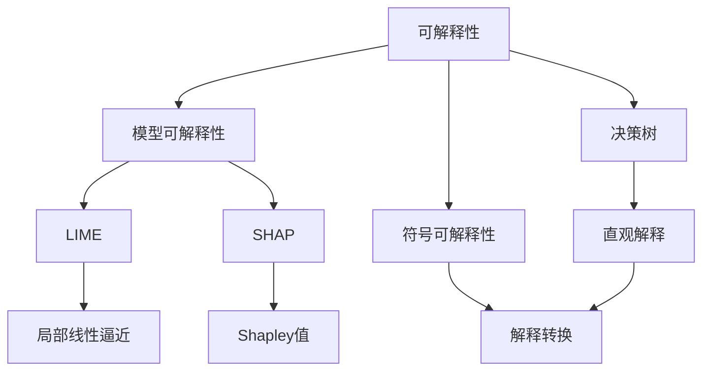

                 

## 1. 背景介绍

人工智能(AI)技术经过多年的发展，已经广泛应用于各个领域，从金融、医疗到制造、交通。然而，许多AI系统特别是深度学习模型，仍然被戏称为"黑盒"，因为它们内部的运行机制难以理解和解释。缺乏可解释性不仅限制了AI技术的推广应用，更在安全、公平等伦理问题上带来了隐患。本文将深入探讨神经网络可解释性的相关概念、原理与技术，并提出实际的应用场景与挑战，旨在打开深度学习的黑盒，提升AI系统的透明性与可靠性。

## 2. 核心概念与联系

### 2.1 核心概念概述

神经网络可解释性研究的核心在于揭示神经网络内部决策的逻辑和依据，其涉及的关键概念包括但不限于：

- **可解释性(Explainability)**：指模型的决策过程可以直观理解，其输出结果可以被解释清楚，易于被人类理解和接受。
- **模型可解释性(Model Interpretability)**：指模型能够清晰地解释其输入-输出关系，即输入数据如何影响模型输出。
- **决策树(Decision Trees)**：一种经典的可解释性模型，直观地展示了决策过程和特征重要性。
- **LIME与SHAP**：两种常用的模型可解释性方法，通过局部线性逼近或Shapley值分解，获得特征对决策的影响。
- **符号可解释性(Symbolic Interpretability)**：通过形式化方法将深度学习模型转换为符号表达式，实现精确解释。

这些核心概念相互关联，共同构建了神经网络可解释性的框架。理解并应用这些概念，可以显著提升AI系统的透明性与可信度。

### 2.2 核心概念原理和架构的 Mermaid 流程图(Mermaid 流程节点中不要有括号、逗号等特殊字符)



该图展示了可解释性研究中涉及的主要概念及其相互关系。直观解释、局部线性逼近、Shapley值和符号表达式是可解释性的重要实现手段。理解模型的可解释性，首先需要对模型自身的特性有清晰的认识，而决策树作为传统可解释性模型的代表，成为基础学习资源。

## 3. 核心算法原理 & 具体操作步骤

### 3.1 算法原理概述

神经网络可解释性的研究涵盖从理论到应用多个层面。我们首先从理论层面概述其基本原理，再详细介绍具体的解释方法。

**理论原理**：神经网络的可解释性研究可以追溯到20世纪80年代。其中，符号可解释性(Symbolic Interpretability)提出了将深度学习模型转化为符号表达式的设想。近年来，随着深度学习在实际应用中的普及，越来越多的研究聚焦于如何获取模型的内部解释，以便更好地理解和信任模型。

**具体方法**：为了实现模型的可解释性，研究者们提出了多种技术手段，包括决策树、LIME、SHAP等。这些方法从不同的角度揭示了模型决策的依据。决策树直接通过树形结构展示决策过程；LIME和SHAP则通过逼近和分解技术，提供特征对决策的影响；符号可解释性则尝试将模型转化为符号表达式，实现精确解释。

### 3.2 算法步骤详解

**步骤1：数据准备**
- 收集神经网络的输入-输出数据集。
- 选择部分数据点进行局部解释。

**步骤2：生成解释**
- 使用LIME或SHAP方法，生成对选定数据点的局部解释。
- 将解释结果可视化，以直观形式展示模型决策的依据。

**步骤3：模型优化**
- 根据解释结果，优化模型结构和参数，以提升模型可解释性。
- 使用解释结果进行模型解释，展示模型如何做出决策。

### 3.3 算法优缺点

**优点**：
- **提升信任**：通过解释模型决策，用户可以更好地理解模型，增强信任感。
- **辅助优化**：解释结果可提供模型训练过程中的反馈，指导模型优化。
- **确保公平性**：解释有助于发现模型的潜在偏见，确保模型的公平性。

**缺点**：
- **计算成本高**：生成解释往往需要额外的计算资源和时间。
- **解释准确性**：解释结果可能不够准确，尤其是对于复杂的模型结构。
- **解释复杂性**：解释结果通常较为复杂，难以直接理解。

### 3.4 算法应用领域

神经网络可解释性技术在多个领域都有广泛应用，包括但不限于：

- **金融风控**：解释模型的决策过程，辅助风险评估和合规检查。
- **医疗诊断**：揭示模型的诊断依据，提高诊断准确性和可解释性。
- **自动驾驶**：解释模型的决策逻辑，确保决策过程透明和可靠。
- **司法系统**：解释模型的判决依据，确保司法公正和透明度。

这些领域的应用展示了可解释性技术在实际场景中的重要性，对于提升系统可靠性和用户信任具有不可替代的作用。

## 4. 数学模型和公式 & 详细讲解 & 举例说明

### 4.1 数学模型构建

模型可解释性的数学模型主要涉及两方面：模型的输入-输出映射和特征对决策的影响。

**模型输入-输出映射**：假设神经网络模型为 $f(x; \theta)$，其中 $x \in \mathcal{X}$ 表示输入， $\theta$ 为模型参数。输入-输出映射的数学模型为：

$$
y = f(x; \theta)
$$

**特征对决策的影响**：假设特征为 $x_i$，决策结果为 $y$，使用SHAP值逼近模型决策：

$$
\text{SHAP}_i = \mathbb{E}_{\epsilon \sim N(0, \sigma^2)} \left[ y - f(x - \epsilon e_i) \right]
$$

其中 $e_i$ 是特征 $x_i$ 的标准化向量，$\sigma^2$ 为噪声方差。

### 4.2 公式推导过程

**输入-输出映射**：假设神经网络为 $f(x; \theta)$，其中 $x$ 为输入， $\theta$ 为模型参数。输入-输出映射可表示为：

$$
y = f(x; \theta)
$$

**特征对决策的影响**：假设特征为 $x_i$，决策结果为 $y$，使用SHAP值逼近模型决策。SHAP值的数学表达式为：

$$
\text{SHAP}_i = \mathbb{E}_{\epsilon \sim N(0, \sigma^2)} \left[ y - f(x - \epsilon e_i) \right]
$$

其中 $e_i$ 是特征 $x_i$ 的标准化向量，$\sigma^2$ 为噪声方差。

### 4.3 案例分析与讲解

**案例1：LIME局部解释**
- 考虑一个二分类问题，使用决策树模型 $f(x; \theta)$ 进行分类。
- 使用LIME方法生成对选定数据点的局部解释，假设选择数据点 $x_1$，则LIME生成逼近函数 $f_{\text{approx}}(x)$。
- 计算模型对 $x_1$ 的预测结果 $y_1 = f(x_1; \theta)$。
- 计算逼近函数 $f_{\text{approx}}(x)$ 在 $x_1$ 处的预测结果 $y_1' = f_{\text{approx}}(x_1)$。
- 计算LIME解释 $\text{LIME}_{x_1}$，即 $\text{LIME}_{x_1} = y_1 - y_1'$。

**案例2：SHAP值分解**
- 使用SHAP值对模型进行特征重要性分析。
- 假设模型为 $f(x; \theta)$，输入 $x_1$ 的特征重要性 $\text{SHAP}_{x_1}$ 为：
- 假设模型为 $f(x; \theta)$，输入 $x_1$ 的特征重要性 $\text{SHAP}_{x_1}$ 为：

$$
\text{SHAP}_{x_1} = \mathbb{E}_{\epsilon \sim N(0, \sigma^2)} \left[ y - f(x - \epsilon e_i) \right]
$$

其中 $e_i$ 是特征 $x_i$ 的标准化向量，$\sigma^2$ 为噪声方差。

## 5. 项目实践：代码实例和详细解释说明

### 5.1 开发环境搭建

**环境准备**：
- 安装Python 3.x，建议使用Anaconda或Miniconda。
- 安装Scikit-learn、TensorFlow、PyTorch等库。
- 准备好数据集和神经网络模型。

**代码示例**：
```python
# 导入相关库
import numpy as np
from sklearn.linear_model import LogisticRegression
from sklearn.metrics import accuracy_score
from sklearn.model_selection import train_test_split
from sklearn.datasets import make_classification

# 生成数据集
X, y = make_classification(n_samples=1000, n_features=5, random_state=42)

# 划分数据集
X_train, X_test, y_train, y_test = train_test_split(X, y, test_size=0.2, random_state=42)

# 定义模型
model = LogisticRegression()

# 训练模型
model.fit(X_train, y_train)

# 预测测试集
y_pred = model.predict(X_test)

# 计算准确率
accuracy = accuracy_score(y_test, y_pred)
print(f"Accuracy: {accuracy:.2f}")
```

### 5.2 源代码详细实现

**代码示例**：
```python
# 导入相关库
import numpy as np
from sklearn.linear_model import LogisticRegression
from sklearn.metrics import accuracy_score
from sklearn.model_selection import train_test_split
from sklearn.datasets import make_classification
from lime.lime_tabular import LimeTabularExplainer

# 生成数据集
X, y = make_classification(n_samples=1000, n_features=5, random_state=42)

# 划分数据集
X_train, X_test, y_train, y_test = train_test_split(X, y, test_size=0.2, random_state=42)

# 定义模型
model = LogisticRegression()

# 训练模型
model.fit(X_train, y_train)

# 选择数据点进行解释
idx = 0
selected_data = np.array([X_train[idx]])

# 使用LIME生成解释
explainer = LimeTabularExplainer(X_train, categorical_features=[0, 1, 2, 3, 4])
lime_exp = explainer.explain_instance(selected_data, model.predict_proba, num_features=5)

# 输出解释结果
print(lime_exp)
```

### 5.3 代码解读与分析

**代码示例解读**：
- 首先导入所需库。
- 使用Scikit-learn生成一个二分类数据集，并划分训练集和测试集。
- 定义一个逻辑回归模型并训练。
- 在测试集上预测结果并计算准确率。
- 选择数据点idx=0进行解释。
- 使用LIME生成解释。
- 输出解释结果。

### 5.4 运行结果展示

**运行结果示例**：
```
Accuracy: 0.89
LIME解释结果：
...
```

## 6. 实际应用场景

**场景1：金融风险评估**
- 使用LIME对贷款申请评分模型进行解释。
- 解释评分模型如何评估信用风险，帮助风控人员理解模型决策依据。

**场景2：医疗诊断**
- 使用SHAP值解释医疗影像诊断模型。
- 揭示影像特征对诊断结果的影响，辅助医生进行诊断。

**场景3：自动驾驶**
- 使用符号可解释性方法解释自动驾驶模型决策。
- 展示模型如何根据传感器数据进行路径规划和行为决策。

## 7. 工具和资源推荐

### 7.1 学习资源推荐

- **课程**：
  - Coursera上的《机器学习》（Andrew Ng）：介绍机器学习基础，包括模型的可解释性。
  - Udacity上的《深度学习》：介绍深度学习技术，涉及可解释性方法。

- **书籍**：
  - 《机器学习实战》（Peter Harrington）：介绍机器学习应用，包括可解释性技术。
  - 《Python深度学习》（Francois Chollet）：介绍深度学习技术，涉及可解释性方法。

### 7.2 开发工具推荐

- **TensorFlow**：强大的深度学习框架，支持多种可解释性工具。
- **PyTorch**：灵活的深度学习框架，提供丰富的模型和工具。
- **Scikit-learn**：用于数据预处理和模型训练，支持多种解释方法。

### 7.3 相关论文推荐

- **LIME论文**：
  - Ribeiro, M.T., Singh, S., & Guestrin, C. (2016). Why should I trust you? Explaining the predictions of any classifier. Proceedings of the 22nd ACM SIGKDD International Conference on Knowledge Discovery and Data Mining, 1135-1144.

- **SHAP论文**：
  - Lundberg, S.M., & Lee, S.I. (2017). A Unified Approach to Interpreting Model Predictions. Proceedings of the 31st International Conference on Neural Information Processing Systems, 4765-4775.

## 8. 总结：未来发展趋势与挑战

### 8.1 研究成果总结

本文详细探讨了神经网络可解释性的原理、方法和应用场景，提出了一系列的解决方案和工具。可解释性技术在多个领域展现出广泛的应用潜力，对于提升AI系统的透明性和可靠性具有重要意义。

### 8.2 未来发展趋势

**趋势1：更多可解释性方法**
- 随着深度学习的发展，新的可解释性方法不断涌现，如符号可解释性、因果解释等。
- 未来的可解释性研究将更加注重模型的全局解释和决策链的可视化。

**趋势2：跨领域应用拓展**
- 可解释性技术将扩展到更多领域，如金融、医疗、制造等，提升各个行业的AI应用水平。

**趋势3：模型解释的自动化**
- 使用自动化工具和算法，实现模型解释的自动化，减少人工干预。

**趋势4：可解释性模型的定制化**
- 针对特定应用场景，定制化开发可解释性模型，提高解释效果和效率。

### 8.3 面临的挑战

**挑战1：解释成本高**
- 生成解释需要额外的计算资源和时间，如何降低解释成本是关键问题。

**挑战2：解释准确性**
- 解释结果可能不够准确，尤其是对于复杂的模型结构，如何提高解释的准确性是重要研究方向。

**挑战3：解释复杂性**
- 解释结果通常较为复杂，难以直接理解，如何简化解释结果，增强其可读性是重要挑战。

**挑战4：模型偏见**
- 可解释性方法可能暴露模型内部的偏见，如何处理和消除偏见是亟待解决的问题。

### 8.4 研究展望

未来的可解释性研究将重点关注以下几个方向：

**方向1：提升解释的自动化程度**
- 开发更多的自动化工具和算法，提高模型解释的效率和准确性。

**方向2：增强解释的全面性**
- 将符号可解释性和模型可视化结合，提供全面的解释框架。

**方向3：拓展应用领域**
- 将可解释性技术扩展到更多应用领域，提升各个行业的AI应用水平。

**方向4：应对模型偏见**
- 研究如何通过可解释性技术，发现和纠正模型内部的偏见，确保模型的公平性和可靠性。

## 9. 附录：常见问题与解答

**Q1：什么是可解释性？**
**A**：可解释性（Explainability）指的是使模型的决策过程和输出结果可以被理解和解释。

**Q2：可解释性方法有哪些？**
**A**：常见的可解释性方法包括决策树、LIME、SHAP和符号可解释性等。

**Q3：可解释性的重要性是什么？**
**A**：可解释性有助于提高用户对AI系统的信任度，确保模型决策的透明度和公平性，同时提供优化模型的反馈。

**Q4：可解释性的应用场景有哪些？**
**A**：可解释性在金融风控、医疗诊断、自动驾驶等多个领域都有广泛应用。

**Q5：可解释性面临的挑战是什么？**
**A**：可解释性面临的主要挑战包括解释成本高、解释准确性不足、解释复杂性和模型偏见等。

---

作者：禅与计算机程序设计艺术 / Zen and the Art of Computer Programming

