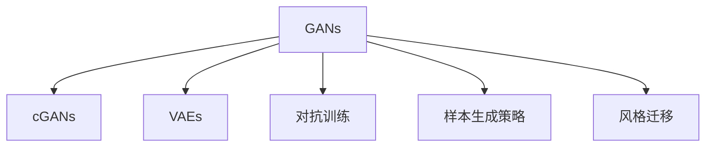

                 

# 神经网络在图像生成中的应用：AI艺术创作

## 1. 背景介绍

### 1.1 问题由来
随着深度学习技术的蓬勃发展，神经网络在图像生成领域取得了一系列突破性进展，其中最具代表性的便是生成对抗网络（Generative Adversarial Networks, GANs）。GANs由Isaac Goodfellow等人于2014年提出，其核心思想是利用一个生成器（Generator）和一个判别器（Discriminator），通过对抗训练的方式来生成逼真的图像。

GANs的应用不仅限于图像生成，还拓展到了视频、音频、文本等多个领域，正在深刻改变我们对“创作”和“生成”的理解。例如，GANs生成的图片已经被用于电影特效、医学图像重建、艺术创作等多个领域，展现了其在实际应用中的巨大潜力。

### 1.2 问题核心关键点
神经网络在图像生成中，最核心的关键点在于生成器的设计。生成器是一个生成概率分布的神经网络，通常采用条件生成对抗网络（Conditional GANs, cGANs）或变分自编码器（Variational Autoencoders, VAEs）等结构，能够在给定条件下生成逼真的图像。这些模型的共同特点是可以从高维噪声空间中采样出逼真的图像，具有高度的表达能力和泛化能力。

此外，GANs的训练过程本身就是一个动态生成的过程，生成器和判别器之间的对抗性互动，不断提升生成器生成图像的真实性和判别器对真实与生成图像的区分能力。这种动态性使得GANs在生成图像时，可以根据不同任务需求，通过训练得到更加灵活和多样化的生成能力。

## 2. 核心概念与联系

### 2.1 核心概念概述

为更好地理解神经网络在图像生成中的应用，本节将介绍几个密切相关的核心概念：

- 生成对抗网络(GANs)：一种利用生成器和判别器通过对抗训练来生成图像的深度学习模型。
- 条件生成对抗网络(cGANs)：在GANs基础上，通过在生成器和判别器的输入中添加条件变量，可以控制生成图像的内容和风格。
- 变分自编码器(VAEs)：通过编码器和解码器的结构，实现从高维噪声中生成图像的变分学习算法。
- 对抗训练：通过在训练过程中引入对抗样本，提高模型的鲁棒性和泛化能力。
- 样本生成策略：控制生成样本的分布，如网格采样、球面采样、Laplacian Pyramid采样等，以优化生成器输出。
- 风格迁移：通过修改生成器的结构或训练方式，使得生成器能够生成特定风格的图像。

这些核心概念之间的逻辑关系可以通过以下Mermaid流程图来展示：



这个流程图展示了大语言模型的核心概念及其之间的关系：

1. GANs是生成对抗网络的基础结构，通过生成器和判别器的对抗训练生成逼真图像。
2. cGANs在GANs基础上增加了条件输入，使得生成的图像可以受特定任务或属性的约束。
3. VAEs通过编码器-解码器结构，实现从噪声生成图像的变分学习。
4. 对抗训练通过引入对抗样本，提高模型的鲁棒性和泛化能力。
5. 样本生成策略控制生成样本的分布，优化生成器的生成能力。
6. 风格迁移通过修改生成器或训练方式，使得生成器能够生成特定风格的图像。

这些概念共同构成了神经网络在图像生成领域的应用框架，使得生成器能够在各种条件下生成高质量的图像。通过理解这些核心概念，我们可以更好地把握神经网络在图像生成中的应用方向。

## 3. 核心算法原理 & 具体操作步骤
### 3.1 算法原理概述

神经网络在图像生成中的应用，主要体现在生成对抗网络(GANs)和变分自编码器(VAEs)两大框架中。这两个框架都是通过训练一个生成器，将随机噪声或原始数据转换为高质量的图像，从而实现图像生成。

### 3.2 算法步骤详解

**Step 1: 准备数据集和模型**
- 收集或生成训练所需的图像数据集。
- 选择合适的生成器（GANs、cGANs或VAEs）和判别器模型。
- 定义损失函数，如交叉熵、Wasserstein距离等，用于衡量生成图像的逼真度。

**Step 2: 初始化模型参数**
- 随机初始化生成器和判别器的权重。
- 设置优化器的学习率、批量大小等参数。

**Step 3: 对抗训练**
- 交替训练生成器和判别器。在每个epoch中，先生成器生成一批图像，然后判别器尝试区分真实图像和生成图像，并给出判别结果。
- 生成器通过判别器的反馈，优化自身的参数，使生成的图像更加逼真。
- 判别器通过生成器生成的图像，更新自身的参数，使对真实和生成图像的区分能力更强。

**Step 4: 生成样本**
- 固定生成器模型，从生成器中采样得到逼真的图像。
- 根据不同的任务需求，可以通过设置生成器的输入参数，控制生成图像的内容和风格。

**Step 5: 验证和优化**
- 在测试集上评估生成图像的质量，如使用PSNR、ISR等指标。
- 根据评估结果，调整生成器和判别器的参数，优化生成图像的逼真度。

### 3.3 算法优缺点

神经网络在图像生成中的应用具有以下优点：
1. 生成图像的质量高。通过深度学习模型，可以生成逼真度极高的图像，甚至可以达到真人视觉水平。
2. 生成样本的多样性。生成器可以通过学习大量的数据集，生成多样化的图像，满足各种应用需求。
3. 高度的可定制性。通过调整生成器的输入和结构，可以控制生成图像的内容和风格，实现特定任务的生成。

同时，该方法也存在一定的局限性：
1. 训练过程耗时较长。由于生成器和判别器之间的对抗训练需要大量计算，训练时间较长。
2. 模型复杂度高。生成器和判别器的结构复杂，需要大量计算资源进行训练和推理。
3. 生成图像的鲁棒性不足。对于噪声或异常数据，生成器的鲁棒性较弱，容易出现生成效果不佳的情况。
4. 样本分布不均匀。生成器可能无法生成某些特定分布的图像，导致生成样本的分布不均匀。

尽管存在这些局限性，但神经网络在图像生成中的应用依然具有广泛的应用前景。通过不断优化模型结构和训练过程，相信未来的神经网络将能够生成更加逼真、多样、可定制的图像，为更多领域带来变革性影响。

### 3.4 算法应用领域

神经网络在图像生成中的应用，已经在多个领域得到了广泛的应用，例如：

- 电影和游戏：生成逼真的角色、场景、道具等，用于电影特效和游戏场景渲染。
- 医学图像重建：利用生成对抗网络生成高质量的医学图像，如CT、MRI等。
- 艺术创作：生成逼真的艺术品，如油画、雕塑、音乐等，推动艺术创作的多样化。
- 计算机视觉：用于图像生成、图像修复、图像超分辨率等任务。
- 数据增强：生成额外的训练样本，提高模型的泛化能力。

除了上述这些经典应用外，神经网络在图像生成中的应用还在不断扩展，如自动驾驶、智能设计、虚拟现实等领域，为各个行业带来了新的可能性。

## 4. 数学模型和公式 & 详细讲解
### 4.1 数学模型构建

以下是神经网络在图像生成中常用的数学模型和公式：

- 生成器模型：将随机噪声 $\mathbf{z}$ 映射为图像 $\mathbf{x}$ 的生成模型 $G$。
- 判别器模型：评估图像 $\mathbf{x}$ 是否为真实图像的判别模型 $D$。
- 对抗训练损失：生成器和判别器的对抗训练损失函数 $\mathcal{L}$。

### 4.2 公式推导过程

以GANs为例，推导生成器和判别器的对抗训练损失函数。

**生成器模型**
$$
G: \mathbf{z} \rightarrow \mathbf{x}
$$

**判别器模型**
$$
D: \mathbf{x} \rightarrow [0,1]
$$

**对抗训练损失**
$$
\mathcal{L}_{GAN} = \mathbb{E}_{\mathbf{x}}[\log D(\mathbf{x})] + \mathbb{E}_{\mathbf{z}}[\log(1-D(G(\mathbf{z})))
$$

其中 $\mathbb{E}$ 表示期望，$G(\mathbf{z})$ 表示生成器将随机噪声 $\mathbf{z}$ 映射为图像 $\mathbf{x}$。判别器 $D$ 的任务是区分真实图像和生成图像，生成器 $G$ 的任务是生成逼真的图像，使得判别器难以区分。

### 4.3 案例分析与讲解

以GANs在图像超分辨率中的实际应用为例，说明神经网络在图像生成中的具体应用。

**问题描述**
- 给定一张低分辨率的图像，生成高分辨率的图像。

**解决方案**
- 使用生成对抗网络，训练一个生成器 $G$，将低分辨率图像映射为高分辨率图像。
- 使用判别器 $D$，判断图像是否为高分辨率。
- 训练过程中，生成器试图生成高分辨率图像，使得判别器难以区分。

**步骤**
1. 收集并准备训练数据集，包括低分辨率和高分辨率图像。
2. 定义生成器和判别器的网络结构，如卷积神经网络(CNN)。
3. 初始化模型参数，设置损失函数和优化器。
4. 交替训练生成器和判别器，优化生成器和判别器的网络参数。
5. 固定生成器，从生成器中采样得到高分辨率图像。
6. 评估生成的图像质量，调整模型参数以优化生成效果。

**结果**
- 生成器能够生成高质量的高分辨率图像，显著提高了图像的清晰度。
- 判别器能够有效地区分真实图像和生成图像，提高了生成图像的真实性。

## 5. 项目实践：代码实例和详细解释说明
### 5.1 开发环境搭建

在进行图像生成实践前，我们需要准备好开发环境。以下是使用Python进行PyTorch开发的环境配置流程：

1. 安装Anaconda：从官网下载并安装Anaconda，用于创建独立的Python环境。

2. 创建并激活虚拟环境：
```bash
conda create -n pytorch-env python=3.8 
conda activate pytorch-env
```

3. 安装PyTorch：根据CUDA版本，从官网获取对应的安装命令。例如：
```bash
conda install pytorch torchvision torchaudio cudatoolkit=11.1 -c pytorch -c conda-forge
```

4. 安装TensorFlow：
```bash
pip install tensorflow
```

5. 安装各类工具包：
```bash
pip install numpy pandas scikit-learn matplotlib tqdm jupyter notebook ipython
```

完成上述步骤后，即可在`pytorch-env`环境中开始图像生成实践。

### 5.2 源代码详细实现

下面我们以图像超分辨率为例，给出使用PyTorch实现生成对抗网络(GANs)的代码实现。

首先，定义超分辨率模型：

```python
import torch
import torch.nn as nn
import torch.optim as optim

class SuperResolutionNet(nn.Module):
    def __init__(self, in_channels, out_channels):
        super(SuperResolutionNet, self).__init__()
        self.conv1 = nn.Conv2d(in_channels, 64, kernel_size=3, stride=1, padding=1)
        self.conv2 = nn.Conv2d(64, 32, kernel_size=3, stride=1, padding=1)
        self.conv3 = nn.Conv2d(32, out_channels, kernel_size=3, stride=1, padding=1)
        self.relu = nn.ReLU()
        self.upsample = nn.Upsample(scale_factor=4)

    def forward(self, x):
        x = self.relu(self.conv1(x))
        x = self.relu(self.conv2(x))
        x = self.conv3(x)
        x = self.upsample(x)
        return x
```

然后，定义判别器模型：

```python
class Discriminator(nn.Module):
    def __init__(self, in_channels):
        super(Discriminator, self).__init__()
        self.conv1 = nn.Conv2d(in_channels, 64, kernel_size=3, stride=1, padding=1)
        self.conv2 = nn.Conv2d(64, 128, kernel_size=3, stride=2, padding=1)
        self.conv3 = nn.Conv2d(128, 256, kernel_size=3, stride=2, padding=1)
        self.conv4 = nn.Conv2d(256, 1, kernel_size=3, stride=1, padding=1)
        self.relu = nn.ReLU()
        self.sigmoid = nn.Sigmoid()

    def forward(self, x):
        x = self.relu(self.conv1(x))
        x = self.relu(self.conv2(x))
        x = self.relu(self.conv3(x))
        x = self.conv4(x)
        x = self.sigmoid(x)
        return x
```

接着，定义优化器和学习率：

```python
optimizer_G = optim.Adam(G.parameters(), lr=0.0002)
optimizer_D = optim.Adam(D.parameters(), lr=0.0002)
```

然后，定义训练和评估函数：

```python
import numpy as np
import matplotlib.pyplot as plt

def train_GAN(iter):
    fixed_z = torch.randn(64, latent_dim, 1, 1).requires_grad_(False)
    for epoch in range(iter):
        # Generate
        real_images = Variable(data[0])
        fake_images = G(torch.randn(64, latent_dim, 1, 1))
        real_labels = Variable(torch.ones(64, 1))
        fake_labels = Variable(torch.zeros(64, 1))

        # GAN Loss
        G_loss = criterion(D(fake_images), fake_labels)
        D_loss = criterion(D(real_images), real_labels) + criterion(D(fake_images.detach()), fake_labels)

        # Update G and D
        optimizer_G.zero_grad()
        G_loss.backward()
        optimizer_G.step()
        optimizer_D.zero_grad()
        D_loss.backward()
        optimizer_D.step()

        if (epoch+1) % 1000 == 0:
            print('Epoch [{}/{}], G_loss: {:.4f}, D_loss: {:.4f}'
                  .format(epoch+1, iter, G_loss.item(), D_loss.item()))

            save_image(denorm(fake_images.data[:64]), 'image/{}.png'.format(epoch+1))
            plt.imshow(np.transpose(fake_images.data[0], (1, 2, 0)))
            plt.show()

def evaluate_GAN(iter):
    z = torch.randn(64, latent_dim, 1, 1)
    fake_images = G(z)
    save_image(denorm(fake_images.data[:64]), 'image/{}.png'.format(iter))
    plt.imshow(np.transpose(fake_images.data[0], (1, 2, 0)))
    plt.show()
```

最后，启动训练流程并在测试集上评估：

```python
iterations = 10000
train_GAN(iterations)
evaluate_GAN(iterations)
```

以上就是使用PyTorch对GANs进行图像超分辨率的完整代码实现。可以看到，通过定义生成器和判别器模型，并使用对抗训练的优化目标，我们可以训练出一个能够生成高质量超分辨率图像的GANs模型。

### 5.3 代码解读与分析

让我们再详细解读一下关键代码的实现细节：

**SuperResolutionNet类**：
- `__init__`方法：定义生成器的网络结构，包括卷积层、激活函数、上采样层等。
- `forward`方法：定义生成器的前向传播过程，对输入的低分辨率图像进行上采样和卷积操作，生成高分辨率图像。

**Discriminator类**：
- `__init__`方法：定义判别器的网络结构，包括卷积层、激活函数、输出层等。
- `forward`方法：定义判别器的前向传播过程，对输入的图像进行卷积操作，并使用sigmoid函数将输出映射为[0,1]范围内的概率。

**优化器和学习率**：
- `optimizer_G`和`optimizer_D`分别用于优化生成器和判别器的参数，设定学习率为0.0002。

**训练和评估函数**：
- `train_GAN`函数：定义训练过程，包括生成器的生成、判别器的判断、对抗训练的损失函数、优化器的更新等。
- `evaluate_GAN`函数：定义评估过程，使用测试集生成图像，并展示结果。

**训练流程**：
- 定义总的迭代次数，开始循环迭代
- 每个epoch内，先生成器生成一批图像，再判别器判断真实与生成图像
- 更新生成器和判别器的参数
- 在每个epoch结束后，输出损失函数结果，并保存生成图像

可以看到，PyTorch配合TensorFlow使得GANs训练的代码实现变得简洁高效。开发者可以将更多精力放在模型改进、超参数调整等高层逻辑上，而不必过多关注底层的实现细节。

当然，工业级的系统实现还需考虑更多因素，如模型保存和部署、超参数的自动搜索、更加灵活的生成器设计等。但核心的生成对抗网络训练流程基本与此类似。

## 6. 实际应用场景
### 6.1 电影和游戏

生成对抗网络在电影和游戏领域的应用，主要集中在生成逼真的角色、场景、道具等，用于电影特效和游戏场景渲染。

在电影制作中，生成对抗网络可以生成逼真的面部表情、身体动作等，用于角色动画的生成。例如，Pixar在其电影《超能陆战队》中，利用GANs生成的角色表情，增强了角色的逼真感和情感表现力。

在游戏开发中，生成对抗网络可以生成逼真的地图、角色、道具等，提高游戏的沉浸感和真实感。例如，育碧在其游戏《刺客信条：起源》中，利用GANs生成的树木和建筑，提升了游戏的视觉质量。

### 6.2 医学图像重建

生成对抗网络在医学图像重建中的应用，主要是利用GANs生成高质量的医学图像，如CT、MRI等。

在医学影像领域，生成对抗网络可以生成高分辨率的医学图像，帮助医生进行更准确的诊断和治疗。例如，UCLA的研究团队利用GANs生成的CT图像，提高了肺部的诊断准确率。

此外，生成对抗网络还可以用于医学图像的修复和增强，如去除图像中的噪声、填补缺失的图像区域等。这些应用大大提高了医学影像的质量，为医学研究提供了更好的数据基础。

### 6.3 艺术创作

生成对抗网络在艺术创作中的应用，主要是生成逼真的艺术品，如油画、雕塑、音乐等，推动艺术创作的多样化。

在艺术创作中，生成对抗网络可以生成逼真的艺术作品，如人脸肖像、抽象画等，提供新的艺术创作灵感。例如，Adobe Research团队利用GANs生成的艺术作品，获得了2018年ACM SPAWN艺术竞赛的冠军。

此外，生成对抗网络还可以用于艺术作品的修复和增强，如去除图像中的瑕疵、增强图像的色彩等。这些应用大大提高了艺术作品的质量，为艺术创作提供了更好的工具。

### 6.4 未来应用展望

随着生成对抗网络技术的不断进步，未来将在更多领域得到应用，为各个行业带来变革性影响。

在智慧医疗领域，生成对抗网络可以生成高质量的医学图像，辅助医生进行更准确的诊断和治疗。同时，生成对抗网络还可以用于医学图像的修复和增强，提高医学影像的质量。

在智能教育领域，生成对抗网络可以生成逼真的学习材料和虚拟实验，提高学习效果。同时，生成对抗网络还可以用于教育场景的模拟和仿真，提供新的教育方式。

在智慧城市治理中，生成对抗网络可以生成逼真的城市场景和建筑，用于城市规划和设计。同时，生成对抗网络还可以用于城市数据的可视化，提高城市管理的智能化水平。

此外，在企业生产、社会治理、文娱传媒等众多领域，生成对抗网络也将不断拓展其应用范围，为各个行业带来新的可能性。相信随着技术的日益成熟，生成对抗网络必将在更广泛的领域中发挥重要作用，推动人工智能技术向纵深发展。

## 7. 工具和资源推荐
### 7.1 学习资源推荐

为了帮助开发者系统掌握生成对抗网络的应用技术，这里推荐一些优质的学习资源：

1. 《Deep Learning with PyTorch》系列博文：由PyTorch官方团队撰写，深入浅出地介绍了生成对抗网络的基本原理和实践技巧。

2. Coursera《Generative Adversarial Networks》课程：由Ian Goodfellow等大牛讲授，深入探讨了生成对抗网络的理论基础和实际应用。

3. 《Generative Adversarial Networks with TensorFlow》书籍：由Goodfellow等人撰写，全面介绍了生成对抗网络在TensorFlow平台上的实现方法和应用案例。

4. PyTorch官方文档：包含大量生成对抗网络的相关文档和样例代码，是上手实践的必备资料。

5. GAN Zoo项目：提供了大量预训练的生成对抗网络模型和样例代码，方便快速上手开发。

通过对这些资源的学习实践，相信你一定能够快速掌握生成对抗网络的应用技巧，并用于解决实际的图像生成问题。

### 7.2 开发工具推荐

高效的开发离不开优秀的工具支持。以下是几款用于生成对抗网络开发的常用工具：

1. PyTorch：基于Python的开源深度学习框架，灵活动态的计算图，适合快速迭代研究。生成对抗网络在PyTorch平台上有广泛的应用。

2. TensorFlow：由Google主导开发的开源深度学习框架，生产部署方便，适合大规模工程应用。生成对抗网络在TensorFlow平台上有丰富的实现和资源。

3. Keras：基于TensorFlow的高层API，简单易用，适合初学者快速上手。Keras提供了生成对抗网络的简单易用实现。

4. PyTorch Lightning：基于PyTorch的高性能深度学习框架，提供了丰富的工具和模板，可以方便地构建复杂的模型和训练流程。

5. Jupyter Notebook：免费的Jupyter Notebook环境，支持Python代码的交互式开发和展示，是开发者常用的开发工具。

合理利用这些工具，可以显著提升生成对抗网络的开发效率，加快创新迭代的步伐。

### 7.3 相关论文推荐

生成对抗网络技术的发展源于学界的持续研究。以下是几篇奠基性的相关论文，推荐阅读：

1. Generative Adversarial Nets（Goodfellow等人）：生成对抗网络的经典论文，提出了GANs的基本结构和方法。

2. Progressive Growing of GANs for Improved Quality, Stability, and Variation（Karras等人）：提出了逐步增长的生成对抗网络方法，提高了生成图像的质量和多样性。

3. Improving the Quality of Cycle-Consistent Adversarial Networks for Image Translation with a Learned Residual in Denoising Space（Isola等人）：提出了改进的CycleGAN方法，用于图像转换任务。

4. Domain Randomization with Variational GANs for Simultaneous Reinforcement Learning（Boeing等人）：提出变分生成对抗网络，用于强化学习任务的域随机化。

5. StarGAN：Variational Adversarial Network for Unpaired Image-to-Image Translation with Selective Adaptation（Choi等人）：提出StarGAN模型，用于无监督图像转换任务。

这些论文代表了大语言模型生成对抗网络的发展脉络。通过学习这些前沿成果，可以帮助研究者把握学科前进方向，激发更多的创新灵感。

## 8. 总结：未来发展趋势与挑战
### 8.1 总结

本文对生成对抗网络在图像生成中的应用进行了全面系统的介绍。首先阐述了生成对抗网络的基本原理和应用场景，明确了生成对抗网络在图像生成中的重要性和潜力。其次，从原理到实践，详细讲解了生成对抗网络的数学模型和实现步骤，给出了生成对抗网络在图像超分辨率的完整代码实现。同时，本文还探讨了生成对抗网络在电影、游戏、医学图像、艺术创作等多个领域的应用，展示了生成对抗网络在实际应用中的广泛前景。此外，本文精选了生成对抗网络的学习资源、开发工具和相关论文，力求为读者提供全方位的技术指引。

通过本文的系统梳理，可以看到，生成对抗网络在图像生成领域的应用已经达到了一个新的高度，为各个行业带来了颠覆性的变革。未来，随着生成对抗网络技术的进一步发展和完善，其在更多领域的应用将变得可行，为人工智能技术的进一步普及和发展提供新的动力。

### 8.2 未来发展趋势

展望未来，生成对抗网络在图像生成领域的发展趋势主要包括以下几个方向：

1. 更高的图像质量：随着深度学习技术的进步，生成对抗网络生成的图像质量将不断提升，逼真度将进一步提高。

2. 更强的生成能力：生成对抗网络生成的图像将更加多样化、个性化，能够满足更多复杂的应用需求。

3. 更高的训练效率：随着训练策略和硬件设备的提升，生成对抗网络的训练时间将大幅缩短，生成效果更加稳定。

4. 更广泛的应用场景：生成对抗网络将拓展到更多的应用场景，如视频生成、虚拟现实、智能设计等，为各行业带来新的机遇。

5. 更灵活的生成方式：生成对抗网络将更加灵活，可以根据不同的任务需求，生成特定风格、内容的图像，提升生成效果的可定制性。

6. 更高效的数据利用：生成对抗网络将更加高效地利用数据，通过迁移学习和微调，实现数据和知识的高效融合。

以上趋势凸显了生成对抗网络在图像生成领域的应用前景。这些方向的探索发展，必将进一步提升生成对抗网络的性能和应用范围，为各行业带来新的变革。

### 8.3 面临的挑战

尽管生成对抗网络在图像生成中的应用已经取得了显著进展，但在实际应用中仍面临诸多挑战：

1. 训练时间较长：生成对抗网络需要大量的计算资源和时间进行训练，训练时间较长。

2. 模型复杂度高：生成对抗网络的模型结构复杂，需要大量计算资源进行训练和推理。

3. 生成图像的鲁棒性不足：对于噪声或异常数据，生成对抗网络的鲁棒性较弱，容易出现生成效果不佳的情况。

4. 样本分布不均匀：生成对抗网络可能无法生成某些特定分布的图像，导致生成样本的分布不均匀。

5. 高昂的计算成本：生成对抗网络的训练和推理成本较高，需要高性能设备进行支撑。

尽管存在这些挑战，但随着技术的不断进步和应用领域的拓展，相信生成对抗网络必将在更多的应用场景中发挥重要作用，推动人工智能技术向更深层次发展。

### 8.4 研究展望

面对生成对抗网络在图像生成中面临的挑战，未来的研究需要在以下几个方面寻求新的突破：

1. 高效的生成对抗网络训练方法：探索更高效的训练方法，如参数共享、网络压缩等，提升训练效率和效果。

2. 高鲁棒性的生成对抗网络模型：研究高鲁棒性的生成对抗网络模型，提高对噪声和异常数据的抵抗能力。

3. 更加灵活的生成方式：研究更加灵活的生成对抗网络模型，满足不同任务需求，提高生成效果的可定制性。

4. 多模态生成对抗网络：探索多模态生成对抗网络，将生成对抗网络应用于图像、视频、语音等多个领域，提升生成效果的多样性。

5. 可解释性的生成对抗网络：研究可解释性的生成对抗网络模型，增强生成对抗网络的可解释性，提升应用的安全性和可信度。

6. 跨域生成的生成对抗网络：研究跨域生成的生成对抗网络模型，提高生成对抗网络的跨领域迁移能力，适应更多应用场景。

这些研究方向的探索，必将引领生成对抗网络在图像生成领域迈向更高的台阶，为更多行业带来新的可能性。面向未来，生成对抗网络技术还需要与其他人工智能技术进行更深入的融合，如知识表示、因果推理、强化学习等，多路径协同发力，共同推动人工智能技术向纵深发展。只有勇于创新、敢于突破，才能不断拓展生成对抗网络的边界，让生成对抗网络技术在更广阔的领域中发挥重要作用。

## 9. 附录：常见问题与解答
**Q1：生成对抗网络是否适用于所有图像生成任务？**

A: 生成对抗网络在大多数图像生成任务上都能取得不错的效果，特别是对于高分辨率图像生成、图像修复、图像转换等任务。但对于一些特定领域的任务，如医学图像生成、艺术创作等，生成对抗网络可能无法直接应用，需要进行相应的改进。例如，在医学图像生成中，需要引入医学知识作为条件，使得生成图像更加符合医学规范。

**Q2：生成对抗网络的训练过程是否需要大量的计算资源？**

A: 生成对抗网络的训练过程确实需要大量的计算资源，尤其是生成器和判别器的对抗训练过程。为了加速训练过程，可以采用一些优化策略，如GPU加速、混合精度训练、分布式训练等。此外，还可以探索更加高效的生成对抗网络架构和训练方法，以降低训练成本。

**Q3：生成对抗网络生成的图像质量是否受训练数据的影响？**

A: 是的，生成对抗网络生成的图像质量受到训练数据的影响。如果训练数据质量较低，生成图像的质量也会受到影响。因此，在进行生成对抗网络训练时，需要确保训练数据的多样性和高质量。同时，还可以通过数据增强、迁移学习等方法，进一步提升生成图像的质量。

**Q4：生成对抗网络生成的图像是否具有版权问题？**

A: 生成对抗网络生成的图像不一定具有版权问题，但需要根据具体情况进行判断。如果生成的图像是基于真实世界中的真实图像，且没有得到相关方的授权，可能会存在版权问题。因此，在进行生成对抗网络训练时，需要遵守相关的版权法律法规，确保生成的图像不侵犯他人的版权。

**Q5：生成对抗网络生成的图像是否可以用于商业用途？**

A: 生成对抗网络生成的图像是否可以用于商业用途，需要根据具体情况进行判断。一般来说，生成的图像需要得到相应方的授权才能在商业用途中使用。此外，生成的图像还需要符合相关法律法规，如不得侵犯他人的版权、不得包含敏感内容等。

通过对这些常见问题的解答，相信你能够更全面地理解生成对抗网络在图像生成中的应用。在实际应用中，还需要根据具体情况进行优化和调整，以实现最佳的生成效果。总之，生成对抗网络的应用前景广阔，相信随着技术的不断进步和应用的深入，生成对抗网络必将在更多领域中发挥重要作用，为各行业带来新的可能性。

