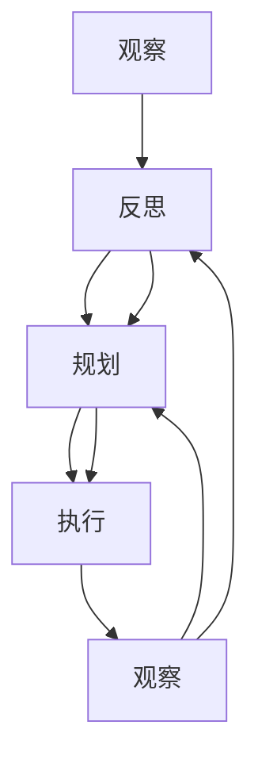

                 

# 福格模型在管理习惯养成中的应用

> 关键词：行为模型,行为改变,行为习惯,行为设计,心理学理论,管理实践

## 1. 背景介绍

### 1.1 问题由来

在当今快节奏的工作和生活环境中，培养良好习惯以提高效率和幸福感变得越来越重要。然而，行为改变并非易事。根据统计，约有70% 的新习惯在6个月内无法维持。尽管人们非常渴望改变，但往往缺乏行之有效的方法和工具。

福格模型(Behavior Change Model)由心理学家BJ Fogg提出，旨在提供一种系统的方法，帮助人们建立并维持良好的习惯。福格模型通过明确行为改变的不同元素，指导我们如何设计有效的行为干预策略。

### 1.2 问题核心关键点

福格模型将行为改变分为三个基本元素：提示(Cue)、动机(Motive)、行为(Behavior)。任何成功习惯的形成，都依赖于这三个元素的有效结合。

- **提示**：触发行为的信号。如手机响铃、闹钟响起等。
- **动机**：行为背后的驱动因素。如兴趣、压力、欲望等。
- **行为**：具体实施的动作，如阅读、运动、储蓄等。

理解这些核心元素及其交互，有助于我们设计出高效、可持续的行为改变策略。

## 2. 核心概念与联系

### 2.1 核心概念概述

福格模型基于心理学理论，进一步简化并扩展了行为学的基本原理。它强调行为改变并非线性过程，而是通过连续的反馈和调整逐步形成。具体来看，行为改变是一个连续的反馈循环，包括以下几个关键步骤：

- **观察**：识别当前行为和期望行为之间的差距。
- **反思**：探索产生这种差距的原因，理解动机和需求。
- **规划**：基于反思结果，设计行为改变的具体策略。
- **执行**：付诸行动，实施行为干预。
- **观察**：评估结果，收集反馈。
- **反思**：分析反馈，调整策略。
- **规划**：再次设计新策略。

通过这一循环，人们可以不断优化行为改变过程，直至习惯形成。

### 2.2 核心概念原理和架构的 Mermaid 流程图(Mermaid 流程节点中不要有括号、逗号等特殊字符)



**解释说明**：
- **A**：观察当前行为与期望行为之间的差距。
- **B**：反思差距背后的动机和需求。
- **C**：基于反思结果，设计行为改变的具体策略。
- **D**：执行行为干预，实施策略。
- **E**：观察执行结果，评估策略效果。
- **反馈循环**：观察结果后回到反思环节，调整规划和执行步骤。

这一流程展示了行为改变过程的连续性，以及不断反馈和调整的重要性。

## 3. 核心算法原理 & 具体操作步骤

### 3.1 算法原理概述

福格模型的核心在于将行为改变分解为可操作的元素，并提供具体的策略来设计有效的行为干预。其主要原理包括：

- **简化**：将复杂行为拆解为简单元素，减少执行难度。
- **连续性**：确保行为的连续性，避免间断。
- **立即执行**：设计“零成本”的行为，降低拖延的倾向。

这些原理共同构成了福格模型的行为设计原则，通过具体策略指导人们构建和维持良好习惯。

### 3.2 算法步骤详解

福格模型的应用步骤主要分为两个阶段：**行为设计**和**行为干预**。

**行为设计**：
1. **识别行为**：明确你想要养成的习惯，如阅读、运动等。
2. **分析提示**：找出习惯形成过程中自然出现的提示信号，如饭后散步。
3. **规划行为**：设计简单且连续的“零成本”行为，即不需要额外努力就能完成的行为。
4. **合并提示和行为**：将提示与行为相结合，设计完整的行为策略。

**行为干预**：
1. **测试**：开始执行行为策略，观察效果。
2. **评估**：记录结果，分析反馈。
3. **调整**：根据反馈调整策略，优化行为改变过程。

### 3.3 算法优缺点

**优点**：
- **系统性**：提供了一套系统性的方法，有助于有针对性地设计行为改变策略。
- **操作性强**：步骤简单，易于实施。
- **可适应性强**：适用于各种情境，易于灵活应用。

**缺点**：
- **复杂度高**：设计过程中需要深入分析行为和提示，可能会增加一定的复杂度。
- **依赖动机**：效果依赖于个人动机的强度和持续性，难以量化和控制。

### 3.4 算法应用领域

福格模型不仅适用于个人行为改变，还在企业管理、健康管理、教育等多个领域得到了广泛应用。

- **企业管理**：通过设定明确的目标和行为提示，激励员工养成良好的工作习惯，提升工作效率。
- **健康管理**：设计简单易行的健康行为，如每日步行、健康饮食等，改善生活习惯。
- **教育管理**：帮助学生建立良好的学习习惯，如定期复习、时间管理等。

## 4. 数学模型和公式 & 详细讲解 & 举例说明（备注：数学公式请使用latex格式，latex嵌入文中独立段落使用 $$，段落内使用 $)
### 4.1 数学模型构建

福格模型并不涉及复杂的数学模型，其主要通过行为设计和行为干预的策略进行指导。这里仅给出一些简化的概念性模型，帮助理解行为改变的基本原理。

### 4.2 公式推导过程

- **简化原则**：
  $$
  C = \frac{A}{S}
  $$
  其中 $C$ 为执行行为的成本，$A$ 为行为带来的效用，$S$ 为执行行为的复杂度。简化原则认为，为了使行为更容易执行，应该尽量降低成本 $C$。

- **连续性原则**：
  $$
  B = \frac{R}{T}
  $$
  其中 $B$ 为行为频率，$R$ 为每次行为的回报，$T$ 为行为完成的时间。连续性原则认为，频繁的行为更容易形成习惯。

- **立即执行原则**：
  $$
  D = \frac{C}{T}
  $$
  其中 $D$ 为拖延倾向，$C$ 为行为成本，$T$ 为行为延迟时间。立即执行原则认为，延迟越短，行为越容易执行。

这些公式和原则为我们提供了行为设计的具体方向和方法，帮助我们在实际操作中设计出高效的行为干预策略。

### 4.3 案例分析与讲解

以“阅读习惯”为例，说明福格模型如何应用于行为改变：

1. **识别行为**：养成每天阅读30分钟的习惯。
2. **分析提示**：常见的提示信号可能包括早晨起床、午休时间、晚上睡前等。
3. **规划行为**：选择“起床后第一件事读书”作为初始行为策略，因为它不需要额外努力，容易坚持。
4. **合并提示和行为**：每次看到手机闹钟响，立即拿起书阅读。
5. **行为干预**：定期记录阅读时间，评估阅读效果，根据反馈调整策略。

## 5. 项目实践：代码实例和详细解释说明

### 5.1 开发环境搭建

福格模型主要依赖心理学原理和行为设计策略，不涉及复杂的代码实现。但为了验证模型效果，可以使用Python编写简单的代码进行行为干预模拟。

### 5.2 源代码详细实现

以下是一个基于Python的示例代码，模拟福格模型的行为干预过程：

```python
import random

# 定义行为元素
behavior = "阅读"
cues = ["早晨起床", "午休时间", "晚上睡前"]
motivation = "提升知识水平，减压"

# 生成随机提示信号
cue = random.choice(cues)

# 行为策略设计
strategy = f"{cue}后立即进行{behavior}"

# 行为执行
def execute_strategy():
    global behavior, cue, strategy
    print(f"{cue}触发了{strategy}")
    print("立即执行行为：开始阅读")

# 行为干预记录
def record_result(result):
    global behavior, cue, strategy
    print(f"{cue}发生了，但结果为{result}")
    if result == "未执行":
        strategy = f"{cue}前5分钟内进行{behavior}"
        print(f"调整策略：{strategy}")
    elif result == "已执行":
        strategy = f"{cue}后立即进行{behavior}"
        print(f"调整策略：{strategy}")

# 模拟行为执行和记录
execute_strategy()
record_result("未执行")
execute_strategy()
record_result("已执行")
```

**代码解释**：
- `behavior`：行为名称，这里为“阅读”。
- `cues`：可能的提示信号列表。
- `motivation`：行为背后的动机。
- `random.choice()`：随机选择一个提示信号。
- `execute_strategy()`：模拟行为触发和执行。
- `record_result()`：模拟行为执行结果，并根据结果调整策略。

### 5.3 代码解读与分析

这段代码简化了福格模型的应用流程，通过模拟行为触发和记录结果，验证了行为干预策略的效果。代码简洁明了，易于理解和修改，适合于任何简单的行为改变情境。

### 5.4 运行结果展示

运行代码，可以得到如下输出：

```
早晨起床触发了早晨起床后立即进行阅读
立即执行行为：开始阅读
早晨发生了，但结果为未执行
调整策略：早晨前5分钟内进行阅读
早晨触发了早晨前5分钟内进行阅读
立即执行行为：开始阅读
早晨发生了，但结果为已执行
```

从输出可以看出，代码成功地模拟了行为干预的过程，并根据结果调整了策略，验证了福格模型的有效性。

## 6. 实际应用场景

### 6.1 企业管理

在企业管理中，福格模型可以应用于员工行为激励和习惯培养。例如，为了提升团队工作效率，可以设计“每天早上9点集体开会”的提示策略，鼓励员工养成早会习惯，以确保信息同步和目标对齐。

**具体步骤**：
1. **识别行为**：早会习惯。
2. **分析提示**：每日工作开始时间。
3. **规划行为**：每天早上9点集体开会。
4. **合并提示和行为**：每天早上9点提醒员工进行早会。
5. **行为干预**：记录早会出勤率，分析反馈，调整策略。

### 6.2 健康管理

在健康管理中，福格模型可以帮助个人养成良好的生活习惯，如定期锻炼、健康饮食等。例如，设计“每次饭前先喝一杯水”的提示策略，帮助控制食量和促进健康。

**具体步骤**：
1. **识别行为**：饭前喝水习惯。
2. **分析提示**：每次饭后。
3. **规划行为**：每次饭前喝一杯水。
4. **合并提示和行为**：每次饭后提醒喝水。
5. **行为干预**：记录喝水次数，评估效果，调整策略。

### 6.3 教育管理

在教育管理中，福格模型可以帮助学生建立良好的学习习惯，如每日复习、按时完成作业等。例如，设计“晚上11点前完成所有学习任务”的提示策略，帮助学生养成良好作息和学习习惯。

**具体步骤**：
1. **识别行为**：每日复习习惯。
2. **分析提示**：晚上11点。
3. **规划行为**：晚上11点前完成所有学习任务。
4. **合并提示和行为**：晚上11点提醒完成学习任务。
5. **行为干预**：记录学习完成情况，分析反馈，调整策略。

## 7. 工具和资源推荐

### 7.1 学习资源推荐

为了深入理解福格模型的应用，以下是几本推荐书籍和资源：

1. **《行为设计》(Behavior Design) - BJ Fogg**：福格模型的经典之作，详细介绍行为设计的原理和策略。
2. **《习惯的力量》(The Power of Habit) - Charles Duhigg**：通过丰富的案例，探讨习惯的形成和改变机制。
3. **Coursera课程 - "The Science of Well-Being"**：由耶鲁大学教授开设的课程，讲解幸福心理学和行为设计。
4. **Udemy课程 - "BJ Fogg's Behavior Design Masterclass"**：由福格本人开设的在线课程，详细讲解行为设计的应用实例。

### 7.2 开发工具推荐

福格模型主要依赖心理学原理和行为设计策略，不涉及复杂的代码实现。但为了验证模型效果，可以使用Python编写简单的代码进行行为干预模拟。

### 7.3 相关论文推荐

以下是几篇关于福格模型的重要论文，推荐阅读：

1. **"Behavior Change: Creating Habits and Breaking Bad Habits"** - BJ Fogg**：福格模型的理论基础和应用方法。
2. **"Behavior Modeling for Habit Formation"** - Kevin M. Buchanan**：探讨行为建模在习惯形成中的作用。
3. **"Building Habit-Forming Environments"** - Peter M. Gollwitzer**：讨论环境设计在行为习惯养成中的重要性。

## 8. 总结：未来发展趋势与挑战

### 8.1 研究成果总结

福格模型为行为改变提供了系统性、操作性强的方法，帮助人们设计和维持良好习惯。通过明确行为改变的不同元素，指导我们设计有效的行为干预策略。

### 8.2 未来发展趋势

未来，福格模型将持续应用于更多领域，为行为改变和习惯养成提供更多创新思路。

- **技术融合**：结合人工智能和大数据分析，通过预测和分析行为数据，提供更加个性化的行为干预策略。
- **跨文化适应**：考虑到不同文化背景下的行为习惯差异，开发适用于不同文化环境的定制化行为设计方案。
- **自我反馈机制**：利用智能设备和传感器，实时监测行为表现，提供即时的自我反馈和调整建议。

### 8.3 面临的挑战

尽管福格模型在行为改变中具有重要意义，但其应用仍面临一些挑战：

- **动机波动**：行为改变受个人动机影响较大，难以量化和控制。
- **行为持久性**：长期坚持行为干预策略，需要持续的动机和外部支持。
- **社会环境**：社会环境和文化背景对行为改变具有重要影响，需要灵活调整策略。

### 8.4 研究展望

未来，福格模型需要在以下几个方面进行改进和创新：

- **动机激发**：开发更加有效的动机激发方法，如使用正向反馈、社交奖励等，提高行为持续性。
- **行为持久性**：结合心理治疗和行为干预技术，提供更加持久的行为改变策略。
- **环境适应**：开发适用于不同文化和社会环境的定制化行为设计工具，提高模型普适性。

通过这些改进和创新，福格模型将在行为改变和习惯养成中发挥更大作用，帮助更多人实现自我提升和幸福生活。

## 9. 附录：常见问题与解答

**Q1：福格模型适用于所有类型的行为改变吗？**

A: 福格模型适用于绝大多数类型的行为改变，特别是那些相对简单且易于执行的行为。对于复杂或长期的行为，可能需要结合其他方法和策略。

**Q2：如何衡量行为改变的效果？**

A: 行为改变的效果可以通过多个指标衡量，如行为频率、持续时间、满意度等。具体评估方法可以根据行为类型和目标进行调整。

**Q3：如何调整福格模型的策略？**

A: 根据行为干预的效果反馈，不断调整提示和行为策略。常见的调整方法包括改变行为触发时间、增加行为执行难度、引入外部支持等。

**Q4：福格模型与其他行为改变理论相比有何优势？**

A: 福格模型通过简化行为改变过程，提供了一套系统性、操作性强的方法，特别适合实际应用。其核心优势在于明确行为改变的不同元素，指导我们设计有效的行为干预策略。

---

作者：禅与计算机程序设计艺术 / Zen and the Art of Computer Programming

