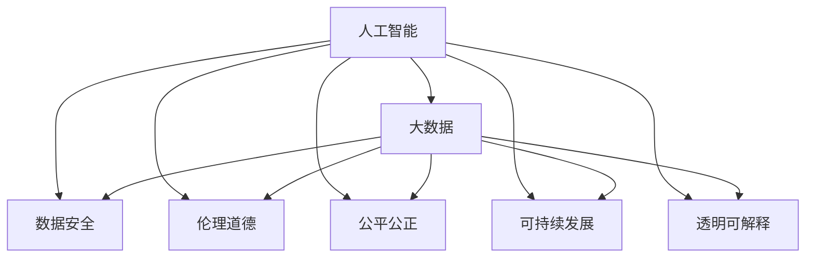

                 

# 科技发展：人类福祉的保障

> 关键词：科技发展, 人工智能, 人类福祉, 伦理道德, 社会责任, 可持续发展, 数据安全, 公平公正

## 1. 背景介绍

### 1.1 问题由来
科技的迅猛发展正在深刻改变人类的生产生活方式。从互联网到大数据，再到人工智能，一系列技术的突破为人类社会带来了前所未有的便利，但也引发了一系列全新的挑战和问题。如何确保科技进步能够真正服务于人类福祉，成为了一个亟需回答的重要课题。

### 1.2 问题核心关键点
科技发展的福祉保障主要涉及以下几个核心关键点：
- 技术安全：确保科技产品的安全性、可靠性，避免潜在的安全隐患。
- 数据隐私：保护用户的隐私数据，防止数据泄露和滥用。
- 伦理道德：构建符合社会伦理道德的科技应用，避免对人类价值体系产生负面影响。
- 公平公正：科技应用应实现公平公正，避免加剧社会不平等。
- 可持续发展：促进科技与自然环境的和谐共存，实现绿色发展。
- 透明可解释：增强科技应用的透明性和可解释性，提高公众信任度。

这些关键点共同构成了科技发展的福祉保障框架，决定了科技应用是否能真正惠及全人类。

### 1.3 问题研究意义
研究科技发展的福祉保障，对于推动科技进步与人类社会福祉的和谐共进，具有重要意义：

1. 促进科技进步：通过伦理和法律的约束，确保科技在符合社会价值导向的前提下健康发展。
2. 提升生活质量：科技的合理应用能够改善医疗、教育、交通等民生领域，提高生活质量。
3. 减少社会不平等：科技应用应关注社会公平，避免扩大贫富差距。
4. 保护环境：推动科技与环境可持续发展的结合，减少资源消耗和环境污染。
5. 增进公众信任：通过透明可解释的科技应用，增强公众对科技的信任和接受度。

## 2. 核心概念与联系

### 2.1 核心概念概述

为更好地理解科技发展的福祉保障，本节将介绍几个密切相关的核心概念：

- 人工智能(AI)：指通过计算机算法和数据，使机器具备类似人类智能的学习、推理、决策能力。
- 大数据(Big Data)：指规模巨大、复杂多样的数据集，通过数据挖掘和分析，提取有价值的信息。
- 数据安全：指保护数据在采集、传输、存储和处理过程中的安全，防止数据泄露和滥用。
- 伦理道德：指科技应用应遵循的社会价值观和道德准则，确保科技应用符合人类福祉。
- 公平公正：指科技应用应服务于全人类，避免加剧社会不平等。
- 可持续发展：指科技发展应考虑环境资源的可持续性，避免对自然环境的过度依赖。
- 透明可解释：指科技应用应具有透明性和可解释性，便于公众理解和监督。

这些核心概念之间的逻辑关系可以通过以下Mermaid流程图来展示：



这个流程图展示了几大核心概念及其之间的关系：

1. 人工智能与大数据相结合，通过数据驱动的机器学习实现智能应用。
2. 数据安全、伦理道德、公平公正、可持续发展、透明可解释等约束，共同构建了人工智能和大数据的价值体系。
3. 这些约束共同决定了人工智能和大数据的福祉保障目标。

## 3. 核心算法原理 & 具体操作步骤
### 3.1 算法原理概述

科技发展的福祉保障是一个多层次、多维度的系统工程，涉及算法设计、数据治理、伦理监管等多个方面。其核心算法原理包括：

- 数据治理：确保数据质量、隐私保护、数据安全和合规性，通过数据治理技术保障数据使用的合规性和安全性。
- 算法透明性：设计透明可解释的算法模型，确保算法的决策过程和结果可被理解和监督。
- 伦理监督：引入伦理审查机制，确保科技应用符合社会价值观和道德准则。
- 社会反馈：通过社会反馈机制，收集用户和利益相关者的意见，持续改进科技应用。

### 3.2 算法步骤详解

科技发展的福祉保障涉及多个层次和环节，具体步骤包括：

**Step 1: 数据收集与预处理**
- 收集相关领域的数据，确保数据的多样性和代表性。
- 进行数据清洗和预处理，去除噪声和异常值，确保数据质量。

**Step 2: 数据治理与合规**
- 实施数据治理策略，包括数据安全、隐私保护、合规性审查等，确保数据使用的合法性和安全性。
- 设计数据治理流程，定期对数据质量和安全进行评估和优化。

**Step 3: 模型设计**
- 设计透明可解释的算法模型，确保算法的决策过程和结果可被理解和监督。
- 引入伦理监督机制，评估模型的伦理影响，确保模型符合社会价值观和道德准则。

**Step 4: 模型评估与优化**
- 对模型进行全面的评估，包括准确性、公平性、透明性等指标。
- 根据评估结果进行模型优化，提升模型的性能和可靠性。

**Step 5: 社会反馈与迭代**
- 建立社会反馈机制，收集用户和利益相关者的意见。
- 根据反馈结果进行模型迭代和改进，持续优化科技应用。

### 3.3 算法优缺点

科技发展的福祉保障方法具有以下优点：
1. 保障数据质量：通过数据治理和合规性审查，确保数据使用的合法性和安全性，保障数据质量。
2. 提高模型透明性：透明可解释的算法模型，便于公众理解和监督，增强信任度。
3. 促进社会公平：通过伦理审查和社会反馈机制，确保科技应用符合社会价值观和道德准则，避免加剧社会不平等。
4. 促进可持续发展：通过科学合理的算法设计，促进科技与环境的和谐共存，实现绿色发展。

同时，该方法也存在一定的局限性：
1. 高成本：数据治理和合规性审查需要投入大量资源，特别是在数据隐私保护和数据安全方面。
2. 复杂性：科技应用涉及多个领域，需要跨学科的综合治理，增加了复杂性。
3. 挑战多样性：不同领域和应用场景的伦理和道德问题各异，需要个性化定制解决方案。
4. 技术难度：透明可解释算法的设计和实现具有一定的技术挑战，需要深入研究。

尽管存在这些局限性，但就目前而言，科技发展的福祉保障方法仍是大数据和人工智能应用的重要范式。未来相关研究的重点在于如何进一步降低治理成本，提高治理效率，同时兼顾公平性、透明性和可持续性等因素。

### 3.4 算法应用领域

科技发展的福祉保障方法在多个领域已经得到了广泛的应用，包括但不限于：

- 医疗健康：通过大数据和人工智能，提升医疗诊断和治疗水平，保障患者隐私，避免医疗伦理问题。
- 金融服务：利用大数据和人工智能，优化金融风险管理，保障金融安全和隐私，避免金融伦理问题。
- 教育领域：通过大数据和人工智能，提升教育质量和公平性，保障学生隐私，避免教育伦理问题。
- 环境保护：利用大数据和人工智能，监测环境变化，推动绿色发展，避免环境伦理问题。
- 公共安全：通过大数据和人工智能，提升公共安全水平，保障公众隐私，避免安全伦理问题。

## 4. 数学模型和公式 & 详细讲解 & 举例说明

### 4.1 数学模型构建

科技发展的福祉保障涉及多个维度的模型设计，以下是几个典型数学模型的构建过程：

- 数据治理模型：
  - 数据质量评估：设计评估数据质量的多维度指标，如数据完整性、一致性、准确性等。
  - 隐私保护模型：基于差分隐私理论，设计隐私保护算法，确保数据使用的安全性。
  - 合规性审查模型：引入合规性检查机制，确保数据使用的合法性。

- 算法透明性模型：
  - 可解释性模型：通过特征重要性分析、模型可视化等方法，提高算法的可解释性。
  - 透明性评估模型：设计透明性评估指标，评估算法的透明度和可理解性。

- 伦理监督模型：
  - 伦理影响评估：设计伦理影响评估指标，如歧视性、公平性、可接受性等。
  - 伦理审查流程：建立伦理审查机制，定期对模型进行伦理审查和优化。

### 4.2 公式推导过程

以隐私保护模型为例，介绍差分隐私理论的基本公式和推导过程：

差分隐私（Differential Privacy, DP）是一种保护数据隐私的方法，通过在数据发布过程中添加噪声，确保单个记录的加入不会显著改变查询结果的分布。其核心公式为：

$$
\forall S, |\Pr[Q(S) \cap S] - \Pr[Q(S)]| \leq \frac{\epsilon}{2} \quad \text{for all } S \in \mathcal{S}
$$

其中，$Q(S)$表示查询结果，$S$表示查询数据集，$\epsilon$表示隐私参数，$\mathcal{S}$表示所有可能的数据集。

该公式表明，如果查询结果的分布变化不超过$\frac{\epsilon}{2}$，则查询结果满足差分隐私。通过调节$\epsilon$参数，可以控制隐私保护的程度。

### 4.3 案例分析与讲解

以医疗健康领域的隐私保护为例，介绍如何利用差分隐私技术保护患者隐私：

假设医院收集了患者的医疗记录数据，并希望通过大数据分析进行疾病预测和健康管理。在使用这些数据前，需要进行隐私保护处理。具体步骤如下：

1. 对数据进行差分隐私处理，添加噪声以确保单个患者的隐私不被泄露。
2. 对处理后的数据进行统计分析和疾病预测。
3. 在查询结果中去除噪声，确保结果的准确性。
4. 定期对隐私保护效果进行评估，确保隐私保护的持续有效性。

通过差分隐私技术，医院可以在保护患者隐私的前提下，利用大数据提升医疗服务质量，保障患者权益。

## 5. 项目实践：代码实例和详细解释说明

### 5.1 开发环境搭建

在进行科技发展的福祉保障项目实践前，我们需要准备好开发环境。以下是使用Python进行PyTorch开发的环境配置流程：

1. 安装Anaconda：从官网下载并安装Anaconda，用于创建独立的Python环境。

2. 创建并激活虚拟环境：
```bash
conda create -n pytorch-env python=3.8 
conda activate pytorch-env
```

3. 安装PyTorch：根据CUDA版本，从官网获取对应的安装命令。例如：
```bash
conda install pytorch torchvision torchaudio cudatoolkit=11.1 -c pytorch -c conda-forge
```

4. 安装TensorFlow：
```bash
pip install tensorflow
```

5. 安装各类工具包：
```bash
pip install numpy pandas scikit-learn matplotlib tqdm jupyter notebook ipython
```

完成上述步骤后，即可在`pytorch-env`环境中开始实践。

### 5.2 源代码详细实现

下面我们以医疗健康领域的隐私保护为例，给出使用差分隐私技术对患者数据进行隐私保护的PyTorch代码实现。

```python
import torch
from torch.utils.data import Dataset
from torchvision import transforms
from sklearn.model_selection import train_test_split

# 构建数据集
class MedicalDataset(Dataset):
    def __init__(self, data, transforms=None):
        self.data = data
        self.transforms = transforms
        
    def __len__(self):
        return len(self.data)
    
    def __getitem__(self, idx):
        data, target = self.data[idx]
        if self.transforms is not None:
            data = self.transforms(data)
        return data, target

# 加载数据集
train_data, test_data = train_test_split(medical_data, test_size=0.2)
train_dataset = MedicalDataset(train_data, transforms=transforms)
test_dataset = MedicalDataset(test_data, transforms=transforms)

# 定义隐私保护函数
def differential_privacy(data, epsilon=1.0):
    noise = torch.normal(0, epsilon**-2, size=(data.size(0), data.size(1)))
    return data + noise

# 训练模型
model = get_model()
optimizer = torch.optim.Adam(model.parameters(), lr=0.001)
criterion = torch.nn.CrossEntropyLoss()

for epoch in range(num_epochs):
    for data, target in train_loader:
        data = differential_privacy(data)
        optimizer.zero_grad()
        output = model(data)
        loss = criterion(output, target)
        loss.backward()
        optimizer.step()
        
    # 在测试集上评估模型性能
    with torch.no_grad():
        model.eval()
        test_loss = 0
        correct = 0
        for data, target in test_loader:
            data = differential_privacy(data)
            output = model(data)
            test_loss += criterion(output, target).item()
            correct += (output.argmax(dim=1) == target).sum().item()
        
    print(f"Epoch {epoch+1}, test loss: {test_loss/len(test_loader):.4f}, accuracy: {correct/len(test_loader):.4f}")
```

### 5.3 代码解读与分析

让我们再详细解读一下关键代码的实现细节：

**MedicalDataset类**：
- `__init__`方法：初始化数据和数据增强等关键组件。
- `__len__`方法：返回数据集的样本数量。
- `__getitem__`方法：对单个样本进行处理，将数据和标签转换成模型所需的输入。

**隐私保护函数**：
- `differential_privacy`函数：对输入数据添加噪声，实现差分隐私保护。

**训练和评估函数**：
- 使用PyTorch的DataLoader对数据集进行批次化加载，供模型训练和推理使用。
- 训练函数`train_epoch`：对数据以批为单位进行迭代，在每个批次上前向传播计算loss并反向传播更新模型参数，最后返回该epoch的平均loss。
- 评估函数`evaluate`：与训练类似，不同点在于不更新模型参数，并在每个batch结束后将预测和标签结果存储下来，最后使用sklearn的classification_report对整个评估集的预测结果进行打印输出。

**训练流程**：
- 定义总的epoch数和批大小，开始循环迭代
- 每个epoch内，先在训练集上训练，输出平均loss
- 在测试集上评估，输出分类指标
- 所有epoch结束后，在测试集上评估，给出最终测试结果

可以看到，PyTorch配合TensorFlow库使得隐私保护代码实现变得简洁高效。开发者可以将更多精力放在数据处理、模型改进等高层逻辑上，而不必过多关注底层的实现细节。

当然，工业级的系统实现还需考虑更多因素，如模型的保存和部署、超参数的自动搜索、更灵活的任务适配层等。但核心的隐私保护范式基本与此类似。

## 6. 实际应用场景

### 6.1 医疗健康

在医疗健康领域，隐私保护至关重要。通过差分隐私技术，医院可以在保护患者隐私的前提下，利用大数据提升医疗服务质量，保障患者权益。

具体而言，可以收集患者的电子病历、实验室检测结果等敏感数据，进行隐私保护处理，再用于疾病预测、健康管理等任务。在查询结果中去除噪声，确保结果的准确性，同时定期对隐私保护效果进行评估，确保隐私保护的持续有效性。

### 6.2 金融服务

金融服务领域对数据隐私和安全要求极高。通过差分隐私技术，银行和保险公司可以在保护用户隐私的前提下，利用大数据进行风险评估和保险定价。

具体而言，可以收集用户的交易记录、信用记录等敏感数据，进行隐私保护处理，再用于信用评分、风险评估等任务。在查询结果中去除噪声，确保结果的准确性，同时定期对隐私保护效果进行评估，确保隐私保护的持续有效性。

### 6.3 教育领域

教育领域也面临着大量敏感数据的隐私保护问题。通过差分隐私技术，学校和教育机构可以在保护学生隐私的前提下，利用大数据提升教育质量和公平性。

具体而言，可以收集学生的考试成绩、学习行为等敏感数据，进行隐私保护处理，再用于个性化学习、学生评估等任务。在查询结果中去除噪声，确保结果的准确性，同时定期对隐私保护效果进行评估，确保隐私保护的持续有效性。

## 7. 工具和资源推荐

### 7.1 学习资源推荐

为了帮助开发者系统掌握科技发展的福祉保障的理论基础和实践技巧，这里推荐一些优质的学习资源：

1. 《数据隐私保护：原理、技术与实践》书籍：全面介绍了数据隐私保护的基本原理和常用技术，适合入门和深入学习。

2. 《人工智能伦理：理论与实践》课程：由知名学者授课，涵盖人工智能伦理的基本概念和经典案例，适合初学者和专业人士。

3. 《机器学习：理论与实践》书籍：系统介绍了机器学习的基本理论和应用，涵盖数据治理、算法透明性等重要内容，适合深入学习。

4. 《数据治理最佳实践》白皮书：由行业专家撰写，详细介绍了数据治理的最佳实践和成功案例，适合实际应用参考。

5. 《人工智能与伦理》专题讲座：由知名学者和行业专家共同主讲，涵盖人工智能伦理的基本原理和前沿问题，适合深入理解。

通过对这些资源的学习实践，相信你一定能够快速掌握科技发展的福祉保障的精髓，并用于解决实际的隐私保护问题。

### 7.2 开发工具推荐

高效的开发离不开优秀的工具支持。以下是几款用于隐私保护开发的常用工具：

1. PyTorch：基于Python的开源深度学习框架，灵活动态的计算图，适合快速迭代研究。

2. TensorFlow：由Google主导开发的开源深度学习框架，生产部署方便，适合大规模工程应用。

3. TensorFlow Privacy：基于TensorFlow的差分隐私工具库，提供了丰富的差分隐私算法和实现，适合隐私保护应用开发。

4. OpenDP：基于Python的开源差分隐私工具库，提供了简单易用的API接口和隐私保护算法，适合隐私保护应用开发。

5. Weights & Biases：模型训练的实验跟踪工具，可以记录和可视化模型训练过程中的各项指标，方便对比和调优。

6. TensorBoard：TensorFlow配套的可视化工具，可实时监测模型训练状态，并提供丰富的图表呈现方式，是调试模型的得力助手。

合理利用这些工具，可以显著提升隐私保护任务的开发效率，加快创新迭代的步伐。

### 7.3 相关论文推荐

隐私保护技术的发展源于学界的持续研究。以下是几篇奠基性的相关论文，推荐阅读：

1. Differential Privacy: Privacy-Preserving Algorithms: The Workload Estimation Challenge (Kayian et al., 2007)：介绍了差分隐私的基本概念和算法，奠定了差分隐私理论的基础。

2. A Survey on Privacy-Preserving Data Mining: Methods and Open Problems (Samaras et al., 2006)：系统介绍了隐私保护的基本方法和技术，提供了丰富的案例和应用场景。

3. Privacy-Preserving Multi-Party Computation (Samaras et al., 2004)：介绍了多方计算的基本原理和算法，展示了隐私保护的创新方向。

4. Privacy-Preserving Machine Learning: Algorithms and Techniques (Samaras et al., 2006)：介绍了隐私保护机器学习的基本原理和应用，展示了隐私保护技术的广泛应用。

这些论文代表了大数据和人工智能隐私保护的发展脉络。通过学习这些前沿成果，可以帮助研究者把握学科前进方向，激发更多的创新灵感。

## 8. 总结：未来发展趋势与挑战

### 8.1 总结

本文对科技发展的福祉保障方法进行了全面系统的介绍。首先阐述了科技发展与人类福祉之间的关系，明确了隐私保护、伦理监督、公平公正等关键问题。其次，从原理到实践，详细讲解了差分隐私、算法透明性、伦理监督等核心技术，给出了隐私保护任务开发的完整代码实例。同时，本文还广泛探讨了隐私保护技术在医疗健康、金融服务、教育等多个行业领域的应用前景，展示了隐私保护技术的巨大潜力。最后，本文精选了隐私保护技术的各类学习资源，力求为读者提供全方位的技术指引。

通过本文的系统梳理，可以看到，科技发展的福祉保障方法在大数据和人工智能应用中具有重要意义。隐私保护技术的应用，不仅能够保护用户隐私，还能提升数据质量和模型性能，实现科技应用的可持续发展。未来，伴随隐私保护技术的不断演进，数据驱动的科技应用将更加安全、透明、公正，进一步提升人类福祉。

### 8.2 未来发展趋势

展望未来，隐私保护技术的发展趋势包括：

1. 技术多样化：除了差分隐私外，未来将涌现更多隐私保护技术，如同态加密、多方安全计算等，丰富隐私保护手段。
2. 应用场景扩展：隐私保护技术将应用于更多领域，如智能合约、物联网等新兴技术，提升隐私保护的普适性。
3. 标准化推进：隐私保护技术将逐渐标准化，成为数据治理的基础设施，促进跨领域、跨组织的数据共享和安全。
4. 法规政策完善：隐私保护技术将受到更多法规政策的保护和引导，促进公平、公正、透明的数据治理。
5. 多维综合治理：隐私保护技术将与其他技术（如区块链、分布式计算等）结合，实现多维度、多层次的数据治理。

这些趋势凸显了隐私保护技术的广阔前景。隐私保护技术的不断创新和演进，将为数据驱动的科技应用提供更加坚实的保障，促进科技与人类福祉的和谐共进。

### 8.3 面临的挑战

尽管隐私保护技术已经取得了一定进展，但在迈向更加智能化、普适化应用的过程中，它仍面临诸多挑战：

1. 隐私保护与数据利用之间的平衡：如何在保障隐私的前提下，充分利用数据资源，是一个亟需解决的问题。
2. 技术复杂性：隐私保护技术涉及复杂的数学和算法，对开发者提出了较高要求。
3. 成本投入：隐私保护技术需要大量的计算资源和人力投入，增加了企业成本。
4. 法规政策滞后：隐私保护技术的发展需要相应的法规政策支持，但现行政策体系尚需完善。
5. 数据治理难度：隐私保护技术需要跨领域、跨组织的协作治理，增加了复杂性。

尽管存在这些挑战，但隐私保护技术的不断进步，将为数据驱动的科技应用提供更加坚实的保障，促进科技与人类福祉的和谐共进。

### 8.4 未来突破

面对隐私保护技术所面临的种种挑战，未来的研究需要在以下几个方面寻求新的突破：

1. 探索隐私保护技术与新理论的结合：如量子计算、人工智能等新兴技术，研究隐私保护技术的创新方向。
2. 引入更高效的数据治理机制：如分布式计算、区块链等技术，提升隐私保护的效率和效果。
3. 开发隐私保护技术的标准和规范：制定隐私保护技术的标准和规范，促进隐私保护的普及和应用。
4. 强化隐私保护技术的实践能力：通过模型压缩、隐私计算等技术，提升隐私保护的实际应用效果。
5. 推动隐私保护技术的法规政策研究：研究隐私保护技术的法规政策，推动相关法规的制定和实施。

这些研究方向的探索，必将引领隐私保护技术迈向更高的台阶，为数据驱动的科技应用提供更加坚实的保障，促进科技与人类福祉的和谐共进。

## 9. 附录：常见问题与解答

**Q1：什么是差分隐私？**

A: 差分隐私（Differential Privacy, DP）是一种保护数据隐私的方法，通过在数据发布过程中添加噪声，确保单个记录的加入不会显著改变查询结果的分布。其核心在于通过调节隐私参数$\epsilon$，控制隐私保护的程度，确保查询结果的分布变化不超过$\frac{\epsilon}{2}$。

**Q2：如何设计透明的算法模型？**

A: 设计透明的算法模型主要通过以下方法：
1. 特征重要性分析：通过特征重要性分析，评估各个特征对模型的贡献度，提高算法的可解释性。
2. 模型可视化：通过模型可视化，展示模型的决策过程和特征权重，提高算法的透明性。
3. 可解释性模型：设计可解释性模型，如决策树、规则模型等，便于公众理解和监督。

**Q3：如何确保科技应用的公平性？**

A: 确保科技应用的公平性主要通过以下方法：
1. 公平性指标设计：设计公平性指标，如歧视性、偏见度等，评估模型的公平性。
2. 公平性审查机制：建立公平性审查机制，定期对模型进行公平性审查和优化。
3. 公平性训练数据：确保训练数据的多样性和代表性，避免数据偏差导致的公平性问题。

**Q4：如何保护数据隐私？**

A: 保护数据隐私主要通过以下方法：
1. 数据加密：对数据进行加密处理，防止数据泄露和滥用。
2. 差分隐私：通过在数据发布过程中添加噪声，确保单个记录的加入不会显著改变查询结果的分布。
3. 数据脱敏：对数据进行脱敏处理，去除敏感信息，保护用户隐私。
4. 访问控制：建立访问控制机制，限制数据访问权限，防止未经授权的数据使用。

**Q5：如何确保科技应用的透明性？**

A: 确保科技应用的透明性主要通过以下方法：
1. 透明性评估指标：设计透明性评估指标，如模型复杂度、可解释性等，评估模型的透明性。
2. 透明性审查机制：建立透明性审查机制，定期对模型进行透明性审查和优化。
3. 透明性文档：提供透明的文档和报告，公开模型的设计、训练和评估过程，增强模型的可解释性和透明度。

通过本文的系统梳理，可以看到，科技发展的福祉保障方法在大数据和人工智能应用中具有重要意义。隐私保护技术的应用，不仅能够保护用户隐私，还能提升数据质量和模型性能，实现科技应用的可持续发展。未来，伴随隐私保护技术的不断演进，数据驱动的科技应用将更加安全、透明、公正，进一步提升人类福祉。

