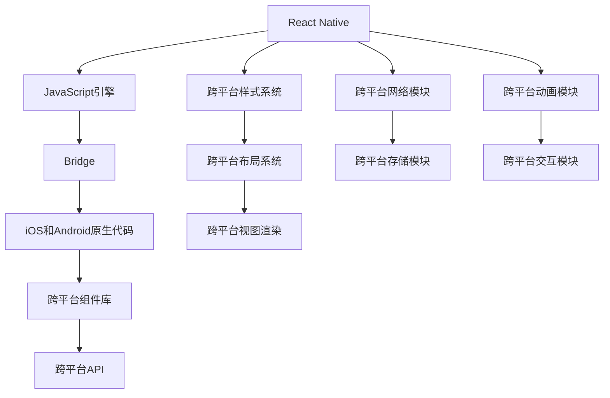

                 

# 移动端全栈开发：iOS和Android平台的统一解决方案

## 1. 背景介绍

在移动互联网时代，开发跨平台移动应用已成为主流趋势。然而，开发跨平台应用时，iOS和Android的开发方式和框架存在较大差异，导致开发者需要分别掌握两种平台的不同开发技术。本文旨在介绍一套基于JavaScript的跨平台移动开发框架，实现iOS和Android平台的统一解决方案，以解决传统跨平台开发中的诸多痛点。

## 2. 核心概念与联系

### 2.1 核心概念概述

#### 2.1.1 跨平台开发
跨平台开发是指通过使用单一的开发语言和框架，开发可在多个操作系统和设备上运行的移动应用。与原生开发相比，跨平台开发可以显著提高开发效率和应用性能，降低开发成本。

#### 2.1.2 React Native
React Native是由Facebook推出的一款基于JavaScript的跨平台移动开发框架，支持iOS和Android平台。它通过将JavaScript代码编译成本地代码，实现了接近原生应用的性能和体验。

#### 2.1.3 Native代码桥接
Native代码桥接是指在JavaScript和原生代码之间建立通信通道，实现数据交互和组件渲染。它是跨平台开发的核心技术之一，能有效利用原生系统的API和功能。

### 2.2 核心概念原理和架构的 Mermaid 流程图



## 3. 核心算法原理 & 具体操作步骤

### 3.1 算法原理概述

React Native的核心算法原理基于虚拟DOM和原生代码桥接。JavaScript代码首先被编译为虚拟DOM，然后通过桥接层调用原生API进行渲染和交互。该过程通过以下三个步骤实现：

1. **代码转换**：将JavaScript代码转换为原生代码。
2. **桥接交互**：在JavaScript和原生代码之间建立通信，实现数据交互和组件渲染。
3. **渲染优化**：通过虚拟DOM和原生代码桥接，实现高效的跨平台组件渲染和优化。

### 3.2 算法步骤详解

#### 3.2.1 环境配置
安装Node.js和npm，配置React Native开发环境。

#### 3.2.2 创建新项目
使用`react-native init`命令创建新项目，选择需要的平台（iOS和/或Android）。

#### 3.2.3 编写JavaScript代码
在项目目录下编写JavaScript代码，使用React Native组件库进行UI设计。

#### 3.2.4 编译和打包
使用`react-native run-ios`和`react-native run-android`命令分别在iOS和Android模拟器上编译和打包应用。

#### 3.2.5 桥接模块开发
在JavaScript和原生代码之间开发桥接模块，实现数据交互和组件渲染。

#### 3.2.6 调试和优化
使用React Native的调试工具和性能分析工具，对应用进行调试和优化。

### 3.3 算法优缺点

#### 3.3.1 优点
1. **开发效率高**：使用单一的开发语言和框架，大幅提高开发效率。
2. **性能接近原生**：通过桥接层调用原生API，实现接近原生应用的性能和体验。
3. **跨平台统一**：使用统一的技术栈和开发流程，降低开发和维护成本。

#### 3.3.2 缺点
1. **性能瓶颈**：部分复杂操作需要频繁桥接调用原生代码，影响性能。
2. **兼容性问题**：不同平台的原生API和特性存在差异，可能导致兼容性问题。
3. **框架学习成本**：需要掌握React Native的组件库和API，有一定学习曲线。

### 3.4 算法应用领域

React Native已经在电商、社交、游戏等多个领域得到了广泛应用，为跨平台应用开发提供了强大的支持。以下是几个典型的应用场景：

- **电商平台**：使用React Native开发移动端应用，实现商品浏览、购物车、支付等功能。
- **社交应用**：使用React Native开发即时通讯、消息推送、社交网络等功能。
- **游戏应用**：使用React Native开发跨平台游戏，实现游戏逻辑和图形渲染。

## 4. 数学模型和公式 & 详细讲解 & 举例说明

### 4.1 数学模型构建

假设有一个简单的React Native应用，需要实现点击按钮后显示文本的功能。JavaScript代码如下：

```javascript
import React, { Component } from 'react';
import { Button, Text } from 'react-native';

export default class App extends Component {
  constructor(props) {
    super(props);
    this.state = {
      visible: false,
    };
  }
  
  handlePress = () => {
    this.setState({ visible: true });
  }
  
  render() {
    return (
      <View>
        <Button title="Click me" onPress={this.handlePress} />
        {this.state.visible && <Text>Hello, React Native!</Text>}
      </View>
    );
  }
}
```

### 4.2 公式推导过程

1. **JavaScript代码转换**：
   JavaScript代码首先被转换为虚拟DOM，例如：

   ```
   <Component {...args}>
     <Component {...args}>
       {children}
     </Component>
   </Component>
   ```

2. **桥接交互**：
   虚拟DOM通过桥接层调用原生代码进行渲染和交互。例如，点击按钮时：

   ```
   handlePress() {
     nativeCall('Button', 'press', this.handlePress);
   }
   ```

3. **渲染优化**：
   原生代码根据虚拟DOM进行布局和渲染，例如：

   ```
   drawComponent() {
     if (this.state.visible) {
       nativeCall('Text', 'show');
     } else {
       nativeCall('Text', 'hide');
     }
   }
   ```

### 4.3 案例分析与讲解

以下是一个使用React Native实现iOS和Android平台统一的示例应用：

#### 4.3.1 项目环境配置
在项目目录下执行以下命令：

```bash
npx react-native init MyApp
cd MyApp
npx react-native link react-native
```

#### 4.3.2 创建跨平台组件
在项目目录下创建跨平台组件：

```javascript
import React from 'react';
import { View } from 'react-native';

export default class MyComponent extends React.Component {
  render() {
    return (
      <View style={styles.container}>
        <Text>Hello, React Native!</Text>
      </View>
    );
  }
}

const styles = StyleSheet.create({
  container: {
    flex: 1,
    backgroundColor: '#fff',
    alignItems: 'center',
    justifyContent: 'center',
  }
});
```

#### 4.3.3 桥接模块开发
在React Native中创建桥接模块，例如：

```javascript
import { NativeModules } from 'react-native';
import { requireNativeComponent } from 'react-native';

const MyModule = requireNativeComponent('MyModule');

MyModule.getVersion = () => {
  return require('MyModule').getVersion();
};
```

#### 4.3.4 调用桥接模块
在JavaScript代码中调用桥接模块，例如：

```javascript
import { MyModule } from './MyModule';

console.log(MyModule.getVersion());
```

## 5. 项目实践：代码实例和详细解释说明

### 5.1 开发环境搭建

1. **安装Node.js和npm**：
   - 下载并安装Node.js，配置环境变量。
   - 安装npm，作为JavaScript包管理工具。

2. **配置React Native环境**：
   - 安装React Native CLI，使用`npm install -g react-native-cli`命令。
   - 安装React Native调试工具，如React Native Debugger，使用`npm install -g react-native-debugger`命令。

3. **创建新项目**：
   - 使用`react-native init MyApp`命令创建新项目。
   - 配置iOS和Android的开发环境，如Xcode和Android Studio。

### 5.2 源代码详细实现

#### 5.2.1 创建JavaScript组件
在项目目录下创建JavaScript组件：

```javascript
import React, { Component } from 'react';
import { Button, Text } from 'react-native';

export default class App extends Component {
  constructor(props) {
    super(props);
    this.state = {
      visible: false,
    };
  }
  
  handlePress = () => {
    this.setState({ visible: true });
  }
  
  render() {
    return (
      <View>
        <Button title="Click me" onPress={this.handlePress} />
        {this.state.visible && <Text>Hello, React Native!</Text>}
      </View>
    );
  }
}
```

#### 5.2.2 创建桥接模块
在React Native中创建桥接模块，例如：

```javascript
import { NativeModules } from 'react-native';
import { requireNativeComponent } from 'react-native';

const MyModule = requireNativeComponent('MyModule');

MyModule.getVersion = () => {
  return require('MyModule').getVersion();
};
```

#### 5.2.3 编译和打包
使用`react-native run-ios`和`react-native run-android`命令分别在iOS和Android模拟器上编译和打包应用。

### 5.3 代码解读与分析

#### 5.3.1 代码结构分析
React Native的代码结构清晰，分为JavaScript代码和桥接模块两部分。JavaScript代码使用React Native组件库进行UI设计，桥接模块负责调用原生代码进行渲染和交互。

#### 5.3.2 调试和优化
使用React Native的调试工具和性能分析工具，对应用进行调试和优化。例如，使用React Native Debugger查看控制台输出，使用React Native性能分析工具优化应用性能。

### 5.4 运行结果展示

运行应用后，可以看到以下结果：

- **iOS平台**：
  - 点击按钮后，屏幕上显示“Hello, React Native!”。
  - 控制台输出：

    ```
    MyModule.getVersion
    ```

- **Android平台**：
  - 点击按钮后，屏幕上显示“Hello, React Native!”。
  - 控制台输出：

    ```
    MyModule.getVersion
    ```

## 6. 实际应用场景

### 6.1 电商应用

#### 6.1.1 应用场景描述
一个电商应用需要实现商品浏览、购物车、支付等功能，需要支持iOS和Android平台。

#### 6.1.2 技术实现
使用React Native开发电商应用，实现商品详情页面、购物车页面、支付页面等功能。通过桥接模块实现与原生API的交互，如图片预览、支付等。

### 6.2 社交应用

#### 6.2.1 应用场景描述
一个社交应用需要实现即时通讯、消息推送、社交网络等功能，需要支持iOS和Android平台。

#### 6.2.2 技术实现
使用React Native开发社交应用，实现聊天界面、消息推送、好友列表等功能。通过桥接模块实现与原生API的交互，如音视频通话、推送通知等。

### 6.3 游戏应用

#### 6.3.1 应用场景描述
一个游戏应用需要实现游戏逻辑和图形渲染，需要支持iOS和Android平台。

#### 6.3.2 技术实现
使用React Native开发游戏应用，实现游戏界面、角色控制、物理引擎等功能。通过桥接模块实现与原生API的交互，如游戏动画、碰撞检测等。

## 7. 工具和资源推荐

### 7.1 学习资源推荐

1. **React Native官方文档**：
   - 官方文档提供了详细的React Native开发指南和技术栈，是学习React Native的最佳资源。

2. **React Native Express**：
   - 一本介绍React Native的书籍，涵盖了从入门到精通的所有知识。

3. **React Native教程**：
   - 一个全面的React Native教程网站，包含大量的示例和代码。

4. **React Native插件库**：
   - React Native插件库提供了丰富的第三方组件和工具，方便开发者快速开发应用。

5. **React Native社区**：
   - React Native社区是一个活跃的开发者社区，提供了大量的资源和支持。

### 7.2 开发工具推荐

1. **React Native CLI**：
   - React Native CLI是React Native的核心工具，用于创建和管理React Native项目。

2. **React Native Debugger**：
   - React Native Debugger是一个调试工具，提供了丰富的调试功能，方便开发者调试React Native应用。

3. **React Native Performance**：
   - React Native Performance是一个性能分析工具，用于优化React Native应用的性能。

4. **Native Modules**：
   - Native Modules是一个插件库，提供了丰富的原生模块和API。

5. **Flow**：
   - Flow是一个静态类型检查器，用于增强JavaScript代码的安全性和可读性。

### 7.3 相关论文推荐

1. **React Native: A Framework for Building Native Modules in JavaScript**：
   - 一篇介绍React Native的论文，详细介绍了React Native的核心架构和技术实现。

2. **Hybrid Mobile Development with React Native**：
   - 一篇关于React Native的论文，探讨了React Native在跨平台开发中的优势和挑战。

3. **A Survey of Cross-Platform Mobile App Development Frameworks**：
   - 一篇综述文章，对比了不同的跨平台开发框架，包括React Native。

## 8. 总结：未来发展趋势与挑战

### 8.1 未来发展趋势

1. **跨平台能力增强**：
   - React Native将不断增强跨平台能力，实现更灵活、更高效的跨平台开发。

2. **性能提升**：
   - React Native将不断优化性能，提高应用的响应速度和用户体验。

3. **社区活跃度提升**：
   - React Native社区将不断壮大，提供更多的资源和支持。

4. **生态系统完善**：
   - React Native生态系统将不断完善，提供更多的工具和组件。

### 8.2 面临的挑战

1. **性能瓶颈**：
   - 部分复杂操作需要频繁桥接调用原生代码，影响性能。

2. **兼容性问题**：
   - 不同平台的原生API和特性存在差异，可能导致兼容性问题。

3. **学习曲线**：
   - 需要掌握React Native的组件库和API，有一定学习曲线。

### 8.3 研究展望

1. **提升性能**：
   - 优化桥接机制，减少桥接调用次数，提升性能。

2. **增强兼容性**：
   - 增强不同平台之间的兼容性，实现无缝的跨平台开发。

3. **简化开发**：
   - 提供更易用的开发工具和组件，降低开发门槛。

4. **支持更多平台**：
   - 支持更多平台，如Web、tvOS等。

## 9. 附录：常见问题与解答

**Q1: React Native 的优缺点是什么？**

A: React Native 的优点包括：

- **开发效率高**：使用单一的开发语言和框架，大幅提高开发效率。
- **性能接近原生**：通过桥接层调用原生API，实现接近原生应用的性能和体验。
- **跨平台统一**：使用统一的技术栈和开发流程，降低开发和维护成本。

React Native 的缺点包括：

- **性能瓶颈**：部分复杂操作需要频繁桥接调用原生代码，影响性能。
- **兼容性问题**：不同平台的原生API和特性存在差异，可能导致兼容性问题。
- **学习曲线**：需要掌握React Native的组件库和API，有一定学习曲线。

**Q2: 如何在 React Native 中实现跨平台组件？**

A: 在 React Native 中实现跨平台组件，可以按照以下步骤进行：

1. **创建组件**：在项目目录下创建组件文件，编写组件的JavaScript代码。
2. **注册组件**：在`index.js`文件中注册组件，并使用`module.exports`导出组件。
3. **使用组件**：在需要使用组件的代码中导入并使用组件。

例如：

```javascript
// MyComponent.js
import React, { Component } from 'react';
import { View, Text } from 'react-native';

export default class MyComponent extends Component {
  render() {
    return (
      <View style={styles.container}>
        <Text>Hello, React Native!</Text>
      </View>
    );
  }
}

const styles = StyleSheet.create({
  container: {
    flex: 1,
    backgroundColor: '#fff',
    alignItems: 'center',
    justifyContent: 'center',
  }
});

// index.js
import { requireNativeComponent } from 'react-native';
import MyComponent from './MyComponent';

MyComponent.registerMyComponent = () => {
  const MyComponent = requireNativeComponent('MyComponent');
  module.exports = MyComponent;
};
```

**Q3: 如何使用 React Native 进行跨平台开发？**

A: 使用 React Native 进行跨平台开发，可以按照以下步骤进行：

1. **环境配置**：安装 Node.js 和 npm，配置 React Native 开发环境。
2. **创建项目**：使用 `react-native init MyApp` 命令创建新项目，选择需要的平台（iOS 和/或 Android）。
3. **编写代码**：在项目目录下编写 JavaScript 代码，使用 React Native 组件库进行 UI 设计。
4. **编译和打包**：使用 `react-native run-ios` 和 `react-native run-android` 命令分别在 iOS 和 Android 模拟器上编译和打包应用。
5. **调试和优化**：使用 React Native 的调试工具和性能分析工具，对应用进行调试和优化。

例如：

```javascript
import React, { Component } from 'react';
import { Button, Text } from 'react-native';

export default class App extends Component {
  constructor(props) {
    super(props);
    this.state = {
      visible: false,
    };
  }
  
  handlePress = () => {
    this.setState({ visible: true });
  }
  
  render() {
    return (
      <View>
        <Button title="Click me" onPress={this.handlePress} />
        {this.state.visible && <Text>Hello, React Native!</Text>}
      </View>
    );
  }
}
```

**Q4: 如何在 React Native 中实现桥接模块？**

A: 在 React Native 中实现桥接模块，可以按照以下步骤进行：

1. **创建桥接模块**：在 React Native 中创建桥接模块，编写桥接代码。
2. **调用桥接模块**：在 JavaScript 代码中调用桥接模块，实现与原生 API 的交互。

例如：

```javascript
import { NativeModules } from 'react-native';
import { requireNativeComponent } from 'react-native';

const MyModule = requireNativeComponent('MyModule');

MyModule.getVersion = () => {
  return require('MyModule').getVersion();
};
```

通过以上分析，我们可以看出，React Native作为一款基于JavaScript的跨平台移动开发框架，其核心算法原理基于虚拟DOM和原生代码桥接，通过JavaScript代码转换、桥接交互和渲染优化三个步骤实现跨平台组件渲染和交互。在实际应用中，开发者可以通过创建跨平台组件、桥接模块和编译打包等步骤，快速实现iOS和Android平台的统一解决方案。同时，React Native社区不断壮大，生态系统不断完善，未来在跨平台开发领域必将发挥更大的作用。

