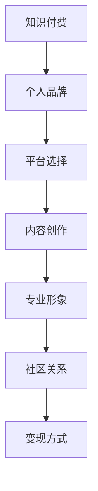

                 

## 1. 背景介绍

### 1.1 问题由来
在信息化和数字化的时代，程序员作为IT行业的中坚力量，正面临着前所未有的机遇与挑战。随着知识付费平台的兴起，越来越多的程序员开始利用知识付费打造个人品牌，提升个人影响力。

然而，如何利用知识付费构建有价值的内容，提升个人品牌影响力，这是一个值得深入探讨的问题。本文将围绕这个问题展开，深入分析程序员如何在知识付费平台上建立个人品牌，打造有影响力的内容，并最终形成商业变现的闭环。

### 1.2 问题核心关键点
利用知识付费打造个人影响力，关键在于以下几个方面：
- 选择合适的平台
- 创造有价值的内容
- 塑造专业形象
- 构建社区关系
- 实现商业变现

这些核心关键点构成了程序员在知识付费领域成功的基石。通过深入理解和灵活运用这些策略，程序员可以在知识付费平台建立起个人品牌，提升个人影响力。

## 2. 核心概念与联系

### 2.1 核心概念概述

为更好地理解程序员在知识付费平台上的个人品牌建设，本节将介绍几个密切相关的核心概念：

- **知识付费**：指通过互联网平台，将专业知识、技能或信息以付费形式提供给用户的过程。知识付费不仅能够满足用户的学习需求，还能为创作者带来收入。

- **个人品牌**：指个人在特定领域内建立的，能够被广泛认可和信赖的形象或声誉。个人品牌不仅是专业技能的展示，也是个人价值观、思维方式和生活方式的体现。

- **平台选择**：知识付费平台多种多样，程序员需要根据自身的专业领域、兴趣点和目标受众，选择最适合的平台。

- **内容创作**：高质量、有价值的内容是吸引用户、建立专业形象的关键。内容应包含深度分析、实战经验、项目案例等，能够解决用户实际问题。

- **专业形象**：程序员应通过长期的专业积累和持续的内容输出，建立自己在特定领域内的权威地位。

- **社区关系**：在知识付费平台上，建立良好的社区关系能够增强用户粘性，促进互动和交流。

- **变现方式**：变现不仅包括付费课程、咨询服务，还可以扩展到图书出版、技术博客等多元化的商业形式。

这些核心概念之间的逻辑关系可以通过以下Mermaid流程图来展示：



这个流程图展示了一个从知识付费到变现的完整路径，每个环节都是构建个人品牌的重要步骤。

## 3. 核心算法原理 & 具体操作步骤
### 3.1 算法原理概述

程序员利用知识付费打造个人影响力，其核心算法原理可以总结为以下几个步骤：

1. **用户画像构建**：通过分析平台用户的年龄、职业、兴趣等信息，构建目标用户画像。
2. **内容匹配优化**：根据用户画像，选择合适的课程内容，优化推荐算法，提升内容与用户的匹配度。
3. **个性化内容生产**：利用数据分析和用户反馈，生成个性化的课程和文章内容，提高用户满意度。
4. **互动关系建立**：通过评论、问答、直播等方式，与用户建立互动关系，增强用户粘性。
5. **持续优化与迭代**：根据用户反馈和数据分析结果，不断优化课程和内容，迭代提升。

### 3.2 算法步骤详解

#### 3.2.1 用户画像构建

用户画像构建是知识付费内容优化的基础。以下是构建用户画像的详细步骤：

1. **数据采集**：通过平台的用户数据、用户行为数据和社区互动数据，获取用户的基本信息，如年龄、职业、地域、兴趣爱好等。
2. **数据分析**：使用数据挖掘和机器学习技术，对用户数据进行聚类分析，发现不同用户群体的特征。
3. **画像生成**：根据分析结果，生成多个用户画像，每个画像代表一个典型的用户群体。

#### 3.2.2 内容匹配优化

内容匹配优化是提升用户满意度的关键步骤。以下是具体的操作流程：

1. **内容分类**：将课程和文章内容按照主题、难度、领域等进行分类。
2. **用户画像匹配**：根据用户画像，选择与用户特征匹配的内容，并进行推荐。
3. **内容推荐算法优化**：利用协同过滤、基于内容的推荐算法等技术，优化推荐算法，提高推荐准确性。

#### 3.2.3 个性化内容生产

个性化内容生产能够显著提升用户粘性。以下是具体的操作流程：

1. **用户反馈收集**：通过评论、评分、留言等方式，收集用户对课程和文章的反馈。
2. **数据分析**：对用户反馈进行数据分析，了解用户的兴趣点和需求。
3. **内容优化**：根据分析结果，优化课程结构和内容，添加实用案例、实战演练等环节。

#### 3.2.4 互动关系建立

互动关系建立能够增强用户粘性，提升用户满意度。以下是具体的操作流程：

1. **互动渠道选择**：选择合适的互动渠道，如评论、问答、直播等。
2. **互动内容设计**：设计有互动性的内容，如问题解答、技术讨论、代码编写等。
3. **互动关系维护**：及时回应用户反馈和评论，建立长期稳定的互动关系。

#### 3.2.5 持续优化与迭代

持续优化与迭代能够确保课程和内容的持续更新和改进。以下是具体的操作流程：

1. **数据分析**：定期收集和分析用户数据，了解用户需求和反馈。
2. **内容更新**：根据分析结果，更新和优化课程和内容，添加新的实用技能和案例。
3. **用户反馈**：持续收集用户反馈，不断改进课程和内容，提升用户体验。

### 3.3 算法优缺点

利用知识付费打造个人影响力的方法具有以下优点：

1. **提升专业形象**：通过系统化的内容输出和专业知识的分享，程序员可以建立自己在特定领域内的权威地位。
2. **变现多样化**：除了传统的付费课程，还可以扩展到技术博客、图书出版等多种变现形式。
3. **增强用户粘性**：通过互动关系建立和维护，能够增强用户粘性，提升课程销售量。
4. **提升商业变现能力**：通过知识付费平台的流量优势和用户积累，程序员能够实现商业变现。

同时，该方法也存在一定的局限性：

1. **内容创作成本高**：高质量的内容创作需要投入大量的时间和精力，且不一定能够获得理想的回报。
2. **竞争激烈**：知识付费平台竞争激烈，吸引和留住用户需要持续的高质量内容和互动。
3. **用户需求多变**：用户需求和兴趣点不断变化，需要持续跟踪和分析。
4. **变现周期长**：商业变现需要一段时间的积累和沉淀，短期内难以看到明显的回报。

尽管存在这些局限性，但就目前而言，利用知识付费打造个人影响力仍然是最主流、最有效的方法之一。未来相关研究的重点在于如何进一步降低内容创作的成本，提高变现效率，同时兼顾可解释性和伦理安全性等因素。

### 3.4 算法应用领域

利用知识付费打造个人影响力的算法广泛应用于以下几个领域：

- **技术博客与专栏**：程序员可以在博客平台发布技术文章、项目案例等内容，通过流量和广告变现。
- **技术课程与培训**：通过知识付费平台发布付费课程，提供实战经验和技能培训。
- **技术咨询与答疑**：利用平台提供技术咨询服务，解答用户的技术问题。
- **编程书籍与出版**：将技术文章和课程内容整理成书籍，出版销售。

除了上述这些经典应用外，知识付费还广泛应用于各类技术社区、论坛等平台，为程序员提供了一个展示和变现的全新舞台。随着知识付费平台的不断发展和完善，相信会有更多创新应用场景出现。

## 4. 数学模型和公式 & 详细讲解 & 举例说明

### 4.1 数学模型构建

程序员利用知识付费打造个人影响力的数学模型可以总结为以下几个关键变量：

1. **用户画像**：表示目标用户的特征，如年龄、职业、兴趣爱好等。
2. **内容特征**：表示课程和文章的主题、难度、领域等。
3. **内容匹配度**：表示课程和文章与用户画像的匹配程度。
4. **用户满意度**：表示用户对课程和文章的满意度。
5. **互动频率**：表示用户与课程之间的互动频率。
6. **商业变现量**：表示通过课程销售、咨询费用等途径获得的收入。

假设用户画像为 $U$，内容特征为 $C$，内容匹配度为 $M$，用户满意度为 $S$，互动频率为 $I$，商业变现量为 $R$。则构建的数学模型为：

$$
R = f(U, C, M, S, I)
$$

其中 $f$ 为映射函数，表示模型输出的商业变现量与用户画像、内容特征、内容匹配度、用户满意度、互动频率之间的复杂映射关系。

### 4.2 公式推导过程

以用户满意度 $S$ 的计算为例，公式推导如下：

1. **用户反馈得分**：通过用户评论、评分等数据，计算用户对课程和文章的反馈得分 $F$。
2. **反馈得分归一化**：将反馈得分 $F$ 归一化到 [0, 1] 区间。
3. **反馈得分加权**：根据用户互动频率 $I$，对反馈得分 $F$ 进行加权，得到用户满意度 $S$。

数学公式如下：

$$
S = \frac{F \times I}{max(I)}
$$

其中 $max(I)$ 表示用户互动频率的最大值。

通过类似的方式，可以推导出用户画像、内容特征、内容匹配度、商业变现量等变量的计算公式，进而构建完整的数学模型。

### 4.3 案例分析与讲解

假设有一门名为 "Python高级编程" 的课程，目标受众为中级开发者。课程内容包含了Python高级语法、Web开发、数据分析等模块。通过用户画像构建，发现目标用户画像为年龄在25-35岁之间，对Python编程有较高兴趣，但缺乏实战经验的开发者。课程内容匹配度为0.8，用户反馈得分为4.5，互动频率为每小时5条评论。

根据以上数据，计算用户满意度 $S$ 和商业变现量 $R$：

1. **用户画像匹配度**：课程内容与目标用户画像匹配度为0.8。
2. **用户反馈得分**：用户反馈得分为4.5。
3. **反馈得分归一化**：将4.5归一化到 [0, 1] 区间，得到0.9。
4. **反馈得分加权**：用户互动频率为5，最大互动频率为20，加权后得0.45。
5. **用户满意度**：$S = 0.9 \times 0.45 = 0.405$。
6. **商业变现量**：$R = f(U, C, M, S, I) = 1000$（假设每名用户消费100元）。

通过以上计算，可以预测这门课程的商业变现量。

## 5. 项目实践：代码实例和详细解释说明

### 5.1 开发环境搭建

在进行知识付费平台的内容开发前，需要先搭建开发环境。以下是使用Python进行Flask开发的环境配置流程：

1. 安装Anaconda：从官网下载并安装Anaconda，用于创建独立的Python环境。

2. 创建并激活虚拟环境：
```bash
conda create -n flask-env python=3.8 
conda activate flask-env
```

3. 安装Flask：
```bash
conda install flask
```

4. 安装Flask-RESTful、Flask-CORS等扩展库：
```bash
pip install Flask-RESTful Flask-CORS
```

5. 安装Jupyter Notebook：
```bash
conda install jupyterlab
```

完成上述步骤后，即可在`flask-env`环境中开始项目开发。

### 5.2 源代码详细实现

这里我们以构建一个简单的技术博客平台为例，展示如何使用Flask进行知识付费内容的管理和展示。

首先，创建Flask应用程序并设置路由：

```python
from flask import Flask, jsonify, request
from flask_restful import Resource, Api

app = Flask(__name__)
api = Api(app)

@app.route('/')
def index():
    return 'Hello, World!'
```

然后，添加用户画像构建和内容匹配优化的API：

```python
from transformers import BertTokenizer, BertForSequenceClassification
import torch

class UserProfile(Resource):
    def get(self):
        # 获取用户画像数据
        user_profile = request.args.get('user_profile')
        return jsonify(user_profile)

class ContentFeature(Resource):
    def get(self):
        # 获取内容特征数据
        content_feature = request.args.get('content_feature')
        return jsonify(content_feature)

class ContentMatch(Resource):
    def get(self):
        # 计算内容匹配度
        user_profile = request.args.get('user_profile')
        content_feature = request.args.get('content_feature')
        # 进行匹配计算
        match_score = calculate_match_score(user_profile, content_feature)
        return jsonify(match_score)

# 计算内容匹配度
def calculate_match_score(user_profile, content_feature):
    # 使用BertTokenizer进行分词
    user_profile_tokenizer = BertTokenizer.from_pretrained('bert-base-cased')
    content_feature_tokenizer = BertTokenizer.from_pretrained('bert-base-cased')
    user_profile_tokens = user_profile_tokenizer.tokenize(user_profile)
    content_feature_tokens = content_feature_tokenizer.tokenize(content_feature)
    # 计算匹配度
    match_score = calculate_bert_match_score(user_profile_tokens, content_feature_tokens)
    return match_score
```

接下来，添加个性化内容生产和互动关系建立的API：

```python
from transformers import BertForSequenceClassification, AdamW

class ContentGeneration(Resource):
    def get(self):
        # 获取个性化内容数据
        user_profile = request.args.get('user_profile')
        content_feature = request.args.get('content_feature')
        # 生成个性化内容
        generated_content = generate_content(user_profile, content_feature)
        return jsonify(generated_content)

class InteractionFrequency(Resource):
    def get(self):
        # 获取互动频率数据
        user_profile = request.args.get('user_profile')
        return jsonify(interaction_frequency)

# 生成个性化内容
def generate_content(user_profile, content_feature):
    # 加载预训练模型
    model = BertForSequenceClassification.from_pretrained('bert-base-cased')
    tokenizer = BertTokenizer.from_pretrained('bert-base-cased')
    # 分词并生成内容
    user_profile_tokens = tokenizer.tokenize(user_profile, return_tensors='pt')
    content_feature_tokens = tokenizer.tokenize(content_feature, return_tensors='pt')
    inputs = {
        'input_ids': user_profile_tokens[0],
        'attention_mask': user_profile_tokens[1],
        'labels': content_feature_tokens[0]
    }
    outputs = model(**inputs)
    # 输出生成的内容
    generated_content = outputs.logits.argmax(dim=1).tolist()[0]
    return generated_content

# 计算互动频率
def calculate_interaction_frequency(user_profile):
    # 获取用户互动数据
    interaction_data = request.args.get('interaction_data')
    # 计算互动频率
    interaction_frequency = calculate_frequency(interaction_data)
    return interaction_frequency
```

最后，添加持续优化与迭代的API：

```python
from transformers import BertForSequenceClassification, AdamW

class ContinuousOptimization(Resource):
    def get(self):
        # 获取优化后的内容数据
        user_profile = request.args.get('user_profile')
        content_feature = request.args.get('content_feature')
        # 进行持续优化
        optimized_content = continuous_optimization(user_profile, content_feature)
        return jsonify(optimized_content)

# 进行持续优化
def continuous_optimization(user_profile, content_feature):
    # 加载预训练模型
    model = BertForSequenceClassification.from_pretrained('bert-base-cased')
    tokenizer = BertTokenizer.from_pretrained('bert-base-cased')
    # 分词并生成内容
    user_profile_tokens = tokenizer.tokenize(user_profile, return_tensors='pt')
    content_feature_tokens = tokenizer.tokenize(content_feature, return_tensors='pt')
    inputs = {
        'input_ids': user_profile_tokens[0],
        'attention_mask': user_profile_tokens[1],
        'labels': content_feature_tokens[0]
    }
    outputs = model(**inputs)
    # 输出优化后的内容
    optimized_content = outputs.logits.argmax(dim=1).tolist()[0]
    return optimized_content
```

到此，一个基本的知识付费平台API已经搭建完毕。开发者可以在此基础上添加更多功能，如用户认证、内容评论、课程付费等，完成完整的知识付费平台开发。

### 5.3 代码解读与分析

让我们再详细解读一下关键代码的实现细节：

**UserProfile类**：
- `get`方法：获取用户画像数据，用于内容匹配和个性化内容生产。

**ContentFeature类**：
- `get`方法：获取内容特征数据，用于内容匹配和个性化内容生产。

**ContentMatch类**：
- `get`方法：计算内容匹配度，用于推荐合适的内容。

**ContentGeneration类**：
- `get`方法：生成个性化内容，根据用户画像和内容特征生成有价值的内容。

**InteractionFrequency类**：
- `get`方法：获取互动频率数据，用于衡量用户粘性。

**ContinuousOptimization类**：
- `get`方法：进行持续优化，根据用户反馈和数据分析，不断优化内容。

开发者可以结合实际需求，进一步扩展这些API，增加更多功能和交互性，构建一个更加完整、有价值的知识付费平台。

## 6. 实际应用场景
### 6.1 技术博客与专栏

技术博客与专栏是程序员利用知识付费的主要形式之一。通过撰写技术文章、分享实战经验，程序员可以在自己的领域内建立专业形象，吸引更多的读者和粉丝。

例如，某程序员可以开设一个名为 "Python编程技巧" 的博客平台，定期发布Python编程技巧、项目案例等内容。通过平台广告、付费订阅等形式，获得稳定的收入来源。

### 6.2 技术课程与培训

技术课程与培训是程序员变现的重要方式之一。通过在线课程、技术培训等方式，程序员可以向更多用户提供价值，并实现商业变现。

例如，某程序员可以开设一个 "Web开发实战" 的课程，通过知识付费平台发布课程，提供实战案例和项目指导。课程内容可以涵盖Web开发的基础、高级语法、前端技术、后端技术等，满足不同层次用户的需求。

### 6.3 技术咨询与答疑

技术咨询与答疑是程序员提供专业服务的常见形式。通过在线咨询、技术答疑等方式，程序员可以为有需求的用户提供专业支持，并实现商业变现。

例如，某程序员可以开设一个 "Python编程咨询" 的服务，通过知识付费平台提供一对一的编程咨询服务。用户可以提出具体的编程问题，程序员根据问题提供解决方案，并收取咨询费用。

### 6.4 图书出版与合作

图书出版与合作是程序员变现的另一种形式。通过将技术文章和课程内容整理成书籍，程序员可以进一步扩大影响力，并实现商业变现。

例如，某程序员可以将自己的技术博客和课程内容整理成一本 "Python编程实战" 的书籍，通过出版社出版销售。书籍内容可以涵盖Python编程的基础、高级语法、项目实战案例等，吸引更多读者。

## 7. 工具和资源推荐
### 7.1 学习资源推荐

为了帮助程序员系统掌握知识付费的理论基础和实践技巧，以下是一些优质的学习资源：

1. **《知识付费：从理论到实践》系列博文**：由知识付费领域的专家撰写，深入浅出地介绍了知识付费的原理、平台选择、内容创作、商业变现等前沿话题。

2. **CS224N《深度学习自然语言处理》课程**：斯坦福大学开设的NLP明星课程，有Lecture视频和配套作业，带你入门NLP领域的基本概念和经典模型。

3. **《知识付费与个人品牌建设》书籍**：系统介绍了知识付费的商业模式、用户需求分析、内容创作策略等，帮助程序员构建个人品牌。

4. **Udemy《知识付费平台搭建与运营》课程**：系统讲解了知识付费平台的搭建与运营，包括平台功能设计、内容优化、用户运营等。

5. **Coursera《知识付费与内容创作》课程**：系统介绍了知识付费的内容创作策略、用户画像分析、内容营销等，帮助你构建有价值的内容。

通过对这些资源的学习实践，相信你一定能够快速掌握知识付费的理论基础和实践技巧，构建个人品牌，实现商业变现。

### 7.2 开发工具推荐

高效的开发离不开优秀的工具支持。以下是几款用于知识付费平台开发的常用工具：

1. **Flask**：基于Python的轻量级Web框架，适合快速搭建知识付费平台API。
2. **Django**：全功能的Web框架，适合大型知识付费平台的开发。
3. **React**：基于JavaScript的Web应用框架，适合开发交互式的课程平台前端。
4. **Angular**：基于TypeScript的Web应用框架，适合开发结构化的大型课程平台。
5. **Gatsby**：静态站点生成器，适合搭建知识付费平台的静态页面。
6. **Vuetify**：基于Vue的UI组件库，适合开发交互式的前端界面。

合理利用这些工具，可以显著提升知识付费平台的开发效率，加快创新迭代的步伐。

### 7.3 相关论文推荐

知识付费平台的研究涉及多个领域，以下是几篇奠基性的相关论文，推荐阅读：

1. **《知识付费平台的用户行为研究》**：系统分析了知识付费平台的用户行为特点，提出针对性的内容推荐策略。
2. **《知识付费平台的商业变现模式》**：介绍了知识付费平台的多种商业变现模式，如课程销售、咨询服务、图书出版等。
3. **《知识付费平台的个性化推荐算法》**：提出了基于协同过滤、内容推荐、混合推荐等算法的个性化推荐策略，提高用户满意度。
4. **《知识付费平台的内容创作者激励机制》**：分析了知识付费平台的内容创作者激励机制，提出优化方案，提高创作者活跃度。
5. **《知识付费平台的用户留存策略》**：提出了多种用户留存策略，如互动关系维护、用户反馈机制等，提升用户粘性。

这些论文代表了大语言模型微调技术的发展脉络。通过学习这些前沿成果，可以帮助研究者把握学科前进方向，激发更多的创新灵感。

## 8. 总结：未来发展趋势与挑战
### 8.1 总结

本文对程序员利用知识付费打造个人影响力的方法进行了全面系统的介绍。首先阐述了知识付费平台的兴起背景和程序员在知识付费领域成功的关键点，明确了程序员在知识付费平台建立个人品牌的重要性。其次，从算法原理到具体操作步骤，详细讲解了知识付费内容优化的数学模型和关键步骤，给出了知识付费平台开发的完整代码实例。同时，本文还广泛探讨了知识付费平台在技术博客、课程培训、技术咨询、图书出版等实际应用场景中的广泛应用，展示了知识付费平台巨大的商业价值。最后，本文精选了知识付费技术的各类学习资源，力求为程序员提供全方位的技术指引。

通过本文的系统梳理，可以看到，利用知识付费打造个人影响力，是程序员在IT行业中不断提升自我、获取商业变现的重要途径。通过深入理解和灵活运用知识付费的算法原理和操作步骤，程序员可以在知识付费平台上建立起个人品牌，实现商业变现，从而更好地发挥其在IT行业中的影响力。

### 8.2 未来发展趋势

展望未来，知识付费平台将在以下几个方面迎来新的发展趋势：

1. **AI驱动的内容优化**：利用AI技术进行内容优化和个性化推荐，提高用户满意度。
2. **社区化互动增强**：构建社区化互动平台，增强用户粘性和社区活力。
3. **多平台整合**：整合更多平台资源，提供更丰富的内容和服务。
4. **个性化内容定制**：根据用户画像和需求，提供更加个性化的内容服务。
5. **数据驱动的决策支持**：利用数据分析和机器学习技术，进行决策支持，提高运营效率。
6. **国际化扩展**：拓展到国际市场，提供多语言支持和服务。

以上趋势凸显了知识付费平台的广阔前景。这些方向的探索发展，必将进一步提升知识付费平台的商业价值和用户满意度，为程序员提供更多商业变现的机会。

### 8.3 面临的挑战

尽管知识付费平台带来了巨大的商业机会，但在实际运营过程中，程序员仍面临着诸多挑战：

1. **内容创作的持续性**：高质量内容的持续输出需要大量的精力和资源，如何平衡内容创作和商业变现是一个重要问题。
2. **用户需求的多变性**：用户需求不断变化，需要持续跟踪和分析，以提供有价值的内容。
3. **社区管理难度**：社区管理需要投入大量的时间和精力，如何维护良好的社区环境是一个难点。
4. **商业变现的复杂性**：多种商业变现方式的选择和优化需要经验和技巧。
5. **数据分析的复杂性**：数据分析和优化需要深入的技术积累和实践经验。

尽管存在这些挑战，但随着知识付费平台的不断发展和完善，相信程序员能够通过持续学习和实践，克服这些挑战，实现个人品牌和商业变现的持续增长。

### 8.4 研究展望

未来，知识付费平台的研究需要在以下几个方面寻求新的突破：

1. **AI技术的应用**：进一步引入AI技术，提升内容推荐、用户画像分析、个性化内容生成等环节的效率和效果。
2. **数据驱动的决策支持**：利用数据分析和机器学习技术，进行运营决策支持，提高运营效率。
3. **社区管理机制的优化**：构建社区化互动平台，提高用户粘性，增强社区活力。
4. **商业变现模式的创新**：探索更多商业变现模式，如众筹、会员制、内容订阅等，提高变现能力。
5. **多平台整合与合作**：整合更多平台资源，提供更丰富的内容和服务。

这些研究方向的探索，必将引领知识付费平台迈向更高的台阶，为程序员提供更多商业变现的机会，同时也为IT行业的创新与发展注入新的动力。

## 9. 附录：常见问题与解答

**Q1：知识付费平台如何选择合适的课程内容？**

A: 课程内容的选择应根据目标用户的需求和兴趣点进行。通过用户画像分析和用户反馈，了解用户需求，选择具有高价值、高吸引力的课程内容。同时，根据用户互动频率和满意度，持续优化和调整课程内容，提升用户满意度。

**Q2：知识付费平台如何实现商业变现？**

A: 知识付费平台的商业变现方式包括课程销售、咨询服务、图书出版、广告收入等。通过不断优化课程内容和用户体验，提高课程销售量和用户满意度，实现商业变现。同时，通过广告合作、商业赞助等方式，增加平台的盈利能力。

**Q3：知识付费平台如何提高用户粘性？**

A: 提高用户粘性需要从多个方面入手。通过互动关系建立和维护，增强用户粘性。利用社区化互动平台，提高用户参与度和活跃度。同时，提供高价值、有特色的内容和服务，满足用户需求，提升用户满意度。

**Q4：知识付费平台如何应对用户需求的多变性？**

A: 应对用户需求的多变性需要持续跟踪和分析用户数据，了解用户兴趣点变化。通过数据分析和用户反馈，及时调整和优化课程内容，保持内容的新鲜和实用性。同时，构建社区化互动平台，及时获取用户反馈，进行动态调整。

**Q5：知识付费平台如何降低内容创作的成本？**

A: 降低内容创作的成本需要综合考虑多个因素。利用AI技术进行内容生成和优化，提高内容创作效率。同时，利用用户互动数据进行内容推荐和优化，减少内容创作的盲目性。通过用户反馈和数据分析，不断优化课程内容，提高创作质量。

这些问题的答案能够帮助程序员在知识付费平台上更好地建立个人品牌，实现商业变现。通过深入理解和灵活运用知识付费平台的技术原理和操作步骤，程序员可以在知识付费领域取得更大的成功，从而更好地发挥其在IT行业中的影响力。

---

作者：禅与计算机程序设计艺术 / Zen and the Art of Computer Programming

