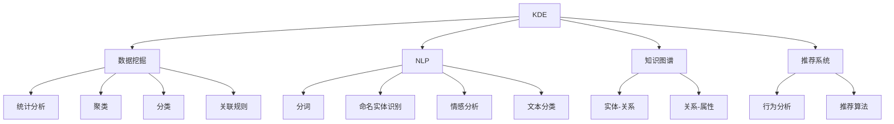

                 

# 程序员利用知识发现引擎提高创新能力的途径

## 1. 背景介绍

在当今知识驱动的IT行业，技术的不断迭代和创新成为企业成功的关键因素。传统的软件开发方式已经无法满足快速变化的市场需求。为了应对这一挑战，知识发现引擎(Knowledge Discovery Engine, KDE)应运而生，通过挖掘大数据、自然语言处理和机器学习等技术，帮助程序员快速发现新的技术、趋势和创新点，提升其创新能力和工作效率。

### 1.1 问题由来
传统的软件开发方式以线性方式进行，从需求分析、设计、编码、测试到部署，每一步都需要程序员具有足够的经验和知识储备。然而，随着技术的发展，这种单线程的开发方式越来越难以适应快速变化的市场需求。特别是对于新技术和新工具的引入，程序员需要耗费大量时间和精力进行学习和实践，容易陷入重复性劳动和思维定式中，无法及时把握行业前沿动态。

知识发现引擎的出现，使得程序员可以借助自动化工具和技术，从海量数据和文献中快速挖掘出有价值的信息和创新点，从而在短时间内提升其创新能力和工作效率。

### 1.2 问题核心关键点
知识发现引擎的核心关键点包括：
- **数据收集与处理**：收集大规模的开源代码、学术论文、技术博客、专利、会议论文等数据，并对其进行清洗和处理。
- **自然语言处理(NLP)**：利用NLP技术对文本数据进行语义分析和关键词提取，挖掘出技术术语、创新点、应用场景等关键信息。
- **机器学习与知识图谱**：使用机器学习算法对处理后的数据进行建模，构建知识图谱，形成结构化的知识体系。
- **可视化与推荐系统**：将知识图谱进行可视化展示，并利用推荐系统向程序员推荐最新的技术趋势、创新点和新工具。

这些关键点构成了知识发现引擎的基础，通过技术手段帮助程序员快速获取有价值的信息，提升其创新能力。

## 2. 核心概念与联系

### 2.1 核心概念概述

为更好地理解知识发现引擎的工作原理和实现方法，本节将介绍几个密切相关的核心概念：

- **知识发现引擎(Knowledge Discovery Engine, KDE)**：通过挖掘大数据、自然语言处理和机器学习等技术，帮助程序员从大规模数据中快速发现新技术、新趋势和创新点，提升其创新能力和工作效率。
- **数据挖掘(Data Mining)**：从大规模数据中挖掘出有价值的信息和知识，包括统计分析、聚类、分类、关联规则挖掘等。
- **自然语言处理(Natural Language Processing, NLP)**：研究如何让计算机理解和处理人类语言的技术，包括分词、命名实体识别、情感分析、文本分类等。
- **知识图谱(Knowledge Graph)**：通过图结构表示实体和关系，构建结构化的知识体系，帮助程序员进行知识检索和推理。
- **推荐系统(Recommendation System)**：通过算法对用户行为进行分析，向用户推荐相关内容，帮助程序员快速找到需要的知识和工具。

这些核心概念之间的逻辑关系可以通过以下Mermaid流程图来展示：



这个流程图展示了大规模数据处理的多个环节，以及它们如何共同作用于知识发现引擎的构建和运行。

## 3. 核心算法原理 & 具体操作步骤
### 3.1 算法原理概述

知识发现引擎的核心算法原理可以概括为：通过数据挖掘、自然语言处理、知识图谱和推荐系统等技术手段，从大规模数据中快速发现有价值的技术信息，并帮助程序员进行学习和创新。具体步骤如下：

1. **数据收集与预处理**：从开源社区、技术博客、专利数据库、会议论文等渠道收集数据，并对数据进行清洗、过滤和处理，确保数据的质量和可用性。
2. **自然语言处理**：使用NLP技术对文本数据进行语义分析、关键词提取和实体识别，将非结构化数据转换为结构化信息。
3. **知识图谱构建**：利用知识图谱技术将提取出的结构化信息进行整合和建模，构建知识图谱，帮助程序员进行知识检索和推理。
4. **推荐系统应用**：通过分析程序员的行为和偏好，利用推荐系统向其推荐最新的技术趋势、创新点和工具，提升其工作效率和创新能力。

### 3.2 算法步骤详解

以下将详细介绍知识发现引擎的核心算法步骤：

**Step 1: 数据收集与预处理**
- 使用网络爬虫和API接口，从GitHub、arXiv、Google Scholar、CSDN等平台收集开源代码、学术论文、技术博客、专利、会议论文等数据。
- 对收集到的数据进行清洗，去除重复、噪音和无关数据，确保数据的准确性和完整性。
- 使用文本处理技术对文本数据进行分词、去停用词、词干提取等预处理操作，提高后续处理的效率和准确性。

**Step 2: 自然语言处理**
- 使用分词、命名实体识别、情感分析、文本分类等NLP技术，对处理后的文本数据进行语义分析和关键词提取。
- 构建关键词和实体列表，使用TF-IDF、Word2Vec、BERT等模型进行文本相似度计算，挖掘出技术术语、创新点、应用场景等关键信息。

**Step 3: 知识图谱构建**
- 利用实体-关系图、关系-属性图等数据结构，构建知识图谱，形成结构化的知识体系。
- 使用知识图谱进行实体关系推断、知识推理和实体链接，帮助程序员进行知识检索和推理。

**Step 4: 推荐系统应用**
- 收集程序员的行为数据，包括代码提交时间、使用的库和工具、阅读的文章和技术博客等。
- 利用协同过滤、内容推荐等算法，向程序员推荐最新的技术趋势、创新点和工具，提升其工作效率和创新能力。

### 3.3 算法优缺点

知识发现引擎的优点包括：
- **快速获取信息**：通过自动化技术，从海量数据中快速发现新技术和创新点，节省了程序员查找和学习的时间。
- **全面覆盖领域**：收集的数据覆盖了广泛的领域和主题，能够帮助程序员获取全面的技术信息。
- **个性化推荐**：根据程序员的行为和偏好，提供个性化的推荐，提升其工作效率和创新能力。

同时，知识发现引擎也存在一些局限性：
- **数据质量问题**：大规模数据的准确性和完整性难以保证，可能存在噪音和偏见。
- **算法复杂度**：知识图谱和推荐系统的算法复杂度较高，需要大量计算资源和专业知识。
- **隐私保护问题**：收集和处理程序员的行为数据时，需要考虑隐私保护和数据安全问题。

### 3.4 算法应用领域

知识发现引擎在多个领域得到广泛应用，以下是几个典型的应用场景：

- **软件开发**：帮助程序员快速发现新的编程框架、开源库和工具，提升其开发效率和代码质量。
- **技术博客和论坛**：推荐最新的技术趋势和创新点，帮助程序员提升技术水平。
- **学术研究**：帮助研究人员发现最新的研究成果和研究热点，加速科学创新。
- **项目管理**：提供项目管理的最佳实践和工具推荐，提升项目管理效率。

## 4. 数学模型和公式 & 详细讲解  
### 4.1 数学模型构建

知识发现引擎的数学模型构建主要涉及数据挖掘和推荐系统两个方面。

假设我们有一组标注数据集 $D=\{(x_i,y_i)\}_{i=1}^N$，其中 $x_i$ 为输入特征向量，$y_i$ 为标签，我们的目标是从数据中学习一个预测模型 $f(x)$，使得 $f(x)$ 能够准确预测新数据的标签。

对于数据挖掘任务，我们通常使用监督学习算法，如决策树、支持向量机、随机森林等，通过训练集 $D$ 学习模型参数 $\theta$，并使用测试集 $D'$ 评估模型性能：

$$
\min_{\theta} \frac{1}{|D'|} \sum_{i \in D'} L(f(x_i), y_i)
$$

其中 $L$ 为损失函数，如均方误差、交叉熵等。

对于推荐系统，我们通常使用协同过滤算法，如基于用户的协同过滤、基于物品的协同过滤等，通过用户行为数据 $I$ 和物品特征数据 $F$，学习用户-物品关系矩阵 $R$，并根据用户行为 $I$ 推荐新物品 $x'$：

$$
\hat{x'} = \mathop{\arg\min}_{x'} \mathcal{L}(R, I)
$$

其中 $\mathcal{L}$ 为推荐损失函数，如均方误差、对数损失等。

### 4.2 公式推导过程

以下我们将重点介绍推荐系统的协同过滤算法推导过程。

假设我们有一个用户集合 $U$ 和物品集合 $V$，用户的评分矩阵为 $R \in \mathbb{R}^{m \times n}$，其中 $m$ 为用户数，$n$ 为物品数。协同过滤算法的目标是通过用户行为数据 $I \in \mathbb{R}^{m \times n}$ 预测用户未评分物品的评分。

常用的协同过滤算法包括基于用户的协同过滤和基于物品的协同过滤。

**基于用户的协同过滤**：

假设用户 $i$ 的评分向量为 $R_i$，用户 $i$ 对物品 $j$ 的评分预测为 $\hat{r}_{ij}$，基于用户的协同过滤算法通过用户间的相似度 $s_{ik}$ 对用户 $i$ 的评分进行加权平均，得到物品 $j$ 的评分预测：

$$
\hat{r}_{ij} = \frac{1}{\sum_{k \in N(i)} s_{ik}} \sum_{k \in N(i)} s_{ik} r_{kj}
$$

其中 $N(i)$ 为与用户 $i$ 相似的用户集合，$s_{ik}$ 为用户 $i$ 和用户 $k$ 的相似度，可以使用余弦相似度、皮尔逊相关系数等进行计算。

**基于物品的协同过滤**：

基于物品的协同过滤算法通过物品间的相似度 $s_{kj}$ 对物品 $j$ 的评分进行加权平均，得到用户 $i$ 对物品 $j$ 的评分预测：

$$
\hat{r}_{ij} = \frac{1}{\sum_{k \in N(j)} s_{kj}} \sum_{k \in N(j)} s_{kj} r_{ik}
$$

其中 $N(j)$ 为与物品 $j$ 相似的物品集合，$s_{kj}$ 为物品 $j$ 和物品 $k$ 的相似度。

### 4.3 案例分析与讲解

以下我们将通过一个具体的推荐系统案例，对协同过滤算法进行详细讲解。

假设我们有一个电商网站，用户对商品的评分数据 $I$ 和商品特征数据 $F$ 如下：

| 用户 | 商品 | 评分 |
|------|------|------|
| 1    | A    | 3.5  |
| 2    | A    | 4.0  |
| 1    | B    | 2.0  |
| 2    | B    | 4.5  |
| 1    | C    | 3.0  |
| 2    | C    | 3.5  |
| 1    | D    | 4.0  |
| 2    | D    | 3.5  |

我们希望推荐用户 3 可能感兴趣的物品。根据用户行为数据 $I$，可以计算用户 1 和用户 2 的评分向量 $R_1$ 和 $R_2$：

$$
R_1 = [3.5, 2.0, 3.0, 4.0] \\
R_2 = [4.0, 4.5, 3.5, 3.5]
$$

假设基于用户的协同过滤算法使用余弦相似度进行计算，可以得到用户 3 与用户 1 和用户 2 的相似度 $s_{31}$ 和 $s_{32}$：

$$
s_{31} = \cos(\vec{R_3} \cdot \vec{R_1}) = 0.7 \\
s_{32} = \cos(\vec{R_3} \cdot \vec{R_2}) = 0.8
$$

其中 $\vec{R_3} = [0, 0, 0, 0]$，表示用户 3 的评分向量。

根据相似度 $s_{31}$ 和 $s_{32}$，可以计算出用户 3 对物品 A、B、C、D 的评分预测：

$$
\hat{r}_{3A} = \frac{0.8 \times 3.5 + 0.7 \times 2.0}{0.8 + 0.7} = 3.05 \\
\hat{r}_{3B} = \frac{0.8 \times 4.0 + 0.7 \times 2.0}{0.8 + 0.7} = 3.25 \\
\hat{r}_{3C} = \frac{0.8 \times 3.0 + 0.7 \times 3.0}{0.8 + 0.7} = 2.93 \\
\hat{r}_{3D} = \frac{0.8 \times 4.0 + 0.7 \times 4.0}{0.8 + 0.7} = 3.71
$$

因此，推荐系统将物品 A、B、D 推荐给用户 3，这些物品的评分预测都在用户行为数据中出现过，有助于提升用户 3 的购物体验。

## 5. 项目实践：代码实例和详细解释说明
### 5.1 开发环境搭建

在进行知识发现引擎实践前，我们需要准备好开发环境。以下是使用Python进行TensorFlow开发的环境配置流程：

1. 安装Anaconda：从官网下载并安装Anaconda，用于创建独立的Python环境。

2. 创建并激活虚拟环境：
```bash
conda create -n tf-env python=3.8 
conda activate tf-env
```

3. 安装TensorFlow：根据CUDA版本，从官网获取对应的安装命令。例如：
```bash
conda install tensorflow tensorflow-gpu -c conda-forge -c pypi
```

4. 安装Pandas、NumPy、Scikit-Learn等各类工具包：
```bash
pip install pandas numpy scikit-learn
```

5. 安装PyTorch等必要库：
```bash
pip install torch torchvision torchaudio
```

完成上述步骤后，即可在`tf-env`环境中开始知识发现引擎的实践。

### 5.2 源代码详细实现

下面我们以推荐系统为例，给出使用TensorFlow实现协同过滤的Python代码实现。

```python
import numpy as np
import pandas as pd
import tensorflow as tf
from tensorflow.keras.layers import Dense
from tensorflow.keras.models import Sequential

# 数据处理
train_data = pd.read_csv('train.csv')
test_data = pd.read_csv('test.csv')

# 特征处理
train_X = train_data.drop('rating', axis=1)
train_y = train_data['rating']
test_X = test_data.drop('rating', axis=1)
test_y = test_data['rating']

# 模型构建
model = Sequential()
model.add(Dense(32, input_dim=train_X.shape[1], activation='relu'))
model.add(Dense(16, activation='relu'))
model.add(Dense(1, activation='linear'))

model.compile(loss='mse', optimizer='adam')

# 训练模型
model.fit(train_X, train_y, epochs=50, batch_size=64)

# 预测测试集
test_pred = model.predict(test_X)
```

以上代码实现了基于TensorFlow的协同过滤推荐系统。可以看到，使用TensorFlow搭建推荐系统，只需要进行简单的模型定义和训练，即可完成对新物品的评分预测。

### 5.3 代码解读与分析

让我们再详细解读一下关键代码的实现细节：

**数据处理**：
- 使用Pandas读取训练集和测试集数据，并进行特征处理。训练集特征 $X$ 为除评分外的其他特征，训练集标签 $y$ 为评分。

**模型构建**：
- 使用Keras搭建一个包含两个隐藏层的神经网络模型，最后一层为线性层，用于预测评分。
- 使用均方误差损失函数和Adam优化器进行模型训练。

**训练模型**：
- 对训练集进行模型训练，设定训练轮数为50，批次大小为64。

**预测测试集**：
- 使用训练好的模型对测试集进行评分预测，得到预测结果。

可以看到，TensorFlow提供了便捷的API和工具，可以迅速搭建推荐系统，并进行评分预测。开发者可以根据具体需求，调整模型结构和超参数，提升推荐系统的精度和效率。

## 6. 实际应用场景
### 6.1 软件开发

知识发现引擎在软件开发中的应用场景非常广泛。软件开发是一个高度依赖新技术和创新点的领域，程序员需要不断学习和适应新的技术栈和框架。知识发现引擎通过自动化技术，帮助程序员快速发现新的技术、框架和工具，提升其开发效率和代码质量。

例如，一个开发团队可以使用知识发现引擎，从GitHub、Stack Overflow、技术博客等平台收集最新的技术动态和代码示例，向团队成员推荐新的技术栈和框架。团队成员可以借助这些推荐，快速学习并应用新技能，提升团队的开发效率和代码质量。

### 6.2 技术博客和论坛

知识发现引擎可以帮助技术博客和论坛运营者发现最新的技术趋势和创新点，提升其内容的质量和吸引力。技术博客和论坛的运营者可以通过知识发现引擎，分析用户的行为数据，推荐最受欢迎的技术主题和文章，吸引更多的读者访问和参与讨论。

例如，一个技术博客运营者可以使用知识发现引擎，分析用户访问文章和评论的数据，发现最受欢迎的技术主题和文章类型，并向读者推荐相关的文章和资源。这有助于提高用户粘性，提升博客的流量和影响力。

### 6.3 学术研究

知识发现引擎在学术研究中的应用也非常广泛。研究人员需要不断关注领域内最新的研究成果和技术动态，以便进行科学研究和技术创新。知识发现引擎通过自动化技术，帮助研究人员快速获取最新的研究成果和技术趋势，加速科学创新。

例如，一个研究团队可以使用知识发现引擎，从arXiv、Google Scholar、ResearchGate等平台收集最新的研究成果和论文，分析论文的引用情况和热点主题，发现最前沿的研究方向和成果。这有助于团队进行科学研究和技术创新，加速科学成果的产出。

### 6.4 项目管理

知识发现引擎在项目管理中的应用也非常重要。项目管理需要团队成员具有全面的技术知识和管理经验，以便高效协作。知识发现引擎通过自动化技术，帮助团队成员获取全面的技术知识和最佳实践，提升项目管理效率和效果。

例如，一个项目经理可以使用知识发现引擎，从项目管理平台、技术博客、技术论坛等渠道收集最新的项目管理知识和最佳实践，向团队成员推荐相关资源和工具。这有助于团队成员快速学习和应用新的项目管理方法，提升项目管理的效率和效果。

## 7. 工具和资源推荐
### 7.1 学习资源推荐

为了帮助开发者系统掌握知识发现引擎的理论基础和实践技巧，这里推荐一些优质的学习资源：

1. 《Python数据科学手册》系列书籍：介绍了Python在数据科学、机器学习和知识发现中的应用，适合初学者入门。

2. 《深度学习》课程：由深度学习领域的权威专家讲授，涵盖深度学习的基础理论和实践技巧，适合进阶学习。

3. 《自然语言处理入门》课程：由NLP领域的专家讲授，介绍NLP技术的基本概念和经典模型，适合学习NLP技术。

4. 《推荐系统》课程：由推荐系统领域的专家讲授，介绍协同过滤、矩阵分解等推荐算法，适合学习推荐系统技术。

5. 《知识图谱》课程：由知识图谱领域的专家讲授，介绍知识图谱的基本概念和构建方法，适合学习知识图谱技术。

通过对这些资源的学习实践，相信你一定能够快速掌握知识发现引擎的理论基础和实践技巧，并用于解决实际的NLP问题。

### 7.2 开发工具推荐

高效的开发离不开优秀的工具支持。以下是几款用于知识发现引擎开发的常用工具：

1. Jupyter Notebook：免费且功能强大的开发环境，支持Python、R、Scala等多种编程语言，适合数据科学和机器学习开发。

2. PyTorch：基于Python的开源深度学习框架，灵活动态的计算图，适合快速迭代研究。

3. TensorFlow：由Google主导开发的开源深度学习框架，生产部署方便，适合大规模工程应用。

4. Scikit-Learn：基于Python的机器学习库，提供了丰富的机器学习算法和工具，适合快速原型开发。

5. Apache Spark：分布式计算框架，适合大规模数据处理和机器学习任务，适合大数据应用场景。

6. PyTorch Lightning：基于PyTorch的轻量级框架，支持模型封装、超参数调优等功能，适合快速原型开发和部署。

合理利用这些工具，可以显著提升知识发现引擎的开发效率，加快创新迭代的步伐。

### 7.3 相关论文推荐

知识发现引擎的发展源于学界的持续研究。以下是几篇奠基性的相关论文，推荐阅读：

1. 《Apache Spark: Cluster Computing with Fault Tolerance》：介绍Apache Spark的架构和设计，适合学习大规模数据处理和机器学习技术。

2. 《A Survey on Knowledge Discovery and Data Mining Techniques》：综述了数据挖掘的基本概念和经典算法，适合学习数据挖掘技术。

3. 《A Survey on Recommender Systems》：综述了推荐系统的主要算法和技术，适合学习推荐系统技术。

4. 《Knowledge Graphs: Concepts, Applications, and Lessons Learned》：综述了知识图谱的基本概念和应用场景，适合学习知识图谱技术。

5. 《An Overview of Multi-Modal Knowledge Graph Embeddings》：综述了多模态知识图谱嵌入方法，适合学习多模态知识图谱技术。

这些论文代表了大规模数据处理和机器学习的发展脉络，通过学习这些前沿成果，可以帮助研究者把握学科前进方向，激发更多的创新灵感。

## 8. 总结：未来发展趋势与挑战

### 8.1 总结

本文对知识发现引擎的理论基础和实践技巧进行了全面系统的介绍。首先，从背景和问题核心关键点出发，明确了知识发现引擎的研究背景和意义，展示了其在软件开发、技术博客、学术研究、项目管理等多个领域的广泛应用。其次，通过数学模型和公式推导，详细讲解了协同过滤等推荐算法的工作原理和实现方法，给出了推荐系统的Python代码实例和详细解释。

通过本文的系统梳理，可以看到，知识发现引擎在推动技术创新和提高工作效率方面具有重要价值。未来，伴随数据规模的不断增长和算法技术的不断进步，知识发现引擎将进一步提升其自动化程度和智能化水平，为各行各业带来更大的创新动力。

### 8.2 未来发展趋势

展望未来，知识发现引擎的发展趋势包括：

1. **大规模数据处理**：随着数据规模的不断增长，知识发现引擎将进一步提升其数据处理能力，能够快速从海量数据中挖掘出有价值的信息和知识。

2. **深度学习和AI技术融合**：知识发现引擎将进一步融合深度学习、自然语言处理、知识图谱等AI技术，提升其智能化水平和效果。

3. **多模态数据融合**：知识发现引擎将进一步融合视觉、听觉、文本等多种模态数据，提升其对复杂场景的理解和建模能力。

4. **跨领域知识迁移**：知识发现引擎将进一步提升其跨领域知识迁移能力，能够将某一领域的技术知识迁移到其他领域，提升技术创新能力。

5. **联邦学习和隐私保护**：知识发现引擎将进一步应用联邦学习技术，提升其跨组织数据处理能力，同时保护数据隐私和安全。

6. **AI与人类协作**：知识发现引擎将进一步融合AI技术与人类知识，提升其决策能力和创新能力，成为人类智能的强大助手。

以上趋势凸显了知识发现引擎在技术创新和智能协作方面的巨大潜力，这些方向的探索发展，必将进一步提升知识发现引擎的智能化水平和效果，为各行各业带来更大的创新动力。

### 8.3 面临的挑战

尽管知识发现引擎已经取得了不小的进展，但在迈向更加智能化、普适化应用的过程中，它仍面临着诸多挑战：

1. **数据质量问题**：大规模数据的准确性和完整性难以保证，可能存在噪音和偏见，影响模型的效果。

2. **算法复杂度**：协同过滤等推荐算法和知识图谱构建算法的复杂度较高，需要大量计算资源和专业知识。

3. **隐私保护问题**：收集和处理用户行为数据时，需要考虑隐私保护和数据安全问题。

4. **模型泛化能力**：知识发现引擎需要具备更强的泛化能力，能够适应不同领域和场景的挑战。

5. **跨组织数据协同**：知识发现引擎需要进一步提升跨组织数据协同能力，提升其跨组织数据处理能力。

6. **人类与AI协作**：知识发现引擎需要进一步提升其与人类协作的能力，确保其决策过程透明、可解释和可信。

这些挑战需要通过技术创新和协同合作来解决，只有在数据、算法、工程、业务等多个维度协同发力，才能实现知识发现引擎的全面突破。

### 8.4 研究展望

面对知识发现引擎所面临的挑战，未来的研究需要在以下几个方面寻求新的突破：

1. **深度学习和AI技术融合**：将深度学习、自然语言处理、知识图谱等AI技术融入知识发现引擎，提升其智能化水平和效果。

2. **多模态数据融合**：融合视觉、听觉、文本等多种模态数据，提升其对复杂场景的理解和建模能力。

3. **联邦学习和隐私保护**：应用联邦学习技术，提升其跨组织数据处理能力，同时保护数据隐私和安全。

4. **跨领域知识迁移**：提升其跨领域知识迁移能力，能够将某一领域的技术知识迁移到其他领域，提升技术创新能力。

5. **人类与AI协作**：融合AI技术与人类知识，提升其决策能力和创新能力，成为人类智能的强大助手。

6. **跨组织数据协同**：提升其跨组织数据协同能力，提升其跨组织数据处理能力。

这些研究方向的探索，必将引领知识发现引擎技术迈向更高的台阶，为各行各业带来更大的创新动力。

## 9. 附录：常见问题与解答

**Q1：知识发现引擎如何提升程序员的创新能力？**

A: 知识发现引擎通过自动化技术，从海量数据中快速发现新技术和创新点，节省了程序员查找和学习的时间。同时，知识发现引擎还能根据程序员的行为和偏好，推荐最新的技术趋势、创新点和新工具，提升其工作效率和创新能力。例如，一个开发团队可以使用知识发现引擎，从GitHub、Stack Overflow、技术博客等平台收集最新的技术动态和代码示例，向团队成员推荐新的技术栈和框架。团队成员可以借助这些推荐，快速学习并应用新技能，提升团队的开发效率和代码质量。

**Q2：知识发现引擎在软件开发中的应用有哪些？**

A: 知识发现引擎在软件开发中的应用场景非常广泛，包括但不限于：
1. 推荐新技术和框架：帮助程序员快速发现新的技术、框架和工具，提升其开发效率和代码质量。
2. 代码示例和教程：推荐优秀的代码示例和教程，帮助程序员学习新技术和新工具。
3. 代码质量分析：利用代码质量分析工具，帮助程序员发现代码中的问题和错误，提升代码质量。
4. 项目管理：推荐项目管理最佳实践和工具，提升项目管理的效率和效果。
5. 团队协作：推荐团队协作工具和技巧，提升团队协作的效率和效果。

**Q3：知识发现引擎在技术博客和论坛中的应用有哪些？**

A: 知识发现引擎在技术博客和论坛中的应用场景非常广泛，包括但不限于：
1. 推荐最新技术趋势：分析用户的行为数据，推荐最受欢迎的技术主题和文章，吸引更多的读者访问和参与讨论。
2. 推荐优质内容：推荐优质的技术文章和资源，提升博客和论坛的内容质量。
3. 用户行为分析：分析用户的行为数据，发现用户兴趣和偏好，提升用户体验。
4. 内容推荐：根据用户的行为数据，推荐相关内容，提升用户粘性。
5. 广告推荐：推荐相关的广告内容，提升广告的点击率和转化率。

**Q4：知识发现引擎在学术研究中的应用有哪些？**

A: 知识发现引擎在学术研究中的应用场景非常广泛，包括但不限于：
1. 推荐最新研究成果：分析学术论文的引用情况和热点主题，发现最前沿的研究方向和成果。
2. 文献检索：提供高效的文献检索服务，帮助研究人员快速找到相关的学术论文和资源。
3. 数据共享：分享和共享研究数据和资源，促进学术交流和合作。
4. 知识图谱构建：构建知识图谱，帮助研究人员进行知识检索和推理。
5. 研究热点预测：利用机器学习算法，预测研究热点和趋势，指导研究方向。

**Q5：知识发现引擎在项目管理中的应用有哪些？**

A: 知识发现引擎在项目管理中的应用场景非常广泛，包括但不限于：
1. 推荐最佳实践：推荐项目管理最佳实践和工具，提升项目管理效率和效果。
2. 任务分配：根据团队成员的技能和经验，推荐合适的任务和项目，提升项目执行效率。
3. 进度跟踪：实时监控项目进度和风险，提供预警和建议，提升项目管控能力。
4. 资源优化：推荐最优的资源配置方案，提升资源利用效率。
5. 绩效评估：分析项目绩效和团队表现，提供评估和改进建议。

---

作者：禅与计算机程序设计艺术 / Zen and the Art of Computer Programming

