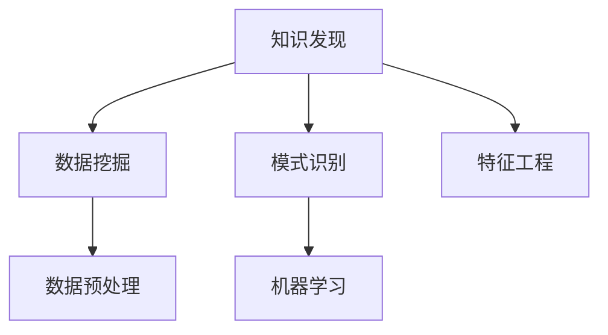

                 

# 程序员利用知识发现引擎提高解决问题能力

## 1. 背景介绍

### 1.1 问题由来
现代软件开发过程中，程序员需要解决的问题日益复杂多变。面对层出不穷的技术迭代和庞大的代码库，如何在短时间内高效定位并解决问题，成为每一位开发者面临的挑战。传统的方法往往依赖经验积累和直觉判断，但这种方法在问题复杂、数据量庞大时往往力不从心。

在这样的背景下，知识发现(Knowledge Discovery, KD)技术应运而生。通过数据挖掘和模式识别等技术，知识发现引擎可以自动分析数据，识别出问题的潜在模式和知识，从而提升程序员的解决效率和问题质量。

### 1.2 问题核心关键点
知识发现技术在软件开发中的应用，主要集中在以下几个方面：
- 代码缺陷定位：通过分析代码库的统计数据，自动定位代码中的潜在缺陷和常见问题，辅助程序员进行代码审查和优化。
- 问题分类和分类：对大量的问题报告和故障日志进行自动分类和归纳，识别出不同类型的问题及其特征，提升问题处理的效率和精确度。
- 知识图谱构建：构建基于问题的知识图谱，关联问题与解决方案，帮助程序员快速找到合适的解决方案，提高问题解决的智能化水平。

这些关键点共同构成了知识发现技术在软件开发中的应用框架，使程序员能够更高效地解决复杂问题。

### 1.3 问题研究意义
研究如何利用知识发现技术提升软件开发中的问题解决能力，对于提升开发效率、保障软件质量、降低开发成本具有重要意义：

1. 提升开发效率。知识发现技术可以自动分析大量数据，识别出问题的潜在模式和知识，辅助程序员快速定位和解决问题，节省开发时间。
2. 保障软件质量。知识发现技术可以识别出代码中的潜在缺陷和常见问题，辅助代码审查和优化，减少错误和缺陷。
3. 降低开发成本。利用知识发现技术，可以在数据中提取有价值的信息，避免重复劳动和无效开发，提高开发效率和产出质量。
4. 提高问题解决的智能化水平。知识发现技术可以自动分析问题数据，识别出问题的特征和解决方案，提升问题解决的精确度和智能化水平。
5. 推动软件开发技术的持续进步。知识发现技术为软件开发带来了新的视角和方法，推动了软件开发技术和工具的不断进步。

## 2. 核心概念与联系

### 2.1 核心概念概述

为了更好地理解知识发现技术在软件开发中的应用，本节将介绍几个密切相关的核心概念：

- 知识发现(Knowledge Discovery, KD)：通过数据挖掘和模式识别等技术，自动分析数据中潜在的模式和知识。
- 数据挖掘(Data Mining)：从大规模数据中提取有用的信息和模式，是知识发现技术的基础。
- 模式识别(Pattern Recognition)：识别数据中的规律和特征，是知识发现的重要手段。
- 数据预处理：对原始数据进行清洗、归一化和特征提取等操作，提升数据质量和分析效果。
- 机器学习(Machine Learning)：使用算法自动学习数据中的规律，是知识发现的重要方法。
- 特征工程(Feature Engineering)：设计和选择对问题有预测能力的特征，提升模型的效果。

这些核心概念之间的逻辑关系可以通过以下Mermaid流程图来展示：



这个流程图展示了这个领域的核心概念及其之间的关系：

1. 知识发现通过数据挖掘和模式识别等技术，从原始数据中提取有用的信息和模式。
2. 数据预处理是数据挖掘和模式识别的前提，通过清洗和特征提取等操作提升数据质量。
3. 机器学习是知识发现的重要方法，通过自动学习数据中的规律来发现知识。
4. 特征工程是提升模型效果的关键，通过选择和设计对问题有预测能力的特征来增强模型。

## 3. 核心算法原理 & 具体操作步骤

### 3.1 算法原理概述

知识发现技术在软件开发中的应用，主要基于数据挖掘和机器学习等算法。其核心思想是：通过自动分析开发过程产生的大量数据，识别出潜在的模式和知识，辅助程序员进行问题定位和解决。

形式化地，假设开发过程中的数据集为 $D=\{(x_i,y_i)\}_{i=1}^N$，其中 $x_i$ 为输入特征，$y_i$ 为问题标签。知识发现模型的目标是最小化经验风险，即：

$$
\theta^* = \mathop{\arg\min}_{\theta} \mathcal{L}(\theta,D)
$$

其中 $\mathcal{L}$ 为损失函数，用于衡量模型在数据集上的预测准确性。常用的损失函数包括交叉熵损失、均方误差损失等。

通过梯度下降等优化算法，知识发现模型不断更新模型参数 $\theta$，最小化损失函数 $\mathcal{L}$，使得模型能够更准确地预测问题标签。一旦模型训练完成，便可应用于开发过程，自动分析代码库、问题报告等数据，识别出潜在的问题和知识，辅助程序员进行问题定位和解决。

### 3.2 算法步骤详解

知识发现技术在软件开发中的应用，通常包括以下几个关键步骤：

**Step 1: 数据收集与预处理**
- 收集开发过程中产生的各类数据，如代码库、问题报告、测试日志等。
- 对数据进行清洗、归一化和特征提取等预处理操作，提升数据质量和可分析性。

**Step 2: 特征选择与工程**
- 选择和设计对问题有预测能力的特征，构建特征向量 $x_i$。
- 使用特征工程方法，如PCA、LDA等，进一步优化特征提取，提升模型效果。

**Step 3: 模型选择与训练**
- 根据问题的类型，选择合适的机器学习模型，如分类、回归、聚类等。
- 使用训练数据集 $D$ 对模型进行训练，最小化损失函数 $\mathcal{L}$。
- 使用验证集评估模型性能，调整模型参数，防止过拟合。

**Step 4: 模型评估与测试**
- 使用测试集对训练好的模型进行测试，评估其预测性能。
- 根据模型性能，选择最优模型进行应用，分析数据中的潜在问题和知识。

**Step 5: 问题定位与解决**
- 将模型应用于开发过程中产生的数据，自动分析数据中的模式和知识。
- 根据模型输出，辅助程序员进行问题定位和解决，提供详细的报告和建议。

以上是知识发现技术在软件开发中的应用的一般流程。在实际应用中，还需要针对具体问题的特点，对模型选择、特征工程等环节进行优化设计，以进一步提升问题解决的效率和效果。

### 3.3 算法优缺点

知识发现技术在软件开发中的应用具有以下优点：
1. 自动分析数据，识别潜在问题和知识，辅助程序员进行问题定位和解决。
2. 通过自动分析和归纳数据，提升问题处理的效率和精确度。
3. 可以识别出代码中的潜在缺陷和常见问题，辅助代码审查和优化。
4. 构建基于问题的知识图谱，提供解决方案的快速查询和推荐。

同时，该方法也存在一定的局限性：
1. 数据质量和量级影响模型效果。数据的不完整、噪声和不一致可能会影响模型性能。
2. 模型复杂度和训练成本高。大规模数据集和复杂模型需要大量计算资源和时间。
3. 模型解释性不足。知识发现模型的决策过程往往缺乏可解释性，难以对其推理逻辑进行分析和调试。
4. 数据隐私和安全问题。开发过程中产生的数据可能包含敏感信息，需要严格保护数据隐私和安全。

尽管存在这些局限性，但就目前而言，知识发现技术仍是提升软件开发问题解决能力的重要手段。未来相关研究的重点在于如何进一步降低知识发现对数据质量和量的依赖，提高模型的少样本学习和跨领域迁移能力，同时兼顾可解释性和数据隐私等因素。

### 3.4 算法应用领域

知识发现技术在软件开发中的应用，已在多个领域得到广泛应用，例如：

- 代码缺陷检测：自动分析代码库中的统计数据，识别出代码中的潜在缺陷和常见问题，辅助代码审查和优化。
- 问题分类和归纳：对大量的问题报告和故障日志进行自动分类和归纳，识别出不同类型的问题及其特征，提升问题处理的效率和精确度。
- 知识图谱构建：构建基于问题的知识图谱，关联问题与解决方案，帮助程序员快速找到合适的解决方案，提高问题解决的智能化水平。
- 开发过程分析：分析开发过程中的数据，识别出流程中的瓶颈和问题，优化开发过程，提高开发效率和产出质量。
- 资源调度优化：根据开发团队成员的技能和经验，优化资源调度，提升开发效率和产出质量。

除了上述这些经典应用外，知识发现技术还被创新性地应用到更多场景中，如代码智能补全、代码变更推荐、版本控制自动化等，为软件开发带来了全新的突破。随着知识发现方法的不断进步，相信知识发现技术将在更广阔的应用领域大放异彩。

## 4. 数学模型和公式 & 详细讲解  
### 4.1 数学模型构建

本节将使用数学语言对知识发现技术在软件开发中的应用进行更加严格的刻画。

假设开发过程中的数据集为 $D=\{(x_i,y_i)\}_{i=1}^N$，其中 $x_i$ 为输入特征，$y_i$ 为问题标签。

定义模型 $M_{\theta}$ 在数据集 $D$ 上的经验风险为：

$$
\mathcal{L}(\theta) = \frac{1}{N} \sum_{i=1}^N \ell(M_{\theta}(x_i),y_i)
$$

其中 $\ell$ 为损失函数，用于衡量模型在数据集上的预测准确性。

在实践中，我们通常使用基于梯度的优化算法（如SGD、Adam等）来近似求解上述最优化问题。设 $\eta$ 为学习率，$\lambda$ 为正则化系数，则参数的更新公式为：

$$
\theta \leftarrow \theta - \eta \nabla_{\theta}\mathcal{L}(\theta) - \eta\lambda\theta
$$

其中 $\nabla_{\theta}\mathcal{L}(\theta)$ 为损失函数对参数 $\theta$ 的梯度，可通过反向传播算法高效计算。

### 4.2 公式推导过程

以下我们以分类任务为例，推导损失函数及其梯度的计算公式。

假设模型 $M_{\theta}$ 在输入 $x$ 上的输出为 $\hat{y}=M_{\theta}(x) \in [0,1]$，表示样本属于正类的概率。真实标签 $y \in \{0,1\}$。则二分类交叉熵损失函数定义为：

$$
\ell(M_{\theta}(x),y) = -[y\log \hat{y} + (1-y)\log (1-\hat{y})]
$$

将其代入经验风险公式，得：

$$
\mathcal{L}(\theta) = -\frac{1}{N}\sum_{i=1}^N [y_i\log M_{\theta}(x_i)+(1-y_i)\log(1-M_{\theta}(x_i))]
$$

根据链式法则，损失函数对参数 $\theta_k$ 的梯度为：

$$
\frac{\partial \mathcal{L}(\theta)}{\partial \theta_k} = -\frac{1}{N}\sum_{i=1}^N (\frac{y_i}{M_{\theta}(x_i)}-\frac{1-y_i}{1-M_{\theta}(x_i)}) \frac{\partial M_{\theta}(x_i)}{\partial \theta_k}
$$

其中 $\frac{\partial M_{\theta}(x_i)}{\partial \theta_k}$ 可进一步递归展开，利用自动微分技术完成计算。

在得到损失函数的梯度后，即可带入参数更新公式，完成模型的迭代优化。重复上述过程直至收敛，最终得到适应问题集的最优模型参数 $\theta^*$。

## 5. 项目实践：代码实例和详细解释说明
### 5.1 开发环境搭建

在进行知识发现实践前，我们需要准备好开发环境。以下是使用Python进行Scikit-learn开发的环境配置流程：

1. 安装Anaconda：从官网下载并安装Anaconda，用于创建独立的Python环境。

2. 创建并激活虚拟环境：
```bash
conda create -n kd-env python=3.8 
conda activate kd-env
```

3. 安装Scikit-learn：
```bash
pip install scikit-learn
```

4. 安装各类工具包：
```bash
pip install numpy pandas scikit-learn matplotlib tqdm jupyter notebook ipython
```

完成上述步骤后，即可在`kd-env`环境中开始知识发现实践。

### 5.2 源代码详细实现

这里我们以代码缺陷检测任务为例，给出使用Scikit-learn对数据进行知识发现的PyTorch代码实现。

首先，定义代码缺陷检测任务的数据处理函数：

```python
import pandas as pd
import numpy as np

def read_data(file_path):
    df = pd.read_csv(file_path)
    return df

def clean_data(df):
    # 数据清洗和预处理
    df.dropna(inplace=True)
    df.drop_duplicates(inplace=True)
    df = df.drop(columns=['id'])
    return df

def prepare_data(df):
    # 特征提取和构建特征向量
    features = df.drop(columns=['defect'])
    labels = df['defect']
    features = pd.get_dummies(features)
    features = features.to_numpy()
    labels = labels.to_numpy()
    return features, labels

# 读取数据
file_path = 'code_defect.csv'
data = read_data(file_path)

# 数据清洗和预处理
cleaned_data = clean_data(data)

# 特征提取和构建特征向量
features, labels = prepare_data(cleaned_data)
```

然后，定义模型和优化器：

```python
from sklearn.ensemble import RandomForestClassifier
from sklearn.metrics import accuracy_score

# 构建模型
model = RandomForestClassifier(n_estimators=100, random_state=42)

# 训练模型
model.fit(features, labels)
```

接着，定义训练和评估函数：

```python
from sklearn.model_selection import train_test_split

# 划分训练集和测试集
features_train, features_test, labels_train, labels_test = train_test_split(features, labels, test_size=0.2, random_state=42)

# 训练模型
model.fit(features_train, labels_train)

# 评估模型
labels_pred = model.predict(features_test)
accuracy = accuracy_score(labels_test, labels_pred)
print(f"Accuracy: {accuracy:.2f}")
```

最后，启动训练流程并在测试集上评估：

```python
# 训练模型
model.fit(features_train, labels_train)

# 评估模型
labels_pred = model.predict(features_test)
accuracy = accuracy_score(labels_test, labels_pred)
print(f"Accuracy: {accuracy:.2f}")
```

以上就是使用Scikit-learn对数据进行知识发现的完整代码实现。可以看到，Scikit-learn提供了丰富的机器学习算法和工具，可以方便地进行知识发现实践。

### 5.3 代码解读与分析

让我们再详细解读一下关键代码的实现细节：

**read_data函数**：
- 读取CSV文件中的数据，将其转换为Pandas DataFrame对象。

**clean_data函数**：
- 对数据进行清洗，包括去除缺失值和重复样本，并去除id列。

**prepare_data函数**：
- 对数据进行特征提取，使用one-hot编码将分类特征转换为数值特征。
- 将特征和标签转换为numpy数组，方便后续模型训练和评估。

**RandomForestClassifier模型**：
- 使用随机森林分类器进行模型构建。

**train_test_split函数**：
- 对数据集进行划分，将数据集分为训练集和测试集。

**fit函数**：
- 使用训练集对模型进行训练，最小化经验风险。

**predict函数**：
- 使用测试集对模型进行预测，输出预测结果。

**accuracy_score函数**：
- 计算模型在测试集上的准确率，评估模型性能。

可以看到，Scikit-learn的机器学习库提供了一系列简单易用的API，可以方便地进行模型构建和评估，非常适合初学者入门和快速实验。

## 6. 实际应用场景
### 6.1 智能问答系统

知识发现技术在智能问答系统中的应用，可以显著提升系统的智能化水平和响应速度。传统问答系统往往依赖人工构建知识库，成本高且难以及时更新。而使用知识发现技术，可以自动从海量数据中挖掘出常见问题和答案，构建动态知识库，实时更新和维护，提高系统的响应速度和智能化水平。

在技术实现上，可以收集用户在问答系统中的历史记录和反馈，自动分类和归纳问题，提取问题和答案的特征。通过构建知识图谱，关联问题和答案，自动回答用户问题，提升用户体验。对于新出现的问题，系统可以自动学习并扩展知识库，实现快速更新和扩展。

### 6.2 软件开发自动化

知识发现技术在软件开发中的应用，可以实现开发过程的自动化和智能化。传统软件开发往往依赖人工审查和测试，效率低且易出错。而使用知识发现技术，可以自动分析开发过程中的数据，识别出代码中的潜在问题和常见问题，辅助代码审查和优化。通过构建知识图谱，关联问题和解决方案，提供代码变更建议和自动化测试，提高开发效率和产出质量。

在技术实现上，可以收集开发过程中的代码变更、缺陷报告和测试日志等数据，自动分析代码中的缺陷模式和常见问题。通过构建知识图谱，关联问题和解决方案，提供代码变更建议和自动化测试，提高开发效率和产出质量。

### 6.3 运维自动化

知识发现技术在运维中的应用，可以实现运维过程的自动化和智能化。传统运维往往依赖人工监控和调试，成本高且效率低。而使用知识发现技术，可以自动分析运维数据，识别出系统的瓶颈和异常，辅助运维人员的调试和优化。通过构建知识图谱，关联问题和解决方案，提供运维建议和自动化调度，提升运维效率和系统稳定性。

在技术实现上，可以收集运维过程中的日志数据和监控数据，自动分析系统性能和异常。通过构建知识图谱，关联问题和解决方案，提供运维建议和自动化调度，提升运维效率和系统稳定性。

### 6.4 未来应用展望

随着知识发现方法的不断进步，其在软件开发中的应用前景将更加广阔。

在智慧医疗领域，知识发现技术可以用于医疗问答、病历分析、药物研发等任务，提升医疗服务的智能化水平，辅助医生诊疗，加速新药开发进程。

在智能教育领域，知识发现技术可以用于作业批改、学情分析、知识推荐等方面，因材施教，促进教育公平，提高教学质量。

在智慧城市治理中，知识发现技术可以用于城市事件监测、舆情分析、应急指挥等环节，提高城市管理的自动化和智能化水平，构建更安全、高效的未来城市。

此外，在企业生产、社会治理、文娱传媒等众多领域，知识发现技术也将不断涌现，为传统行业数字化转型升级提供新的技术路径。相信随着技术的日益成熟，知识发现技术将成为软件开发的重要范式，推动人工智能技术在各行业的应用。

## 7. 工具和资源推荐
### 7.1 学习资源推荐

为了帮助开发者系统掌握知识发现技术在软件开发中的应用，这里推荐一些优质的学习资源：

1. 《Python机器学习》系列博文：由大模型技术专家撰写，深入浅出地介绍了机器学习在软件开发中的应用。

2. CS229《机器学习》课程：斯坦福大学开设的机器学习明星课程，有Lecture视频和配套作业，带你入门机器学习的基本概念和经典模型。

3. 《TensorFlow实战Google深度学习》书籍：TensorFlow库的作者所著，全面介绍了如何使用TensorFlow进行机器学习任务开发，包括知识发现在内的诸多范式。

4. Scikit-learn官方文档：Scikit-learn库的官方文档，提供了海量机器学习算法和工具，是进行知识发现任务开发的利器。

5. Kaggle竞赛平台：全球知名的数据竞赛平台，汇集了海量数据集和机器学习竞赛，适合学习和实践知识发现技术。

通过对这些资源的学习实践，相信你一定能够快速掌握知识发现技术的精髓，并用于解决实际的开发问题。

### 7.2 开发工具推荐

高效的开发离不开优秀的工具支持。以下是几款用于知识发现技术在软件开发中的应用开发的常用工具：

1. Python：作为目前最流行的编程语言，Python拥有丰富的第三方库和框架，适合快速迭代研究。

2. Scikit-learn：基于Python的机器学习库，提供丰富的机器学习算法和工具，适合进行知识发现任务开发。

3. TensorFlow：由Google主导开发的开源深度学习框架，生产部署方便，适合大规模工程应用。

4. Keras：基于TensorFlow的高级API，提供了简单易用的模型构建和训练接口，适合快速实验和原型开发。

5. PyTorch：基于Python的开源深度学习框架，灵活动态的计算图，适合快速迭代研究。

6. Jupyter Notebook：交互式的开发环境，支持代码和注释的混合编写，适合学习和实验。

合理利用这些工具，可以显著提升知识发现技术在软件开发中的应用效率，加快创新迭代的步伐。

### 7.3 相关论文推荐

知识发现技术在软件开发中的应用，源于学界的持续研究。以下是几篇奠基性的相关论文，推荐阅读：

1. Mining Software Repositories: Supporting Group Work in Software Development（软件仓库数据挖掘）：介绍如何从软件开发过程中产生的数据中挖掘有价值的信息。

2. Knowledge Discovery in Software Engineering: A Survey（软件工程中的知识发现）：总结了知识发现技术在软件开发中的应用现状和趋势。

3. Pattern Mining in Software Engineering（软件工程中的模式挖掘）：介绍了如何从软件开发数据中识别出模式和知识。

4. Mining Software Defects: A Survey（软件缺陷挖掘）：总结了知识发现技术在软件缺陷检测中的应用。

5. Machine Learning in Software Engineering: A Survey（软件工程中的机器学习）：总结了机器学习技术在软件开发中的应用现状和趋势。

这些论文代表了大语言模型微调技术的发展脉络。通过学习这些前沿成果，可以帮助研究者把握学科前进方向，激发更多的创新灵感。

## 8. 总结：未来发展趋势与挑战

### 8.1 总结

本文对知识发现技术在软件开发中的应用进行了全面系统的介绍。首先阐述了知识发现技术在软件开发中的研究背景和意义，明确了知识发现技术在提升软件开发问题解决能力方面的独特价值。其次，从原理到实践，详细讲解了知识发现模型的数学原理和关键步骤，给出了知识发现任务开发的完整代码实例。同时，本文还广泛探讨了知识发现技术在智能问答系统、软件开发自动化、运维自动化等多个领域的应用前景，展示了知识发现技术的巨大潜力。此外，本文精选了知识发现技术的各类学习资源，力求为读者提供全方位的技术指引。

通过本文的系统梳理，可以看到，知识发现技术正在成为软件开发问题解决的重要手段，极大地提升了开发效率、保障了软件质量、降低了开发成本。未来，伴随知识发现方法的不断进步，相信知识发现技术将成为软件开发问题解决的重要范式，推动软件开发技术的不断进步。

### 8.2 未来发展趋势

展望未来，知识发现技术在软件开发中的应用将呈现以下几个发展趋势：

1. 模型复杂度和训练成本进一步降低。随着算力成本的下降和数据量的增加，知识发现模型将变得更加高效。

2. 知识图谱的构建与应用将更加广泛。基于知识图谱的推理和搜索技术，将提升知识发现系统的智能化水平。

3. 多模态数据的整合与融合将更加深入。知识发现系统将不仅处理文本数据，还将扩展到图像、视频、语音等多模态数据。

4. 知识发现系统的可解释性和可解释性将进一步提升。解释性是知识发现系统的关键问题，未来将有更多研究工作致力于提升系统的可解释性。

5. 知识发现系统将更加注重数据隐私和安全。开发过程中产生的数据包含敏感信息，未来将有更多研究致力于保障数据隐私和安全。

6. 知识发现系统将更加注重知识图谱的动态更新和扩展。知识图谱需要不断更新和扩展，才能保持其准确性和实时性。

以上趋势凸显了知识发现技术在软件开发中的应用前景。这些方向的探索发展，必将进一步提升知识发现系统的智能化水平，为软件开发带来新的突破。

### 8.3 面临的挑战

尽管知识发现技术在软件开发中的应用已经取得了一定的成果，但在迈向更加智能化、普适化应用的过程中，它仍面临诸多挑战：

1. 数据质量和量级影响模型效果。数据的不完整、噪声和不一致可能会影响知识发现模型的性能。

2. 模型复杂度和训练成本高。大规模数据集和复杂模型需要大量计算资源和时间。

3. 模型解释性不足。知识发现模型的决策过程往往缺乏可解释性，难以对其推理逻辑进行分析和调试。

4. 数据隐私和安全问题。开发过程中产生的数据可能包含敏感信息，需要严格保护数据隐私和安全。

5. 数据标签的成本高。标注数据的获取和维护成本高，尤其是对于小规模数据集，获取标注数据更加困难。

6. 知识图谱的构建和维护成本高。知识图谱的构建和维护需要大量的人力和资源，且效果难以保证。

尽管存在这些挑战，但知识发现技术在软件开发中的应用前景仍然广阔。未来研究需要在数据预处理、模型优化、解释性提升、隐私保护等多个方面进行深入探索，以推动知识发现技术在软件开发中的广泛应用。

### 8.4 研究展望

面向未来，知识发现技术在软件开发中的应用，需要在以下几个方面进行进一步的探索：

1. 开发更加高效的知识发现算法。设计更加高效的算法和模型，降低知识发现技术在数据量和计算资源上的依赖。

2. 提升知识发现系统的可解释性。通过引入因果分析和解释性模型，增强知识发现系统的可解释性，帮助用户理解模型的决策过程。

3. 构建更加广泛的知识图谱。基于知识图谱的推理和搜索技术，提升知识发现系统的智能化水平，实现更加精准的问题定位和解决。

4. 整合多模态数据。知识发现系统不仅处理文本数据，还需扩展到图像、视频、语音等多模态数据，提升系统的综合能力。

5. 强化数据隐私和安全。开发过程中产生的数据包含敏感信息，未来将有更多研究致力于保障数据隐私和安全。

6. 推动知识发现系统的自动化和智能化。自动化的知识发现系统将进一步提升系统的效率和智能化水平，为软件开发带来新的突破。

这些研究方向的探索，必将引领知识发现技术在软件开发中的应用走向更高的台阶，为软件开发带来新的突破。面向未来，知识发现技术需要与其他人工智能技术进行更深入的融合，如知识表示、因果推理、强化学习等，多路径协同发力，共同推动软件开发技术的进步。只有勇于创新、敢于突破，才能不断拓展知识发现技术的边界，让智能技术更好地造福软件开发和行业发展。

## 9. 附录：常见问题与解答

**Q1：知识发现技术在软件开发中的应用是否适用于所有类型的项目？**

A: 知识发现技术在软件开发中的应用，主要适用于需要处理大量数据和问题的项目，如代码缺陷检测、问题分类和归纳等。但对于一些特定领域或小型项目，数据量可能不足，导致模型效果不理想。此时需要在特定领域语料上进一步预训练，再进行微调，才能获得理想效果。

**Q2：如何选择合适的知识发现算法？**

A: 选择合适的知识发现算法，需要根据具体问题的特点和数据量进行选择。常用的算法包括分类算法（如决策树、随机森林、SVM等）、聚类算法（如K-Means、层次聚类等）、关联规则算法（如Apriori算法）等。对于文本数据，还可以使用文本挖掘算法（如TF-IDF、LDA等）。

**Q3：数据预处理对知识发现的影响？**

A: 数据预处理是知识发现的重要步骤，影响模型的性能和效果。常见的数据预处理包括数据清洗、特征提取、归一化等操作，去除噪声和冗余，提升数据质量和可分析性。

**Q4：如何提升知识发现模型的解释性？**

A: 知识发现模型的解释性是关键问题，可以通过引入因果分析和解释性模型来提升。解释性模型如决策树、规则模型等，可以帮助用户理解模型的决策过程。同时，通过可视化工具，展示模型的特征重要性、决策路径等，提升模型的可解释性。

**Q5：知识发现系统在实际应用中的挑战？**

A: 知识发现系统在实际应用中面临的挑战包括数据质量、模型复杂度、数据隐私、数据标签成本等。需要在数据预处理、模型优化、解释性提升、隐私保护等多个方面进行深入探索，以推动知识发现技术在软件开发中的广泛应用。

这些常见问题的解答，能够帮助开发者更好地理解知识发现技术在软件开发中的应用，为实际开发提供指导。

