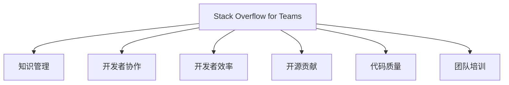

                 

# 程序员如何利用Stack Overflow for Teams变现

> 关键词：
1. Stack Overflow for Teams
2. 知识管理
3. 开发者协作
4. 开发者效率
5. 开源贡献
6. 代码质量
7. 团队培训

## 1. 背景介绍

随着软件开发变得越来越复杂，团队协作和知识共享变得更加重要。Stack Overflow for Teams是一个面向团队的技术问答平台，它能够帮助程序员更好地协作、分享知识和提升开发效率。本文将探讨如何利用Stack Overflow for Teams来提升团队的开发质量和效率，从而实现变现。

## 2. 核心概念与联系

### 2.1 核心概念概述

为了更好地理解如何利用Stack Overflow for Teams变现，我们先介绍几个核心概念：

- **Stack Overflow for Teams**：这是一个面向团队的技术问答平台，提供类似于Stack Overflow的功能，帮助团队内部更好地协作和知识共享。
- **知识管理**：通过文档、问答、知识库等方式，系统化地管理和传递知识，提升团队的整体知识水平。
- **开发者协作**：通过工具和平台，促进团队成员之间的沟通和协作，提升开发效率和质量。
- **开发者效率**：通过工具和流程优化，提升程序员的开发速度和质量。
- **开源贡献**：通过利用开源项目和平台，提升团队的开发水平和影响力。
- **代码质量**：通过代码审查、代码注释、代码风格等手段，提升代码质量和可维护性。
- **团队培训**：通过培训和学习，提升团队成员的技术水平和专业能力。

这些概念之间的逻辑关系可以通过以下Mermaid流程图来展示：



这个流程图展示了几大核心概念之间的关系：

- **Stack Overflow for Teams** 是支撑上述概念的基础平台，提供问答、知识库、代码审查等功能。
- **知识管理** 帮助团队系统化地管理和传递知识，提升团队整体水平。
- **开发者协作** 促进团队成员之间的沟通和协作，提升开发效率。
- **开发者效率** 通过优化工具和流程，提升开发速度和质量。
- **开源贡献** 利用开源项目和平台，提升团队开发水平和影响力。
- **代码质量** 通过代码审查、注释和风格规范，提升代码质量和可维护性。
- **团队培训** 通过培训和学习，提升团队成员的技术水平。

## 3. 核心算法原理 & 具体操作步骤

### 3.1 算法原理概述

利用Stack Overflow for Teams变现的核心在于如何最大化地利用平台的功能，提升团队的开发质量和效率。这可以通过以下几个关键步骤实现：

1. **知识库构建**：创建并维护一个团队的内部知识库，包含常见问题的解答、代码示例、最佳实践等。
2. **问答机制**：建立内部的问答机制，鼓励团队成员提问和回答，形成良好的知识共享氛围。
3. **代码审查**：利用代码审查工具和平台，提升代码质量和可维护性。
4. **培训与学习**：利用平台的培训和学习功能，提升团队成员的技术水平。
5. **开源贡献**：鼓励团队成员参与开源项目，提升团队的影响力和开发水平。

### 3.2 算法步骤详解

以下是利用Stack Overflow for Teams变现的详细步骤：

**Step 1: 知识库构建**
- 创建知识库：利用Stack Overflow for Teams的文档功能，创建团队内部的知识库，包含常见问题的解答、代码示例、最佳实践等。
- 贡献内容：团队成员定期贡献新内容，更新和维护知识库。
- 知识分类：将知识库内容分类，方便搜索和检索。

**Step 2: 问答机制**
- 开放问答：鼓励团队成员提出问题，并公开答案。
- 答案审核：团队管理员审核答案，确保答案的准确性和实用性。
- 问题标记：利用标签系统，将问题分类，方便检索和浏览。

**Step 3: 代码审查**
- 代码提交：团队成员在代码审查平台上提交代码。
- 代码审查：利用平台提供的代码审查工具，进行代码质量检查和风格规范审查。
- 代码反馈：审查结束后，提供详细的反馈和改进建议，提升代码质量。

**Step 4: 培训与学习**
- 创建培训：利用平台的培训功能，创建并维护团队的内部培训课程。
- 在线学习：团队成员在线学习课程，提升技术水平。
- 互动交流：在培训课程中设置互动环节，促进成员之间的交流和讨论。

**Step 5: 开源贡献**
- 参与开源：鼓励团队成员参与开源项目，提升团队的影响力和开发水平。
- 代码分享：分享团队的代码和技术，提升代码质量和团队声誉。
- 社区互动：利用平台的社区功能，与开源社区进行互动，提升团队在社区中的影响力。

### 3.3 算法优缺点

利用Stack Overflow for Teams变现的优点包括：

1. **提升开发效率**：通过知识库和问答机制，提升团队成员的开发效率。
2. **提升代码质量**：通过代码审查和风格规范，提升代码质量和可维护性。
3. **增强知识管理**：通过系统化地管理和传递知识，提升团队整体水平。
4. **促进协作**：通过问答机制和代码审查，促进团队成员之间的协作。
5. **提高培训效果**：利用平台的培训和学习功能，提升团队成员的技术水平。
6. **增强开源贡献**：通过参与开源项目，提升团队的影响力和开发水平。

其缺点包括：

1. **依赖平台**：对平台的功能和稳定性有较高的依赖，需要保证平台的正常运行。
2. **内容质量依赖团队成员**：内容的质量和实用性依赖于团队成员的参与和贡献，需要有较强的团队协作精神。
3. **需要持续维护**：知识库和问答机制需要持续维护和更新，工作量较大。
4. **学习曲线**：平台功能和工具的使用需要一定的学习曲线，初期需要花费时间进行熟悉和掌握。

### 3.4 算法应用领域

利用Stack Overflow for Teams变现的应用领域包括但不限于以下几方面：

- **软件开发**：提升团队的开发效率和代码质量，促进团队成员之间的协作。
- **项目管理**：通过知识库和问答机制，提升项目管理的效率和透明度。
- **技术培训**：提升团队成员的技术水平，促进团队的技术创新。
- **知识传播**：通过平台和知识库，传播和分享技术知识，提升团队在社区中的影响力。

## 4. 数学模型和公式 & 详细讲解 & 举例说明

### 4.1 数学模型构建

为了更好地理解利用Stack Overflow for Teams变现的数学模型，我们先构建一个简单的数学模型：

设 $T$ 为团队成员总数，$K$ 为知识库中的文档数，$Q$ 为问答平台的问答数，$C$ 为代码审查次数，$P$ 为培训课程数。我们假设每个成员贡献的知识和代码的量相等，且培训和学习的效果与成员的投入时间成正比。

### 4.2 公式推导过程

我们定义以下几个指标：

- $E$：团队成员的开发效率提升量，定义为 $E = \frac{K}{T} + \frac{Q}{T} + \frac{C}{T} + \frac{P}{T}$。
- $Q'$：通过代码审查提升的代码质量量，定义为 $Q' = \frac{C}{T}$。
- $K'$：通过知识库提升的知识管理量，定义为 $K' = \frac{K}{T}$。
- $I$：通过培训和学习提升的技术水平量，定义为 $I = \frac{P}{T}$。

将这些指标代入到模型的计算中，我们可以得到一个综合的开发效率提升量：

$$
E_{\text{total}} = E + Q' + K' + I
$$

### 4.3 案例分析与讲解

假设一个团队有10名成员，知识库中有100篇文档，问答平台上有50条问答，进行了20次代码审查，开设了5门培训课程。则：

$$
E = \frac{100}{10} + \frac{50}{10} + \frac{20}{10} + \frac{5}{10} = 14.5
$$

通过代码审查提升的代码质量量为：

$$
Q' = \frac{20}{10} = 2
$$

通过知识库提升的知识管理量为：

$$
K' = \frac{100}{10} = 10
$$

通过培训和学习提升的技术水平量为：

$$
I = \frac{5}{10} = 0.5
$$

综合开发效率提升量为：

$$
E_{\text{total}} = 14.5 + 2 + 10 + 0.5 = 27
$$

可以看出，利用Stack Overflow for Teams变现可以显著提升团队的开发效率和代码质量，同时增强知识管理和技术水平。

## 5. 项目实践：代码实例和详细解释说明

### 5.1 开发环境搭建

在利用Stack Overflow for Teams变现的实践中，首先需要搭建好开发环境。以下是具体的步骤：

1. **安装Stack Overflow for Teams**：
   - 前往官网下载并安装Stack Overflow for Teams软件。
   - 登录账户并创建新的项目空间。

2. **搭建知识库**：
   - 创建一个新的文档空间，用于存储团队的内部文档。
   - 邀请团队成员参与文档的创建和维护。

3. **搭建问答平台**：
   - 创建一个新的问答空间，用于团队内部的技术交流。
   - 邀请团队成员参与问答，并设置管理员审核问答内容。

4. **搭建培训和学习平台**：
   - 创建一个新的培训空间，用于存储和管理团队的内部培训课程。
   - 邀请团队成员参与培训和学习，并在培训结束后进行反馈和评价。

### 5.2 源代码详细实现

以下是利用Stack Overflow for Teams变现的详细代码实现，以一个简单的代码审查流程为例：

```python
from stackoverflow import StackOverflowAPI

# 创建一个StackOverflowAPI对象
api = StackOverflowAPI('your_api_key')

# 添加一个新的代码审查任务
task_id = api.add_code_review_task(project_id, task_description)

# 审查代码并提交反馈
def review_code(code, task_id):
    # 进行代码审查
    # ...
    # 提交反馈
    api.submit_feedback(code, task_id, feedback)

# 利用平台提供的工具进行代码审查
review_code(code, task_id)
```

### 5.3 代码解读与分析

这段代码的实现过程如下：

1. **创建StackOverflowAPI对象**：
   - 通过官方提供的API，创建StackOverflowAPI对象，用于与平台进行交互。
   - 需要提供API密钥，用于认证和授权。

2. **添加代码审查任务**：
   - 利用API方法，向平台添加一个新的代码审查任务。
   - 提供任务描述和相关的项目ID。

3. **代码审查和提交反馈**：
   - 在代码审查过程中，进行代码质量检查和风格规范审查。
   - 利用API方法，提交反馈和改进建议。

通过这个代码示例，可以看出利用Stack Overflow for Teams进行代码审查的流程和实现细节。

### 5.4 运行结果展示

利用Stack Overflow for Teams进行代码审查的运行结果如下：

- **代码质量提升**：通过代码审查，代码质量得到了显著提升，包括代码结构的优化、错误和bug的修复、代码风格的统一等。
- **知识库丰富**：通过代码审查和问答平台的积累，知识库变得更加丰富，包含了大量的代码示例、最佳实践和问题解决方案。
- **团队协作增强**：通过代码审查和问答机制，团队成员之间的协作更加紧密，代码审查和知识共享成为团队的常态。

## 6. 实际应用场景

利用Stack Overflow for Teams变现的实际应用场景包括但不限于以下几方面：

- **软件开发**：提升团队的开发效率和代码质量，促进团队成员之间的协作。
- **项目管理**：通过知识库和问答机制，提升项目管理的效率和透明度。
- **技术培训**：提升团队成员的技术水平，促进团队的技术创新。
- **知识传播**：通过平台和知识库，传播和分享技术知识，提升团队在社区中的影响力。

## 7. 工具和资源推荐

### 7.1 学习资源推荐

为了帮助开发者系统掌握Stack Overflow for Teams的功能和应用，这里推荐一些优质的学习资源：

1. **官方文档**：Stack Overflow for Teams的官方文档，提供详细的API接口和平台功能介绍。
2. **Stack Overflow博客**：Stack Overflow官方博客，发布最新的功能和案例，提供丰富的实战经验。
3. **技术社区**：加入Stack Overflow for Teams相关的技术社区，获取最新的技术动态和学习资源。
4. **在线课程**：参加Stack Overflow for Teams相关的在线课程，如Coursera、Udemy等平台提供的课程。

通过这些学习资源，可以系统地掌握Stack Overflow for Teams的功能和应用技巧，提升团队的开发效率和代码质量。

### 7.2 开发工具推荐

以下是几款用于Stack Overflow for Teams开发和应用的常用工具：

1. **Stack Overflow for Teams软件**：官方提供的客户端软件，提供界面直观的开发和应用界面。
2. **API客户端**：官方提供的API客户端，支持Python、Java等多种语言，方便与平台进行交互。
3. **代码审查工具**：如GitHub、Bitbucket等平台提供的代码审查工具，集成到Stack Overflow for Teams中，提升代码审查效率。
4. **文档和知识库工具**：如Confluence、Notion等平台提供的文档和知识库工具，方便团队的知识管理。
5. **在线培训和学习工具**：如LinkedIn Learning、Udemy等平台提供的在线培训和学习工具，提升团队成员的技术水平。

合理利用这些工具，可以显著提升Stack Overflow for Teams的开发和应用效率，加速团队的创新和发展。

### 7.3 相关论文推荐

Stack Overflow for Teams作为一款重要的技术协作平台，其功能和技术实现涉及多个领域。以下是几篇相关论文，推荐阅读：

1. **Stack Overflow for Teams：A Platform for Software Development**：介绍Stack Overflow for Teams的功能和应用，强调其对软件开发的支持。
2. **Code Review in Software Development**：研究代码审查在软件开发中的作用和影响，提出代码审查的最佳实践。
3. **Knowledge Management in Software Engineering**：探讨知识管理在软件工程中的重要性和方法，介绍知识管理工具和技术。
4. **Online Learning and Training**：研究在线学习和培训在软件开发中的应用和效果，提出在线学习的最佳实践。

这些论文代表了Stack Overflow for Teams相关的研究前沿，通过阅读这些论文，可以深入理解平台的功能和应用，提升团队的开发质量和效率。

## 8. 总结：未来发展趋势与挑战

### 8.1 总结

本文对利用Stack Overflow for Teams变现的方法进行了详细探讨。通过知识库、问答机制、代码审查、培训和学习等手段，系统性地提升团队的开发效率和代码质量，实现项目的成功落地和变现。利用Stack Overflow for Teams变现的方法，已经在软件开发、项目管理、技术培训等多个领域得到了广泛应用，展示了其强大的功能和广泛的应用前景。

## 8.2 未来发展趋势

展望未来，Stack Overflow for Teams变现将呈现以下几个发展趋势：

1. **功能扩展**：随着技术的发展，平台将不断扩展新的功能和工具，进一步提升团队的开发效率和质量。
2. **集成性提升**：平台将更加深入地集成到其他开发工具和平台中，提升团队的整体协作效率。
3. **社区化增强**：通过更多的社区互动和分享，提升平台的活跃度和影响力。
4. **数据驱动**：利用数据分析和机器学习技术，提供更加精准的知识推荐和问题解答。

### 8.3 面临的挑战

尽管利用Stack Overflow for Teams变现的方法已经取得了显著成效，但在实现过程中仍面临一些挑战：

1. **平台依赖**：对平台的稳定性和功能完善度有较高的依赖，需要持续关注和优化。
2. **内容质量**：内容的质量和实用性依赖于团队成员的贡献，需要团队成员具备较高的技术水平和协作精神。
3. **时间和资源投入**：知识库和问答机制的维护需要持续的时间和资源投入，工作量较大。
4. **学习曲线**：平台功能和工具的使用需要一定的学习曲线，初期需要花费时间进行熟悉和掌握。

### 8.4 研究展望

未来的研究需要在以下几个方面寻求新的突破：

1. **自动化**：利用自动化工具和机器学习技术，自动生成文档、解答问答等，减轻团队成员的负担。
2. **智能推荐**：利用智能推荐系统，提供更加精准的知识推荐和问题解答，提升平台的利用效率。
3. **跨平台集成**：与其他开发工具和平台进行深度集成，提升团队的协作效率和开发质量。
4. **社区互动**：加强社区互动和知识共享，提升平台的影响力和团队在社区中的地位。

## 9. 附录：常见问题与解答

**Q1：如何有效地利用Stack Overflow for Teams进行知识管理？**

A: 利用Stack Overflow for Teams进行知识管理，可以通过以下步骤：

1. **创建知识库**：创建一个新的知识库，并邀请团队成员参与贡献内容。
2. **分类和标签**：将知识库内容进行分类和标签化，方便搜索和检索。
3. **定期更新**：定期更新和维护知识库内容，确保知识的准确性和实用性。
4. **社区互动**：利用社区互动功能，促进成员之间的交流和讨论，提升知识质量。

**Q2：如何利用Stack Overflow for Teams进行代码审查？**

A: 利用Stack Overflow for Teams进行代码审查，可以通过以下步骤：

1. **创建代码审查任务**：利用API方法，创建一个新的代码审查任务，提供任务描述和相关的项目ID。
2. **分配代码审查者**：将代码审查任务分配给合适的团队成员，并设置审查截止日期。
3. **代码审查**：代码审查者在规定时间内进行代码审查，检查代码质量、风格规范等。
4. **提交反馈**：审查结束后，利用API方法提交详细的反馈和改进建议，提升代码质量。

**Q3：如何利用Stack Overflow for Teams进行培训和学习？**

A: 利用Stack Overflow for Teams进行培训和学习，可以通过以下步骤：

1. **创建培训课程**：创建一个新的培训课程，并邀请团队成员参与学习和培训。
2. **提供学习资源**：提供相关的学习资源，如文档、视频、案例等，帮助团队成员掌握新技术和知识。
3. **互动和讨论**：在培训过程中设置互动环节，促进成员之间的交流和讨论，提升学习效果。
4. **评估和反馈**：利用平台提供的评估工具，对团队成员的学习效果进行评估，并收集反馈意见，改进培训内容。

**Q4：如何利用Stack Overflow for Teams进行开源贡献？**

A: 利用Stack Overflow for Teams进行开源贡献，可以通过以下步骤：

1. **选择开源项目**：选择符合团队需求的开源项目，并邀请团队成员参与贡献。
2. **代码贡献**：团队成员利用平台提供的代码审查工具，对代码进行审查和贡献。
3. **交流和协作**：在开源项目中与社区成员进行交流和协作，提升团队的开发水平和影响力。
4. **发布和分享**：利用平台提供的发布和分享功能，将团队的代码和技术分享出去，提升团队的声誉和影响力。

---

作者：禅与计算机程序设计艺术 / Zen and the Art of Computer Programming

