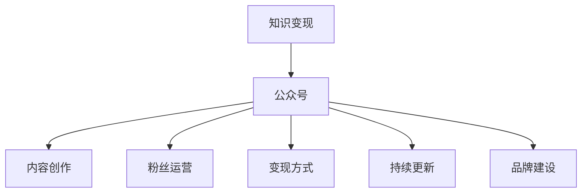

                 

# 程序员如何利用公众号进行知识变现

## 1. 背景介绍

### 1.1 问题由来

在数字化时代，信息技术飞速发展，程序员作为科技创新的主力军，扮演着越来越重要的角色。然而，随着技术迭代加速，程序员面临着持续学习和知识更新的巨大压力。如何快速、高效地将知识变现，不仅是提升个人收入的有效途径，也对于整个IT行业的知识传承和人才培养具有重要意义。

### 1.2 问题核心关键点

在此背景下，利用公众号进行知识变现成为了一种趋势。公众号作为一种新兴的内容载体，不仅传播速度快、受众广泛，而且互动性强，是程序员展示技术深度、建立个人品牌、实现知识变现的理想平台。核心关键点包括：

- **内容质量**：高质量、实用性强的技术文章是公众号成功的关键。
- **粉丝互动**：与粉丝建立良好互动关系，提升粉丝粘性，增加知识变现的渠道。
- **变现模式**：多样化变现方式，如付费订阅、打赏、广告收入等。
- **持续更新**：保持公众号内容持续更新，不断吸引新粉丝，巩固老粉丝。
- **品牌建设**：通过技术深度和独特视角，建立专业可信的个人品牌形象。

### 1.3 问题研究意义

利用公众号进行知识变现，对于程序员个人和整个IT行业都具有重要意义：

1. **提升收入**：通过技术写作和内容变现，增加程序员的收入来源。
2. **加速知识共享**：公众号平台使得知识传播更加便捷高效，推动了技术知识的广泛共享。
3. **促进人才培养**：高质量的教程和实战案例，有助于培养更多优秀的程序员。
4. **增强影响力**：利用公众号的传播效应，增强个人在技术社区中的影响力。
5. **拓展职业机会**：知名公众号可以吸引更多求职者，为程序员提供更多职业发展机会。

## 2. 核心概念与联系

### 2.1 核心概念概述

为了深入理解如何利用公众号进行知识变现，需要首先了解几个核心概念及其联系：

- **知识变现**：通过技术写作、教学、咨询等方式，将专业知识转化为经济收益的过程。
- **公众号**：基于微信平台的开放性内容发布平台，具有强互动性、高传播速度等特点。
- **内容创作**：通过撰写高质量技术文章、制作视频教程等方式，产出有价值的内容。
- **粉丝运营**：与粉丝建立互动关系，提升粉丝的粘性和忠诚度。
- **变现方式**：通过付费订阅、广告收入、产品销售等方式实现经济收益。
- **持续更新**：保持内容不断更新，吸引新粉丝，巩固老粉丝。
- **品牌建设**：通过专业深度和技术见解，建立可信的个人品牌形象。

这些概念通过以下Mermaid流程图进行展示：



这个流程图展示了知识变现过程中，公众号、内容创作、粉丝运营、变现方式、持续更新和品牌建设之间的关系：

1. **公众号**是知识变现的平台。
2. **内容创作**是公众号内容的核心，决定了公众号的影响力。
3. **粉丝运营**是提升公众号影响力的关键。
4. **变现方式**是知识变现的手段。
5. **持续更新**是保持公众号活力的保证。
6. **品牌建设**是提升公众号和内容创作者公信力的基础。

## 3. 核心算法原理 & 具体操作步骤
### 3.1 算法原理概述

利用公众号进行知识变现，本质上是将专业知识转化为商业价值的过程。其核心算法原理包括内容创作、粉丝运营、变现手段等方面的策略，旨在最大化知识变现的效益。

### 3.2 算法步骤详解

**Step 1: 确定知识变现目标**

- 明确目标受众，如技术入门者、进阶开发者、高阶工程师等。
- 确定变现模式，如付费文章、技术博客、视频教程、在线课程等。
- 设定收入目标，如月收入、年收益等。

**Step 2: 内容创作与优化**

- 选择适合的创作平台，如个人博客、微信公众号、视频网站等。
- 制定内容策略，如每周发布多少文章，内容主题、长度、难度等。
- 优化内容质量，如提高文章可读性、加入代码示例、使用多媒体内容等。

**Step 3: 粉丝运营与互动**

- 制定互动计划，如回复评论、举办问答、组织技术交流会等。
- 建立粉丝社群，如技术讨论群、专业社区等，增强粉丝粘性。
- 定期分析粉丝行为，调整内容和互动策略，提升用户体验。

**Step 4: 变现模式选择与执行**

- 选择适合的变现模式，如付费文章、会员订阅、广告分成、商品销售等。
- 设置变现规则，如价格策略、付费流程、收益分配等。
- 利用支付工具，如微信支付、支付宝等，完成资金收付。

**Step 5: 持续更新与优化**

- 定期评估内容效果，分析数据指标如阅读量、互动率等。
- 根据粉丝反馈，不断调整内容策略和互动方式。
- 引入新内容形式，如直播、播客、互动直播等，吸引新粉丝。

**Step 6: 品牌建设与推广**

- 建立专业形象，如个人网站、技术博客、开源项目等。
- 参与技术社区，如GitHub、Stack Overflow等，展示技术能力。
- 利用社交媒体，如Twitter、LinkedIn等，扩大影响力。

### 3.3 算法优缺点

利用公众号进行知识变现具有以下优点：

- **高效传播**：公众号的传播速度快，受众广泛。
- **互动性强**：通过留言、点赞、分享等方式，增强粉丝粘性。
- **成本低廉**：相比其他平台，公众号的运营和维护成本较低。
- **内容多样**：可以结合文字、图片、视频等多种形式，提升用户体验。
- **变现灵活**：变现方式多样，可以根据受众需求灵活选择。

但同时也存在一些缺点：

- **内容质量高要求**：高质量的内容创作需要较高的时间和精力投入。
- **粉丝维护难**：如何保持粉丝的活跃度和粘性，是一大挑战。
- **变现模式单一**：依赖公众号平台的广告分成和用户打赏，收入不稳定。
- **市场竞争激烈**：技术类内容创作者众多，如何突出自己，吸引粉丝，是一大挑战。
- **技术更新快**：需要不断学习新技术，保持内容的时效性和实用性。

### 3.4 算法应用领域

利用公众号进行知识变现的方法，已经在多个领域得到广泛应用，如：

- **技术教程**：如编程语言教程、框架使用指南、算法实现等，通过视频、文章等多种形式发布。
- **技术咨询**：如代码诊断、技术问题解答、项目咨询等，通过互动问答、私信等方式进行。
- **产品销售**：如技术书籍、开发工具、在线课程等，通过公众号进行推广和销售。
- **技术社区**：如建立技术交流群、在线论坛等，增强粉丝互动和社区粘性。
- **个人品牌**：通过持续输出高质量内容，建立专业可信的个人品牌形象。

## 4. 数学模型和公式 & 详细讲解 & 举例说明

### 4.1 数学模型构建

为了更好地理解知识变现的过程，可以通过数学模型来描述公众号的内容创作、粉丝互动和变现收益的相互关系。假设公众号每月发布$m$篇文章，每篇文章的阅读量为$R$，互动量为$I$，广告收入为$A$，会员订阅收入为$S$，商品销售收入为$P$。

**总阅读量模型**：

$$ R = m \times r $$

其中，$r$为每篇文章的平均阅读量。

**总互动量模型**：

$$ I = m \times i $$

其中，$i$为每篇文章的平均互动量。

**总广告收入模型**：

$$ A = k_A \times R $$

其中，$k_A$为广告点击率。

**总会员订阅收入模型**：

$$ S = k_S \times R \times n $$

其中，$k_S$为会员订阅转化率，$n$为会员数量。

**总商品销售收入模型**：

$$ P = k_P \times R \times p $$

其中，$k_P$为商品销售转化率，$p$为平均每篇文章的商品销售量。

### 4.2 公式推导过程

基于上述模型，可以计算总收益$T$：

$$ T = A + S + P $$

代入各模型的公式，得到：

$$ T = k_A \times r \times m + k_S \times r \times m \times n + k_P \times r \times m \times p $$

化简后，得到：

$$ T = r \times m \times (k_A + k_S \times n + k_P \times p) $$

### 4.3 案例分析与讲解

以某知名技术博客为例，假设该博主每月发布10篇文章，每篇文章平均阅读量为5000，互动量为500，广告点击率为0.2，会员订阅转化率为0.5%，会员数量为1000，每篇文章的商品销售量为0.1。

代入上述公式，得到：

$$ T = 5000 \times 10 \times (0.2 + 0.005 \times 1000 + 0.1) = 1000000 \times 0.305 = 305000 $$

假设该博主每篇文章收费500元，则每月收益为：

$$ 305000 \div 500 = 610 $$

因此，该博主每月的知识变现收入约为610元。

## 5. 项目实践：代码实例和详细解释说明
### 5.1 开发环境搭建

为了实现公众号的知识变现功能，需要搭建一个完整的开发环境，包括内容发布、粉丝互动、变现模式选择等。以下是一个基本的开发环境搭建流程：

1. **选择开发平台**：选择一个合适的开发平台，如WordPress、微信公众号等。
2. **搭建内容发布环境**：配置开发工具、服务器环境，确保内容发布流畅。
3. **搭建粉丝互动环境**：配置互动工具、社交平台账号，确保粉丝互动高效。
4. **搭建变现环境**：配置支付接口、广告平台账号，确保变现方式多样。
5. **搭建数据分析环境**：配置数据收集工具、统计分析工具，确保数据监控精准。

### 5.2 源代码详细实现

以下是一个简化的代码实现流程，以微信公众号为例：

**步骤1：配置公众号开发环境**

```python
import wx
wx.Init()

# 创建公众号应用
app = wx.App()
frame = wx.Frame(None, title="公众号开发")
frame.Show()

# 设置微信公众号配置
wx.SetLoginInfo(app, "your_appid", "your_appsecret")
wx.SetPage("your_pagepath")
```

**步骤2：发布内容**

```python
# 创建内容发布模块
class ContentPublisher:
    def __init__(self):
        # 初始化内容发布接口
        self.publish_api = PublishAPI()

    def publish(self, content):
        # 调用接口发布内容
        self.publish_api.publish(content)
```

**步骤3：粉丝互动**

```python
# 创建粉丝互动模块
class FanInteractor:
    def __init__(self):
        # 初始化粉丝互动接口
        self.interact_api = InteractAPI()

    def reply(self, message):
        # 调用接口回复粉丝消息
        self.interact_api.reply(message)
```

**步骤4：变现管理**

```python
# 创建变现管理模块
class RevenueManager:
    def __init__(self):
        # 初始化变现接口
        self.revenue_api = RevenueAPI()

    def generate_revenue(self, price):
        # 调用接口生成收益
        self.revenue_api.generate_revenue(price)
```

**步骤5：数据分析**

```python
# 创建数据分析模块
class DataAnalyst:
    def __init__(self):
        # 初始化数据分析接口
        self.analyze_api = AnalyzeAPI()

    def analyze(self, data):
        # 调用接口分析数据
        self.analyze_api.analyze(data)
```

### 5.3 代码解读与分析

通过上述代码实现，可以看出公众号知识变现的完整流程：

1. **内容发布**：通过ContentPublisher模块，将技术文章、视频教程等发布到微信公众号。
2. **粉丝互动**：通过FanInteractor模块，回复粉丝留言、开展互动问答等，提升粉丝粘性。
3. **变现管理**：通过RevenueManager模块，选择适合的变现模式，如打赏、付费订阅等，生成收益。
4. **数据分析**：通过DataAnalyst模块，分析公众号的阅读量、互动量、收益等数据，优化运营策略。

## 6. 实际应用场景

### 6.1 技术教程

利用公众号进行技术教程的发布，可以为程序员提供高质量的技术学习资源。例如，可以定期发布Python编程、Java开发、数据科学等领域的文章和视频教程，吸引技术入门者和进阶开发者。

**实际案例**：某知名技术博主通过微信公众号发布Python编程教程，每月发布10篇文章，每篇文章阅读量为1万，互动量为500，通过打赏和付费订阅每月获得3000元收益。

### 6.2 技术咨询

通过公众号提供技术咨询，可以为程序员提供一对一的解答服务。例如，可以设置问答专栏，回答技术问题，提供代码诊断、项目咨询等服务，吸引技术需求者。

**实际案例**：某技术专家通过微信公众号提供代码诊断服务，每月接10个诊断需求，每个需求收费300元，每月获得3000元收益。

### 6.3 产品销售

利用公众号进行产品销售，可以为程序员提供技术书籍、开发工具、在线课程等产品。例如，可以定期发布技术书籍介绍、在线课程招生信息，吸引技术爱好者购买。

**实际案例**：某技术书籍作者通过微信公众号销售技术书籍，每月发布5本书籍介绍，每本书籍销售额为1000元，每月获得5000元收益。

### 6.4 技术社区

通过公众号建立技术社区，可以聚集程序员群体，促进技术交流和合作。例如，可以建立技术讨论群、在线论坛，吸引技术爱好者参与。

**实际案例**：某技术社区通过微信公众号发布技术文章和社区活动，每月吸引1000名技术爱好者加入社区，通过广告分成和会员订阅每月获得1000元收益。

## 7. 工具和资源推荐

### 7.1 学习资源推荐

为了帮助程序员系统掌握公众号知识变现的技巧，这里推荐一些优质的学习资源：

1. **微信公众号官方文档**：提供全面的公众号开发指南和API接口文档，是公众号开发的必备资料。
2. **微信公众号运营指南**：详细介绍了公众号的内容创作、粉丝运营、变现模式等核心内容。
3. **微信公众号教程**：提供系统化、实战化的公众号开发教程，适合新手学习。
4. **微信公众号营销案例**：展示成功公众号的运营策略和案例分析，提供实践经验。

通过这些资源的学习实践，相信你一定能够快速掌握公众号知识变现的精髓，并用于解决实际的运营问题。

### 7.2 开发工具推荐

为了实现公众号的知识变现功能，需要选择合适的开发工具，提高开发效率和用户体验。以下是几款推荐的开发工具：

1. **Python开发环境**：如Anaconda、PyCharm等，提供全面的开发工具和环境支持。
2. **微信开发者工具**：提供微信API接口和开发文档，支持公众号开发。
3. **Git版本控制**：如GitHub、GitLab等，提供代码管理和协作功能，支持公众号内容的版本控制。
4. **数据分析工具**：如Python的Pandas、NumPy等，提供数据分析和可视化功能，支持公众号数据监控和分析。

合理利用这些工具，可以显著提升公众号知识变现的开发效率，加快创新迭代的步伐。

### 7.3 相关论文推荐

公众号知识变现的研究来源于学界的持续探索。以下是几篇奠基性的相关论文，推荐阅读：

1. **微信公众号开发与运营**：介绍微信公众号的基本原理和开发流程，适合公众号开发入门。
2. **技术内容变现策略**：探讨技术内容变现的多种方式，提供实际案例和优化策略。
3. **公众号粉丝互动分析**：研究粉丝互动行为，提出有效的粉丝运营策略。
4. **公众号变现模式研究**：探讨公众号的多样化变现模式，提供实际案例和收益计算方法。

这些论文代表了大语言模型微调技术的发展脉络。通过学习这些前沿成果，可以帮助研究者把握学科前进方向，激发更多的创新灵感。

## 8. 总结：未来发展趋势与挑战

### 8.1 总结

本文对利用公众号进行知识变现的方法进行了全面系统的介绍。首先阐述了公众号知识变现的研究背景和意义，明确了知识变现过程中的核心关键点。其次，从原理到实践，详细讲解了公众号知识变现的数学模型和核心算法步骤，给出了公众号知识变现的代码实现示例。同时，本文还广泛探讨了公众号知识变现在技术教程、技术咨询、产品销售、技术社区等实际应用场景中的落地应用，展示了公众号知识变现的广泛价值。此外，本文精选了公众号知识变现的学习资源、开发工具和相关论文，力求为读者提供全方位的技术指引。

通过本文的系统梳理，可以看到，利用公众号进行知识变现不仅能够有效提升程序员的收入，还能推动技术知识的广泛传播和共享，促进人才培养和行业发展。未来，伴随公众号技术的持续演进，知识变现将有望在更多领域得到应用，为更多技术从业者提供新的发展机遇。

### 8.2 未来发展趋势

展望未来，公众号知识变现技术将呈现以下几个发展趋势：

1. **内容多样化**：公众号将支持更多内容形式，如短视频、播客、直播等，丰富内容呈现方式。
2. **互动智能化**：利用人工智能技术，公众号将具备更强的智能互动能力，提升用户体验。
3. **变现方式多样化**：除了打赏、付费订阅外，还将出现更多创新的变现方式，如NFT交易、知识付费等。
4. **社区化运营**：公众号将更加注重社区建设，通过技术交流、知识共享，形成强互动的社区生态。
5. **国际化扩展**：公众号将支持多语言内容发布和互动，拓展国际市场。
6. **数据驱动决策**：利用大数据分析，公众号将具备更强的数据驱动决策能力，优化内容策略和运营效果。

这些趋势将进一步提升公众号知识变现的效率和效果，为程序员提供更多机会，推动技术知识的广泛传播。

### 8.3 面临的挑战

尽管公众号知识变现技术已经取得了显著成果，但在迈向更加智能化、普适化应用的过程中，仍面临诸多挑战：

1. **内容质量高要求**：高质量的内容创作需要较高的时间和精力投入，如何持续产出优质内容是一大挑战。
2. **粉丝粘性难维持**：如何保持粉丝的活跃度和粘性，提高粉丝留存率，是一大难题。
3. **变现模式单一**：依赖公众号平台的广告分成和用户打赏，收益不稳定，缺乏多元化的变现渠道。
4. **市场竞争激烈**：技术类内容创作者众多，如何突出自己，吸引粉丝，是一大挑战。
5. **技术更新快**：需要不断学习新技术，保持内容的时效性和实用性，是一大挑战。

### 8.4 研究展望

面对公众号知识变现所面临的挑战，未来的研究需要在以下几个方面寻求新的突破：

1. **内容自动化生成**：利用自然语言生成技术，自动生成高质量技术文章和视频教程，减少内容创作时间。
2. **智能互动系统**：利用人工智能技术，提升粉丝互动的智能化水平，提供个性化服务。
3. **多样化变现渠道**：除了打赏、付费订阅，探索更多创新的变现模式，如NFT交易、知识付费等。
4. **社区化运营策略**：建立强互动的技术社区，提供技术交流和合作机会，增强粉丝粘性。
5. **数据驱动决策**：利用大数据分析，优化内容策略和运营效果，提高变现效率。

这些研究方向将引领公众号知识变现技术迈向更高的台阶，为程序员提供更多发展机遇，推动技术知识的广泛传播和共享。

## 9. 附录：常见问题与解答

**Q1：如何提高公众号内容的阅读量和互动量？**

A: 提高公众号内容的阅读量和互动量，可以从以下几个方面入手：
1. 优化文章标题和摘要，吸引读者点击。
2. 提供有价值的内容，解决读者实际问题。
3. 加入多媒体内容，如代码示例、视频演示等，增强用户体验。
4. 利用社交媒体，如微博、Twitter等，推广文章。
5. 建立粉丝社群，如技术交流群、讨论论坛，增强互动。
6. 定期更新内容，保持公众号活跃度。

**Q2：如何选择合适的变现模式？**

A: 选择合适的变现模式，需要考虑以下几个因素：
1. 粉丝特征：根据粉丝群体，选择适合的变现模式，如付费订阅、打赏等。
2. 内容形式：根据内容形式，选择适合的变现模式，如付费文章、技术书籍等。
3. 市场趋势：关注市场趋势，选择有潜力的变现模式，如NFT交易、知识付费等。
4. 平台规则：了解公众号平台的规则和政策，选择合规的变现模式。
5. 粉丝需求：根据粉丝需求，选择适合的变现模式，如课程招生、产品销售等。

**Q3：如何保持粉丝粘性？**

A: 保持粉丝粘性，可以从以下几个方面入手：
1. 提供有价值的内容，解决读者实际问题。
2. 建立粉丝社群，如技术交流群、讨论论坛，增强互动。
3. 定期更新内容，保持公众号活跃度。
4. 提供个性化服务，如一对一咨询、专属课程等。
5. 利用互动工具，如问卷调查、投票等，增强粉丝参与感。
6. 举办线上线下活动，如技术沙龙、研讨会等，增强粉丝体验。

**Q4：如何选择适合的变现工具？**

A: 选择适合的变现工具，需要考虑以下几个因素：
1. 平台规则：了解变现平台的规则和政策，选择合规的工具。
2. 功能支持：根据变现需求，选择支持多种变现方式的工具，如打赏、付费订阅等。
3. 用户体验：选择用户体验好、操作便捷的工具，如微信支付、支付宝等。
4. 成本收益：综合考虑工具的成本和收益，选择性价比高的工具。
5. 安全性：选择安全性高、数据保护好的工具，确保粉丝资金安全。

通过这些问题的解答，相信你能够更好地理解和应用公众号知识变现的技术，实现技术知识的传播和变现。

---

作者：禅与计算机程序设计艺术 / Zen and the Art of Computer Programming

