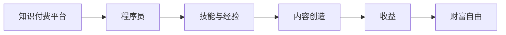

                 

# 程序员如何利用知识付费实现财富自由

> 关键词：知识付费, 程序员, 财富自由, 技术发展, 投资理财, 创业指南

## 1. 背景介绍

在数字化时代，知识付费已成为一种快速成长的商业模式。利用互联网技术，人们可以更高效地获取各种知识，并通过知识付费实现个人收益。尤其在IT领域，伴随着技术日新月异和市场需求激增，程序员们有了更多的机会通过知识输出实现财富积累。然而，面对广阔的知识付费市场，程序员应该如何更好地利用这一趋势，实现财富自由呢？本文将深入探讨程序员利用知识付费实现财富自由的关键策略。

## 2. 核心概念与联系

### 2.1 核心概念概述

为深入理解程序员如何利用知识付费实现财富自由，需要首先明确几个核心概念：

- **知识付费**：指通过互联网平台，以付费方式获取专业知识、技能、经验等内容。
- **程序员**：特指掌握计算机编程技能，进行软件开发、系统运维、数据处理等技术工作的人员。
- **财富自由**：指个人通过投资、理财、创业等方式，实现无需依赖任何工作或劳动，即可覆盖生活所需的目标状态。

### 2.2 核心概念原理和架构的 Mermaid 流程图



这个流程图展示了知识付费平台、程序员、技能与经验、内容创造、收益和财富自由之间的联系。程序员通过在知识付费平台上分享自己的技能和经验，创造出有价值的内容，最终获得收益，进而可能实现财富自由。

## 3. 核心算法原理 & 具体操作步骤

### 3.1 算法原理概述

利用知识付费实现财富自由，从根本上说，是一种通过“知识输出-获取收益”的闭环过程。在这一过程中，核心算法原理主要包括以下几个方面：

- **内容价值评估算法**：用于评估知识内容的价值，包括内容的实用性、原创性、深度和传播性等。
- **定价算法**：基于内容价值评估结果，确定知识内容的付费价格。
- **用户行为分析算法**：通过分析用户的行为（如购买、评论、分享等）来反馈内容价值，优化内容推荐系统。

### 3.2 算法步骤详解

程序员在知识付费平台上实现财富自由的步骤主要包括以下几个方面：

1. **选择知识付费平台**：选择与自身技能和经验相匹配的平台，如Udemy、Coursera、知乎等。
2. **准备知识内容**：确定要分享的内容主题，进行详细规划，制作高质量的课程或文章。
3. **搭建内容平台**：根据所选平台的要求，准备课程或文章的框架、教学大纲、教学素材等。
4. **上传内容**：将准备好的内容上传到知识付费平台，设置课程或文章的定价、描述、推广等。
5. **市场推广**：利用社交媒体、邮件、社区等渠道推广课程或文章，提升曝光率和销售量。
6. **持续优化**：根据用户反馈和市场数据，不断优化课程内容，提升用户体验。
7. **扩展业务**：将获得的收益用于再投资，如进一步完善课程、进行技术升级，或尝试新的知识付费模式。

### 3.3 算法优缺点

利用知识付费实现财富自由的主要优点包括：

- **高自主性**：相比传统职业，程序员在知识付费模式下拥有更高的自主权和时间灵活性。
- **多渠道收益**：除了课程或文章销售，还可以通过打赏、广告、课程代理等方式获得收益。
- **覆盖广泛**：知识付费平台的受众广泛，有巨大的市场空间。
- **传播影响**：通过内容输出，提升个人知名度和影响力，形成品牌效应。

但同时，也存在一些缺点：

- **市场竞争激烈**：知识付费平台上的竞争者众多，需不断提升内容质量和市场策略以保持竞争力。
- **内容维护难度高**：持续更新和维护课程内容，需要大量时间和精力。
- **收益不确定性**：内容市场受多种因素影响，收益有一定不确定性。
- **投资风险**：前期需要投入大量资金和时间进行市场推广和内容制作。

### 3.4 算法应用领域

知识付费模式的适用范围广泛，不仅限于IT领域。通过合理利用这一模式，程序员可以扩展到更多领域，如教育、健康、心理、投资等。通过丰富和多样化的内容输出，实现更广泛的财富积累。

## 4. 数学模型和公式 & 详细讲解 & 举例说明

### 4.1 数学模型构建

为了更好地理解知识付费的过程，我们可以构建一个简单的数学模型。设知识付费平台上有 $N$ 个课程或文章，第 $i$ 个课程的售价为 $p_i$，用户数量为 $U_i$，观看时长为 $T_i$。知识付费平台的总收益 $R$ 为所有课程收入之和：

$$
R = \sum_{i=1}^N p_i \times U_i \times T_i
$$

其中 $p_i$ 表示第 $i$ 个课程的售价，$U_i$ 表示观看该课程的用户数量，$T_i$ 表示每个用户的观看时长。

### 4.2 公式推导过程

我们可以对收益模型进行进一步推导，求出影响总收益的关键因素。设平均售价为 $P$，平均观看时长为 $T$，则有：

$$
R = N \times P \times U \times T
$$

其中 $U = \frac{\sum_{i=1}^N U_i}{N}$ 表示平均用户数量，$T = \frac{\sum_{i=1}^N T_i}{N}$ 表示平均观看时长。

将平均售价和平均观看时长代入收益公式，我们得到：

$$
R = U \times T \times P \times N
$$

这意味着，收益的提升可以通过增加用户数量、提升观看时长、设定合理价格以及增加课程数量等方式实现。

### 4.3 案例分析与讲解

以一个成功的知识付费案例为例，分析如何通过优化各个变量提升收益。某知名程序员在Udemy上开设的编程课程，售价为$99元/人/月$，课程总时长为6个月。根据平台统计，每个用户每月观看时长为4小时，课程总观看时长为$24小时$。假设有$1000$名用户观看该课程，则课程总收入为：

$$
R = 1000 \times 4 \times 6 \times 99 = 234000元
$$

如果该程序员选择增加课程数量，并保持其他变量不变，总收入将成倍增加。如果进一步提升课程内容质量，吸引更多用户，增加观看时长，则收益将进一步提升。

## 5. 项目实践：代码实例和详细解释说明

### 5.1 开发环境搭建

为了开始知识付费项目的实践，首先需要搭建开发环境。以下是在Linux系统中搭建知识付费平台所需的开发环境：

1. **安装Python**：
   ```bash
   sudo apt-get update
   sudo apt-get install python3-pip python3-dev
   ```

2. **安装Flask**：
   ```bash
   pip3 install flask
   ```

3. **安装SQLAlchemy**：
   ```bash
   pip3 install sqlalchemy
   ```

4. **安装Jinja2**：
   ```bash
   pip3 install jinja2
   ```

5. **安装WTForms**：
   ```bash
   pip3 install wtforms
   ```

完成上述步骤后，即可在Python环境中开始开发知识付费平台。

### 5.2 源代码详细实现

下面是一个简单的知识付费平台的前端和后端代码实现。以Flask框架为例，实现一个简单的课程页面：

```python
from flask import Flask, render_template, request
from flask_sqlalchemy import SQLAlchemy
from flask_login import LoginManager, login_user, logout_user, login_required
from wtforms import Form, StringField, SubmitField, DecimalField

app = Flask(__name__)
app.config['SQLALCHEMY_DATABASE_URI'] = 'sqlite:///users.db'
db = SQLAlchemy(app)
login_manager = LoginManager(app)

class User(db.Model):
    id = db.Column(db.Integer, primary_key=True)
    username = db.Column(db.String(80), unique=True, nullable=False)
    password = db.Column(db.String(120), nullable=False)

    def __repr__(self):
        return f'<User {self.username}>'


class LoginForm(Form):
    username = StringField('Username', validators=[DataRequired()])
    password = PasswordField('Password', validators=[DataRequired()])
    submit = SubmitField('Log In')

@login_manager.user_loader
def load_user(user_id):
    return User.query.get(int(user_id))

@app.route('/')
@login_required
def home():
    return render_template('home.html')

@app.route('/login', methods=['GET', 'POST'])
def login():
    form = LoginForm()
    if form.validate_on_submit():
        user = User.query.filter_by(username=form.username.data).first()
        if user and check_password_hash(user.password, form.password.data):
            login_user(user)
            return redirect('/')
    return render_template('login.html', form=form)

@app.route('/logout')
@login_required
def logout():
    logout_user()
    return redirect('/')

if __name__ == '__main__':
    app.run(debug=True)
```

### 5.3 代码解读与分析

以上代码实现了一个简单的知识付费平台，包括用户登录、注销、首页等基本功能。具体解读如下：

- **Flask框架**：Flask是一个轻量级的Python Web框架，适用于快速开发小型应用。
- **SQLAlchemy**：SQLAlchemy是一个Python SQL工具包和ORM（对象关系映射）框架，用于数据库操作。
- **WTForms**：WTForms是一个Python表单处理库，用于构建Web表单。
- **Flask-Login**：Flask-Login是一个用户认证和会话管理扩展，用于实现用户登录和注销功能。

### 5.4 运行结果展示

通过上述代码，可以构建一个简单的知识付费平台，并展示以下功能：

- **用户登录**：用户输入用户名和密码，登录后显示首页。
- **用户注销**：用户注销登录状态，重新回到登录页面。
- **首页展示**：展示所有课程列表、课程介绍、购买链接等。

## 6. 实际应用场景

### 6.1 知识付费平台

知识付费平台是知识付费模式的主要载体。程序员可以基于平台实现多种形式的内容输出，如编程课程、技术博客、代码教程等。通过平台的用户数量和观看时长，程序员可以计算收益，实现财富积累。

### 6.2 技术博客

技术博客是程序员输出知识的重要渠道。通过撰写博客文章，程序员可以分享自己的技术见解、项目经验、行业动态等内容。博客文章可以通过付费阅读、广告分成等方式获取收益，提升经济收入。

### 6.3 课程开发

编程课程是知识付费市场上需求量最大的内容形式之一。程序员可以根据自身技术优势，开发有针对性的编程课程，并通过平台进行销售。课程可以根据用户反馈不断优化，提升用户体验和收益。

### 6.4 未来应用展望

随着知识付费市场的不断扩大，未来将有更多程序员通过知识输出实现财富自由。随着人工智能、大数据、区块链等技术的引入，知识付费模式也将不断创新，提供更多形式的收益途径。

## 7. 工具和资源推荐

### 7.1 学习资源推荐

为了更好地利用知识付费模式，程序员可以学习以下资源：

- **Udemy**：全球最大的在线课程平台，涵盖各种编程、技术、设计等课程。
- **Coursera**：提供世界顶尖大学和机构的高质量课程，涵盖多个学科领域。
- **知乎**：知识分享和问答社区，程序员可以通过发布文章、参与讨论等方式获取收益。
- **Medium**：技术类文章分享平台，程序员可以发布技术文章，通过打赏和广告等方式获取收益。

### 7.2 开发工具推荐

以下是程序员在知识付费项目开发中常用的工具：

- **GitHub**：版本控制和代码托管平台，支持协作开发。
- **Jira**：项目管理工具，用于任务分配和进度跟踪。
- **Trello**：任务管理工具，支持看板形式的项目管理。
- **Slack**：即时通讯工具，用于团队协作和沟通。
- **Zoom**：视频会议工具，支持远程协作和沟通。

### 7.3 相关论文推荐

为了深入理解知识付费模式，程序员可以学习以下论文：

- **知识付费平台的研究与展望**：探讨知识付费平台的现状和未来发展方向。
- **知识付费模式的市场分析**：分析知识付费市场的需求和潜在收益。
- **编程课程开发与收益分析**：研究编程课程的开发流程和收益优化方法。
- **知识付费平台的商业模式**：探讨知识付费平台的盈利模式和运营策略。

## 8. 总结：未来发展趋势与挑战

### 8.1 研究成果总结

本文详细探讨了程序员如何利用知识付费模式实现财富自由。通过深入分析知识付费的核心概念和算法原理，结合实际应用场景和项目实践，提出了多方面的优化建议和改进措施。

### 8.2 未来发展趋势

未来知识付费模式将呈现以下发展趋势：

- **内容多样化**：知识付费内容将更加多样化，涵盖更多领域和形式。
- **平台专业化**：知识付费平台将更专注于特定领域，提供更精准的知识服务。
- **技术智能化**：人工智能、大数据等技术将进一步提升知识付费的智能化水平。
- **生态系统化**：知识付费平台将与其他技术和服务进行更紧密的整合，形成生态系统。

### 8.3 面临的挑战

尽管知识付费模式充满潜力，但仍面临以下挑战：

- **内容质量**：高质量内容的获取和创作需要大量时间和精力。
- **市场竞争**：知识付费平台竞争激烈，需不断提升内容质量和服务水平。
- **用户粘性**：如何提高用户粘性，提升平台用户数量和活跃度，是平台运营的重要问题。
- **收益不确定性**：知识付费市场的收益存在一定不确定性，需不断优化策略以提高收益。

### 8.4 研究展望

未来知识付费模式的研究方向包括：

- **内容创新**：探索新的内容形式和表达方式，提升知识传播效果。
- **平台优化**：优化知识付费平台的算法和功能，提升用户体验和收益。
- **技术融合**：结合人工智能、区块链等技术，提升知识付费的智能化和安全性。
- **市场拓展**：拓展知识付费市场的覆盖面，吸引更多用户和内容创作者。

总之，知识付费模式为程序员提供了实现财富自由的新途径。通过不断提升内容质量和平台优化，程序员可以更好地利用知识付费模式，实现个人和企业的双重收益。

## 9. 附录：常见问题与解答

**Q1：知识付费平台如何提升用户粘性？**

A: 知识付费平台可以通过以下方式提升用户粘性：

- **个性化推荐**：根据用户历史行为和兴趣推荐相关课程，提高用户活跃度。
- **社区互动**：建立用户社区，提供讨论区、问答区等功能，增强用户参与感。
- **内容更新**：定期更新和发布新内容，保持用户兴趣和关注度。
- **激励机制**：设置积分、勋章、优惠券等激励措施，鼓励用户持续购买和使用平台。

**Q2：如何降低知识付费课程的营销成本？**

A: 降低知识付费课程的营销成本，可以采取以下策略：

- **社交媒体推广**：利用社交媒体平台，如微信、微博、抖音等，进行课程推广。
- **SEO优化**：通过搜索引擎优化（SEO）提升课程的搜索排名，吸引更多流量。
- **口碑营销**：通过学员推荐、评价等方式提升课程口碑，形成口碑效应。
- **精准广告**：利用精准广告投放，定向推广课程给潜在用户。

**Q3：知识付费平台如何优化收益模型？**

A: 知识付费平台可以通过以下方式优化收益模型：

- **定价策略优化**：根据市场需求和用户支付意愿，优化课程定价策略，实现收益最大化。
- **用户行为分析**：通过分析用户行为数据，优化课程推荐和广告投放，提升用户转化率。
- **内容质量提升**：提升课程内容质量，吸引更多用户付费，增加收益。
- **用户反馈收集**：通过用户反馈收集和分析，不断优化课程内容和平台功能，提升用户体验和收益。

通过不断优化和创新，知识付费平台可以更好地实现收益最大化，促进程序员通过知识输出实现财富自由。

---

作者：禅与计算机程序设计艺术 / Zen and the Art of Computer Programming

