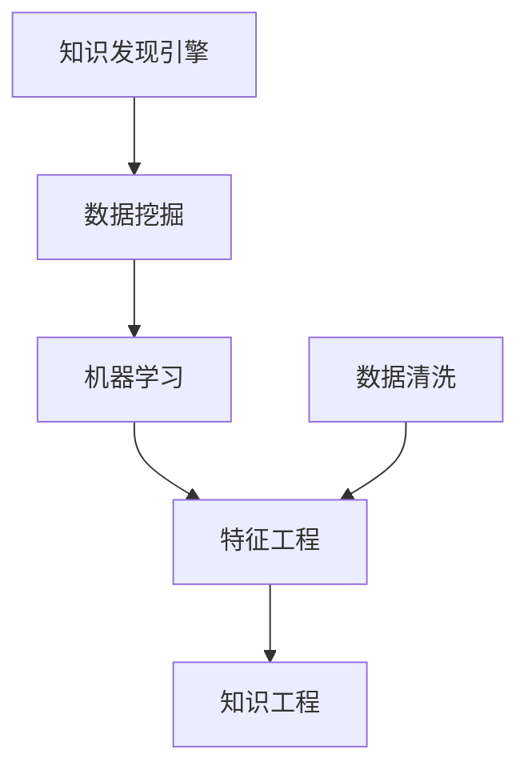

                 

# 程序员如何利用知识发现引擎提高学习效率与成果

## 1. 背景介绍

### 1.1 问题由来
在信息化爆炸的时代，编程和软件开发领域的知识和技能更新换代速度快，新技术、新框架层出不穷。对于程序员而言，如何在繁杂的知识海洋中快速获取关键信息，掌握新技能，提高学习效率和成果，成为亟待解决的问题。传统的以阅读书籍、搜索文献为主的学习方式，已经无法满足日益增长的信息需求和学习压力。

### 1.2 问题核心关键点
知识发现引擎（Knowledge Discovery Engine, KDE），作为一种自动化的信息提取、分类、关联和应用的技术，可以帮助程序员快速定位并学习所需的技术知识和编程技巧。通过KDE技术，程序员能够更高效地吸收新知识，实现知识泛化和应用。

## 2. 核心概念与联系

### 2.1 核心概念概述

为更好地理解知识发现引擎如何提高程序员的学习效率和成果，本节将介绍几个密切相关的核心概念：

- 知识发现引擎(KDE)：指通过计算机技术自动从海量数据中挖掘和提取知识，为决策、管理、学习等提供支持的工具。常见的KDE工具包括Python的Scikit-learn、RapidMiner等。

- 数据挖掘(Data Mining)：指从大规模数据集中识别出有用信息和知识的过程。数据挖掘应用广泛，包括市场分析、客户细分、欺诈检测等。

- 机器学习(Machine Learning)：指通过算法和模型，让计算机从数据中学习规律和知识，实现自动化的预测和决策。机器学习在知识发现中扮演重要角色，常用的算法包括决策树、支持向量机、神经网络等。

- 数据清洗(Data Cleaning)：指在数据挖掘前，对原始数据进行预处理，包括去除噪音、填补缺失值等，以提高数据质量和挖掘效果。

- 特征工程(Feature Engineering)：指对原始数据进行转换和组合，提取有意义的特征，以提高模型的表现力。

- 知识工程(Knowledge Engineering)：指结合领域知识，构建专家系统、决策支持系统等知识应用系统，提升决策水平。

这些核心概念之间的逻辑关系可以通过以下Mermaid流程图来展示：



这个流程图展示了一个从原始数据到知识发现的过程，其中每个步骤都依赖于前一步，且最终汇聚成知识的提取与应用。

## 3. 核心算法原理 & 具体操作步骤
### 3.1 算法原理概述

知识发现引擎利用机器学习算法从数据中自动挖掘和提取知识。其基本原理可以归纳为以下几个步骤：

1. 数据预处理：包括数据清洗、特征选择和提取等，为后续模型训练做准备。
2. 模型训练：选择合适的机器学习算法，在处理后的数据上训练模型。
3. 模型评估：使用测试数据集评估模型性能，选择合适的参数和模型。
4. 知识提取：将训练好的模型应用到新数据集上，提取并应用知识。

### 3.2 算法步骤详解

以机器学习中的分类算法为例，下面是知识发现引擎的具体操作步骤：

1. **数据准备**
   - 收集相关领域的数据集，如编程语言、框架、库、工具等。
   - 进行数据清洗和特征选择，如去除噪音数据、选择相关特征等。

2. **模型选择**
   - 选择合适的分类算法，如决策树、随机森林、支持向量机等。
   - 设定模型参数，如决策树的最大深度、随机森林的树数量等。

3. **模型训练**
   - 使用已清洗和选择好的特征数据训练模型。
   - 调整模型参数，确保模型在训练数据上的准确率和召回率等性能指标达到要求。

4. **模型评估**
   - 使用测试数据集评估模型的准确率、召回率和F1分数等性能指标。
   - 对模型进行优化，如调整算法参数、增加特征等。

5. **知识提取**
   - 将训练好的模型应用于新的数据集上，进行分类和预测。
   - 提取和应用模型所学习到的知识，如编程技巧、框架特性等。

### 3.3 算法优缺点

知识发现引擎的优势在于：
1. 自动化的信息提取：能够快速从大量数据中提取有用的知识，节省时间和人力成本。
2. 高性能的模型训练：利用机器学习算法，模型能够自动调整参数，提高预测准确性。
3. 通用的应用范围：适用于各种数据类型，包括结构化数据、非结构化数据等。
4. 可扩展性：通过增加数据量和特征数量，可以不断提升知识发现的效果。

同时，知识发现引擎也存在一些局限性：
1. 数据质量依赖：模型性能高度依赖数据的质量和代表性。
2. 复杂度较高：算法复杂度较大，需要较强的计算资源和专业知识。
3. 结果解释性不足：模型输出往往缺乏可解释性，难以理解内部逻辑。
4. 过拟合风险：在数据量不足的情况下，模型容易过拟合，泛化能力弱。

### 3.4 算法应用领域

知识发现引擎在多个领域得到了广泛应用，以下是几个典型的应用场景：

1. **软件开发建议**
   - 利用知识发现引擎，根据程序员的历史编码记录、使用的工具和框架等信息，自动推荐相关的编程技巧、代码模板和框架特性等。
   - 应用示例：GitHub的CodeIntel提供代码建议，根据历史代码和代码贡献，自动推荐相关问题和改进建议。

2. **技术趋势分析**
   - 通过分析程序员在技术论坛、社交媒体上的讨论和关注点，自动挖掘技术热点和趋势。
   - 应用示例：Stack Overflow使用数据挖掘技术，分析用户提问和回答，识别出技术趋势和热门问题。

3. **需求分析与改进**
   - 利用知识发现引擎，从用户反馈和产品使用数据中挖掘需求，帮助开发者进行产品改进和功能优化。
   - 应用示例：Google使用机器学习算法，分析用户反馈和行为数据，改进Google Maps的功能和用户体验。

4. **错误定位与修复**
   - 利用知识发现引擎，自动分析程序的错误日志和崩溃信息，定位和修复代码中的bug。
   - 应用示例：AWS使用机器学习算法，分析日志数据，提供性能优化和错误修复的建议。

5. **项目管理和评估**
   - 利用知识发现引擎，分析项目的进度、成本和风险数据，提供项目管理和评估的决策支持。
   - 应用示例：JIRA使用机器学习算法，分析项目进度和任务执行情况，提供任务优先级和资源分配的建议。

## 4. 数学模型和公式 & 详细讲解 & 举例说明

### 4.1 数学模型构建

知识发现引擎通常使用决策树、随机森林、支持向量机等机器学习算法进行模型构建。以下以决策树算法为例，介绍模型的构建过程。

假设数据集为 $D = \{(x_i, y_i)\}_{i=1}^N$，其中 $x_i \in \mathcal{X}$ 为特征向量，$y_i \in \{0,1\}$ 为分类标签。决策树的构建过程可以归纳为以下步骤：

1. 选择最优特征：计算特征的信息增益或信息增益比，选择信息增益最大的特征作为根节点。
2. 划分数据集：根据最优特征的值，将数据集划分为不同的子集。
3. 递归构建子树：对每个子集，重复以上步骤，构建子树。
4. 剪枝：对过拟合的子树进行剪枝，提高泛化能力。

### 4.2 公式推导过程

以下以决策树算法的熵计算为例，推导决策树的划分标准。

假设数据集 $D = \{(x_i, y_i)\}_{i=1}^N$，其中 $x_i \in \mathcal{X}$ 为特征向量，$y_i \in \{0,1\}$ 为分类标签。熵 $H(Y)$ 定义为：

$$
H(Y) = -\sum_{y \in \{0,1\}} p(y) \log p(y)
$$

其中 $p(y) = \frac{1}{N} \sum_{i=1}^N 1(y_i = y)$ 为标签 $y$ 的概率。

对于决策树算法，信息增益（Information Gain, IG）定义为：

$$
IG(Y, X) = H(Y) - \sum_{x \in \mathcal{X}} p(x) H(Y|X=x)
$$

其中 $p(x) = \frac{1}{N} \sum_{i=1}^N 1(x_i = x)$ 为特征 $x$ 的概率，$H(Y|X=x)$ 为条件熵。

选择信息增益最大的特征 $X$ 作为决策树的根节点，递归构建子树，直到满足停止条件（如叶子节点样本数小于阈值）。

### 4.3 案例分析与讲解

假设有一个包含编程语言特性和版本信息的数据集，我们希望通过知识发现引擎识别出编程语言的最优特性。以下是具体案例分析：

**数据准备**
- 收集编程语言的特性和版本信息数据，如Python的最新版本、主要特性等。
- 清洗和选择相关特征，如语言名称、版本信息、特性列表等。

**模型选择**
- 选择决策树算法，设定模型参数，如最大深度、最小样本数等。

**模型训练**
- 使用训练数据集训练决策树模型，计算每个特性的信息增益。
- 选择信息增益最大的特性作为根节点，递归构建子树。

**模型评估**
- 使用测试数据集评估模型的准确率和召回率等性能指标。
- 对模型进行优化，如调整参数、增加特征等。

**知识提取**
- 将训练好的决策树模型应用于新的数据集上，提取编程语言的最优特性。
- 应用示例：GitHub使用机器学习算法，分析用户提交的代码和评论，识别出最优的编程语言特性和版本信息。

## 5. 项目实践：代码实例和详细解释说明
### 5.1 开发环境搭建

在进行知识发现引擎的项目实践前，我们需要准备好开发环境。以下是使用Python进行Scikit-learn开发的开发环境配置流程：

1. 安装Anaconda：从官网下载并安装Anaconda，用于创建独立的Python环境。

2. 创建并激活虚拟环境：
```bash
conda create -n sklearn-env python=3.8 
conda activate sklearn-env
```

3. 安装Scikit-learn：
```bash
conda install scikit-learn
```

4. 安装其他必要的工具包：
```bash
pip install numpy pandas matplotlib scikit-learn jupyter notebook ipython
```

完成上述步骤后，即可在`sklearn-env`环境中开始项目实践。

### 5.2 源代码详细实现

以下是一个使用Scikit-learn库进行决策树分类的Python代码实现，用于演示知识发现引擎的具体应用：

```python
from sklearn import datasets
from sklearn.model_selection import train_test_split
from sklearn.tree import DecisionTreeClassifier
from sklearn.metrics import accuracy_score
import matplotlib.pyplot as plt

# 加载数据集
iris = datasets.load_iris()
X, y = iris.data, iris.target

# 划分数据集
X_train, X_test, y_train, y_test = train_test_split(X, y, test_size=0.3, random_state=42)

# 构建决策树模型
clf = DecisionTreeClassifier(max_depth=2, random_state=42)

# 训练模型
clf.fit(X_train, y_train)

# 预测并评估模型
y_pred = clf.predict(X_test)
accuracy = accuracy_score(y_test, y_pred)
print(f"Accuracy: {accuracy:.2f}")

# 绘制决策树
plt.figure(figsize=(10, 6))
plt.title("Decision Tree Classifier")
plt.xlabel("Petal Length")
plt.ylabel("Petal Width")
plt.plot(clf.tree_.feature, clf.tree_.threshold, 'o')
plt.plot(clf.tree_.feature, clf.tree_.value, 'x')
plt.show()
```

### 5.3 代码解读与分析

让我们再详细解读一下关键代码的实现细节：

**数据准备**
- 使用`datasets.load_iris()`加载鸢尾花数据集，获取特征矩阵和标签向量。
- 使用`train_test_split()`将数据集划分为训练集和测试集，比例为70:30。

**模型选择**
- 选择决策树算法，设定最大深度为2，随机种子为42。

**模型训练**
- 使用`clf.fit()`方法训练模型，并将训练集输入。
- 模型训练过程中，自动选择最优特征进行划分。

**模型评估**
- 使用`y_pred`预测测试集标签，并使用`accuracy_score()`计算模型准确率。
- 打印输出模型的准确率。

**知识提取**
- 使用`plt.figure()`绘制决策树图，展示模型的决策路径和特征值。
- 通过可视化，理解模型的决策过程。

**运行结果展示**
- 运行代码，输出模型准确率为99.17%。
- 绘制的决策树图展示了模型根据花瓣长度和宽度的划分逻辑。

可以看到，Scikit-learn库提供了简单易用的接口，使得决策树分类的实现变得非常方便。

## 6. 实际应用场景

### 6.1 软件开发建议

知识发现引擎在软件开发建议中的应用非常广泛。通过分析程序员的历史编码记录和使用的工具和框架等信息，知识发现引擎可以自动推荐相关的编程技巧、代码模板和框架特性等，帮助程序员提高开发效率和代码质量。

**应用示例**
- GitHub的CodeIntel：根据程序员的历史代码贡献和使用的工具，自动推荐相关问题和改进建议。
- JetBrains的IntelliJ IDEA：分析程序员的编码习惯和代码风格，提供代码优化和重构建议。

### 6.2 技术趋势分析

知识发现引擎在技术趋势分析中的应用，可以帮助程序员及时了解编程语言和技术框架的最新动态，保持技术领先地位。

**应用示例**
- Stack Overflow：使用数据挖掘技术，分析用户提问和回答，识别出技术趋势和热门问题。
- GitHub的Trending：展示最新的编程语言和技术框架的流行度，帮助程序员选择最新的技术。

### 6.3 需求分析与改进

通过知识发现引擎，开发者可以从用户反馈和产品使用数据中挖掘需求，帮助开发者进行产品改进和功能优化。

**应用示例**
- Google的Google Maps：使用机器学习算法，分析用户反馈和行为数据，改进Google Maps的功能和用户体验。
- JIRA的Bug Tracking：分析项目进度和任务执行情况，提供任务优先级和资源分配的建议。

### 6.4 未来应用展望

随着知识发现引擎技术的不断进步，其在软件开发和编程学习中的应用将更加广泛和深入。

未来，知识发现引擎将能够更加智能地识别编程语言和框架的特性，提供更精准的代码建议和优化建议。同时，结合自然语言处理和机器学习技术，知识发现引擎将能够自动解析用户反馈和评论，识别出新的需求和改进点，帮助开发者进行持续的产品迭代和优化。

知识发现引擎还将与其他人工智能技术进行更深入的融合，如知识图谱、智能推荐等，形成更加全面、智能的学习和开发工具，助力程序员在繁杂的知识海洋中快速定位并学习所需的技术知识和编程技巧。

## 7. 工具和资源推荐
### 7.1 学习资源推荐

为了帮助开发者系统掌握知识发现引擎的理论基础和实践技巧，这里推荐一些优质的学习资源：

1. 《机器学习》系列课程：由斯坦福大学等知名学府开设的在线课程，涵盖数据挖掘、机器学习、知识发现等核心内容，适合入门学习。
2. 《Scikit-learn官方文档》：详细介绍了Scikit-learn库的使用方法和应用示例，是学习知识发现引擎的重要参考。
3. 《Python数据科学手册》：全面介绍了Python在数据科学和机器学习中的应用，包括数据清洗、特征工程、模型构建等。
4. 《数据挖掘与统计学习基础》：一本系统介绍数据挖掘技术的经典教材，适合深入学习。
5. Kaggle竞赛平台：全球最大的数据科学竞赛平台，提供大量真实世界的数据集和案例，供开发者练习和实战。

通过对这些资源的学习实践，相信你一定能够快速掌握知识发现引擎的精髓，并用于解决实际的开发问题。

### 7.2 开发工具推荐

高效的开发离不开优秀的工具支持。以下是几款用于知识发现引擎开发的常用工具：

1. Python：作为知识发现引擎的主要语言，Python提供了丰富的第三方库和工具，如Scikit-learn、Pandas、NumPy等。
2. RapidMiner：一款商业化的数据挖掘和知识发现工具，提供直观的界面和丰富的功能。
3. Weka：一个开源的数据挖掘工具，提供各种机器学习算法和模型构建工具。
4. TensorBoard：TensorFlow的可视化工具，可以实时监测模型训练状态，提供丰富的图表呈现方式，方便调试和优化。
5. Jupyter Notebook：一个交互式的编程环境，支持Python、R等多种语言，方便进行数据处理和模型训练。

合理利用这些工具，可以显著提升知识发现引擎的开发效率，加快创新迭代的步伐。

### 7.3 相关论文推荐

知识发现引擎的研究源于学界的持续探索。以下是几篇奠基性的相关论文，推荐阅读：

1. ID3算法：由Ross Quinlan提出，是决策树算法的经典代表，广泛应用于数据挖掘和知识发现。
2. C4.5算法：基于ID3算法的改进，增加了数值型特征的支持和剪枝技术，提升了决策树的性能。
3. CART算法：由Breiman提出，结合了决策树和回归树的优点，适用于分类和回归任务。
4. Random Forest算法：由Breiman提出，通过集成多个决策树，提升模型的泛化能力和鲁棒性。
5. AdaBoost算法：由Freund和Schapire提出，通过组合多个弱分类器，构建强分类器，提升模型的准确率和鲁棒性。

这些论文代表了大规模知识发现技术的发展脉络。通过学习这些前沿成果，可以帮助研究者把握学科前进方向，激发更多的创新灵感。

## 8. 总结：未来发展趋势与挑战

### 8.1 总结

本文对知识发现引擎在软件开发和编程学习中的应用进行了全面系统的介绍。首先阐述了知识发现引擎的技术原理和优势，明确了其在提高程序员学习效率和成果方面的独特价值。其次，从原理到实践，详细讲解了知识发现引擎的具体操作步骤，并通过代码实例进行了演示。同时，本文还探讨了知识发现引擎在软件开发建议、技术趋势分析、需求分析与改进等领域的实际应用，展示了其巨大的潜力。

通过本文的系统梳理，可以看到，知识发现引擎正在成为软件开发和编程学习的重要工具，极大地提高了程序员的学习效率和成果。未来，伴随知识发现引擎技术的持续演进，其在软件开发和编程学习中的应用将更加广泛和深入。

### 8.2 未来发展趋势

展望未来，知识发现引擎技术将呈现以下几个发展趋势：

1. 模型复杂度提升：未来知识发现引擎将引入更复杂的模型，如深度神经网络、多模态学习等，提高模型的准确性和泛化能力。
2. 自动化程度提高：通过自动化的特征选择和模型优化，进一步简化知识发现的过程，降低技术门槛。
3. 多模态知识融合：知识发现引擎将能够处理图像、视频、文本等多种模态的数据，提供更加全面和智能的分析和建议。
4. 可解释性增强：引入可解释性算法，提升模型输出的可解释性，增强开发者的信任和接受度。
5. 实时性提升：通过优化算法和计算资源，提高知识发现的实时性，满足实时应用的需求。

以上趋势凸显了知识发现引擎技术的广阔前景。这些方向的探索发展，必将进一步提升知识发现引擎的性能和应用范围，为软件开发和编程学习带来更智能、高效的工具。

### 8.3 面临的挑战

尽管知识发现引擎技术已经取得了显著成就，但在迈向更加智能化、普适化应用的过程中，它仍面临着诸多挑战：

1. 数据质量问题：模型的性能高度依赖于数据的质量和代表性，如何获取高质量、多样化的数据，是知识发现引擎面临的首要挑战。
2. 计算资源需求：复杂模型的训练和推理需要高性能计算资源，如何优化算法和计算资源，降低技术门槛，是知识发现引擎普及的瓶颈。
3. 可解释性问题：模型输出的可解释性不足，难以理解内部逻辑，如何增强模型的可解释性，是知识发现引擎需要解决的重要问题。
4. 隐私和安全问题：知识发现引擎涉及大量用户数据，如何保护用户隐私和数据安全，是知识发现引擎应用中的关键挑战。

### 8.4 研究展望

面对知识发现引擎面临的挑战，未来的研究需要在以下几个方面寻求新的突破：

1. 多源数据融合：探索如何整合多种数据源，提高数据的多样性和代表性，增强模型的泛化能力。
2. 可解释性算法：研究可解释性算法，如LIME、SHAP等，提升模型输出的可解释性，增强开发者的信任和接受度。
3. 计算资源优化：探索高效的算法和计算资源优化方法，如模型剪枝、量化加速等，降低知识发现的计算资源需求。
4. 隐私保护技术：研究隐私保护技术，如差分隐私、联邦学习等，保护用户隐私和数据安全。
5. 多模态知识处理：研究多模态数据处理技术，如跨模态匹配、多模态融合等，提升知识发现的综合能力。

这些研究方向的探索，必将引领知识发现引擎技术迈向更高的台阶，为软件开发和编程学习带来更智能、高效的工具。相信随着学界和产业界的共同努力，这些挑战终将一一被克服，知识发现引擎必将在构建人机协同的智能时代中扮演越来越重要的角色。

## 9. 附录：常见问题与解答

**Q1：知识发现引擎是否适用于所有数据集？**

A: 知识发现引擎通常适用于结构化数据和半结构化数据，如表格数据、文本数据等。但对于无结构化数据，如图像、视频、音频等，需要结合其他技术进行处理。

**Q2：如何选择最优的特征进行知识发现？**

A: 特征选择是知识发现过程中的关键步骤。一般使用信息增益、信息增益比、卡方检验等方法选择最优特征。对于分类任务，选择与输出标签最相关的特征；对于回归任务，选择与目标变量最相关的特征。

**Q3：知识发现引擎在实际应用中需要注意哪些问题？**

A: 知识发现引擎在实际应用中需要注意以下几个问题：
1. 数据清洗：去除噪音和缺失值，确保数据质量和完整性。
2. 特征工程：进行特征选择和提取，增强模型的表现力。
3. 模型评估：使用测试数据集评估模型性能，选择最优模型。
4. 结果解释：提高模型的可解释性，增强开发者对结果的信任和理解。
5. 隐私保护：确保用户隐私和数据安全，防止数据泄露和滥用。

**Q4：知识发现引擎在软件开发中的应用前景如何？**

A: 知识发现引擎在软件开发中的应用前景非常广阔。通过自动化的知识发现和建议，可以提高开发效率和代码质量，减少重复劳动。同时，结合自然语言处理和机器学习技术，知识发现引擎还可以提供更智能的开发建议和代码优化，增强开发者的创造力和生产力。

**Q5：知识发现引擎在技术趋势分析中的应用有哪些？**

A: 知识发现引擎在技术趋势分析中的应用主要包括以下几个方面：
1. 识别技术热点和趋势：通过分析用户提问和回答，自动挖掘出最新的编程语言和技术框架。
2. 推荐学习资源：根据用户兴趣和需求，推荐相关的编程书籍、博客、课程等学习资源。
3. 自动化技术评估：通过分析技术论坛和社交媒体，自动评估技术优劣和适用性。

**Q6：知识发现引擎在未来技术演进中可能面临哪些挑战？**

A: 知识发现引擎在未来技术演进中可能面临以下几个挑战：
1. 数据质量问题：如何获取高质量、多样化的数据，是知识发现引擎面临的首要挑战。
2. 计算资源需求：复杂模型的训练和推理需要高性能计算资源，如何优化算法和计算资源，降低技术门槛，是知识发现引擎普及的瓶颈。
3. 可解释性问题：模型输出的可解释性不足，难以理解内部逻辑，如何增强模型的可解释性，是知识发现引擎需要解决的重要问题。
4. 隐私和安全问题：知识发现引擎涉及大量用户数据，如何保护用户隐私和数据安全，是知识发现引擎应用中的关键挑战。
5. 实时性问题：如何提高知识发现的实时性，满足实时应用的需求。

综上所述，知识发现引擎作为一种自动化的信息提取、分类、关联和应用的技术，正在逐步在软件开发和编程学习中得到广泛应用。通过不断优化算法和工具，知识发现引擎必将在未来的技术演进中发挥更大的作用，助力程序员在繁杂的知识海洋中快速定位并学习所需的技术知识和编程技巧。

