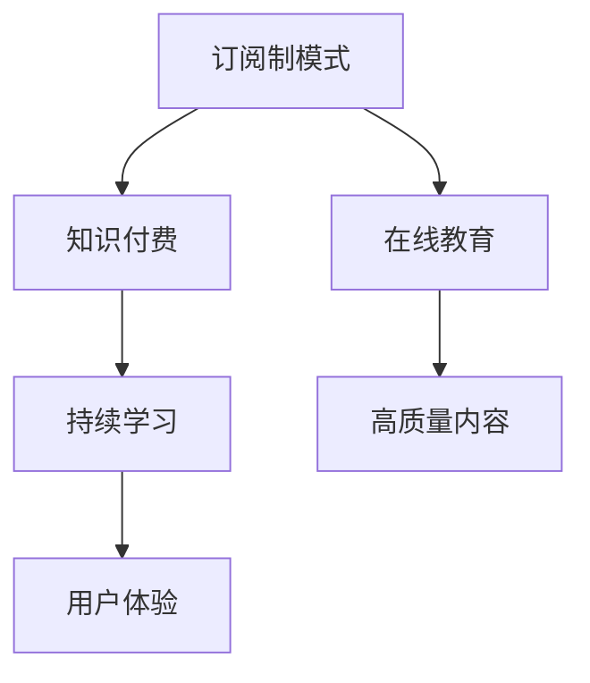

                 

# 程序员如何利用订阅制模式进行知识付费

> 关键词：订阅制模式,知识付费,程序员,商业模式,在线教育,持续学习

## 1. 背景介绍

### 1.1 问题由来

近年来，随着互联网技术的飞速发展和数字经济时代的来临，知识付费行业逐渐兴起。程序员作为互联网技术的重要执行者，面临着不断更新的技术栈和业务需求，持续学习成为一种刚需。然而，高昂的线下培训课程和海量的零散内容难以满足程序员的学习需求。订阅制模式，作为一种创新的知识付费模式，为程序员提供了结构化、系统化的持续学习路径。

### 1.2 问题核心关键点

订阅制模式的核心在于通过定期支付费用，获取定期的优质内容和服务。这种模式在在线教育、技术培训等领域取得了巨大的成功，帮助用户构建了长期的持续学习机制。对于程序员而言，订阅制模式能够提供持续的、有保障的优质技术资源，满足其学习需求。

## 2. 核心概念与联系

### 2.1 核心概念概述

为更好地理解订阅制模式在知识付费中的应用，本节将介绍几个密切相关的核心概念：

- 订阅制模式(Subscription Model)：指用户通过定期支付费用，获取订阅平台提供的定量的优质内容和服务的模式。订阅费用可以根据服务内容、时长、频次等因素定价。

- 知识付费(Knowledge-Based Payment)：指用户为获取知识、技能和信息，进行有偿交易的行为。知识付费平台通过提供专业化、系统化的内容服务，满足用户的学习需求。

- 在线教育(E-Learning)：指利用互联网技术，通过在线平台提供教学内容和学习资源的一种教育形式。在线教育平台通常采用订阅制、按需付费等多种模式，为用户提供灵活的学习路径。

- 持续学习(Lifelong Learning)：指个人在职业生涯中，持续不断地获取新知识、技能和信息，适应不断变化的技术和市场需求。订阅制模式能够为程序员提供系统化的学习计划，帮助其实现持续学习。

- 高质量内容(High-Quality Content)：指经过专业设计、制作，具备一定深度和广度的教育、技术类内容。高质量内容是订阅制模式的核心吸引力。

- 用户体验(User Experience)：指用户在获取和使用订阅服务时，所感受到的整体感受和满意度。优秀的用户体验能够提高用户黏性，增强订阅制模式的吸引力。

这些核心概念之间的逻辑关系可以通过以下Mermaid流程图来展示：



这个流程图展示了一些核心概念及其之间的关系：

1. 订阅制模式是知识付费的主要形式之一，通过定期付费获取优质内容。
2. 在线教育平台通常采用订阅制模式，提供结构化、系统化的学习资源。
3. 持续学习依赖于系统化、持续的学习路径，订阅制模式可以提供这样的路径。
4. 高质量内容是订阅制模式的核心吸引力，必须保证内容的深度和广度。
5. 用户体验是订阅制模式成功的关键因素，良好的用户体验能够提高用户满意度。

## 3. 核心算法原理 & 具体操作步骤

### 3.1 算法原理概述

订阅制模式的算法原理主要围绕如何设计有效的定价策略和内容推荐机制展开。

- 定价策略：确定订阅费用时需要考虑内容质量、服务时长、频次等因素，通过市场调研和用户反馈不断优化定价策略。
- 内容推荐：根据用户的阅读历史、兴趣标签、学习进度等数据，推荐高质量、个性化内容，提升用户体验。

### 3.2 算法步骤详解

**Step 1: 定义订阅模式**

1. 确定订阅内容：选择具有高价值、高需求的内容，如系统化的技术教程、实战案例、专家访谈等。
2. 设计订阅计划：根据内容质量和定价策略，设计月度、季度、年度等不同类型的订阅计划。
3. 定价计算：根据订阅时长、内容数量、平台运营成本等因素，计算每个订阅计划的价格。

**Step 2: 建立定价模型**

1. 市场调研：通过问卷调查、用户反馈等方式，了解市场需求和用户支付意愿。
2. 成本分析：估算内容制作、平台运维等成本，保证定价合理。
3. 动态定价：根据市场反应、用户评价等数据，灵活调整定价策略。

**Step 3: 内容推荐机制**

1. 用户画像：根据用户的历史行为、学习进度等数据，构建用户画像。
2. 内容匹配：将用户画像与内容标签进行匹配，推荐相关内容。
3. 实时更新：根据用户反馈、学习进度等数据，实时更新推荐算法。

**Step 4: 支付和分发**

1. 支付系统：开发安全的支付系统，支持多种支付方式，如信用卡、支付宝、微信等。
2. 内容分发：通过在线平台，向用户分发订阅内容。
3. 用户管理：记录用户订阅历史、学习进度等数据，提供个性化服务。

**Step 5: 数据分析和优化**

1. 用户行为分析：通过分析用户行为数据，了解用户需求和偏好。
2. 订阅率优化：根据用户行为分析结果，优化订阅策略和推荐算法。
3. 反馈机制：收集用户反馈，不断改进平台和服务。

### 3.3 算法优缺点

订阅制模式具有以下优点：
1. 定期付费：通过定期付费，用户能够持续获取优质内容，形成长期的学习机制。
2. 灵活性高：用户可以选择不同类型的订阅计划，满足不同的学习需求。
3. 高质量内容：平台能够提供系统化、高品质的内容，保证用户获取的知识具有深度和广度。
4. 持续优化：通过用户反馈和行为分析，不断优化内容和推荐算法，提升用户体验。

同时，该模式也存在一定的局限性：
1. 订阅费用较高：对于预算有限的用户，订阅费用可能较高，影响用户购买意愿。
2. 内容更新不及时：平台需要持续更新内容，否则用户容易产生倦怠感，流失率增加。
3. 质量参差不齐：平台上的内容良莠不齐，部分低质量内容可能影响用户整体体验。
4. 用户黏性不足：如果用户没有及时获得优质内容，容易产生流失。

尽管存在这些局限性，但就目前而言，订阅制模式仍然是知识付费行业的主流范式。未来相关研究的重点在于如何进一步降低订阅费用，提高内容质量，增强用户黏性，同时兼顾平台可持续性等因素。

### 3.4 算法应用领域

订阅制模式已经在多个领域得到广泛应用，如在线教育、技术培训、财务管理、健康管理等。对于程序员而言，订阅制模式可以应用于以下场景：

- 系统化编程训练：选择包含基础编程知识、实战案例、项目开发等内容的订阅计划，系统化学习编程技能。
- 新技术跟踪：订阅包含前沿技术、工具和框架的教程，及时了解技术动态，保持竞争力。
- 项目开发指南：选择包含具体项目开发流程、问题解决案例等内容的订阅计划，提升项目开发能力。
- 技术交流：订阅包含技术社区、专家访谈等内容的订阅计划，与其他程序员交流经验，拓宽视野。

此外，订阅制模式还可以应用于社区服务、产品推广等领域，为程序员提供全方位的学习和发展支持。

## 4. 数学模型和公式 & 详细讲解 & 举例说明

### 4.1 数学模型构建

本节将使用数学语言对订阅制模式进行更加严格的刻画。

记订阅模式为 $M$，内容集合为 $C$，用户集合为 $U$，订阅费用为 $P$，订阅时长为 $T$。订阅模式定义为：

$$
M = \{(M_1, P_1, T_1), (M_2, P_2, T_2), \ldots\}
$$

其中 $M_i$ 为第 $i$ 个订阅计划，$P_i$ 为对应的订阅费用，$T_i$ 为订阅时长。

用户 $u$ 订阅计划 $M_i$ 的过程可以表示为：

$$
u \in M_i \Leftrightarrow u \in C \land u \in U \land (u \in M_i \land u \in M_{i+1} \text{ for } i \in [0, T_i])
$$

即用户 $u$ 订阅计划 $M_i$ 的前提是其在内容集合 $C$ 中，在用户集合 $U$ 中，且在订阅时长内多次续订。

### 4.2 公式推导过程

以下我们以编程训练订阅为例，推导订阅费用的计算公式。

假设订阅计划 $M_1$ 包含 $n$ 个内容 $C_1, C_2, \ldots, C_n$，用户 $u$ 订阅 $M_1$，并支付费用 $P$。假设每个内容的价格为 $p_i$，用户每次订阅的时间间隔为 $\Delta t$，平台内容更新频率为 $\gamma$。则订阅总费用为：

$$
P = \sum_{i=1}^n p_i + \sum_{i=1}^n p_i \times \Delta t \times \gamma \times (1 - e^{-\Delta t \times \gamma})
$$

其中 $e$ 为自然对数的底数，$e^{-\Delta t \times \gamma}$ 表示用户订阅间隔内更新内容的平均次数。

### 4.3 案例分析与讲解

以某编程训练平台为例，该平台提供月度订阅计划 $M_1$，包含基础编程知识、实战案例、项目开发等内容，订阅费用为 $P_1 = 199$ 元/月。每个内容的价格为 $p_i = 1$ 元/内容，平台每周更新内容一次，即 $\gamma = 1/7$。用户 $u$ 每周订阅一次，每次订阅的时间间隔为 $\Delta t = 1$ 周。则用户订阅总费用为：

$$
P_1 = \sum_{i=1}^n p_i + \sum_{i=1}^n p_i \times \Delta t \times \gamma \times (1 - e^{-\Delta t \times \gamma}) = 4.29 \text{元/周}
$$

即每月订阅费用为 $4.29 \times 4 = 17.16$ 元。

可以看到，订阅费用随着内容的数量和平台更新频率的增加而增加。合理定价和内容更新频率的设置，是订阅制模式成功的关键因素。

## 5. 项目实践：代码实例和详细解释说明

### 5.1 开发环境搭建

在进行订阅制模式实践前，我们需要准备好开发环境。以下是使用Python进行Web开发的环境配置流程：

1. 安装Python：从官网下载并安装Python 3.x版本。
2. 安装Flask：使用pip命令安装Flask框架，用于搭建Web应用。
3. 安装SQLite：安装SQLite数据库，用于存储用户信息和订阅数据。
4. 安装Flask-RESTful：使用pip命令安装Flask-RESTful扩展，用于处理API请求。
5. 安装Flask-SocketIO：使用pip命令安装Flask-SocketIO扩展，用于实现实时通信功能。

完成上述步骤后，即可在Python环境下开始订阅制模式的开发实践。

### 5.2 源代码详细实现

下面我们以编程训练平台为例，给出使用Flask框架实现订阅制模式的功能的PyTorch代码实现。

首先，定义订阅计划的模型类：

```python
from flask_sqlalchemy import SQLAlchemy
from flask import Flask, jsonify, request

app = Flask(__name__)
db = SQLAlchemy(app)

class Plan(db.Model):
    id = db.Column(db.Integer, primary_key=True)
    name = db.Column(db.String(100), unique=True)
    price = db.Column(db.Float)
    duration = db.Column(db.Integer)

    def __init__(self, name, price, duration):
        self.name = name
        self.price = price
        self.duration = duration
```

然后，定义用户订阅计划的API接口：

```python
@app.route('/plans', methods=['GET'])
def get_plans():
    plans = Plan.query.all()
    plan_data = []
    for plan in plans:
        plan_data.append({'name': plan.name, 'price': plan.price, 'duration': plan.duration})
    return jsonify(plan_data)

@app.route('/plans/<int:plan_id>', methods=['GET'])
def get_plan(plan_id):
    plan = Plan.query.get(plan_id)
    if not plan:
        return jsonify({'error': 'Plan not found'})
    return jsonify({'name': plan.name, 'price': plan.price, 'duration': plan.duration})

@app.route('/plans/<int:plan_id>/subscribe', methods=['POST'])
def subscribe(plan_id):
    plan = Plan.query.get(plan_id)
    if not plan:
        return jsonify({'error': 'Plan not found'})
    user_id = request.json.get('user_id')
    subscription = Subscription(user_id=user_id, plan_id=plan_id)
    db.session.add(subscription)
    db.session.commit()
    return jsonify({'success': True})
```

最后，定义用户订阅计划的数据模型和数据表：

```python
class Subscription(db.Model):
    id = db.Column(db.Integer, primary_key=True)
    user_id = db.Column(db.Integer, db.ForeignKey('user.id'))
    plan_id = db.Column(db.Integer, db.ForeignKey('plan.id'))
    created_at = db.Column(db.DateTime, default=datetime.now())
```

完成上述步骤后，即可在Flask应用中实现订阅计划的创建、获取和订阅等功能。

### 5.3 代码解读与分析

让我们再详细解读一下关键代码的实现细节：

**Plan类**：
- `__init__`方法：初始化订阅计划的基本信息，包括名称、价格和时长。

**订阅API**：
- `get_plans`方法：获取所有订阅计划的信息，并返回JSON格式的数据。
- `get_plan`方法：根据计划ID获取单个订阅计划的信息，并返回JSON格式的数据。
- `subscribe`方法：用户订阅计划，并保存订阅信息到数据库中。

**Subscription类**：
- `__init__`方法：初始化订阅信息，包括用户ID、计划ID和创建时间。

通过上述代码，我们可以看到，使用Flask框架实现订阅制模式的开发相对简单。开发者可以将更多精力放在业务逻辑的实现上，而不必过多关注底层的实现细节。

当然，工业级的系统实现还需考虑更多因素，如用户管理、权限控制、支付处理、内容分发等，但核心的订阅流程基本与此类似。

## 6. 实际应用场景

### 6.1 在线编程教育

在线编程教育平台通常采用订阅制模式，帮助用户系统化学习编程知识，提升编程技能。用户可以通过订阅高价值的课程内容，获得专家指导和实时反馈，加速技能提升。

在技术实现上，平台可以设计不同类型的订阅计划，如初级、中级、高级课程包，满足不同水平的用户需求。订阅内容包括编程基础、实战案例、项目开发等，覆盖整个编程学习路径。用户通过订阅计划，可以按需获取课程资源，并通过平台提供的编程环境进行实战练习。

### 6.2 企业内训系统

企业内训系统通常用于提升员工的技能水平，满足业务发展的需求。通过订阅制模式，企业可以定制化的选择课程内容，提升员工的职业素养和技能水平。

在技术实现上，企业可以根据自己的需求，选择包含特定技能训练的课程计划。订阅内容包括技术教程、实战案例、项目开发等，覆盖整个技能提升路径。企业通过订阅计划，可以按需获取课程资源，并通过平台提供的培训环境进行实战练习。

### 6.3 技术交流社区

技术交流社区通常采用订阅制模式，帮助用户获取最新的技术动态，保持竞争力。用户可以通过订阅高价值的内容，了解前沿技术、工具和框架，与其他用户交流经验，拓宽视野。

在技术实现上，社区可以设计不同类型的订阅计划，如每月、每季度、每年度的技术动态订阅，满足不同用户的需求。订阅内容包括技术社区、专家访谈、案例分析等，覆盖最新的技术动态。用户通过订阅计划，可以按需获取最新内容，并通过社区平台与其他用户交流经验。

### 6.4 未来应用展望

随着订阅制模式在知识付费行业的不断成熟，未来的应用场景将更加广泛，为程序员提供更多的学习和发展支持。

在智慧教育领域，订阅制模式可以帮助学生系统化学习编程技能，提升编程素养。在企业培训领域，订阅制模式可以帮助企业定制化选择课程内容，提升员工的职业素养和技能水平。在技术交流领域，订阅制模式可以帮助用户获取最新的技术动态，保持竞争力。

此外，订阅制模式还可以应用于企业内部技术分享、开源项目协作等领域，为程序员提供全方位的学习和发展支持。相信随着订阅制模式的不断成熟，未来的应用场景将更加丰富，为程序员提供更多的学习和发展机会。

## 7. 工具和资源推荐

### 7.1 学习资源推荐

为了帮助开发者系统掌握订阅制模式的技术基础和实践技巧，这里推荐一些优质的学习资源：

1. 《订阅制模式详解》系列博文：由订阅制模式专家撰写，深入浅出地介绍了订阅制模式的原理、设计思路和实践技巧。

2. 《知识付费商业模型》课程：清华大学开设的在线课程，详细讲解了知识付费的商业模型和用户行为分析方法。

3. 《在线教育系统设计》书籍：涵盖了在线教育系统设计、开发、部署等多个方面，适合开发者全面掌握在线教育的技术架构。

4. 《Web开发实战指南》系列教程：GitHub上的开源教程，提供详细的Web开发实战案例，帮助开发者快速上手订阅制模式的开发。

5. 《订阅制模式案例分析》报告：分析了多个成功实施订阅制模式的平台案例，提供系统化的参考。

通过对这些资源的学习实践，相信你一定能够快速掌握订阅制模式的精髓，并用于解决实际的订阅制模式问题。

### 7.2 开发工具推荐

高效的开发离不开优秀的工具支持。以下是几款用于订阅制模式开发的常用工具：

1. Flask：基于Python的开源Web框架，灵活易用，适合快速迭代研究。
2. SQLAlchemy：Python ORM框架，提供方便的数据库操作API。
3. SQLite：轻量级关系型数据库，适用于Web应用的本地存储。
4. Flask-RESTful：基于Flask的RESTful API框架，支持RESTful风格的API开发。
5. Flask-SocketIO：基于Flask的WebSocket框架，支持实时通信功能。

合理利用这些工具，可以显著提升订阅制模式的开发效率，加快创新迭代的步伐。

### 7.3 相关论文推荐

订阅制模式的发展源于学界的持续研究。以下是几篇奠基性的相关论文，推荐阅读：

1. Subscription Modeling: An Overview of Current Trends and Future Directions：综述了订阅制模式的当前趋势和未来方向，提供了系统性的参考。
2. The Impact of Subscription Models on User Engagement：分析了订阅制模式对用户行为的影响，提供了丰富的用户行为分析数据。
3. Designing Effective Subscription Models for Online Services：介绍了设计有效订阅制模型的关键因素，提供了详细的实例分析。
4. Pricing Strategies in Subscription Models：分析了订阅制模式的定价策略，提供了多维度的定价方法。
5. Subscription Models in the Age of Big Data: Opportunities and Challenges：讨论了大数据背景下订阅制模式的机会和挑战，提供了前沿的思路和解决方案。

这些论文代表了大语言模型微调技术的发展脉络。通过学习这些前沿成果，可以帮助研究者把握学科前进方向，激发更多的创新灵感。

## 8. 总结：未来发展趋势与挑战

### 8.1 总结

本文对订阅制模式在知识付费中的应用进行了全面系统的介绍。首先阐述了订阅制模式的原理和设计思路，明确了其在大语言模型微调中的独特价值。其次，从原理到实践，详细讲解了订阅制模式的数学模型和关键步骤，给出了订阅制模式开发的全码实例。同时，本文还广泛探讨了订阅制模式在在线教育、企业内训、技术交流等领域的实际应用，展示了订阅制模式的广泛应用前景。此外，本文精选了订阅制模式的学习资源，力求为开发者提供全方位的技术指引。

通过本文的系统梳理，可以看到，订阅制模式正在成为知识付费行业的重要范式，极大地拓展了知识付费平台的应用边界，催生了更多的落地场景。受益于订阅制模式的创新性，用户能够持续获取优质内容，形成长期的学习机制。未来，伴随订阅制模式的不断演进，知识付费平台将能够提供更加灵活、高效、个性化的学习路径，为程序员提供全方位的学习和发展支持。

### 8.2 未来发展趋势

展望未来，订阅制模式将呈现以下几个发展趋势：

1. 个性化订阅：根据用户的学习进度、兴趣偏好等数据，提供个性化订阅计划，满足不同用户的需求。
2. 动态定价：根据市场需求和平台运营情况，动态调整订阅费用，保持订阅模式的可持续性。
3. 互动学习：引入互动式学习机制，如在线讨论、实时答疑等，提升用户的学习体验。
4. 跨平台协同：实现多平台、多设备协同学习，提升用户的学习效率。
5. 社区建设：构建活跃的技术社区，提供用户交流、合作的平台，增强用户的黏性。
6. 知识共享：鼓励用户分享学习资源和经验，形成知识共享的良性循环。

以上趋势凸显了订阅制模式的发展潜力，这些方向的探索发展，必将进一步提升订阅制模式的竞争力，为程序员提供更加系统化、个性化的学习路径。

### 8.3 面临的挑战

尽管订阅制模式已经取得了瞩目成就，但在迈向更加智能化、普适化应用的过程中，它仍面临着诸多挑战：

1. 订阅费用高昂：对于预算有限的用户，订阅费用可能较高，影响用户购买意愿。
2. 内容质量参差不齐：平台上的内容良莠不齐，部分低质量内容可能影响用户整体体验。
3. 用户流失率高：如果内容更新不及时，用户容易产生倦怠感，流失率增加。
4. 技术实现复杂：订阅制模式的系统设计、开发、部署较为复杂，需要具备较高的技术门槛。

尽管存在这些挑战，但就目前而言，订阅制模式仍然是知识付费行业的主流范式。未来相关研究的重点在于如何进一步降低订阅费用，提高内容质量，增强用户黏性，同时兼顾平台可持续性等因素。

### 8.4 未来突破

面对订阅制模式所面临的种种挑战，未来的研究需要在以下几个方面寻求新的突破：

1. 探索无订阅制模式：摆脱对定期付费的依赖，利用即时支付、按需付费等多种模式，提供更灵活的用户选择。
2. 内容质量控制：引入内容审核机制，保证平台上的内容质量，提供高价值的订阅服务。
3. 动态内容更新：实时更新平台内容，保证用户能够获取最新的技术动态和实战案例。
4. 用户体验优化：引入互动式学习机制，增强用户的学习体验，提升用户满意度。
5. 技术平台优化：优化订阅制模式的系统设计，降低技术门槛，提升平台的使用便捷性。

这些研究方向的探索，必将引领订阅制模式迈向更高的台阶，为程序员提供更加灵活、高效、个性化的学习路径，推动订阅制模式的持续发展。

## 9. 附录：常见问题与解答

**Q1：订阅制模式是否适用于所有知识付费领域？**

A: 订阅制模式在大多数知识付费领域中都能取得良好的效果，特别适合需要系统化学习、持续跟踪的场景。但对于一些具有较高不确定性、需要即时获取的领域，如新闻、资讯等，订阅制模式可能不够灵活。

**Q2：订阅制模式如何应对用户流失？**

A: 应对用户流失的关键在于提供高质量的内容和服务。平台需要持续更新内容，保证用户能够获取最新的技术动态和实战案例。同时，引入互动式学习机制，如在线讨论、实时答疑等，提升用户的学习体验，增强用户黏性。

**Q3：订阅制模式如何保证内容的持续性？**

A: 平台需要建立内容审核机制，保证平台上的内容质量。同时，引入内容审核机制，及时更新和优化内容，保证用户能够获取高价值的订阅服务。

**Q4：订阅制模式如何实现个性化订阅？**

A: 平台需要根据用户的学习进度、兴趣偏好等数据，提供个性化订阅计划。可以通过机器学习算法，分析用户的行为数据，生成个性化的推荐计划，满足不同用户的需求。

**Q5：订阅制模式如何提升用户体验？**

A: 平台需要引入互动式学习机制，如在线讨论、实时答疑等，提升用户的学习体验。同时，优化订阅制模式的系统设计，降低技术门槛，提升平台的使用便捷性。

通过以上回答，可以看到，订阅制模式在知识付费领域具有广泛的应用前景，但也面临着诸多挑战。通过不断优化和创新，订阅制模式必将在未来发展中取得更大的成功。

---

作者：禅与计算机程序设计艺术 / Zen and the Art of Computer Programming

