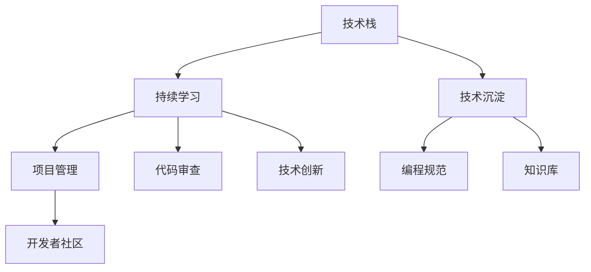

                 

# 程序员如何应对技术栈快速更新

> 关键词：技术栈更新, 持续学习, 技术沉淀, 编程规范, 项目管理, 代码审查, 开发者社区, 技术创新

## 1. 背景介绍

随着互联网和软件行业的快速发展和技术的不断迭代，程序员们每天都在与日新月异的技术栈打交道。技术的快速更新不仅带来了新的机会，也给程序员带来了巨大的压力和挑战。如何有效地应对技术栈的快速更新，成为一个重要的议题。

### 1.1 问题由来

在过去十年里，编程语言、框架、库等技术栈的更新速度明显加快。例如，JavaScript的ES6、ES2020等新标准的不断推出，Java的JDK升级和Spring Boot的版本迭代，Python的Pandas、TensorFlow等库的不断优化。这些技术栈的更新不仅增加了学习成本，还可能影响到已有项目的兼容性和稳定性。

### 1.2 问题核心关键点

针对技术栈的快速更新，我们首先需要明确几个核心问题：

- 如何保持技术栈的先进性？
- 如何管理已有的技术债务？
- 如何平衡创新与稳定性？
- 如何提升团队的技术素养？

针对以上问题，本文将系统性地介绍如何应对技术栈的快速更新，帮助程序员在技术快速变化的环境中持续学习、沉淀技术和提升团队能力。

## 2. 核心概念与联系

### 2.1 核心概念概述

为更好地理解如何应对技术栈的快速更新，本节将介绍几个密切相关的核心概念：

- 技术栈（Technical Stack）：一个软件项目中使用的编程语言、框架、库、数据库、中间件等所有技术的集合。
- 持续学习（Continuous Learning）：在技术快速更新的环境中，通过不断的学习新技术，保持技术栈的前沿性。
- 技术沉淀（Technology Accumulation）：在项目开发过程中，积累和沉淀有用的技术经验，形成技术资产。
- 编程规范（Coding Standards）：一套统一的编程风格和代码规范，以提高代码可读性和可维护性。
- 项目管理（Project Management）：包括项目规划、资源分配、进度跟踪、风险管理等，确保项目按时、按质、按预算完成。
- 代码审查（Code Review）：程序员之间相互审查代码，以提高代码质量和一致性。
- 开发者社区（Developer Community）：程序员通过技术社区、开源项目、技术博客等平台进行交流和协作，分享经验和资源。
- 技术创新（Technological Innovation）：利用新技术解决实际问题，提升产品的竞争力和用户体验。

这些核心概念之间的逻辑关系可以通过以下Mermaid流程图来展示：



这个流程图展示了一系列核心概念及其之间的关系：

1. 技术栈是项目开发的基础，持续学习、技术沉淀等都是为了保持技术栈的先进性和高效性。
2. 编程规范和代码审查有助于提升代码质量和一致性，项目管理确保项目的有序进行。
3. 开发者社区和代码审查促进了知识分享和技术交流，技术创新则通过新技术提升产品竞争力。

## 3. 核心算法原理 & 具体操作步骤

### 3.1 算法原理概述

应对技术栈快速更新的核心是持续学习和技术沉淀，其核心算法原理在于不断吸收新知识，同时保持对已有技术的熟练掌握和优化。

具体来说，可以采用以下方法：

- 通过课程、书籍、博客等途径持续学习新知识。
- 在项目开发过程中，通过技术沉淀形成技术资产。
- 根据项目需要，不断调整和优化技术栈。
- 利用编程规范和代码审查提升代码质量和团队协作效率。
- 通过项目管理保证项目按时、按质完成。

### 3.2 算法步骤详解

基于持续学习和技术沉淀的算法原理，应对技术栈快速更新的具体操作步骤如下：

**Step 1: 制定学习计划**

- 评估当前技术栈的先进性和适用性，列出需要学习的新技术。
- 制定合理的学习计划，如每月学习新技术的时间比例，每周学习的具体内容等。
- 选择高效的学习资源，如在线课程、书籍、视频教程等。

**Step 2: 实施技术沉淀**

- 在日常项目开发中，积累有用的技术经验，形成技术文档和代码库。
- 定期进行技术总结和回顾，形成技术博客、技术文章等知识沉淀。
- 通过技术讲座、培训等形式分享和传播技术经验。

**Step 3: 调整技术栈**

- 根据项目需求和团队能力，评估当前技术栈的优劣。
- 在评估结果的基础上，逐步调整技术栈，引入新技术和优化现有技术。
- 通过小规模实验验证新技术的可行性和性能，确保平稳过渡。

**Step 4: 优化代码质量**

- 制定并严格执行编程规范，确保代码风格和质量一致性。
- 实施代码审查机制，通过同事间的协作提高代码质量。
- 利用静态代码分析工具，及时发现和修复代码缺陷。

**Step 5: 强化项目管理**

- 制定详细的项目计划，包括任务分解、时间安排、资源分配等。
- 使用敏捷开发等方法，及时调整项目进度和优先级。
- 通过持续集成和自动化测试，保证软件质量和可靠性。

**Step 6: 融入开发者社区**

- 积极参与技术社区和开源项目，分享经验和资源。
- 关注最新的技术趋势和问题，获取行业内的最佳实践。
- 与同行进行交流和合作，共同解决技术难题。

### 3.3 算法优缺点

应对技术栈快速更新的算法具有以下优点：

- 持续学习和技术沉淀能够保持技术栈的先进性和高效性，避免因技术陈旧而带来的风险。
- 通过编程规范和代码审查提升代码质量和团队协作效率，减少技术债务。
- 项目管理保证了项目的有序进行，避免因技术更新而影响项目进度和质量。
- 开发者社区提供了丰富的学习资源和交流平台，促进技术学习和技术创新。

同时，该算法也存在一定的局限性：

- 学习新技术需要时间成本和精力投入，可能影响当前项目的工作进度。
- 技术沉淀和调整可能涉及较大的工作量，需确保不影响项目交付时间。
- 编程规范和代码审查需要团队成员的配合和执行，可能面临执行不严格的问题。
- 项目管理和技术沉淀需要系统的规划和落实，可能需投入额外资源和时间。

尽管存在这些局限性，但就目前而言，持续学习和技术沉淀仍是应对技术栈快速更新的最有效方法。未来相关研究的重点在于如何更高效地利用时间、资源，进一步提升学习的效率和沉淀的效果。

### 3.4 算法应用领域

应对技术栈快速更新的算法在软件开发、项目管理、团队协作等领域都有广泛的应用：

- 软件开发：利用新技术提升产品功能和性能，增强用户体验。
- 项目管理：通过持续学习和技术沉淀，提升项目计划和管理效率。
- 团队协作：通过代码审查和技术分享，提升团队的技术能力和协作水平。

除了上述这些领域外，该算法在企业技术转型、开源社区贡献、学术研究等场景中也有着广泛的应用，帮助开发者和团队保持技术的前沿性，推动技术的创新和应用。

## 4. 数学模型和公式 & 详细讲解 & 举例说明（备注：数学公式请使用latex格式，latex嵌入文中独立段落使用 $$，段落内使用 $)
### 4.1 数学模型构建

本节将使用数学语言对持续学习和技术沉淀的算法进行更加严格的刻画。

记技术栈中每项技术的熟练程度为 $x_i$，初始值为 $x_{i,0}$。技术的更新速度为 $v_i$，设 $t$ 为学习时间，则学习后技术熟练程度的变化为：

$$
x_i(t) = x_{i,0} + \sum_{k=1}^{t} v_i(k)
$$

技术沉淀的数学模型可以表示为：

$$
y_i(t) = \int_0^t x_i(k)dk
$$

其中 $y_i(t)$ 表示在时间 $t$ 内的技术沉淀量。

### 4.2 公式推导过程

以二项分布为例，假设每项技术的学习曲线为二项分布，则学习时间 $t$ 内的技术沉淀量可以表示为：

$$
y_i(t) = \sum_{k=1}^{t} \frac{(k-1)!}{k!(1-0)^k} x_{i,0}
$$

在实际应用中，技术沉淀量还受到外部因素的影响，如团队协作、技术复用等。因此，需要在模型中引入更多的自变量和参数。

### 4.3 案例分析与讲解

考虑一个项目团队在三个月内学习一项新技术的案例。假设每项技术的更新速度为 $v=0.1$，学习时间分别为 $t_1=30$ 天，$t_2=45$ 天，则技术熟练程度和沉淀量如下：

$$
x_1(30) = 0.1 \times 30 = 3, \quad x_1(75) = 0.1 \times 45 + 3 = 5.5
$$

$$
y_1(30) = \int_0^{30} 3e^{-x/10}dx = 29.55, \quad y_1(75) = \int_0^{75} 5.5e^{-x/10}dx = 100.25
$$

从这个例子可以看出，持续学习和技术沉淀能够显著提升技术熟练程度和沉淀量，帮助团队在技术更新中保持领先地位。

## 5. 项目实践：代码实例和详细解释说明
### 5.1 开发环境搭建

在进行持续学习和技术沉淀的实践前，我们需要准备好开发环境。以下是使用Python进行PyTorch开发的环境配置流程：

1. 安装Anaconda：从官网下载并安装Anaconda，用于创建独立的Python环境。

2. 创建并激活虚拟环境：
```bash
conda create -n pytorch-env python=3.8 
conda activate pytorch-env
```

3. 安装PyTorch：根据CUDA版本，从官网获取对应的安装命令。例如：
```bash
conda install pytorch torchvision torchaudio cudatoolkit=11.1 -c pytorch -c conda-forge
```

4. 安装TensorFlow：使用pip或conda安装TensorFlow，这里以pip为例：
```bash
pip install tensorflow
```

5. 安装各类工具包：
```bash
pip install numpy pandas scikit-learn matplotlib tqdm jupyter notebook ipython
```

完成上述步骤后，即可在`pytorch-env`环境中开始持续学习和技术沉淀的实践。

### 5.2 源代码详细实现

下面我们以学习Python新库Pandas为例，给出使用PyTorch进行持续学习的PyTorch代码实现。

首先，定义学习目标函数和计算函数：

```python
import pandas as pd
import numpy as np
from scipy.integrate import odeint

# 定义学习目标函数
def target_function(t, x, v):
    return x[0] + v * t

# 定义计算函数
def cumulative_learning(x, v, t):
    return x[0] * (np.exp(v * t) - 1) / v

# 初始化参数
x0 = 0
v = 0.1
tspan = np.linspace(0, 30, 1000)
```

然后，使用odeint求解微分方程，得到技术熟练程度和时间的关系：

```python
x = odeint(target_function, x0, tspan, args=(v,))
y = cumulative_learning(x, v, tspan)
```

最后，可视化技术熟练程度和沉淀量：

```python
import matplotlib.pyplot as plt

plt.plot(tspan, x, label='技术熟练程度')
plt.plot(tspan, y, label='技术沉淀量')
plt.xlabel('时间')
plt.ylabel('技术熟练程度/沉淀量')
plt.legend()
plt.show()
```

以上就是使用PyTorch对Python新库Pandas进行持续学习的完整代码实现。可以看到，借助数学模型和编程工具，我们能够形象地描述持续学习和技术沉淀的过程，并通过代码实现其数学推导。

### 5.3 代码解读与分析

让我们再详细解读一下关键代码的实现细节：

**odeint函数**：
- 使用odeint函数求解微分方程，得到技术熟练程度和时间的关系。
- odeint函数是基于SciPy的ODE求解器，能够高效求解一阶常微分方程。

**cumulative_learning函数**：
- 定义技术沉淀量的计算方法，通过积分公式得到技术沉淀量。

**tspan变量**：
- 定义时间范围，方便求解微分方程。

通过Python编程工具和数学模型的结合，我们能够系统地描述和实现持续学习和技术沉淀的算法。开发者可以利用这些工具和模型，更好地管理和优化技术栈，提升团队的技术能力和项目效率。

## 6. 实际应用场景

### 6.1 软件开发

持续学习和技术沉淀在软件开发中有着广泛的应用。例如，一个前端开发团队可以使用新的JavaScript框架React或Vue，提升页面渲染和用户交互体验。通过持续学习，团队成员能够快速掌握新框架的使用技巧和最佳实践，在项目中应用这些新技术。同时，通过技术沉淀，团队可以积累丰富的开发经验和代码库，提高开发效率和代码质量。

### 6.2 项目管理

持续学习和技术沉淀在项目管理中同样重要。例如，敏捷开发方法中，团队每周进行一次代码审查和技术分享，分享成员的学习成果和经验。通过代码审查，团队成员能够及时发现和修复代码缺陷，提升代码质量。同时，技术分享有助于团队成员互相学习和提升，增强团队的技术能力和协作效率。

### 6.3 团队协作

持续学习和技术沉淀能够促进团队协作和知识共享。例如，在一个跨部门的团队中，不同部门的成员可以分享各自的技术经验和知识，形成知识共享平台。通过技术社区和开源项目，团队成员可以获取最新的技术动态和最佳实践，提高团队的整体技术水平。

## 7. 工具和资源推荐

### 7.1 学习资源推荐

为了帮助开发者系统掌握持续学习和技术沉淀的理论基础和实践技巧，这里推荐一些优质的学习资源：

1. Coursera和Udacity：提供广泛的在线课程，涵盖编程语言、框架、数据库等技术栈的关键知识点。
2. Codecademy和LeetCode：通过在线编程练习，帮助开发者快速掌握新技能。
3. GitHub和GitLab：通过开源项目和代码库，获取和学习最佳实践和代码。
4. Stack Overflow和Reddit：通过技术社区，获取最新的技术动态和解决方案。
5. Google Developers和Microsoft Docs：通过官方文档，获取最新的技术指南和API文档。

通过对这些资源的学习实践，相信你一定能够快速掌握持续学习和技术沉淀的精髓，并用于解决实际的技术问题。

### 7.2 开发工具推荐

高效的开发离不开优秀的工具支持。以下是几款用于持续学习和技术沉淀开发的常用工具：

1. GitHub和GitLab：提供版本控制和协作功能，方便开发者管理和分享代码。
2. Jira和Trello：提供项目管理工具，帮助团队制定计划和跟踪进度。
3. Docker和Kubernetes：提供容器化和集群管理工具，保证软件的稳定和高效部署。
4. CodeReview和GitHub Actions：提供代码审查和自动化测试工具，提升代码质量和团队协作效率。

合理利用这些工具，可以显著提升持续学习和技术沉淀的开发效率，加快创新迭代的步伐。

### 7.3 相关论文推荐

持续学习和技术沉淀的研究源于学界的持续研究。以下是几篇奠基性的相关论文，推荐阅读：

1. "Continuous Learning in Deep Neural Networks" by Yann LeCun, Yoshua Bengio, Geoffrey Hinton（LeCun-Bengio-Hinton, 2015）：讨论了深度神经网络中的持续学习和适应性问题。
2. "The Impact of Continuous Learning on Knowledge Transfer" by Antonio Brito, Maja Espeholt, Roberto Salas, Miriam Carles（Brito et al., 2018）：研究了持续学习对知识转移的影响。
3. "Knowledge Accumulation in Neural Networks: A Survey" by Soroush Vazirian, Neda Tashkoo, Mohammad Mohammadi（Vazirian et al., 2019）：总结了神经网络中知识积累和沉淀的方法。

这些论文代表了大规模持续学习和技术沉淀的研究方向，通过学习这些前沿成果，可以帮助研究者把握学科前进方向，激发更多的创新灵感。

## 8. 总结：未来发展趋势与挑战

### 8.1 总结

本文对持续学习和技术沉淀的算法进行了全面系统的介绍。首先阐述了持续学习和技术沉淀在技术栈快速更新环境中的重要性，明确了算法在技术栈更新、团队协作、项目管理等场景中的应用。其次，从原理到实践，详细讲解了算法的数学模型和实现细节，提供了持续学习和技术沉淀的代码实现。同时，本文还探讨了算法在软件开发、项目管理、团队协作等领域的应用前景，展示了算法的广泛适用性和实用价值。

通过本文的系统梳理，可以看到，持续学习和技术沉淀在快速变化的技术栈中扮演着关键角色。这些算法通过不断学习新技术、积累和沉淀有用的技术经验，帮助团队在技术更新中保持领先地位，提升开发效率和代码质量。

### 8.2 未来发展趋势

展望未来，持续学习和技术沉淀将呈现以下几个发展趋势：

1. 更加灵活的持续学习策略：结合自监督学习、主动学习等无监督和半监督范式，最大化利用数据资源。
2. 更加高效的技术沉淀机制：通过知识图谱、代码文档等形式，更好地管理和利用技术沉淀。
3. 更加自动化的项目管理工具：利用机器学习和自动化技术，提升项目管理的效率和效果。
4. 更加协同的团队协作平台：利用协作工具和知识共享平台，促进团队成员之间的学习和交流。
5. 更加智能的技术沉淀评估：通过技术评估指标和系统监控，实时评估技术沉淀的效果和价值。

以上趋势凸显了持续学习和技术沉淀的广阔前景。这些方向的探索发展，必将进一步提升团队的技术能力和项目的效率，推动技术栈的持续更新和优化。

### 8.3 面临的挑战

尽管持续学习和技术沉淀已经取得了显著成果，但在迈向更加智能化、普适化应用的过程中，它仍面临着诸多挑战：

1. 时间成本的投入：持续学习和技术沉淀需要投入大量时间和精力，可能影响当前项目的工作进度。
2. 团队协作的配合：技术沉淀和代码审查需要团队成员的积极配合和执行，可能面临执行不严格的问题。
3. 项目管理的需求：持续学习和技术沉淀需要系统的规划和落实，可能需投入额外资源和时间。
4. 技术沉淀的维护：技术沉淀需要持续更新和维护，避免因过时而失去价值。
5. 技术选择的取舍：新技术的引入需要评估其对现有系统的影响，避免引入不必要的技术债务。

这些挑战需要通过不断的实践和优化，逐步克服，才能确保持续学习和技术沉淀的效果和价值。

### 8.4 研究展望

面对持续学习和技术沉淀所面临的挑战，未来的研究需要在以下几个方面寻求新的突破：

1. 引入机器学习算法，优化技术沉淀的评估和管理。
2. 开发更加智能的持续学习工具，提升学习效率和效果。
3. 结合知识图谱和自动化技术，提升项目管理的能力和效率。
4. 引入协同和反馈机制，提升团队协作的水平和质量。
5. 结合人工智能和认知科学，提升技术的可解释性和可理解性。

这些研究方向的探索，必将引领持续学习和技术沉淀技术迈向更高的台阶，为构建智能系统提供坚实的技术基础。面向未来，持续学习和技术沉淀技术还需要与其他人工智能技术进行更深入的融合，共同推动技术的创新和应用。

## 9. 附录：常见问题与解答

**Q1：如何平衡持续学习和技术沉淀？**

A: 平衡持续学习和技术沉淀的关键在于合理分配时间和资源。可以通过以下方法：
1. 制定详细学习计划，明确每周学习时间。
2. 优先学习与当前项目相关的技术。
3. 定期进行技术分享和代码审查，积累技术沉淀。
4. 利用项目管理工具跟踪进度，确保学习与沉淀的平衡。

**Q2：持续学习和技术沉淀的流程有哪些？**

A: 持续学习和技术沉淀的流程主要包括以下几个步骤：
1. 评估当前技术栈的先进性和适用性，列出需要学习的新技术。
2. 制定合理的学习计划，如每月学习新技术的时间比例。
3. 实施技术沉淀，通过代码库、技术文档等方式积累技术经验。
4. 调整技术栈，引入新技术和优化现有技术。
5. 优化代码质量，通过编程规范和代码审查提升代码质量。

**Q3：如何应对持续学习中的技术债务？**

A: 技术债务主要源于新技术的引入和旧技术的维护。可以通过以下方法应对：
1. 评估新技术对现有系统的影响，避免引入不必要的技术债务。
2. 定期进行技术沉淀，记录和积累技术经验。
3. 通过技术评估指标，及时发现和修复技术债务。
4. 引入新技术的同时，优化旧技术，逐步减少技术债务。

**Q4：持续学习和技术沉淀在项目管理中的应用是什么？**

A: 持续学习和技术沉淀在项目管理中的应用主要包括以下几个方面：
1. 通过持续学习，获取最新的技术动态和最佳实践，提升项目管理能力。
2. 通过技术沉淀，积累项目管理经验，形成知识库。
3. 利用项目管理工具，制定详细的项目计划，跟踪进度和优先级。
4. 通过持续集成和自动化测试，保证软件质量和可靠性。

**Q5：持续学习和技术沉淀在团队协作中的应用是什么？**

A: 持续学习和技术沉淀在团队协作中的应用主要包括以下几个方面：
1. 通过持续学习，获取最新的技术动态和最佳实践，提升团队协作能力。
2. 通过技术沉淀，积累团队协作经验，形成知识库。
3. 利用协作工具和知识共享平台，促进团队成员之间的学习和交流。
4. 通过代码审查和技术分享，提升代码质量和团队协作效率。

这些问题的解答，展示了持续学习和技术沉淀在技术栈快速更新环境中的实际应用和实践技巧。通过这些方法，开发者能够更好地应对技术栈的快速更新，提升团队的技术能力和项目的效率。

---

作者：禅与计算机程序设计艺术 / Zen and the Art of Computer Programming

