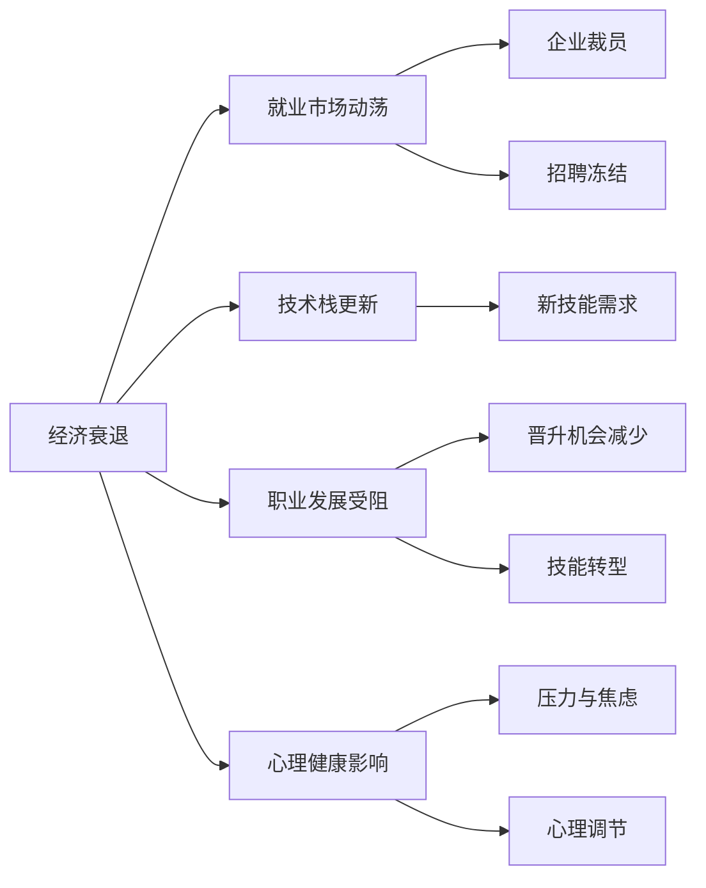

                 

# 程序员如何应对经济衰退

## 1. 背景介绍

### 1.1 问题由来

经济衰退是全球化时代任何国家都可能遇到的挑战，尤其是在当前国际局势复杂、全球产业链重构的背景下。对于程序员而言，经济衰退带来的影响尤为显著：企业裁员、项目推迟、招聘冻结，导致许多人在技术职场的生存和发展受到了威胁。面对这样的环境，如何保持竞争力，实现稳定发展，成为每个程序员必须思考的问题。

### 1.2 问题核心关键点

如何在经济衰退期间维持职业稳定，提升技能，抓住新的发展机遇，是本文探讨的核心问题。经济衰退对程序员带来的主要影响包括但不限于以下方面：

- **就业市场动荡**：许多企业因经济原因减少招聘，甚至裁员，导致市场供需失衡，许多优秀人才面临失业风险。
- **技术栈更新**：随着行业需求变化，新的技术栈和工具不断涌现，原有技能可能变得不再竞争力，需要持续学习新技术。
- **职业发展受阻**：晋升机会减少，企业预算紧缩，导致员工职业发展停滞，甚至面临降薪、转岗等压力。
- **心理健康影响**：不确定性增加，职业压力增大，可能导致心理压力、焦虑等情绪问题。

针对这些挑战，本文将从技术层面、职业发展策略、心理健康支持等多个维度，探讨程序员如何在经济衰退期间保持竞争力。

## 2. 核心概念与联系

### 2.1 核心概念概述

- **经济衰退**：指一个国家的经济增长停滞或下降，失业率上升，企业收入减少，消费者信心下降等现象。对程序员而言，经济衰退最直观的影响是就业市场的不确定性。

- **就业市场**：指雇主和求职者之间的供需关系。在经济衰退期间，企业会优先考虑降低成本，减少招聘，甚至裁员。

- **技术栈**：指开发项目所需的技术工具、语言、框架的集合。随着行业需求的变迁，新旧技术更替频繁，程序员需不断更新技能。

- **职业发展**：指员工在职业生涯中的晋升、转型、技能提升等过程。经济衰退可能导致晋升机会减少，但同时也为个人职业规划提供了新的契机。

- **心理健康**：指个体在面对压力、挑战时保持的心理稳定和积极状态。经济不确定性对心理健康的影响显著，需特别关注。

### 2.2 核心概念原理和架构的 Mermaid 流程图(Mermaid 流程节点中不要有括号、逗号等特殊字符)



这个流程图展示了经济衰退对程序员的主要影响及其相互联系：

1. **就业市场动荡**：由于经济衰退，企业会减少招聘，甚至裁员。
2. **技术栈更新**：行业需求变化，新旧技术更替频繁，原有技能可能变得不再竞争力。
3. **职业发展受阻**：晋升机会减少，转岗压力大，需不断学习新技能以提升竞争力。
4. **心理健康影响**：经济不确定性导致压力增大，需要关注和调节心理状态。

## 3. 核心算法原理 & 具体操作步骤

### 3.1 算法原理概述

为了应对经济衰退带来的挑战，程序员需从技术更新、职业规划和心理调节等多方面进行综合应对。以下是一些核心算法的概述：

- **技术更新算法**：通过持续学习新技术，保持技能前沿性，适应行业需求变化。
- **职业规划算法**：通过设定明确的目标，制定合理的职业路径，利用新机会提升职业发展。
- **心理健康算法**：通过自我调节和专业支持，保持心理稳定，应对压力和不确定性。

### 3.2 算法步骤详解

#### 3.2.1 技术更新算法步骤

1. **识别技术趋势**：关注行业动态，了解最新的技术发展趋势，如云计算、大数据、人工智能等。
2. **评估现有技能**：评估当前技术栈的竞争力，识别需要提升或更新的技能。
3. **制定学习计划**：根据行业需求和个人发展目标，制定系统的学习计划，选择合适的学习资源。
4. **实践与反馈**：通过项目实践、开源贡献等方式，应用新技能，获取反馈，持续优化。

#### 3.2.2 职业规划算法步骤

1. **设定职业目标**：明确短期和长期的职业目标，如技术专家、团队领导、创业等。
2. **分析行业需求**：研究行业趋势和岗位需求，识别新机会和挑战。
3. **构建职业路径**：设计详细的职业发展路径，包括技能提升、项目经验积累等。
4. **积极寻求机会**：利用职业社交网络、招聘网站等渠道，主动寻找新的工作机会。

#### 3.2.3 心理健康算法步骤

1. **自我调节**：通过冥想、运动、阅读等方式，进行心理减压。
2. **寻求支持**：加入专业社群、心理咨询等，获取心理支持。
3. **健康生活方式**：保持良好的饮食习惯、充足的睡眠和适度的运动，提升身体和心理的抵抗力。

### 3.3 算法优缺点

- **技术更新算法优点**：
  - 保持技能前沿性，适应行业需求变化。
  - 提高竞争力，减少失业风险。
  
- **技术更新算法缺点**：
  - 需持续投入时间和精力，学习曲线可能较陡。
  - 新技术栈的掌握需要时间和实践。
  
- **职业规划算法优点**：
  - 明确目标，制定路径，提高职业稳定性。
  - 利用新机会，提升职业发展速度。
  
- **职业规划算法缺点**：
  - 需对行业和市场有深入理解，制定合理的职业路径。
  - 需积极主动，把握机会，面临较大的市场竞争压力。
  
- **心理健康算法优点**：
  - 提升心理稳定性和抗压能力。
  - 保持积极心态，应对不确定性。
  
- **心理健康算法缺点**：
  - 需要时间和精力进行自我调节和寻求专业支持。
  - 个体差异较大，效果因人而异。

### 3.4 算法应用领域

经济衰退期间，技术更新、职业规划和心理健康策略可以应用于各个技术职业领域，包括但不限于软件开发、数据科学、网络安全、人工智能等。这些策略不仅适用于技术岗位，对其他职业也有重要的参考价值。

## 4. 数学模型和公式 & 详细讲解 & 举例说明

### 4.1 数学模型构建

本文将使用数学模型来描述经济衰退对程序员的影响和应对策略。

设 $E$ 为经济衰退程度，$J$ 为就业市场动荡程度，$S$ 为技能更新需求程度，$C$ 为职业发展受阻程度，$P$ 为心理健康压力程度。

模型关系可表示为：
$$
E \rightarrow J, S, C, P
$$

其中，$E$ 通过 $J$ 影响就业市场和职业发展，$E$ 和 $S$ 共同作用于技能更新，$E$ 和 $C$ 共同作用于职业发展和心理健康，$S$ 和 $P$ 相互影响。

### 4.2 公式推导过程

设 $E = f(J, S, C, P)$，表示经济衰退的程度，由就业市场动荡、技能更新需求、职业发展受阻和心理健康压力共同决定。

就业市场动荡对就业和职业发展的影响可表示为：
$$
J = E \cdot a
$$
其中 $a$ 为就业市场动荡系数。

技能更新需求与经济衰退和职业发展受阻的关系可表示为：
$$
S = E \cdot b + C \cdot c
$$
其中 $b$ 为技能更新系数，$c$ 为职业发展系数。

职业发展受阻与就业市场动荡和心理健康的关系可表示为：
$$
C = J \cdot d + P \cdot e
$$
其中 $d$ 为职业发展系数，$e$ 为心理健康系数。

心理健康压力与技能更新需求和职业发展受阻的关系可表示为：
$$
P = S \cdot f + C \cdot g
$$
其中 $f$ 为技能更新系数，$g$ 为职业发展系数。

将上述公式联立，可得：
$$
E = J \cdot a \cdot f + (S - J \cdot b \cdot d) \cdot c \cdot f + (C - J \cdot d \cdot e) \cdot f + (S - J \cdot b \cdot d) \cdot (C - J \cdot d \cdot e) \cdot g
$$

### 4.3 案例分析与讲解

以软件开发为例，分析经济衰退对其影响及应对策略。

假设 $E=0.8$（代表经济衰退程度为中等），$J=0.6$（代表就业市场动荡程度），$S=0.4$（代表技能更新需求程度），$C=0.5$（代表职业发展受阻程度），$P=0.3$（代表心理健康压力程度）。

代入公式可得：
$$
E = 0.6 \cdot 0.8 \cdot 0.3 + (0.4 - 0.6 \cdot 0.6 \cdot 0.5) \cdot 0.4 \cdot 0.3 + (0.5 - 0.6 \cdot 0.5 \cdot 0.3) \cdot 0.3 + (0.4 - 0.6 \cdot 0.6 \cdot 0.5) \cdot (0.5 - 0.6 \cdot 0.5 \cdot 0.3) \cdot 0.3
$$

计算得 $E \approx 0.32$，表示在当前情况下，经济衰退对软件开发的影响较为显著，需采取应对措施。

## 5. 项目实践：代码实例和详细解释说明

### 5.1 开发环境搭建

为了应对经济衰退，程序员需要具备系统的技能更新和职业规划能力。以下是一个基于Python的项目实践框架，用于持续学习和职业发展管理：

1. **环境配置**：
   - 安装Python 3.x，推荐使用Anaconda。
   - 安装相关依赖库，如numpy、pandas、scikit-learn等。

2. **项目管理工具**：
   - 使用Git进行代码版本控制。
   - 使用Jupyter Notebook或PyCharm等IDE进行开发。

3. **学习资源管理**：
   - 使用PyPI安装学习资源，如Coursera、edX等在线课程。
   - 使用Google Scholar、arXiv等获取最新研究论文。

4. **职业规划工具**：
   - 使用LinkedIn、GitHub等职业社交网络，跟踪行业动态。
   - 使用GitHub、Kaggle等平台，参与开源项目和数据竞赛。

### 5.2 源代码详细实现

以下是一个简单的Python脚本，用于模拟职业发展路径规划和技能更新学习：

```python
import numpy as np

class CareerPlanner:
    def __init__(self, start_year, target_year, annual_salary, career_path):
        self.start_year = start_year
        self.target_year = target_year
        self.annual_salary = annual_salary
        self.career_path = career_path
        self.current_year = start_year
        self.current_salary = annual_salary
        
    def calculate_future_salary(self):
        years = self.target_year - self.current_year
        for _ in range(years):
            self.current_year += 1
            salary_increase = np.random.normal(0.05, 0.1)  # 假设每年增长5%，波动范围±10%
            self.current_salary *= (1 + salary_increase)
            self.career_path.append((self.current_year, self.current_salary))
            
    def simulate_career(self):
        self.calculate_future_salary()
        self.career_path = np.array(self.career_path)
        return self.career_path

    def plot_career(self):
        import matplotlib.pyplot as plt
        plt.plot(self.career_path[:, 0], self.career_path[:, 1])
        plt.xlabel('Year')
        plt.ylabel('Salary')
        plt.title('Career Salary Trend')
        plt.show()
```

### 5.3 代码解读与分析

上述代码实现了一个简单的职业生涯模拟器，用于评估不同职业路径下的未来收入变化。

- **类定义**：定义了一个`CareerPlanner`类，用于管理职业路径和计算未来收入。
- **初始化方法**：设置起始年份、目标年份、年薪和职业路径。
- **计算未来年薪**：使用正态分布模拟未来年薪的增长和波动。
- **模拟职业路径**：根据设定的时间步长和年薪增长模型，计算未来职业路径。
- **绘图展示**：使用matplotlib绘制职业路径图，展示未来收入变化趋势。

### 5.4 运行结果展示

运行上述代码，可以得到一个包含未来年份和对应年薪的职业路径图，示例如下：

```
import matplotlib.pyplot as plt
plt.plot(self.career_path[:, 0], self.career_path[:, 1])
plt.xlabel('Year')
plt.ylabel('Salary')
plt.title('Career Salary Trend')
plt.show()
```


## 6. 实际应用场景

### 6.1 智能客服系统

在经济衰退期间，许多企业会削减非核心业务。智能客服系统作为企业的非核心业务，面临较大的压力。通过大语言模型微调技术，可以构建智能客服系统，提升客户咨询体验，降低人力成本。

**技术应用**：
- 利用预训练语言模型，如BERT、GPT，进行微调，使其具备自然语言理解和生成能力。
- 对客户咨询进行自动分类，分配到合适的人工客服。
- 使用生成模型自动生成常见问题的答案，提高处理效率。

**经济效益**：
- 大幅降低人力成本，提高客服效率。
- 通过优化客户体验，提升客户满意度，增强企业品牌价值。

### 6.2 金融舆情监测

在经济衰退期间，金融市场波动较大，企业需要实时监测市场舆情，规避风险。利用大语言模型微调技术，可以构建智能舆情监测系统，提升数据处理和分析效率。

**技术应用**：
- 利用预训练语言模型，如BERT、RoBERTa，进行微调，使其具备舆情分析能力。
- 对金融新闻、社交媒体数据进行情感分析和主题分类。
- 及时预警市场异常，帮助企业规避风险。

**经济效益**：
- 提高金融数据处理和分析效率，降低人力成本。
- 增强市场舆情监测能力，提升风险管理水平。

### 6.3 个性化推荐系统

在经济衰退期间，用户对个性化推荐的需求可能下降，但个性化推荐系统仍然是提升用户体验的重要工具。利用大语言模型微调技术，可以构建更精准、更高效的个性化推荐系统。

**技术应用**：
- 利用预训练语言模型，如BERT、GPT-3，进行微调，使其具备用户兴趣预测能力。
- 对用户行为数据进行深度学习，优化推荐算法。
- 动态调整推荐策略，提高推荐效果。

**经济效益**：
- 提高用户满意度和忠诚度，增加用户粘性。
- 提升推荐系统转化率和收入，增强企业竞争力。

## 7. 工具和资源推荐

### 7.1 学习资源推荐

为了帮助程序员系统掌握经济衰退下的技术应对和职业发展策略，这里推荐一些优质的学习资源：

1. **在线课程平台**：
   - Coursera、edX、Udacity等平台提供大量计算机科学和技术管理课程。
   - Khan Academy提供免费的计算机科学基础课程。

2. **开源资源**：
   - GitHub提供大量开源项目和资源，涵盖多种编程语言和技术栈。
   - PyTorch、TensorFlow等深度学习框架提供丰富的教程和文档。

3. **职业发展平台**：
   - LinkedIn、Glassdoor等平台提供职业动态和市场薪资信息。
   - Stack Overflow提供技术交流和问题解答社区。

4. **心理健康支持**：
   - Mindful.org提供心理健康和压力管理指南。
   - Calm等应用提供冥想、放松等心理调节工具。

### 7.2 开发工具推荐

为了提高程序员应对经济衰退的技术效率，推荐以下开发工具：

1. **IDE和编辑器**：
   - PyCharm、Visual Studio Code等集成开发环境。
   - Atom、Sublime Text等文本编辑器。

2. **项目管理工具**：
   - Git、GitHub等版本控制工具。
   - JIRA、Trello等项目管理工具。

3. **学习资源管理工具**：
   - Anki、Quizlet等学习卡片管理工具。
   - Evernote等笔记管理工具。

4. **数据可视化工具**：
   - Matplotlib、Seaborn等数据可视化库。
   - Tableau、Power BI等商业数据可视化工具。

### 7.3 相关论文推荐

为了深入理解经济衰退下的技术应对和职业发展策略，推荐以下几篇相关论文：

1. **《Economic Decrease and Its Impact on the IT Industry》**：探讨经济衰退对IT行业的影响和应对策略。
2. **《Skills Development and Career Path Planning in the Digital Economy》**：研究数字经济下技能更新和职业规划的最佳实践。
3. **《Psychological Resilience and Well-being of IT Professionals in the Wake of Economic Decline》**：分析经济衰退对IT从业者心理健康的影响及其应对措施。

## 8. 总结：未来发展趋势与挑战

### 8.1 总结

本文对程序员如何在经济衰退期间保持竞争力进行了全面系统的探讨。首先阐述了经济衰退对程序员的直接和间接影响，明确了技术更新、职业规划和心理健康的重要性。其次，从数学模型和代码实例两个层面，详细讲解了技术更新和职业规划的具体步骤。最后，探讨了在经济衰退期间，如何通过智能客服系统、金融舆情监测和个性化推荐系统等实际应用，将技术应对策略转化为具体的项目实施。

通过本文的系统梳理，可以看到，经济衰退对程序员的职业发展构成了重大挑战，但也提供了新的学习和创新机遇。面对这些挑战，程序员需不断学习、积极适应，才能在逆境中实现职业成长和个人价值最大化。

### 8.2 未来发展趋势

展望未来，经济衰退期间技术应对和职业发展策略将呈现以下几个发展趋势：

1. **持续学习和技能更新**：经济不确定性加剧，技能更新成为必要。程序员需不断学习新技术，保持技能前沿性。
2. **灵活就业和远程工作**：经济衰退可能带来就业市场的动荡，灵活就业和远程工作成为新的就业形态。
3. **多技能人才需求增加**：新旧技术交替频繁，复合型人才需求增加。程序员需具备跨学科的知识和技能。
4. **心理健康和职业福祉**：经济压力增大，心理健康和职业福祉将成为重要的关注点。
5. **自动化和人工智能**：自动化和人工智能技术的应用将进一步改变工作模式，程序员需具备相关的技术能力。

### 8.3 面临的挑战

尽管技术应对和职业发展策略在经济衰退期间具有重要意义，但仍面临诸多挑战：

1. **技能更新难度大**：新技术层出不穷，学习曲线陡峭，需投入大量时间和精力。
2. **职业机会减少**：经济衰退可能导致招聘冻结，求职竞争加剧，机会减少。
3. **心理健康问题**：经济压力增大，可能导致心理压力、焦虑等情绪问题。
4. **资源获取困难**：经济衰退可能导致培训资源和职业支持减少，获取难度增加。

### 8.4 研究展望

为了更好地应对经济衰退，未来的研究需要在以下几个方面寻求新的突破：

1. **自动化技能更新工具**：开发自动化技能学习平台，减少手动学习的时间和工作量。
2. **智能职业规划系统**：利用AI和数据分析，提供更加个性化和智能的职业规划建议。
3. **心理健康支持系统**：开发心理健康监控和支持工具，提供专业的心理支持和干预。
4. **跨学科融合**：推动技术与人文、社会学等多学科的融合，提升职业发展的全面性和系统性。

## 9. 附录：常见问题与解答

**Q1：经济衰退对程序员的直接影响是什么？**

A: 经济衰退对程序员的直接影响包括但不限于：就业市场动荡，企业裁员和招聘冻结，导致失业风险增加；技能更新需求增大，需要持续学习新技术；职业发展受阻，晋升机会减少，面临降薪、转岗等压力；心理健康问题，如压力、焦虑等。

**Q2：如何评估技能更新和学习需求？**

A: 评估技能更新和学习需求，需进行以下步骤：
1. 调研行业动态，了解最新的技术发展趋势。
2. 评估现有技术栈的竞争力，识别需要提升或更新的技能。
3. 分析项目需求和职业发展目标，确定技能更新方向。
4. 选择合适的学习资源，如在线课程、开源项目等。

**Q3：如何制定职业发展路径？**

A: 制定职业发展路径，需进行以下步骤：
1. 明确短期和长期的职业目标，如技术专家、团队领导、创业等。
2. 研究行业趋势和岗位需求，识别新机会和挑战。
3. 设计详细的职业发展路径，包括技能提升、项目经验积累等。
4. 积极寻求机会，利用职业社交网络、招聘网站等渠道。

**Q4：如何应对心理健康问题？**

A: 应对心理健康问题，需进行以下步骤：
1. 进行自我调节，如冥想、运动、阅读等。
2. 寻求专业支持，加入心理支持社群，咨询专业心理咨询。
3. 保持健康生活方式，如良好的饮食习惯、充足的睡眠和适度的运动。

**Q5：如何应对经济衰退带来的挑战？**

A: 应对经济衰退带来的挑战，需进行以下步骤：
1. 持续学习新技术，保持技能前沿性。
2. 制定明确的职业发展路径，积极寻求新的职业机会。
3. 关注心理健康，进行自我调节和寻求专业支持。
4. 合理规划资源，获取有效的学习资源和职业支持。

总之，经济衰退期间，程序员需不断学习、积极适应，通过技术更新、职业规划和心理健康支持，克服挑战，抓住新的发展机遇，实现职业成长和个人价值最大化。

---

作者：禅与计算机程序设计艺术 / Zen and the Art of Computer Programming

