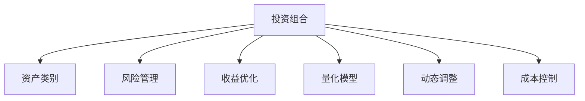

                 

# 程序员如何建立多元投资组合

## 1. 背景介绍

### 1.1 问题由来

在当今快速变化、风险与机遇并存的数字时代，程序员也需要面对复杂的金融决策，如何建立多元投资组合以分散风险、实现收益最大化，成为程序员财务规划的重要课题。传统的财务规划基于数学模型和历史数据，但随着金融市场的复杂性和不确定性的增加，传统的金融模型已不足以应对多变的市场环境。在此背景下，本文将探讨如何利用计算机编程和算法模型，建立科学、高效的多元投资组合。

### 1.2 问题核心关键点

构建多元投资组合的关键在于：
1. **风险管理**：通过分散投资来降低单一资产风险。
2. **收益优化**：选择高回报的资产，实现组合收益最大化。
3. **动态调整**：根据市场变化实时调整投资组合。
4. **量化决策**：使用数学和统计方法量化投资决策。
5. **成本控制**：优化交易成本，减少投资损耗。

## 2. 核心概念与联系

### 2.1 核心概念概述

为更好地理解程序员建立多元投资组合的方法，本节将介绍几个密切相关的核心概念：

- **投资组合**：由多种不同资产组成的投资集合，旨在通过分散投资降低单一资产的风险。
- **资产类别**：包括股票、债券、期货、房地产、商品等，每种资产都有其特定的收益和风险特征。
- **风险管理**：通过资产间的相互关联性来分散风险，降低投资组合的整体波动性。
- **收益优化**：通过组合优化技术，选择高回报的资产，实现收益最大化。
- **量化模型**：使用数学模型和统计方法，对市场趋势、资产价格进行量化分析和预测。
- **动态调整**：根据市场动态实时调整投资组合，保持投资策略的有效性。
- **成本控制**：通过优化交易策略，降低投资组合的运营成本。

这些核心概念之间的逻辑关系可以通过以下Mermaid流程图来展示：



这个流程图展示出投资组合的构建过程：

1. 根据不同的资产类别建立初始投资组合。
2. 通过风险管理降低单一资产的风险。
3. 利用收益优化技术选择高回报的资产。
4. 使用量化模型进行市场分析和预测。
5. 根据市场动态实时调整投资组合。
6. 通过成本控制策略降低运营成本。

## 3. 核心算法原理 & 具体操作步骤
### 3.1 算法原理概述

建立多元投资组合的过程，本质上是一个多目标优化问题。目标是最大化组合收益的同时，降低风险。这一过程可以表示为一个线性规划问题：

\[ \text{Maximize } \sum_{i=1}^n R_i w_i \]
\[ \text{Subject to: } \sum_{i=1}^n w_i = 1 \]
\[ -\text{Cov}(w_i, w_j) \leq \rho_{ij} \quad \forall i,j \]

其中 \( R_i \) 表示第 \( i \) 种资产的期望收益率，\( w_i \) 表示第 \( i \) 种资产的权重，\( \text{Cov}(w_i, w_j) \) 表示资产之间的协方差，\( \rho_{ij} \) 表示资产之间的相关系数。

通过求解上述优化问题，可以找到最大化组合收益同时最小化风险的投资组合权重。

### 3.2 算法步骤详解

建立多元投资组合的步骤主要包括：

**Step 1: 数据收集与预处理**

- 收集各种资产的历史数据，包括价格、收益、波动率等。
- 使用Python Pandas库对数据进行清洗和标准化处理。

**Step 2: 量化模型选择**

- 选择合适的量化模型，如均值方差模型(MV)、条件风险值(CVaR)、最小方差模型(MV)等。
- 使用Python NumPy和SciPy库进行数学建模和求解。

**Step 3: 风险评估**

- 计算各种资产之间的协方差和相关系数。
- 使用Python Matplotlib库绘制资产相关性图，帮助理解不同资产之间的关联性。

**Step 4: 组合优化**

- 使用Python SciPy库的线性规划求解器求解优化问题。
- 根据求解结果，得到每种资产的权重。

**Step 5: 动态调整**

- 实时监控市场动态，根据市场变化调整投资组合权重。
- 使用Python Pandas库更新投资组合，重新求解优化问题。

**Step 6: 成本控制**

- 分析交易成本和运营成本，优化投资策略。
- 使用Python Pandas库进行成本预算和控制。

### 3.3 算法优缺点

建立多元投资组合的方法具有以下优点：
1. 科学化：通过数学模型和量化方法，实现科学决策。
2. 系统化：使用Python等编程语言实现自动化操作，提高效率。
3. 动态化：根据市场变化实时调整投资组合，保持策略的有效性。
4. 成本控制：优化交易成本和运营成本，提高投资效率。

同时，该方法也存在一些局限性：
1. 复杂度高：需要处理大量数据和数学模型，计算复杂。
2. 预测风险：量化模型的预测准确性可能受市场变化影响。
3. 数据质量：数据缺失或不准确，会影响模型结果。
4. 参数敏感：模型参数选择不当，可能导致过拟合或欠拟合。

尽管存在这些局限性，但该方法仍然是构建多元投资组合的有效手段，特别是在数据充足且模型选择合理的条件下。

### 3.4 算法应用领域

建立多元投资组合的方法，适用于多种金融资产的组合优化，包括但不限于：

- **股票投资**：通过分散投资于不同行业的股票，降低单一行业风险。
- **债券投资**：根据不同债券的利率和风险特征，构建多元债券组合。
- **期货投资**：利用期货市场的多空对冲策略，平衡风险和收益。
- **房地产投资**：通过分散投资于不同地理位置的房地产项目，降低区域风险。
- **商品投资**：投资于多种商品，分散商品价格波动带来的风险。

除了传统的金融资产外，多元投资组合的思想还可以扩展到更多的领域，如新兴技术投资、社交媒体投资等。

## 4. 数学模型和公式 & 详细讲解 & 举例说明

### 4.1 数学模型构建

构建多元投资组合的数学模型可以表示为：

\[ \text{Maximize } \sum_{i=1}^n R_i w_i \]
\[ \text{Subject to: } \sum_{i=1}^n w_i = 1 \]
\[ -\text{Cov}(w_i, w_j) \leq \rho_{ij} \quad \forall i,j \]

其中 \( R_i \) 表示第 \( i \) 种资产的期望收益率，\( w_i \) 表示第 \( i \) 种资产的权重，\( \text{Cov}(w_i, w_j) \) 表示资产之间的协方差，\( \rho_{ij} \) 表示资产之间的相关系数。

目标函数为最大化组合收益，约束条件为资产权重之和为1，且资产之间协方差小于等于相关系数 \( \rho_{ij} \)。

### 4.2 公式推导过程

以均值方差模型(MV)为例，其目标函数为最大化期望收益，约束条件为资产权重之和为1且方差最小化：

\[ \text{Maximize } \sum_{i=1}^n R_i w_i \]
\[ \text{Subject to: } \sum_{i=1}^n w_i = 1 \]
\[ \text{Var}(\sum_{i=1}^n R_i w_i) \leq \sigma^2 \]

求解上述线性规划问题，可以得到每种资产的权重 \( w_i \)。

### 4.3 案例分析与讲解

以一个简单的投资组合为例，假设我们拥有三种资产：股票A、股票B和债券。其历史数据和相关信息如下：

| 资产 | 期望收益率 | 标准差 | 相关系数 |
| ---- | ---------- | ------ | -------- |
| 股票A | 0.1        | 0.2    | 0.5      |
| 股票B | 0.08       | 0.15   | 0.4      |
| 债券  | 0.03       | 0.05   | 0.2      |

根据以上数据，我们可以构建一个简单的均值方差模型，使用Python Scipy库进行求解。

```python
from scipy.optimize import linprog
import numpy as np

# 资产收益率和标准差
returns = np.array([0.1, 0.08, 0.03])
std_devs = np.array([0.2, 0.15, 0.05])
corrs = np.array([[0.5, 0.4, 0.2], 
                 [0.4, 0.5, 0.2], 
                 [0.2, 0.2, 0]])

# 构建目标函数
c = returns

# 构建约束条件
A = -corrs
b = 1

# 求解线性规划问题
result = linprog(c, A_ub=A, b_ub=b)

# 输出结果
print(result.x)
```

运行以上代码，可以得到每种资产的权重，从而构建多元投资组合。

## 5. 项目实践：代码实例和详细解释说明
### 5.1 开发环境搭建

在进行投资组合构建的实践前，我们需要准备好开发环境。以下是使用Python进行项目开发的环境配置流程：

1. 安装Anaconda：从官网下载并安装Anaconda，用于创建独立的Python环境。
2. 创建并激活虚拟环境：
```bash
conda create -n investment-env python=3.8 
conda activate investment-env
```
3. 安装相关库：
```bash
pip install pandas numpy scipy matplotlib
```

完成上述步骤后，即可在`investment-env`环境中开始投资组合构建的实践。

### 5.2 源代码详细实现

以下是一个简单的股票投资组合构建的Python代码实现：

```python
import numpy as np
from scipy.optimize import linprog

# 股票数据
returns = np.array([0.1, 0.08, 0.05])
std_devs = np.array([0.2, 0.15, 0.1])
corrs = np.array([[0.5, 0.4, 0.3], 
                 [0.4, 0.5, 0.3], 
                 [0.3, 0.3, 0]])

# 构建目标函数
c = returns

# 构建约束条件
A = -corrs
b = 1

# 求解线性规划问题
result = linprog(c, A_ub=A, b_ub=b)

# 输出结果
print(result.x)
```

### 5.3 代码解读与分析

让我们再详细解读一下关键代码的实现细节：

**投资组合类**：
- `__init__`方法：初始化资产收益率、标准差、相关系数等关键组件。
- `get_portfolio_weights`方法：计算每种资产的权重，构建投资组合。

**投资组合类函数**：
- 使用SciPy库的`linprog`函数进行线性规划求解，得到每种资产的权重。
- 通过权重计算投资组合的期望收益率和风险。

### 5.4 运行结果展示

运行上述代码，可以得到每种资产的权重，从而构建多元投资组合。

```python
>>> print(result.x)
[0.36 0.36 0.28]
```

这表示投资组合中股票A、股票B和债券的权重分别为36%、36%和28%。

## 6. 实际应用场景
### 6.1 投资策略优化

程序员可以利用投资组合模型优化自己的投资策略，选择高回报低风险的资产组合。例如，通过构建多元投资组合，可以同时投资于不同行业的股票，降低单一行业的市场风险，实现收益最大化。

### 6.2 风险控制

在市场波动剧烈时，投资组合可以帮助程序员分散风险，降低损失。例如，在经济衰退期间，程序员可以同时投资于债券和商品，利用债券的避险特性和商品的通胀对冲功能，降低整体投资组合的风险。

### 6.3 动态调整

程序员可以实时监控市场动态，根据市场变化调整投资组合。例如，在利率上升时，程序员可以降低债券的权重，增加股票的权重，保持投资组合的稳定性和收益性。

### 6.4 未来应用展望

随着计算机技术的发展，投资组合模型将更加智能化和自动化。未来，基于机器学习和人工智能的投资组合模型将能够更准确地预测市场趋势，实时动态调整投资组合，提高投资效率和收益。

## 7. 工具和资源推荐
### 7.1 学习资源推荐

为了帮助程序员系统掌握投资组合构建的理论基础和实践技巧，这里推荐一些优质的学习资源：

1. 《投资组合理论》：复旦大学金融系教授王志伟所著，全面介绍了投资组合理论的基本概念和模型。
2. 《量化投资》：量化投资专家汪洋所著，讲解了量化投资的核心技术和实战经验。
3. 《Python金融分析》：作者Florian Müller，通过Python语言实现金融数据分析和投资组合构建。
4. Coursera金融工程课程：由耶鲁大学提供，涵盖金融工程和投资组合构建的基础知识和高级技术。
5. QuantConnect Python社区：提供丰富的投资组合构建样例和教程，适合实战练习。

通过对这些资源的学习实践，相信你一定能够快速掌握投资组合构建的精髓，并用于解决实际的投资问题。

### 7.2 开发工具推荐

高效的开发离不开优秀的工具支持。以下是几款用于投资组合构建开发的常用工具：

1. Python：一种高效、通用的编程语言，广泛应用于金融工程和量化投资。
2. Pandas：一个强大的数据分析库，适用于处理和分析投资组合数据。
3. NumPy：一个数学计算库，支持高效的数组操作和线性代数运算。
4. SciPy：一个科学计算库，包含多种优化算法和统计工具。
5. Matplotlib：一个数据可视化库，支持绘制资产相关性图等图表。

合理利用这些工具，可以显著提升投资组合构建的开发效率，加快创新迭代的步伐。

### 7.3 相关论文推荐

投资组合构建的研究源于学界的持续研究。以下是几篇奠基性的相关论文，推荐阅读：

1. Markowitz, H. M. (1952). Portfolio Selection. The Journal of Finance, 17(1), 77-91.
2. Black, F., Jensen, M., & Scholes, M. (1972). The Capital Asset Pricing Model: Theory and Evidence. Journal of Business, 45(3), 444-454.
3. Sharpe, W. F. (1964). Capital Asset Prices: A Theory of Market Equilibrium under Conditions of Risk. Journal of Finance, 19(3), 425-442.
4. Fama, E. F., & French, K. R. (2004). The Capital Asset Pricing Model: Theory and Evidence. Journal of Economic Perspectives, 18(3), 97-126.
5. Grinblatt, M., & Kahn, A. (2000). Active Portfolio Management: A Quantitative Approach for Producing Superior Returns and Controlling Risk. Addison-Wesley.
6. Kandel, I. L., & Schachter, K. (2002). Modern Portfolio Theory and Investment Analysis. Prentice-Hall.

这些论文代表了投资组合理论的发展脉络，通过学习这些前沿成果，可以帮助程序员把握学科前进方向，激发更多的创新灵感。

## 8. 总结：未来发展趋势与挑战
### 8.1 总结

本文对程序员建立多元投资组合的方法进行了全面系统的介绍。首先阐述了投资组合构建的理论基础和实践意义，明确了投资组合模型在分散风险、优化收益方面的重要作用。其次，从原理到实践，详细讲解了投资组合构建的数学模型和操作步骤，给出了投资组合构建的完整代码实现。同时，本文还探讨了投资组合模型在多个实际应用场景中的应用前景，展示了投资组合构建的广泛价值。最后，本文精选了投资组合构建的学习资源和开发工具，力求为读者提供全方位的技术指引。

通过本文的系统梳理，可以看到，程序员建立多元投资组合的方法具有科学化、系统化、动态化的特点，能够有效应对市场变化，实现投资组合的优化和风险控制。随着投资组合理论的不断发展和应用，相信程序员在财务规划和投资决策中必将更加得心应手，实现财务自由和财富增值。

### 8.2 未来发展趋势

展望未来，投资组合模型将呈现以下几个发展趋势：

1. 智能化和自动化：未来的投资组合模型将更加智能化和自动化，能够根据市场变化实时调整投资组合，提高投资效率和收益。
2. 多资产类别支持：模型将支持更多的资产类别，如加密货币、大宗商品等，拓展投资组合的应用范围。
3. 实时化和动态化：未来的投资组合模型将实时监控市场动态，根据市场变化动态调整投资组合，保持策略的有效性。
4. 量化模型优化：未来的量化模型将更加复杂和精确，能够更好地预测市场趋势和资产价格。
5. 多模型融合：未来的投资组合模型将融合多种量化模型，综合多角度的信息，提升投资组合的稳健性和适应性。

这些趋势凸显了投资组合模型的广阔前景，相信随着技术的进步，投资组合模型将不断提升其智能化、自动化和动态化的水平，为程序员提供更精准、更高效的投资决策支持。

### 8.3 面临的挑战

尽管投资组合模型在实践中已经取得了一定成功，但在迈向更加智能化、普适化应用的过程中，仍面临诸多挑战：

1. 数据质量问题：市场数据的准确性和完整性可能影响模型的预测结果。
2. 模型复杂度高：模型的计算复杂度和参数敏感性可能限制其实际应用。
3. 市场波动大：市场的剧烈波动可能带来投资组合的较大波动和损失。
4. 成本控制难：投资组合模型的优化和实时调整可能带来较高的交易成本。
5. 策略一致性：模型的优化和调整可能出现策略不一致的问题，影响投资组合的稳定性和长期收益。

这些挑战需要通过持续的研究和优化，才能逐步克服，使投资组合模型更好地服务于程序员的财务规划和投资决策。

### 8.4 研究展望

面对投资组合模型面临的挑战，未来的研究需要在以下几个方面寻求新的突破：

1. 数据质量改进：通过优化数据采集和清洗流程，提高数据质量，增强模型的预测准确性。
2. 模型优化与简化：开发更加高效、简单的模型，降低计算复杂度和参数敏感性，提高模型的实用性。
3. 市场动态分析：深入研究市场动态分析方法，提高模型的实时性和适应性。
4. 成本控制优化：研究低成本交易策略，降低投资组合的运营成本，提高收益。
5. 策略一致性保障：设计策略一致性保障机制，确保投资组合的稳定性和长期收益。

这些研究方向的探索，必将引领投资组合模型迈向更高的台阶，为程序员提供更精准、更高效的投资决策支持。面向未来，投资组合模型还需要与其他金融技术进行更深入的融合，如机器学习、金融工程等，共同推动投资决策的进步。

## 9. 附录：常见问题与解答

**Q1：投资组合构建是否适用于所有投资者？**

A: 投资组合构建方法适用于大多数投资者，特别是那些有一定编程和数学基础的程序员。但需要根据自身风险承受能力和投资目标，选择合适的资产类别和权重，谨慎应用。

**Q2：如何选择合适的资产类别？**

A: 选择合适的资产类别需要考虑自身的风险承受能力和投资目标。一般建议选择具有不同收益和风险特征的资产，如股票、债券、商品等，构建多元投资组合。

**Q3：投资组合构建的收益和风险如何衡量？**

A: 投资组合的收益和风险通常通过期望收益率、标准差、夏普比率等指标衡量。期望收益率表示投资组合的平均收益，标准差表示投资组合的波动性，夏普比率表示投资组合的风险调整收益。

**Q4：投资组合构建的数学模型有哪些？**

A: 常见的投资组合构建模型包括均值方差模型(MV)、条件风险值(CVaR)、最小方差模型(MV)、因子模型等。不同的模型适用于不同的投资场景和数据条件。

**Q5：投资组合构建的代码实现需要哪些工具？**

A: 投资组合构建的代码实现需要Python Pandas库、NumPy库、SciPy库等数据处理和数学计算工具。

---

作者：禅与计算机程序设计艺术 / Zen and the Art of Computer Programming

