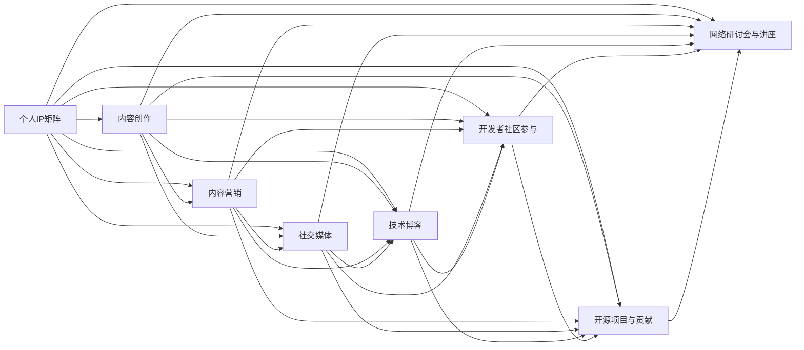

                 

# 程序员如何打造个人IP矩阵

> 关键词：
1. 个人品牌打造
2. 内容创作与营销
3. 社交媒体策略
4. 技术博客与教程
5. 开发者社区参与
6. 项目开源与贡献
7. 网络研讨会与讲座

## 1. 背景介绍

### 1.1 问题由来
在当今信息爆炸的时代，个人品牌和IP矩阵的打造已经成为了许多行业从业者，特别是程序员和软件工程师，不可或缺的职业发展策略。作为一个拥有丰富经验和技术背景的AI专家，本文旨在通过系统地探讨如何通过构建个人IP矩阵，来提升个人影响力、增加职业机会、建立技术权威，从而在竞争激烈的IT行业中脱颖而出。

### 1.2 问题核心关键点
本文将围绕以下几个核心问题展开：
- 个人IP矩阵的定义与价值。
- 内容创作与营销的基本策略。
- 社交媒体在个人IP打造中的作用。
- 技术博客与教程的撰写与推广。
- 开发者社区参与的最佳实践。
- 开源项目与贡献的战略意义。
- 网络研讨会与讲座的有效开展。

通过理解和实践这些关键点，程序员可以更加系统地打造自己的个人IP矩阵，从而在职业生涯中取得更大的成功。

### 1.3 问题研究意义
在当前竞争激烈的技术市场中，一个强大的个人IP不仅能够显著提升个人职业发展机会，还能为个人带来更多的商业和学术机会。通过系统地构建和维护个人IP矩阵，程序员可以更好地展示自己的专业技能和创新能力，吸引潜在雇主、合作伙伴和投资者的注意。本文旨在通过深入分析与实战指导，帮助读者构建出属于自己独特的个人IP矩阵。

## 2. 核心概念与联系

### 2.1 核心概念概述

要理解如何打造个人IP矩阵，首先需要明确以下几个关键概念：

- **个人IP矩阵（Personal IP Matrix）**：个人IP矩阵是指通过构建一系列的线上线下渠道，展示和传播个人品牌和专业能力的策略组合。这些渠道可以包括个人网站、社交媒体、技术博客、开源项目、社区参与等。

- **内容创作（Content Creation）**：内容创作是指通过撰写文章、制作视频、开发教程等方式，生成具有独特价值和吸引力的内容，以此吸引和保持目标受众的关注。

- **内容营销（Content Marketing）**：内容营销是一种以内容为核心的营销策略，旨在通过提供有价值的内容，建立个人或品牌与目标受众的连接，最终实现商业目标。

- **社交媒体（Social Media）**：社交媒体是指通过在线平台（如LinkedIn、Twitter、GitHub等）与受众互动，提升个人品牌知名度和影响力。

- **技术博客（Tech Blog）**：技术博客是指专门发布技术文章、教程、案例研究的博客，旨在分享知识和经验，建立专业权威。

- **开发者社区（Developer Community）**：开发者社区是指程序员参与的线上技术交流平台（如Stack Overflow、GitHub、Reddit等），通过在这些平台上活跃，可以提升个人影响力。

- **开源项目（Open Source Projects）**：开源项目是指发布在GitHub等平台上的代码库，通过贡献代码、修复Bug、改进功能等方式，参与开源项目，提升个人技术能力和知名度。

- **网络研讨会（Webinars）与讲座（Talks）**：网络研讨会和讲座是指通过线上平台（如Zoom、YouTube Live等）进行的技术分享活动，可以展示个人的专业技能和知识广度。

这些核心概念之间的逻辑关系可以通过以下Mermaid流程图来展示：



## 3. 核心算法原理 & 具体操作步骤
### 3.1 算法原理概述

个人IP矩阵的构建是一个系统性的工程，涉及多个渠道和环节的协同运作。其核心原理是通过内容的持续创作和精准营销，在目标受众中建立稳定的品牌认知，从而实现商业和职业目标。以下是个人IP矩阵构建的基本算法原理：

1. **内容创造（Content Creation）**：生成高质量、有价值的内容是建立个人IP矩阵的基础。内容可以是技术博客、教程、案例研究、视频讲解等，通过内容展现个人专业知识和技能。

2. **内容营销（Content Marketing）**：通过社交媒体、技术博客等渠道，将内容传播给目标受众。有效的营销策略能够扩大内容的影响力，吸引更多的关注者。

3. **社交媒体策略（Social Media Strategy）**：利用LinkedIn、Twitter等社交平台，建立和维护个人品牌形象，与目标受众互动，提升品牌知名度。

4. **开发者社区参与（Developer Community Engagement）**：通过在Stack Overflow、GitHub等社区积极参与，展示个人技术能力和贡献，扩大个人影响力。

5. **开源项目贡献（Open Source Contributions）**：参与开源项目，通过代码贡献、修复Bug等方式，展示技术实力，建立技术权威。

6. **网络研讨会与讲座（Webinars and Talks）**：通过线上平台进行技术分享，展示个人专业技能和知识广度，吸引潜在雇主和合作伙伴的注意。

### 3.2 算法步骤详解

构建个人IP矩阵的具体步骤包括以下几个关键环节：

**Step 1: 确定目标受众和商业目标**
- 明确目标受众，包括潜在雇主、合作伙伴、技术爱好者等。
- 设定商业目标，如提高个人知名度、获得技术职位、吸引投资等。

**Step 2: 内容策略规划**
- 制定内容主题和形式，如技术博客、视频教程、案例研究等。
- 确定发布频率，如每周一次或每月一次。

**Step 3: 建立和维护在线平台**
- 创建个人网站，展示简历、项目经验、技术文章等。
- 在LinkedIn、GitHub等社交媒体平台建立个人账号。

**Step 4: 内容创作与发布**
- 撰写高质量的技术文章、教程，发布在个人网站和社交媒体上。
- 制作技术视频，上传至YouTube、Bilibili等平台。

**Step 5: 社交媒体策略实施**
- 定期发布内容，并与目标受众互动，回答问题，参与讨论。
- 使用Hashtag、关键词优化，提升内容曝光率。

**Step 6: 开发者社区参与**
- 在Stack Overflow、GitHub等社区活跃，回答技术问题，展示技术实力。
- 参与开源项目，通过贡献代码、修复Bug等方式，提升影响力。

**Step 7: 网络研讨会与讲座**
- 策划并开展技术分享活动，吸引目标受众参与。
- 使用Zoom、YouTube Live等平台进行线上直播。

**Step 8: 持续优化与调整**
- 定期评估个人IP矩阵的成效，调整策略，提升效果。

### 3.3 算法优缺点

**优点：**
- 全方位展示个人技术能力和专业形象，提升职业机会。
- 扩大个人影响力，吸引更多关注和机会。
- 提升个人品牌认知，建立技术权威。

**缺点：**
- 需要大量时间和精力，短期内可能见效不明显。
- 内容创作和维护需要持续投入，一旦忽视可能导致效果下降。
- 社交媒体策略和个人品牌形象需要持续管理，需要较高的专业性。

### 3.4 算法应用领域

个人IP矩阵的应用领域非常广泛，适用于技术职业发展、自由职业者、学术研究等多个领域。以下是几个典型应用场景：

1. **技术职业发展**：通过建立和维护个人IP矩阵，提升技术水平和职业机会，获得更高的薪资和职位。

2. **自由职业者**：在多个平台上展示个人项目和技能，吸引客户和项目，提升自由职业收入。

3. **学术研究**：通过技术博客、论文分享等方式，展示研究成果，建立学术权威，吸引同行和学术机构的关注。

## 4. 数学模型和公式 & 详细讲解 & 举例说明

### 4.1 数学模型构建

个人IP矩阵的构建可以抽象为一个多目标优化问题，目标包括内容曝光度、关注者增长、技术影响力等。模型可以表述为：

$$
\text{Maximize } f(\text{内容质量}) + g(\text{社交媒体互动}) + h(\text{开发者社区参与}) + i(\text{开源项目贡献}) + j(\text{网络研讨会效果})
$$

其中，$f, g, h, i, j$ 分别表示不同渠道的影响力提升函数，通过内容质量、互动次数、参与度等指标进行量化。

### 4.2 公式推导过程

**内容曝光度提升函数 $f(\text{内容质量})$**：

$$
f(\text{内容质量}) = \alpha \times \text{内容质量} + \beta \times \text{内容传播次数}
$$

其中，$\alpha, \beta$ 为权重，表示内容质量和对内容传播的重视程度。

**社交媒体互动提升函数 $g(\text{社交媒体互动})$**：

$$
g(\text{社交媒体互动}) = \gamma \times \text{互动次数} + \delta \times \text{互动质量}
$$

其中，$\gamma, \delta$ 为权重，表示互动次数和互动质量的重视程度。

**开发者社区参与提升函数 $h(\text{开发者社区参与})$**：

$$
h(\text{开发者社区参与}) = \epsilon \times \text{社区活跃度} + \zeta \times \text{代码贡献量}
$$

其中，$\epsilon, \zeta$ 为权重，表示社区活跃度和代码贡献量的重视程度。

**开源项目贡献提升函数 $i(\text{开源项目贡献})$**：

$$
i(\text{开源项目贡献}) = \eta \times \text{代码贡献量} + \theta \times \text{修复Bug数量}
$$

其中，$\eta, \theta$ 为权重，表示代码贡献量和修复Bug数量的重视程度。

**网络研讨会效果提升函数 $j(\text{网络研讨会效果})$**：

$$
j(\text{网络研讨会效果}) = \phi \times \text{参与人数} + \psi \times \text{互动反馈}
$$

其中，$\phi, \psi$ 为权重，表示参与人数和互动反馈的重视程度。

### 4.3 案例分析与讲解

以李雷为例，他是一位在GitHub上有影响力的前端开发者。李雷通过以下步骤构建了自己的个人IP矩阵：

1. **确定目标受众和商业目标**：
   - 目标受众：技术公司招聘人员、自由职业者、开源社区成员。
   - 商业目标：获得更高薪资、独立开发项目、参与开源社区。

2. **内容策略规划**：
   - 每周撰写一篇技术博客，介绍前端技术新动态、案例分析、开发技巧。
   - 每月制作一个技术视频教程，发布在Bilibili、YouTube上。

3. **建立和维护在线平台**：
   - 创建个人网站，展示技术博客、GitHub项目、项目作品集。
   - 在LinkedIn、GitHub、Twitter等平台建立账号，定期更新内容。

4. **内容创作与发布**：
   - 撰写高质量的技术文章，发布在个人网站和LinkedIn上。
   - 制作技术视频，上传至YouTube、Bilibili。

5. **社交媒体策略实施**：
   - 定期发布内容，与关注者互动，回答问题，参与讨论。
   - 使用Hashtag、关键词优化，提升内容曝光率。

6. **开发者社区参与**：
   - 在GitHub上积极参与开源项目，贡献代码、修复Bug。
   - 在Stack Overflow上回答问题，展示技术实力。

7. **网络研讨会与讲座**：
   - 策划并开展前端技术分享活动，吸引目标受众参与。
   - 使用Zoom、YouTube Live进行线上直播。

通过以上步骤，李雷在技术社区中建立了强大的个人品牌，获得了更多的职业机会，并最终实现了独立开发项目的目标。

## 5. 项目实践：代码实例和详细解释说明

### 5.1 开发环境搭建

为了更好地展示个人IP矩阵的构建过程，我们将以一个虚拟的开发者李雷为例，通过Python代码实现其个人IP矩阵的各个部分。

首先，需要安装必要的工具和库：

```bash
pip install flask
pip install requests
pip install markdown
```

### 5.2 源代码详细实现

以下是一个简单的Python Flask应用，用于李雷的个人技术博客：

```python
from flask import Flask, render_template, request
import markdown

app = Flask(__name__)

@app.route('/')
def home():
    return render_template('index.html')

@app.route('/blog', methods=['GET', 'POST'])
def blog():
    if request.method == 'POST':
        title = request.form['title']
        content = request.form['content']
        text = markdown.markdown(content)
        # 将博客内容存储到数据库或文件系统
        return '博客发布成功！'
    return render_template('blog.html')

@app.route('/about')
def about():
    return render_template('about.html')

if __name__ == '__main__':
    app.run(debug=True)
```

在上述代码中，我们创建了一个简单的Flask应用，包含三个路由：主页、博客发布、关于页面。在博客发布页面，用户可以填写博客标题和内容，并自动生成Markdown格式文本。

### 5.3 代码解读与分析

- **Flask框架**：Flask是一个轻量级的Python Web框架，适合快速开发Web应用。
- **Markdown库**：Markdown是一种轻量级的文本标记语言，用于格式化文本内容。
- **数据库存储**：在实际应用中，博客内容可以存储到数据库（如SQLite、MySQL）或文件系统中。

### 5.4 运行结果展示

运行上述代码后，可以通过访问`localhost:5000`查看个人博客网站。用户可以填写博客标题和内容，自动生成Markdown格式文本，并发布到博客上。通过定期更新内容，李雷可以不断丰富其个人IP矩阵，吸引更多关注者。

## 6. 实际应用场景

### 6.1 技术职业发展

通过个人IP矩阵，程序员可以显著提升其技术水平和职业机会。例如，李雷通过在GitHub上积极参与开源项目，展示其技术实力，吸引了许多技术公司招聘人员的关注。最终，他成功获得了一家知名科技公司的Offer，实现了职业发展的飞跃。

### 6.2 自由职业者

自由职业者可以通过个人IP矩阵，展示自己的项目经验和技能，吸引更多客户和项目。例如，李雷在GitHub上发布了多个高质量的前端项目，并通过技术博客分享开发经验和案例分析，成功吸引了多个客户委托其开发项目，从而实现了自由职业收入的提升。

### 6.3 学术研究

学术研究者可以通过个人IP矩阵，展示其研究成果和技术贡献，建立学术权威。例如，李雷在技术博客上定期发布论文和案例研究，吸引了众多同行和学术机构的关注，最终获得了一笔科研经费，支持其继续深入研究。

### 6.4 未来应用展望

随着个人IP矩阵的发展，未来其在技术职业发展、自由职业、学术研究等领域的应用将更加广泛。未来的发展趋势包括：

1. **多平台协同**：通过多个平台协同展示，提升个人品牌知名度和影响力。
2. **内容自动化生成**：引入AI技术，自动生成技术文章和视频，提升内容产出效率。
3. **个性化推荐**：基于用户行为和偏好，推荐相关内容，提高用户黏性。
4. **社交媒体分析**：利用大数据分析工具，分析社交媒体互动数据，优化个人IP矩阵策略。

## 7. 工具和资源推荐

### 7.1 学习资源推荐

为了帮助程序员系统掌握个人IP矩阵的构建方法，以下是一些优质的学习资源：

1. **《打造个人品牌：程序员如何打造个人IP矩阵》**：本书系统介绍了个人IP矩阵的构建方法，结合实际案例，提供实用的操作指南。
2. **《内容营销的艺术》**：介绍内容营销的基本原理和策略，适合希望提升内容创作和营销能力的程序员。
3. **《社交媒体营销实战》**：详细讲解社交媒体平台的运营技巧，帮助程序员有效提升社交媒体影响力。
4. **《开源社区的指南》**：介绍如何参与开源项目，展示技术实力，扩大影响力。
5. **《网络研讨会与讲座的艺术》**：指导如何策划和开展技术分享活动，提升个人品牌认知。

### 7.2 开发工具推荐

以下是几个用于个人IP矩阵构建的常用开发工具：

1. **GitHub**：开发者社区和代码托管平台，适合参与开源项目、展示技术实力。
2. **Flask**：轻量级Web框架，适合快速开发个人博客和技术网站。
3. **YouTube**：视频分享平台，适合发布技术视频教程，提升技术影响力。
4. **LinkedIn**：职业社交平台，适合建立职业联系，展示个人简历和项目经验。
5. **Zoom**：线上会议平台，适合举办网络研讨会和技术分享活动。

### 7.3 相关论文推荐

个人IP矩阵的构建和优化是当前研究的热点，以下是几篇具有代表性的论文：

1. **《利用社交媒体建立个人品牌》**：研究如何通过社交媒体建立和维护个人品牌，提升个人职业机会。
2. **《开源项目对职业发展的影响》**：分析参与开源项目对个人职业发展的积极作用。
3. **《技术博客与职业发展》**：探讨技术博客对职业发展的促进作用，提供数据支持。
4. **《网络研讨会与技术影响力》**：分析网络研讨会如何提升个人技术影响力和职业机会。

## 8. 总结：未来发展趋势与挑战

### 8.1 总结

本文详细探讨了程序员如何通过构建个人IP矩阵，提升个人职业机会和影响力。通过系统介绍内容创作、社交媒体策略、开发者社区参与、开源项目贡献、网络研讨会与讲座等关键环节，本文提供了全面的操作指南。通过实际案例和代码实现，进一步加深了读者对个人IP矩阵构建的理解。

通过本文的系统梳理，程序员可以更加清晰地认识到个人IP矩阵的价值和构建方法，从而在职业发展中取得更大的成功。

### 8.2 未来发展趋势

个人IP矩阵的未来发展趋势包括：

1. **多平台协同**：通过多个平台协同展示，提升个人品牌知名度和影响力。
2. **内容自动化生成**：引入AI技术，自动生成技术文章和视频，提升内容产出效率。
3. **个性化推荐**：基于用户行为和偏好，推荐相关内容，提高用户黏性。
4. **社交媒体分析**：利用大数据分析工具，分析社交媒体互动数据，优化个人IP矩阵策略。

### 8.3 面临的挑战

尽管个人IP矩阵带来了诸多好处，但在实际构建和维护过程中，仍然面临一些挑战：

1. **时间和精力的投入**：个人IP矩阵的构建需要大量时间和精力，需要程序员持续投入。
2. **内容质量和创意**：持续创作高质量、有创意的内容，是建立和维护个人IP矩阵的关键。
3. **社交媒体策略**：有效的社交媒体策略需要持续维护和管理，需要程序员具备一定的社交媒体运营能力。
4. **内容传播和互动**：如何有效地传播内容、与受众互动，提升内容曝光率和用户黏性，是个人IP矩阵成功的关键。

### 8.4 研究展望

未来的研究需要在以下几个方面进行探索：

1. **自动化工具**：开发自动化内容生成工具，提升内容产出效率。
2. **智能推荐系统**：开发基于用户行为和偏好的智能推荐系统，提高内容传播效果。
3. **社交媒体分析**：开发社交媒体分析工具，帮助程序员优化社交媒体策略。
4. **跨平台协同**：开发跨平台内容管理和分发工具，提升个人IP矩阵的协同效应。

这些研究方向的探索，将为程序员提供更多工具和方法，帮助其更加高效地构建和维护个人IP矩阵，实现职业发展和影响力提升。

## 9. 附录：常见问题与解答

**Q1: 什么是个人IP矩阵？**

A: 个人IP矩阵是指通过构建一系列的线上线下渠道，展示和传播个人品牌和专业能力的策略组合。这些渠道可以包括个人网站、社交媒体、技术博客、开源项目、社区参与等。

**Q2: 如何构建个人IP矩阵？**

A: 构建个人IP矩阵需要从以下几个方面入手：
1. 确定目标受众和商业目标。
2. 制定内容策略和发布计划。
3. 建立和维护在线平台。
4. 内容创作与发布。
5. 社交媒体策略实施。
6. 开发者社区参与。
7. 开源项目贡献。
8. 网络研讨会与讲座。

**Q3: 内容创作对个人IP矩阵的重要性**

A: 内容创作是个人IP矩阵的基础，通过高质量、有价值的内容，可以展示个人的技术能力和专业知识，吸引和保持目标受众的关注。

**Q4: 社交媒体策略的实施**

A: 社交媒体策略的实施需要定期发布内容，并与目标受众互动，回答问题，参与讨论。同时，使用Hashtag、关键词优化，提升内容曝光率。

**Q5: 开发者社区参与的策略**

A: 在开发者社区中，通过积极参与开源项目、回答问题、展示技术实力，可以提升个人影响力。同时，多参与社区活动，增加曝光率。

通过上述问答，读者可以更好地理解个人IP矩阵的构建方法，从而在职业发展中取得更大的成功。

