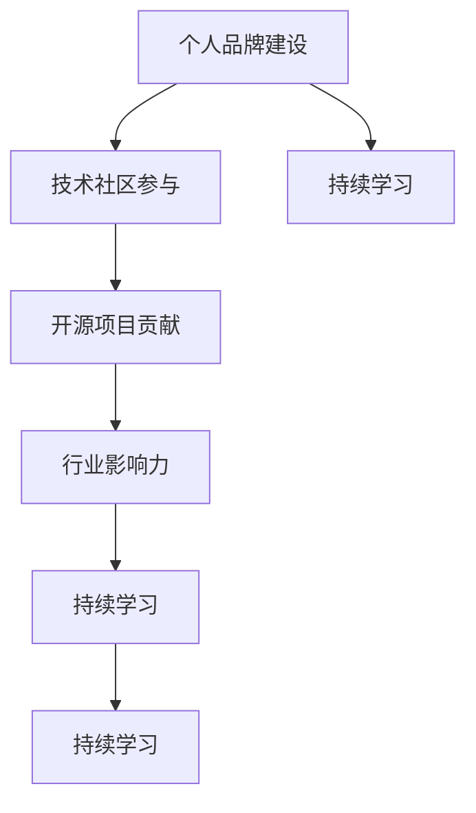

                 

# 程序员如何打造个人影响力

> 关键词：个人品牌建设,技术社区参与,开源项目贡献,行业影响力,持续学习

## 1. 背景介绍

在当今信息化快速发展的时代，程序员作为推动技术进步的重要力量，他们的影响力不仅限于技术圈内部，更延伸到了企业、市场、社会等各个层面。个人影响力不仅能够带来更多的职业机会和发展空间，也能够推动技术社区的繁荣和创新。因此，程序员打造个人影响力，已经成为一种不可或缺的职业发展策略。本文将系统探讨程序员如何通过技术积累、社区参与、项目贡献等多维度手段，打造个人品牌，提升行业影响力，实现职业和技术的双重突破。

## 2. 核心概念与联系

### 2.1 核心概念概述

为了更好地理解程序员如何打造个人影响力，本文将介绍几个关键的概念和它们之间的联系：

- **个人品牌建设**：程序员通过在技术社区、社交平台上的积极发言、分享和技术贡献，建立自己在行业内的知名度和声誉，从而形成个人品牌。

- **技术社区参与**：程序员积极参与开源项目、技术论坛、技术会议等社区活动，与同行交流、合作，积累人脉和资源。

- **开源项目贡献**：程序员通过在GitHub等平台上的开源项目代码贡献，提升技术能力和项目管理经验，同时获得社区认可。

- **行业影响力**：程序员通过技术分享、演讲、写作等形式，影响行业发展趋势，推动技术创新和产业升级。

- **持续学习**：程序员不断更新和扩展自己的技术栈，保持对新技术、新知识的敏感性和探索性，以适应行业快速变化的需求。

这些概念之间的逻辑关系可以通过以下Mermaid流程图来展示：



这个流程图展示了个体通过不断学习、参与社区、贡献项目，逐步建立和扩大个人影响力的过程。

## 3. 核心算法原理 & 具体操作步骤

### 3.1 算法原理概述

打造个人影响力并非一蹴而就，而是需要系统化的策略和不断的实践。基于本文探讨的各概念之间的关系，本文将阐述如何通过一系列步骤，系统性地提升个人技术影响力。

1. **基础积累**：扎实的技术功底是打造个人影响力的基石。程序员需不断学习新技术，掌握多种编程语言、框架，并深入理解其原理和应用。
2. **社区参与**：积极参与技术社区，分享技术见解，通过撰写博客、发布技术文章、参与技术讨论等形式，提升个人在社区中的曝光度和影响力。
3. **开源贡献**：通过在GitHub等平台上的开源项目贡献，展示自己的技术能力，与全球开发者合作，获取技术反馈和社区认可。
4. **技术分享**：通过技术演讲、培训、写作等形式，向更广泛的人群传播技术知识，影响行业发展。

### 3.2 算法步骤详解

本文将详细介绍以上步骤的具体操作：

#### 步骤一：基础积累

**1.1 持续学习**：
- 制定学习计划，定期阅读技术书籍、博客、论文等资源。
- 参加线上和线下的技术培训和课程，如Coursera、Udemy、edX等平台提供的专业课程。
- 订阅技术新闻和博客，关注领域内的技术动态和趋势。

**1.2 技术实践**：
- 通过实战项目练习，巩固所学知识，提升解决实际问题的能力。
- 参与开源项目，了解代码贡献流程和项目管理经验。
- 探索新技术，尝试将其应用到实际项目中，积累实践经验。

#### 步骤二：社区参与

**2.1 参与技术讨论**：
- 在技术论坛如Stack Overflow、Reddit、知乎等平台上，积极回答问题和参与讨论，展示自己的技术见解。
- 定期发布技术文章，分享自己的项目经验和心得，吸引关注和交流。
- 加入技术相关的GitHub组织和项目，参与代码讨论和问题解决。

**2.2 贡献开源项目**：
- 找到与自己技术栈和兴趣相符的开源项目，阅读项目文档，理解项目需求。
- 提交代码修复、新增功能、优化性能等贡献，逐步建立贡献者的声誉。
- 参与项目讨论，了解项目管理和版本控制流程，提升项目管理经验。

#### 步骤三：开源贡献

**3.1 选择项目**：
- 根据自身技术水平和兴趣，选择合适难度的开源项目。
- 评估项目的活跃度、社区支持和贡献门槛，选择更有前景的项目。

**3.2 代码贡献**：
- 阅读项目代码，理解项目架构和开发规范。
- 提交代码，遵循项目贡献流程，包括代码提交、版本控制、代码审查等环节。
- 跟进项目进度，积极参与项目讨论和问题解决。

#### 步骤四：技术分享

**4.1 技术演讲**：
- 在技术会议、企业内训、开源社区活动中，进行技术分享，展示技术成果。
- 准备充分，结合PPT和实际项目案例，清晰传达技术思路和应用场景。
- 接受问答环节的挑战，拓展思维，提升表达能力。

**4.2 技术写作**：
- 撰写技术博客、技术文章，系统介绍自己的技术实践和思考。
- 将技术文章投稿到技术社区、技术博客平台，如Medium、CSDN等，获取更多曝光机会。
- 建立个人技术网站或博客，长期更新技术文章，建立个人品牌。

## 4. 数学模型和公式 & 详细讲解 & 举例说明

本节将通过具体的数学模型和公式，进一步阐述如何通过系统的技术积累和社区参与，提升个人影响力。

### 4.1 数学模型构建

假设程序员影响力 $I$ 由技术积累 $T$、社区参与 $C$、开源贡献 $O$ 和持续学习 $L$ 四个维度组成，可以构建如下数学模型：

$$
I = f(T, C, O, L)
$$

其中 $f$ 是一个非线性函数，代表四个维度对影响力的综合作用。我们可以进一步将 $f$ 展开为：

$$
I = a \cdot T + b \cdot C + c \cdot O + d \cdot L
$$

其中 $a, b, c, d$ 是模型参数，代表各个维度的权重系数。在实践中，我们可以使用机器学习算法来确定这些参数。

### 4.2 公式推导过程

首先，我们需要收集和标注相关的数据，包括技术积累、社区参与、开源贡献和持续学习的量化指标，如编程经验、技术文章数量、GitHub贡献次数等。然后，使用回归分析等机器学习方法，拟合出上述模型中的参数 $a, b, c, d$。最后，将具体数值代入模型中，计算出影响力 $I$。

### 4.3 案例分析与讲解

以某知名技术博客作者为例，我们分析其在影响力提升过程中的关键步骤：

- **技术积累**：该作者通过长期自学和实战项目，积累了丰富的编程经验和技术储备。
- **社区参与**：其积极在技术论坛回答问题、参与讨论，并定期发布技术文章，吸引了大量关注。
- **开源贡献**：其通过参与GitHub项目，提交代码，逐步积累了贡献者的声誉。
- **技术分享**：定期进行技术演讲和技术写作，深入浅出地传播技术知识，影响行业发展。

通过上述四个维度的共同作用，该作者逐渐建立了在技术社区中的影响力，并获得了企业内训和技术合作的机会。

## 5. 项目实践：代码实例和详细解释说明

### 5.1 开发环境搭建

#### 5.1.1 环境准备

1. 安装Python、Java等编程语言。
2. 安装GitHub Desktop、IDE等开发工具。
3. 安装技术博客平台（如Medium、CSDN）。

#### 5.1.2 环境配置

1. 配置开发环境，确保所有依赖包和库正常工作。
2. 设置GitHub账号，连接代码仓库。
3. 搭建技术博客平台，撰写和发布技术文章。

### 5.2 源代码详细实现

#### 5.2.1 代码提交

假设某程序员参与了开源项目，在GitHub上提交代码。具体步骤如下：

1. Fork项目到自己的GitHub账号。
2. Clone项目到本地开发环境。
3. 修改代码，提交Pull Request（PR）。
4. 等待项目维护者审核通过。

#### 5.2.2 技术分享

假设某程序员进行技术演讲，具体步骤如下：

1. 选择合适的主题，准备演讲稿和PPT。
2. 报名参加技术会议，获得演讲机会。
3. 在会议上进行技术分享，回答观众提问。
4. 收集反馈，改进演讲技巧和内容。

### 5.3 代码解读与分析

#### 5.3.1 代码提交

**代码示例**：
```python
# 假设参与的GitHub项目使用GitHub Actions进行持续集成和部署
# 在本地环境修改代码后，推送到GitHub

git add .
git commit -m "修复bug"
git push origin main
```

**分析**：
- `git add`：添加本地修改，准备提交。
- `git commit`：提交修改，添加提交信息。
- `git push`：推送到GitHub仓库，触发CI/CD流程。

#### 5.3.2 技术演讲

**代码示例**：
```python
# 假设技术演讲使用了SlideShare平台，上传演讲稿和PPT

# 准备演讲稿和PPT
speech_text = "这里可以写演讲稿内容"
ppt = "这里可以上传PPT文件"

# 上传SlideShare
response = requests.post('https://api.slideshare.net/upload', headers={'Authorization': 'Bearer YOUR_ACCESS_TOKEN'}, json={'file': speech_text, 'title': '我的技术演讲', 'description': '我的技术分享', 'type': 'text'})

# 处理上传结果
if response.status_code == 200:
    print('演讲稿上传成功')
else:
    print('上传失败')
```

**分析**：
- `requests.post`：发送POST请求，上传演讲稿。
- `Authorization`：设置API访问令牌，授权上传。
- `status_code`：检查上传结果，判断上传是否成功。

### 5.4 运行结果展示

#### 5.4.1 代码提交

**运行结果**：
- 代码提交后，GitHub Actions自动化部署项目，确保代码质量。
- 提交记录保存在仓库历史中，方便查阅和回溯。

#### 5.4.2 技术演讲

**运行结果**：
- 演讲稿和PPT上传SlideShare后，生成演讲链接，供观众下载观看。
- 演讲结束后，获得观众反馈和评价，提升技术影响。

## 6. 实际应用场景

### 6.1 技术博客作者

某技术博客作者通过撰写高质量的技术文章，在技术社区中获得了大量关注。他不仅通过文章分享了自身技术实践和思考，还通过技术演讲和技术培训，影响了不少开发者。通过持续的社区参与和开源贡献，他逐步建立起了个人品牌，获得了更多的职业机会和发展空间。

### 6.2 开源项目贡献者

某开源项目贡献者通过积极参与GitHub项目，提交了大量的代码修复和功能增强，逐步获得了社区的认可和支持。他还通过参与项目讨论和问题解决，积累了项目管理经验，逐步成长为一名优秀的开源贡献者，并获得了企业和社区的合作机会。

### 6.3 技术会议演讲者

某技术会议演讲者通过不断学习新技术，积累了丰富的技术储备。他定期在技术会议上分享自己的技术实践和思考，获得了观众的高度评价和认可。通过持续的技术分享和社区参与，他逐步建立起了在技术社区中的影响力，并获得了更多的职业机会和发展空间。

## 7. 工具和资源推荐

### 7.1 学习资源推荐

为了帮助程序员系统掌握个人品牌建设的策略和技巧，以下是一些优质的学习资源推荐：

1. **《程序员如何建立个人品牌》书籍**：系统介绍程序员如何通过技术分享、社区参与、开源贡献等手段，建立个人品牌，提升技术影响力。
2. **Coursera《技术博客写作与运营》课程**：教授技术博客写作和运营技巧，帮助程序员通过博客提升影响力。
3. **edX《开源项目管理和贡献》课程**：介绍GitHub上的开源项目管理流程和代码贡献技巧，帮助程序员参与开源项目，提升技术能力。
4. **Medium《技术演讲指南》文章**：分享技术演讲的准备和实践技巧，帮助程序员提升演讲能力。
5. **Udemy《技术写作与出版》课程**：教授技术写作技巧，帮助程序员通过技术文章和书籍提升技术影响力。

### 7.2 开发工具推荐

为了高效实现个人品牌建设，以下是几款推荐的开发工具：

1. **GitHub Desktop**：简单易用的GitHub客户端，方便管理和提交代码。
2. **VSCode**：功能强大的代码编辑器，支持多种编程语言和技术栈。
3. **Jekyll**：简单易用的静态网站生成工具，用于搭建技术博客。
4. **SlideShare**：在线演讲分享平台，方便上传和分享技术演讲内容。
5. **LinkedIn**：职业社交平台，帮助程序员建立职业人脉，扩展影响力。

### 7.3 相关论文推荐

为了深入理解个人品牌建设的理论基础，以下是几篇相关的论文推荐：

1. **《技术社区中的个人品牌建设》论文**：研究技术社区中个人品牌建设的影响因素和策略，提出具体的品牌建设建议。
2. **《开源项目贡献者的行为分析》论文**：分析开源项目贡献者的行为模式和动机，提出提升贡献积极性的策略。
3. **《技术演讲的效能评估》论文**：研究技术演讲的效能评估指标和方法，提出提升技术演讲效果的建议。
4. **《技术写作与影响力建设》论文**：研究技术写作对个人品牌建设的影响，提出具体的写作策略和技术分享方法。
5. **《持续学习与技术影响》论文**：分析持续学习对技术影响力和职业发展的影响，提出具体的学习策略和方法。

## 8. 总结：未来发展趋势与挑战

### 8.1 总结

本文系统探讨了程序员如何通过技术积累、社区参与、开源贡献等多维度手段，打造个人品牌，提升技术影响力。通过技术分享、社区参与、开源贡献、持续学习等多个方面，程序员可以逐步建立和扩大个人影响力，实现职业和技术的双重突破。

### 8.2 未来发展趋势

展望未来，程序员个人品牌建设将呈现以下几个发展趋势：

1. **社区参与多样化**：未来社区参与将不再局限于技术论坛和开源项目，还将拓展到视频平台、社交媒体等多样化平台。
2. **技术分享互动化**：技术分享将更多采用直播、互动问答等形式，增强观众的参与感和互动性。
3. **开源贡献机制化**：开源贡献将通过规范化的项目管理机制，逐步提升贡献者的影响力和贡献价值。
4. **持续学习终身化**：持续学习将贯穿整个职业生涯，不断提升技术能力和行业影响力。
5. **技术影响力平台化**：技术影响力将更多通过平台化的方式进行评估和传播，形成系统的影响力评价体系。

### 8.3 面临的挑战

尽管程序员个人品牌建设的前景广阔，但在实践中仍面临诸多挑战：

1. **时间和精力限制**：程序员需要在繁忙的工作中抽出时间和精力进行个人品牌建设，可能会感到力不从心。
2. **内容质量要求高**：高质量的技术文章和演讲内容需要投入大量时间和精力，质量要求高，对技术积累和表达能力提出挑战。
3. **市场竞争激烈**：技术社区和职业市场竞争激烈，如何脱颖而出，需要不断创新和突破。
4. **保持长期投入**：个人品牌建设是一个长期过程，需要持续的投入和维护，避免短期行为。
5. **避免过度商业化**：个人品牌建设过程中，需要注意避免过度商业化，保持技术分享和社区参与的初心。

### 8.4 研究展望

未来的研究需要在以下几个方面寻求新的突破：

1. **自动化工具支持**：开发自动化工具，帮助程序员高效进行技术分享和社区参与，减轻时间和精力的负担。
2. **内容质量评估机制**：建立内容质量评估机制，激励高质量的技术分享和演讲内容创作。
3. **多平台融合**：探索技术分享和社区参与的多平台融合机制，提升影响力和传播效果。
4. **持续学习与技术发展结合**：研究持续学习与技术发展的结合，形成系统的学习和发展体系。
5. **技术影响力的度量方法**：建立科学的技术影响力度量方法，评估和提升个人品牌建设的效果。

总之，未来研究需要不断探索和创新，提升程序员个人品牌建设的效果和质量，推动技术社区和职业市场的发展。

## 9. 附录：常见问题与解答

**Q1：如何平衡工作与个人品牌建设？**

A: 合理规划时间，将个人品牌建设融入日常工作和学习中，不必单独占用大量时间。可以通过午休、周末等闲暇时间进行技术分享和社区参与。

**Q2：如何提升技术文章质量？**

A: 不断学习和积累技术知识，深入理解技术原理和应用场景，结合实际项目经验，撰写高质量的技术文章。可以通过技术社区反馈和读者评论，不断改进和提升。

**Q3：如何选择适合自己的开源项目？**

A: 选择与自身技术栈和兴趣相符的开源项目，评估项目活跃度和社区支持情况，选择有前景的项目。可以积极与项目维护者沟通，了解项目需求和贡献门槛。

**Q4：如何进行技术演讲准备？**

A: 提前选择合适的主题，准备详细的演讲稿和PPT，了解听众背景和需求。可以通过模拟演讲、录像回放等方式，反复练习和改进。

**Q5：如何保持技术持续学习？**

A: 定期阅读技术书籍、博客、论文等资源，参加线上和线下的技术培训和课程，订阅技术新闻和博客，参与开源项目和社区讨论，保持对新技术、新知识的敏感性和探索性。

---

作者：禅与计算机程序设计艺术 / Zen and the Art of Computer Programming

