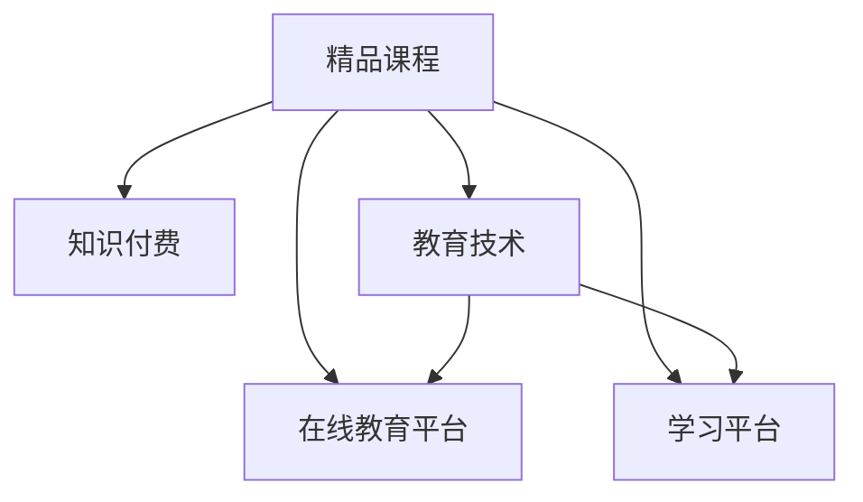

                 

# 程序员如何打造知识付费的精品课程

> 关键词：知识付费, 精品课程, 课程设计, 程序员, 教育技术, 在线教育, 学习平台

## 1. 背景介绍

### 1.1 问题由来

在数字经济时代，知识付费作为一种新兴的商业模式，迅速崛起并受到广泛关注。在线教育平台、知识社区、专业博客等，成为知识生产与传播的主要渠道。而程序员作为互联网技术的中坚力量，其专业技能和知识经验的传播，不仅能够提升自身的职业价值，也能够带动整个行业的发展。

然而，尽管知识付费市场日益繁荣，但精品课程的产出仍然面临诸多挑战。传统的线下培训机构难以覆盖全国范围，且受限于时间和地点的限制。而线上课程虽然灵活方便，但内容质量参差不齐，难以为用户提供真正有价值的知识体验。

因此，如何打造出高效、实用、易于理解的精品课程，成为程序员和教育技术专家共同追求的目标。本文将从课程设计、技术实现和平台运营等多个维度，探讨如何构建知识付费的精品课程。

### 1.2 问题核心关键点

打造精品课程的关键在于：
- 确定课程目标和内容结构
- 选择合适的教育技术工具和平台
- 设计互动式学习体验
- 保证课程质量和持续更新
- 构建社区和反馈机制

本文将围绕上述核心关键点，逐一展开分析，为程序员打造知识付费的精品课程提供全方位的指导。

## 2. 核心概念与联系

### 2.1 核心概念概述

为更好地理解知识付费精品课程的构建，本节将介绍几个密切相关的核心概念：

- **精品课程**：指具有高质量教学内容、高效教学方法和良好用户体验的在线教育课程。精品课程能够为学习者提供系统性、实用性、趣味性的学习体验。
- **知识付费**：指通过购买服务或订阅内容，获取知识或技能，提升个人或企业竞争力的商业模式。知识付费模式为优质教育资源的共享和传播提供了新路径。
- **教育技术**：指利用信息技术手段，改进和优化教育过程的各类技术。包括但不限于在线学习平台、课程制作工具、互动学习应用等。
- **在线教育平台**：指基于互联网的教育服务提供者，为用户提供课程、教学资源和互动服务。如Coursera、Udacity、edX等平台。
- **学习平台**：指提供知识共享、学习互动、知识社区等功能，支持用户在线学习的软件或平台。如知乎、博客园、GitHub等。
- **课程设计**：指根据课程目标，选择合适的教学内容、教学方法、教学工具，并制定详细的教学计划和评估标准的过程。

这些核心概念之间的逻辑关系可以通过以下Mermaid流程图来展示：



这个流程图展示出精品课程构建的各个环节：

1. 精品课程通过知识付费模式，得以在商业化运作下持续产出优质内容。
2. 精品课程的设计与制作依赖于教育技术和在线教育平台。
3. 精品课程的学习体验则通过学习平台来实现。

## 3. 核心算法原理 & 具体操作步骤
### 3.1 算法原理概述

精品课程的构建，本质上是一个基于教育技术的设计和实施过程。其核心思想是：将专业知识和经验，系统化地组织和传授，并结合互动和反馈机制，提升学习效果。

形式化地，假设精品课程内容为 $C$，教学目标为 $T$，教学方法为 $M$，学习工具为 $W$，学习平台为 $P$，则精品课程构建的目标是最大化学习效果 $E$：

$$
E = f(T, M, W, P, C)
$$

其中 $f$ 表示一个综合评估函数，考量课程目标与内容匹配度、教学方法的有效性、学习工具的辅助性、学习平台的互动性等多方面因素。

### 3.2 算法步骤详解

精品课程的构建一般包括以下几个关键步骤：

**Step 1: 确定课程目标和内容结构**

1. 明确课程目标：根据学习者需求和市场趋势，确定课程要达成的具体目标，如掌握编程技能、提升设计能力等。
2. 划分课程模块：将课程内容划分为若干个模块，每个模块对应一个子目标。如基础理论、实战技巧、项目实践等。
3. 设计课程大纲：详细列出每个模块的知识点、教学时长、学习难度等，形成完整的课程框架。

**Step 2: 选择合适的教育技术工具和平台**

1. 选择工具和平台：根据课程目标和内容结构，选择适合的在线教育平台和教学工具。如Coursera、Udacity等平台，以及Zoom、Teams等视频会议工具。
2. 进行平台配置：根据课程需求，配置学习平台的功能和参数，如课堂互动、课程发布、学习评估等。
3. 整合教学资源：将课程所需的教材、视频、代码等资源，上传到学习平台，并确保其格式和质量符合教学标准。

**Step 3: 设计互动式学习体验**

1. 设计互动任务：在课程中穿插互动任务，如编程作业、项目练习、在线测试等，增强学习者的参与感。
2. 引入实时反馈：使用自动化评估工具，对学习者的作业和测试进行实时反馈，及时纠正错误，指导学习方向。
3. 建立学习社群：通过学习平台或第三方社区，建立课程的学习社群，促进学习者之间的交流和互助。

**Step 4: 保证课程质量和持续更新**

1. 设立质量监控：定期对课程内容进行质量评估，收集学习者的反馈，发现并改进不足之处。
2. 保持内容更新：随着技术的发展和市场的变化，定期更新课程内容，添加新的知识点和技术。
3. 优化学习体验：根据技术进步和用户反馈，不断优化课程的教学方法和工具，提升学习效果。

**Step 5: 构建社区和反馈机制**

1. 建立反馈渠道：通过课程评论区、学习平台反馈系统等，收集学习者的意见和建议。
2. 设立社区群组：在平台或第三方社区中，建立课程专用的群组，促进学习者之间的交流和分享。
3. 定期举办活动：组织线上线下的课程交流活动，如技术分享会、编程比赛等，增强学习者之间的互动。

以上是精品课程构建的一般流程。在实际应用中，还需要根据具体课程特点，对上述步骤进行优化设计，如改进互动任务设计，引入游戏化元素；优化质量监控机制，引入第三方评估等。

### 3.3 算法优缺点

构建精品课程的算法具有以下优点：

1. 系统性：通过明确的课程目标和内容结构，保证了课程的系统性和完整性，避免知识零散和重复。
2. 互动性：通过设计互动任务和实时反馈，提高了学习者的参与度和主动性，增强了学习效果。
3. 实用性：通过选择适合的在线平台和教学工具，保证了课程的可操作性和实用价值。
4. 灵活性：课程内容可以根据需求和市场变化进行更新和优化，保持课程的先进性和适用性。

同时，该方法也存在一些局限性：

1. 时间和成本投入大：精品课程的构建需要大量的前期准备和后期维护，包括课程设计、内容制作、平台搭建等，需要投入大量的人力和物力。
2. 学习效果难以量化：精品课程的质量评估和效果衡量，难以采用统一的标准，依赖于学习者的主观评价和反馈。
3. 课程内容易过时：随着技术发展，课程内容需要不断更新和补充，否则将失去时效性和市场竞争力。
4. 平台依赖性强：精品课程的构建和运营，高度依赖于特定的在线平台和工具，一旦平台出现问题，课程的正常运行将受到影响。

尽管存在这些局限性，但就目前而言，精品课程的构建依然是大势所趋，是程序员知识和技能传播的重要途径。未来相关研究的重点在于如何进一步降低课程构建和运营成本，提升课程内容的时效性和可扩展性，同时兼顾学习效果的量化和平台独立性。

### 3.4 算法应用领域

精品课程的构建方法，已经在编程、设计、项目管理等多个领域得到了广泛应用。以下是几个典型的应用场景：

- **编程课程**：如Python编程、Java开发、Web前端开发等。通过课程设计与互动任务的结合，帮助学习者系统掌握编程语言和技能。
- **设计课程**：如UI/UX设计、平面设计、产品设计等。通过项目实践和互动反馈，提升学习者的设计能力和创意表达。
- **项目管理**：如敏捷开发、项目规划、团队管理等。通过案例分析和实战演练，帮助学习者掌握项目管理的基本方法和工具。
- **数据分析**：如数据清洗、统计分析、机器学习等。通过实战项目和代码解析，帮助学习者深入理解数据分析的流程和技术。

除了上述这些经典应用外，精品课程还被创新性地应用到更多场景中，如可控编程环境、虚拟仿真实验、虚拟现实体验等，为知识传播和教育创新带来了新的突破。随着课程构建技术和在线教育平台的不断发展，相信精品课程将在更广泛的领域得到应用，为教育技术的发展注入新的动力。

## 4. 数学模型和公式 & 详细讲解  
### 4.1 数学模型构建

本节将使用数学语言对精品课程的构建过程进行更加严格的刻画。

记精品课程内容为 $C$，教学目标为 $T$，教学方法为 $M$，学习工具为 $W$，学习平台为 $P$，则课程构建的目标是最大化学习效果 $E$。设课程时长为 $t$，课程难度为 $d$，课程参与度为 $p$，课程满意度为 $s$，则课程构建的数学模型可表示为：

$$
E = w_1 \times f(T, M, W, P, C) + w_2 \times t + w_3 \times d + w_4 \times p + w_5 \times s
$$

其中 $w_1, w_2, w_3, w_4, w_5$ 为权重系数，表示不同因素对学习效果的贡献度。

### 4.2 公式推导过程

以下我们以编程课程为例，推导精品课程的数学模型和评估公式。

假设课程内容 $C$ 由 $n$ 个知识点构成，每个知识点 $i$ 的学习难度为 $d_i$，课程时长为 $t$，课程难度为 $d$，课程参与度为 $p$，课程满意度为 $s$，则课程学习效果的评估函数 $f$ 可表示为：

$$
f = \sum_{i=1}^n (1 - d_i) \times \frac{1}{n}
$$

其中 $(1 - d_i)$ 表示知识点掌握的难度系数，$d_i$ 越低，表示知识点掌握越容易，对课程效果的贡献越大。$\frac{1}{n}$ 表示知识点之间的平均贡献。

将 $f$ 代入课程构建的数学模型，得：

$$
E = w_1 \times \sum_{i=1}^n (1 - d_i) \times \frac{1}{n} + w_2 \times t + w_3 \times d + w_4 \times p + w_5 \times s
$$

即：

$$
E = w_1 \times \frac{1}{n} \sum_{i=1}^n (1 - d_i) + w_2 \times t + w_3 \times d + w_4 \times p + w_5 \times s
$$

这个公式展示了精品课程学习效果的评估方法，强调了课程设计、内容难度、时长、参与度和满意度的综合考量。

### 4.3 案例分析与讲解

以某编程课程为例，课程包含20个知识点，每个知识点的难度系数如下表所示：

| 知识点编号 | 难度系数 $d_i$ |
| --- | --- |
| 1 | 0.8 |
| 2 | 0.7 |
| 3 | 0.5 |
| ... | ... |
| 20 | 0.3 |

根据公式，课程学习效果的评估函数为：

$$
f = (1 - 0.8) \times \frac{1}{20} + (1 - 0.7) \times \frac{1}{20} + ... + (1 - 0.3) \times \frac{1}{20} = 0.5
$$

假设课程总时长为50小时，课程难度为中等，课程参与度为80%，课程满意度为85%，则课程构建的数学模型为：

$$
E = w_1 \times 0.5 + w_2 \times 50 + w_3 \times 1 + w_4 \times 0.8 + w_5 \times 0.85
$$

根据实际需求，选择合适的权重系数 $w_1, w_2, w_3, w_4, w_5$，即可评估课程的学习效果。

## 5. 项目实践：代码实例和详细解释说明
### 5.1 开发环境搭建

在进行精品课程开发前，我们需要准备好开发环境。以下是使用Python进行Flask开发的环境配置流程：

1. 安装Python：从官网下载并安装Python，用于编程和开发。
2. 安装Flask：通过pip安装Flask框架，用于搭建Web应用程序。
3. 安装数据库：选择MySQL、PostgreSQL等数据库，安装并配置好开发环境。
4. 安装开发工具：如PyCharm、VSCode等IDE，以及Git、GitHub等版本控制工具。
5. 配置开发环境：根据项目需求，配置好开发环境，如虚拟环境、编码规范等。

完成上述步骤后，即可在开发环境中开始精品课程的开发和部署。

### 5.2 源代码详细实现

下面我们以编程课程为例，给出使用Flask框架对精品课程进行开发的Python代码实现。

首先，定义课程和学生模型：

```python
from flask_sqlalchemy import SQLAlchemy

db = SQLAlchemy(app)

class Course(db.Model):
    id = db.Column(db.Integer, primary_key=True)
    name = db.Column(db.String(100), nullable=False)
    duration = db.Column(db.Integer, nullable=False)
    difficulty = db.Column(db.Float, nullable=False)
    student_count = db.Column(db.Integer, nullable=False)

class Student(db.Model):
    id = db.Column(db.Integer, primary_key=True)
    name = db.Column(db.String(100), nullable=False)
    course_id = db.Column(db.Integer, db.ForeignKey('course.id', ondelete='CASCADE'), nullable=False)
    completion_status = db.Column(db.Boolean, nullable=False)
```

然后，定义Flask应用和路由：

```python
@app.route('/api/courses', methods=['GET'])
def get_courses():
    courses = Course.query.all()
    return jsonify([{'id': course.id, 'name': course.name, 'duration': course.duration, 'difficulty': course.difficulty} for course in courses])
```

接着，实现课程评估和反馈功能：

```python
@app.route('/api/course/evaluate', methods=['POST'])
def evaluate_course():
    request_data = request.json
    course_id = request_data['course_id']
    student_id = request_data['student_id']
    completed = request_data['completed']
    feedback = request_data['feedback']
    
    course = Course.query.get(course_id)
    student = Student.query.get(student_id)
    
    if completed:
        student.completion_status = True
    else:
        student.completion_status = False
    
    course.student_count += 1
    
    if feedback:
        course.feedback_count += 1
        course.feedback = feedback
    
    db.session.commit()
    
    return jsonify({'status': 'success'})
```

最后，启动Flask应用：

```python
if __name__ == '__main__':
    app.run(debug=True)
```

以上就是使用Flask框架对精品课程进行开发的完整代码实现。可以看到，通过Flask框架，我们能够方便地搭建Web应用程序，并通过RESTful API实现课程的管理和评估。

### 5.3 代码解读与分析

让我们再详细解读一下关键代码的实现细节：

**Course和Student模型**：
- `Course`模型定义了课程的基本属性，如课程名称、时长、难度等。
- `Student`模型定义了学生的基本属性，如学生姓名、完成的课程数量、反馈信息等。

**Flask应用和路由**：
- `/api/courses`路由：用于获取课程列表，返回课程的ID、名称、时长和难度。
- `/api/course/evaluate`路由：用于评估课程，根据学生是否完成课程和反馈信息，更新课程和学生的相关状态。

**课程评估和反馈功能**：
- 通过Flask的`request`对象，获取POST请求的JSON数据，包含课程ID、学生ID、是否完成课程和反馈信息。
- 根据课程ID和学生ID，查询对应的课程和学生信息。
- 根据学生是否完成课程和反馈信息，更新课程和学生的相关状态。
- 最终通过`jsonify`函数，返回JSON格式的结果。

**Flask应用启动**：
- 通过`if __name__ == '__main__'`判断当前文件的执行方式，如果是作为主程序执行，则调用`app.run`启动Flask应用。

可以看到，通过Flask框架，我们可以方便地实现精品课程的开发和部署，实现课程的评估和反馈功能。这为开发者提供了强大的工具支持，帮助他们快速搭建和迭代精品课程平台。

当然，工业级的系统实现还需考虑更多因素，如用户认证、权限管理、数据安全等。但核心的课程构建逻辑基本与此类似。

## 6. 实际应用场景
### 6.1 编程培训平台

基于精品课程开发技术，程序员可以创建面向编程学习的在线平台。平台通过提供系统化的编程课程和实战项目，帮助学习者掌握编程语言和技能。

平台的核心功能包括：
- 课程管理：课程的创建、编辑、发布等。
- 学生管理：学生的注册、登录、学习进度跟踪等。
- 交互功能：课程讨论区、在线编程环境、代码提交和评测等。
- 数据分析：课程完成率、学生学习轨迹、课程反馈等数据分析。

通过编程培训平台，程序员可以将自己的知识和经验分享给更多学习者，提升自身的职业价值，同时也为行业培养更多优秀人才。

### 6.2 技术博客和知识社区

程序员还可以通过精品课程开发技术，构建技术博客和知识社区，分享自己的学习心得和技术经验，构建专业化的知识交流平台。

社区的核心功能包括：
- 文章发布：技术的文章、教程、项目等。
- 互动评论：文章的评论、讨论、点赞等。
- 用户管理：用户的注册、登录、信息管理等。
- 内容推荐：根据用户兴趣推荐相关文章和技术。

通过技术博客和知识社区，程序员能够分享自己的技术实践和思考，同时也能够获取行业内的最新动态和技术资源，促进知识传播和行业交流。

### 6.3 企业内部培训平台

对于大型企业，程序员可以基于精品课程开发技术，构建内部培训平台，为员工提供系统化的技术培训和技能提升。

平台的核心功能包括：
- 课程创建：企业内部专家可以创建和发布课程。
- 学习管理：员工的注册、登录、学习进度跟踪等。
- 互动功能：课程讨论、在线学习、在线测试等。
- 数据分析：员工的学习情况、课程完成率、课程反馈等数据分析。

通过企业内部培训平台，企业能够提升员工的技术水平和业务能力，增强企业竞争力。

### 6.4 未来应用展望

随着技术的发展和市场的需求，精品课程的构建将迎来更多的创新和突破。以下是几个未来应用展望：

1. **AR/VR技术应用**：通过AR/VR技术，构建沉浸式学习环境，增强学习者的沉浸感和体验感。
2. **人工智能辅助**：引入人工智能技术，如智能推荐、自动评估等，提升课程的个性化和智能化水平。
3. **区块链技术应用**：利用区块链技术，确保课程内容和学习过程的可信性和透明性，防止数据篡改。
4. **跨平台协作**：通过API和SDK，实现课程在不同平台之间的无缝切换和协作，提升学习的便捷性和灵活性。
5. **社交化学习**：引入社交化元素，如课程分享、点赞、评论等，增强学习者的互动和参与感。
6. **实时互动**：通过实时互动工具，如WebRTC、视频会议等，实现师生之间的实时交流和互动。

这些应用场景的实现，将进一步拓展精品课程的适用范围和功能，为程序员和教育技术专家提供更多创新的实践机会。

## 7. 工具和资源推荐
### 7.1 学习资源推荐

为了帮助开发者系统掌握精品课程的构建技术，这里推荐一些优质的学习资源：

1. **Flask官方文档**：Flask框架的官方文档，提供了详细的API参考和开发指南，是学习Flask框架的基础。
2. **Python基础教程**：适合初学者入门的Python编程教程，如《Python编程：从入门到实践》。
3. **Flask实战项目**：通过实践项目学习Flask框架的应用，如《Flask Web开发实战》。
4. **在线教育平台技术博客**：如Udacity、Coursera等平台的开发者博客，分享课程构建和平台开发的最新技术和实践经验。
5. **教育技术社区**：如EdTech Hub、eLearning Industry等社区，提供最新的教育技术资讯和实践案例。

通过对这些资源的学习实践，相信你一定能够快速掌握精品课程的构建技术和方法，并用于解决实际的教育技术问题。

### 7.2 开发工具推荐

高效的开发离不开优秀的工具支持。以下是几款用于精品课程开发的常用工具：

1. **Flask**：轻量级的Web框架，简单易用，适合快速搭建Web应用程序。
2. **SQLAlchemy**：Python的SQL工具库，支持多种数据库系统，提供强大的ORM功能。
3. **Git**：版本控制系统，支持分布式协作，适合多人开发和代码管理。
4. **Jupyter Notebook**：交互式编程环境，支持Python、R等语言，适合数据科学和算法开发。
5. **PyCharm**：专业的Python IDE，提供代码高亮、调试、测试等全功能支持。
6. **GitHub**：代码托管平台，支持代码版本控制和项目管理，适合团队协作开发。

合理利用这些工具，可以显著提升精品课程的开发效率，加快创新迭代的步伐。

### 7.3 相关论文推荐

精品课程的构建技术源于学界的持续研究。以下是几篇奠基性的相关论文，推荐阅读：

1. **Kaggle教育数据集**：Kaggle上的教育数据集，包含大量课程、学生、评估等数据，是精品课程构建的重要数据来源。
2. **Coursera课程评估模型**：Coursera平台上的课程评估模型，通过数据分析和机器学习技术，优化课程的构建和学习效果。
3. **Udacity编程课程设计**：Udacity平台上的编程课程设计，详细介绍了课程模块的划分、互动任务的设计和评估方法。
4. **学习平台数据挖掘**：关于学习平台数据挖掘的研究论文，探讨了如何通过数据挖掘技术，发现学习者的学习模式和行为特征。
5. **在线教育平台用户行为分析**：关于在线教育平台用户行为分析的研究论文，分析了不同平台的用户行为特征和课程效果。

这些论文代表了大语言模型微调技术的发展脉络。通过学习这些前沿成果，可以帮助研究者把握学科前进方向，激发更多的创新灵感。

## 8. 总结：未来发展趋势与挑战

### 8.1 总结

本文对精品课程的构建技术进行了全面系统的介绍。首先阐述了精品课程在知识付费和教育技术中的应用背景和意义，明确了精品课程构建的目标和核心关键点。其次，从课程设计、技术实现和平台运营等多个维度，详细讲解了精品课程构建的数学模型和操作步骤，给出了精品课程开发的完整代码实例。同时，本文还广泛探讨了精品课程在多个行业领域的应用场景，展示了精品课程构建的广泛价值。

通过本文的系统梳理，可以看到，精品课程的构建技术为程序员和教育技术专家提供了重要的工具和方法，帮助他们打造高效、实用、易于理解的在线教育课程。未来，随着精品课程技术的不断演进，相信将有更多的创新和突破，进一步提升在线教育的质量和体验。

### 8.2 未来发展趋势

精品课程构建技术的发展趋势包括：

1. **AR/VR技术融合**：通过AR/VR技术，构建沉浸式学习环境，提升学习者的体验和互动感。
2. **人工智能辅助**：引入人工智能技术，如智能推荐、自动评估等，增强课程的个性化和智能化水平。
3. **区块链技术应用**：利用区块链技术，确保课程内容和学习过程的可信性和透明性，防止数据篡改。
4. **跨平台协作**：通过API和SDK，实现课程在不同平台之间的无缝切换和协作，提升学习的便捷性和灵活性。
5. **社交化学习**：引入社交化元素，如课程分享、点赞、评论等，增强学习者的互动和参与感。
6. **实时互动**：通过实时互动工具，如WebRTC、视频会议等，实现师生之间的实时交流和互动。

这些趋势凸显了精品课程构建技术的广阔前景。这些方向的探索发展，将进一步提升在线教育的质量和体验，为学习者提供更加多样、高效、便捷的学习方式。

### 8.3 面临的挑战

尽管精品课程构建技术已经取得了瞩目成就，但在迈向更加智能化、普适化应用的过程中，它仍面临着诸多挑战：

1. **课程内容质量**：精品课程的内容质量直接关系到学习效果，需要大量的时间和资源进行精心设计和制作。
2. **技术平台依赖**：精品课程的构建和运营，高度依赖于特定的在线平台和工具，平台依赖性较强。
3. **用户参与度**：精品课程的用户参与度受多种因素影响，如课程内容、学习体验等，提升用户参与度仍需持续优化。
4. **课程内容更新**：随着技术的发展和市场的变化，精品课程的内容需要不断更新和补充，否则将失去时效性和市场竞争力。
5. **平台用户体验**：精品课程的构建不仅要关注课程内容，还要注重平台的交互体验和易用性，提升用户的使用体验。

这些挑战需要持续的研究和实践，不断优化和改进精品课程的构建方法和技术，以实现更高质量的教育资源传播。

### 8.4 研究展望

面向未来，精品课程构建技术的研究方向包括：

1. **课程内容的自适应设计**：通过机器学习技术，自动生成适合不同学习者的课程内容，提升个性化和智能化水平。
2. **学习过程的动态调整**：通过数据分析和智能推荐，动态调整课程内容和学习路径，优化学习效果。
3. **跨领域课程的设计**：结合跨学科知识，设计综合性课程，提升学习者的综合能力和创新能力。
4. **混合式学习模式**：结合线上线下教学模式，提供多样化的学习方式，提升学习者的学习体验和效果。
5. **社区与生态的构建**：通过社区和生态的构建，促进学习者之间的交流和互动，提升学习者的学习动力和参与度。

这些研究方向的探索，将引领精品课程构建技术的不断演进，为教育技术的发展注入新的动力。相信随着技术的进步和应用的深入，精品课程将成为在线教育的重要力量，为人类社会的教育进步和知识传播做出更大的贡献。

## 9. 附录：常见问题与解答

**Q1：如何选择合适的课程内容？**

A: 选择合适的课程内容，需要考虑以下因素：
1. 目标受众：了解目标受众的需求和兴趣，选择合适的课程主题和难度。
2. 市场趋势：关注行业动态和技术发展，选择具有时效性和实用价值的课程内容。
3. 数据质量：收集高质量的学习数据，保证课程内容的准确性和可靠性。
4. 互动设计：设计互动式学习任务，提升学习者的参与度和学习效果。

**Q2：课程评估的标准是什么？**

A: 课程评估的标准应包括：
1. 学习效果：课程的完成率、掌握程度等。
2. 用户反馈：学习者的满意度、课程的评价等。
3. 数据分析：课程的学习轨迹、知识掌握情况等。
4. 教学质量：课程设计的系统性、教学方法的实用性等。

**Q3：如何提高用户参与度？**

A: 提高用户参与度的方法包括：
1. 互动任务设计：设计有挑战性和趣味性的互动任务，提升学习者的兴趣和参与感。
2. 实时反馈机制：通过实时反馈机制，及时纠正学习者的错误，引导学习方向。
3. 社交化元素：引入社交化元素，如课程分享、点赞、评论等，增强学习者的互动和参与感。
4. 奖励机制：设计奖励机制，如证书、积分等，激励学习者完成课程。

**Q4：课程内容的更新频率是多少？**

A: 课程内容的更新频率应根据具体情况确定：
1. 技术发展：及时更新课程内容，添加最新的知识点和技术。
2. 市场变化：根据市场需求和反馈，调整课程内容和难度。
3. 用户反馈：收集用户反馈，及时优化和改进课程内容。
4. 教学效果：根据教学效果和数据分析，调整课程结构和内容。

**Q5：如何评估精品课程的质量？**

A: 精品课程的质量评估应从多个维度进行：
1. 学习效果：通过学习者的完成率、掌握程度等评估学习效果。
2. 用户反馈：收集学习者的满意度、评价等，评估课程的受欢迎程度。
3. 数据分析：通过学习轨迹、知识掌握情况等，评估课程的实际效果。
4. 教学质量：通过课程设计的系统性、教学方法的实用性等，评估课程的教学质量。

这些评估方法和标准，可以帮助课程开发者不断优化和改进课程内容，提升精品课程的质量和效果。

---

作者：禅与计算机程序设计艺术 / Zen and the Art of Computer Programming

