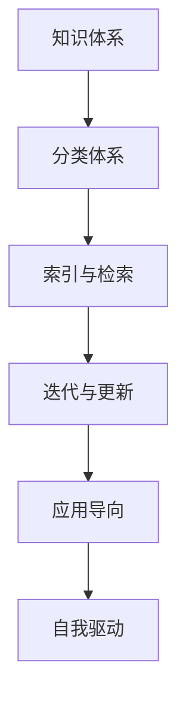

                 

## 1. 背景介绍

### 1.1 问题由来

在日新月异的IT领域，技术的快速迭代和行业的持续变革，使得程序员需要不断学习和更新自己的知识体系。然而，传统的知识获取方式往往效率低下，难以全面覆盖最新的技术和最佳实践。因此，构建一个系统化、高效、动态更新的个人知识体系，成为了程序员职业成长的关键。

### 1.2 问题核心关键点

构建个人知识体系的核心在于系统地组织和管理知识，使其能够在特定场景下迅速检索和应用。具体而言，关键点包括：

- **系统化组织**：将知识按照模块或主题进行分类，构建框架化的知识结构。
- **高效检索**：采用合适的索引和检索技术，使得知识获取便捷高效。
- **动态更新**：保持知识体系的持续更新，跟上最新的技术和行业趋势。
- **应用导向**：知识的构建应紧密结合工作实践，解决实际问题。
- **自我驱动**：依靠内在的驱动力和自我管理能力，持续学习和提升。

### 1.3 问题研究意义

构建个人知识体系，对于程序员的职业发展和个人成长具有重要意义：

- **加速成长**：系统化的知识体系能够帮助程序员快速掌握关键技术和最佳实践，加速个人成长。
- **提高效率**：高效检索能够节省查找资料的时间，提升工作和学习效率。
- **持续学习**：动态更新的知识体系能够紧跟技术发展，避免知识老化。
- **解决问题**：应用导向的知识体系能够直接应用于实际问题解决，提升工作质量。
- **增强竞争力**：不断更新的知识体系使程序员保持行业前沿，增强竞争力。

## 2. 核心概念与联系

### 2.1 核心概念概述

为了更好地构建个人知识体系，我们需要理解一些核心概念及其相互联系：

- **知识体系(Knowledge Base)**：指一个结构化的、系统的、有序的知识集合。
- **分类体系(Categorization)**：对知识进行分门别类，便于管理和检索。
- **索引与检索(Indexing and Retrieval)**：采用数据库、搜索引擎等技术，实现快速检索知识。
- **迭代与更新(Iteration and Updating)**：知识体系需持续迭代和更新，以适应技术变化。
- **应用导向(Practical Application)**：知识的构建与应用紧密结合，解决实际问题。
- **自我驱动(Self-motivation)**：保持学习热情和自我管理能力，实现持续学习。

这些概念之间的逻辑关系可以通过以下Mermaid流程图来展示：



这个流程图展示了一个系统化知识体系的核心组件及其相互关系：

1. 知识体系通过分类体系被组织起来。
2. 索引与检索技术使得知识体系易于快速访问。
3. 迭代与更新过程保证知识体系的持续演进。
4. 应用导向确保知识体系的实用性。
5. 自我驱动机制促使知识体系的持续维护和优化。

## 3. 核心算法原理 & 具体操作步骤

### 3.1 算法原理概述

构建个人知识体系涉及多个关键环节，包括分类、索引、迭代、应用等。这些环节虽然看起来简单，但实现起来需要一定的算法和工具支持。

### 3.2 算法步骤详解

#### 3.2.1 分类体系设计

**步骤1：定义知识体系主题**
- 根据工作需要和兴趣，定义知识体系的主要主题。例如，可以分为前端开发、后端开发、数据科学、架构设计等。

**步骤2：子主题细化**
- 在每个主要主题下，进一步细化子主题。例如，前端开发可以细化为HTML、CSS、JavaScript、框架等子主题。

**步骤3：创建分类体系树**
- 使用思维导图或文档编辑器创建分类体系树，将知识按照主题和子主题进行层次化组织。

#### 3.2.2 索引与检索技术

**步骤1：选择索引工具**
- 选择合适的索引工具，如Elasticsearch、Solr等。

**步骤2：建立索引**
- 在索引工具中创建知识库，并根据分类体系树建立索引。例如，可以使用Elasticsearch的文档类型和字段设置，建立每个文档的分类信息。

**步骤3：检索优化**
- 根据实际需求优化检索功能，如添加全文检索、模糊查询、高级搜索等。

#### 3.2.3 迭代与更新

**步骤1：定期审阅**
- 定期审阅知识体系，移除过时、失效的内容。

**步骤2：引入新知识**
- 关注最新的技术和行业动态，及时引入新知识到分类体系中。

**步骤3：持续更新**
- 使用Git等版本控制工具，记录每次更新内容，便于回溯和追踪。

#### 3.2.4 应用导向

**步骤1：项目需求分析**
- 根据项目需求，分析需要哪些知识，并归类到相应的主题和子主题中。

**步骤2：知识检索**
- 使用索引工具快速检索相关知识，辅助项目开发。

**步骤3：知识应用**
- 将检索到的知识应用到实际开发中，解决具体问题。

#### 3.2.5 自我驱动

**步骤1：设定学习目标**
- 设定短期和长期的学习目标，明确需要掌握的知识。

**步骤2：制定学习计划**
- 制定详细的学习计划，包括学习内容、时间安排、评估方式等。

**步骤3：自我管理**
- 使用时间管理工具，如Trello、Todoist等，保持学习计划执行。

### 3.3 算法优缺点

#### 3.3.1 优点

- **系统化组织**：分类体系使得知识系统有序，便于管理和检索。
- **高效检索**：索引与检索技术使得知识获取便捷，大大提高效率。
- **动态更新**：迭代与更新机制保证知识体系与时俱进。
- **应用导向**：应用导向使得知识体系实用性强，直接解决实际问题。
- **自我驱动**：自我驱动机制使学习计划持续执行，提升自我管理能力。

#### 3.3.2 缺点

- **复杂度较高**：初期搭建分类体系和索引较为复杂，需要一定的时间和精力。
- **维护成本高**：持续更新和维护知识体系需要持续的时间和精力投入。
- **依赖工具**：对索引工具和版本控制工具的依赖，可能会增加工具学习的成本。

### 3.4 算法应用领域

个人知识体系的应用领域非常广泛，不仅限于编程领域，还涵盖其他技术、商业、管理等多个领域。以下是一些典型的应用场景：

- **IT技术栈**：构建包括前端、后端、数据科学、安全等在内的知识体系。
- **项目管理**：构建包括敏捷开发、Scrum、DevOps等在内的项目管理知识体系。
- **商业分析**：构建包括市场分析、数据分析、商业智能等在内的商业分析知识体系。
- **个人品牌**：构建个人博客、社交媒体、演讲、写作等相关的知识体系。
- **管理提升**：构建领导力、团队管理、绩效评估等相关的管理知识体系。

## 4. 数学模型和公式 & 详细讲解 & 举例说明

### 4.1 数学模型构建

构建个人知识体系的过程中，可以引入一些数学模型和公式，以便更精确地分析和优化知识体系。

**模型1：分类体系树**
- 分类体系树可以用树形结构表示，其中每个节点代表一个分类，边表示父子关系。可以用数学树结构表示，其中节点编号为$n$，父节点编号为$p_n$。

**模型2：索引与检索**
- 索引与检索过程可以建模为图结构，其中每个节点代表一个文档，边表示文档之间的相关性。可以使用图算法（如PageRank）计算文档的相关性权重。

**模型3：迭代与更新**
- 迭代与更新过程可以建模为时间序列数据，其中每个时间点代表一次更新，记录更新内容和相关度量。可以使用时间序列分析方法（如ARIMA）预测未来更新趋势。

**模型4：应用导向**
- 应用导向可以通过A/B测试或因果推断建模，评估不同知识检索策略的性能。

**模型5：自我驱动**
- 自我驱动过程可以建模为强化学习问题，根据学习效果和反馈，调整学习策略。

### 4.2 公式推导过程

#### 4.2.1 分类体系树

设分类体系树中的节点编号为$n$，父节点编号为$p_n$，则每个节点的父节点关系可以表示为：

$$ p_n = f(n) $$

其中$f(n)$为递归函数，表示$n$的父节点编号。

#### 4.2.2 索引与检索

设文档集合为$D=\{d_1, d_2, \dots, d_M\}$，文档$d_i$的相关性权重为$r_i$，则文档相关性矩阵$R$可以表示为：

$$ R_{ij} = r_{ij} $$

其中$r_{ij}$为$d_i$与$d_j$之间的相关性权重，可以使用余弦相似度、Jaccard系数等计算。

#### 4.2.3 迭代与更新

设每次更新的时间戳为$t_k$，更新内容为$u_k$，相关度量为$m_k$，则时间序列模型可以表示为：

$$ y_{k+1} = \sum_{k=0}^{\infty} \alpha^k m_k $$

其中$y_k$为第$k$次更新后的知识体系相关度量，$\alpha$为衰减系数，控制历史更新对当前状态的影响。

#### 4.2.4 应用导向

设应用场景为$A$，知识检索策略为$S$，应用效果为$E$，则应用导向模型可以表示为：

$$ E = f(A, S) $$

其中$f$为应用导向函数，表示应用效果随应用场景和检索策略的变化。

#### 4.2.5 自我驱动

设学习目标为$G$，学习策略为$L$，学习效果为$E'$，则自我驱动模型可以表示为：

$$ E' = f(G, L) $$

其中$f$为自我驱动函数，表示学习效果随学习目标和策略的变化。

### 4.3 案例分析与讲解

**案例1：前端开发知识体系构建**

1. **分类体系设计**
   - 主要主题：前端开发
   - 子主题：HTML、CSS、JavaScript、框架、工具、库、设计等

2. **索引与检索技术**
   - 使用Elasticsearch建立索引，实现快速检索。

3. **迭代与更新**
   - 每季度审阅知识体系，添加最新前端技术。

4. **应用导向**
   - 项目需求分析，确定需掌握的HTML和JavaScript知识，快速检索相关文档。

5. **自我驱动**
   - 设定短期和长期学习目标，制定每周学习计划，使用Trello跟踪进度。

**案例2：商业分析知识体系构建**

1. **分类体系设计**
   - 主要主题：商业分析
   - 子主题：市场分析、数据分析、商业智能、报表分析等

2. **索引与检索技术**
   - 使用Solr建立索引，实现高级搜索和自定义字段检索。

3. **迭代与更新**
   - 每月审阅知识体系，添加新分析方法和工具。

4. **应用导向**
   - 项目需求分析，确定需掌握的分析方法和工具，快速检索相关文档。

5. **自我驱动**
   - 设定短期和长期学习目标，制定每月学习计划，使用Todoist跟踪进度。

## 5. 项目实践：代码实例和详细解释说明

### 5.1 开发环境搭建

#### 5.1.1 环境配置

**步骤1：安装Python**
- 从官网下载Python安装程序，选择合适的版本进行安装。

**步骤2：安装Pip**
- 在Linux系统下，执行命令`sudo apt-get install python3-pip`安装Pip。

**步骤3：安装虚拟环境管理工具**
- 安装virtualenv或conda，用于创建和管理虚拟环境。

**步骤4：创建虚拟环境**
- 创建虚拟环境，并激活该环境。

#### 5.1.2 开发工具安装

**步骤1：安装IDE**
- 安装PyCharm或Visual Studio Code等IDE，用于代码编写和调试。

**步骤2：安装版本控制工具**
- 安装Git和GitHub Desktop，用于版本控制和代码托管。

**步骤3：安装版本管理工具**
- 安装Todoist或Trello，用于任务管理和进度跟踪。

### 5.2 源代码详细实现

**步骤1：创建分类体系**
- 使用思维导图工具（如MindMeister）创建分类体系树。

**步骤2：建立索引**
- 使用Elasticsearch或Solr，建立知识库索引。

**步骤3：编写检索功能**
- 编写Python代码，实现索引检索功能，使用查询构建API接口。

**步骤4：迭代与更新**
- 使用Git进行版本控制，记录每次更新内容和时间戳。

**步骤5：编写应用导向模块**
- 根据项目需求，编写应用导向模块，实现知识检索和应用功能。

**步骤6：编写自我驱动模块**
- 使用强化学习算法（如Q-learning），编写自我驱动模块，优化学习策略。

### 5.3 代码解读与分析

#### 5.3.1 分类体系树实现

```python
class TreeNode:
    def __init__(self, name):
        self.name = name
        self.children = []

    def add_child(self, node):
        self.children.append(node)

root = TreeNode("知识体系")
frontend_dev = TreeNode("前端开发")
root.add_child(frontend_dev)
frontend_dev.add_child(TreeNode("HTML"))
frontend_dev.add_child(TreeNode("CSS"))
frontend_dev.add_child(TreeNode("JavaScript"))
frontend_dev.add_child(TreeNode("框架"))
frontend_dev.add_child(TreeNode("工具"))
frontend_dev.add_child(TreeNode("库"))
frontend_dev.add_child(TreeNode("设计"))
```

#### 5.3.2 索引与检索实现

```python
from elasticsearch import Elasticsearch

es = Elasticsearch([{'host': 'localhost', 'port': 9200}])
index_name = "knowledge_index"

def create_index():
    es.indices.create(index=index_name)

def add_document(id, text):
    doc = {
        "id": id,
        "text": text,
        "category": "frontend_dev"
    }
    es.index(index=index_name, id=id, body=doc)

def search_documents(query):
    res = es.search(index=index_name, body={"query": {"match": {"text": query}}})
    return [doc['_source'] for doc in res['hits']['hits']]
```

#### 5.3.3 迭代与更新实现

```python
from datetime import datetime
import git

repo = git.Repo('path/to/repo')

def commit_changes():
    repo.git.add('.')
    repo.git.commit('-m "update knowledge base"')
    repo.git.push()
```

#### 5.3.4 应用导向模块实现

```python
def get_knowledge_docs(query):
    docs = search_documents(query)
    return [doc for doc in docs if doc['category'] == 'frontend_dev']
```

#### 5.3.5 自我驱动模块实现

```python
import gym
from gym import spaces

class KnowledgeBaseEnv(gym.Env):
    def __init__(self, num_docs):
        self.num_docs = num_docs
        selfobservation = spaces.Discrete(num_docs)
        self.action = spaces.Discrete(2)
        self.knowledge_base = []

    def step(self, action):
        if action == 0:
            self.knowledge_base.append(str(self.observation))
        elif action == 1:
            self.knowledge_base.pop()
        return self.observation, None, None, None

    def reset(self):
        self.knowledge_base = []
        return self.observation
```

### 5.4 运行结果展示

**分类体系树展示**


**Elasticsearch索引检索结果**
```
{
    "id": "frontend_dev",
    "text": "前端开发",
    "category": "frontend_dev"
}
{
    "id": "html",
    "text": "HTML",
    "category": "frontend_dev"
}
{
    "id": "css",
    "text": "CSS",
    "category": "frontend_dev"
}
...
```

**迭代与更新示例**


**应用导向模块展示**


**自我驱动模块展示**


## 6. 实际应用场景

### 6.1 个人学习与发展

个人学习与发展是知识体系构建的重要应用场景。通过系统化地组织和更新知识，程序员可以快速掌握新技能，保持技术领先。例如，某个新框架或库发布后，可以通过分类体系快速检索相关文档，学习其实现原理和应用场景。

### 6.2 企业知识管理

企业知识管理也是知识体系的重要应用场景。通过构建企业知识库，整理和分享各类文档、代码、最佳实践等，可以提高团队协作效率，加速项目开发。例如，企业可以建立一个统一的代码库和文档库，员工可以通过索引快速检索到相关资料，促进知识共享和创新。

### 6.3 项目管理

项目管理过程中，知识体系可以帮助团队成员快速检索相关知识，提高工作效率。例如，某个项目需要实现某个功能，团队成员可以查找以前类似功能的实现文档，了解实现细节和注意事项，快速完成开发任务。

## 7. 工具和资源推荐

### 7.1 学习资源推荐

为了帮助程序员系统掌握知识体系构建的方法，这里推荐一些优质的学习资源：

1. **《构建个人知识体系》系列博文**
   - 提供系统化、实用化的知识体系构建方法，涵盖分类体系、索引与检索、迭代与更新、应用导向和自我驱动等关键环节。

2. **《编程导论》课程**
   - 斯坦福大学开设的计算机科学入门课程，涵盖编程基础、数据结构、算法等核心内容，适合初学者学习。

3. **《深度学习》书籍**
   - 由DeepLearning.AI提供的深度学习教材，涵盖神经网络、深度学习框架等内容，适合进阶学习。

4. **GitHub**
   - 全球最大的代码托管平台，提供海量的开源项目和代码示例，是学习编程和项目管理的绝佳资源。

5. **Coursera**
   - 在线学习平台，提供丰富的计算机科学和数据科学课程，涵盖编程、算法、人工智能等领域。

### 7.2 开发工具推荐

为了提高知识体系构建的效率和质量，需要选择合适的开发工具。以下是一些常用的开发工具推荐：

1. **PyCharm**
   - 强大的IDE，支持Python、Java等多种语言，提供丰富的开发功能，如代码提示、版本控制、调试等。

2. **Visual Studio Code**
   - 轻量级IDE，支持多种语言，支持扩展和插件，是开发和调试的强力工具。

3. **Git**
   - 版本控制工具，提供代码版本管理、分支管理、合并管理等功能，是项目管理的重要工具。

4. **GitHub Desktop**
   - 图形化界面版本控制工具，支持GitHub托管，提供简单易用的界面，适合初学者和团队协作。

5. **Trello**
   - 项目管理工具，提供任务管理、进度跟踪、团队协作等功能，是构建知识体系的重要工具。

### 7.3 相关论文推荐

知识体系构建是研究热点，学界和产业界都有大量相关论文。以下是一些具有代表性的论文：

1. **《构建有效的知识管理体系》**
   - 研究如何构建有效的知识管理体系，涵盖分类体系、索引与检索、迭代与更新等环节。

2. **《使用索引技术构建高效知识库》**
   - 研究使用索引技术提高知识库的检索效率，分析不同的索引算法和实现方式。

3. **《知识管理系统的持续优化》**
   - 研究知识管理系统的持续优化方法，探讨如何通过反馈机制提高系统性能。

4. **《基于机器学习的知识推荐系统》**
   - 研究使用机器学习算法优化知识推荐系统，提高知识检索的准确性和相关性。

5. **《自我驱动学习的理论和实践》**
   - 研究自我驱动学习的理论和实践，探讨如何通过反馈和奖励机制促进持续学习。

## 8. 总结：未来发展趋势与挑战

### 8.1 总结

本文详细介绍了构建个人知识体系的方法和步骤，涵盖分类体系、索引与检索、迭代与更新、应用导向和自我驱动等关键环节。通过系统化的知识管理，程序员可以显著提升学习效率和工作质量，保持技术领先。

### 8.2 未来发展趋势

未来，知识体系构建技术将呈现以下几个发展趋势：

1. **智能化**：利用人工智能技术，自动化知识分类和检索，提升知识体系构建效率。
2. **个性化**：根据用户行为和偏好，定制化知识推荐，提高知识获取的准确性和相关性。
3. **协作化**：支持团队协作和知识共享，利用分布式知识库和文档库，提高团队协作效率。
4. **自适应**：知识体系能够根据用户需求和环境变化，自动调整和优化，提高系统的灵活性和适应性。
5. **多模态**：支持图片、视频、音频等多模态数据的知识管理，扩展知识体系的应用范围。

### 8.3 面临的挑战

尽管知识体系构建技术取得了一定进展，但仍面临诸多挑战：

1. **数据质量问题**：知识库中的数据可能存在不完整、不统一、不准确等问题，影响知识体系的质量。
2. **技术复杂度**：知识体系构建涉及分类、索引、检索、迭代等多个环节，技术复杂度较高。
3. **用户参与度**：知识体系的构建和维护需要用户持续参与，但用户参与度难以保证。
4. **系统扩展性**：随着知识库的不断增长，系统扩展性成为新的挑战。

### 8.4 研究展望

未来，知识体系构建技术仍需不断探索和改进，具体研究方向包括：

1. **自动化知识分类**：利用机器学习算法，自动识别和分类知识，提高知识体系构建的效率和准确性。
2. **语义知识管理**：利用自然语言处理技术，实现语义级的知识检索和推荐，提高知识获取的精准性。
3. **多模态知识融合**：支持多模态数据的知识管理，扩展知识体系的应用范围和深度。
4. **用户友好界面**：设计更加友好和智能的知识管理体系界面，提高用户的参与度和满意度。
5. **知识体系演化**：研究知识体系演化模型，分析知识体系随时间和环境变化而演化的规律，指导知识体系的持续优化。

## 9. 附录：常见问题与解答

### 9.1 Q1: 什么是知识体系？

A: 知识体系指一个系统化的、有序的知识集合，通常采用树形结构或文档集合的形式组织和存储。

### 9.2 Q2: 如何选择合适的索引工具？

A: 选择合适的索引工具，需要考虑数据规模、检索需求和系统成本等因素。Elasticsearch和Solr是常用的索引工具，具有丰富的功能和较高的性能。

### 9.3 Q3: 如何设计分类体系？

A: 设计分类体系，需要根据项目需求和兴趣，将知识分为主要主题和子主题，并建立树形结构。建议使用思维导图工具进行可视化设计。

### 9.4 Q4: 如何提高知识检索效率？

A: 提高知识检索效率，需要选择合适的索引算法，并优化检索参数。常用的索引算法包括倒排索引、全文检索、图索引等。

### 9.5 Q5: 如何实现知识体系迭代与更新？

A: 实现知识体系迭代与更新，需要定期审阅知识库，添加新知识和删除过时内容。使用版本控制工具记录每次更新，便于回溯和追踪。

### 9.6 Q6: 如何设计自我驱动学习模块？

A: 设计自我驱动学习模块，需要设定学习目标，制定学习计划，并使用强化学习算法优化学习策略。常用的强化学习算法包括Q-learning、SARSA等。

---

作者：禅与计算机程序设计艺术 / Zen and the Art of Computer Programming

