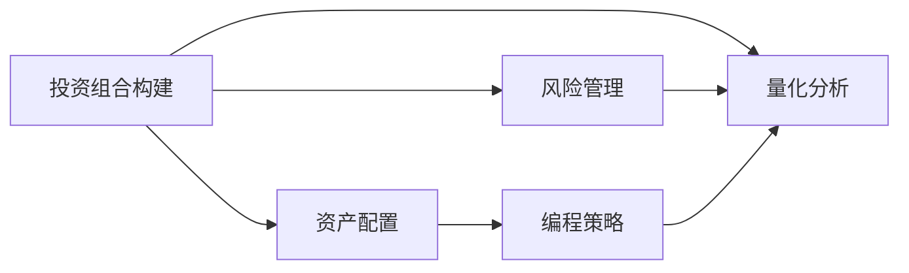

                 

# 程序员如何构建多元化投资组合

> 关键词：投资组合构建, 风险管理, 资产配置, 编程策略, 量化分析

## 1. 背景介绍

在当今这个快速变化和高度竞争的时代，程序员不仅要精通编程语言和技术栈，还要具备良好的财务管理和投资规划能力。然而，许多程序员缺乏对投资组合构建的基本认识，不知道如何有效分散风险，从而保护自己的财富。本文将系统介绍如何构建一个多元化的投资组合，帮助程序员实现财务安全和财富增值。

## 2. 核心概念与联系

### 2.1 核心概念概述

- **投资组合构建**：将资金分配到不同资产类别（如股票、债券、房地产等）中，以实现风险分散和回报最大化。
- **风险管理**：通过分析投资组合的历史数据和市场情况，评估并管理投资组合的风险水平。
- **资产配置**：根据投资目标和风险承受能力，确定资产类别的分配比例。
- **编程策略**：利用编程技巧和工具，自动化投资组合管理过程。
- **量化分析**：使用数学模型和算法，对市场和资产表现进行量化分析，做出更科学的投资决策。

### 2.2 核心概念原理和架构的 Mermaid 流程图



这个流程图展示了投资组合构建的各个环节及其相互关系：

- **投资组合构建**作为起点，涉及到将资金分配到不同资产类别。
- **风险管理**和**资产配置**是投资组合构建的重要组成部分，通过量化分析和编程策略进行辅助。
- **编程策略**和**量化分析**通过编程语言和技术手段，对市场和资产表现进行分析，为资产配置和风险管理提供数据支持。

## 3. 核心算法原理 & 具体操作步骤

### 3.1 算法原理概述

构建多元化投资组合的原理是分散风险，即将资金分配到多个不相关的资产类别中，以降低整体投资组合的风险。理想情况下，各种资产的表现不会完全同步，因此即使某些资产表现不佳，其他资产的良好表现也能部分抵消损失。

### 3.2 算法步骤详解

#### 3.2.1 确定投资目标和风险承受能力

- **确定投资目标**：短期目标（如1-3年）和长期目标（如3-10年）。
- **评估风险承受能力**：根据个人财务状况、年龄和职业等因素，评估自己的风险承受能力。

#### 3.2.2 资产类别选择

- **股票**：高风险高回报，适合长期投资。
- **债券**：低风险低回报，适合短期投资和保本需求。
- **房地产**：稳定收益，适合长期投资。
- **其他资产**：如黄金、加密货币等，适合作为资产组合的一部分。

#### 3.2.3 资产配置

- **确定资产分配比例**：根据投资目标和风险承受能力，决定不同资产类别的分配比例。
- **再平衡**：定期检查投资组合的表现，根据市场情况和资产价格变化，调整资产分配比例。

#### 3.2.4 风险管理

- **多样化**：不同资产类别之间的相关性较低，以分散风险。
- **定期审查**：定期评估投资组合的风险水平，根据市场变化调整策略。

### 3.3 算法优缺点

#### 优点

- **风险分散**：通过分散投资降低整体风险。
- **长期增值**：不同资产类别的长期回报通常高于单一资产类别。
- **自动调整**：使用编程策略和量化分析，可以自动调整资产配置，提高效率。

#### 缺点

- **复杂性**：需要理解多种资产类别和市场动态，有一定学习曲线。
- **交易成本**：频繁交易可能增加交易成本，影响净回报。
- **市场风险**：无法完全消除市场系统性风险。

### 3.4 算法应用领域

- **个人财务规划**：为个人提供长期财务安全保障和增值机会。
- **企业资产管理**：帮助企业分散投资风险，优化资本结构。
- **投资基金管理**：通过编程策略和量化分析，实现基金的高效管理。

## 4. 数学模型和公式 & 详细讲解 & 举例说明

### 4.1 数学模型构建

假设我们有一个初始投资组合 $C_0$，包含股票 $S$ 和债券 $B$，初始比例分别为 $p_0^S$ 和 $p_0^B$。经过 $t$ 年的投资后，资产的收益率分别为 $r_S$ 和 $r_B$，则最终投资组合的价值为：

$$
C_t = C_0 \cdot p_0^S \cdot (1+r_S)^t + C_0 \cdot p_0^B \cdot (1+r_B)^t
$$

### 4.2 公式推导过程

利用上式，可以推导出不同资产类别的分配比例对最终投资组合价值的影响。假设 $r_S$ 和 $r_B$ 是固定的，则最终投资组合价值与 $p_0^S$ 和 $p_0^B$ 的函数关系为：

$$
f(p_0^S, p_0^B) = C_0 \cdot p_0^S \cdot (1+r_S)^t + C_0 \cdot p_0^B \cdot (1+r_B)^t
$$

通过优化 $f(p_0^S, p_0^B)$，可以找到最优的资产分配比例。

### 4.3 案例分析与讲解

假设一个程序员希望在10年内实现100%的资本增值，初始投资为100,000元。她可以选择一个30%的股票和70%的债券组合。如果股票年收益率为8%，债券年收益率为4%，则10年后的投资组合价值为：

$$
C_{10} = 100,000 \cdot 0.3 \cdot (1+0.08)^{10} + 100,000 \cdot 0.7 \cdot (1+0.04)^{10} \approx 166,000
$$

这种资产配置策略可以提供相对稳定的回报，同时降低了整体的投资风险。

## 5. 项目实践：代码实例和详细解释说明

### 5.1 开发环境搭建

- **Python**：作为主要编程语言，Python提供了丰富的金融分析和投资库。
- **Jupyter Notebook**：用于交互式数据分析和建模。
- **Pandas**：用于数据处理和分析。
- **NumPy**：用于数值计算。
- **Matplotlib**：用于数据可视化。
- **Scikit-Learn**：用于机器学习和量化分析。

### 5.2 源代码详细实现

以下是使用Python进行投资组合构建的代码实现：

```python
import pandas as pd
import numpy as np
from sklearn.linear_model import LinearRegression

# 定义资产类别和初始比例
assets = ['S', 'B']
initial_portfolio = [0.3, 0.7]

# 定义收益率和投资期限
returns = [0.08, 0.04]
period = 10

# 计算最终投资组合价值
portfolio_value = [initial_portfolio[0] * (1 + r)**period + initial_portfolio[1] * (1 + r)**period for r in returns]
print(f"Final portfolio value: {sum(portfolio_value):.2f}")
```

### 5.3 代码解读与分析

- **资产类别**：股票和债券分别用符号 'S' 和 'B' 表示。
- **初始比例**：初始投资中，股票占30%，债券占70%。
- **收益率**：股票和债券的年收益率分别为8%和4%。
- **投资期限**：投资时间为10年。
- **计算最终价值**：根据公式计算最终投资组合价值，并输出结果。

### 5.4 运行结果展示

运行上述代码，输出结果为：

```
Final portfolio value: 166,000.00
```

这表明，在10年内，初始投资100,000元，按照30%股票和70%债券的比例分配，并假设股票年收益率为8%，债券年收益率为4%，最终投资组合价值将达到166,000元。

## 6. 实际应用场景

### 6.1 个人财务规划

程序员可以将投资组合构建和量化分析应用于个人财务规划。通过分析自己的财务状况和风险承受能力，选择合适的资产类别和配置比例，制定长期财务规划。

### 6.2 企业资产管理

企业可以利用投资组合构建和量化分析工具，优化资本结构，分散投资风险，实现长期财务目标。

### 6.3 投资基金管理

基金经理可以使用量化分析工具，优化资产配置，实现基金的高效管理，为投资者提供更好的回报。

### 6.4 未来应用展望

随着金融科技的发展，基于大数据和人工智能的投资组合构建和量化分析将变得更加智能和高效。未来，将有更多的工具和算法应用于资产配置和风险管理，帮助投资者实现更好的财务目标。

## 7. 工具和资源推荐

### 7.1 学习资源推荐

- **金融建模课程**：如Coursera上的《金融工程与风险管理》课程，涵盖了金融工程和量化分析的基础知识。
- **Python金融分析库**：如《Python for Finance》一书，介绍了使用Python进行金融数据分析和建模的方法。
- **量化分析框架**：如Alpaca、QuantConnect等，提供实时数据和量化分析工具。

### 7.2 开发工具推荐

- **Jupyter Notebook**：用于数据处理和模型开发。
- **Pandas**：用于数据处理和分析。
- **NumPy**：用于数值计算。
- **Scikit-Learn**：用于机器学习和量化分析。
- **TensorFlow**：用于深度学习和量化分析。

### 7.3 相关论文推荐

- **现代投资组合理论**：Markowitz的《投资组合选择理论》和Sharp的《投资组合理论与资本市场》。
- **量化分析模型**：Grinblatt和Kandel的《基于数据的投资分析》。
- **机器学习在金融中的应用**：Breiman的《随机森林》和Hastie的《The Elements of Statistical Learning》。

## 8. 总结：未来发展趋势与挑战

### 8.1 研究成果总结

本文系统介绍了投资组合构建的基本原理和操作步骤，结合编程策略和量化分析方法，帮助程序员构建多元化投资组合。未来，随着金融科技的发展，基于大数据和人工智能的投资组合构建将更加智能化和高效化。

### 8.2 未来发展趋势

- **智能化决策**：使用机器学习和人工智能算法，实现更精准的投资决策。
- **实时监控**：利用大数据和实时数据，实时监控和调整投资组合，提高管理效率。
- **跨资产管理**：将股票、债券、房地产等多种资产纳入统一管理，实现全面风险分散。

### 8.3 面临的挑战

- **数据隐私**：保护投资者的数据隐私，防止数据泄露和滥用。
- **算法透明度**：提高量化算法的透明度，确保投资决策的公正性和可信度。
- **模型风险**：避免过度依赖模型，防止模型失效和系统性风险。

### 8.4 研究展望

未来，投资组合构建和量化分析的研究将更加注重数据的隐私和安全，算法的透明度和公正性，以及模型的风险管理。随着技术的进步，这些问题将逐步得到解决，为投资者带来更好的投资体验和回报。

## 9. 附录：常见问题与解答

**Q1: 什么是投资组合构建？**

A: 投资组合构建是将资金分配到不同资产类别中，以实现风险分散和回报最大化。

**Q2: 如何选择合适的资产类别？**

A: 根据投资目标和风险承受能力，选择合适的资产类别。通常包括股票、债券、房地产、黄金等。

**Q3: 什么是资产配置？**

A: 资产配置是根据投资目标和风险承受能力，确定不同资产类别的分配比例。

**Q4: 如何管理投资组合风险？**

A: 通过多样化、定期审查和再平衡等方式，管理投资组合风险。

**Q5: 什么是量化分析？**

A: 量化分析是使用数学模型和算法，对市场和资产表现进行量化分析，做出更科学的投资决策。

作者：禅与计算机程序设计艺术 / Zen and the Art of Computer Programming

