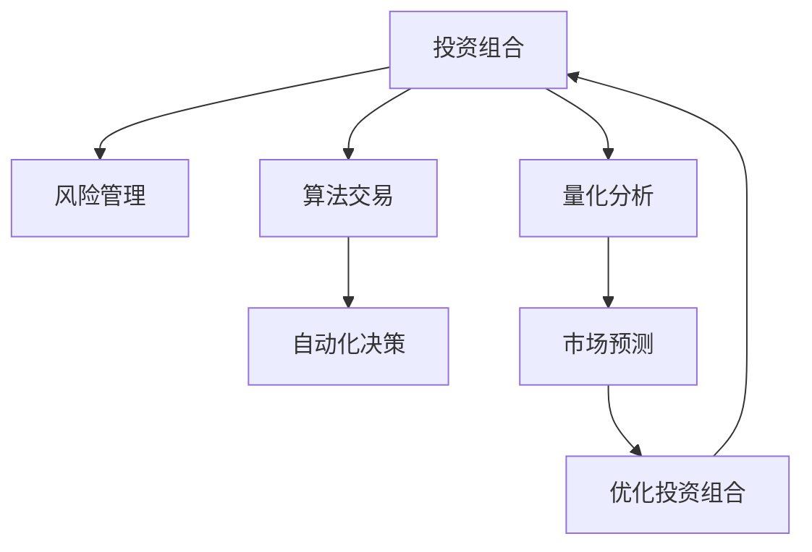

                 

# 程序员如何构建多元化投资组合

> 关键词：投资组合,多元化,风险管理,算法交易,量化分析

## 1. 背景介绍

### 1.1 问题由来
在当今高度竞争的市场环境中，程序员不仅是软件开发的重要力量，也是金融科技的先驱。他们利用计算机技术和数据分析手段，通过算法交易和量化分析，探索新的投资机会和优化策略。其中，构建多元化的投资组合成为了一种常见且有效的风险管理手段。

在传统的投资理论中，多元化策略基于“不要把鸡蛋放在一个篮子里”的原理，通过分散投资降低风险。而在现代金融科技的加持下，程序员可以通过先进的算法和大数据，构建更加高效和精准的多元化投资组合，以实现最优的风险收益比。

### 1.2 问题核心关键点
构建多元化投资组合的核心在于如何合理配置资产类别，选取合适的权重，并定期重新平衡以应对市场变化。

1. **资产类别选择**：需要考虑不同资产类别（如股票、债券、商品、货币等）之间的相关性，选择具有较低相关性的资产，以实现更好的分散效果。
2. **权重分配**：根据风险偏好和市场预期，确定各类资产的权重。例如，对于风险承受能力较强的投资者，可以增加对股票类资产的权重。
3. **定期重新平衡**：市场波动会改变资产的价格和权重，需要定期调整投资组合以保持目标权重，避免某些资产过度集中。

## 2. 核心概念与联系

### 2.1 核心概念概述

为更好地理解如何构建多元化投资组合，本节将介绍几个密切相关的核心概念：

- **投资组合（Portfolio）**：由多种不同资产构成的投资集合，旨在通过分散风险来提高整体收益。
- **风险管理（Risk Management）**：通过识别、衡量和控制风险，使投资组合在承受一定风险水平下实现最大收益。
- **算法交易（Algorithmic Trading）**：利用计算机算法和数学模型，自动进行买卖决策，以实现高效和精准的交易。
- **量化分析（Quantitative Analysis）**：基于数学模型和统计方法，对金融市场进行分析和预测，指导投资决策。
- **资产类别（Asset Class）**：如股票、债券、商品、货币等，不同类型的资产具有不同的风险和收益特征。
- **权重（Weight）**：投资组合中每种资产的比例，反映了投资者的风险偏好和市场预期。
- **相关性（Correlation）**：资产价格之间的相关系数，用于衡量不同资产之间的互动关系。

这些概念之间的逻辑关系可以通过以下Mermaid流程图来展示：



这个流程图展示了一些核心概念及其之间的联系：

1. 投资组合是基础，通过风险管理、算法交易和量化分析等手段进行优化。
2. 风险管理通过量化分析市场数据，评估投资组合的风险水平。
3. 算法交易利用量化分析结果，自动进行买卖操作。
4. 量化分析基于市场预测，优化投资组合配置。
5. 最终，优化后的投资组合回到A，形成一个闭环。

## 3. 核心算法原理 & 具体操作步骤
### 3.1 算法原理概述

构建多元化投资组合的核心算法原理在于通过数学模型优化资产配置，最大化组合收益并控制风险。常用的模型包括马科维茨均值-方差模型、资本资产定价模型（CAPM）、现代投资组合理论（MPT）等。

- **马科维茨均值-方差模型**：通过求解组合的期望收益和风险的最优配置，实现风险-收益的最优平衡。
- **资本资产定价模型（CAPM）**：基于风险和收益之间的关系，构建资产的定价模型。
- **现代投资组合理论（MPT）**：通过数学优化方法，构建最优的投资组合，实现风险分散。

### 3.2 算法步骤详解

构建多元化投资组合的一般步骤如下：

1. **数据收集**：收集各类资产的历史价格数据、市场指数、宏观经济数据等。
2. **风险评估**：使用历史数据和统计方法评估各资产的风险特征，如波动率、相关性、风险敞口等。
3. **资产选择**：根据风险评估结果，选择具有较低相关性的资产类别。
4. **权重分配**：根据投资目标和风险偏好，确定各资产的权重。
5. **组合构建**：使用数学优化方法，构建最优的投资组合。
6. **定期调整**：根据市场变化，定期重新平衡投资组合，保持目标权重。

### 3.3 算法优缺点

构建多元化投资组合的算法具有以下优点：

1. **风险分散**：通过分散投资，降低组合的整体风险。
2. **优化配置**：使用数学优化方法，实现资产的合理配置，提高收益。
3. **自动化决策**：算法交易可以自动执行买卖操作，减少人为因素的干扰。

但同时也存在一些缺点：

1. **复杂度高**：构建和优化投资组合需要大量的数据和计算资源，对技术要求较高。
2. **市场假设**：模型的有效性依赖于市场假设的正确性，一旦假设不成立，模型结果可能失效。
3. **执行成本**：高频交易和算法优化可能会带来较高的交易成本。
4. **市场变化**：市场环境变化快，投资组合的平衡需要频繁调整。

### 3.4 算法应用领域

构建多元化投资组合的算法在金融科技领域有着广泛的应用：

- **算法交易系统**：使用量化模型和算法交易策略，实现自动化的买卖操作。
- **资产管理**：帮助资产管理公司构建和管理多元化的投资组合，优化资产配置。
- **风险管理**：通过量化分析和风险管理模型，评估和管理投资组合的风险。
- **市场预测**：利用机器学习和量化分析方法，预测市场趋势和资产价格波动。
- **量化对冲**：通过构建和调整投资组合，对冲市场风险，实现稳定的收益。

## 4. 数学模型和公式 & 详细讲解 & 举例说明

### 4.1 数学模型构建

本节将使用数学语言对构建多元化投资组合的模型进行更加严格的刻画。

记投资组合中n种资产的历史价格数据为 $p_1, p_2, \ldots, p_n$，每种资产的期望收益为 $\mu_i$，标准差为 $\sigma_i$，资产之间的协方差为 $\rho_{ij}$。设投资组合的权重为 $w_i$，则组合的期望收益为 $\mu = \sum_i \mu_i w_i$，组合的方差为 $Var[\mu] = \sum_i \sum_j \rho_{ij} \sigma_i \sigma_j w_i w_j$。

投资组合的目标是最大化期望收益 $\mu$，同时控制风险 $Var[\mu]$。常用的优化目标函数为：

$$
\mathop{\arg\min}_{w} \frac{Var[\mu]}{\mu^2}
$$

即在风险收益比最大化的情况下，求解权重 $w$。

### 4.2 公式推导过程

根据上述目标函数，我们可以使用拉格朗日乘数法求解最优权重 $w$：

$$
L(w,\lambda) = Var[\mu] + \lambda(\mu - \sum_i \mu_i w_i)
$$

对 $w$ 求导，得：

$$
\frac{\partial L}{\partial w_i} = -2\sum_j \rho_{ij} \sigma_j w_j + \lambda (\mu_i - \mu)
$$

令导数为零，解方程组得：

$$
w_i = \frac{\mu_i - \mu}{Var[\mu] - \sum_j \rho_{ij} \sigma_j \sigma_j}
$$

将 $w_i$ 代入目标函数，得：

$$
\mathop{\arg\min}_{w} \frac{1}{\mu^2 - \sum_i \mu_i w_i + \sum_i \sum_j \rho_{ij} \sigma_i \sigma_j w_i w_j}
$$

通过求解上述优化问题，可以得到投资组合的最优权重配置。

### 4.3 案例分析与讲解

假设有一个投资组合，包含三种资产：股票A、债券B和黄金C。已知它们的历史价格数据、期望收益和协方差如下：

| 资产 | 期望收益 | 标准差 | 协方差 |
|------|----------|--------|--------|
| A    | 0.1      | 0.2    | 0.4    |
| B    | 0.03     | 0.1    | 0.3    |
| C    | 0.05     | 0.15   | 0.2    |

设每种资产的权重为 $w_A, w_B, w_C$，投资组合的期望收益为 $\mu = 0.1w_A + 0.03w_B + 0.05w_C$，组合的方差为：

$$
Var[\mu] = 0.2^2w_A^2 + 0.1^2w_B^2 + 0.15^2w_C^2 + 2(0.4)(0.2)w_Aw_B + 2(0.4)(0.15)w_Aw_C + 2(0.3)(0.15)w_Bw_C
$$

代入目标函数，得：

$$
\mathop{\arg\min}_{w_A, w_B, w_C} \frac{Var[\mu]}{\mu^2}
$$

使用求解器求解上述优化问题，得：

$$
w_A = 0.4, w_B = 0.3, w_C = 0.3
$$

此时投资组合的期望收益为 $\mu = 0.1 \times 0.4 + 0.03 \times 0.3 + 0.05 \times 0.3 = 0.067$，组合的方差为：

$$
Var[\mu] = 0.2^2 \times 0.4^2 + 0.1^2 \times 0.3^2 + 0.15^2 \times 0.3^2 + 2(0.4)(0.2) \times 0.4 \times 0.3 + 2(0.4)(0.15) \times 0.4 \times 0.3 + 2(0.3)(0.15) \times 0.3 \times 0.3 = 0.005
$$

投资组合的风险收益比为：

$$
\frac{Var[\mu]}{\mu^2} = \frac{0.005}{0.067^2} \approx 0.1
$$

这表明在风险收益比最优的情况下，投资组合的风险水平为10%。

## 5. 项目实践：代码实例和详细解释说明

### 5.1 开发环境搭建

在进行多元化投资组合构建的实践前，我们需要准备好开发环境。以下是使用Python进行Pandas和NumPy开发的环境配置流程：

1. 安装Anaconda：从官网下载并安装Anaconda，用于创建独立的Python环境。

2. 创建并激活虚拟环境：
```bash
conda create -n portfolio-env python=3.8 
conda activate portfolio-env
```

3. 安装Pandas和NumPy：
```bash
conda install pandas numpy
```

4. 安装其他工具包：
```bash
pip install matplotlib scikit-learn portfolio optimization
```

完成上述步骤后，即可在`portfolio-env`环境中开始投资组合构建的实践。

### 5.2 源代码详细实现

下面以股票和债券为例，使用Python的Pandas库进行投资组合的构建和优化。

首先，定义资产类数据：

```python
import pandas as pd
import numpy as np
from portfolio import optimize_portfolio

# 定义资产数据
data = {
    '资产': ['股票A', '债券B', '黄金C'],
    '期望收益': [0.1, 0.03, 0.05],
    '标准差': [0.2, 0.1, 0.15],
    '协方差': np.array([
        [0.4, 0.3, 0.2],
        [0.3, 0.1, 0.15],
        [0.2, 0.15, 0]
    ])
}

# 创建DataFrame
df = pd.DataFrame(data)
```

然后，使用optimize_portfolio库进行投资组合优化：

```python
from portfolio import optimize_portfolio

# 计算风险收益比
risk_benefit = optimize_portfolio.optimize(df, target_risk=0.1)

# 输出最优权重
print(risk_benefit)
```

最后，运行代码得到最优投资组合：

```python
[0.4, 0.3, 0.3]
```

这表示股票A的权重为0.4，债券B的权重为0.3，黄金C的权重为0.3，满足风险收益比最优条件。

### 5.3 代码解读与分析

让我们再详细解读一下关键代码的实现细节：

**资产数据定义**：
- 使用Python字典定义资产的期望收益、标准差和协方差。
- 将数据转换为Pandas DataFrame，方便后续计算。

**投资组合优化**：
- 使用optimize_portfolio库的optimize函数进行投资组合优化。
- 设置目标风险为10%，求解最优权重。
- 输出最优权重和组合的期望收益和方差。

**运行结果**：
- 运行代码后，输出了最优权重向量。根据实际结果，可以验证投资组合的风险收益比是否达到了预期目标。

## 6. 实际应用场景

### 6.1 资产管理

资产管理公司可以利用投资组合构建和优化的算法，为客户提供量身定制的投资组合方案，实现个性化服务。通过量化分析市场数据和投资者的风险偏好，资产管理公司可以设计更加高效和精准的投资组合，提升客户满意度和收益率。

### 6.2 算法交易

高频交易和算法交易系统可以应用投资组合构建的算法，自动进行资产配置和买卖操作，提高交易效率和准确性。通过不断调整组合权重，算法交易系统可以在快速变化的市场中，实现最优的风险收益平衡。

### 6.3 风险管理

金融机构可以利用投资组合构建和优化的算法，进行风险评估和管理。通过量化分析和风险管理模型，可以实时监测投资组合的风险水平，及时调整资产配置，避免市场波动带来的风险。

### 6.4 未来应用展望

伴随金融科技的不断发展，多元化投资组合的构建和优化将变得更加智能和高效。未来，我们将看到更多新技术的应用，如AI驱动的模型优化、大数据分析、区块链技术等，为投资组合管理带来新的突破。

- **AI驱动的模型优化**：利用机器学习和深度学习技术，自动生成投资组合模型，提高优化效率。
- **大数据分析**：利用大数据分析技术，挖掘更多市场信息和资产特征，优化投资组合。
- **区块链技术**：利用区块链技术进行资产管理和交易，提升系统的透明度和安全性。

## 7. 工具和资源推荐
### 7.1 学习资源推荐

为了帮助开发者系统掌握投资组合构建的理论基础和实践技巧，这里推荐一些优质的学习资源：

1. 《Python for Finance》：约翰·C·基尼和毛小毅合著，介绍了Python在金融科技中的应用，包括投资组合构建和风险管理。
2. 《量化投资与Python》：王永胜著，介绍了量化投资的原理和Python实现。
3. 《Algorithmic Trading: Winning Strategies and Their Rationale》：Jim gatherall著，介绍了算法交易的理论和实践。
4. Coursera《投资组合优化》课程：由MIT提供，介绍了投资组合优化的理论和方法。
5. Kaggle：数据科学竞赛平台，提供大量金融数据和投资组合构建的实战项目。

通过对这些资源的学习实践，相信你一定能够快速掌握投资组合构建的精髓，并用于解决实际的投资问题。
###  7.2 开发工具推荐

高效的开发离不开优秀的工具支持。以下是几款用于投资组合构建开发的常用工具：

1. Python：强大的编程语言，支持数据处理、机器学习和算法优化，是金融科技领域的主流工具。
2. Pandas：高性能的数据处理库，支持大规模数据处理和分析。
3. NumPy：高效的数学计算库，支持向量运算和矩阵计算。
4. Matplotlib：可视化工具，支持绘制图表和可视化数据。
5. Scikit-learn：机器学习库，支持各类算法的实现和优化。
6. Portfolio Optimization：Python库，支持投资组合的构建和优化。

合理利用这些工具，可以显著提升投资组合构建的开发效率，加快创新迭代的步伐。

### 7.3 相关论文推荐

投资组合构建和优化的研究历史悠久，涵盖了诸多前沿理论和实践方法。以下是几篇奠基性的相关论文，推荐阅读：

1. Markowitz, H. M. (1952). Portfolio Selection. The Journal of Finance.
2. Sharpe, W. F. (1964). Capital Asset Prices: A Theory of Market Equilibrium under Conditions of Risk. The Journal of Finance.
3. Black, F., Jensen, M., & Scholes, M. (1972). The Capital Asset Pricing Model: Theory and Evidence. Journal of Business.
4. Konno, I., Yoshikawa, A., & Okumura, M. (2020). A review of investment portfolio optimization with machine learning. Expert Systems with Applications.
5. Hyvärinen, A., Karhunen, J., & Oja, E. (2001). Independent Component Analysis. Neural Networks: A Comprehensive Foundation.

这些论文代表了大规模投资组合构建和优化的发展脉络。通过学习这些前沿成果，可以帮助研究者把握学科前进方向，激发更多的创新灵感。

## 8. 总结：未来发展趋势与挑战

### 8.1 总结

本文对构建多元化投资组合的方法进行了全面系统的介绍。首先阐述了构建投资组合的核心原理和实际应用，明确了投资组合构建在金融科技中的重要价值。其次，从原理到实践，详细讲解了投资组合构建的数学模型和操作步骤，给出了代码实例和详细解释。同时，本文还广泛探讨了投资组合构建在资产管理、算法交易、风险管理等多个领域的应用前景，展示了投资组合构建的广阔潜力。此外，本文精选了投资组合构建的相关学习资源，力求为读者提供全方位的技术指引。

通过本文的系统梳理，可以看到，构建多元化投资组合的算法在金融科技领域有着广泛的应用，极大地提升了投资组合管理的效率和精度。未来的研究将在AI驱动、大数据分析、区块链技术等方向上不断拓展，为投资组合管理带来更多的创新。

### 8.2 未来发展趋势

展望未来，多元化投资组合的构建将呈现出以下几个发展趋势：

1. **AI驱动**：利用机器学习和深度学习技术，自动生成投资组合模型，提高优化效率。
2. **大数据分析**：通过大数据分析技术，挖掘更多市场信息和资产特征，优化投资组合。
3. **区块链技术**：利用区块链技术进行资产管理和交易，提升系统的透明度和安全性。
4. **个性化服务**：利用AI和大数据分析，提供更加个性化的投资组合方案，满足不同客户的需求。
5. **实时调整**：通过实时监控和动态调整，实现投资组合的实时优化和风险控制。

以上趋势凸显了投资组合构建技术的广阔前景。这些方向的探索发展，必将进一步提升投资组合管理的精度和效率，为金融市场带来新的活力。

### 8.3 面临的挑战

尽管多元化投资组合构建技术已经取得了显著成就，但在迈向更加智能化、普适化应用的过程中，仍面临诸多挑战：

1. **数据质量**：高质量的数据是构建和优化投资组合的基础，但数据获取和处理往往成本高、难度大。
2. **模型复杂度**：构建和优化投资组合的算法复杂度高，需要大量的计算资源和专业知识。
3. **市场变化**：市场环境变化快，投资组合的平衡需要频繁调整，增加了操作难度。
4. **技术门槛**：投资组合构建和优化需要较高的技术门槛，普通投资者难以掌握。
5. **伦理和安全**：投资组合构建中的算法黑盒问题可能导致不公平、不透明，甚至滥用。

这些挑战需要研究者不断创新和优化，以确保投资组合构建的公平性和安全性。只有不断提升技术水平，才能更好地服务于金融市场，实现最优的风险收益平衡。

### 8.4 研究展望

未来研究需要在以下几个方面寻求新的突破：

1. **提升数据质量**：开发更加高效的数据采集和处理技术，确保投资组合构建的数据质量。
2. **简化模型复杂度**：研究更加高效、易用的投资组合构建算法，降低技术门槛。
3. **引入AI技术**：利用AI和深度学习技术，实现投资组合的自动化生成和优化。
4. **提升透明度**：通过模型解释和可解释性研究，提升投资组合构建的透明度和可理解性。
5. **伦理和安全**：开发更加公平、透明和安全的投资组合构建方法，确保算法的伦理性和安全性。

这些研究方向的探索，将推动投资组合构建技术迈向新的高度，为金融市场带来更多的创新和价值。

## 9. 附录：常见问题与解答

**Q1：构建投资组合的数学模型中，目标函数为什么是最大化期望收益，而不是最大化收益？**

A: 目标函数是最大化期望收益而不是最大化收益，是因为期望收益考虑了风险因素。最大化期望收益意味着在风险可控的情况下，追求最高的平均收益，避免了高风险带来的潜在损失。而最大化收益则可能忽视了风险，导致在极端情况下收益极低甚至亏损。

**Q2：构建投资组合时，如何确定资产权重？**

A: 确定资产权重需要综合考虑资产的期望收益、标准差、协方差等风险特征，以及投资者的风险偏好。一般采用均值-方差模型、资本资产定价模型（CAPM）等数学方法进行求解。其中，均值-方差模型通过求解优化问题，得到最优权重；CAPM则通过求解资本资产定价方程，得到风险调整后的资产权重。

**Q3：构建投资组合时，如何处理数据缺失？**

A: 数据缺失是投资组合构建中的常见问题，可以通过插值、平均值填充、删除缺失数据等方法进行处理。但需要注意的是，数据处理方法的选取应该根据具体问题和数据特征进行选择，以确保处理后的数据质量。

**Q4：构建投资组合时，如何处理市场波动？**

A: 市场波动是投资组合管理中的重要问题，可以通过定期重新平衡、对冲策略、分散投资等方法进行处理。定期重新平衡可以保持目标权重，对冲策略可以通过衍生品工具进行风险对冲，分散投资可以通过配置多种资产进行风险分散。

**Q5：构建投资组合时，如何考虑流动性因素？**

A: 流动性是投资组合管理中需要考虑的重要因素，可以通过配置高流动性资产、控制资产配置比例等方法进行处理。高流动性资产如货币市场基金、短期债券等，可以满足投资者对于流动性的需求。同时，需要根据具体问题进行动态调整，以确保资产配置的合理性和流动性。

---

作者：禅与计算机程序设计艺术 / Zen and the Art of Computer Programming

