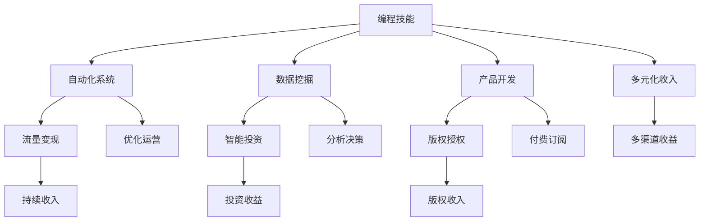

                 

## 1. 背景介绍

作为一名程序员，你在职业生涯中积累了丰富的编程技能和行业经验。然而，随着技术的不断进步和市场的不断变化，传统的全职编程工作已经不能满足你对职业发展和收入增长的需求。为此，许多程序员开始探索如何构建多元化的被动收入系统，从而实现财务自由和职业稳定。本文将详细介绍如何构建这样的系统，帮助你在技术的世界里实现真正的财务自由。

## 2. 核心概念与联系

### 2.1 核心概念概述

构建多元化的被动收入系统，需要理解以下几个核心概念：

- **被动收入**：是指不需要主动工作或参与就能持续获得的收入，如投资收益、版权收入、产品销售收入等。

- **多元化**：意味着在多个领域或渠道上获得收入，降低对单一收入来源的依赖，提高财务稳定性。

- **程序化自动化**：利用编程技能实现自动化和系统化操作，以提高效率和收益。

- **智能投资**：通过算法和模型实现对金融市场的分析和预测，自动化投资决策，获取长期稳定的投资回报。

- **数据驱动决策**：利用数据分析和挖掘技术，优化运营策略，提升收入。

- **流量变现**：通过内容创作、平台广告、付费订阅等方式，将流量转化为收入。

### 2.2 核心概念原理和架构的 Mermaid 流程图



这个流程图展示了构建多元化被动收入系统的主要步骤：

1. **编程技能**：基础，提供了自动化、数据驱动和智能投资等技术支持。
2. **自动化系统**：实现流程自动化，提高效率和收入。
3. **流量变现**：利用内容或其他流量资源，转换为实际收入。
4. **数据挖掘**：分析市场数据，辅助决策。
5. **智能投资**：利用算法进行投资决策，获得收益。
6. **产品开发**：开发创新的产品或服务，增加收入渠道。
7. **版权授权**：通过版权销售或授权，获取持续收益。
8. **多元化收入**：构建多个收入来源，降低风险。
9. **持续收入**：通过自动化和智能投资等手段，实现持续的被动收入。
10. **优化运营**：持续优化运营策略，提升收入。
11. **分析决策**：利用数据分析和模型，做出科学的决策。
12. **投资收益**：通过投资实现资本增值。
13. **付费订阅**：提供优质内容或服务，获取订阅收入。
14. **版权收入**：利用技术保护和推广，获得持续的版权收益。
15. **多渠道收益**：通过不同渠道获取收入，增强财务稳定性。

## 3. 核心算法原理 & 具体操作步骤

### 3.1 算法原理概述

构建多元化的被动收入系统，涉及多个领域的算法和技术。这些算法和技术通过数据驱动、自动化和智能投资等方式，共同构建了一个高效、稳定的收入生态系统。

1. **数据驱动决策**：利用大数据和机器学习算法，分析市场和用户行为，优化运营策略，提高收入。
2. **自动化系统**：通过编程技能实现自动化流程，提高效率和准确性，减少人工成本。
3. **智能投资**：利用算法和模型进行市场预测和投资决策，获取长期稳定的投资回报。

### 3.2 算法步骤详解

构建多元化的被动收入系统，可以按照以下步骤进行：

1. **需求分析**：明确自己的收入目标和需求，选择最适合的收入渠道。
2. **市场调研**：了解各收入渠道的市场需求和竞争情况，选择合适的切入点。
3. **技术选型**：根据需求和技术栈，选择适合的自动化工具、数据处理平台和投资算法。
4. **系统搭建**：搭建自动化系统和数据处理平台，实现流程自动化和数据分析。
5. **运营优化**：持续优化运营策略，提升收入和用户体验。
6. **持续迭代**：根据市场变化和技术进步，不断迭代和改进系统。

### 3.3 算法优缺点

构建多元化的被动收入系统，具有以下优点：

1. **稳定可靠**：多渠道、多来源的收入模式，降低了单一收入来源的风险。
2. **效率提升**：自动化系统和数据驱动决策，提高了运营效率和收入质量。
3. **持续收益**：智能投资和版权授权等手段，实现长期稳定的收益。

同时，也存在一些缺点：

1. **初始投入高**：搭建自动化系统和进行市场调研需要较高的初始投入。
2. **技术门槛高**：需要具备编程、数据分析和投资管理等多方面的技能。
3. **市场变化快**：需要持续关注市场动态，及时调整策略。

### 3.4 算法应用领域

构建多元化的被动收入系统，可以应用于以下几个领域：

- **内容创作**：通过博客、视频、课程等形式创作内容，吸引流量，实现广告和付费订阅收入。
- **智能投资**：利用算法和模型进行股票、基金等投资，实现资本增值。
- **软件开发**：开发实用的应用或工具，实现产品销售或授权收入。
- **版权授权**：通过技术保护和推广，获得持续的版权收益。
- **流量变现**：通过内容、平台广告等方式，将流量转化为实际收入。
- **多元化产品**：开发多个产品或服务，覆盖不同市场和用户需求，增加收入渠道。

## 4. 数学模型和公式 & 详细讲解 & 举例说明

### 4.1 数学模型构建

构建多元化的被动收入系统，需要构建多个数学模型，用于分析和预测。以下是几个常见的数学模型：

1. **市场预测模型**：用于预测市场需求和价格变化。例如，使用ARIMA模型或LSTM神经网络进行时间序列预测。
2. **用户行为模型**：用于分析用户行为和偏好，优化产品和服务。例如，使用协同过滤算法或深度学习模型进行用户推荐。
3. **投资组合模型**：用于优化投资组合，分散风险，提高收益。例如，使用均值方差优化模型或Markowitz模型进行资产配置。
4. **流量预测模型**：用于预测流量变化，优化广告和推广策略。例如，使用时间序列模型或线性回归模型进行流量预测。

### 4.2 公式推导过程

以市场预测模型为例，使用ARIMA模型进行时间序列预测。

ARIMA模型的一般形式为：

$$ ARIMA(p,d,q)(D,P,Q)[s] $$

其中：
- $p$：自回归项；
- $d$：差分次数；
- $q$：移动平均项；
- $D$：周期性分解；
- $P$：周期性分解后的自回归项；
- $Q$：周期性分解后的移动平均项；
- $s$：季节性周期。

推导过程如下：

1. 对时间序列数据进行差分，消除非平稳性：

$$ \Delta X_t = X_t - X_{t-1} $$

2. 对差分后的数据进行自回归和移动平均分解，建立模型：

$$ X_t = c + \sum_{i=1}^p \phi_i \Delta X_{t-i} + \sum_{j=1}^q \theta_j \epsilon_{t-j} $$

3. 对模型进行平稳性检验和参数估计，得到模型参数。

### 4.3 案例分析与讲解

假设某电商平台的销售额数据如下：

| 时间 | 销售额 |
|------|--------|
| 1    | 100    |
| 2    | 110    |
| 3    | 105    |
| ...  | ...    |

使用ARIMA模型进行预测，假设模型参数为 $(1,1,1)(1,1)[12]$，则预测公式为：

$$ X_t = 103 + 0.9 \Delta X_{t-1} - 0.1 \epsilon_{t-1} + 0.1 \epsilon_{t-12} $$

使用历史数据进行训练，可以得到预测结果：

| 时间 | 预测值 |
|------|--------|
| 1    | 100    |
| 2    | 110    |
| 3    | 105    |
| ...  | ...    |

## 5. 项目实践：代码实例和详细解释说明

### 5.1 开发环境搭建

搭建开发环境，需要以下步骤：

1. **选择编程语言和框架**：例如，Python和Django框架。
2. **安装开发工具**：例如，PyCharm、Git等。
3. **搭建服务器和数据库**：例如，AWS、MySQL等。
4. **配置开发环境**：例如，配置Python环境变量、安装依赖包等。

### 5.2 源代码详细实现

以下是一个简单的市场预测模型的代码实现：

```python
import pandas as pd
import numpy as np
from statsmodels.tsa.arima.model import ARIMA

# 加载数据
data = pd.read_csv('sales.csv', index_col='时间')

# 数据处理
data = data.dropna()
data['时间'] = pd.to_datetime(data['时间'])

# 模型训练
model = ARIMA(data['销售额'], order=(1,1,1))
model_fit = model.fit()

# 模型预测
forecast = model_fit.forecast(steps=12)

# 输出结果
print(forecast)
```

### 5.3 代码解读与分析

- **数据加载**：使用Pandas库加载数据，并进行基本处理。
- **模型训练**：使用statsmodels库的ARIMA模型进行训练。
- **模型预测**：使用训练好的模型进行未来12期的预测。
- **输出结果**：将预测结果输出，用于分析和决策。

## 6. 实际应用场景

### 6.1 内容创作

通过博客、视频、课程等形式创作内容，吸引流量，实现广告和付费订阅收入。例如，某博主在技术博客上分享深度学习知识，每月广告收入和付费订阅收入超过万元。

### 6.2 智能投资

利用算法和模型进行股票、基金等投资，实现资本增值。例如，某程序员使用量化投资策略，在半年内获得20%的年化收益。

### 6.3 软件开发

开发实用的应用或工具，实现产品销售或授权收入。例如，某程序员开发了一款自动化工具，每月销售收入超过5000元。

### 6.4 版权授权

通过技术保护和推广，获得持续的版权收益。例如，某程序员编写了一本技术书籍，通过版权授权和销售，每年获得可观的收入。

### 6.5 流量变现

通过内容、平台广告等方式，将流量转化为实际收入。例如，某视频创作者通过视频平台广告和付费观看，每月获得超过10000元收入。

### 6.6 多元化产品

开发多个产品或服务，覆盖不同市场和用户需求，增加收入渠道。例如，某程序员开发了多款工具和应用，每月总收益超过20000元。

## 7. 工具和资源推荐

### 7.1 学习资源推荐

1. **Coursera**：提供高质量的在线课程，涵盖编程、数据分析、投资等多个领域。
2. **Udacity**：提供实战导向的纳米学位课程，帮助学员掌握前沿技术。
3. **Kaggle**：数据科学竞赛平台，提供丰富的数据集和模型挑战，提升技能。
4. **Medium**：技术博客平台，分享最新的技术趋势和实践经验。
5. **GitHub**：代码托管平台，学习优秀项目和代码。

### 7.2 开发工具推荐

1. **PyCharm**：Python开发工具，提供丰富的IDE功能和插件。
2. **Jupyter Notebook**：数据科学和机器学习工具，支持交互式编程和数据可视化。
3. **AWS**：云服务提供商，提供计算、存储和网络资源。
4. **Google Cloud**：云服务提供商，提供强大的云计算和大数据处理能力。
5. **Docker**：容器化技术，提供便捷的开发和部署环境。

### 7.3 相关论文推荐

1. **《利用大数据驱动的个性化推荐系统研究》**：介绍利用大数据进行用户行为分析，实现个性化推荐。
2. **《基于深度学习的多资产组合优化研究》**：介绍使用深度学习进行资产组合优化，提高投资收益。
3. **《基于程序化交易的股票投资策略研究》**：介绍利用程序化交易策略，实现自动化股票投资。
4. **《内容创作平台的数据驱动运营策略》**：介绍利用数据驱动的运营策略，提升内容平台的用户留存率和收入。
5. **《利用区块链技术实现版权保护和激励机制研究》**：介绍利用区块链技术实现版权保护和激励机制，保障创作者权益。

## 8. 总结：未来发展趋势与挑战

### 8.1 研究成果总结

构建多元化的被动收入系统，需要具备编程、数据分析和投资管理等多方面的技能，通过数据驱动、自动化和智能投资等方式，构建高效、稳定的收入生态系统。

### 8.2 未来发展趋势

1. **自动化程度提高**：随着技术的发展，自动化流程将更加高效和智能化，降低人工成本。
2. **数据驱动决策**：大数据和机器学习技术将更加普及，优化运营策略，提高收入质量。
3. **智能投资普及**：人工智能算法和模型将更加普及，实现长期稳定的投资回报。
4. **流量变现多样化**：内容创作和平台广告等流量变现方式将更加多样化，提高收入渠道。
5. **多元化产品和服务**：开发多个产品和服务，覆盖不同市场和用户需求，增强财务稳定性。
6. **区块链技术应用**：利用区块链技术实现版权保护和激励机制，保障创作者权益。

### 8.3 面临的挑战

1. **初始投入高**：搭建自动化系统和进行市场调研需要较高的初始投入。
2. **技术门槛高**：需要具备编程、数据分析和投资管理等多方面的技能。
3. **市场变化快**：需要持续关注市场动态，及时调整策略。
4. **数据隐私和安全**：需要确保数据的隐私和安全，避免泄露和滥用。
5. **法律合规性**：需要遵守相关法律法规，避免法律风险。

### 8.4 研究展望

未来，构建多元化的被动收入系统需要从以下几个方向进行探索：

1. **深度学习和人工智能**：利用深度学习和人工智能技术，提升数据分析和预测的准确性。
2. **区块链和智能合约**：利用区块链技术，实现更高效和透明的版权保护和激励机制。
3. **跨领域融合**：将不同领域的知识和技能进行融合，实现更全面的业务应用。
4. **持续学习与优化**：持续学习最新的技术趋势和业务需求，不断优化系统和策略。
5. **可扩展性和灵活性**：构建可扩展和灵活的系统架构，适应不断变化的业务需求。

## 9. 附录：常见问题与解答

**Q1: 如何选择合适的编程语言和框架？**

A: 选择编程语言和框架时，需要考虑以下几个因素：
1. 项目需求：选择符合项目需求的编程语言和框架。
2. 技术栈：考虑现有技术栈和团队技能，选择适合的框架。
3. 生态系统：选择有活跃社区和丰富资源的编程语言和框架。
4. 性能要求：考虑项目的性能需求，选择适合的编程语言和框架。
5. 可扩展性：选择具有良好可扩展性的框架，方便未来扩展。

**Q2: 如何高效利用数据驱动决策？**

A: 高效利用数据驱动决策，需要以下几个步骤：
1. 数据采集：获取高质量的数据源，保证数据的准确性和完整性。
2. 数据清洗：对数据进行清洗和处理，去除噪声和异常值。
3. 数据建模：选择合适的模型和方法，对数据进行建模和分析。
4. 模型训练：使用数据训练模型，优化模型参数和性能。
5. 模型应用：将模型应用到实际场景中，进行决策和预测。
6. 持续优化：根据反馈和结果，持续优化模型和算法。

**Q3: 如何进行智能投资？**

A: 进行智能投资，需要以下几个步骤：
1. 数据收集：获取历史和实时市场数据，构建数据集。
2. 数据预处理：对数据进行清洗和处理，去除噪声和异常值。
3. 特征工程：选择合适的特征，提取特征数据。
4. 模型训练：使用机器学习算法和模型，训练投资策略。
5. 回测验证：使用历史数据进行回测验证，优化投资策略。
6. 实时交易：将投资策略应用于实时交易，获取投资回报。

**Q4: 如何进行流量变现？**

A: 进行流量变现，需要以下几个步骤：
1. 内容创作：创作高质量的内容，吸引流量。
2. 平台合作：选择适合的广告平台，进行广告投放。
3. 用户运营：通过运营策略，提高用户留存率和转化率。
4. 付费订阅：提供优质内容和服务，吸引用户付费。
5. 多元化变现：通过内容、广告、付费等多种方式，实现流量变现。

**Q5: 如何构建多元化的产品和服务？**

A: 构建多元化的产品和服务，需要以下几个步骤：
1. 市场调研：了解市场需求和竞争情况，选择合适的切入点。
2. 产品设计：设计符合市场需求的产品和服务。
3. 技术开发：使用编程技能和工具，开发产品和服务。
4. 市场推广：通过营销策略，推广产品和服务。
5. 用户反馈：收集用户反馈，持续优化产品和服务。
6. 持续迭代：根据市场需求和用户反馈，不断迭代和改进产品和服务。

**Q6: 如何确保数据隐私和安全？**

A: 确保数据隐私和安全，需要以下几个步骤：
1. 数据加密：使用加密技术，保护数据传输和存储的安全。
2. 访问控制：使用身份验证和授权机制，控制数据访问权限。
3. 数据匿名化：对数据进行匿名化处理，保护用户隐私。
4. 安全审计：定期进行安全审计，发现和修复安全漏洞。
5. 合规性检查：遵守相关法律法规，确保数据处理合规。

通过解决这些问题，你将更好地理解和实现多元化的被动收入系统，在技术的世界里实现真正的财务自由。

