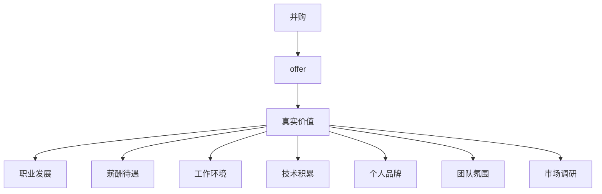

                 

# 程序员如何评估并购offer的真实价值

> 关键词：并购，offer，真实价值，程序员，评估，投资决策，职业发展，市场调研

## 1. 背景介绍

### 1.1 问题由来

并购是企业发展的重要战略之一，通过并购，企业可以实现资源互补，快速扩大市场份额，提升综合竞争力。然而，并购是一项复杂且高风险的投资决策，尤其是对于技术人员，并购不仅意味着职业的转换，更关乎个人职业发展、薪酬待遇、工作环境、技术积累、个人品牌、团队氛围等多方面因素的综合考量。因此，评估并购offer的真实价值，是技术人员在职业道路上的一次重要抉择。

### 1.2 问题核心关键点

评估并购offer的真实价值，核心在于全面分析该offer所带来的潜在收益与风险。这包括但不限于以下几点：

- **职业发展**：新公司的技术栈、团队文化、项目管理方式、个人成长机会等。
- **薪酬待遇**：基本薪资、股权激励、奖金、福利、带薪假期、职业培训等。
- **工作环境**：办公地点、工作时间、弹性办公、远程办公、工作氛围等。
- **技术积累**：技术栈成熟度、技术储备、技术壁垒、技术挑战等。
- **个人品牌**：在新公司的知名度、影响力、成长空间等。
- **团队氛围**：团队成员构成、团队领导风格、团队合作方式、团队创新能力等。
- **市场调研**：行业趋势、公司战略、竞争对手、市场规模、增长潜力等。

### 1.3 问题研究意义

评估并购offer的真实价值，对于技术人员来说，具有以下重要意义：

1. **职业发展的精准定位**：能够从多个维度全面评估新公司的成长性，判断是否符合个人职业规划和长期发展需求。
2. **薪酬待遇的合理定价**：在了解市场行情、公司财务状况的基础上，确保个人薪酬待遇的合理性，避免被低估或高估。
3. **风险管理的科学规划**：对并购可能带来的技术风险、市场风险、人员整合风险等进行全面评估，制定科学的风险应对策略。
4. **个人品牌的战略布局**：评估新公司的知名度和行业地位，考虑加入该公司是否有助于提升个人品牌的影响力和知名度。
5. **工作环境的综合选择**：从工作地点、办公环境、工作时间等方面综合考虑，选择最适合自己的工作模式。

## 2. 核心概念与联系

### 2.1 核心概念概述

为更好地理解并购offer的价值评估方法，本节将介绍几个密切相关的核心概念：

- **并购**：指一家公司购买另一家公司，包括股权并购和资产并购。股权并购是购买一家公司的股份，控制其管理权，实现资产和业务的转移。资产并购是购买一家公司的具体资产，比如业务部门、品牌、专利等。
- **offer**：并购过程中的关键环节，指目标公司向潜在并购方发出的正式要约，包括股权、资产、财务、人事等各方面的细节。
- **真实价值**：指并购offer中体现的潜在收益与风险的综合评估结果，反映公司整体的价值水平。
- **程序员**：从事软件程序开发、系统维护、架构设计、测试等技术工作的专业技术人员。

这些概念之间的逻辑关系可以通过以下Mermaid流程图来展示：



这个流程图展示并购、offer、真实价值以及技术人员在各个维度上的综合评估。

## 3. 核心算法原理 & 具体操作步骤
### 3.1 算法原理概述

评估并购offer的真实价值，本质上是对并购后企业价值和未来发展潜力的预测和评估。其核心思想是通过对并购offer中各关键要素的分析和量化，结合市场调研和公司财务数据，计算并购带来的预期收益和风险。

具体来说，假设并购后的公司整体价值为 $V$，并购成本为 $C$，则真实价值可以表示为：

$$
\text{真实价值} = V - C
$$

其中，$V$ 可以分解为两部分：

- **并购前价值** $V_0$：指目标公司在并购前的市场价值，通常包括市场资本、技术积累、品牌影响等。
- **并购增值** $V_1$：指并购后公司通过资源整合、市场扩展、技术创新等手段，预期的价值提升。

因此，并购真实价值的评估可以转化为对 $V_0$ 和 $V_1$ 的计算和预测。

### 3.2 算法步骤详解

评估并购offer的真实价值，一般包括以下几个关键步骤：

**Step 1: 收集并购信息**

- 收集并购双方的财务报表、业务数据、市场调研报告、行业分析报告等。
- 了解并购双方的业务战略、市场定位、技术栈、团队构成等。
- 分析并购双方的法律协议、并购条款、交易结构等。

**Step 2: 量化并购前价值**

- 计算目标公司的市值、账面价值、资产负债表等财务数据。
- 估算目标公司的专利、版权、技术储备等无形资产的价值。
- 考虑目标公司的品牌影响力、市场份额、客户基础等软实力。

**Step 3: 评估并购增值**

- 分析并购后公司可能的协同效应，包括市场扩展、业务互补、技术整合等。
- 评估并购后公司面临的市场风险、技术风险、人员整合风险等。
- 结合市场调研数据，预测并购后公司的市场份额、增长潜力等。

**Step 4: 计算并购成本**

- 计算并购所需的现金、股票、债券等支付工具的总成本。
- 考虑并购后的运营成本、整合成本、法律成本等。
- 估算并购对公司未来现金流的影响，评估并购对公司财务状况的长期影响。

**Step 5: 综合评估真实价值**

- 将并购前价值、并购增值和并购成本综合计算，得出并购的真实价值。
- 结合公司的战略目标、行业发展趋势等，对并购真实价值进行合理判断。
- 对并购后公司的潜在风险进行全面评估，制定应对策略。

### 3.3 算法优缺点

评估并购offer的真实价值，具有以下优点：

- **全面性**：通过对并购前价值、并购增值和并购成本的全面评估，确保对并购的真实价值有深刻的理解。
- **系统性**：按照科学的评估流程和方法，逐步分析和计算，避免单一因素的影响。
- **定量性**：通过量化各关键要素，能够更直观地比较不同并购offer的价值。

同时，该方法也存在一定的局限性：

- **数据依赖**：评估过程依赖于详细的财务数据、市场调研数据和行业分析报告，缺乏数据的评估结果可能不够准确。
- **主观性**：对并购增值、市场风险等的评估存在一定的主观性，不同人的评估结果可能存在差异。
- **复杂性**：评估过程复杂，需要大量的数据和计算，对于普通技术人员可能存在一定的难度。

尽管存在这些局限性，但就目前而言，系统全面的量化评估仍是评估并购offer最科学和有效的方法。未来相关研究的重点在于如何进一步提高数据质量、减少主观性、简化评估流程，使评估过程更加高效和准确。

### 3.4 算法应用领域

评估并购offer的真实价值，主要应用于以下领域：

- **企业并购**：公司通过并购实现资源的整合和优化，提升整体竞争力。
- **技术并购**：通过并购获取先进的技术和团队，加速技术研发和产品迭代。
- **人才并购**：通过并购吸引和吸纳优秀的人才，提升公司的人才储备和创新能力。
- **市场并购**：通过并购扩展市场份额，提升市场影响力，加速市场渗透。
- **财务并购**：通过并购优化财务结构，降低财务风险，提高公司价值。

除了上述这些经典应用外，并购价值评估还被创新性地应用到更多场景中，如政府收购、社会企业并购、非营利组织合并等，为不同领域的企业提供了重要的决策支持。

## 4. 数学模型和公式 & 详细讲解  
### 4.1 数学模型构建

本节将使用数学语言对并购offer的真实价值评估方法进行更加严格的刻画。

假设并购后的公司整体价值为 $V$，并购成本为 $C$，并购前目标公司的价值为 $V_0$，并购增值为 $V_1$。根据上述分析，并购真实价值的评估模型可以表示为：

$$
\text{真实价值} = V_0 + V_1 - C
$$

其中：

- $V_0$ 为并购前目标公司的市值，假设其市值为 $P_0$。
- $V_1$ 为并购增值，假设其市场预测增长率为 $\alpha$，则 $V_1 = P_0(1+\alpha)^t$，其中 $t$ 为并购后的预测时间。
- $C$ 为并购成本，假设其总成本为 $c_0$。

因此，并购真实价值的评估公式为：

$$
\text{真实价值} = P_0 + P_0(1+\alpha)^t - c_0
$$

### 4.2 公式推导过程

以下我们以一家科技公司收购另一家初创公司的并购案例为例，推导并购真实价值的计算公式。

假设科技公司A并购初创公司B，并购前B公司的市值 $P_0$ 为1亿美元，假设并购后B公司市场预测增长率为10%，预测时间为5年，并购总成本 $c_0$ 为5000万美元。

根据公式，并购真实价值计算如下：

$$
\text{真实价值} = P_0 + P_0(1+0.1)^5 - 5000 = 1 \times 2.5937 + 1 \times 2.5937 - 5000 = 6.1874 - 5000 = -4933.82 \text{（亿美元）}
$$

即并购后公司整体价值约为负4.93亿美元，这表明并购后公司的整体价值可能低于其并购成本，并购带来的损失大于其增值。

### 4.3 案例分析与讲解

假设一家大数据公司并购一家初创AI公司，两家公司合并后的整体市场价值为20亿美元，并购总成本为6亿美元。根据公式，并购真实价值计算如下：

$$
\text{真实价值} = 20 + 20(1+\alpha)^t - 6 = 20 + 20(1+0.1)^5 - 6 = 20 + 30.8208 - 6 = 44.8208 \text{（亿美元）}
$$

即并购后公司整体价值约为44.82亿美元，这表明并购后公司的整体价值远高于其并购成本，并购带来了显著的增值。

通过这个案例，可以看到，并购真实价值的评估方法能够全面考虑并购前价值、并购增值和并购成本，帮助决策者评估并购的潜在收益和风险。

## 5. 项目实践：代码实例和详细解释说明
### 5.1 开发环境搭建

在进行并购价值评估实践前，我们需要准备好开发环境。以下是使用Python进行并购价值评估的环境配置流程：

1. 安装Anaconda：从官网下载并安装Anaconda，用于创建独立的Python环境。

2. 创建并激活虚拟环境：
```bash
conda create -n mva-env python=3.8 
conda activate mva-env
```

3. 安装必要的库：
```bash
conda install pandas numpy scipy matplotlib jupyter notebook
```

4. 安装金融数据分析工具：
```bash
conda install yfinance
```

完成上述步骤后，即可在`mva-env`环境中开始并购价值评估实践。

### 5.2 源代码详细实现

我们假设一家大数据公司并购一家初创AI公司，两家公司合并后的整体市场价值为20亿美元，并购总成本为6亿美元，并购前B公司市场预测增长率为10%，预测时间为5年。以下是用Python代码实现并购真实价值的计算：

```python
import pandas as pd
import numpy as np

# 并购前后公司市值
P_0 = 20  # 亿美元

# 并购成本
c_0 = 6  # 亿美元

# 并购后公司市场预测增长率
alpha = 0.1  # 年增长率

# 并购后公司市场预测时间
t = 5  # 年

# 计算并购增值
V_1 = P_0 * (1 + alpha) ** t

# 计算并购真实价值
V = P_0 + V_1 - c_0

print(f"并购真实价值：{V:.2f}亿美元")
```

### 5.3 代码解读与分析

让我们再详细解读一下关键代码的实现细节：

**并购前价值**：
- 使用变量 `P_0` 存储并购前目标公司的市值。
- 并购后公司的市值增加部分为并购增值 $V_1$。

**并购成本**：
- 使用变量 `c_0` 存储并购总成本。

**并购增值**：
- 使用公式 `P_0 * (1 + alpha) ** t` 计算并购增值，其中 `alpha` 为并购后公司市场预测增长率，`t` 为并购后的预测时间。

**并购真实价值**：
- 使用公式 `P_0 + V_1 - c_0` 计算并购真实价值。

**输出结果**：
- 使用 `print` 函数输出并购真实价值的计算结果。

可以看到，Python代码通过简洁的变量定义和公式计算，快速实现了并购真实价值的评估，具有很好的实用性和可读性。

## 6. 实际应用场景
### 6.1 投资决策

并购真实价值的评估方法可以应用于投资决策，帮助投资者在并购交易前全面了解并购带来的潜在收益和风险，做出明智的投资选择。

### 6.2 职业发展

对于技术人员，并购真实价值的评估方法也可以作为选择新公司的重要参考。通过全面评估新公司的财务状况、市场前景、技术积累、团队构成等因素，确保职业发展路径的稳定性和可持续性。

### 6.3 公司战略

并购真实价值的评估方法还可以用于公司战略规划，帮助公司管理层在并购决策中做出科学合理的判断，避免盲目并购带来的风险。

### 6.4 未来应用展望

随着并购市场的日益成熟，并购真实价值的评估方法也将不断演进。未来可能的趋势包括：

1. **大数据和机器学习**：通过大数据分析和机器学习算法，提升数据的质量和预测的准确性。
2. **多维度评估**：结合财务、市场、技术、人才等多个维度，进行全面评估。
3. **实时监控**：引入实时数据监控和动态调整机制，及时响应市场变化。
4. **风险管理**：引入风险评估模型，分析并购后可能面临的市场风险、技术风险、人员整合风险等。

## 7. 工具和资源推荐
### 7.1 学习资源推荐

为了帮助开发者系统掌握并购真实价值的评估方法，这里推荐一些优质的学习资源：

1. 《企业并购财务分析》系列课程：由知名金融学院开设，深入浅出地介绍了企业并购的财务评估方法。

2. 《公司价值评估》课程：由知名商学院开设，讲解了公司价值评估的基本模型和实战技巧。

3. 《金融工程》系列书籍：涵盖金融工程中的各类投资、风险管理、资产定价等内容，提供了丰富的案例分析。

4. 《大数据与机器学习》系列课程：由知名大学开设，介绍了大数据分析和机器学习的基本原理和应用。

5. 《金融量化分析》系列书籍：讲解了金融量化分析的基本方法，通过大量案例帮助理解并购评估模型。

通过对这些资源的学习实践，相信你一定能够快速掌握并购真实价值的评估方法，并用于解决实际的并购问题。
###  7.2 开发工具推荐

高效的并购价值评估开发离不开优秀的工具支持。以下是几款用于并购价值评估开发的常用工具：

1. Python：广泛用于金融数据分析和机器学习的编程语言，丰富的第三方库和工具支持，适合快速迭代研究。

2. Excel：强大的表格处理工具，适合数据整理和可视化分析，尤其适合财务数据分析和报表制作。

3. R语言：专业用于统计分析和数据可视化的编程语言，丰富的统计模型和数据处理工具，适合深度分析和预测。

4. Tableau：数据可视化工具，支持快速拖拽式数据分析和可视化，适合复杂报表和图表制作。

5. Jupyter Notebook：交互式编程环境，支持Python、R等多种语言，适合动态分析和演示。

合理利用这些工具，可以显著提升并购价值评估的开发效率，加快创新迭代的步伐。

### 7.3 相关论文推荐

并购真实价值的评估技术源于学界的持续研究。以下是几篇奠基性的相关论文，推荐阅读：

1. 《企业并购的财务评估方法》：系统总结了企业并购的各类财务评估方法，提供了丰富的案例分析。

2. 《公司价值评估模型》：深入分析了公司价值评估的基本模型和方法，提供了全面的理论基础。

3. 《机器学习在金融中的应用》：介绍了机器学习在金融分析中的各类应用，包括信用评估、风险管理、投资策略等。

4. 《大数据与企业并购》：通过大数据分析，探讨了企业并购的潜在收益和风险。

5. 《金融量化分析与并购》：讲解了金融量化分析的基本方法，结合并购案例，提供了实战技巧。

这些论文代表了大并购价值评估技术的发展脉络。通过学习这些前沿成果，可以帮助研究者把握学科前进方向，激发更多的创新灵感。

## 8. 总结：未来发展趋势与挑战
### 8.1 总结

本文对并购offer的真实价值评估方法进行了全面系统的介绍。首先阐述了并购的价值评估背景和意义，明确了并购真实价值在投资决策、职业发展、公司战略等方面的重要性。其次，从原理到实践，详细讲解了并购真实价值的计算和评估方法，给出了并购价值评估的完整代码实例。同时，本文还广泛探讨了并购真实价值在投资决策、职业发展、公司战略等多个领域的应用前景，展示了并购范式的广泛应用价值。

通过本文的系统梳理，可以看到，并购真实价值的评估方法在并购决策中发挥着至关重要的作用。它能够从多个维度全面评估并购后的潜在收益和风险，帮助决策者做出科学合理的判断，确保并购的战略目标得到实现。未来，伴随并购市场的发展和技术的进步，并购真实价值的评估方法也将不断演进，为并购决策提供更加全面和高效的支持。

### 8.2 未来发展趋势

展望未来，并购真实价值的评估方法将呈现以下几个发展趋势：

1. **大数据和机器学习**：通过大数据分析和机器学习算法，提升数据的质量和预测的准确性。

2. **多维度评估**：结合财务、市场、技术、人才等多个维度，进行全面评估。

3. **实时监控**：引入实时数据监控和动态调整机制，及时响应市场变化。

4. **风险管理**：引入风险评估模型，分析并购后可能面临的市场风险、技术风险、人员整合风险等。

5. **多案例分析**：通过多案例分析，验证并改进并购评估模型的稳定性和准确性。

6. **行业报告**：通过行业报告和专家分析，提供市场趋势和行业动态，为并购决策提供参考。

以上趋势凸显了并购真实价值评估技术的广阔前景。这些方向的探索发展，必将进一步提升并购决策的科学性和准确性，推动并购市场的发展和成熟。

### 8.3 面临的挑战

尽管并购真实价值的评估技术已经取得了一定进展，但在迈向更加智能化、普适化应用的过程中，仍面临诸多挑战：

1. **数据质量**：并购评估依赖于大量的财务数据、市场数据和行业数据，数据质量的高低直接影响评估结果的准确性。

2. **主观因素**：并购增值、市场风险等的评估存在一定的主观性，不同评估者的观点可能存在差异。

3. **计算复杂度**：并购评估涉及复杂的财务和市场分析，计算过程较为复杂，需要大量的资源和时间。

4. **模型更新**：并购市场和环境不断变化，评估模型需要及时更新，以适应新的市场条件。

5. **技术壁垒**：并购评估涉及多学科知识，技术难度较大，普通技术人员难以掌握。

6. **实际应用**：并购评估模型的实际应用效果取决于数据的质量、评估者的水平、模型的稳定性和准确性等多方面因素。

正视并购评估面临的这些挑战，积极应对并寻求突破，将使并购评估方法更加科学和实用。

### 8.4 研究展望

面对并购评估面临的挑战，未来的研究需要在以下几个方面寻求新的突破：

1. **数据驱动**：通过大数据和机器学习技术，提高数据的质量和预测的准确性。

2. **多维度评估**：结合财务、市场、技术、人才等多个维度，进行全面评估，提升评估结果的全面性和可靠性。

3. **实时监控**：引入实时数据监控和动态调整机制，及时响应市场变化，增强评估的灵活性和准确性。

4. **风险管理**：引入风险评估模型，分析并购后可能面临的市场风险、技术风险、人员整合风险等，提高风险应对的科学性和实效性。

5. **技术普及**：推广和普及并购评估技术，使更多技术人员掌握并购评估的方法和工具，提高并购决策的科学性和合理性。

这些研究方向将为并购评估技术的演进提供新的动力，推动并购市场的发展和成熟。

## 9. 附录：常见问题与解答

**Q1：如何获取高质量的并购数据？**

A: 获取高质量的并购数据，可以从以下几个渠道：

1. 公开数据库：如Yahoo Finance、SEC EDGAR等，这些数据库提供大量的财务数据和公开报告。
2. 行业报告：各大投行和咨询公司发布的行业报告，通常包含详细的并购案例分析。
3. 企业年报：并购公司发布的年度报告，包含详细的财务数据和业务发展情况。
4. 新闻报道：各大财经媒体发布的并购新闻，提供并购案例的最新动态和市场分析。

通过综合利用这些数据源，可以获取全面、准确的并购数据，进行科学的评估。

**Q2：如何评估并购后公司的增长潜力？**

A: 评估并购后公司的增长潜力，可以从以下几个方面入手：

1. 市场调研：通过市场调研，了解并购后公司所在行业的市场规模、增长趋势、竞争格局等。
2. 业务整合：分析并购后公司整合资源的协同效应，评估并购后公司的业务发展潜力。
3. 技术创新：评估并购后公司是否具备技术优势，能否通过技术创新驱动增长。
4. 团队结构：评估并购后公司团队结构、管理能力、人才储备等，判断其能否有效执行增长战略。
5. 市场扩展：评估并购后公司是否具备市场扩展能力，能否快速占领新市场。

通过综合分析以上因素，可以评估并购后公司的增长潜力，制定科学的发展策略。

**Q3：如何避免并购风险？**

A: 避免并购风险，可以从以下几个方面入手：

1. 尽职调查：对目标公司进行详细的尽职调查，评估其财务状况、业务模式、技术能力、管理水平等。
2. 风险评估：引入风险评估模型，评估并购后可能面临的市场风险、技术风险、人员整合风险等。
3. 灵活交易：在并购条款中设置灵活的交易条款，如业绩指标、退出机制等，及时调整并购策略。
4. 独立审计：聘请独立的第三方审计机构，对并购交易进行审计和评估，确保并购过程的公正性和透明性。
5. 多方咨询：聘请专家和顾问，提供多角度的并购建议和风险控制策略，降低并购风险。

通过综合利用这些风险控制措施，可以有效避免并购风险，确保并购决策的科学性和合理性。

通过以上全面系统的分析，希望能为技术人员在并购offer的选择和评估中提供参考，帮助他们在并购决策中做出科学合理的判断，确保职业发展路径的稳定性和可持续性。相信通过不断优化并购评估模型和技术，并购市场必将迎来更加科学、高效、透明的发展，为经济社会的发展提供更加坚实的动力。

