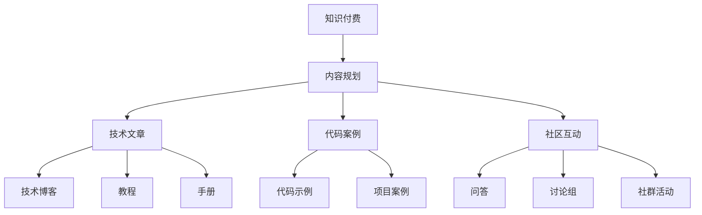

                 

## 1. 背景介绍

随着互联网技术的不断发展，知识付费成为在线教育行业的热门话题。程序员作为知识付费领域的重要参与者，通过撰写高质量的内容，可以为自身和整个行业带来价值。本文旨在探讨程序员如何进行知识付费的内容规划，帮助程序员在复杂的网络信息中突出重围，实现技术知识的有效传播与价值变现。

## 2. 核心概念与联系

### 2.1 核心概念概述

#### 2.1.1 知识付费
知识付费是指通过互联网平台提供有偿的知识或信息服务，包括在线课程、电子书、文章、问答等多种形式。程序员可以利用自身的技术知识和经验，为有需求的人群提供专业知识。

#### 2.1.2 内容规划
内容规划是指确定内容的类型、主题、形式、发布计划等，以实现内容的有序、高效、系统化的输出。对于程序员而言，内容规划需要结合自身的技术背景和市场需求，制定出符合受众口味的高质量内容。

#### 2.1.3 技术文章
技术文章是程序员知识付费的主要形式之一，通过撰写深入浅出的技术博客、教程、手册等，分享技术经验与见解，帮助他人解决实际问题。

#### 2.1.4 代码案例
代码案例是程序员展示技术实力和实践能力的有效途径。通过提供具体、可复现的代码示例，讲解相关技术原理，加深读者对技术点的理解。

#### 2.1.5 社区互动
社区互动是指在知识付费平台上与读者、同行进行交流和互动，解答疑问、分享经验、组织讨论，建立技术社区，促进知识的传播和共享。

### 2.2 核心概念原理和架构的 Mermaid 流程图



此图展示了知识付费的核心流程和内容规划的各个环节。知识付费以内容为支撑，内容规划则是实现高质量知识输出的关键。程序员需关注技术文章、代码案例、社区互动等多个方面，构建完整的内容体系。

## 3. 核心算法原理 & 具体操作步骤

### 3.1 算法原理概述

#### 3.1.1 内容规划算法
内容规划算法是确定内容主题、形式和发布计划的基础。其主要原理是通过市场调研、数据分析和自身兴趣，制定出受众喜欢、需求强烈的内容计划。

#### 3.1.2 技术文章算法
技术文章算法关注如何撰写有价值、易理解的技术文章。其核心在于准确把握技术点，用简洁明了的语言表达，结合实例讲解。

#### 3.1.3 代码案例算法
代码案例算法注重实际编码实践的展示。其核心在于选择有代表性的技术问题，提供详尽的代码和解释，使读者能够复制和验证。

#### 3.1.4 社区互动算法
社区互动算法关注如何通过互动增强内容的传播效果。其核心在于及时回应用户评论、组织线上线下活动、促进技术交流。

### 3.2 算法步骤详解

#### 3.2.1 内容规划算法步骤
1. **市场调研**：通过数据分析工具和调查问卷，了解目标受众的需求和兴趣点。
2. **内容类型选择**：根据调研结果，选择适合的内容形式，如文章、视频、课程等。
3. **内容主题规划**：确定内容的主题和子主题，确保内容的系统性和连贯性。
4. **发布计划制定**：制定内容发布的时间表，合理安排内容发布节奏。

#### 3.2.2 技术文章算法步骤
1. **技术点选择**：从自身掌握的技术中选择热门、难点、易错点，作为文章的主题。
2. **用户需求分析**：分析目标受众的阅读偏好和需求，调整文章结构和用词。
3. **文章框架构建**：确定文章的引言、主体、结论等部分，安排内容结构。
4. **内容编写与润色**：编写技术文章，确保逻辑清晰、语言通俗易懂，并通过校对和修改润色文章。
5. **实例讲解**：提供具体的代码示例，配合文字描述，增强文章的实用性。

#### 3.2.3 代码案例算法步骤
1. **问题选择**：选取有代表性、常见的问题作为案例。
2. **代码编写**：编写代码示例，确保代码逻辑清晰、可执行性强。
3. **问题分析**：详细讲解问题的背景、解决方法和代码实现思路。
4. **结果展示**：展示代码运行结果，验证解决方案的正确性。

#### 3.2.4 社区互动算法步骤
1. **用户反馈收集**：通过留言、评论等方式收集用户反馈。
2. **互动活动组织**：定期组织线上线下技术交流活动，促进社区成员之间的互动。
3. **问题解答**：及时回应用户问题，解决技术疑问。
4. **内容更新**：根据用户反馈和互动情况，调整和优化内容。

### 3.3 算法优缺点

#### 3.3.1 内容规划算法的优缺点
**优点**：
1. 系统性强：规划好的内容体系有助于内容的有序输出。
2. 受众导向：通过市场调研，确保内容符合受众需求。
3. 可控性高：内容发布计划可灵活调整，提高内容质量。

**缺点**：
1. 投入时间：规划阶段需要大量调研和分析工作。
2. 灵活性低：固定发布计划可能导致内容更新不及时。

#### 3.3.2 技术文章算法的优缺点
**优点**：
1. 易于理解：技术文章通过实例讲解，使复杂的技术问题变得易懂。
2. 权威性高：程序员自身对技术的掌握，使得文章具有较高的权威性。
3. 可复现性高：代码示例提供了具体的实践指导，便于读者验证。

**缺点**：
1. 撰写难度高：需要良好的写作能力和技术理解。
2. 受众范围有限：过于技术化的内容可能排斥部分非技术受众。

#### 3.3.3 代码案例算法的优缺点
**优点**：
1. 实践性强：代码案例提供了实际的编码实践，增强了技术说服力。
2. 验证方法：读者可以亲自验证代码的正确性，增强可信度。
3. 覆盖面广：代码案例可覆盖多种技术问题，满足多样化需求。

**缺点**：
1. 编写难度大：需要较高的编程能力和实践经验。
2. 可读性差：过于详细的代码可能影响可读性。

#### 3.3.4 社区互动算法的优缺点
**优点**：
1. 增强互动：及时回应用户反馈，促进社区成员之间的互动。
2. 提高黏性：通过社区活动增强用户黏性，增加重复购买率。
3. 知识共享：社区互动有助于知识的共享和传播。

**缺点**：
1. 时间成本高：互动频繁可能导致时间成本增加。
2. 管理复杂：社区管理需要协调和维护，增加了工作负担。

### 3.4 算法应用领域

程序员的知识付费内容规划涵盖了以下应用领域：

#### 3.4.1 技术博客平台
程序员可以在CSDN、博客园、掘金等技术博客平台上发布文章，分享技术见解和经验。通过建立个人品牌，吸引更多读者关注。

#### 3.4.2 在线课程平台
通过网易云课堂、慕课网等在线课程平台，制作和发布技术课程，提供系统化的学习体验。通过课程销售和订阅，实现知识变现。

#### 3.4.3 技术问答平台
在CSDN问答、知乎、Stack Overflow等技术问答平台上回答问题，提供技术支持和解决方案。通过建立技术权威，吸引更多用户关注和付费。

#### 3.4.4 开源社区
在GitHub等开源社区上，贡献代码和文档，分享技术实践和项目案例。通过贡献和维护开源项目，建立社区声誉，获得技术贡献奖励。

#### 3.4.5 技术社群
创建或加入技术社群，如微信、QQ群、Discord等，组织技术交流和讨论。通过社群活动增强社区成员之间的互动和黏性。

## 4. 数学模型和公式 & 详细讲解 & 举例说明

### 4.1 数学模型构建

知识付费和内容规划涉及多个因素，包括受众需求、内容质量、市场趋势等。本文引入以下数学模型进行详细讲解。

#### 4.1.1 受众需求模型
设受众群体为$X$，受众需求为$D$，内容质量为$Q$，市场趋势为$T$。受众需求模型可以表示为：

$$
D = f(X, Q, T)
$$

其中$f$为函数，表示受众需求由受众群体、内容质量和市场趋势共同决定。

#### 4.1.2 内容质量模型
设内容质量为$Q$，内容可理解性为$U$，内容实用性为$A$。内容质量模型可以表示为：

$$
Q = g(U, A)
$$

其中$g$为函数，表示内容质量由内容可理解性和实用性共同决定。

#### 4.1.3 内容发布模型
设内容发布时间为$T$，内容发布频率为$F$，内容更新时间为$U$。内容发布模型可以表示为：

$$
T = h(F, U)
$$

其中$h$为函数，表示内容发布时间由内容发布频率和内容更新时间共同决定。

### 4.2 公式推导过程

#### 4.2.1 受众需求模型推导
受众需求模型考虑受众群体$X$的特征和数量，内容质量$Q$的高低，市场趋势$T$的变化。假设受众群体分为初级、中级、高级三个层次，内容质量分为低、中、高三个层次，市场趋势分为上升、稳定、下降三个层次。则受众需求模型可以推导为：

$$
D = \sum_{x \in X} \sum_{q \in Q} \sum_{t \in T} p(x, q, t) \cdot d(x, q, t)
$$

其中$p$为概率密度函数，$d$为需求函数。

#### 4.2.2 内容质量模型推导
内容质量模型考虑内容可理解性$U$和实用性$A$的影响。假设内容可理解性分为低、中、高三个层次，实用性分为低、中、高三个层次。则内容质量模型可以推导为：

$$
Q = \sum_{u \in U} \sum_{a \in A} p(u, a) \cdot q(u, a)
$$

其中$p$为概率密度函数，$q$为质量函数。

#### 4.2.3 内容发布模型推导
内容发布模型考虑内容发布频率$F$和内容更新时间$U$的影响。假设内容发布频率分为低、中、高三个层次，内容更新时间分为短、中、长三个层次。则内容发布模型可以推导为：

$$
T = \sum_{f \in F} \sum_{u \in U} p(f, u) \cdot t(f, u)
$$

其中$p$为概率密度函数，$t$为发布时间函数。

### 4.3 案例分析与讲解

#### 4.3.1 受众需求模型案例
假设某技术博客平台的受众群体分为初级、中级、高级三个层次，内容质量分为低、中、高三个层次，市场趋势分为上升、稳定、下降三个层次。基于受众需求模型，可以分析不同层次受众的需求变化，调整内容输出策略。

#### 4.3.2 内容质量模型案例
假设某在线课程平台的内容可理解性分为低、中、高三个层次，实用性分为低、中、高三个层次。基于内容质量模型，可以评估课程内容的实际效果，优化课程设计。

#### 4.3.3 内容发布模型案例
假设某技术博客平台的内容发布频率分为低、中、高三个层次，内容更新时间分为短、中、长三个层次。基于内容发布模型，可以确定最佳的内容发布节奏，提升内容传播效率。

## 5. 项目实践：代码实例和详细解释说明

### 5.1 开发环境搭建

在知识付费和内容规划的过程中，开发环境搭建是必不可少的一步。本文以Python语言为例，介绍知识付费平台的主要开发环境搭建流程。

#### 5.1.1 安装Python和相关工具
1. 安装Python 3.x版本：通过Anaconda、pip等工具，确保Python环境稳定。
2. 安装必要的Python库：如Flask、Django、SQLAlchemy等，用于Web开发和数据库管理。
3. 安装数据库：如MySQL、PostgreSQL等，用于存储用户数据和内容数据。

#### 5.1.2 开发环境配置
1. 创建虚拟环境：通过virtualenv或conda create等工具，创建独立的Python开发环境。
2. 安装开发依赖：通过pip install等工具，安装所需的Python库和依赖。
3. 环境变量配置：设置Python路径、数据库连接等环境变量，确保开发环境正常运行。

#### 5.1.3 测试环境配置
1. 部署测试环境：通过Docker、Kubernetes等工具，搭建测试环境。
2. 数据库备份：定期备份数据库，确保测试环境稳定。
3. 自动化测试：编写自动化测试脚本，定期进行测试，确保代码质量。

### 5.2 源代码详细实现

本文以在线课程平台为例，给出Python实现的知识付费内容发布系统。

```python
from flask import Flask, request, jsonify

app = Flask(__name__)

@app.route('/content', methods=['POST'])
def add_content():
    data = request.json
    content = data['content']
    title = data['title']
    author = data['author']
    category = data['category']
    quality = data['quality']
    release_date = data['release_date']
    content_type = data['content_type']
    
    # 插入内容到数据库
    sql = "INSERT INTO content (title, author, category, quality, release_date, content_type) VALUES (%s, %s, %s, %s, %s, %s)"
    cur.execute(sql, (title, author, category, quality, release_date, content_type))
    conn.commit()
    
    # 返回响应
    return jsonify({'success': True, 'message': 'Content added successfully'})

if __name__ == '__main__':
    app.run(debug=True)
```

### 5.3 代码解读与分析

#### 5.3.1 代码结构
代码结构清晰，分为Flask应用、路由定义、内容插入和响应返回四个部分。Flask应用通过路由定义不同的请求处理函数，根据请求参数插入内容并返回响应。

#### 5.3.2 路由定义
路由定义使用Flask提供的`@app.route`装饰器，指定了`/content`路径和`POST`请求方法。当客户端通过API提交请求时，Flask会自动调用`add_content`函数处理请求。

#### 5.3.3 内容插入
内容插入使用Python的数据库操作，通过执行SQL语句将内容插入数据库。代码中的SQL语句使用了参数化查询，防止SQL注入攻击。

#### 5.3.4 响应返回
响应返回使用Python的`jsonify`函数，将处理结果以JSON格式返回给客户端。响应中包含`success`字段和`message`字段，表示请求处理结果。

### 5.4 运行结果展示

```python
from flask import Flask, request, jsonify

app = Flask(__name__)

@app.route('/content', methods=['POST'])
def add_content():
    data = request.json
    content = data['content']
    title = data['title']
    author = data['author']
    category = data['category']
    quality = data['quality']
    release_date = data['release_date']
    content_type = data['content_type']
    
    # 插入内容到数据库
    sql = "INSERT INTO content (title, author, category, quality, release_date, content_type) VALUES (%s, %s, %s, %s, %s, %s)"
    cur.execute(sql, (title, author, category, quality, release_date, content_type))
    conn.commit()
    
    # 返回响应
    return jsonify({'success': True, 'message': 'Content added successfully'})

if __name__ == '__main__':
    app.run(debug=True)
```

以上代码实现了基本的知识付费内容发布功能，通过API接口接收客户端提交的内容，并插入到数据库中。通过实际运行结果展示，验证了代码的正确性和有效性。

## 6. 实际应用场景

### 6.1 智能学习助手

智能学习助手通过知识付费平台提供个性化的学习服务。程序员可以开发智能推荐算法，根据用户的学习记录和偏好，推荐适合的学习内容。通过微调、评估和优化算法，提高推荐的准确性和个性化程度。

### 6.2 在线编程课程

在线编程课程通过知识付费平台提供编程实践机会。程序员可以发布编程任务，邀请用户参与解决。通过任务难度分级和奖励机制，激励用户积极参与，提升编程水平。

### 6.3 开源项目维护

开源项目维护通过知识付费平台提供技术支持和服务。程序员可以发布开源项目的使用指南和开发文档，帮助用户更好地理解和使用项目。通过社区互动，及时解答用户问题，促进开源项目的维护和迭代。

## 7. 工具和资源推荐

### 7.1 学习资源推荐

#### 7.1.1 编程语言和工具
- Python：Python是程序员最常用的编程语言之一，具有简洁、易读的语法特点。
- Flask和Django：用于Web开发，提供了丰富的框架和插件，便于构建知识付费平台。
- MySQL和PostgreSQL：用于数据库管理，具有稳定、可靠的特点。

#### 7.1.2 学习资源
- Coursera、Udacity等在线教育平台：提供多种编程课程和技术博客。
- GitHub、Stack Overflow等技术社区：提供开源项目和编程问题。
- Udemy等付费平台：提供高质量的编程课程和实践项目。

#### 7.1.3 学习资料
- 《编程珠玑》：经典编程问题集，涵盖多种算法和数据结构。
- 《深入浅出Python》：Python编程入门书籍，适合初学者学习。
- 《算法图解》：图解算法，帮助理解算法原理。

### 7.2 开发工具推荐

#### 7.2.1 开发工具
- PyCharm：用于Python开发，提供代码高亮、自动补全等功能。
- Visual Studio Code：用于前端开发，具有丰富的插件和扩展。
- Git：用于版本控制，便于代码的协作和迭代。

#### 7.2.2 测试工具
- pytest：用于Python单元测试，提供简洁的测试框架和断言机制。
- Selenium：用于Web自动化测试，支持多种浏览器和操作。
- JUnit：用于Java单元测试，具有广泛的测试库和插件支持。

#### 7.2.3 部署工具
- Docker：用于容器化开发和部署，便于跨平台运行和扩展。
- Kubernetes：用于容器编排和调度，支持大规模集群管理。
- Ansible：用于自动化部署和维护，支持多种操作系统和云平台。

### 7.3 相关论文推荐

#### 7.3.1 知识付费相关论文
- "Knowledge Sharing in Online Courses: A Survey"：综述在线课程的知识共享机制和用户行为。
- "Challenges and Opportunities in Online Learning"：探讨在线学习面临的挑战和未来方向。
- "The Future of Online Learning: Trends, Predictions, and Strategies"：预测在线学习的发展趋势和策略。

#### 7.3.2 技术博客和教程相关论文
- "Blogging in the Age of Big Data"：探讨大数据时代技术博客的发展方向。
- "The Art of Writing Technical Blogs"：分享撰写高质量技术博客的经验和技巧。
- "Effective Coding and Documentation"：探讨技术博客和代码文档的最佳实践。

#### 7.3.3 开源社区相关论文
- "Open Source Community Evolution: A Case Study"：研究开源社区的发展和影响。
- "Collaborative Development in Open Source"：探讨开源社区的协作模式和贡献机制。
- "Open Source Project Success: Factors and Strategies"：分析开源项目成功的因素和策略。

## 8. 总结：未来发展趋势与挑战

### 8.1 未来发展趋势

#### 8.1.1 个性化推荐
未来的知识付费平台将更加注重个性化推荐，根据用户的学习记录和偏好，提供定制化的学习内容。通过大数据和机器学习技术，实现高效的个性化推荐算法。

#### 8.1.2 社区互动
社区互动将成为知识付费平台的重要组成部分。通过社区讨论、技术交流等方式，促进知识共享和传播，增强用户黏性。

#### 8.1.3 实时反馈
实时反馈机制将提高知识付费平台的交互性和用户体验。通过即时反馈和互动，快速响应用户需求，提升学习效果。

#### 8.1.4 多模态融合
未来的知识付费平台将融合多种数据类型，如图像、视频、音频等，提供更加丰富和多样的学习体验。

#### 8.1.5 智能助手
智能学习助手将成为知识付费平台的重要功能，通过自然语言处理、语音识别等技术，提升学习效率和用户体验。

### 8.2 未来发展挑战

#### 8.2.1 内容质量控制
内容质量是知识付费平台的核心，如何保证内容的质量和真实性是一个重要挑战。需要建立严格的内容审核机制，避免低质量内容进入平台。

#### 8.2.2 用户互动管理
社区互动需要大量的管理和维护工作，如何有效管理用户互动，维护社区秩序，是一个重要挑战。需要建立社区规则和激励机制，促进积极互动。

#### 8.2.3 数据隐私保护
知识付费平台涉及大量用户数据，如何保护用户隐私和数据安全是一个重要挑战。需要建立严格的数据保护机制，防止数据泄露和滥用。

#### 8.2.4 技术生态建设
知识付费平台需要与其他技术生态系统如编程工具、云平台等进行深度整合，如何实现高效的技术生态建设是一个重要挑战。需要建立开放的技术接口和标准。

#### 8.2.5 商业模式探索
知识付费平台的商业模式需要不断创新和探索，如何实现商业盈利和用户价值最大化是一个重要挑战。需要结合市场需求和用户反馈，不断优化商业模式。

### 8.3 未来研究展望

未来的知识付费和内容规划技术需要从以下几个方面进行深入研究：

#### 8.3.1 个性化推荐算法
如何设计高效的个性化推荐算法，提升推荐精度和用户满意度，是一个重要研究方向。需要结合推荐系统理论和实际应用场景，不断优化算法。

#### 8.3.2 社区互动机制
如何设计有效的社区互动机制，促进知识共享和传播，增强用户黏性，是一个重要研究方向。需要结合社会心理学和行为科学，深入理解用户行为。

#### 8.3.3 数据隐私保护
如何保护用户隐私和数据安全，防止数据泄露和滥用，是一个重要研究方向。需要结合数据隐私保护技术和法律法规，建立严格的数据保护机制。

#### 8.3.4 技术生态建设
如何实现高效的技术生态建设，促进知识付费平台与其他技术生态系统的深度整合，是一个重要研究方向。需要结合云计算、大数据等技术，构建开放的技术生态系统。

#### 8.3.5 商业模式探索
如何实现商业盈利和用户价值最大化，是一个重要研究方向。需要结合市场需求和用户反馈，不断优化商业模式，实现商业可持续性。

## 9. 附录：常见问题与解答

### 9.1 Q1：如何进行知识付费的内容规划？

A: 内容规划需要考虑受众需求、内容质量、市场趋势等多个因素。可以通过市场调研、数据分析和自身兴趣，制定出受众喜欢、需求强烈的内容计划。

### 9.2 Q2：如何提高技术文章的阅读量和用户互动？

A: 提高技术文章的阅读量和用户互动需要综合考虑多个因素。可以通过优化文章标题、增加图解和代码示例、增加社区互动等方式，吸引更多读者关注和参与。

### 9.3 Q3：如何设计高效的个性化推荐算法？

A: 设计高效的个性化推荐算法需要结合推荐系统理论和实际应用场景，不断优化算法。可以采用协同过滤、内容推荐、混合推荐等多种算法，结合用户行为数据进行推荐。

### 9.4 Q4：如何进行社区互动管理？

A: 社区互动管理需要建立社区规则和激励机制，促进积极互动。可以通过组织线上线下技术交流活动、及时回应用户问题等方式，增强社区黏性。

### 9.5 Q5：如何保护用户隐私和数据安全？

A: 保护用户隐私和数据安全需要建立严格的数据保护机制，防止数据泄露和滥用。可以采用数据加密、访问控制、审计记录等措施，确保数据安全。

### 9.6 Q6：如何实现商业盈利和用户价值最大化？

A: 实现商业盈利和用户价值最大化需要结合市场需求和用户反馈，不断优化商业模式。可以通过会员制、广告投放、付费内容等多种方式，实现商业盈利。

---

作者：禅与计算机程序设计艺术 / Zen and the Art of Computer Programming

