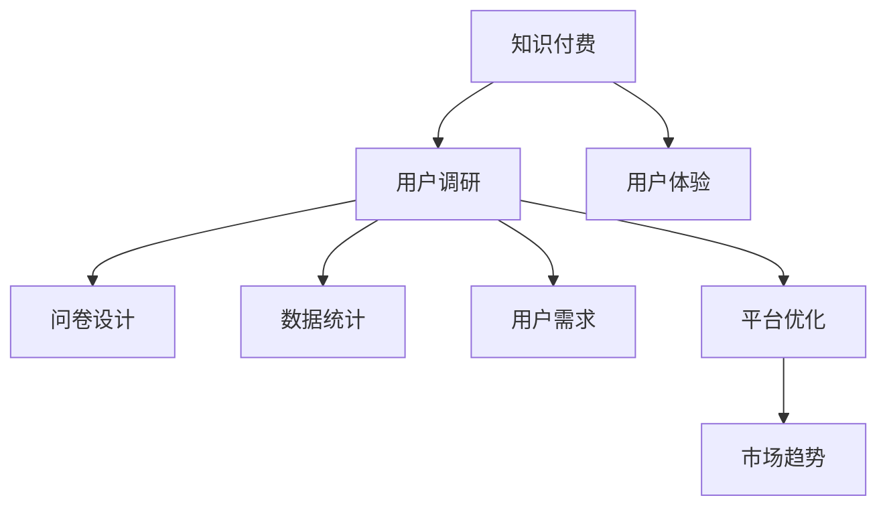

                 

# 程序员如何进行知识付费的用户调研

> 关键词：程序员, 知识付费, 用户调研, 用户体验, 问卷设计, 数据统计, 用户需求, 平台优化, 市场趋势

## 1. 背景介绍

### 1.1 问题由来

随着互联网的快速发展，知识付费逐渐成为一种重要的学习方式，特别是对广大程序员而言。然而，尽管知识付费市场在不断增长，用户满意度和付费意愿仍然存在不少问题。越来越多的程序员在选择付费课程时，不仅关注课程内容的质量，也开始重视课程的性价比、用户体验等方面。

为了更好地了解程序员的实际需求，并据此优化知识付费平台的服务质量，本文将详细介绍如何进行用户调研。首先，我们需要理解程序员知识付费的核心需求和痛点，接着设计合理的问卷调查和数据分析方法，最后结合数据分析结果给出相应的平台优化建议。

## 2. 核心概念与联系

### 2.1 核心概念概述

在进行程序员知识付费的用户调研之前，我们需要先了解一些相关的核心概念及其相互联系：

- **知识付费**：指的是用户为获取知识或学习资源而支付费用的模式。在程序员群体中，知识付费主要体现在技术课程、实战项目、技术社区等平台。
- **用户调研**：是指通过定量和定性研究方法，收集用户行为数据和意见反馈，以了解用户需求和行为特征，从而指导产品优化和策略调整。
- **用户体验**：涉及用户在产品使用过程中的心理和行为体验，是衡量产品满意度的重要指标之一。
- **问卷设计**：是用户调研的重要工具，通过设计合适的问卷，可以系统地收集用户对知识付费产品或服务的意见和建议。
- **数据统计**：包括数据的收集、整理、分析和报告等过程，是用户调研结果得以有效呈现和应用的基础。
- **用户需求**：是指用户对知识付费产品或服务的具体要求和期望，基于用户需求进行的产品优化才能更贴近用户真实需求。
- **平台优化**：指的是根据用户调研结果，优化知识付费平台的用户体验、课程内容、价格策略等，以提升用户满意度和忠诚度。
- **市场趋势**：涉及知识付费市场的整体发展方向和热点，对平台优化具有重要的参考意义。

这些核心概念之间的联系，可以通过以下Mermaid流程图来展示：



这个流程图展示了一个从知识付费到平台优化的完整流程，各环节之间相互关联，共同推动知识付费平台的发展。

## 3. 核心算法原理 & 具体操作步骤

### 3.1 算法原理概述

在进行程序员知识付费的用户调研时，我们主要关注的是数据的收集和分析。数据驱动的决策分析能够帮助我们更好地了解用户需求和行为特征，从而指导产品优化。常用的数据收集和分析方法包括问卷调研、用户行为数据分析、用户反馈收集等。

### 3.2 算法步骤详解

以下是程序员知识付费用户调研的主要步骤：

1. **目标设定**：明确调研目标，例如了解程序员对知识付费的付费意愿、课程满意度、平台使用体验等。
2. **问卷设计**：基于调研目标，设计包含定量和定性问题的问卷，确保问卷问题的合理性和可操作性。
3. **样本选择**：选择有代表性的样本，确保调研结果的代表性和可靠性。
4. **数据收集**：通过在线问卷、电话访谈、焦点小组等方式收集数据。
5. **数据整理**：对收集到的数据进行整理和清洗，确保数据质量。
6. **数据分析**：采用统计分析、聚类分析、因子分析等方法，对数据进行深入分析。
7. **报告撰写**：将分析结果整理成报告，提出优化建议。
8. **实施反馈**：将优化建议反馈给平台方，并跟踪优化效果。

### 3.3 算法优缺点

**优点**：
- 数据驱动：通过收集和分析数据，可以客观了解用户需求和行为特征。
- 成本较低：相较于市场调研等方法，问卷调研和用户行为数据分析成本较低。
- 操作灵活：可以根据实际需求灵活调整调研方法。

**缺点**：
- 数据偏差：问卷设计不合理或样本选择不当可能导致数据偏差。
- 数据质量：数据收集和整理过程中可能存在误差，影响分析结果。
- 时效性：调研结果可能受市场变化影响，需要定期更新。

### 3.4 算法应用领域

程序员知识付费用户调研不仅适用于现有的知识付费平台，还可以应用于新产品的开发和现有产品的优化。例如，在开发新的编程课程时，可以基于用户调研结果选择合适的课程主题和难度，提升课程的吸引力和用户体验。

## 4. 数学模型和公式 & 详细讲解

### 4.1 数学模型构建

在进行数据分析时，我们通常使用回归分析、聚类分析、因子分析等统计方法。以下是几种常用的数学模型：

1. **回归分析**：用于分析自变量和因变量之间的关系，常用的模型包括线性回归、逻辑回归等。
2. **聚类分析**：将样本分为若干组，使同一组内的样本特征相似，不同组之间的特征差异明显。常用的算法包括K-means、层次聚类等。
3. **因子分析**：用于寻找数据中影响因变量的主要因素，常用的模型包括主成分分析（PCA）、因子分析（FA）等。

### 4.2 公式推导过程

以线性回归模型为例，其基本公式为：

$$ y = \beta_0 + \beta_1x_1 + \beta_2x_2 + \cdots + \beta_nx_n + \epsilon $$

其中，$y$ 为因变量，$\beta_0$ 为截距，$\beta_1, \beta_2, \cdots, \beta_n$ 为自变量系数，$x_1, x_2, \cdots, x_n$ 为自变量，$\epsilon$ 为误差项。

线性回归的系数估计公式为：

$$ \hat{\beta} = (\mathbf{X}^T\mathbf{X})^{-1}\mathbf{X}^T\mathbf{y} $$

其中，$\mathbf{X}$ 为自变量矩阵，$\mathbf{y}$ 为因变量向量，$\hat{\beta}$ 为估计系数。

### 4.3 案例分析与讲解

假设我们有一个编程课程的满意度调研数据，可以通过线性回归模型分析编程课程的难易度、互动性、课程质量等因素对用户满意度的影响。具体步骤如下：

1. 收集课程的难易度、互动性、课程质量等自变量数据。
2. 收集用户对课程的满意度评分，作为因变量数据。
3. 使用最小二乘法估计线性回归模型的系数。
4. 对模型进行显著性检验，确定每个自变量的影响程度。
5. 根据模型结果提出优化建议，如增加课程互动性，提升课程质量等。

## 5. 项目实践：代码实例和详细解释说明

### 5.1 开发环境搭建

在进行知识付费用户调研时，我们通常使用Python进行数据分析。以下是Python开发环境的搭建步骤：

1. **安装Python**：从官网下载并安装Python，推荐使用Anaconda或Miniconda。
2. **安装必要的库**：安装Pandas、NumPy、SciPy、Scikit-learn等数据分析库。
3. **设置环境变量**：设置Python的PATH环境变量，确保库文件的访问路径正确。

### 5.2 源代码详细实现

以下是一个简单的问卷调研和数据统计的Python代码实现，包含问卷设计、数据收集、数据整理和分析：

```python
import pandas as pd
from sklearn.cluster import KMeans
from sklearn.decomposition import PCA

# 设计问卷
questions = [
    "What are your main reasons for paying for programming courses?",
    "How satisfied are you with the course content?",
    "How much do you use interactive elements in courses?",
    "What do you think about the difficulty level of the courses?",
    "What is your average satisfaction rating?"
]

# 数据收集
responses = {
    "question1": ["Reason A", "Reason B", "Other"],
    "question2": [1, 2, 3, 4, 5],
    "question3": [1, 2, 3, 4, 5],
    "question4": [1, 2, 3, 4, 5],
    "question5": [1, 2, 3, 4, 5]
}

# 将问卷数据转换为DataFrame
data = pd.DataFrame(responses)

# 数据整理
# 将定性数据转换为数值数据
data["reason1"] = data["question1"].apply(lambda x: 1 if x == "Reason A" else 0)
data["reason2"] = data["question1"].apply(lambda x: 1 if x == "Reason B" else 0)
data["other"] = data["question1"].apply(lambda x: 1 if x == "Other" else 0)

# 数据清洗
data.drop(columns=["question1"], inplace=True)

# 数据分析
# 使用K-means聚类分析
kmeans = KMeans(n_clusters=3, random_state=0)
labels = kmeans.fit_predict(data)

# 输出结果
print("Clusters:")
for label in labels:
    print(f"Cluster {label}:")
    print(data[data["reason1"] == labels[label]].values, "\n")
```

### 5.3 代码解读与分析

上述代码实现了一个简单的问卷调研和数据统计过程。具体步骤如下：

1. **问卷设计**：定义问卷问题，包括定量和定性问题。
2. **数据收集**：将问卷数据转换为DataFrame格式。
3. **数据整理**：将定性数据转换为数值数据，进行数据清洗。
4. **数据分析**：使用K-means聚类算法对数据进行聚类分析。
5. **结果输出**：输出聚类结果，查看不同聚类中的问卷数据分布。

## 6. 实际应用场景

### 6.1 平台优化

基于用户调研的结果，知识付费平台可以进行多项优化。例如，对于编程课程，可以优化课程内容、互动性、课程质量等因素，提升用户满意度。具体优化措施包括：

- **课程内容优化**：根据用户调研结果，选择和设计符合用户需求的课程内容，增加案例分析和实战项目，提升课程的实用性和吸引力。
- **互动性增强**：增加编程社区、实时问答、小组讨论等互动功能，提升用户参与度和课程体验。
- **课程质量保障**：定期更新课程内容，邀请专家进行课程评审，确保课程质量。

### 6.2 新课程开发

在开发新编程课程时，可以通过用户调研了解目标用户群体的需求和偏好。具体步骤如下：

1. **调研需求**：通过问卷调研、用户访谈等方式收集目标用户的需求和期望。
2. **确定课程内容**：根据调研结果，选择和设计符合用户需求的课程内容，如编程基础、项目实战、高级技术等。
3. **课程结构设计**：根据用户反馈，设计合理的课程结构和进度安排，确保课程内容的连贯性和实用性。
4. **课程内容验证**：邀请用户进行课程预览和反馈，根据用户意见进行课程优化。

### 6.3 平台反馈机制

建立有效的平台反馈机制，能够及时收集用户意见和建议，进一步优化产品。具体措施包括：

1. **用户意见反馈渠道**：提供便捷的用户反馈渠道，如在线客服、邮件、社交媒体等。
2. **定期调研**：定期进行用户调研，了解用户对课程、平台、服务等方面的意见和建议。
3. **优化反馈**：根据用户反馈，及时优化课程和平台功能，提升用户体验。

## 7. 工具和资源推荐

### 7.1 学习资源推荐

为了帮助程序员进行知识付费用户调研，以下是一些推荐的学习资源：

1. **《市场调研与分析》**：介绍市场调研的基本方法和技巧，适合了解数据收集和分析的基本流程。
2. **《统计学基础》**：详细介绍统计学原理和方法，适合理解数据分析和模型推导。
3. **《用户研究与用户体验》**：详细介绍用户研究方法和用户体验设计的原理，适合提升用户调研的实践能力。
4. **在线课程平台**：如Coursera、Udacity等，提供大量数据分析和用户研究相关的课程和资源。
5. **数据分析工具**：如Tableau、Power BI等，适合数据可视化和报告呈现。

### 7.2 开发工具推荐

为了高效进行用户调研和数据分析，以下是一些推荐的开发工具：

1. **Python**：数据处理和分析的首选语言，拥有丰富的数据分析库和工具。
2. **R语言**：数据统计和可视化的主要工具，适合复杂的统计分析和数据可视化。
3. **Jupyter Notebook**：交互式的数据分析和报告撰写工具，适合数据探索和模型验证。
4. **Excel**：简单易用的数据处理和分析工具，适合初步的数据整理和统计。
5. **Tableau**：数据可视化和报告工具，适合复杂的数据分析和可视化。

### 7.3 相关论文推荐

以下是一些与程序员知识付费用户调研相关的推荐论文：

1. **"Programming as a Service: Challenges and Opportunities for a New Generation of Online Courses"**：探讨在线编程课程的发展趋势和挑战，适合理解知识付费平台的发展方向。
2. **"User Experience Design for Knowledge Products: A Case Study on Programming Courses"**：介绍编程课程的用户体验设计方法，适合了解用户体验优化的具体实践。
3. **"Market Trends in Online Education: An Analysis of Programming Courses"**：分析编程课程的市场趋势和发展前景，适合了解市场变化和用户需求。
4. **"User-Centered Design for Knowledge Products: A Study on Programming Courses"**：探讨用户中心设计方法在知识付费产品中的应用，适合提升产品设计的用户体验。
5. **"Survey Design and Analysis: A Handbook for Programmers"**：详细介绍问卷调研和数据统计的方法和技巧，适合提升调研和分析的实践能力。

## 8. 总结：未来发展趋势与挑战

### 8.1 研究成果总结

通过用户调研，我们能够系统地了解程序员对知识付费的需求和痛点，为平台优化和新产品开发提供数据支撑。以下是对调研结果的总结：

1. **需求多样化**：程序员对知识付费的需求不仅局限于课程内容，还包括互动性、课程质量、课程结构等方面。
2. **重视用户体验**：程序员对知识付费的满意度受用户体验影响较大，平台优化应注重提升用户参与度和互动性。
3. **个性化需求**：程序员对知识付费的个性化需求较高，平台应根据用户反馈进行灵活调整。

### 8.2 未来发展趋势

未来，知识付费用户调研将在以下几个方面呈现新的发展趋势：

1. **多模态数据融合**：除了问卷调研和用户行为数据分析，未来的调研将融合文本、语音、视频等多模态数据，提供更全面的用户画像。
2. **实时反馈机制**：建立实时反馈机制，及时收集用户意见和建议，进行动态优化。
3. **机器学习应用**：引入机器学习算法进行数据挖掘和用户预测，提升调研结果的准确性和实用性。
4. **跨平台数据分析**：将用户调研结果应用于多个平台，进行跨平台数据分析，提升用户数据的一致性和可比性。
5. **用户行为预测**：通过数据分析和机器学习，预测用户行为趋势，提前进行产品优化。

### 8.3 面临的挑战

尽管用户调研在知识付费产品优化中具有重要作用，但仍面临以下挑战：

1. **数据隐私**：在数据收集和分析过程中，如何保护用户隐私和数据安全是一个重要问题。
2. **数据质量**：数据收集和整理过程中可能存在误差，影响调研结果的可靠性。
3. **成本控制**：调研成本较高，平台需平衡调研效果和成本。
4. **数据解读**：复杂的数据分析结果可能难以解读，需要专业的数据分析人员。
5. **跨平台一致性**：多平台数据不一致，可能导致调研结果的偏差。

### 8.4 研究展望

未来，知识付费用户调研需要在数据隐私、数据质量、成本控制、数据解读等方面进行更深入的研究。以下是一些展望：

1. **隐私保护技术**：开发和应用隐私保护技术，保护用户数据隐私和安全。
2. **自动化数据分析**：利用自动化工具和算法进行数据处理和分析，降低人工成本和误差。
3. **跨平台数据融合**：建立统一的跨平台数据标准，提升数据的一致性和可比性。
4. **实时数据处理**：引入实时数据处理技术，提升调研结果的及时性和准确性。
5. **可视化工具**：开发和应用可视化工具，提升数据分析结果的可解释性和可操作性。

## 9. 附录：常见问题与解答

### 常见问题1：为什么需要用户调研？

答：用户调研能够系统地了解用户需求和行为特征，为知识付费平台的优化和新产品开发提供数据支撑，提升用户满意度和平台竞争力。

### 常见问题2：如何设计问卷？

答：设计问卷时，需要确保问题的合理性和可操作性。可以采用定量和定性问题相结合的方式，通过问卷调研获取用户的意见和建议。

### 常见问题3：如何保障用户隐私？

答：在数据收集和分析过程中，应采取严格的隐私保护措施，如数据匿名化、加密传输、访问控制等，确保用户隐私和数据安全。

### 常见问题4：如何控制调研成本？

答：可以通过自动化工具和算法进行数据处理和分析，降低人工成本和误差。同时，应优先选择有代表性的样本进行调研，确保调研结果的代表性和可靠性。

### 常见问题5：如何选择分析方法？

答：根据调研目标和数据特征选择合适的分析方法。例如，线性回归适合分析自变量和因变量之间的关系，聚类分析适合对数据进行分组，因子分析适合寻找数据中的主要因素。

---

作者：禅与计算机程序设计艺术 / Zen and the Art of Computer Programming

