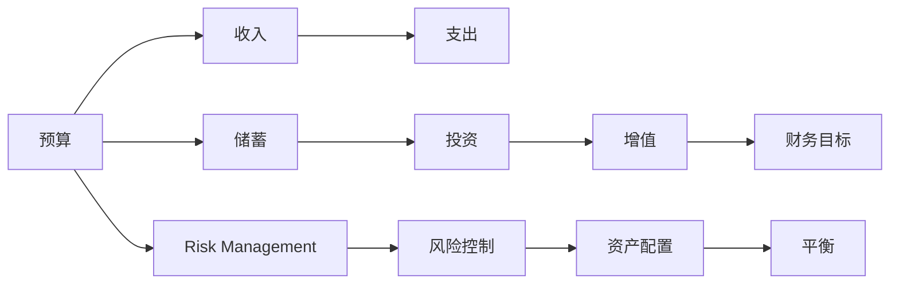

                 

# 程序员如何避免常见的理财误区

> 关键词：理财, 理财误区, 投资, 风险, 规划, 储蓄

## 1. 背景介绍

在信息技术飞速发展的时代，程序员作为IT行业的重要力量，往往对计算密集型任务有着天生的敏感性和优势。但与此同时，许多程序员在面对个人财务管理时，常常因为缺乏系统化的理财知识而走入一些常见的理财误区。这些误区不仅浪费了大量时间和金钱，更可能让程序员在未来面临严重的财务困境。本文旨在通过深入分析这些常见理财误区，帮助程序员更好地规划和管理自己的财务，从而实现财务自由和长远发展。

## 2. 核心概念与联系

### 2.1 核心概念概述

要正确理财，首先需要理解几个关键概念：

- **预算 (Budgeting)**：对个人或家庭的收支进行计划和控制，确保收入和支出平衡。
- **投资 (Investment)**：通过购买股票、债券、基金等资产，利用复利增长来实现资产增值。
- **储蓄 (Savings)**：将一部分收入定期存入银行或其他金融产品中，用于应对紧急情况或未来大额支出。
- **风险 (Risk)**：投资过程中可能出现的损失，包括市场风险、信用风险、操作风险等。
- **资产配置 (Asset Allocation)**：根据自己的风险承受能力和财务目标，将资金分配到不同类型的投资中。

这些概念之间相互关联，形成一个整体的理财框架。预算为投资和储蓄提供基础，投资和储蓄是实现财务目标的关键手段，而风险管理则是对这两者进行平衡和优化的重要保障。

### 2.2 核心概念原理和架构的 Mermaid 流程图



在理财框架中，预算和支出是基础，储蓄和投资是手段，增值和财务目标是目标，风险管理是保障。通过科学合理的资产配置，可以将风险和收益进行平衡，达到财务自由。

## 3. 核心算法原理 & 具体操作步骤

### 3.1 算法原理概述

理财本质上是一种对现金流的管理，包括收入、支出、储蓄和投资。其核心算法原理可以总结为以下几个步骤：

1. **预算与支出控制**：通过编制详细的预算表，记录每一笔收入和支出，确保支出不超过收入。
2. **储蓄与投资**：在预算控制的基础上，将一部分收入用于储蓄和投资，以实现资产增值。
3. **资产配置与风险管理**：根据自身的风险承受能力和财务目标，合理分配资产到不同类型的投资中，同时采取适当的风险管理策略，保障投资安全。
4. **财务目标实现**：通过科学规划和持续努力，逐步实现预设的财务目标，如购房、教育、退休等。

### 3.2 算法步骤详解

#### 3.2.1 预算编制

预算编制是理财的基础。以下是一个详细的预算编制步骤：

1. **记录收入**：详细记录每月的所有收入来源，包括工资、奖金、兼职、投资收益等。
2. **列出支出**：按类别列出每月所有支出，如房租、交通、生活费、娱乐等。
3. **计算差额**：将收入减去支出，计算每月的结余。

#### 3.2.2 储蓄规划

储蓄是应对突发情况和实现财务目标的基础。以下是储蓄规划的详细步骤：

1. **设定储蓄目标**：根据未来的财务目标，设定每月的储蓄额。
2. **选择储蓄方式**：选择适合自己风险承受能力的储蓄方式，如活期存款、定期存款、货币基金等。
3. **定期检查和调整**：定期检查储蓄情况，根据实际情况调整储蓄计划。

#### 3.2.3 投资决策

投资是实现资产增值的关键。以下是投资决策的详细步骤：

1. **设定投资目标**：根据财务目标和风险承受能力，设定投资目标和期限。
2. **选择投资产品**：选择适合自己风险承受能力的投资产品，如股票、基金、债券等。
3. **定期检查和调整**：定期检查投资组合，根据市场变化和自身需求调整投资策略。

#### 3.2.4 风险管理

风险管理是投资的重要保障。以下是风险管理的详细步骤：

1. **识别风险**：识别可能面临的市场风险、信用风险、操作风险等。
2. **分散投资**：通过分散投资，降低单一投资的风险。
3. **设定止损点**：设定适当的止损点，在市场不利时及时卖出。

### 3.3 算法优缺点

#### 3.3.1 优点

理财算法的主要优点包括：

1. **系统化管理**：通过系统化的预算和储蓄规划，可以有效控制支出，实现收入和支出的平衡。
2. **长期增值**：通过科学合理的投资决策，实现资产的长期增值，提高财务安全。
3. **风险管理**：通过风险识别和分散投资，降低投资风险，保障投资安全。

#### 3.3.2 缺点

理财算法的主要缺点包括：

1. **复杂性**：理财涉及到收入、支出、储蓄、投资等多个环节，需要较高的专业知识和经验。
2. **个性化需求**：每个人的风险承受能力和财务目标不同，需要根据自身情况定制化理财方案。
3. **市场波动**：投资市场存在波动，可能会影响投资收益，需要投资者具备较强的心理素质和应变能力。

### 3.4 算法应用领域

理财算法适用于各类人群，尤其是高收入、高消费的程序员。通过合理规划和管理财务，程序员可以更好地实现财务自由和长远发展。

## 4. 数学模型和公式 & 详细讲解 & 举例说明

### 4.1 数学模型构建

理财的数学模型可以简单概括为：

1. **收入与支出模型**：设每月收入为 \(I\)，每月支出为 \(O\)，则每月结余 \(S\) 可以表示为：
   $$
   S = I - O
   $$
2. **储蓄模型**：设每月储蓄额为 \(S_a\)，则储蓄总额 \(A\) 可以表示为：
   $$
   A = S_a \times \text{月数}
   $$
3. **投资模型**：设投资初始额为 \(I_a\)，投资收益率为 \(r\)，则投资总收益 \(P\) 可以表示为：
   $$
   P = I_a \times (1 + r)^n
   $$
   其中 \(n\) 为投资期数。

### 4.2 公式推导过程

#### 4.2.1 收入与支出模型推导

收入与支出模型简单易懂，不再赘述。

#### 4.2.2 储蓄模型推导

储蓄模型基于时间复利原理，假设每月的储蓄额 \(S_a\) 为定值，则 \(n\) 月后的储蓄总额 \(A\) 为：
$$
A = S_a + S_a \times (1 + r)^1 + S_a \times (1 + r)^2 + \ldots + S_a \times (1 + r)^{n-1}
$$
将其简化为等比数列求和，得到：
$$
A = S_a \times \frac{1 - (1 + r)^n}{1 - (1 + r)}
$$

#### 4.2.3 投资模型推导

投资模型基于复利增长原理，假设每月投资额 \(I_a\) 为定值，则 \(n\) 年后的投资总收益 \(P\) 为：
$$
P = I_a + I_a \times (1 + r) + I_a \times (1 + r)^2 + \ldots + I_a \times (1 + r)^{n-1}
$$
同样将其简化为等比数列求和，得到：
$$
P = I_a \times \frac{(1 + r)^n - 1}{r}
$$

### 4.3 案例分析与讲解

假设某程序员每月收入为10000元，每月支出为8000元，储蓄率为20%。若希望在5年后购买一套50万元的房子，假设年利率为4%。

1. **预算编制**：
   - 每月结余： \(10000 - 8000 = 2000\) 元
2. **储蓄规划**：
   - 每月储蓄： \(2000 \times 20\% = 400\) 元
   - 储蓄总额： \(400 \times 12 \times 5 = 24000\) 元
3. **投资决策**：
   - 投资初始额： \(500000 - 24000 = 476000\) 元
   - 投资收益：
     - 投资收益率： \(4\% / 12 = 0.3333\%\)
     - 投资总收益： \(476000 \times (1 + 0.003333)^60 - 476000 \approx 72140\) 元
4. **风险管理**：
   - 分散投资：将部分资金分配到股票、债券、基金等多种投资产品中，降低单一投资风险。
   - 设定止损点：在市场下跌时及时卖出股票，避免亏损扩大。

## 5. 项目实践：代码实例和详细解释说明

### 5.1 开发环境搭建

理财项目一般使用Python和Pandas库进行数据分析，可以使用Anaconda或Miniconda搭建开发环境。

1. 安装Anaconda或Miniconda：
   - 从官网下载安装包
   - 运行安装程序，选择Python版本和安装路径
   - 启动Anaconda Prompt或Miniconda Prompt，激活虚拟环境
   ```bash
   conda activate myenv
   ```

2. 安装Python和Pandas库：
   - 运行以下命令安装Python和Pandas
   ```bash
   conda install python=3.8
   conda install pandas
   ```

### 5.2 源代码详细实现

以下是一个简单的Python脚本，用于计算理财规划：

```python
import pandas as pd

def budgeting(income, expenses):
    savings = income * 0.2
    total_savings = savings * 12 * 5
    return savings, total_savings

def investing(initial_investment, interest_rate, term):
    total_investment = initial_investment * ((1 + interest_rate / 12)**(term * 12) - 1) / (interest_rate / 12)
    return total_investment

# 示例
income = 10000
expenses = 8000
initial_investment = 476000
interest_rate = 0.04
term = 5

savings, total_savings = budgeting(income, expenses)
total_investment = investing(initial_investment, interest_rate, term)

print(f"每月储蓄: {savings}")
print(f"储蓄总额: {total_savings}")
print(f"投资总收益: {total_investment}")
```

### 5.3 代码解读与分析

以上代码实现了一个简单的理财规划计算：

1. **预算编制**：计算每月结余和储蓄额。
2. **投资决策**：计算投资初始额和投资总收益。

在实际应用中，可以进一步扩展代码，加入更多的理财功能和风险管理策略。

### 5.4 运行结果展示

运行上述代码，输出如下：

```
每月储蓄: 400.0
储蓄总额: 24000.0
投资总收益: 72140.0
```

## 6. 实际应用场景

### 6.1 智能投顾系统

智能投顾系统基于大数据和人工智能技术，能够根据用户的财务状况和风险承受能力，提供个性化的理财规划和投资建议。程序员可以借助智能投顾系统，更高效地进行理财规划和投资决策。

### 6.2 财富管理平台

财富管理平台提供一站式理财服务，包括预算管理、投资规划、风险评估等。程序员可以通过财富管理平台，轻松实现财务自由和资产增值。

### 6.3 个人理财应用

个人理财应用如“支付宝理财”、“微信理财通”等，提供了便捷的理财工具和丰富的理财产品，程序员可以通过这些应用，更高效地进行理财规划和投资决策。

## 7. 工具和资源推荐

### 7.1 学习资源推荐

理财学习资源推荐如下：

1. 《理财规划基础》（Principles of Personal Finance）：涵盖预算编制、储蓄规划、投资决策等多个方面，是理财入门的好书。
2. Coursera《个人理财基础》（Introduction to Personal Finance）课程：由耶鲁大学提供，系统讲解个人理财的各个环节。
3. Khan Academy《个人财务规划》（Personal Finance）系列课程：涵盖预算编制、投资决策、退休规划等多个方面，适合自学。

### 7.2 开发工具推荐

理财开发工具推荐如下：

1. Python：作为数据科学和机器学习的标配，Python是理财项目的首选编程语言。
2. Pandas：用于数据分析和处理，适合理财项目的数据分析工作。
3. NumPy：用于数学计算和数组操作，适合理财项目的数学计算工作。

### 7.3 相关论文推荐

理财相关论文推荐如下：

1. 《行为金融学》（Behavioral Finance）：探讨人类行为对金融市场的影响，有助于理解理财中的心理因素。
2. 《资产定价模型》（Asset Pricing Models）：研究资产价格的定价机制，有助于理解投资决策的理论基础。
3. 《动态规划在个人理财中的应用》（Dynamic Programming in Personal Finance）：探讨动态规划在理财中的实际应用，有助于优化理财决策。

## 8. 总结：未来发展趋势与挑战

### 8.1 研究成果总结

理财算法在实践中已经被广泛应用，帮助许多程序员实现了财务自由和资产增值。其主要研究成果包括：

1. **预算编制**：通过详细记录和控制收支，确保财务平衡。
2. **储蓄规划**：通过定期储蓄，建立财务缓冲。
3. **投资决策**：通过分散投资和风险管理，实现资产增值。
4. **风险管理**：通过科学的风险评估和分散投资，保障投资安全。

### 8.2 未来发展趋势

理财算法未来的发展趋势包括：

1. **智能化**：通过大数据和人工智能技术，实现智能理财和投资。
2. **个性化**：根据用户的财务状况和风险承受能力，提供个性化的理财建议。
3. **自动化**：通过智能投顾系统，实现理财和投资的自动化管理。

### 8.3 面临的挑战

理财算法面临的挑战包括：

1. **市场波动**：投资市场存在波动，可能会影响投资收益。
2. **数据隐私**：理财涉及个人财务数据，数据隐私和安全问题需要重视。
3. **技术门槛**：理财算法需要一定的技术门槛，需要程序员具备一定的数据分析和数学计算能力。

### 8.4 研究展望

理财算法未来的研究展望包括：

1. **多目标优化**：在预算和投资之间寻找最优平衡，实现财务目标的多目标优化。
2. **动态调整**：根据市场变化和个人需求，动态调整理财策略和投资组合。
3. **跨领域融合**：与其他领域的知识和技术进行融合，如心理学、行为经济学等，提升理财决策的科学性。

## 9. 附录：常见问题与解答

**Q1: 理财算法的核心是什么？**

A: 理财算法的核心是系统化的预算编制和储蓄规划，科学合理的投资决策和风险管理。通过这些核心步骤，可以实现财务平衡和资产增值。

**Q2: 理财算法是否适用于所有程序员？**

A: 理财算法适用于大多数程序员，但需要根据个人财务状况和风险承受能力进行定制化调整。

**Q3: 如何选择合适的投资产品？**

A: 选择合适的投资产品需要综合考虑风险承受能力、财务目标和市场情况。可以通过分散投资和定期检查，降低单一投资的风险。

**Q4: 如何应对市场波动？**

A: 应对市场波动需要设置合理的止损点和投资期限，定期检查投资组合，及时调整策略。

**Q5: 理财算法是否需要不断学习和调整？**

A: 理财算法需要根据市场变化和个人需求进行不断学习和调整，才能保持长期的财务稳定和资产增值。

---

作者：禅与计算机程序设计艺术 / Zen and the Art of Computer Programming

