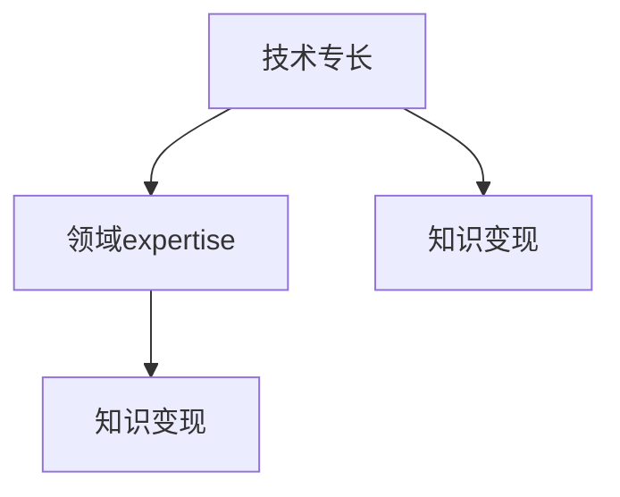

                 

# 程序员的跨界知识变现：技术+领域expertise

在快速发展的技术世界中，程序员已经不再仅仅需要掌握编程语言和算法数据结构，而是需要不断扩展自己的知识面，并具备跨界融合的能力。本文将从多个维度探讨程序员如何通过结合技术专长与领域expertise，实现自身的知识变现，从而在职业生涯中取得更大的成就。

## 1. 背景介绍

### 1.1 问题由来
随着人工智能(AI)、大数据、云计算等技术的普及，程序员不仅要掌握编程技能，还需要具备跨学科的知识。越来越多的企业和机构正在寻找能够将技术专长与特定行业领域知识相结合的专业人才。因此，如何将编程技能与行业知识相融合，从而创造更大的价值，成为程序员跨界发展的重要命题。

### 1.2 问题核心关键点
- **技术专长**：程序员在特定编程语言、框架或算法上的深厚理解。
- **领域expertise**：程序员在某个行业（如医疗、金融、教育等）的深入理解与专业知识。
- **知识变现**：通过跨界融合技术专长与领域expertise，解决实际问题，创造商业价值。

## 2. 核心概念与联系

### 2.1 核心概念概述

在深入探讨跨界知识变现前，我们首先要理解几个关键概念：

- **技术专长**：程序员在编程语言、算法、数据结构、软件架构等方面的专业知识。
- **领域expertise**：程序员对特定行业（如医疗、金融、教育等）的理解与专业知识。
- **知识变现**：将技术专长与领域expertise相结合，解决实际问题，创造商业价值的过程。

这些概念之间的联系可以通过以下Mermaid流程图来展示：



这个流程图展示了技术专长与领域expertise如何共同作用于知识变现：

1. 技术专长为领域expertise提供了工具和方法，使其能够被有效地应用。
2. 领域expertise为技术专长提供了应用场景和具体问题，使其能够找到解决方案。
3. 知识变现是技术专长与领域expertise结合的最终目标，通过解决实际问题来创造价值。

## 3. 核心算法原理 & 具体操作步骤

### 3.1 算法原理概述

程序员的跨界知识变现，本质上是将技术专长与领域expertise相结合，解决实际问题的过程。这种结合可以发生在多个层面，包括但不限于算法模型构建、数据处理、系统设计等。

### 3.2 算法步骤详解

以下是实现跨界知识变现的一般步骤：

**Step 1: 理解领域问题**
- 深入了解特定领域的具体问题，掌握相关术语、业务流程和痛点。

**Step 2: 技术工具选择**
- 根据领域问题选择合适的编程语言、算法和工具。

**Step 3: 数据收集与预处理**
- 收集领域相关的数据，并进行清洗、标注和预处理。

**Step 4: 模型构建与训练**
- 基于领域问题构建合适的算法模型，并进行训练。

**Step 5: 模型评估与优化**
- 使用领域数据对模型进行评估，根据评估结果进行参数调整和模型优化。

**Step 6: 模型部署与迭代**
- 将优化后的模型部署到实际应用中，并根据反馈进行迭代改进。

### 3.3 算法优缺点

技术+领域expertise的跨界知识变现方法具有以下优点：
1. **综合优势**：结合技术专长与领域expertise，能够更全面地理解和解决问题。
2. **创新潜力**：跨界融合带来的新思路和方法，有助于产生创新的解决方案。
3. **灵活性强**：能够根据具体问题灵活选择技术工具和算法。

但该方法也存在一定的局限性：
1. **时间和资源投入**：跨界融合需要时间和资源进行学习和实践，初期成本较高。
2. **风险较大**：缺乏领域知识的程序员可能难以理解具体问题，导致方案失败。
3. **知识更新快**：领域expertise需要持续学习，保持对最新技术和趋势的敏感度。

### 3.4 算法应用领域

跨界知识变现方法可以应用于众多领域，例如：

- **医疗领域**：开发智能诊断系统，结合医学知识和AI算法，提升疾病诊断的准确性和效率。
- **金融领域**：构建风控模型，使用金融知识和机器学习算法，降低金融风险。
- **教育领域**：开发个性化学习系统，结合教育心理学和编程技能，提供个性化学习方案。
- **交通领域**：开发智能交通系统，使用计算机视觉和交通规则，提升交通管理效率。

## 4. 数学模型和公式 & 详细讲解 & 举例说明

### 4.1 数学模型构建

以下是一个简单的数学模型示例，用于说明跨界知识变现的过程。

假设我们希望开发一个智能诊断系统，用于诊断心脏病。我们可以使用机器学习算法来训练模型，并结合医学知识来优化模型的决策过程。

### 4.2 公式推导过程

**Step 1: 数据准备**
- 收集心脏病相关的患者数据，包括年龄、性别、血压、血糖等。
- 根据医学知识，选择和标注症状数据，如胸痛、心悸、气短等。

**Step 2: 模型选择**
- 使用支持向量机(SVM)作为初始模型，并结合决策树和逻辑回归等算法进行优化。

**Step 3: 模型训练**
- 使用收集到的数据训练SVM模型，并根据医学知识调整决策树和逻辑回归的参数。

**Step 4: 模型评估**
- 使用测试数据评估模型的准确性，并根据结果调整模型参数。

**Step 5: 模型部署**
- 将优化后的模型部署到实际应用中，如医院的诊断系统。

### 4.3 案例分析与讲解

以智能交通系统为例，我们详细探讨跨界知识变现的具体实现过程。

- **技术专长**：计算机视觉和数据处理技术。
- **领域expertise**：交通规则和交通管理知识。

**Step 1: 理解领域问题**
- 研究交通流量管理、红绿灯控制、交通事故预防等具体问题。

**Step 2: 技术工具选择**
- 使用Python编程语言，结合OpenCV进行计算机视觉处理，使用SQL进行数据分析。

**Step 3: 数据收集与预处理**
- 收集交通流量数据、交通事故数据和红绿灯控制数据。
- 清洗和预处理数据，去除噪声和异常值。

**Step 4: 模型构建与训练**
- 使用深度学习算法（如CNN）对交通图像进行分类，识别车辆和行人。
- 使用强化学习算法优化红绿灯控制策略，减少交通拥堵。

**Step 5: 模型评估与优化**
- 在实际交通场景中测试模型的准确性和实时性，并根据反馈进行调整。

**Step 6: 模型部署与迭代**
- 将模型集成到交通管理系统，根据实际运行情况进行持续优化。

## 5. 项目实践：代码实例和详细解释说明

### 5.1 开发环境搭建

以下是使用Python进行开发的开发环境配置流程：

1. 安装Anaconda：从官网下载并安装Anaconda，用于创建独立的Python环境。

2. 创建并激活虚拟环境：
```bash
conda create -n myenv python=3.8 
conda activate myenv
```

3. 安装必要的Python库：
```bash
pip install numpy pandas scikit-learn matplotlib
```

### 5.2 源代码详细实现

以下是一个简单的智能诊断系统的Python代码实现。

```python
from sklearn.ensemble import RandomForestClassifier
from sklearn.metrics import accuracy_score

# 收集数据
data = [
    (40, 'male', 120, 6.5, 'normal', 'no'),
    (45, 'male', 125, 7.5, 'high', 'yes'),
    # ...
]

# 特征和标签
features = ['age', 'gender', 'blood_pressure', 'chol', 'smoker', 'has_heart_disease']
labels = [has_heart_disease for has_heart_disease in [0, 1]]

# 数据预处理
from sklearn.preprocessing import LabelEncoder
encoder = LabelEncoder()
encoded_features = encoder.fit_transform(features)

# 模型训练
model = RandomForestClassifier()
model.fit(encoded_features, labels)

# 模型评估
test_data = [
    (50, 'male', 130, 6.5, 'no', 'no'),
    # ...
]
test_features = encoder.transform(test_data)
test_labels = [has_heart_disease for has_heart_disease in [0, 1]]
predictions = model.predict(test_features)
accuracy = accuracy_score(test_labels, predictions)

print(f"Accuracy: {accuracy:.2f}")
```

### 5.3 代码解读与分析

让我们详细解读一下关键代码的实现细节：

**数据准备**
- `data` 变量包含样本数据，特征和标签分别存储在 `features` 和 `labels` 中。

**特征处理**
- 使用 `LabelEncoder` 将分类特征进行编码，转换为数值型数据。

**模型训练**
- 使用 `RandomForestClassifier` 训练随机森林模型。

**模型评估**
- 使用测试数据对模型进行评估，输出模型的准确率。

## 6. 实际应用场景

### 6.1 医疗领域

跨界知识变现在医疗领域有着广泛的应用前景。程序员可以利用其在算法和数据处理方面的专长，结合医生的医学知识，开发智能诊断系统、治疗方案推荐系统等。

### 6.2 金融领域

金融领域也对跨界知识变现有大量需求。程序员可以使用机器学习和数据挖掘技术，结合金融学知识，开发风险评估系统、欺诈检测系统等。

### 6.3 教育领域

在教育领域，程序员可以结合教育心理学和编程技能，开发个性化学习系统、作业批改系统等，帮助学生更好地学习。

### 6.4 未来应用展望

随着技术的不断发展，跨界知识变现的应用场景将会更加广泛。未来，随着AI技术在各行业的深入应用，程序员将需要具备更广泛的跨界融合能力，从而在更多领域创造更大的价值。

## 7. 工具和资源推荐

### 7.1 学习资源推荐

为了帮助程序员系统掌握跨界知识变现的理论基础和实践技巧，以下是一些优质的学习资源：

1. **《机器学习实战》**：Hands-On Machine Learning with Scikit-Learn、TensorFlow & Keras，通过实际项目讲解机器学习算法和工具。
2. **《Python深度学习》**：利用TensorFlow、Keras和PyTorch等库，深入浅出地讲解深度学习原理和应用。
3. **Coursera 《深度学习专业证书》**：由斯坦福大学提供的课程，涵盖深度学习的基础和高级应用。
4. **Kaggle**：数据科学和机器学习的竞赛平台，提供大量实际问题，供程序员实践和提高。

### 7.2 开发工具推荐

以下是几款用于跨界知识变现开发的常用工具：

1. **Python**：跨界融合的最佳编程语言，拥有丰富的科学计算库和机器学习库。
2. **TensorFlow**：谷歌主导的深度学习框架，支持大规模分布式计算。
3. **PyTorch**：Facebook开发的深度学习框架，易于使用，支持动态图计算。
4. **Jupyter Notebook**：开源的交互式笔记本，方便编写和调试代码，分享和协作。
5. **Git**：版本控制系统，方便团队协作和代码管理。

### 7.3 相关论文推荐

以下是几篇奠基性的相关论文，推荐阅读：

1. **深度学习在医疗领域的应用**：论文介绍了深度学习在医学图像、电子健康记录等领域的实际应用案例。
2. **金融科技与机器学习**：论文探讨了机器学习在金融风控、交易策略等方面的应用。
3. **个性化教育与机器学习**：论文介绍了机器学习在个性化推荐、智能辅导系统中的应用。
4. **智能交通与计算机视觉**：论文介绍了计算机视觉在交通监控、自动驾驶等领域的最新进展。

## 8. 总结：未来发展趋势与挑战

### 8.1 总结

本文对程序员如何通过结合技术专长与领域expertise，实现知识变现进行了全面系统的介绍。首先，我们阐述了跨界知识变现的必要性和重要性，明确了技术专长与领域expertise的结合方式。其次，从原理到实践，详细讲解了跨界知识变现的数学模型、操作步骤和实际应用，给出了代码实现示例。同时，本文还广泛探讨了跨界知识变现在医疗、金融、教育等众多行业领域的应用前景，展示了其巨大的潜力。最后，精选了相关的学习资源、开发工具和论文推荐，力求为读者提供全方位的技术指引。

通过本文的系统梳理，可以看到，程序员的跨界知识变现方法正在成为业界的重要趋势，极大地拓展了程序员的职业发展空间，提升了他们的商业价值。未来，伴随技术的发展和社会的进步，跨界知识变现必将成为程序员职业生涯的重要方向，为他们的职业发展提供更多机遇。

### 8.2 未来发展趋势

展望未来，跨界知识变现技术将呈现以下几个发展趋势：

1. **跨界融合的广泛应用**：随着AI技术的普及，跨界知识变现将在更多行业领域得到应用，带来新的商业机会。
2. **AI伦理和安全**：随着AI应用的增多，伦理和安全问题也将更加凸显，程序员需要具备更强的责任感和社会意识。
3. **多模态融合**：未来的跨界知识变现将更加注重多模态数据的融合，如视觉、语音、文本等的协同工作。
4. **持续学习和自适应**：跨界知识变现模型需要不断学习和适应新知识，才能在快速变化的环境中保持竞争力。
5. **领域专家的参与**：未来，领域专家将更多地参与到跨界知识变现的各个环节中，帮助程序员更好地理解问题，优化模型。

### 8.3 面临的挑战

尽管跨界知识变现技术已经取得了显著成果，但在实际应用中也面临诸多挑战：

1. **技术门槛高**：跨界知识变现需要程序员具备跨学科知识，技术门槛较高。
2. **数据获取难**：高质量的领域数据往往难以获取，限制了模型的训练和优化。
3. **模型复杂度高**：跨界知识变现模型通常比较复杂，难以进行高效的调试和优化。
4. **隐私和安全**：涉及医疗、金融等敏感领域的跨界知识变现，需要特别注意数据隐私和安全问题。
5. **效果评估难**：跨界知识变现的效果评估往往依赖领域专家的知识，评估标准难以量化。

### 8.4 研究展望

未来的研究需要在以下几个方面寻求新的突破：

1. **简化模型**：开发更简单、更易维护的跨界知识变现模型，降低技术门槛。
2. **提高数据获取效率**：探索更多高效的数据获取和处理技术，减少对领域专家的依赖。
3. **优化算法**：开发更高效、更准确的算法，提升模型的效果和可靠性。
4. **注重伦理和安全**：在模型设计中考虑伦理和安全问题，确保技术应用的正确性和合规性。
5. **多学科融合**：推动跨界知识变现技术与心理学、社会学、经济学等多学科的融合，提升模型的应用效果。

这些研究方向的探索，必将引领跨界知识变现技术迈向更高的台阶，为程序员的职业发展提供更多机遇，为各行各业的智能化转型提供新的动力。

## 9. 附录：常见问题与解答

**Q1：跨界知识变现适用于所有程序员吗？**

A: 跨界知识变现适合具有一定编程技能和一定领域知识储备的程序员。对特定领域的深入理解是实现跨界知识变现的关键。

**Q2：如何选择适合自己的领域expertise？**

A: 可以从自己的兴趣、专业背景和行业需求入手，选择与自身技能和经验相匹配的领域。可以通过阅读相关书籍、参加行业会议等方式，逐步建立领域知识。

**Q3：跨界知识变现的实际效果如何？**

A: 跨界知识变现的效果取决于具体的领域和问题。在合适的场景下，跨界知识变现可以显著提升问题和任务的解决效率，带来显著的经济效益。

**Q4：如何提升跨界知识变现的能力？**

A: 持续学习是提升跨界知识变现能力的关键。通过不断学习新知识和技能，积累实践经验，不断优化模型和算法，可以逐步提高跨界知识变现的效果。

**Q5：跨界知识变现在实际应用中面临哪些问题？**

A: 跨界知识变现面临的主要问题包括数据获取难、技术门槛高、模型复杂度高、隐私和安全等。需要综合考虑这些问题，采取相应的技术和策略进行解决。

---

作者：禅与计算机程序设计艺术 / Zen and the Art of Computer Programming

