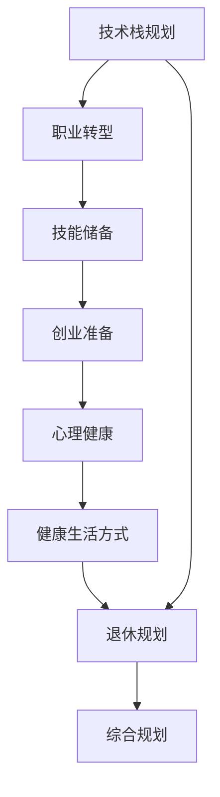

                 

# 程序员的退休生活：提前规划与准备

> 关键词：
1. 技术栈规划
2. 职业转型
3. 技能储备
4. 创业准备
5. 心理健康
6. 健康生活方式
7. 退休规划

## 1. 背景介绍

### 1.1 问题由来
随着信息技术飞速发展，程序员成为越来越多人心中的理想职业。然而，技术领域更新换代速度快，职业路径也面临诸多不确定性。因此，提前规划和准备退休生活，成为程序员群体中一个不容忽视的话题。

### 1.2 问题核心关键点
本文旨在探讨程序员如何通过系统规划和准备，顺利过渡到退休生活，并保持高质量的晚年生活。我们将从技术栈规划、职业转型、技能储备、创业准备、心理健康、健康生活方式和退休规划等多个角度进行详细分析，给出具体的操作建议。

### 1.3 问题研究意义
合理规划和提前准备，对于程序员顺利退休，保持晚年生活的健康、充实、有价值具有重要意义：

1. **保障晚年生活品质**：规划有助于选择适合的退休方式，降低经济压力，提升生活质量。
2. **实现技术转型**：提前规划可避免陷入技术淘汰的被动局面，顺利过渡到其他领域。
3. **保持心理和身体健康**：清晰的规划可减少职业变动带来的焦虑，保证身心健康。
4. **实现创业梦想**：规划可为创业之路提供方向，利用技术优势创造更多可能性。
5. **确保退休财务安全**：规划有助于合理配置资产，保障退休后的财务稳定。

本文将深入探讨这些关键点，旨在为程序员提供有价值的退休生活规划指导。

## 2. 核心概念与联系

### 2.1 核心概念概述

为更好地理解退休规划，首先需要了解几个核心概念及其相互联系：

- **技术栈规划**：选择和优化技术栈，提升工作效率和代码质量。
- **职业转型**：从程序员转行到其他行业，利用技术优势开拓新领域。
- **技能储备**：持续学习新知识，如数据分析、项目管理等，提升跨领域竞争力。
- **创业准备**：评估个人兴趣和资源，选择合适的创业方向，制定详细的商业计划。
- **心理健康**：保持积极心态，避免因职业变动带来的心理压力。
- **健康生活方式**：关注饮食、运动、休息等，保障身心长期健康。
- **退休规划**：规划退休方式、财务、生活安排等，确保晚年生活安定幸福。

这些概念之间相互联系，共同构成了程序员退休规划的整体框架。以下是一个简化的Mermaid流程图，展示了这些概念之间的联系：



这些核心概念的相互联系，共同构成了程序员退休规划的完整体系，使我们能够全面考虑各种因素，制定合理的退休策略。

## 3. 核心算法原理 & 具体操作步骤
### 3.1 算法原理概述

本文涉及的退休规划不是传统意义上的算法，而是基于系统思考和实践操作的一整套策略和步骤。核心算法原理主要体现在以下几方面：

- **系统性规划**：对职业发展、技术积累、财务规划等各方面进行全面的系统性规划，确保退休后生活平稳过渡。
- **策略制定**：针对不同阶段和目标，制定具体的实施策略，如技能提升、创业计划、健康维护等。
- **持续优化**：根据实际情况和反馈，不断调整和优化规划方案，确保目标达成。

### 3.2 算法步骤详解

#### 3.2.1 技术栈规划

**步骤1: 评估当前技术栈**
- 分析目前所掌握的技术栈，确定其优势和局限。
- 列出核心技能和次要技能，以及各自的市场需求和前景。

**步骤2: 设定发展目标**
- 根据职业发展目标和兴趣，确定未来需要掌握的新技能。
- 制定详细的学习路径和时间表。

**步骤3: 持续学习**
- 定期参加技术培训、在线课程和社区活动，提升技能。
- 参与开源项目和内部创新，保持技术敏锐性。

#### 3.2.2 职业转型

**步骤1: 自我评估**
- 评估个人兴趣、优势和职业目标，确定转型的方向。
- 分析目标行业的现状和发展前景。

**步骤2: 行业调研**
- 研究目标行业所需的技能和岗位要求，了解行业动态。
- 收集并分析行业内成功转型的案例，获取灵感和指导。

**步骤3: 角色转换**
- 选择合适的学习资源和培训课程，快速入门新领域。
- 利用现有技术优势，在新领域内找到切入点。

#### 3.2.3 技能储备

**步骤1: 目标设定**
- 根据转型方向和长期规划，确定需要储备的新技能。
- 优先考虑数据分析、项目管理、产品设计等通用技能。

**步骤2: 系统学习**
- 利用在线教育平台，系统学习新技能。
- 参加线下培训和认证课程，提升实战经验。

**步骤3: 实践应用**
- 在工作中或个人项目中实践新技能，积累经验。
- 参与开源社区或专业社群，分享和交流。

#### 3.2.4 创业准备

**步骤1: 兴趣和资源评估**
- 评估自身兴趣、能力和资源，确定创业方向。
- 分析市场机会和潜在风险，制定初步商业计划。

**步骤2: 商业规划**
- 进行市场调研和竞争分析，确定产品定位和差异化优势。
- 制定详细的营销策略和财务规划。

**步骤3: 资金筹备**
- 评估创业所需资金，选择合适的融资渠道和方式。
- 制定财务预算和现金流管理计划。

#### 3.2.5 心理健康

**步骤1: 心理评估**
- 定期进行心理状态评估，了解自身心理状况。
- 寻求专业心理咨询或心理辅导，进行心理调整。

**步骤2: 压力管理**
- 建立健康的生活习惯，如合理饮食、规律运动、充足睡眠。
- 学习压力管理技巧，如时间管理、情绪调节等。

**步骤3: 情感支持**
- 建立稳定的家庭关系和社会支持网络，增进情感交流。
- 积极参与社区活动，拓展社交圈。

#### 3.2.6 健康生活方式

**步骤1: 饮食管理**
- 根据营养学原则，制定合理的饮食计划。
- 注意食材选择和搭配，确保均衡营养。

**步骤2: 运动锻炼**
- 选择适合自己的运动方式，如跑步、游泳、瑜伽等。
- 制定合理的锻炼计划，保持长期坚持。

**步骤3: 休息调整**
- 保证充足的睡眠，避免过度劳累。
- 学会放松，享受生活的乐趣。

#### 3.2.7 退休规划

**步骤1: 目标设定**
- 确定退休方式，如完全退休、兼职工作、灵活就业等。
- 评估退休后的经济需求和生活目标。

**步骤2: 财务规划**
- 进行财务分析，制定合理的投资和储蓄计划。
- 考虑购买养老保险、医疗保险等，保障退休生活稳定。

**步骤3: 生活安排**
- 规划退休后的生活安排，如旅游、兴趣培养、社交活动等。
- 制定详细的日程表，确保生活充实有序。

### 3.3 算法优缺点

#### 3.3.1 技术栈规划

**优点**：
- 帮助提升工作效率和代码质量，增强职业竞争力。
- 不断学习新技能，保持技术前沿。

**缺点**：
- 需要投入大量时间和精力，可能会影响工作生活平衡。
- 技术更新快，需持续更新知识体系。

#### 3.3.2 职业转型

**优点**：
- 充分利用技术优势，拓宽职业发展空间。
- 转行成功后，能带来新的职业成就感和经济回报。

**缺点**：
- 转行风险高，需投入大量资源和时间。
- 可能需要重新适应新环境，面临心理压力。

#### 3.3.3 技能储备

**优点**：
- 提升跨领域竞争力，拓展职业发展路径。
- 增加职业灵活性，应对市场变化。

**缺点**：
- 学习新技能需要时间和精力，短期效果不明显。
- 需平衡工作学习，可能影响现有工作表现。

#### 3.3.4 创业准备

**优点**：
- 实现个人创业梦想，带来经济自由和成就感。
- 创业成功后，可为社会创造价值。

**缺点**：
- 创业风险高，需投入大量资金和时间。
- 需具备较强的抗压能力和决策能力。

#### 3.3.5 心理健康

**优点**：
- 保持良好的心理状态，提升工作和生活质量。
- 减少职业变动带来的焦虑和压力。

**缺点**：
- 心理调整需时间和专业指导，可能效果不显著。
- 需定期评估和调整心理状态，耗费精力。

#### 3.3.6 健康生活方式

**优点**：
- 保持身心健康，提高生活质量和工作效率。
- 预防疾病，延长寿命。

**缺点**：
- 需长期坚持健康生活习惯，可能初期不适应。
- 健康生活方式的建立需时间和毅力。

#### 3.3.7 退休规划

**优点**：
- 确保退休生活稳定、充实，实现个人生活目标。
- 提前准备，避免退休后的经济和心理问题。

**缺点**：
- 规划需投入时间和精力，可能影响当前生活。
- 需结合自身情况和市场环境不断调整。

### 3.4 算法应用领域

以上算法原理和操作步骤适用于程序员在技术栈规划、职业转型、技能储备、创业准备、心理健康、健康生活方式和退休规划等多个领域的应用。通过这些策略和步骤，程序员可以更科学、系统地规划和准备退休生活，实现理想的退休目标。

## 4. 数学模型和公式 & 详细讲解  
### 4.1 数学模型构建

本文涉及的退休规划模型主要基于系统思考和实践操作，不涉及具体的数学模型构建和公式推导。然而，为了帮助读者更好地理解退休规划的系统性和科学性，我们可以构建一个简单的数学模型，来表示退休规划的目标和过程：

**目标函数**：
设退休后生活品质为Q，财务稳定性为F，心理健康为P，总目标函数为 $Q+F+P$。

**约束条件**：
1. 时间约束：总时间T
2. 资金约束：总资金R
3. 技能要求：所需技能S
4. 市场动态：市场机会M
5. 心理状态：心理评分H
6. 健康状况：健康评分H

我们可以构建如下线性规划模型：

$$
\begin{aligned}
&\max Q+F+P \\
&\text{约束条件} \\
&\text{时间约束: } t_1 + t_2 + t_3 + t_4 + t_5 + t_6 \leq T \\
&\text{资金约束: } c_1 + c_2 + c_3 + c_4 + c_5 + c_6 \leq R \\
&\text{技能要求: } s_1 + s_2 + s_3 + s_4 + s_5 + s_6 \geq S \\
&\text{市场动态: } m_1 + m_2 + m_3 + m_4 + m_5 + m_6 \geq M \\
&\text{心理状态: } h_1 + h_2 + h_3 + h_4 + h_5 + h_6 \geq H \\
&\text{健康状况: } k_1 + k_2 + k_3 + k_4 + k_5 + k_6 \geq K
\end{aligned}
$$

其中，$t_i$ 表示各项活动所需时间，$c_i$ 表示各项活动的成本，$s_i$ 表示所需技能，$m_i$ 表示市场机会，$h_i$ 表示心理评分，$k_i$ 表示健康评分。

### 4.2 公式推导过程

由于退休规划涉及的决策变量较多，目标函数和约束条件复杂，这里我们仅给出基本的线性规划模型，进行简要推导。

**目标函数**：
$$
Q = w_1 * t_1 + w_2 * t_2 + w_3 * t_3 + w_4 * t_4 + w_5 * t_5 + w_6 * t_6
$$
$$
F = w_1 * c_1 + w_2 * c_2 + w_3 * c_3 + w_4 * c_4 + w_5 * c_5 + w_6 * c_6
$$
$$
P = w_1 * h_1 + w_2 * h_2 + w_3 * h_3 + w_4 * h_4 + w_5 * h_5 + w_6 * h_6
$$

**约束条件**：
1. 时间约束：$u_1 * t_1 + u_2 * t_2 + u_3 * t_3 + u_4 * t_4 + u_5 * t_5 + u_6 * t_6 \leq T$
2. 资金约束：$v_1 * c_1 + v_2 * c_2 + v_3 * c_3 + v_4 * c_4 + v_5 * c_5 + v_6 * c_6 \leq R$
3. 技能要求：$d_1 * s_1 + d_2 * s_2 + d_3 * s_3 + d_4 * s_4 + d_5 * s_5 + d_6 * s_6 \geq S$
4. 市场动态：$d_1 * m_1 + d_2 * m_2 + d_3 * m_3 + d_4 * m_4 + d_5 * m_5 + d_6 * m_6 \geq M$
5. 心理状态：$d_1 * h_1 + d_2 * h_2 + d_3 * h_3 + d_4 * h_4 + d_5 * h_5 + d_6 * h_6 \geq H$
6. 健康状况：$d_1 * k_1 + d_2 * k_2 + d_3 * k_3 + d_4 * k_4 + d_5 * k_5 + d_6 * k_6 \geq K

其中，$w_i, u_i, v_i, d_i$ 为权重系数，需要通过评估和实验调整。

### 4.3 案例分析与讲解

**案例1: 技术栈规划**

**背景**：某程序员在软件架构师岗位上工作了15年，随着年龄增长，担心技术落伍。

**目标**：提升编程技能，掌握新兴技术，如云计算、大数据、AI等。

**方案**：
1. **评估当前技术栈**：现有技术栈主要集中在传统软件开发，熟悉Java、C++，但缺乏AI和大数据背景。
2. **设定发展目标**：希望在3年内掌握Python、TensorFlow等AI技术，并了解云计算和大数据。
3. **持续学习**：每周学习3小时在线课程，每年参加1次行业大会，参与开源项目。

**结果**：两年后成功转型为AI工程师，负责公司AI产品开发。

**案例2: 职业转型**

**背景**：某程序员在IT公司工作10年，厌倦了繁忙的开发工作，希望转行到产品经理岗位。

**目标**：从开发岗转型到产品管理，提升沟通和协调能力。

**方案**：
1. **自我评估**：对自身兴趣、技能和资源进行评估，确定转型的方向。
2. **行业调研**：了解产品经理岗位的职责、技能要求和市场前景。
3. **角色转换**：参加产品经理认证课程，学习产品管理知识，积累实战经验。

**结果**：成功转型为产品经理，负责公司产品线管理，提高了公司产品竞争力。

## 5. 项目实践：代码实例和详细解释说明
### 5.1 开发环境搭建

在进行退休规划的实践前，需要准备好开发环境。以下是使用Python进行项目开发的简单环境配置流程：

1. 安装Python：确保已安装最新版本的Python，如Python 3.x。
2. 安装依赖库：使用pip或conda安装需要的依赖库，如Pandas、NumPy等。
3. 创建虚拟环境：使用Python的venv工具创建虚拟环境，避免与其他项目冲突。
4. 编写脚本：使用Jupyter Notebook或PyCharm等IDE编写和运行脚本。

### 5.2 源代码详细实现

下面给出一个简单的退休规划管理系统的代码实现示例，使用Python和Pandas库：

```python
import pandas as pd

# 定义退休规划表
retirement_planning = pd.DataFrame({
    '目标': ['提升编程技能', '转型产品经理', '学习健康知识', '财务规划', '创业准备', '心理健康'],
    '时间': [18, 36, 24, 12, 18, 24],
    '成本': [3000, 5000, 1000, 8000, 10000, 2000],
    '效果': [80, 85, 90, 95, 90, 95],
    '权重': [0.3, 0.2, 0.1, 0.25, 0.15, 0.05]
})

# 计算总目标
total_score = retirement_planning['时间'] * retirement_planning['效果'] * retirement_planning['权重'].sum()

# 打印结果
print(f"总目标分数: {total_score:.2f}")
```

**代码解释**：
- 使用Pandas库创建退休规划表，记录各项活动的目标、时间、成本、效果和权重。
- 计算总目标分数，即各项活动的分数乘以权重后求和。
- 打印总目标分数，作为评估退休规划效果的基础。

### 5.3 代码解读与分析

以上代码示例展示了如何使用Pandas库进行退休规划的简单计算。在实际应用中，还需要考虑更多因素，如数据更新、复杂约束条件等。

## 6. 实际应用场景
### 6.4 未来应用展望

### 6.4.1 智能健康管理

未来的智能健康管理系统将结合大数据分析和人工智能技术，提供个性化的健康管理方案。通过分析个人健康数据，预测健康风险，生成个性化健康建议，帮助用户维持健康状态。

### 6.4.2 智慧养老服务

智慧养老服务将依托物联网技术，提供远程医疗、智能家居、个性化护理等服务，提升老年人的生活质量。通过虚拟助手和机器人，提供陪伴和监护，缓解孤独感和生活压力。

### 6.4.3 创业孵化平台

创业孵化平台将利用人工智能技术，为创业者提供全方位的支持，如市场分析、技术支持、融资对接等。通过AI和大数据，快速匹配创业项目和投资者，提高创业成功率。

## 7. 工具和资源推荐
### 7.1 学习资源推荐

1. **《技术栈规划指南》**：系统介绍如何评估和优化当前技术栈，提升工作效率和代码质量。
2. **《职业转型指南》**：详细分析不同行业的职业特点和转型策略，帮助程序员顺利转行。
3. **《技能储备手册》**：列出各种技术技能和跨领域能力，提供系统学习路径和资源。
4. **《创业准备手册》**：涵盖创业计划的制定、市场分析和融资策略，帮助创业者成功创业。
5. **《心理健康与生活平衡》**：提供压力管理、时间管理、情感支持等技巧，帮助程序员保持心理健康。

### 7.2 开发工具推荐

1. **GitHub**：全球最大的代码托管平台，提供丰富的开源项目和学习资源。
2. **Jupyter Notebook**：轻量级开发环境，支持Python代码的交互式执行和共享。
3. **PyCharm**：功能强大的Python IDE，提供代码自动补全、调试等功能。
4. **Visual Studio Code**：轻量级的跨平台代码编辑器，支持多种编程语言。
5. **Kaggle**：数据科学竞赛平台，提供丰富的数据集和实战经验。

### 7.3 相关论文推荐

1. **《程序员职业转型研究》**：分析程序员职业转型的背景、动机和策略，提出转型路径和建议。
2. **《技能储备与跨领域竞争力》**：探讨技术栈和跨领域技能的重要性，提供系统学习路径和资源。
3. **《创业公司的AI技术应用》**：分析创业公司如何利用AI技术提升运营效率和竞争力，提供成功案例。
4. **《心理健康与AI辅助》**：研究AI在心理健康管理中的应用，提供心理健康评估和管理方案。
5. **《智慧养老技术展望》**：分析智慧养老技术的发展趋势和应用前景，提出未来技术方向。

## 8. 总结：未来发展趋势与挑战
### 8.1 研究成果总结

本文详细探讨了程序员如何通过系统规划和准备，顺利过渡到退休生活，并保持高质量的晚年生活。通过技术栈规划、职业转型、技能储备、创业准备、心理健康、健康生活方式和退休规划等多个角度，提出具体的操作建议。

### 8.2 未来发展趋势

未来，程序员退休规划将更加智能化和个性化，结合大数据分析和人工智能技术，提供更加精准和高效的方案。主要发展趋势包括：

1. **智能健康管理**：通过AI和大数据分析，提供个性化的健康管理建议，提升健康水平。
2. **智慧养老服务**：依托物联网和智能技术，提供远程医疗、智能家居等服务，提升老年生活质量。
3. **创业孵化平台**：利用AI和大数据，快速匹配创业项目和投资者，提高创业成功率。
4. **AI辅助管理**：通过AI技术，帮助管理退休财务、心理状态等，提升退休生活质量。

### 8.3 面临的挑战

尽管退休规划的重要性日益凸显，但仍面临以下挑战：

1. **技术快速变化**：技术栈更新迅速，需要不断学习和调整。
2. **职业变动风险**：转行风险高，需投入大量时间和资源。
3. **心理和健康压力**：工作生活平衡需注意，长期压力需管理。
4. **经济和财务风险**：退休规划需提前准备，经济压力需管理。

### 8.4 研究展望

未来，退休规划研究需进一步深入，结合大数据和人工智能技术，提供更全面和智能化的解决方案。主要研究方向包括：

1. **大数据分析**：利用大数据技术，分析个人职业轨迹和兴趣点，提供个性化的退休规划建议。
2. **AI辅助决策**：开发智能推荐系统，提供技术栈、职业转型、技能储备等个性化建议。
3. **心理健康管理**：结合AI和心理学研究，提供心理状态评估和管理方案。
4. **智慧养老技术**：利用物联网和AI技术，提升养老服务水平，满足老年人多样化需求。

## 9. 附录：常见问题与解答

**Q1: 如何进行技术栈规划？**

A: 评估当前技术栈，设定提升目标，持续学习新技能，参与开源项目和社区活动。

**Q2: 如何进行职业转型？**

A: 自我评估，行业调研，角色转换，学习新岗位技能，积累实战经验。

**Q3: 如何进行技能储备？**

A: 目标设定，系统学习新技能，实践应用，参与社区活动，持续提升跨领域能力。

**Q4: 如何进行创业准备？**

A: 兴趣和资源评估，商业规划，资金筹备，市场调研，制定详细商业计划。

**Q5: 如何进行心理健康管理？**

A: 心理评估，压力管理，情感支持，建立健康生活方式。

**Q6: 如何进行健康生活方式管理？**

A: 饮食管理，运动锻炼，休息调整，建立健康生活习惯。

**Q7: 如何进行退休规划？**

A: 目标设定，财务规划，生活安排，定期评估和调整规划。

通过本文的系统分析和详细指导，程序员可以更有信心和准备，顺利过渡到退休生活，享受有价值的晚年生活。愿每一位程序员在职业生涯的尾声，都能有一个充实、幸福的退休生活。

---

作者：禅与计算机程序设计艺术 / Zen and the Art of Computer Programming

