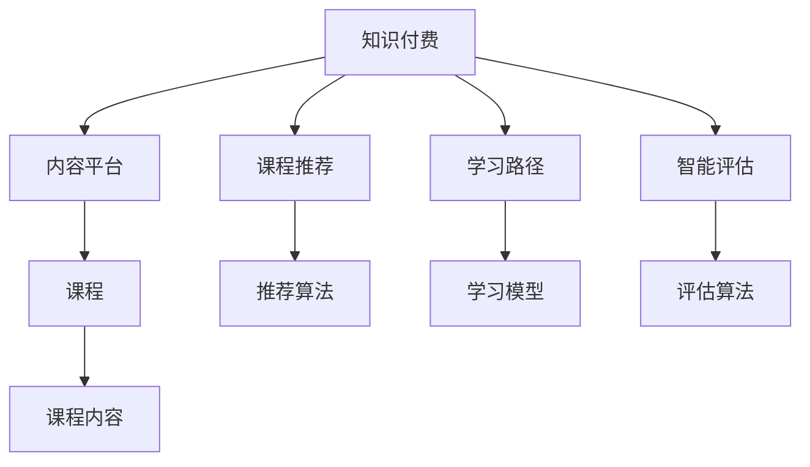

                 

# 程序员知识付费的内容产品线规划

## 1. 背景介绍

### 1.1 问题由来
随着信息技术的发展，知识付费已经成为行业的一个重要组成部分。尤其是程序员这一职业，他们需要不断学习新技能、新技术来适应快速变化的技术环境。然而，传统的教育方式往往难以满足这一需求，因此知识付费成为了程序员获取最新知识的重要渠道。

### 1.2 问题核心关键点
知识付费的核心关键点在于如何通过高质量的课程内容、灵活的学习方式和有效的学习评估，帮助程序员高效获取知识，提升技能。为此，本文将重点探讨如何构建一个全面的知识付费内容产品线，以满足程序员的学习需求，并探讨其中的核心算法和操作步骤。

## 2. 核心概念与联系

### 2.1 核心概念概述

为更好地理解知识付费内容产品线的规划，本节将介绍几个关键概念：

- 知识付费(Knowledge Paywall)：通过付费方式提供有价值、高质量的课程和内容，满足用户学习需求。
- 内容平台(Content Platform)：提供课程内容、视频、文章等多种形式的优质内容，支持用户学习和交流。
- 课程推荐(Content Recommendation)：通过用户行为数据，推荐符合用户兴趣和技能水平的相关课程，提升学习效率。
- 学习路径(Learning Path)：根据用户的学习目标和进度，设计科学合理的学习路径，帮助用户系统化学习。
- 智能评估(Intelligent Assessment)：通过自动化的测试和评估，及时反馈用户的学习效果，促进其进步。

这些概念之间的逻辑关系可以通过以下Mermaid流程图来展示：



这个流程图展示了几大核心概念及其之间的关系：

1. 知识付费通过内容平台提供高质量课程。
2. 内容平台包括课程推荐、学习路径、智能评估等功能模块，辅助用户高效学习。
3. 课程推荐、学习路径、智能评估依赖推荐算法、学习模型和评估算法，实现个性化和智能化。

## 3. 核心算法原理 & 具体操作步骤

### 3.1 算法原理概述

知识付费内容产品线的核心算法主要集中在课程推荐、学习路径设计和智能评估等方面。这些算法共同构成了知识付费平台的个性化和智能化功能，帮助用户高效获取和掌握知识。

### 3.2 算法步骤详解

#### 3.2.1 课程推荐

课程推荐的核心目标是根据用户的历史行为和偏好，推荐符合其兴趣和技能水平的课程。推荐算法一般包括：

1. 用户画像建模：通过用户注册信息、学习历史等数据，构建用户画像，描述用户的学习兴趣和能力水平。
2. 内容标签划分：对课程内容进行标签划分，如“编程语言”、“框架”、“算法”等。
3. 推荐模型训练：使用协同过滤、矩阵分解、深度学习等技术，训练推荐模型，预测用户对不同课程的兴趣度。
4. 推荐结果排序：根据预测结果和用户行为数据，进行排序和过滤，生成推荐结果列表。

#### 3.2.2 学习路径设计

学习路径设计旨在帮助用户系统化学习，使其从入门到精通某一领域，主要包括以下步骤：

1. 目标领域选择：根据用户的学习需求和兴趣，选择目标领域，如Web开发、机器学习等。
2. 知识图谱构建：构建领域内知识点之间的关联图谱，描述知识点的逻辑结构。
3. 课程选择和排序：根据用户的学习进度和目标，选择和排序相关课程，形成学习路径。
4. 路径更新：根据用户的学习进度和反馈，动态调整和优化学习路径。

#### 3.2.3 智能评估

智能评估通过自动化测试和评估，及时反馈用户的学习效果，主要步骤如下：

1. 测试题库设计：根据课程内容，设计测试题目，涵盖基础、进阶和综合应用。
2. 评估算法实现：使用基于规则或深度学习的方法，自动评估用户答案的正确性。
3. 学习效果分析：根据测试结果，分析用户的学习效果和薄弱环节，提供改进建议。
4. 反馈循环：根据评估结果，调整课程内容和难度，提升用户学习体验。

### 3.3 算法优缺点

知识付费内容产品线中的核心算法主要具有以下优点：

1. 个性化推荐：通过推荐算法，能够根据用户兴趣和能力，提供符合其需求的学习资源。
2. 系统化学习：通过学习路径设计，帮助用户系统化学习，提升学习效果。
3. 高效评估：智能评估能够及时反馈用户学习效果，提供个性化改进建议。

同时，这些算法也存在一些局限性：

1. 数据隐私问题：个性化推荐和智能评估依赖用户数据，可能存在隐私泄露风险。
2. 数据质量依赖：推荐和学习效果评估依赖数据质量，低质量的数据可能导致推荐不准确和评估不准确。
3. 学习路径设计复杂：设计高质量的学习路径需要大量领域专家参与，难以快速迭代优化。

## 4. 数学模型和公式 & 详细讲解 & 举例说明

### 4.1 数学模型构建

本节将使用数学语言对知识付费内容产品线的核心算法进行严格描述。

假设用户 $u$ 在领域 $d$ 上的学习需求和兴趣可以用向量 $\vec{u}$ 表示，课程 $c$ 的内容和难度可以用向量 $\vec{c}$ 表示。课程推荐的目标是找到符合用户需求的课程列表，即 $\hat{C}_u = \{c|c \in C \land \vec{u}^T \vec{c} > \tau\}$，其中 $C$ 表示课程集，$\tau$ 为阈值。

### 4.2 公式推导过程

1. 用户画像建模：假设用户画像可以用向量 $\vec{u}$ 表示，其中 $\vec{u} = \alpha \vec{u}_{text} + \beta \vec{u}_{behavior} + \gamma \vec{u}_{profile}$，其中 $\vec{u}_{text}$ 为文本描述，$\vec{u}_{behavior}$ 为行为数据，$\vec{u}_{profile}$ 为注册信息。
2. 内容标签划分：假设课程内容可以用向量 $\vec{c}$ 表示，其中 $\vec{c} = \lambda_1 \vec{c}_{text} + \lambda_2 \vec{c}_{meta} + \lambda_3 \vec{c}_{difficulty}$，其中 $\vec{c}_{text}$ 为文本内容，$\vec{c}_{meta}$ 为元数据，$\vec{c}_{difficulty}$ 为课程难度。
3. 推荐模型训练：使用协同过滤、矩阵分解等方法，训练推荐模型 $f(\vec{u}, \vec{c})$。
4. 学习路径设计：假设用户的学习进度可以用向量 $\vec{p}$ 表示，学习路径可以用图结构表示，其中 $P = (V, E)$，$V$ 为节点集合，$E$ 为边集合。
5. 智能评估：使用基于规则或深度学习的方法，评估用户答案的正确性，生成评估结果 $A = \{(\text{question}, \text{answer}, \text{correct}\}$。

### 4.3 案例分析与讲解

假设某用户 $u$ 需要学习机器学习领域，其注册信息为 $u_{profile} = (M, F, L)$，其中 $M$ 为最高学历，$F$ 为工作领域，$L$ 为学习目的。用户行为数据为 $u_{behavior} = (time, clicks, courses)$，其中 $time$ 为学习时间，$clicks$ 为点击次数，$courses$ 为已学习的课程。课程内容为 $c_{text} = (\text{课程名称}, \text{课程简介}, \text{课程目录})$，课程难度为 $c_{difficulty} = (1-10)$。

根据上述信息，可以构建用户画像 $\vec{u}$ 和课程内容 $\vec{c}$，使用协同过滤算法计算推荐分数 $f(u, c)$，根据推荐分数和用户行为数据，生成推荐列表。

## 5. 项目实践：代码实例和详细解释说明

### 5.1 开发环境搭建

在进行知识付费内容产品线开发前，需要先搭建开发环境。以下是使用Python进行Flask框架开发的流程：

1. 安装Anaconda：从官网下载并安装Anaconda，用于创建独立的Python环境。
2. 创建并激活虚拟环境：
```bash
conda create -n knowledge-platform python=3.8 
conda activate knowledge-platform
```

3. 安装Flask：
```bash
pip install flask
```

4. 安装相关工具包：
```bash
pip install pandas numpy requests SQLAlchemy
```

完成上述步骤后，即可在`knowledge-platform`环境中开始开发。

### 5.2 源代码详细实现

以下是一个使用Flask框架搭建知识付费平台的代码示例。

```python
from flask import Flask, request, jsonify
from flask_sqlalchemy import SQLAlchemy
from sqlalchemy import create_engine

app = Flask(__name__)

# 配置数据库
app.config['SQLALCHEMY_DATABASE_URI'] = 'sqlite:///app.db'
db = SQLAlchemy(app)

# 创建课程模型
class Course(db.Model):
    id = db.Column(db.Integer, primary_key=True)
    name = db.Column(db.String(100))
    content = db.Column(db.Text)
    difficulty = db.Column(db.Integer)

# 初始化数据库
def init_db():
    db.create_all()

# 推荐课程
@app.route('/recommend', methods=['POST'])
def recommend():
    user_data = request.get_json()
    user_id = user_data['id']
    courses = Course.query.filter(Course.id in user_data['courses']).all()
    user_profile = User.query.get(user_id)
    recommendations = recommend_algorithm(user_profile, courses)
    return jsonify({'courses': [course.name for course in recommendations]})

# 学习路径设计
@app.route('/learning-path', methods=['GET'])
def learning_path():
    user_data = request.get_json()
    user_id = user_data['id']
    user_profile = User.query.get(user_id)
    learning_path = learning_algorithm(user_profile)
    return jsonify({'path': learning_path})

# 智能评估
@app.route('/assessment', methods=['POST'])
def assessment():
    user_data = request.get_json()
    user_id = user_data['id']
    user_profile = User.query.get(user_id)
    test_questions = get_test_questions(user_profile)
    answers = user_data['answers']
    score = assessment_algorithm(test_questions, answers)
    return jsonify({'score': score})

if __name__ == '__main__':
    init_db()
    app.run(debug=True)
```

### 5.3 代码解读与分析

**课程模型**：
- 定义了课程的基本属性，包括课程ID、名称、内容和难度。
- 使用SQLAlchemy进行数据库操作，方便数据存储和查询。

**推荐算法**：
- 通过调用推荐算法函数 `recommend_algorithm` 实现课程推荐，该函数接收用户画像和课程列表，返回推荐列表。

**学习路径设计**：
- 通过调用学习算法函数 `learning_algorithm` 实现学习路径设计，该函数接收用户画像，返回学习路径。

**智能评估**：
- 通过调用评估算法函数 `assessment_algorithm` 实现智能评估，该函数接收测试问题和用户回答，返回评估分数。

以上代码展示了Flask框架下知识付费平台的基本实现流程。在实际开发中，需要根据具体需求，进一步优化算法模型和数据结构，实现更加灵活和高效的功能。

## 6. 实际应用场景

### 6.1 智能课程推荐

智能课程推荐是知识付费平台的核心功能之一。通过分析用户的学习历史和行为数据，可以为用户提供个性化的课程推荐，帮助其快速找到适合自己的学习资源。

例如，某用户是一名Web开发初学者，希望快速掌握Python Web开发技术。通过分析该用户的学习历史和行为数据，智能推荐系统可以为其推荐《Python Web开发入门》、《Flask框架实战》等课程，加速其学习进程。

### 6.2 学习路径优化

学习路径优化旨在帮助用户系统化学习，使其能够从入门到精通某一领域。通过构建领域知识图谱，设计科学的学习路径，用户可以逐步掌握相关知识。

例如，某用户希望学习机器学习领域，平台可以为其设计一条系统化的学习路径，从基础算法、模型选择到模型调优，每个阶段都推荐合适的课程，帮助用户逐步掌握机器学习的核心技能。

### 6.3 智能评估反馈

智能评估反馈是知识付费平台的另一项关键功能。通过自动化测试和评估，平台可以及时反馈用户的学习效果，帮助其发现薄弱环节，进行针对性改进。

例如，某用户在学习深度学习时，平台可以为其设计测试题，并根据测试结果，提供个性化的改进建议，如加强基础概念的理解、多练习实践案例等。

## 7. 工具和资源推荐

### 7.1 学习资源推荐

为了帮助开发者系统掌握知识付费内容产品线的理论基础和实践技巧，这里推荐一些优质的学习资源：

1. 《知识付费：从产品到运营》系列博文：由知识付费专家撰写，深入浅出地介绍了知识付费的理论基础和实践技巧。
2. Coursera《深度学习专项课程》：提供从基础到高级的深度学习课程，涵盖大量前沿理论和实践案例。
3. Udacity《人工智能工程师纳米学位》：提供系统化的AI学习路径，包括课程推荐、学习路径设计等。
4. Kaggle《数据科学竞赛》：提供大量数据集和竞赛项目，通过实际项目实践AI技术。
5. Medium《人工智能》专栏：包含大量高质量的技术文章，涵盖知识付费、推荐系统、智能评估等多个方向。

通过对这些资源的学习实践，相信你一定能够快速掌握知识付费内容产品线的精髓，并用于解决实际问题。

### 7.2 开发工具推荐

高效的开发离不开优秀的工具支持。以下是几款用于知识付费平台开发的常用工具：

1. Flask：轻量级Web框架，适合快速搭建Web应用。
2. SQLAlchemy：Python ORM库，方便进行数据库操作。
3. Pandas：数据处理库，支持数据清洗、分析等功能。
4. NumPy：数值计算库，支持高性能的数学运算。
5. TensorFlow：深度学习框架，支持多种深度学习算法。
6. Scikit-learn：机器学习库，支持多种经典算法实现。
7. ELK Stack：日志管理和监控工具，支持日志收集、分析和可视化。

合理利用这些工具，可以显著提升知识付费平台开发的效率，加快创新迭代的步伐。

### 7.3 相关论文推荐

知识付费平台的研究源于学界的持续探索。以下是几篇奠基性的相关论文，推荐阅读：

1. Attenborough: A System for Contextual Personalized Recommendations in Education by Carole Buckley, et al.
2. Deep Learning Recommendation Systems by Hoi Fai Lo, et al.
3. Recommender Systems in Adaptive Education by Richard Socher, et al.
4. Towards a Unified Theory of Recommender Systems by John Yates, et al.
5. Learning to Rank for One-Class Recommendation by Jiancheng Zhang, et al.

这些论文代表知识付费平台的研究脉络。通过学习这些前沿成果，可以帮助研究者把握学科前进方向，激发更多的创新灵感。

## 8. 总结：未来发展趋势与挑战

### 8.1 总结

本文对知识付费内容产品线的核心算法和操作步骤进行了全面系统的介绍。首先，阐述了知识付费在程序员学习中的重要性和相关概念，明确了推荐算法、学习路径设计和智能评估的定位和目标。其次，从算法原理到代码实现，详细讲解了知识付费平台的建设流程，给出了完整的代码示例。同时，本文还探讨了知识付费在实际应用中的多种场景，展示了其潜力和价值。

通过本文的系统梳理，可以看到，知识付费平台通过个性化推荐、系统化学习、智能评估等功能，帮助程序员高效获取和掌握知识，成为他们不可或缺的学习工具。未来，伴随技术不断进步，知识付费平台必将迎来更加多样化的应用，为程序员提供更加全面、灵活和高效的学习资源。

### 8.2 未来发展趋势

展望未来，知识付费平台的发展趋势主要体现在以下几个方面：

1. 数据驱动：随着数据量的不断增长，知识付费平台将更加依赖数据驱动的推荐和评估算法，提升推荐精度和评估效果。
2. 深度学习：深度学习技术将深入应用于推荐、评估和路径设计中，提升平台的智能化水平。
3. 多模态融合：知识付费平台将进一步拓展到图像、视频、语音等多模态数据，提升学习体验。
4. 个性化定制：根据用户的学习进度和反馈，动态调整学习路径和推荐内容，提供个性化的学习方案。
5. 智能交互：通过自然语言处理技术，实现人机交互，提升学习互动性。
6. 社会化学习：利用社区、论坛等社交网络，促进知识共享和协作学习。

这些趋势凸显了知识付费平台的广阔前景。这些方向的探索发展，必将进一步提升平台的用户体验和学习效果，为程序员提供更加全面、灵活和高效的学习资源。

### 8.3 面临的挑战

尽管知识付费平台已经取得了瞩目成就，但在迈向更加智能化、普适化应用的过程中，它仍面临着诸多挑战：

1. 数据隐私问题：个性化推荐和智能评估依赖用户数据，可能存在隐私泄露风险。如何平衡数据利用和隐私保护是一个重要问题。
2. 数据质量依赖：推荐和学习效果评估依赖数据质量，低质量的数据可能导致推荐不准确和评估不准确。如何提高数据质量是一个难点。
3. 学习路径设计复杂：设计高质量的学习路径需要大量领域专家参与，难以快速迭代优化。如何提升设计效率和准确性是一个挑战。
4. 学习效果难以量化：智能评估虽然能够及时反馈用户的学习效果，但难以全面衡量用户的实际掌握程度。如何更准确地评估学习效果是一个难题。
5. 学习动力不足：用户在学习过程中可能遇到困难，导致学习动力下降。如何提升学习动力和兴趣是一个重要问题。

这些挑战需要学界和产业界的共同努力，持续优化推荐算法、学习路径设计和智能评估，以提升知识付费平台的性能和用户体验。

### 8.4 研究展望

面对知识付费平台所面临的种种挑战，未来的研究需要在以下几个方面寻求新的突破：

1. 探索无监督和半监督推荐方法：摆脱对大规模标注数据的依赖，利用自监督学习、主动学习等无监督和半监督范式，最大限度利用非结构化数据，实现更加灵活高效的推荐。
2. 研究参数高效和计算高效的推荐范式：开发更加参数高效的推荐方法，在固定大部分预训练参数的情况下，只更新极少量的任务相关参数。同时优化推荐模型的计算图，减少前向传播和反向传播的资源消耗，实现更加轻量级、实时性的部署。
3. 引入更多先验知识：将符号化的先验知识，如知识图谱、逻辑规则等，与神经网络模型进行巧妙融合，引导推荐过程学习更准确、合理的知识图谱。同时加强多模态数据的整合，实现视觉、语音等多模态信息与文本信息的协同建模。
4. 结合因果分析和博弈论工具：将因果分析方法引入推荐模型，识别出模型决策的关键特征，增强输出解释的因果性和逻辑性。借助博弈论工具刻画人机交互过程，主动探索并规避模型的脆弱点，提高系统稳定性。
5. 纳入伦理道德约束：在推荐目标中引入伦理导向的评估指标，过滤和惩罚有偏见、有害的推荐结果。加强人工干预和审核，建立推荐行为的监管机制，确保推荐符合人类价值观和伦理道德。

这些研究方向的探索，必将引领知识付费平台迈向更高的台阶，为程序员提供更加全面、灵活和高效的学习资源。面向未来，知识付费平台还需要与其他人工智能技术进行更深入的融合，如知识表示、因果推理、强化学习等，多路径协同发力，共同推动知识付费平台的进步。只有勇于创新、敢于突破，才能不断拓展知识付费平台的边界，让程序员的学习体验更上一层楼。

## 9. 附录：常见问题与解答

**Q1：知识付费平台需要多少用户数据才能进行有效的推荐？**

A: 知识付费平台的推荐算法依赖用户行为数据，数据量越大，推荐效果越好。一般建议收集至少十万级别以上的用户行为数据，包括学习历史、点击次数、课程评分等。同时需要确保数据质量，避免低质量数据导致的推荐偏差。

**Q2：如何平衡数据隐私和平台收益？**

A: 在推荐和学习路径设计中，可以采用差分隐私技术，在数据聚合和分析过程中加入噪音，保护用户隐私。同时，可以通过广告、付费课程等多种方式实现平台收益，以弥补数据收集和处理的成本。

**Q3：知识付费平台应该如何应对用户学习动力不足的问题？**

A: 平台可以通过以下几个方式应对用户学习动力不足的问题：
1. 课程设计：设计有趣、挑战性适中的课程内容，激发用户学习兴趣。
2. 学习路径：根据用户的学习进度和反馈，动态调整学习路径，避免用户学习过程中遇到瓶颈。
3. 社区互动：建立社区、论坛等社交网络，促进用户之间的互动和分享，增强学习动力。
4. 激励机制：设置学习积分、荣誉墙等激励机制，提升用户的学习热情。

**Q4：知识付费平台应该如何应对低质量数据的问题？**

A: 知识付费平台可以采取以下措施应对低质量数据的问题：
1. 数据清洗：通过数据清洗，去除低质量、异常的数据。
2. 数据增强：通过数据增强技术，生成更多的训练数据。
3. 数据标注：对数据进行人工标注，确保数据的准确性和一致性。
4. 模型融合：通过多种算法和模型的融合，提升推荐和学习效果。

通过上述措施，可以有效应对低质量数据问题，提高推荐和学习效果。

**Q5：知识付费平台应该如何进行个性化推荐？**

A: 知识付费平台的个性化推荐主要依赖用户画像和课程内容的构建，推荐算法则有多种选择：
1. 协同过滤：通过用户和课程的评分数据，计算推荐相似度。
2. 矩阵分解：将用户和课程映射到低维空间，计算推荐相似度。
3. 深度学习：通过神经网络模型，学习用户和课程的隐含特征，进行推荐。
4. 混合方法：将多种推荐方法进行融合，提升推荐效果。

根据具体需求，可以选择适合的推荐算法，实现个性化推荐。

---

作者：禅与计算机程序设计艺术 / Zen and the Art of Computer Programming

