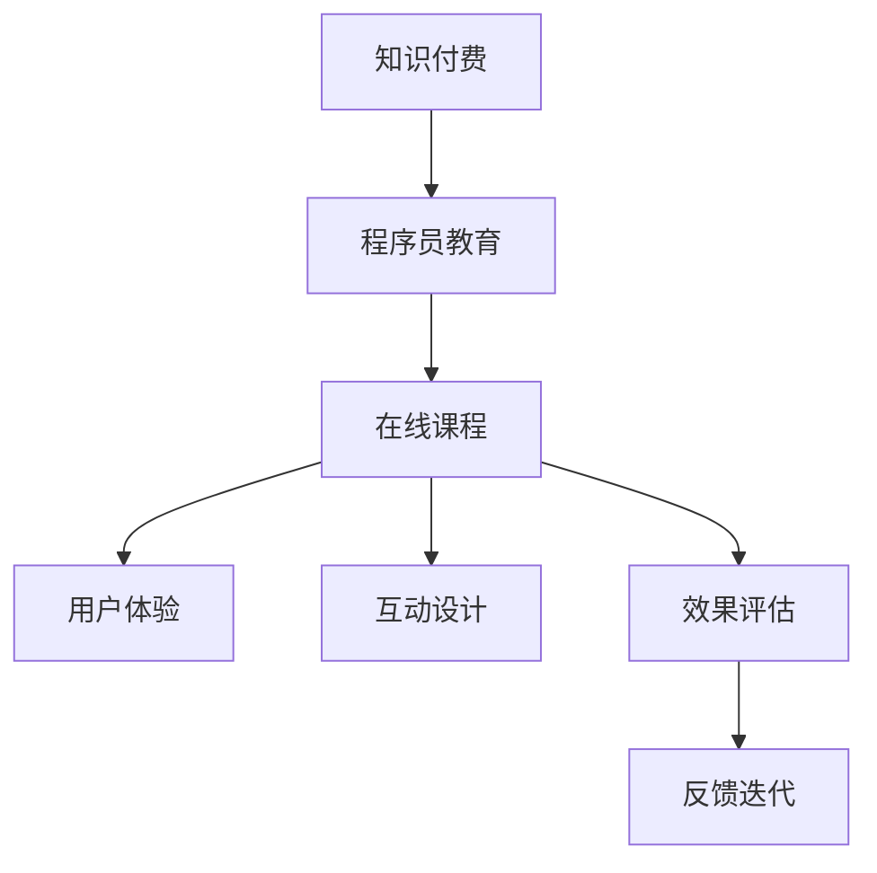

                 

# 程序员知识付费：打造体验课程

> 关键词：知识付费, 程序员教育, 在线课程, 用户体验, 互动设计, 效果评估

## 1. 背景介绍

随着知识经济的崛起，越来越多的人开始重视通过知识付费来提升自己。特别是在程序员这一高需求、高薪水的职业领域，程序员的知识付费趋势尤为明显。然而，尽管在线教育平台和工具层出不穷，但高质量、可操作的程序员课程仍然稀缺。本文将探讨如何打造一个基于程序员的知识付费体验课程，通过提升用户体验、设计互动元素和进行效果评估，以实现最佳教学效果。

## 2. 核心概念与联系

### 2.1 核心概念概述

为了更好地理解本文的主题，这里介绍几个关键的概念：

- **知识付费**：即消费者通过付费获取知识，提高个人技能和职业竞争力的商业模式。
- **程序员教育**：面向程序员的知识教育，包括编程技能、软件工程、算法等领域的知识培训。
- **在线课程**：通过互联网平台提供的学习资源，以视频、文本、代码等多种形式呈现的课程内容。
- **用户体验（UX）**：指用户在使用产品或服务时的感受和体验，是衡量课程成功的重要指标。
- **互动设计**：在课程设计中融入互动元素，如讨论区、作业、测验等，增强学习体验。
- **效果评估**：通过测试和反馈，评估课程的效果和改进空间。

这些概念之间的联系密切，共同构成了知识付费课程的核心框架。通过优秀的用户体验、丰富的互动设计以及有效的效果评估，我们可以打造一个既能满足程序员学习需求，又能带来良好体验的在线课程。

### 2.2 核心概念原理和架构的 Mermaid 流程图



这个流程图展示了知识付费、程序员教育、在线课程、用户体验、互动设计、效果评估以及反馈迭代之间的逻辑关系。课程的开发和优化是一个持续迭代的过程，而用户体验、互动设计和效果评估是这一过程中的关键环节。

## 3. 核心算法原理 & 具体操作步骤

### 3.1 算法原理概述

本节将简要介绍课程开发的算法原理和具体操作步骤。

基于知识付费的程序员在线课程，其核心算法原理可以概括为以下几个步骤：

1. **需求分析**：通过市场调研和用户反馈，确定课程内容需求。
2. **课程设计**：设计课程结构，选择合适的教学方法和互动元素。
3. **内容制作**：将课程内容以视频、文本、代码等多种形式呈现。
4. **用户体验优化**：通过UI/UX设计提升用户体验。
5. **互动设计实施**：在课程中加入讨论区、作业、测验等互动元素。
6. **效果评估与反馈**：通过测试和反馈机制，评估课程效果，收集用户意见。
7. **迭代改进**：根据评估结果和反馈，进行课程内容和设计的迭代优化。

### 3.2 算法步骤详解

接下来，我们将详细介绍各个操作步骤的具体内容。

#### 3.2.1 需求分析

需求分析是课程开发的第一步，其目的是确定课程内容和形式，以满足目标用户的需求。具体步骤如下：

1. **市场调研**：通过问卷调查、访谈等方式，收集目标用户群体的需求和痛点。
2. **用户画像**：基于调研结果，构建目标用户画像，了解其背景、技能水平和职业需求。
3. **需求梳理**：将用户需求转化为具体的课程目标，如提升编程技能、学习特定技术栈等。

#### 3.2.2 课程设计

课程设计是决定课程内容和形式的关键步骤。具体步骤如下：

1. **课程结构设计**：根据需求梳理结果，设计课程的整体结构，包括各章节的主题和目标。
2. **教学方法选择**：选择合适的教学方法，如讲授、项目驱动、游戏化学习等。
3. **互动元素设计**：在课程中加入互动元素，如讨论区、作业、测验等，增强学习体验。

#### 3.2.3 内容制作

内容制作是将课程内容以多媒体形式呈现的过程。具体步骤如下：

1. **视频制作**：录制和剪辑教学视频，确保内容准确、生动。
2. **文本编写**：编写课程讲义、作业和测验题，确保内容详细、清晰。
3. **代码编写**：编写示例代码和项目案例，确保内容实用、可操作。

#### 3.2.4 用户体验优化

用户体验优化是提升用户满意度的关键步骤。具体步骤如下：

1. **UI设计**：设计简洁、直观的课程界面，便于用户操作。
2. **UX设计**：通过用户操作流程优化，提高用户体验，减少学习障碍。
3. **互动设计**：在课程中加入互动元素，如讨论区、作业、测验等，增强学习体验。

#### 3.2.5 互动设计实施

互动设计实施是增强课程互动性的关键步骤。具体步骤如下：

1. **讨论区**：在课程中加入讨论区，鼓励用户互相交流和学习。
2. **作业和测验**：设计作业和测验，通过即时反馈帮助用户巩固知识。
3. **互动挑战**：设计互动挑战，激发用户兴趣，提高学习动力。

#### 3.2.6 效果评估与反馈

效果评估与反馈是持续改进课程的关键步骤。具体步骤如下：

1. **测试设计**：设计测试题目，评估用户的学习效果。
2. **反馈收集**：通过调查问卷、用户评论等方式收集用户反馈。
3. **结果分析**：分析测试结果和用户反馈，找出课程的优点和不足。

#### 3.2.7 迭代改进

迭代改进是根据评估结果和反馈，持续优化课程内容和设计的过程。具体步骤如下：

1. **内容优化**：根据测试结果和用户反馈，优化课程内容和形式。
2. **设计改进**：根据用户体验和互动反馈，改进课程界面和互动元素。
3. **持续更新**：根据技术和市场变化，定期更新课程内容，保持课程新鲜度。

### 3.3 算法优缺点

基于知识付费的程序员在线课程，其核心算法原理具有以下优点：

1. **针对性强**：通过需求分析，课程内容针对性强，能更好地满足用户需求。
2. **互动性强**：通过互动设计，课程学习体验更好，用户参与度高。
3. **效果评估可靠**：通过效果评估和反馈机制，课程效果更可靠，持续改进更科学。

同时，也存在一些缺点：

1. **资源需求高**：课程开发和持续优化需要大量的人力和资源投入。
2. **更新难度大**：课程内容和形式需要定期更新，以保持竞争力，但更新难度较大。
3. **用户参与度依赖**：课程效果和用户参与度高度依赖于用户的主动性和互动元素的设计。

### 3.4 算法应用领域

基于知识付费的程序员在线课程，其核心算法原理可以应用于以下领域：

1. **软件开发**：面向程序员的编程技能、软件工程、算法等领域的知识培训。
2. **数据科学**：面向数据分析师和数据科学家的数据处理、建模、分析等知识培训。
3. **人工智能**：面向人工智能工程师的机器学习、深度学习、自然语言处理等知识培训。
4. **网络安全**：面向网络安全工程师的安全渗透、漏洞检测、安全策略设计等知识培训。

这些领域都是知识付费的潜在市场，基于核心算法原理的程序员在线课程可以满足这些领域的知识需求。

## 4. 数学模型和公式 & 详细讲解 & 举例说明

### 4.1 数学模型构建

为了更准确地评估课程效果，我们可以构建数学模型来量化用户的学习进度和掌握程度。假设用户在学习课程中的表现可以用以下变量来描述：

- $x_i$：第 $i$ 个用户的初始水平。
- $x_f$：第 $i$ 个用户完成课程后的水平。
- $t$：课程学习时间。
- $u$：课程学习效果系数。

则用户完成课程后的学习效果可以用以下公式表示：

$$
x_f = x_i + u \cdot t
$$

其中 $u$ 表示用户学习课程的效果系数，可以通过测试和评估来确定。

### 4.2 公式推导过程

接下来，我们将推导学习效果系数的计算公式。假设课程中有 $n$ 个测试题目，第 $i$ 个用户正确回答了 $c_i$ 个题目，则用户完成课程后的学习效果系数可以表示为：

$$
u = \frac{1}{n} \sum_{i=1}^{n} \frac{c_i}{x_i}
$$

其中 $x_i$ 为第 $i$ 个用户的初始水平，$c_i$ 为第 $i$ 个用户正确回答的题目数量，$n$ 为测试题目的数量。

### 4.3 案例分析与讲解

为了更好地理解公式的应用，我们举一个简单的案例。假设有一门编程课程，其中有 10 个测试题目，每个用户的初始水平都为 0。经过学习，用户 A 正确回答了 8 个题目，用户 B 正确回答了 5 个题目，则用户 A 和用户 B 的学习效果系数分别为：

$$
u_A = \frac{8}{0} = \infty \\
u_B = \frac{5}{0} = \infty
$$

由于初始水平为 0，导致无法计算学习效果系数，因此我们通常采用一定的正则化方法，如对初始水平进行平滑处理，避免无穷大问题。

## 5. 项目实践：代码实例和详细解释说明

### 5.1 开发环境搭建

在开始课程开发之前，我们需要准备开发环境。以下是使用Python进行Django开发的第一步：

1. 安装Anaconda：从官网下载并安装Anaconda，用于创建独立的Python环境。
2. 创建并激活虚拟环境：
```bash
conda create -n myenv python=3.8 
conda activate myenv
```
3. 安装Django：
```bash
pip install django
```

### 5.2 源代码详细实现

接下来，我们将以一个简单的编程课程为例，展示如何使用Django进行课程开发的代码实现。

```python
# 创建Django项目和应用
python manage.py startproject myproject
cd myproject
python manage.py startapp myapp

# 设置URL路由
from django.conf.urls import url
urlpatterns = [
    url(r'^$', views.index, name='index'),
]

# 创建视图函数
from django.shortcuts import render
def index(request):
    return render(request, 'index.html')
```

### 5.3 代码解读与分析

让我们再详细解读一下关键代码的实现细节：

**views.py**：
- `index`函数：展示课程首页，包含课程介绍、课程目录、学习进度等页面内容。
- `render`函数：渲染HTML页面，展示课程内容。

**index.html**：
- HTML页面：包含课程介绍、课程目录、学习进度等静态内容，可通过Django模板系统进行动态渲染。

### 5.4 运行结果展示

运行上述代码，在浏览器中访问课程首页，即可展示完整的课程内容。

## 6. 实际应用场景

### 6.1 软件开发

在软件开发领域，基于知识付费的程序员在线课程可以提供从基础编程技能到高级编程技巧的全方位培训。通过课程设计，可以涵盖从Python、Java、C++等编程语言，到数据结构、算法、软件工程等方面的知识。学员可以通过课程学习，提升编程能力，解决实际问题，并在职业发展中获得更多机会。

### 6.2 数据科学

数据科学领域是知识付费的重要应用场景。通过在线课程，学员可以学习数据处理、建模、分析等方面的知识，掌握常用的数据分析工具和技术，如Python、R、SQL等，以及常用的数据可视化工具，如Tableau、Power BI等。数据科学家通过课程学习，可以提升数据处理和分析能力，实现职业转型，并在数据分析领域获得更多机会。

### 6.3 人工智能

人工智能是另一个重要的知识付费应用场景。通过在线课程，学员可以学习机器学习、深度学习、自然语言处理等方面的知识，掌握常用的AI框架和工具，如TensorFlow、PyTorch、Scikit-learn等。AI工程师通过课程学习，可以提升AI开发和应用能力，实现职业转型，并在AI领域获得更多机会。

### 6.4 网络安全

网络安全领域也需要高质量的在线课程。通过在线课程，学员可以学习安全渗透、漏洞检测、安全策略设计等方面的知识，掌握常用的安全工具和技术，如Kali Linux、Metasploit等。网络安全工程师通过课程学习，可以提升安全能力和防护水平，实现职业转型，并在网络安全领域获得更多机会。

## 7. 工具和资源推荐

### 7.1 学习资源推荐

为了帮助开发者系统掌握知识付费课程的开发和优化，这里推荐一些优质的学习资源：

1. **《Django实战》**：一本关于Django框架开发的经典书籍，涵盖Django的各个方面，是入门Django开发的好资料。
2. **《Python网络编程》**：介绍了网络编程的基础知识和Python在网络编程中的应用，是开发在线课程必备的理论基础。
3. **Coursera、Udacity**：提供大量高质量的在线课程，涵盖软件开发、数据科学、人工智能、网络安全等各个领域，是学习知识付费课程的好平台。
4. **edX**：提供大量高质量的在线课程，涵盖软件开发、数据科学、人工智能、网络安全等各个领域，是学习知识付费课程的好平台。
5. **Kaggle**：提供大量高质量的数据集和竞赛，是提升数据科学和机器学习技能的好平台。

通过对这些资源的学习实践，相信你一定能够快速掌握知识付费课程的开发技巧，并用于解决实际的在线课程问题。

### 7.2 开发工具推荐

高效的开发离不开优秀的工具支持。以下是几款用于知识付费课程开发的常用工具：

1. **Django**：基于Python的Web框架，提供丰富的API和插件，支持构建高质量的在线课程平台。
2. **Jupyter Notebook**：提供交互式的编程环境，支持展示代码、运行测试、生成报告等多种功能，是开发编程课程的好工具。
3. **GitHub**：提供代码托管和版本控制服务，支持多人协作开发，是开发在线课程的好平台。
4. **MongoDB**：提供NoSQL数据库服务，支持大规模数据的存储和管理，是开发在线课程的好工具。
5. **AWS、Google Cloud、阿里云**：提供云服务支持，支持大规模的课程开发和部署，是开发在线课程的好平台。

合理利用这些工具，可以显著提升知识付费课程的开发效率，加快创新迭代的步伐。

### 7.3 相关论文推荐

知识付费课程的发展源于学界的持续研究。以下是几篇奠基性的相关论文，推荐阅读：

1. **《深度学习在在线课程中的研究与应用》**：介绍了深度学习在在线课程中的应用，包括内容推荐、学习路径优化等方面。
2. **《知识付费平台的用户行为分析与优化》**：通过数据分析，探讨了知识付费平台的用户行为，提出了优化策略，提高了用户参与度。
3. **《基于用户画像的知识付费推荐系统》**：通过构建用户画像，提出了个性化的知识付费推荐方案，提高了用户满意度。
4. **《在线课程的效果评估与反馈机制设计》**：介绍了在线课程的效果评估方法，设计了反馈机制，提高了课程效果。
5. **《知识付费平台的商业模式与挑战》**：探讨了知识付费平台的商业模式，分析了存在的问题和挑战，提出了优化建议。

这些论文代表了大语言模型微调技术的发展脉络。通过学习这些前沿成果，可以帮助研究者把握学科前进方向，激发更多的创新灵感。

## 8. 总结：未来发展趋势与挑战

### 8.1 总结

本文对知识付费课程的开发和优化进行了全面系统的介绍。首先阐述了知识付费课程的重要性，明确了课程开发和优化的核心算法原理和操作步骤。通过实际案例，展示了课程开发的具体过程和技术细节。

通过本文的系统梳理，可以看到，知识付费课程开发是一个跨学科、跨领域的系统工程，需要融合多种技术和方法。只有在数据、算法、工程、业务等多个维度协同发力，才能真正实现高质量的知识付费课程。

### 8.2 未来发展趋势

展望未来，知识付费课程将呈现以下几个发展趋势：

1. **个性化推荐**：基于用户行为和数据，实现个性化的知识推荐，提高学习效率和效果。
2. **交互式学习**：通过互动设计，提升学习体验和参与度，增强学习效果。
3. **混合学习模式**：结合线上和线下学习模式，提供更加灵活的学习方式。
4. **大规模数据应用**：通过大数据和人工智能技术，优化课程设计和效果评估，实现精准教学。
5. **多语言支持**：提供多语言支持，满足全球用户的学习需求。

这些趋势将进一步提升知识付费课程的教学效果和学习体验，推动知识付费市场的发展。

### 8.3 面临的挑战

尽管知识付费课程发展迅速，但在迈向更加智能化、普适化应用的过程中，仍然面临诸多挑战：

1. **资源投入高**：高质量的课程开发需要大量的人力和资源投入，成本较高。
2. **内容更新慢**：课程内容需要定期更新，以保持与时俱进，但更新难度较大。
3. **用户参与度低**：课程效果和用户参与度高度依赖于用户的主动性和互动元素的设计。
4. **平台竞争激烈**：知识付费平台众多，如何吸引和留住用户是一个重要问题。

解决这些挑战需要创新和突破，需要开发者不断探索和优化课程设计和开发流程，以提高课程质量和用户满意度。

### 8.4 研究展望

面向未来，知识付费课程的研究方向可以从以下几个方面进行探索：

1. **数据驱动**：通过大数据分析，优化课程设计和用户推荐，实现个性化教学。
2. **技术融合**：结合多种技术手段，如AR、VR、AI等，提升学习体验和效果。
3. **模式创新**：探索新的知识付费模式，如社区付费、按需付费等，提高用户参与度和满意度。
4. **社会责任**：注重社会责任和道德伦理，避免传播有害信息，提升课程质量和用户信任度。

这些方向将引领知识付费课程的持续发展，为知识付费市场注入新的活力。

## 9. 附录：常见问题与解答

**Q1：如何提升知识付费课程的用户参与度？**

A: 提升用户参与度是知识付费课程开发的重要目标。以下是一些具体方法：

1. **互动设计**：在课程中加入讨论区、作业、测验等互动元素，增强用户参与度。
2. **激励机制**：设置积分、排行榜等激励机制，激励用户积极参与。
3. **社区建设**：建立课程社区，鼓励用户互相交流和学习，增强用户粘性。
4. **内容更新**：定期更新课程内容，保持课程新鲜度，提高用户兴趣。
5. **用户反馈**：通过用户反馈机制，了解用户需求，不断优化课程设计和内容。

**Q2：如何评估知识付费课程的效果？**

A: 评估知识付费课程的效果是课程开发的必要环节。以下是一些具体方法：

1. **测试设计**：设计测试题目，评估用户的学习效果。
2. **用户调查**：通过问卷调查等方式，了解用户对课程的满意度。
3. **学习进度**：通过学习进度统计，了解用户的学习情况和进步程度。
4. **社区反馈**：通过课程社区的讨论和反馈，了解用户的使用体验和建议。
5. **长期追踪**：通过长期追踪，了解用户的学习效果和职业发展情况。

**Q3：如何优化知识付费课程的界面设计？**

A: 界面设计是课程开发的重要环节，以下是一些具体方法：

1. **简洁明了**：界面设计要简洁明了，用户操作流程直观。
2. **美观大方**：界面设计要美观大方，使用户愉悦。
3. **交互友好**：界面设计要交互友好，用户使用方便。
4. **动态展示**：通过动态展示效果，提升用户的学习体验。
5. **适配移动端**：界面设计要适配移动端，方便用户随时随地学习。

**Q4：如何提升知识付费课程的教学效果？**

A: 提升知识付费课程的教学效果是课程开发的关键目标。以下是一些具体方法：

1. **课程设计**：根据用户需求，设计合理的课程结构和内容。
2. **教学方法**：选择合适的教学方法，如讲授、项目驱动、游戏化学习等。
3. **互动元素**：在课程中加入讨论区、作业、测验等互动元素，增强学习体验。
4. **学习路径**：设计学习路径，帮助用户逐步掌握知识。
5. **学习支持**：提供学习支持，如视频讲解、代码示例、在线辅导等，帮助用户理解和掌握知识。

**Q5：如何确保知识付费课程的质量？**

A: 确保知识付费课程的质量是课程开发的重要目标。以下是一些具体方法：

1. **质量控制**：通过严格的质量控制，确保课程内容的准确性和实用性。
2. **用户反馈**：通过用户反馈，了解课程的优缺点，不断优化课程内容。
3. **持续更新**：根据技术和市场变化，定期更新课程内容，保持课程新鲜度。
4. **师资力量**：选择经验丰富的师资力量，提升课程的教学效果。
5. **评估机制**：设计评估机制，评估课程的效果和改进空间。

通过对这些问题的详细解答，相信你能够更好地理解知识付费课程的开发和优化方法，并用于解决实际的课程开发问题。

---

作者：禅与计算机程序设计艺术 / Zen and the Art of Computer Programming

