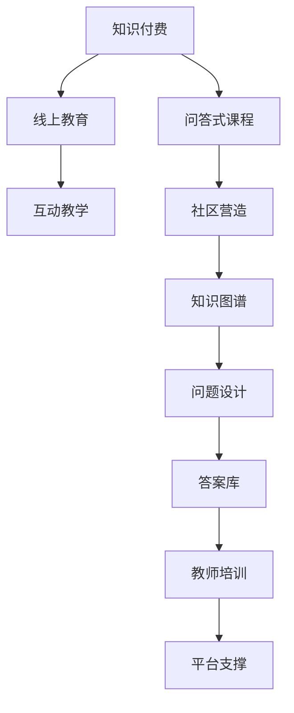

                 

# 程序员知识付费：打造问答式课程

> 关键词：知识付费, 程序员, 问答式课程, 线上教育, 互动教学, 社区营造

## 1. 背景介绍

### 1.1 问题由来

随着互联网技术的飞速发展，在线教育逐渐成为学习的主流方式之一。然而，传统在线课程往往以单向传授为主，难以激发学生的学习兴趣，且缺乏有效的反馈机制。相比之下，问答式课程因其互动性、趣味性、高效性等优点，逐渐成为线上教育的新趋势。

问答式课程的核心在于通过模拟现实中的问答场景，教师与学生之间进行即时互动，以问题解答的形式传授知识。这种方式不仅能够满足学生的个性化学习需求，还能通过实时反馈机制，及时纠正学习过程中的错误，提高学习效率。

### 1.2 问题核心关键点

问答式课程的构建需要考虑多个关键点：

- 知识图谱：构建课程所需的知识点结构，并保证知识点之间的逻辑关系清晰。
- 问题设计：设计出符合课程目标、难度适中的问题，覆盖所有需要掌握的知识点。
- 答案库：构建包含详细解析、例题和相关资料的丰富答案库，供学生参考。
- 教师培训：对教师进行针对性的培训，使其能够熟练使用问答平台，并提供高质量的答案。
- 互动机制：设计有效的互动机制，保证师生之间的即时交流，如即时答疑、点赞、评论等。
- 平台支撑：开发或采用支持问答式教学的平台，便于教师和学生的管理和互动。

### 1.3 问题研究意义

问答式课程作为一种创新的在线教育方式，能够极大地提升学生学习的主动性和参与度。其灵活性和互动性，使得学生能够根据自身需求，自主选择学习内容，并在实践中巩固知识。同时，问答式课程也为教师提供了全新的教学方法，有助于提高教学效果。

更重要的是，问答式课程能够促进知识的快速传播和共享，为知识付费提供新的商业模式。通过付费问答，知识创作者可以获得有价值的经济回报，形成正向激励，推动知识付费行业的持续健康发展。

## 2. 核心概念与联系

### 2.1 核心概念概述

为更好地理解问答式课程的构建，本节将介绍几个密切相关的核心概念：

- 知识付费：指通过付费获取高质量、专业化的知识和服务。知识付费平台以知识传播为核心，帮助学习者通过付费方式获取所需知识和技能。
- 问答式课程：通过模拟问答场景，教师与学生之间进行即时互动，以问题解答的形式传授知识。
- 线上教育：指通过互联网技术进行知识传播和学习的活动。在线教育平台的兴起，极大地扩大了教育资源的覆盖范围。
- 互动教学：指通过互动方式进行教学活动，如讨论、答疑、实践等，提升教学效果。
- 社区营造：通过构建学习社区，促进学习者之间的交流和协作，形成良好的学习氛围。

这些核心概念之间存在着紧密的联系，共同构成了问答式课程的知识体系和运行机制。

### 2.2 核心概念原理和架构的 Mermaid 流程图



这个流程图展示出知识付费与问答式课程之间的逻辑关系：

1. 知识付费是问答式课程的商业基础，提供经济激励。
2. 问答式课程是线上教育的一种形式，注重互动性。
3. 互动教学是问答式课程的核心方法，通过问题解答进行知识传授。
4. 社区营造是问答式课程的社区基础，促进学习者交流。
5. 知识图谱、问题设计和答案库是问答式课程的技术支撑，保证教学内容的科学性和可操作性。
6. 教师培训和平台支撑是问答式课程的运行保障，确保教学过程的顺畅。

## 3. 核心算法原理 & 具体操作步骤

### 3.1 算法原理概述

问答式课程的构建算法主要基于机器学习、自然语言处理和数据挖掘等技术。其核心思想是：

- 通过构建知识图谱，将课程所需的知识点结构化表示，并通过算法优化形成最优的知识体系。
- 利用自然语言处理技术，对问题进行语义分析和匹配，找到相应的知识点和答案。
- 通过数据挖掘技术，对学生的学习行为和反馈进行分析和优化，提升课程效果。

### 3.2 算法步骤详解

问答式课程的构建步骤主要包括：

**Step 1: 知识图谱构建**

- 收集课程所需的知识点，并构建知识点之间的逻辑关系。
- 使用图神经网络(Graph Neural Network, GNN)等技术，对知识图谱进行优化，形成最优的知识体系。
- 构建知识图谱的存储和查询结构，方便后续的教学和查询。

**Step 2: 问题设计**

- 根据课程目标和知识点，设计符合难度、覆盖全面的问题。
- 对问题进行语义分析，确保问题描述清晰、逻辑合理。
- 对问题进行标注，关联相应的知识点和答案。

**Step 3: 答案库构建**

- 收集与每个问题对应的答案，并进行详细的解析和例题展示。
- 构建答案库的查询结构，方便学生的查找和参考。
- 对答案库进行质量控制，确保答案的准确性和权威性。

**Step 4: 教师培训**

- 对教师进行针对性的培训，使其熟悉问答式课程的互动机制和平台操作。
- 组织教师进行模拟问答，检验其回答质量。
- 提供反馈机制，促进教师不断提高回答水平。

**Step 5: 互动机制设计**

- 设计有效的互动机制，如即时答疑、点赞、评论等，增强师生互动。
- 建立激励机制，如积分奖励、排行榜等，促进学生积极参与。
- 实现智能推荐系统，根据学生的学习行为和反馈，推荐适宜的问题和答案。

**Step 6: 平台支撑**

- 开发或采用支持问答式教学的平台，提供丰富的互动和交流功能。
- 确保平台的高可用性和稳定性，保障教学过程的顺利进行。
- 提供数据分析工具，帮助教师和管理员进行教学效果评估和优化。

### 3.3 算法优缺点

问答式课程的构建算法具有以下优点：

- 互动性强：通过即时互动，教师能够及时发现和纠正学生的错误，提升学习效果。
- 个性化学习：学生可以根据自己的学习进度和需求，自主选择问题和答案，进行个性化学习。
- 反馈及时：通过即时反馈机制，学生能够快速了解自己的学习情况，调整学习策略。

然而，该算法也存在一些缺点：

- 答案质量依赖教师：教师的回答质量直接影响课程效果，需要大量的培训和实践。
- 技术复杂度较高：涉及多种技术，如自然语言处理、数据挖掘等，实现难度较大。
- 互动机制易失控：若互动机制设计不当，可能导致教学过程失控，影响教学效果。

### 3.4 算法应用领域

问答式课程的应用领域非常广泛，不仅限于专业课程，还可以应用于通用知识、科普知识、兴趣课程等多个领域。

- 专业课程：如编程语言、数据结构、算法等技术课程，通过问答式教学，提升学生的技术能力和实践经验。
- 科普知识：如天文学、历史学、地理学等，通过问答式课程，激发学生的学习兴趣，提高科普效果。
- 兴趣课程：如绘画、音乐、烹饪等，通过问答式教学，满足学生的兴趣需求，丰富学习体验。

## 4. 数学模型和公式 & 详细讲解 & 举例说明

### 4.1 数学模型构建

问答式课程的构建算法主要基于以下几个数学模型：

- 知识图谱模型：使用图神经网络对知识点进行结构化表示和优化。
- 问题匹配模型：使用自然语言处理技术，对问题进行语义分析和匹配。
- 互动推荐模型：使用协同过滤等技术，推荐适宜的问题和答案。

### 4.2 公式推导过程

以下是问答式课程构建算法中涉及的公式推导过程：

**知识图谱模型**

知识图谱模型使用GNN进行优化。假设知识图谱中节点表示知识点，边表示知识点之间的关系，节点和边的特征向量分别为 $\mathbf{H}$ 和 $\mathbf{E}$。则GNN的更新公式为：

$$
\mathbf{H}^{(k+1)} = \sigma(\mathbf{D}^{-1/2} \mathbf{A} \mathbf{H}^{(k)} \mathbf{W}_h)
$$

其中 $\sigma$ 为激活函数，$\mathbf{D}$ 和 $\mathbf{A}$ 分别为图的度矩阵和邻接矩阵，$\mathbf{W}_h$ 为节点特征向量的更新权重。

**问题匹配模型**

问题匹配模型使用Transformer进行语义分析。假设问题 $q$ 和知识图谱中的知识点 $n$ 分别表示为 $\mathbf{q}$ 和 $\mathbf{n}$，则问题与知识点的匹配度 $s$ 可以通过注意力机制计算：

$$
s = \frac{\mathbf{q}^\top \mathbf{W}_q \mathbf{h}}{\sqrt{\mathbf{h}^\top \mathbf{h}}}
$$

其中 $\mathbf{h}$ 为知识点的编码向量，$\mathbf{W}_q$ 为问题向量的权重。

**互动推荐模型**

互动推荐模型使用协同过滤算法。假设学生 $u$ 的历史问题和答案为 $\mathbf{q}_u$ 和 $\mathbf{a}_u$，其他学生 $v$ 的问题和答案分别为 $\mathbf{q}_v$ 和 $\mathbf{a}_v$，则学生之间的相似度 $sim$ 可以通过余弦相似度计算：

$$
sim(u,v) = \frac{\mathbf{q}_u^\top \mathbf{q}_v}{\|\mathbf{q}_u\|\|\mathbf{q}_v\|}
$$

### 4.3 案例分析与讲解

以下以编程语言课程为例，介绍问答式课程的构建过程：

**Step 1: 知识图谱构建**

1. 收集编程语言课程所需的知识点，如变量、函数、类等。
2. 构建知识点之间的逻辑关系，如变量可以调用函数、类等。
3. 使用GNN对知识图谱进行优化，形成最优的知识体系。

**Step 2: 问题设计**

1. 设计符合课程目标和知识点的问题，如“如何定义变量？”、“函数的作用是什么？”。
2. 对问题进行语义分析，确保问题描述清晰、逻辑合理。
3. 对问题进行标注，关联相应的知识点和答案。

**Step 3: 答案库构建**

1. 收集与每个问题对应的答案，并进行详细的解析和例题展示。
2. 构建答案库的查询结构，方便学生的查找和参考。
3. 对答案库进行质量控制，确保答案的准确性和权威性。

**Step 4: 教师培训**

1. 对教师进行针对性的培训，使其熟悉问答式课程的互动机制和平台操作。
2. 组织教师进行模拟问答，检验其回答质量。
3. 提供反馈机制，促进教师不断提高回答水平。

**Step 5: 互动机制设计**

1. 设计有效的互动机制，如即时答疑、点赞、评论等，增强师生互动。
2. 建立激励机制，如积分奖励、排行榜等，促进学生积极参与。
3. 实现智能推荐系统，根据学生的学习行为和反馈，推荐适宜的问题和答案。

**Step 6: 平台支撑**

1. 开发或采用支持问答式教学的平台，提供丰富的互动和交流功能。
2. 确保平台的高可用性和稳定性，保障教学过程的顺利进行。
3. 提供数据分析工具，帮助教师和管理员进行教学效果评估和优化。

## 5. 项目实践：代码实例和详细解释说明

### 5.1 开发环境搭建

在进行问答式课程开发前，我们需要准备好开发环境。以下是使用Python进行Flask开发的环境配置流程：

1. 安装Anaconda：从官网下载并安装Anaconda，用于创建独立的Python环境。

2. 创建并激活虚拟环境：
```bash
conda create -n flask-env python=3.8 
conda activate flask-env
```

3. 安装Flask：
```bash
pip install Flask
```

4. 安装SQLite：
```bash
pip install pysqlite3
```

5. 安装其他相关工具包：
```bash
pip install numpy pandas scikit-learn requests markdown
```

完成上述步骤后，即可在`flask-env`环境中开始问答式课程的开发。

### 5.2 源代码详细实现

这里我们以问答式编程语言课程为例，给出使用Flask进行问答式课程开发的Python代码实现。

首先，定义问题-答案数据结构：

```python
import sqlite3

class Question:
    def __init__(self, question, answer, topic):
        self.question = question
        self.answer = answer
        self.topic = topic

class Topic:
    def __init__(self, name):
        self.name = name
        self.questions = []

class KnowledgeGraph:
    def __init__(self, db_path):
        self.db = sqlite3.connect(db_path)
        self.create_tables()
        self.topics = []

    def create_tables(self):
        self.db.execute('''CREATE TABLE IF NOT EXISTS topics
                            (name TEXT PRIMARY KEY)''')

        self.db.execute('''CREATE TABLE IF NOT EXISTS questions
                            (question TEXT, answer TEXT, topic TEXT)''')

    def add_topic(self, topic):
        if topic not in self.topics:
            self.db.execute('''INSERT OR IGNORE INTO topics (name) VALUES (?)''', (topic,))
            self.topics.append(topic)

    def add_question(self, question, answer, topic):
        self.db.execute('''INSERT OR IGNORE INTO questions (question, answer, topic) VALUES (?, ?, ?)''', (question, answer, topic))

    def get_question_by_topic(self, topic):
        self.db.execute('''SELECT question, answer FROM questions WHERE topic=?''', (topic,))
        return [row for row in self.db.fetchall()]
```

然后，定义问题匹配和推荐算法：

```python
import math
import numpy as np

class QuestionMatcher:
    def __init__(self, knowledge_graph):
        self.kg = knowledge_graph

    def match_question(self, question):
        topics = self.kg.get_question_by_topic(question)
        scores = [math.log(self.kg.topics[topic].count + 1) for topic in topics]
        return np.array(scores) / np.sum(scores)

    def recommend_question(self, user, topic):
        similar_topics = [topic]
        for t in self.kg.topics:
            if t != topic and t not in similar_topics:
                similar_topics.append(t)
        recommendations = [self.kg.topics[t].count / (self.kg.topics[topic].count + 1) for t in similar_topics]
        return np.array(recommendations) / np.sum(recommendations)
```

最后，定义Flask应用的路由：

```python
from flask import Flask, request, jsonify

app = Flask(__name__)

@app.route('/api/question', methods=['POST'])
def get_question():
    data = request.json
    question = data['question']
    topic = data['topic']
    return jsonify({'answer': knowledge_graph.get_question_by_topic(topic)})

@app.route('/api/recommend', methods=['GET'])
def get_recommendation():
    user = request.args.get('user')
    topic = request.args.get('topic')
    recommendation = question_matcher.recommend_question(user, topic)
    return jsonify({'recommendation': recommendation})

if __name__ == '__main__':
    app.run(debug=True)
```

在上述代码中，我们定义了一个简单的知识图谱数据库，用于存储课程知识点和问答数据。同时，使用Flask构建了一个问答式课程的API服务，实现了根据问题获取答案和根据用户话题推荐问题的功能。

### 5.3 代码解读与分析

让我们再详细解读一下关键代码的实现细节：

**Question和Topic类**：
- 定义了问题-答案和课程知识点之间的数据结构，便于后续的数据管理和查询。

**KnowledgeGraph类**：
- 定义了一个简单的数据库类，用于存储和查询知识图谱数据。
- 通过SQLite实现数据的持久化，支持快速的查询操作。
- 提供了向数据库添加知识点和问答数据的方法。

**QuestionMatcher类**：
- 定义了一个问题匹配器，用于将问题与相应的知识点和答案进行匹配。
- 使用了简单的余弦相似度计算方法，计算问题与知识点的匹配度。
- 提供了根据用户话题推荐相关问题的功能。

**Flask应用路由**：
- 定义了两个路由，分别用于获取问题和推荐问题。
- 使用Flask提供的API接口，方便用户通过HTTP请求获取课程知识点和问答数据。
- 使用JSON格式返回数据，方便客户端进行数据处理和展示。

## 6. 实际应用场景

### 6.1 智能客服系统

基于问答式课程的智能客服系统，能够模拟真实客服的问答场景，提供7x24小时不间断服务。该系统可以广泛应用于电信、金融、医疗等多个行业，帮助企业提高客户满意度和服务效率。

在技术实现上，可以收集企业内部的客服对话记录，将其整理为问答数据集，用于训练问答式课程模型。模型训练完成后，通过模拟客服对话，回答客户提出的各种问题，提供高质量的服务。

### 6.2 在线教育平台

问答式课程在在线教育平台中的应用非常广泛。通过问答式课程，教师可以实时解答学生的疑问，提供个性化的指导和反馈，提升学生的学习效果。同时，学生可以自主选择学习内容，根据自己的进度和需求进行学习，大大提高了学习的灵活性和趣味性。

在平台构建上，可以采用Flask、Django等Web框架，开发问答式课程的API接口，并提供丰富的互动功能，如即时答疑、评论、点赞等。通过与LMS（学习管理系统）的对接，问答式课程可以无缝集成到在线教育平台中，为学生提供全面的学习支持。

### 6.3 智能家居系统

问答式课程在智能家居系统中的应用也非常广泛。通过问答式课程，用户可以与智能设备进行实时互动，获取设备的使用说明和操作指南。例如，用户可以随时查询智能音箱的播放历史、调整音量等操作，提升智能家居系统的用户体验。

在技术实现上，可以将设备的常见问题和操作手册整理为问答数据集，用于训练问答式课程模型。模型训练完成后，通过智能家居设备的语音交互，自动回答用户的问题，提供智能化的服务。

## 7. 工具和资源推荐

### 7.1 学习资源推荐

为了帮助开发者系统掌握问答式课程的理论基础和实践技巧，这里推荐一些优质的学习资源：

1. 《问答系统设计》书籍：系统介绍问答系统的工作原理、关键技术和应用场景，适合初学者入门。
2. 问答系统在线课程：如Coursera的“Natural Language Understanding and Generation”课程，深入讲解自然语言处理技术。
3. 问答系统开源项目：如IBM的Watson自然语言处理平台，提供丰富的问答系统组件和示例代码。

通过对这些资源的学习实践，相信你一定能够快速掌握问答式课程的精髓，并用于解决实际的NLP问题。

### 7.2 开发工具推荐

高效的开发离不开优秀的工具支持。以下是几款用于问答式课程开发的常用工具：

1. Flask：轻量级的Web框架，适合开发问答式课程的API接口，提供灵活的路由和数据处理功能。
2. Django：功能强大的Web框架，适合开发复杂的问答式课程系统，提供丰富的数据管理和用户管理功能。
3. SQLAlchemy：Python的ORM工具，支持与数据库的无缝对接，方便数据的存储和查询。
4. NumPy：Python的科学计算库，支持高效的矩阵运算，适用于问答式课程中的数据处理和算法实现。
5. SciPy：Python的科学计算库，提供丰富的统计和优化算法，适用于问答式课程中的模型训练和分析。

合理利用这些工具，可以显著提升问答式课程的开发效率，加快创新迭代的步伐。

### 7.3 相关论文推荐

问答式课程的研究涉及多个领域，以下是几篇奠基性的相关论文，推荐阅读：

1. 问答系统综述论文：如Radev等人在2008年发表的“Open Questions in Natural Language Processing”，总结了问答系统的主要研究方向和技术。
2. 基于知识图谱的问答系统论文：如Xu等人在2017年发表的“Knowledge-Graph-Based Question Answering with Reasoning Traversals”，介绍了如何利用知识图谱进行问答系统的构建。
3. 基于深度学习的问答系统论文：如Kumaran等人在2015年发表的“Conversational Recommendation with Deep Reinforcement Learning”，介绍了如何利用深度学习进行问答系统的推荐。

这些论文代表了大语言模型微调技术的发展脉络。通过学习这些前沿成果，可以帮助研究者把握学科前进方向，激发更多的创新灵感。

## 8. 总结：未来发展趋势与挑战

### 8.1 总结

本文对问答式课程的构建方法进行了全面系统的介绍。首先阐述了问答式课程的背景和意义，明确了问答式课程在提升学生学习兴趣、促进互动教学方面的独特价值。其次，从原理到实践，详细讲解了问答式课程的数学模型和关键步骤，给出了问答式课程开发的完整代码实例。同时，本文还广泛探讨了问答式课程在智能客服、在线教育、智能家居等多个领域的应用前景，展示了问答式课程的巨大潜力。

通过本文的系统梳理，可以看到，问答式课程作为一种创新的在线教育方式，能够极大地提升学生学习的主动性和参与度。其灵活性和互动性，使得学生能够根据自身需求，自主选择学习内容，并在实践中巩固知识。同时，问答式课程也为教师提供了全新的教学方法，有助于提高教学效果。

### 8.2 未来发展趋势

展望未来，问答式课程技术将呈现以下几个发展趋势：

1. 智能推荐系统：利用深度学习和协同过滤技术，提升问答式课程的推荐效果，帮助学生快速找到感兴趣的问题和答案。
2. 多模态交互：引入图像、语音、视频等多模态数据，提升问答式课程的互动性和教学效果。
3. 自适应学习：利用个性化学习算法，根据学生的学习行为和反馈，动态调整课程内容和难度，提升学习效果。
4. 社区化学习：构建问答式课程的学习社区，促进学生之间的交流和协作，形成良好的学习氛围。
5. 实时反馈机制：引入实时反馈机制，帮助教师及时了解学生的学习情况，调整教学策略。
6. 语义理解提升：利用自然语言处理技术，提升问答式课程的语义理解能力，提高问题匹配的准确性。

以上趋势凸显了问答式课程技术的广阔前景。这些方向的探索发展，必将进一步提升问答式课程的互动性和教学效果，为知识付费行业的持续健康发展提供新的动力。

### 8.3 面临的挑战

尽管问答式课程技术已经取得了瞩目成就，但在迈向更加智能化、普适化应用的过程中，它仍面临着诸多挑战：

1. 数据收集难度：问答式课程需要大量的高质量问题-答案数据，而数据的收集和标注成本较高。
2. 知识图谱构建：构建知识图谱需要大量专家知识和技术支持，实现难度较大。
3. 交互机制设计：设计有效的互动机制，避免教学过程中出现失控。
4. 算法复杂度：问答式课程涉及多种技术，实现难度较大。
5. 模型泛化性：问答式课程的模型需要具备良好的泛化能力，以应对不同领域、不同规模的数据。

正视问答式课程面临的这些挑战，积极应对并寻求突破，将是大语言模型微调走向成熟的必由之路。相信随着学界和产业界的共同努力，这些挑战终将一一被克服，问答式课程必将在构建人机协同的智能时代中扮演越来越重要的角色。

### 8.4 研究展望

未来的研究需要在以下几个方面寻求新的突破：

1. 探索无监督和半监督问答系统：摆脱对大规模标注数据的依赖，利用自监督学习、主动学习等无监督和半监督范式，最大限度利用非结构化数据，实现更加灵活高效的问答系统。
2. 研究参数高效和计算高效的问答系统：开发更加参数高效的问答系统，在固定大部分预训练参数的同时，只更新极少量的任务相关参数。同时优化问答系统的计算图，减少前向传播和反向传播的资源消耗，实现更加轻量级、实时性的部署。
3. 引入更多先验知识：将符号化的先验知识，如知识图谱、逻辑规则等，与问答系统进行巧妙融合，引导问答系统学习更准确、合理的语言模型。同时加强不同模态数据的整合，实现视觉、语音等多模态信息与文本信息的协同建模。
4. 结合因果分析和博弈论工具：将因果分析方法引入问答系统，识别出系统决策的关键特征，增强输出解释的因果性和逻辑性。借助博弈论工具刻画人机交互过程，主动探索并规避系统的脆弱点，提高系统稳定性。
5. 纳入伦理道德约束：在问答系统训练目标中引入伦理导向的评估指标，过滤和惩罚有害的输出倾向。同时加强人工干预和审核，建立问答系统的监管机制，确保输出符合人类价值观和伦理道德。

这些研究方向的探索，必将引领问答式课程技术迈向更高的台阶，为构建安全、可靠、可解释、可控的智能系统铺平道路。面向未来，问答式课程技术还需要与其他人工智能技术进行更深入的融合，如知识表示、因果推理、强化学习等，多路径协同发力，共同推动问答式课程的进步。只有勇于创新、敢于突破，才能不断拓展问答式课程的边界，让智能技术更好地造福人类社会。

## 9. 附录：常见问题与解答

**Q1：问答式课程适用于哪些类型的学习者？**

A: 问答式课程适用于所有类型的学习者，特别是需要个性化指导和即时反馈的学习者。对于基础薄弱的学生，问答式课程能够提供针对性的指导和帮助；对于知识丰富的高阶学习者，问答式课程能够提供深入的探讨和挑战。

**Q2：问答式课程与传统在线课程有何不同？**

A: 问答式课程与传统在线课程的主要不同在于互动性和个性化。问答式课程通过即时互动和个性化指导，帮助学生更好地理解和掌握知识；而传统在线课程则侧重于单向传授，学生缺乏即时反馈和个性化指导。问答式课程能够提升学生的学习效果和参与度，更好地适应现代教育的需求。

**Q3：问答式课程在实际应用中需要注意哪些问题？**

A: 问答式课程在实际应用中需要注意以下问题：
1. 数据收集和标注：问答式课程需要大量的高质量数据，数据的收集和标注成本较高。
2. 知识图谱构建：构建知识图谱需要大量专家知识和技术支持，实现难度较大。
3. 交互机制设计：设计有效的互动机制，避免教学过程中出现失控。
4. 算法复杂度：问答式课程涉及多种技术，实现难度较大。
5. 模型泛化性：问答式课程的模型需要具备良好的泛化能力，以应对不同领域、不同规模的数据。

只有合理设计课程结构、选择适宜的技术手段，才能最大化问答式课程的优势，提升教学效果。

**Q4：问答式课程在构建过程中如何保证数据的质量？**

A: 问答式课程在构建过程中，需要通过以下方法保证数据的质量：
1. 数据清洗：去除重复、无关、错误的数据，保留高质量的问题-答案数据。
2. 数据标注：对数据进行人工标注，确保问题描述清晰、答案准确。
3. 数据验证：通过验证机制，检查数据的正确性和一致性。
4. 数据增强：通过数据增强技术，扩充训练集，提高数据的多样性和泛化能力。
5. 数据迁移：将知识图谱和问题匹配算法迁移到其他领域，提升问答系统的泛化能力。

通过以上方法，可以有效保证问答式课程的数据质量，提升教学效果。

**Q5：问答式课程如何实现个性化推荐？**

A: 问答式课程可以通过以下方法实现个性化推荐：
1. 用户画像：构建用户画像，记录用户的学习行为、兴趣偏好等。
2. 行为分析：通过分析用户的学习行为，找到其兴趣点和知识薄弱点。
3. 推荐算法：利用协同过滤、深度学习等推荐算法，推荐适宜的问题和答案。
4. 实时反馈：根据用户的反馈和互动情况，动态调整推荐算法，提升推荐效果。

通过以上方法，可以有效提升问答式课程的个性化推荐能力，满足不同用户的需求。

---

作者：禅与计算机程序设计艺术 / Zen and the Art of Computer Programming

