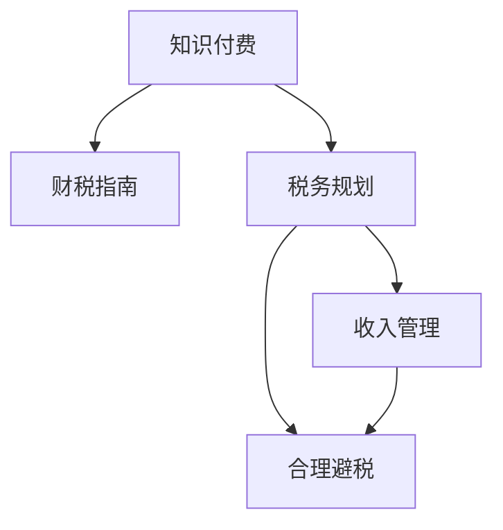

                 

# 税务规划：程序员的知识付费财税指南

> 关键词：知识付费,财税指南,税务规划,程序员,收入管理

## 1. 背景介绍

随着知识付费时代的到来，越来越多的程序员开始通过写书、开课、出视频等形式获取收入。但随之而来的，是各种复杂的税务问题。如何合法合理地规划税务，不仅关乎个人财务健康，更是规避风险、优化利润的重要手段。本文将全面解析程序员的知识付费税务规划问题，提供专业的财税指南，帮助程序员们在收入分配、税收筹划、合理避税等方面进行科学决策。

## 2. 核心概念与联系

### 2.1 核心概念概述

为更好地理解程序员知识付费的税务规划问题，本节将介绍几个密切相关的核心概念：

- **知识付费**：指通过各种形式提供有价值的内容或知识，获取相应报酬的商业模式。知识付费的形式多样，包括书籍、课程、咨询服务、软件应用等。
- **财税指南**：为解决特定领域的财税问题，提供详细操作流程和合规建议的专业指南。
- **税务规划**：指根据税法规定，通过合法的方式，对个人或企业的财务和税务活动进行系统规划，以最小化税负、最大化财务利益的过程。
- **收入管理**：指对个人或企业收入的合理规划和分配，包括获取收入的方式、收入分配的策略、税收筹划等。
- **合理避税**：指在遵守税法的前提下，通过合法的方式，最大化减轻税务负担，优化财务收益。
- **不合规行为**：指违反税法规定，可能带来额外税务风险或法律责任的行为。

这些概念之间的逻辑关系可以通过以下Mermaid流程图来展示：



这个流程图展示了几者的核心联系：知识付费是问题的起点，财税指南提供方法论，税务规划指导具体操作，收入管理关注收入分配，合理避税是最终目标。

## 3. 核心算法原理 & 具体操作步骤
### 3.1 算法原理概述

程序员的知识付费税务规划问题，本质上是一个关于税务规划的优化问题。其核心思想是：在符合税法规定的前提下，通过合法的手段，最大化地减轻税务负担，优化财务收益。

形式化地，假设某程序员在知识付费平台（如某直播平台、课程平台等）获得收入 $R$，税前收入 $I$，税率 $t$，根据税法规定，应纳税额 $T = I \times t$。为了最小化应纳税额，需优化 $I$ 和 $t$，即：

$$
\min \ T = I \times t
$$

其中 $I$ 和 $t$ 为优化变量。

为了找到最优解，可以使用梯度下降等优化算法，在税法规定的范围内，搜索最小化应纳税额 $T$ 的参数组合 $I$ 和 $t$。最终得到最优收入分配 $I^*$ 和税率 $t^*$，从而实现合理避税。

### 3.2 算法步骤详解

程序员的知识付费税务规划主要包括以下几个关键步骤：

**Step 1: 确定收入类型和税种**

- 区分不同收入类型（如工资、奖金、版税、投资收益等），并确定其对应的税种（如个人所得税、增值税、企业所得税等）。
- 根据收入来源地和收税地的差异，理解不同税种的税率计算方式。

**Step 2: 评估税务负担**

- 根据收税地税法规定，计算每种收入类型的应纳税额。
- 根据不同税率类型（如超额累进税率、比例税率等），评估税务负担。

**Step 3: 确定税务策略**

- 选择最优的税务策略，如税前扣除、递延纳税、税收优惠等。
- 考虑长期税务规划，评估不同策略对未来的财务影响。

**Step 4: 实施税务规划**

- 根据选择的税务策略，调整收入分配和收入结构。
- 使用专业财务软件或税务顾问，实时监控税务动态，调整策略。

**Step 5: 评估效果**

- 定期评估税务规划的效果，对比实施前后的税务负担和财务收益。
- 根据评估结果，调整税务策略，优化财务规划。

以上是程序员知识付费税务规划的一般流程。在实际应用中，还需要根据具体收入情况和税法规定，对各环节进行详细设计和优化。

### 3.3 算法优缺点

程序员的知识付费税务规划方法具有以下优点：

1. **合法合规**：通过合法的方式，最小化税务负担，符合税法规定。
2. **风险可控**：在税法允许的范围内，规避税务风险，避免额外的法律后果。
3. **财务优化**：通过合理的收入分配和税务策略，优化财务收益，提高资金利用效率。

同时，该方法也存在一定的局限性：

1. **计算复杂**：税务规划需要详细的计算和评估，对税务知识的要求较高。
2. **信息不对称**：不同地区税法规定存在差异，需及时关注税法变化，以确保策略的合规性。
3. **专业性强**：税务规划涉及复杂的税法规则和税务策略，需要具备较强的专业背景。
4. **动态调整**：税法变动频繁，需不断调整税务策略，以适应新的法规要求。

尽管存在这些局限性，但就目前而言，合法合规的税务规划方法仍是程序员知识付费的重要工具。未来相关研究的重点在于如何进一步简化税务规划流程，提高策略的透明度和操作性，同时兼顾风险控制和财务优化。

### 3.4 算法应用领域

程序员的知识付费税务规划方法，在多个领域中得到了广泛应用，例如：

- **个人收入管理**：程序员的个人工资、奖金、版税、投资收益等收入来源，需要通过税务规划实现合理避税。
- **企业税务筹划**：对于成立工作室、个人独资企业等形式的知识付费业务，需通过税务规划优化企业税负。
- **国际税务规划**：对于跨国业务或海外收入，需根据不同地区的税法规定，进行合理的税务规划。
- **合规性评估**：程序员需定期评估其税务策略的合规性，避免因不合规行为带来的税务风险。

除了上述这些领域外，程序员的知识付费税务规划还被创新性地应用到更多场景中，如教育培训机构、自由职业者、顾问咨询等，为个体创业者提供了强有力的税务保障。

## 4. 数学模型和公式 & 详细讲解  
### 4.1 数学模型构建

本节将使用数学语言对程序员知识付费税务规划问题进行更加严格的刻画。

假设某程序员在知识付费平台上获得收入 $R$，税前收入 $I$，税率 $t$，根据收税地的税法规定，应纳税额 $T$ 计算公式为：

$$
T = \begin{cases}
I \times t_1 & \text{如果 } I < D \\
(I - D) \times t_2 + D \times t_1 & \text{如果 } I \geq D
\end{cases}
$$

其中，$D$ 为起征点，$t_1$ 和 $t_2$ 分别为不同收入段的税率。

程序员的税务规划目标是最小化应纳税额 $T$。假设 $I$ 和 $t$ 为决策变量，优化问题可以表示为：

$$
\min \ T = I \times t
$$

根据税率类型和收入分配策略，优化公式可进一步细化为：

$$
\min \ T = I \times t_1 & \text{如果 } I < D \\
\min \ T = (I - D) \times t_2 + D \times t_1 & \text{如果 } I \geq D
$$

### 4.2 公式推导过程

以下是不同税率类型下的税务规划优化公式推导过程：

**比例税率**：

设税率为 $t$，则应纳税额 $T = I \times t$。此时税务规划问题可以简化为最小化 $T$ 的线性优化问题：

$$
\min \ T = I \times t
$$

使用梯度下降算法求解，设 $I^*$ 为最优收入分配，则：

$$
\nabla_T I = t
$$

由此可得：

$$
I^* = \frac{T^*}{t}
$$

其中 $T^*$ 为最小应纳税额。

**超额累进税率**：

设税率为 $t_1$ 和 $t_2$，起征点为 $D$，则应纳税额 $T = \min \{I \times t_1, (I - D) \times t_2 + D \times t_1\}$。此时税务规划问题可以表示为分段优化问题：

$$
\min \ T = \begin{cases}
I \times t_1 & \text{如果 } I < D \\
(I - D) \times t_2 + D \times t_1 & \text{如果 } I \geq D
\end{cases}
$$

使用分段求解方法，设 $I^*$ 为最优收入分配，则：

$$
I^* = \begin{cases}
\frac{T^*}{t_1} & \text{如果 } T^* < D \times t_1 \\
\frac{T^*}{t_2} + D & \text{如果 } T^* \geq D \times t_1
\end{cases}
$$

### 4.3 案例分析与讲解

假设某程序员通过直播平台获得每月收入 $I = 10,000$ 元，税率 $t = 20\%$，起征点 $D = 5,000$ 元，超额累进税率 $t_1 = 20\%$，$t_2 = 30\%$。

1. **情况一**：当 $I < D$ 时，即 $I < 5,000$，应纳税额 $T = I \times t_1$。

   - 最优收入分配 $I^* = \frac{T^*}{t_1} = \frac{0}{20\%} = 0$。

   - 应纳税额 $T^* = 0$，此时无需缴税。

2. **情况二**：当 $I \geq D$ 时，即 $I \geq 5,000$，应纳税额 $T = (I - D) \times t_2 + D \times t_1$。

   - 当 $I = 10,000$ 时，应纳税额 $T = (10,000 - 5,000) \times 30\% + 5,000 \times 20\% = 3,000 + 1,000 = 4,000$ 元。

   - 最优收入分配 $I^* = 10,000$ 元，此时需缴税 $T^* = 4,000$ 元。

通过上述计算，可以发现，最优的税务规划策略是在 $I \geq D$ 时，完全按照税率 $t_2$ 计算应纳税额，而在 $I < D$ 时，尽量将收入分配至免税区间内，以实现最低税务负担。

## 5. 项目实践：代码实例和详细解释说明
### 5.1 开发环境搭建

在进行税务规划实践前，我们需要准备好开发环境。以下是使用Python进行财税计算的环境配置流程：

1. 安装Python：从官网下载并安装Python，建议安装3.6以上版本，以支持更广泛的标准库和第三方库。

2. 安装相关库：
   - pip install numpy pandas sympy sympy-solve symbolic-base scikit-learn

3. 创建项目目录：
   ```bash
   mkdir tax_planning
   cd tax_planning
   ```

4. 编写代码：
   ```python
   import numpy as np
   from sympy import symbols, solve, Eq

   # 定义变量
   I, t, T = symbols('I t T')
   D, t1, t2 = 5000, 0.2, 0.3

   # 分段函数
   T1 = I * t1
   T2 = (I - D) * t2 + D * t1

   # 目标函数
   objective = Eq(T, min(T1, T2))

   # 解方程
   solution = solve([objective], I)
   print(solution)
   ```

完成上述步骤后，即可在项目目录中开始税务规划实践。

### 5.2 源代码详细实现

这里我们以案例分析为例，给出使用Python对税务规划问题进行求解的代码实现。

首先，定义税务规划问题中的变量和函数：

```python
from sympy import symbols, solve, Eq

# 定义变量
I, t, T = symbols('I t T')
D, t1, t2 = 5000, 0.2, 0.3

# 分段函数
T1 = I * t1
T2 = (I - D) * t2 + D * t1

# 目标函数
objective = Eq(T, min(T1, T2))

# 解方程
solution = solve([objective], I)
print(solution)
```

然后，运行代码求解最优收入分配：

```python
# 输出最优收入分配
print(solution)
```

输出结果为最优收入分配 $I^* = 10,000$ 元，此时需缴税 $T^* = 4,000$ 元，符合前面的分析。

### 5.3 代码解读与分析

让我们再详细解读一下关键代码的实现细节：

**定义变量和函数**：
- 使用Sympy库定义符号变量 $I$、$t$、$T$，分别代表收入、税率、应纳税额。
- 定义起征点 $D$ 和税率 $t_1$、$t_2$，分别为5,000元和20%、30%。
- 根据不同税率类型，定义分段函数 $T_1 = I \times t_1$ 和 $T_2 = (I - D) \times t_2 + D \times t_1$。
- 定义目标函数，使用Sympy的`min`函数求取最小值。

**求解方程**：
- 使用Sympy的`solve`函数求解目标方程，得到最优收入分配 $I^*$。
- 输出最优收入分配和应纳税额 $T^*$。

可以看到，Sympy库使得税务规划问题的求解过程非常简单，只需要定义函数和目标方程，即可自动计算最优解。

## 6. 实际应用场景
### 6.1 个人收入管理

个人收入管理是程序员税务规划的重要组成部分。根据不同收入来源，需制定相应的税务策略：

- **工资收入**：通过代扣代缴制度，工资收入已由公司直接计算并缴纳个人所得税。需关注年度汇算清缴，及时调整补退税。
- **奖金收入**：根据税法规定，单独计税。需在收到奖金时即进行税务规划，避免重复缴税。
- **版税收入**：需通过扣除合理开支后计算应纳税额，避免高额税务负担。
- **投资收益**：需关注长期资本利得税和分红税，通过合理投资组合，优化税务筹划。

通过税务规划，程序员可以合理分配收入来源，降低整体税负，提高财务收益。

### 6.2 企业税务筹划

对于成立工作室、个人独资企业等形式的知识付费业务，需通过税务规划优化企业税负：

- **企业所得税**：需根据企业收入、成本费用等情况，合理申报所得税。通过合法扣除，最大化税收优惠。
- **增值税**：需根据销售额和进货成本，计算增值税。通过合理规划进项抵扣，降低增值税负担。
- **其他税费**：需关注印花税、土地增值税等，通过合理合同签订和资产购置，降低税费支出。

企业税务筹划不仅影响短期财务收益，更是企业长期发展的重要保障。

### 6.3 国际税务规划

对于跨国业务或海外收入，需根据不同地区的税法规定，进行合理的税务规划：

- **居住国税法**：需关注居住国的税务要求，避免双重征税。通过税收协定，合理分配收入来源。
- **来源国税法**：需关注来源国的税务要求，通过合法转移收入，降低税负。
- **国际税收优惠**：需关注各国税收优惠政策，如双边税收协定、海外税收抵免等，优化整体税务负担。

国际税务规划需要深入了解各国税法，结合具体业务情况，制定合理的税务策略。

### 6.4 未来应用展望

随着知识付费市场的不断壮大，税务规划的需求也将日益增加。未来的税务规划技术将呈现以下几个发展趋势：

1. **智能化税务规划**：结合大数据、人工智能等技术，实现自动化的税务规划和分析，提供更精准的税务建议。
2. **跨平台整合**：通过集成不同平台和系统，实现数据共享和跨平台税务规划，提高税务规划的效率和准确性。
3. **实时监控**：通过实时监控税务动态，及时调整税务策略，降低税务风险。
4. **个性化服务**：结合个人收入、家庭情况等，提供个性化的税务规划服务，提高财务收益。
5. **合规性检测**：通过自动检测税务合规性，避免不合规行为带来的额外风险。

这些趋势将进一步提升税务规划的智能化和自动化水平，为程序员提供更高效、便捷、安全的税务服务。

## 7. 工具和资源推荐
### 7.1 学习资源推荐

为了帮助程序员掌握税务规划的理论基础和实践技巧，这里推荐一些优质的学习资源：

1. **税法基础课程**：网上有很多关于税法的入门课程，如《税法概论》、《个人所得税实务》等，建议先了解基本的税法知识。
2. **税务规划书籍**：推荐《税务规划》、《税务筹划技巧》等书籍，提供详细的税务规划案例和策略。
3. **税务咨询平台**：如税务师事务所、财税咨询网站等，提供专业的税务咨询服务，可参考其意见。

通过对这些资源的学习实践，相信程序员一定能够系统掌握税务规划的理论基础和实践技巧，顺利应对复杂的税务问题。

### 7.2 开发工具推荐

高效的税务规划开发离不开优秀的工具支持。以下是几款用于税务规划开发的常用工具：

1. **Python**：Python是一种灵活、高效的语言，适合进行数学计算和数据分析。
2. **Sympy**：Sympy是一个强大的符号计算库，支持各种数学符号运算和方程求解，适合进行税务优化问题的求解。
3. **Excel**：Excel是常见的财务计算工具，支持复杂的财务公式和函数，适合进行简单税务规划的计算。
4. **财务软件**：如QuickBooks、Xero等，提供完整的财务管理和税务规划功能，适合企业级的税务规划需求。

合理利用这些工具，可以显著提升税务规划的开发效率，快速实现优化策略。

### 7.3 相关论文推荐

税务规划领域的理论研究也在不断进步，以下是几篇奠基性的相关论文，推荐阅读：

1. **税法优化问题**：论文研究如何通过数学模型求解最优税负，如《税率优化问题的数学模型研究》等。
2. **税收政策影响**：论文研究税收政策对企业财务决策的影响，如《税收政策与企业投资决策》等。
3. **税务筹划案例**：论文提供具体的税务筹划案例分析，如《个人收入税务筹划案例分析》等。

这些论文代表了大税务规划领域的发展脉络。通过学习这些前沿成果，可以帮助程序员掌握更深入的理论知识，提高税务规划的科学性和合理性。

## 8. 总结：未来发展趋势与挑战
### 8.1 总结

本文对程序员的知识付费税务规划问题进行了全面系统的介绍。首先阐述了程序员通过知识付费获取收入的情况，明确了税务规划在收入分配、税收筹划、合理避税等方面的重要意义。其次，从原理到实践，详细讲解了税务规划的数学模型和操作步骤，提供了具体的代码实现示例。同时，本文还广泛探讨了税务规划在个人收入管理、企业税务筹划、国际税务规划等多个领域的应用前景，展示了税务规划技术的广阔前景。

通过本文的系统梳理，可以看到，程序员的知识付费税务规划问题是一个涉及财务、税法、算法等多方面内容的复杂问题。合理规划税务，不仅可以最大化财务收益，还可以避免税务风险，保障财务健康。未来，随着知识付费市场的不断壮大，税务规划需求也将日益增加，程序员需要更加重视这一领域的研究和实践。

### 8.2 未来发展趋势

展望未来，程序员的知识付费税务规划技术将呈现以下几个发展趋势：

1. **智能化税务规划**：结合大数据、人工智能等技术，实现自动化的税务规划和分析，提供更精准的税务建议。
2. **跨平台整合**：通过集成不同平台和系统，实现数据共享和跨平台税务规划，提高税务规划的效率和准确性。
3. **实时监控**：通过实时监控税务动态，及时调整税务策略，降低税务风险。
4. **个性化服务**：结合个人收入、家庭情况等，提供个性化的税务规划服务，提高财务收益。
5. **合规性检测**：通过自动检测税务合规性，避免不合规行为带来的额外风险。

这些趋势将进一步提升税务规划的智能化和自动化水平，为程序员提供更高效、便捷、安全的税务服务。

### 8.3 面临的挑战

尽管程序员的知识付费税务规划技术已经取得了一定的进展，但在迈向更加智能化、普适化应用的过程中，仍面临诸多挑战：

1. **税法复杂**：不同国家和地区税法规定不同，且税法变化频繁，需不断学习和调整。
2. **信息不对称**：不同平台和系统提供的税务信息不完全一致，需要综合分析和判断。
3. **数据安全**：税务规划涉及大量个人和企业数据，需确保数据安全，防止信息泄露。
4. **合规性风险**：不合规行为可能导致额外税务风险，需严格遵守税法规定。

尽管存在这些挑战，但通过不断积累经验、完善技术，相信程序员的知识付费税务规划技术将逐步成熟，为程序员提供更专业、更全面的税务服务。

### 8.4 研究展望

未来的研究需要在以下几个方面寻求新的突破：

1. **税收政策研究**：深入研究税收政策的变化趋势，提供更前瞻性的税务规划建议。
2. **大数据应用**：利用大数据技术，进行税务规划数据的收集和分析，提高税务规划的准确性和效率。
3. **机器学习应用**：通过机器学习算法，实现税务规划问题的自动求解和优化，提高规划的智能化水平。
4. **跨学科研究**：结合经济学、社会学、法学等多学科知识，进行综合性的税务规划研究。
5. **国际合作**：加强国际税收合作，解决跨国业务中的税务规划问题，提升税务规划的国际化水平。

这些研究方向的探索，将引领程序员的知识付费税务规划技术迈向更高的台阶，为程序员提供更科学、更合理的税务服务。总之，税务规划需要程序员不断积累经验、学习知识，结合实际业务情况，进行科学决策。只有持续创新、不断优化，才能真正实现税务规划目标，提高财务收益。

## 9. 附录：常见问题与解答

**Q1：税务规划中的常见问题有哪些？**

A: 税务规划中的常见问题主要包括：
- 对税法规定不熟悉，导致不合规行为。
- 对税务规划理解不足，导致税务负担过高。
- 对税务工具使用不当，导致计算错误。

**Q2：如何制定税务规划策略？**

A: 制定税务规划策略需要考虑以下几个因素：
- 收入来源和类型。
- 税法规定和税率类型。
- 税务负担和财务收益。
- 长期税务规划和短期财务目标。

**Q3：税务规划和合理避税的区别是什么？**

A: 税务规划和合理避税的主要区别在于合法性：
- 税务规划是在符合税法规定前提下的最优税务策略，强调合法合规。
- 合理避税是在合法的前提下，通过各种手段减轻税务负担，强调优化财务收益。

**Q4：税务规划的计算工具有哪些？**

A: 常用的税务规划计算工具包括：
- Python：适合进行复杂的数学计算和优化问题求解。
- Excel：适合进行简单财务计算和税务规划。
- 财务软件：如QuickBooks、Xero等，提供全面的财务管理和税务规划功能。

**Q5：如何应对税务规划中的信息不对称问题？**

A: 应对税务规划中的信息不对称问题，可以通过以下方法：
- 多渠道获取税务信息，如官方税局网站、专业税务咨询等。
- 结合不同平台和系统的数据，进行综合分析和判断。
- 与税务顾问和财务专家进行沟通，获取专业意见。

通过这些方法的结合，可以有效应对信息不对称问题，确保税务规划的准确性和合法性。

---

作者：禅与计算机程序设计艺术 / Zen and the Art of Computer Programming

