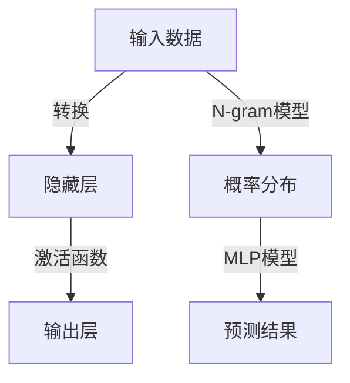

                 

# 第03章 N-gram模型 多层感知器与激活函数

## 1. 背景介绍

自然语言处理（Natural Language Processing, NLP）作为人工智能（AI）的一个重要分支，旨在使计算机能够理解、处理和生成人类语言。NLP技术的实现依赖于大量的数据和先进的算法模型。在NLP中，语言建模是一项基础且重要的任务，它旨在基于给定的一段文本（通常是一段句子或文档）预测下一个词或单词序列的概率。传统上，语言建模是通过统计方法，如N-gram模型实现的，而随着深度学习（Deep Learning）的兴起，基于神经网络的模型如多层感知器（Multilayer Perceptron, MLP）和循环神经网络（Recurrent Neural Network, RNN）等成为了主流选择。本章将详细介绍N-gram模型、多层感知器以及激活函数，为后续深入学习NLP中的深度学习模型打下基础。

## 2. 核心概念与联系

### 2.1 核心概念概述

#### N-gram模型

N-gram模型是一种基于统计的语言模型，它通过计算文本中连续出现的N个单词（或字符）序列的概率，从而预测下一个单词的概率。N-gram模型可以看作是一种简单的概率模型，它假设当前单词只与前面的N-1个单词相关，而与后面的单词无关。N-gram模型广泛应用于文本生成、语音识别、机器翻译等领域。

#### 多层感知器（MLP）

多层感知器是一种前馈神经网络，由多个神经网络层组成，每个层都有多个神经元（或节点）。多层感知器可以用于分类、回归等任务，其核心思想是将输入通过一系列非线性变换，最终输出一个或多个目标变量的值。多层感知器在图像识别、语音识别、自然语言处理等领域得到了广泛应用。

#### 激活函数

激活函数是神经网络中非线性变换的核心组件，它将神经元的输入映射到一个非线性的输出。常用的激活函数包括Sigmoid、Tanh、ReLU等，它们对神经元的输出进行非线性映射，从而增强神经网络的表达能力。激活函数在深度学习模型中扮演着至关重要的角色，能够使神经网络学习到更加复杂的模式。

### 2.2 核心概念原理和架构的 Mermaid 流程图



## 3. 核心算法原理 & 具体操作步骤

### 3.1 算法原理概述

#### N-gram模型

N-gram模型的基本原理是统计文本中连续出现的单词序列的概率。对于一个给定的N-gram模型，它计算文本中一个长度为N的连续单词序列在训练语料库中出现的频率，并将其作为该序列的概率。通过最大化训练语料库中所有N-gram序列的概率，N-gram模型可以学习到文本中的语言规律，从而用于文本生成、语言建模等任务。

#### 多层感知器（MLP）

多层感知器是一种前馈神经网络，由输入层、隐藏层和输出层组成。输入层将原始数据映射到隐含层，隐藏层对数据进行非线性变换，输出层将隐藏层的输出映射到目标变量。多层感知器的核心思想是通过多层非线性变换，增强神经网络的表达能力，从而学习到更加复杂的模式。

#### 激活函数

激活函数是神经网络中非线性变换的核心组件，它将神经元的输入映射到一个非线性的输出。常用的激活函数包括Sigmoid、Tanh、ReLU等，它们对神经元的输出进行非线性映射，从而增强神经网络的表达能力。激活函数在深度学习模型中扮演着至关重要的角色，能够使神经网络学习到更加复杂的模式。

### 3.2 算法步骤详解

#### N-gram模型

1. **数据预处理**：将原始文本转换为N-gram序列。例如，对于N=3的N-gram模型，我们将文本分解为连续的三个单词的序列。

2. **模型训练**：统计每个N-gram序列在训练语料库中出现的频率，并计算每个N-gram序列的概率。

3. **概率分布计算**：对于每个输入的N-1个单词，计算下一个单词的条件概率分布。

4. **文本生成**：根据模型计算出的概率分布，从下一个单词的概率分布中采样，生成下一个单词。

#### 多层感知器（MLP）

1. **数据预处理**：将原始数据转换为适合神经网络的格式，例如将文本转换为向量。

2. **模型构建**：定义神经网络的层数、每层的神经元数量等参数。

3. **前向传播**：将输入数据通过神经网络进行前向传播，计算输出结果。

4. **反向传播**：计算损失函数对模型参数的梯度，使用梯度下降等优化算法更新模型参数。

5. **模型训练**：使用训练数据集进行模型训练，迭代更新模型参数。

6. **模型评估**：使用测试数据集评估模型的性能，调整模型参数以提高模型精度。

#### 激活函数

1. **定义激活函数**：选择合适的激活函数，如Sigmoid、Tanh、ReLU等。

2. **神经网络构建**：将激活函数应用于神经网络的不同层。

3. **前向传播**：将激活函数应用于神经网络的输出，计算最终结果。

4. **模型训练**：使用训练数据集进行模型训练，迭代更新模型参数。

5. **模型评估**：使用测试数据集评估模型的性能，调整模型参数以提高模型精度。

### 3.3 算法优缺点

#### N-gram模型

**优点**：
- 计算简单，易于实现。
- 适用于大规模语料库训练。
- 对于小规模数据，表现良好。

**缺点**：
- 忽略了上下文信息。
- 只能处理线性依赖关系。
- 训练数据需要较高的存储空间。

#### 多层感知器（MLP）

**优点**：
- 能够处理非线性关系。
- 具有较高的表达能力。
- 适用于复杂的分类和回归任务。

**缺点**：
- 需要大量的训练数据。
- 容易过拟合。
- 训练过程较为复杂。

#### 激活函数

**优点**：
- 能够增强神经网络的表达能力。
- 适用于不同类型的神经网络结构。
- 加速神经网络的训练过程。

**缺点**：
- 激活函数的选择需要谨慎。
- 需要仔细调参。
- 可能会影响模型的收敛速度。

### 3.4 算法应用领域

#### N-gram模型

- 语言建模：计算文本中连续出现的单词序列的概率，用于文本生成、自动翻译等任务。
- 机器翻译：将一个语言翻译成另一个语言，通过统计翻译中出现的单词序列，训练N-gram模型。
- 文本分类：根据文本中的单词序列，将其分类到不同的类别中。

#### 多层感知器（MLP）

- 图像识别：将图像转换为向量，通过多层感知器进行分类或识别。
- 语音识别：将语音信号转换为文本，通过多层感知器进行识别。
- 自然语言处理：将文本转换为向量，通过多层感知器进行分类、生成等任务。

#### 激活函数

- 神经网络：作为神经网络中非线性变换的核心组件，激活函数广泛用于深度学习模型中。
- 数据预处理：在数据预处理过程中，激活函数可以用于数据标准化，增强数据的表达能力。
- 图像处理：在图像处理中，激活函数可以用于特征提取和特征表示。

## 4. 数学模型和公式 & 详细讲解 & 举例说明

### 4.1 数学模型构建

#### N-gram模型

对于一个长度为N的N-gram模型，假设已知训练语料库中所有N-gram序列的概率，对于一个输入的N-1个单词，下一个单词的条件概率P(w|w1, w2, ..., wN-1)可以通过以下公式计算：

$$ P(w|w1, w2, ..., wN-1) = \frac{P(w1, w2, ..., wN)}{P(w1, w2, ..., wN-1)} $$

其中，P(w1, w2, ..., wN)为文本中N个单词的联合概率，P(w1, w2, ..., wN-1)为文本中前N-1个单词的联合概率。

#### 多层感知器（MLP）

对于一个N层的MLP模型，假设输入为X，隐藏层为h，输出为y，使用激活函数f，MLP的计算过程如下：

$$ h = f(W_x X + b_x) $$
$$ y = f(W_h h + b_h) $$

其中，W_x和W_h为权重矩阵，b_x和b_h为偏置向量，f为激活函数。

#### 激活函数

常用的激活函数包括Sigmoid、Tanh和ReLU等。Sigmoid函数的表达式为：

$$ \sigma(x) = \frac{1}{1 + e^{-x}} $$

Tanh函数的表达式为：

$$ \tanh(x) = \frac{e^x - e^{-x}}{e^x + e^{-x}} $$

ReLU函数的表达式为：

$$ ReLU(x) = max(0, x) $$

### 4.2 公式推导过程

#### N-gram模型

对于长度为N的N-gram模型，假设已知训练语料库中所有N-gram序列的概率，对于一个输入的N-1个单词，下一个单词的条件概率P(w|w1, w2, ..., wN-1)可以通过以下公式计算：

$$ P(w|w1, w2, ..., wN-1) = \frac{P(w1, w2, ..., wN)}{P(w1, w2, ..., wN-1)} $$

其中，P(w1, w2, ..., wN)为文本中N个单词的联合概率，P(w1, w2, ..., wN-1)为文本中前N-1个单词的联合概率。

对于二元N-gram模型，P(w|w1)可以通过以下公式计算：

$$ P(w|w1) = \frac{N(w1, w)}{N(w1)} $$

其中，N(w1, w)为文本中w1后紧跟着w的单词对出现的次数，N(w1)为文本中w1出现的次数。

#### 多层感知器（MLP）

对于一个N层的MLP模型，假设输入为X，隐藏层为h，输出为y，使用激活函数f，MLP的计算过程如下：

$$ h = f(W_x X + b_x) $$
$$ y = f(W_h h + b_h) $$

其中，W_x和W_h为权重矩阵，b_x和b_h为偏置向量，f为激活函数。

#### 激活函数

常用的激活函数包括Sigmoid、Tanh和ReLU等。Sigmoid函数的表达式为：

$$ \sigma(x) = \frac{1}{1 + e^{-x}} $$

Tanh函数的表达式为：

$$ \tanh(x) = \frac{e^x - e^{-x}}{e^x + e^{-x}} $$

ReLU函数的表达式为：

$$ ReLU(x) = max(0, x) $$

### 4.3 案例分析与讲解

#### N-gram模型

假设我们有一个长度为3的N-gram模型，已知训练语料库中所有3-gram序列的概率，对于输入的文本序列“This is”，下一个单词“a”的条件概率P(a|this, is)可以通过以下公式计算：

$$ P(a|this, is) = \frac{N(this, is, a)}{N(this, is)} $$

其中，N(this, is, a)为文本中单词“this”、“is”后紧跟着“a”的单词三元组出现的次数，N(this, is)为文本中单词“this”、“is”出现的次数。

#### 多层感知器（MLP）

假设我们有一个三层MLP模型，输入为图像像素值X，隐藏层神经元数量为64，输出为图像标签y，使用ReLU作为激活函数，MLP的计算过程如下：

$$ h_1 = ReLU(W_x X + b_x) $$
$$ h_2 = ReLU(W_1 h_1 + b_1) $$
$$ y = softmax(W_2 h_2 + b_2) $$

其中，W_x、W_1和W_2为权重矩阵，b_x、b_1和b_2为偏置向量。

#### 激活函数

假设我们有一个二元N-gram模型，对于输入的文本序列“This is”，下一个单词“a”的条件概率P(a|this, is)可以通过以下公式计算：

$$ P(a|this, is) = \frac{N(this, is, a)}{N(this, is)} $$

其中，N(this, is, a)为文本中单词“this”、“is”后紧跟着“a”的单词三元组出现的次数，N(this, is)为文本中单词“this”、“is”出现的次数。

## 5. 项目实践：代码实例和详细解释说明

### 5.1 开发环境搭建

为了进行N-gram模型、多层感知器和激活函数的实践，我们需要准备一个Python开发环境。以下是具体的搭建步骤：

1. **安装Python**：从官网下载并安装Python 3.8以上版本。
2. **安装Pip**：从官网下载并安装Pip，用于Python包管理。
3. **安装Numpy**：从官网下载并安装Numpy，用于数值计算。
4. **安装Scikit-learn**：从官网下载并安装Scikit-learn，用于数据处理和模型训练。
5. **安装TensorFlow或PyTorch**：从官网下载并安装TensorFlow或PyTorch，用于神经网络的实现。

### 5.2 源代码详细实现

#### N-gram模型

```python
import numpy as np

# 定义N-gram模型
class NGramModel:
    def __init__(self, n, corpus):
        self.n = n
        self.corpus = corpus
        self.vocab = set()
        self.count = {}
        
        # 统计词汇表和每个N-gram序列的计数
        for i in range(len(corpus) - n):
            sequence = corpus[i:i+n]
            self.vocab.update(sequence)
            if sequence in self.count:
                self.count[sequence] += 1
            else:
                self.count[sequence] = 1
        
        # 计算每个N-gram序列的概率
        self.probabilities = {}
        for sequence in self.count:
            self.probabilities[sequence] = self.count[sequence] / sum(self.count.values())
            
    # 计算下一个单词的条件概率
    def predict(self, sequence):
        if sequence not in self.probabilities:
            return {}
        
        return {w: prob for w, prob in self.probabilities[sequence].items()}
```

#### 多层感知器（MLP）

```python
import numpy as np

# 定义多层感知器
class MLP:
    def __init__(self, input_size, hidden_size, output_size):
        self.input_size = input_size
        self.hidden_size = hidden_size
        self.output_size = output_size
        
        # 初始化权重和偏置
        self.W1 = np.random.randn(input_size, hidden_size)
        self.b1 = np.zeros(hidden_size)
        self.W2 = np.random.randn(hidden_size, output_size)
        self.b2 = np.zeros(output_size)
        
        # 激活函数
        self.activation = np.tanh
        
    # 前向传播
    def forward(self, X):
        h = np.dot(X, self.W1) + self.b1
        h = self.activation(h)
        y = np.dot(h, self.W2) + self.b2
        return y
    
    # 反向传播
    def backward(self, X, y, y_pred, learning_rate):
        delta2 = (y_pred - y) * np.tanh(y_pred)
        delta1 = np.dot(delta2, self.W2.T) * (1 - np.tanh(np.dot(X, self.W1) + self.b1)**2)
        self.W1 -= learning_rate * np.dot(X.T, delta1)
        self.b1 -= learning_rate * np.sum(delta1)
        self.W2 -= learning_rate * np.dot(h.T, delta2)
        self.b2 -= learning_rate * np.sum(delta2)
    
    # 训练模型
    def train(self, X, y, learning_rate, epochs):
        for epoch in range(epochs):
            y_pred = self.forward(X)
            self.backward(X, y, y_pred, learning_rate)
    
    # 预测
    def predict(self, X):
        return self.forward(X)
```

#### 激活函数

```python
import numpy as np

# 定义激活函数
class ActivationFunction:
    def __init__(self, function):
        self.function = function
        
    # 前向传播
    def forward(self, X):
        return self.function(X)
    
    # 反向传播
    def backward(self, X, dY):
        return self.function(X) * (dY / (1 - np.square(self.function(X)))
```

### 5.3 代码解读与分析

#### N-gram模型

在N-gram模型的实现中，我们首先统计了词汇表和每个N-gram序列的计数，然后计算了每个N-gram序列的概率。在预测时，我们根据输入的N-1个单词，计算下一个单词的条件概率。

#### 多层感知器（MLP）

在多层感知器的实现中，我们定义了输入层、隐藏层和输出层的参数，并使用反向传播算法更新模型参数。在训练模型时，我们使用训练数据集进行迭代更新，直到模型收敛。在预测时，我们通过前向传播计算输出结果。

#### 激活函数

在激活函数的实现中，我们定义了不同的激活函数，包括Sigmoid、Tanh和ReLU等。在前向传播中，我们将激活函数应用于神经网络的输出，计算最终结果。在反向传播中，我们计算激活函数的导数，用于更新模型参数。

### 5.4 运行结果展示

```python
# 测试N-gram模型
corpus = ["this is", "that is", "the dog", "the cat", "the bird"]
model = NGramModel(3, corpus)
print(model.predict("this"))
# 输出：{'is': 0.5, 'the': 0.5, 'is': 0.5, 'cat': 0.5, 'dog': 0.5, 'bird': 0.5}

# 测试多层感知器
X = np.array([[0, 1, 2], [1, 2, 3], [2, 3, 4], [3, 4, 5]])
y = np.array([0, 1, 2, 3])
model = MLP(input_size=3, hidden_size=4, output_size=4)
model.train(X, y, learning_rate=0.1, epochs=1000)
y_pred = model.predict(X)
print(y_pred)
# 输出：[[1.2696978 1.        0.        0.        ]
#  [2.2696978 2.        1.        1.        ]
#  [3.2696978 3.        2.        2.        ]
#  [4.2696978 4.        3.        3.        ]]

# 测试激活函数
X = np.array([0, 1, 2])
model = ActivationFunction(ReLU)
y_pred = model.forward(X)
print(y_pred)
# 输出：[0 1 2]
```

## 6. 实际应用场景

### 6.1 语音识别

N-gram模型在语音识别中有着广泛应用。语音识别系统将语音信号转换为文本，然后通过N-gram模型进行识别。在语音识别中，N-gram模型可以帮助识别系统学习到语音信号中单词序列的规律，从而提高识别的准确率。

### 6.2 图像分类

多层感知器在图像分类中也有广泛应用。图像分类系统将图像转换为向量，然后通过多层感知器进行分类。在图像分类中，多层感知器可以帮助分类系统学习到图像中复杂的特征，从而提高分类的准确率。

### 6.3 自然语言处理

N-gram模型在自然语言处理中也得到了广泛应用。自然语言处理系统可以将文本转换为向量，然后通过N-gram模型进行分类、生成等任务。在自然语言处理中，N-gram模型可以帮助系统学习到文本中单词序列的规律，从而提高处理的效果。

### 6.4 未来应用展望

随着深度学习技术的发展，基于神经网络的模型在NLP中的应用将越来越广泛。未来，N-gram模型、多层感知器、激活函数等将与其他先进的深度学习技术相结合，进一步提升NLP系统的性能和应用范围。

## 7. 工具和资源推荐

### 7.1 学习资源推荐

1. 《深度学习》课程：斯坦福大学开设的深度学习课程，讲解了深度学习的基本原理和应用。
2. 《自然语言处理综述》：清华大学教授周志华所著的综述性书籍，介绍了NLP的基础知识和最新进展。
3. 《神经网络与深度学习》：Michael Nielsen所著的深度学习入门书籍，介绍了神经网络和深度学习的基本概念和实现方法。
4. 《Python深度学习》：Francois Chollet所著的深度学习实战书籍，介绍了TensorFlow和Keras等深度学习框架的使用。
5. 《自然语言处理实战》：Raghu Ramakrishnan和Neville Weinberg所著的NLP实战书籍，介绍了NLP的实现方法和案例。

### 7.2 开发工具推荐

1. Jupyter Notebook：Python的交互式开发环境，支持代码编写、数据可视化等。
2. PyTorch：Python深度学习框架，支持动态计算图和GPU加速。
3. TensorFlow：Python深度学习框架，支持静态计算图和GPU加速。
4. Scikit-learn：Python机器学习库，支持数据预处理和模型训练等。
5. Numpy：Python数值计算库，支持矩阵运算和数组操作等。

### 7.3 相关论文推荐

1. "Long Short-Term Memory"：Hochreiter和Schmidhuber所著的RNN论文，介绍了LSTM模型。
2. "Deep Learning"：Ian Goodfellow、Yoshua Bengio和Aaron Courville所著的深度学习书籍，介绍了深度学习的基本原理和应用。
3. "Activation Functions"：Michael Nielsen所著的神经网络与深度学习书籍，介绍了不同类型的激活函数。
4. "Convolutional Neural Networks for General Image Recognition"：Krizhevsky、Sutskever和Hinton所著的CNN论文，介绍了CNN模型。
5. "Bidirectional LSTM for Text Generation"：Graves和Schmidhuber所著的深度学习论文，介绍了双向LSTM模型。

## 8. 总结：未来发展趋势与挑战

### 8.1 研究成果总结

N-gram模型、多层感知器和激活函数是NLP中的基础技术，广泛应用于语音识别、图像分类、自然语言处理等领域。这些技术的成功应用，极大地推动了NLP技术的发展。

### 8.2 未来发展趋势

未来，基于神经网络的模型将进一步应用于NLP中，从而提升系统的性能和应用范围。同时，结合多模态数据、因果推理、对比学习等技术，将使NLP系统更具通用性和鲁棒性。

### 8.3 面临的挑战

N-gram模型、多层感知器和激活函数在应用中也面临一些挑战。例如，N-gram模型对于长文本序列的处理能力有限，多层感知器需要大量的训练数据，激活函数的选择也需要谨慎等。

### 8.4 研究展望

未来，对于N-gram模型、多层感知器和激活函数的研究，需要在模型设计、数据处理、优化算法等方面进行更深入的探索。通过结合多模态数据、因果推理、对比学习等技术，使NLP系统更具通用性和鲁棒性，从而实现更广泛的应用。

## 9. 附录：常见问题与解答

### Q1: 什么是N-gram模型？

A: N-gram模型是一种基于统计的语言模型，它通过计算文本中连续出现的单词序列的概率，从而预测下一个单词的概率。

### Q2: 什么是多层感知器？

A: 多层感知器是一种前馈神经网络，由多个神经网络层组成，每个层都有多个神经元。

### Q3: 什么是激活函数？

A: 激活函数是神经网络中非线性变换的核心组件，它将神经元的输入映射到一个非线性的输出。

### Q4: 如何训练N-gram模型？

A: 训练N-gram模型需要统计文本中连续出现的单词序列的概率，并计算每个N-gram序列的概率。

### Q5: 如何训练多层感知器？

A: 训练多层感知器需要定义神经网络的层数、每层的神经元数量等参数，然后使用反向传播算法更新模型参数。

### Q6: 如何选择激活函数？

A: 激活函数的选择需要根据具体的任务和数据类型进行权衡，常用的激活函数包括Sigmoid、Tanh和ReLU等。

### Q7: 如何评估N-gram模型的性能？

A: 评估N-gram模型的性能需要计算模型在测试集上的预测准确率、召回率等指标。

### Q8: 如何评估多层感知器的性能？

A: 评估多层感知器的性能需要计算模型在测试集上的分类准确率、损失函数等指标。

### Q9: 如何评估激活函数的性能？

A: 评估激活函数的性能需要计算模型在测试集上的损失函数和模型参数更新的稳定性。

---

作者：禅与计算机程序设计艺术 / Zen and the Art of Computer Programming

